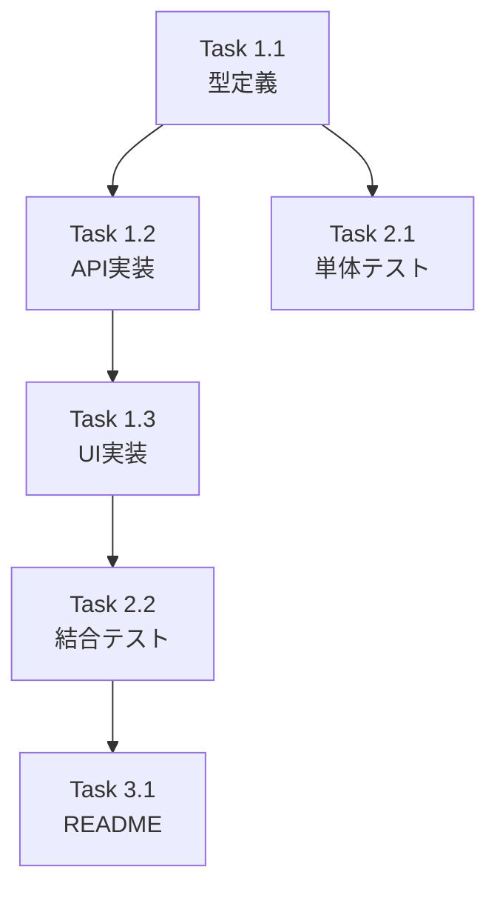

# 作業計画立案スキル（Issue単位）

## 概要
Issue単位での具体的な作業計画を立案し、実装タスクの詳細化を策定するスキルです。

## 使用方法
- `/work-plan [Issue番号または概要]`
- 「Issue #123の作業計画を立案してください」

## 前提条件
- 対象Issueの概要と要件が明確
- GitHubリポジトリにアクセス可能

## 実行内容

あなたはテックリードです。1つのIssue実装のための具体的な作業計画を立案してください：

### 1. Issue概要の確認

まずIssue情報を取得します：

```bash
gh issue view {issue_number} --json number,title,body,labels,assignees
```

以下の形式で概要をまとめます：

```markdown
## Issue: [タイトル]
**Issue番号**: #XXX
**サイズ**: S/M/L
**優先度**: High/Medium/Low
**依存Issue**: #YYY（あれば）
```

### 2. 詳細タスク分解

#### 実装タスク（Phase 1）
- [ ] **Task 1.1**: データモデル/型定義
  - 成果物: `src/types/xxx.ts`
  - 依存: なし

- [ ] **Task 1.2**: APIエンドポイント実装
  - 成果物: `src/app/api/xxx/route.ts`
  - 依存: Task 1.1

- [ ] **Task 1.3**: UIコンポーネント実装
  - 成果物: `src/components/xxx.tsx`
  - 依存: Task 1.2

#### テストタスク（Phase 2）
- [ ] **Task 2.1**: 単体テスト
  - 成果物: `tests/unit/xxx.test.ts`
  - カバレッジ目標: 80%以上

- [ ] **Task 2.2**: 結合テスト
  - 成果物: `tests/integration/xxx.test.ts`

#### ドキュメントタスク（Phase 3）
- [ ] **Task 3.1**: README更新（必要な場合）
  - 成果物: `README.md`

### 3. タスク依存関係



### 4. 品質チェック項目

| チェック項目 | コマンド | 基準 |
|-------------|----------|------|
| ESLint | `npm run lint` | エラー0件 |
| TypeScript | `npx tsc --noEmit` | 型エラー0件 |
| Unit Test | `npm run test:unit` | 全テストパス |
| Build | `npm run build` | 成功 |

### 5. 成果物チェックリスト

#### コード
- [ ] 型定義ファイル
- [ ] APIエンドポイント
- [ ] UIコンポーネント

#### テスト
- [ ] 単体テスト
- [ ] 結合テスト

#### ドキュメント
- [ ] README更新（必要な場合）

#### 実行契約
- [ ] `.commandmate/tasks/issue-{issue_number}.yaml`（→ 「8. 実行契約の起案」）

### 6. Definition of Done

Issue完了条件：
- [ ] すべてのタスクが完了
- [ ] 単体テストカバレッジ80%以上
- [ ] CIチェック全パス（lint, type-check, test, build）
- [ ] コードレビュー承認
- [ ] ドキュメント更新完了

### 7. 次のアクション

作業計画承認後：
1. **ブランチ作成**: `feature/{issue_number}-[feature-name]`
2. **タスク実行**: 計画に従って実装
3. **進捗報告**: `/progress-report`で定期報告
4. **PR作成**: `/create-pr`で自動作成

### 8. 実行契約の起案

計画と同時に**実行契約**を起案します。契約は「何を達成するのか」「どのパスを変更してよいのか」「何が満たされたら完了なのか」を**着手前に宣言する**レビュー対象の成果物で、`/orchestrate` などの委任フローが `commandmate send --contract <path>` でそのまま消費します。

正準仕様: `docs/design/task-contract.md`（v1）／記入例: `.commandmate/tasks/example.yaml`

**出力**: `.commandmate/tasks/issue-{issue_number}.yaml`

| キー | 必須 | 書き方 |
|------|------|--------|
| `version` | ✅ | `1` 固定 |
| `title` | ✅ | 非空・最大200文字。`Issue #{issue_number}: <タイトル>` |
| `goal` | ✅ | 非空・最大8000文字。Issueの受入条件を**検証可能な形**で転記し、Issueへの参照URLを含める（送信メッセージ本文になる） |
| `scope.allow` | ✅ | 「2. 詳細タスク分解」で特定した影響ファイル群を worktree 相対 glob で列挙（`src/lib/foo/**` 粒度）。`docs/module-reference.md` のような定型追記先も忘れず含める |
| `scope.deny` | — | 許可範囲の内側で明示的に触らせたくないパスがあるときだけ |
| `verify.gates` | — | 既定は**キーごと省略**（＝全ゲート）。実行時間の制約で絞る場合は理由を yaml コメントに書く |
| `autoYes` / `success` | — | 既定値のままなら**明示不要** |

**契約エラーになる書き方**（`send --contract` が exit 2 で違反を全件列挙して停止する）:

- **未知キー**（トップレベル・各サブマップとも。v1は閉じた集合として扱われる）
- **`verify.gates: []`**（空リスト）。「全ゲートを走らせる」はキーの省略で表す
- `scope.allow` が空。`success.requireScopeClean` は既定 true のため、1件以上必ず書く
- `.commandmate/verify.yaml` に実在しないゲートidの指定（本リポジトリのidは `lint` / `typecheck` / `unit`）
- 絶対パス・`..` を含む scope パターン（契約は worktree の内側についてのみ語れる）

`scope.allow` の漏れは実走時に **scope ゲート不合格（`commandmate verify` の exit 20）** になります。なお `.commandmate/` 配下は scope ゲートで常に許可されるため、契約ファイル自身を `allow` に書く必要はありません。

**契約の置き場所と運用**

- `.commandmate/tasks/*.yaml` は **Git 追跡対象**（`.gitignore` の2段構え規則）。ランタイムデータではなくレビュー対象の成果物として扱う
- 人間が実装するフロー: feature ブランチにコミットし、PRレビューの対象に含める
- worktree 委任フロー: orchestrator が worktree へ契約を配布する。**送信前にコミットしておくこと** — 未コミットのまま置くと work-evidence ゲートが契約ファイル自体を作業証跡として数え、エージェントが何もしていない状態（exit 21）を検出できなくなる（契約ファイルの除外は #1580 で扱う）

## 出力フォーマット

GitHub Issueのコメントやプロジェクト管理ツールに転記可能なMarkdown形式。

実行契約は次の雛形をベースに `.commandmate/tasks/issue-{issue_number}.yaml` として出力します（`autoYes` / `success` は既定値のまま使うため省略しています）。

```yaml
# .commandmate/tasks/issue-123.yaml — v1
# 正準仕様: docs/design/task-contract.md
version: 1
title: "Issue #123: ダークモード追加"
goal: |
  https://github.com/Kewton/CommandMate/issues/123 の受入条件をすべて満たすこと。
  - [ ] `src/types/theme.ts` に Theme 型を追加し、既定を light とする
  - [ ] ヘッダのトグルでテーマが切り替わり、リロード後も選択が保持される
  - [ ] 単体テストを追加し、既存分を含めて `npm run test:unit` が通る
scope:
  # worktree ルートからの相対 glob。ディレクトリを書けば配下すべてが対象。
  allow:
    - "src/types/theme.ts"
    - "src/components/layout/**"
    - "tests/unit/components/**"
    - "docs/module-reference.md"
  deny: []
verify:
  # キーごと省略すると全ゲート。絞るときは理由をこのコメントに書く。
  gates: [lint, typecheck, unit]
```

## 出力先

- 作業計画: `dev-reports/issue/{issue_number}/work-plan.md`
- 実行契約: `.commandmate/tasks/issue-{issue_number}.yaml`
