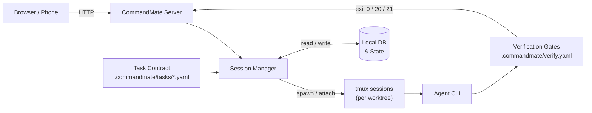

# CommandMate

[](https://github.com/Kewton/CommandMate)


**Status: Beta**

[English](./README.md) | [日本語](./docs/ja/README.md)

**[commandmate website →](https://kewton.github.io/CommandMate/)**

<p align="center">
  
</p>

> **From vibe coding to Vibe Engineering.**

Vibe Engineering — the AI does the building; the system, not your expertise, guarantees the engineering.

```bash
npx commandmate@latest
```

**From install to your first session in 60 seconds.** macOS / Linux / Windows (WSL2) · Node.js v22+ · npm · git · tmux

---

CommandMate adds the machinery — a contract before the work, verification gates after it, Skills that carry the method — on top of the agent CLIs you already use.
It does not replace tmux, Git worktrees, your terminal, or your agent CLI. It puts a frame around them, so the work arrives verified instead of merely finished.

<p align="center">
  
</p>

Works on desktop and mobile — monitor and steer sessions from any browser, including your phone.

If this is the kind of AI development workflow you want, [give the repo a star](https://github.com/Kewton/CommandMate).

---

## Key Features

| Feature | What it does | Why it matters |
|---------|-------------|----------------|
| **Task Contract** | Declare the goal, the changeable scope and the gates before the work starts, then `send --contract` hands them to the agent | The agent works to a written definition of done instead of guessing at one |
| **Verification Gates** | Gates declared in `.commandmate/verify.yaml` run through `verify` / `wait --verify` and return exit `0` / `20` / `21` | "Done" is what a verification run returned, not what the agent said |
| **Evidence & Metrics** | The built-in work-evidence and scope gates, plus `verify history`, `task show` and `report metrics` | Commits, gate logs and numbers are left behind for the next decision |
| **Skills Catalog** | Install and update official Skills per worktree, from the web UI or `commandmate skill` | The method is installed for the agent to read, not kept in someone's head |
| **Never miss a waiting agent** | A waiting agent shows up as a badge, a toast, the tab title, the PWA app badge and a push notification | You find out the moment an agent needs you, even away from the desk |
| **Git Worktree Sessions** | One session per worktree, parallel execution | Multiple issues progress simultaneously without interference |
| **Multi-Agent Support** | Choose Claude Code, Codex, Gemini CLI, Copilot, OpenCode, Antigravity, Command Code or local models per worktree | Pick the right agent for each task |
| **Auto Yes Mode** | Agent runs without stopping for confirmations | Optional unattended mode for trusted workflows — review the Security section before enabling |
| **Web UI (Desktop & Mobile)** | Full session control from any browser | Monitor and steer from your desk or your phone |
| **File Viewer & Markdown Editor** | Browse and edit worktree files in the browser | Review changes and update AI instructions without opening an IDE |
| **Screenshot Instructions** | Attach images to your prompts | Snap a bug → "Fix this" — the agent sees the screenshot |
| **Scheduled Execution** | Cron-based auto-run via CMATE.md | Daily reviews, nightly tests — agents work on a schedule |
| **Token Authentication** | SHA-256 hashed token + HTTPS + rate limiting | Secure remote access — no credentials leaked, brute-force protected |

---

## Use Cases

| Scenario | How CommandMate helps |
|----------|----------------------|
| **Parallel issue development** | Run multiple issues in separate worktrees, each with its own agent session |
| **Issue refinement** | Define an issue, let AI fill gaps, review before any code is written |
| **Overnight execution** | Queue issues with scheduled execution — check progress in the morning |
| **Mobile review** | Review AI-generated changes and steer direction from your phone |
| **Visual bug fix** | Snap a UI bug on your phone, send it with "Fix this" |

---

## Security

Runs **100% locally**. No external server, no cloud relay, no account required. The only network traffic is Claude CLI's own API calls.

- Fully open-source ([MIT License](./LICENSE))
- Local database, local sessions
- For remote access, use a tunneling service ([Cloudflare Tunnel](https://developers.cloudflare.com/cloudflare-one/connections/connect-networks/), [ngrok](https://ngrok.com/), [Pinggy](https://pinggy.io/)), a VPN, or an authenticated reverse proxy

See the [Security Guide](./docs/security-guide.md) and [Trust & Safety](./docs/en/TRUST_AND_SAFETY.md) for details.

---

## Install as an App (PWA)

CommandMate is a Progressive Web App. On a mobile browser, use **Add to Home Screen** to launch it full-screen (standalone), which is ideal for monitoring agents on the go. A Service Worker precaches static assets and shows an offline fallback screen; API responses, the login page, and WebSocket traffic are never cached.

> **HTTPS is required for installation.** Browsers only register a Service Worker (and offer install) on `https://` or `http://localhost`. When accessing a self-hosted instance over plain HTTP on the LAN (e.g. `http://192.168.x.x:3000`), install and offline support are disabled by the browser — use a tunnel or an HTTPS reverse proxy (see Security above) to enable them. The app itself remains fully usable without the PWA layer.

### Phone notifications (Web Push)

Once installed, CommandMate can push a notification to your phone **while the app is closed** — an agent waiting for you, a verification gate that failed, a session that could not start.

**It is off until you generate a VAPID key pair.** `commandmate init` generates one and writes `CM_VAPID_PUBLIC_KEY` / `CM_VAPID_PRIVATE_KEY` / `CM_VAPID_SUBJECT` into `.env`; when they are missing, the startup log and `commandmate status` say so in one line. iOS/iPadOS additionally require the Home Screen install above — a Safari tab cannot subscribe. Full setup, including the HTTPS requirement and what to do when nothing arrives: [Web App Guide -> Phone Notifications](docs/user-guide/webapp-guide.md#phone-notifications-web-push).

---

## Browser Support

The web UI is built with Tailwind CSS 4, which targets modern browsers and relies on
`@property` and `color-mix()` for its color and theming layer. The minimum supported
versions are:

| Browser | Minimum version |
|---------|-----------------|
| Safari (macOS / iOS) | 16.4+ |
| Chrome / Edge | 111+ |
| Firefox | 128+ |

Older browsers will load the app but render it with degraded colors and spacing.
CommandMate is a local developer tool, so this matches the browsers a current
development machine or phone will already have.

---

## How it works



Each Git worktree gets its own tmux session, so multiple tasks run in parallel without interference.
The contract goes in before the session starts; the gates run after it stops, and their exit code is the verdict.

---

<details>
<summary><strong>Quick Start (detailed)</strong></summary>

```bash
# Try it in one command (guided setup)
npx commandmate@latest

# Or install globally — recommended if you plan to keep the server running
npm install -g commandmate
commandmate init
commandmate start --daemon
```

Always write `npx commandmate@latest`, not bare `npx commandmate`. If CommandMate is already
installed globally, bare `npx commandmate` runs that existing binary without ever checking the
registry, so you silently keep running an old version. `@latest` forces npx to resolve the newest
release. This only affects `npx` — `npm install -g commandmate` always resolves from the registry.

For anything beyond a first look, prefer the global install. `npx` unpacks CommandMate into the npm
cache, and `commandmate start --daemon` runs the background server out of that cache directory — a
later `npx` run or a cache clean can delete it out from under the running server.

Running `commandmate` with no arguments walks you through the whole first run: it checks
your dependencies, asks a few setup questions on first use, starts the server in the
background, waits for it to come up, and opens the UI in your browser.

Run it again later and it skips straight to opening the UI (or tells you the server is
already running). Requires Node.js 22 or later.

- Already have a `.env`? The setup questions are skipped.
- Don't want the browser to open? Use `commandmate --no-open` (also skipped automatically
  on CI and headless sessions).
- Otherwise, open http://127.0.0.1:3000 in your browser. CommandMate binds `127.0.0.1`
  by default, and `localhost` can resolve to `::1` (IPv6) first — an address CommandMate
  does not listen on, and another process may.

See the [CLI Setup Guide](./docs/en/user-guide/cli-setup-guide.md) for details.
For Windows users, see the [WSL2 Setup Guide](./docs/en/user-guide/wsl2-setup.md) — CommandMate depends on tmux, so it runs on Windows via WSL2 (native Windows is not supported).

</details>

<details>
<summary><strong>CLI Commands</strong></summary>

### Basic

| Command | Description |
|---------|-------------|
| `commandmate init` | Initial setup (interactive) |
| `commandmate init --defaults` | Initial setup (default values) |
| `commandmate init --force` | Overwrite existing configuration |
| `commandmate start` | Start the server (foreground) |
| `commandmate start --daemon` | Start in background |
| `commandmate start --dev` | Start in development mode |
| `commandmate start -p 3001` | Start on a specific port |
| `commandmate stop` | Stop the server |
| `commandmate stop --force` | Force stop (SIGKILL) |
| `commandmate status` | Check status |
| `commandmate update` | Update to the latest version |

### Worktree Parallel Development

Run separate servers per Issue/worktree with automatic port allocation.

| Command | Description |
|---------|-------------|
| `commandmate start --issue 123` | Start server for Issue #123 worktree |
| `commandmate start --issue 123 --auto-port` | Start with automatic port allocation |
| `commandmate start --issue 123 -p 3123` | Start on a specific port |
| `commandmate stop --issue 123` | Stop server for Issue #123 |
| `commandmate status --issue 123` | Check status for Issue #123 |
| `commandmate status --all` | Check status for all servers |

### Agent Operations

Operate agent sessions from the CLI. See the [CLI Operations Guide](./docs/en/user-guide/cli-operations-guide.md) for details.

| Command | Description |
|---------|-------------|
| `commandmate ls` | List worktrees with status (idle/ready/running/waiting) |
| `commandmate ls --json` | JSON output (for agent consumption) |
| `commandmate ls --quiet` | IDs only, one per line (for piping) |
| `commandmate ls --branch feature/` | Filter by branch name prefix |
| `commandmate ls --id <prefix>` | Filter by worktree ID prefix |
| `commandmate send <id> "message"` | Send a message to an agent |
| `commandmate send <id> "msg" --auto-yes` | Send with auto-yes enabled |
| `commandmate send <id> "msg" --instance codex` | Send to a specific agent instance |
| `commandmate wait <id> --timeout 300` | Wait for agent completion (exit 0) or prompt (exit 10) |
| `commandmate wait <id> --instance codex` | Wait on a specific agent instance |
| `commandmate wait <id> --on-prompt human` | Wait, let human respond to prompts via browser UI |
| `commandmate respond <id> "yes"` | Respond to an agent's prompt |
| `commandmate capture <id>` | Get current terminal output |
| `commandmate capture <id> --json` | Get output with status info as JSON |
| `commandmate auto-yes <id> --enable` | Enable auto-yes (default 1h) |
| `commandmate auto-yes <id> --disable` | Disable auto-yes |

> **Name the target with `--instance`, on every command.** It is the only target
> flag `wait` accepts — `wait --agent` fails with `unknown option`. Naming the
> agent only on `send` leaves `wait` watching the worktree's *default* agent, so
> a worktree cut for Codex silently waits for Claude Code. `--agent` still works
> on `send`/`respond`/`capture`/`auto-yes` as the supplement for instances the
> roster does not know (it is what `--register` needs). See the
> [CLI Operations Guide](./docs/en/user-guide/cli-operations-guide.md).

**Typical workflow:**

```bash
WT=$(commandmate ls --branch feature/101 --quiet)
commandmate send "$WT" "Implement Issue #101" --auto-yes
commandmate wait "$WT" --timeout 600
commandmate capture "$WT"
```

**For coding agents (Claude Code, Codex, etc.):** Have your agent run these commands to get the full guide and workflow samples:

```bash
commandmate docs --section agent-operations          # Full guide
commandmate docs --section agent-operations-samples  # Workflow samples
```

### GitHub Issue Management

Requires [gh CLI](https://cli.github.com/) to be installed.

| Command | Description |
|---------|-------------|
| `commandmate issue create` | Create a new issue |
| `commandmate issue create --bug` | Create with bug report template |
| `commandmate issue create --feature` | Create with feature request template |
| `commandmate issue create --question` | Create with question template |
| `commandmate issue create --title <title>` | Specify issue title |
| `commandmate issue create --body <body>` | Specify issue body |
| `commandmate issue create --labels <labels>` | Add labels (comma-separated) |
| `commandmate issue search <query>` | Search issues |
| `commandmate issue list` | List issues |

### Documentation

| Command | Description |
|---------|-------------|
| `commandmate docs` | Show documentation |
| `commandmate docs -s <section>` | Show a specific section |
| `commandmate docs -q <query>` | Search documentation |
| `commandmate docs --all` | List all available sections |

See `commandmate --help` for all options.

</details>

<details>
<summary><strong>Update</strong></summary>

If you installed globally (`npm install -g commandmate`), one command does everything —
it stops the server, installs the latest version, restarts it, and checks that it came back up.

```bash
# See whether an update is available (changes nothing)
commandmate update --check

# Update (asks for confirmation)
commandmate update

# Non-interactive environments (CI, scripts) require --yes
commandmate update --yes
```

**Your data is safe.** Database migrations run automatically the next time the server starts,
so your worktrees, sessions, and settings carry over. There is no manual migration step.

**Manual update (fallback)** — if `commandmate update` is unavailable:

```bash
commandmate stop
npm install -g commandmate@latest
commandmate start --daemon
```

Notes:

- After updating, the server restarts using only your `.env`. If you had started it with flags
  such as `--auth` / `--cert` / `--key` / `--allowed-ips` / `--trust-proxy` / `--port`, start it
  again manually with those flags (`--auth` generates a new token on each start).
- Worktree servers (`--issue`) are not stopped automatically. Stop them with
  `commandmate stop --issue <number>` **before** updating.
- On permission errors (EACCES), don't re-run with `sudo` — fix your npm global directory
  permissions using the [CLI Setup Guide](./docs/en/user-guide/cli-setup-guide.md).

See the [Deployment Guide](./docs/en/DEPLOYMENT.md) for exit codes and details.

</details>

<details>
<summary><strong>Troubleshooting & FAQ</strong></summary>

### Claude CLI not found / path changed?

If you switch between npm and standalone versions of Claude CLI, the path may change. CommandMate auto-detects the new path on the next session start. To set a custom path, add `CLAUDE_PATH=/path/to/claude` to `.env`.

### Port conflict?

```bash
commandmate start -p 3001
```

### Session stuck or not responding?

Check tmux sessions directly. CommandMate manages sessions with the naming format `mcbd-{tool}-{worktree}`:

```bash
# List all CommandMate sessions
tmux list-sessions | grep mcbd

# View session output (without attaching)
tmux capture-pane -t "mcbd-claude-feature-123" -p

# Attach to inspect (detach with Ctrl+b then d)
tmux attach -t "mcbd-claude-feature-123"

# Kill a broken session
tmux kill-session -t "mcbd-claude-feature-123"
```

> **Note:** When attached, avoid typing directly into the session — this can interfere with CommandMate's session management. Use `Ctrl+b` then `d` to detach and operate through the CommandMate UI instead.

### Sessions fail when launching from within Claude Code?

Claude Code sets `CLAUDECODE=1` to prevent nesting. CommandMate removes this automatically, but if it persists, run: `tmux set-environment -g -u CLAUDECODE`

### FAQ

**Q: How do I use CommandMate from my phone?**
A: Run `commandmate remote`. One command starts the server with authentication enabled, opens a tunnel, and prints a QR code in your terminal — scan it with your phone's camera and you are signed in. The pairing code inside that QR works **once** and expires after 10 minutes by default.

```bash
commandmate remote          # start + publish + pair (QR)
commandmate remote status   # provider, URL, expiry, pairing state
commandmate remote stop     # close the outside door (the server keeps running)
```

It needs [`cloudflared`](https://developers.cloudflare.com/cloudflare-one/connections/connect-networks/downloads/) installed. Because a Cloudflare Quick Tunnel puts a `https://<random>.trycloudflare.com` address on the public internet, `commandmate remote` warns you and asks before creating it; in a non-interactive shell it refuses instead of assuming yes, so pass `--yes` when you mean it. If no provider is usable it stops with a dependency error rather than falling back to something more exposed. Your `CM_BIND` setting is left alone — the server stays bound to `127.0.0.1`, and `remote` only adds a door in front of it.

**If you would rather not install `cloudflared`**, you can stay inside your LAN: run `commandmate init` and enable external access — this sets `CM_BIND=0.0.0.0` — then open `http://<your-PC-IP>:3000` from a phone on the same Wi-Fi. **Be aware of what that does: it serves CommandMate with no authentication and no encryption.** Anyone on that network can open the URL and drive your repositories, terminals and agents without being asked for anything. Use it only on a network you trust, never on shared or guest Wi-Fi, and set `CM_BIND` back to `127.0.0.1` when you are done.

**Q: Can I access it from outside my home network?**
A: Yes — `commandmate remote` (above) is the built-in way: the tunnel it creates is reachable from anywhere, and CommandMate answers it with token authentication on. The URL itself is public, so treat the pairing code, not the URL, as the thing that keeps other people out.

If you would rather run the tunnel yourself, any of these work:

- [Cloudflare Tunnel](https://developers.cloudflare.com/cloudflare-one/connections/connect-networks/) — free, requires Cloudflare account
- [ngrok](https://ngrok.com/) — free tier available, easy setup
- [Pinggy](https://pinggy.io/) — no sign-up required, simple SSH-based tunnel

Alternatively, a VPN or an authenticated reverse proxy (Basic Auth, OIDC, etc.) also works. **Do not** expose the server directly to the internet without authentication. See the [Security Guide](./docs/security-guide.md) for details.

**Q: Does it work on iPhone / Android?**
A: Yes. CommandMate's Web UI is responsive and works on any modern mobile browser (Safari, Chrome, etc.). No app install required.

**Q: Is tmux required?**
A: CommandMate uses tmux internally to manage CLI sessions. You don't need to operate tmux directly — CommandMate handles it for you.

**Q: What about Claude Code's permissions?**
A: Claude Code's own permission settings apply as-is. CommandMate does not expand permissions. See [Trust & Safety](./docs/en/TRUST_AND_SAFETY.md) for details.

**Q: Can multiple people use it?**
A: Currently designed for individual use. Simultaneous multi-user access is not supported.

</details>

<details>
<summary><strong>Developer Setup</strong></summary>

For contributors or those building a development environment:

```bash
git clone https://github.com/Kewton/CommandMate.git
cd CommandMate
./scripts/setup.sh  # Auto-runs dependency check, env setup, build, and launch
```

### Manual Setup (for customization)

```bash
git clone https://github.com/Kewton/CommandMate.git
cd CommandMate
./scripts/preflight-check.sh          # Dependency check
npm install
./scripts/setup-env.sh                # Interactive .env generation
npm run db:init
npm run build
npm start
```

> **Note**: `./scripts/*` scripts are only available in the development environment. For global installs (`npm install -g`), use the `commandmate` CLI.

</details>

---

<details>
<summary><strong>With / Without CommandMate</strong></summary>

The comparison that matters is not against other products; it is against the way of working.

| Dimension | Vibe coding | Vibe Engineering with CommandMate |
|---|---|---|
| What "done" means | The agent says it's done | A verification run says so — exit 0 / 20 / 21 |
| Scope of change | Whatever the agent touched | Declared in the contract, enforced by the scope gate |
| Method | In someone's head | Installed as Skills from the Catalog (`cmate-task-contract`, `cmate-verify`, …) |
| Evidence | A chat transcript | Commits, gate logs, `verify history`, `report metrics` |
| Parallel work | Terminal tabs | One worktree and one contract per task |
| When it stops | You notice, eventually | Waiting is surfaced: badge, toast, tab title, push |
| Which agent | Locked to one | Claude Code, Codex, Gemini CLI, Copilot, OpenCode, Antigravity, Command Code, local models |

</details>

---

## Vibe Engineering workflow

<a id="issue-driven-development"></a>

We do not make the AI smarter. We make the software-engineering ability its user needed into a system.
That system is three things you can hand to any agent: the method, as installed Skills; the contract,
declared before the work; the gates, which decide afterwards whether the work is done.

```
Requirement → Contract → Agent runs (any CLI, per worktree) → Verified result
```

### 1. Install the method as Skills

Skills come from the official Catalog
([Kewton/commandmate-skills](https://github.com/Kewton/commandmate-skills)) and install into the
worktree you choose — from the web UI (`/skills`, or the Skills pane of a worktree) or from the CLI.

```bash
commandmate skill list
commandmate skill install cmate-task-contract --worktree <worktree-id> --version <version> --yes
```

| Skill | What it covers |
|-------|----------------|
| `cmate-issue-authoring` | Turns a feature description into a set of implementable issues |
| `cmate-issue-refinement` | Refines a vague issue into an implementable specification, read-only |
| `cmate-task-contract` | Drafts `.commandmate/tasks/<name>.yaml` from an issue: goal, scope, gates |
| `cmate-verify` | Declares the gates in `.commandmate/verify.yaml` and runs them for a real exit code |
| `cmate-verify-advisor` | Proposes gate improvements from the verification history |
| `cmate-worker-development` | The six steps a worker follows: read, investigate, plan, implement, verify, evidence |
| `cmate-acceptance-test` | Checks the issue's acceptance criteria and returns Go / Conditional Go / No-Go |
| `cmate-orchestrate` | Plans several issues in parallel, dispatches them with contracts, judges by exit code |

The Catalog also publishes `cmate-repository-analysis`, `cmate-orchestrate-monitor`,
`cmate-worktree-setup` and `cmate-worktree-cleanup`. See the
[Skills guide](./docs/user-guide/skills.md) for the support matrix, the install roots, and the
rollback story.

### 2. Declare the contract, then let the gates judge

```bash
# .commandmate/tasks/issue-123.yaml declares goal, scope.allow / scope.deny and the gates to run
commandmate send <worktree-id> --contract .commandmate/tasks/issue-123.yaml
commandmate wait <worktree-id> --verify
```

`--contract` supplies the message, so you do not pass one yourself. `wait --verify` runs the gates
once the agent stops and returns the verdict as its exit code: **0** everything passed, **20** a gate
failed, **21** the work-evidence gate found neither a commit nor an uncommitted change.

The contract format is specified in [Task Contract](./docs/design/task-contract.md), the gate format
in [Verification gates](./docs/design/verification-config.md) — both specifications are written in
Japanese, but the YAML they specify is the same on either side.

### Read next

| Document | What it gives you |
|----------|-------------------|
| [Concept](./docs/en/concept.md) | The Vision, the Mission, and how each implementation item maps to a feature |
| [Tutorial](./docs/en/user-guide/tutorial.md) | Fork a sample repository and run one task through contract and verification in about fifteen minutes |
| [Product Highlights](./docs/en/features/product-highlights.md) | A feature-by-feature tour of the product |
| [CLI Operations Guide](./docs/en/user-guide/cli-operations-guide.md) | Every agent-facing command, in depth |

> **Developing CommandMate itself?** The `/work-plan`, `/pm-auto-dev` and other slash commands under
> `.claude/commands` belong to **this repository only** — they are not installed into yours, and the
> portable equivalents are the Catalog Skills above. See the
> [Commands guide](./docs/en/user-guide/commands-guide.md).

---

## Documentation

| Document | Description |
|----------|-------------|
| [CLI Setup Guide](./docs/en/user-guide/cli-setup-guide.md) | Installation and initial setup |
| [Tutorial](./docs/en/user-guide/tutorial.md) | Fork a sample repository and go from contract to verified result in about fifteen minutes |
| [Web App Guide](./docs/en/user-guide/webapp-guide.md) | Basic web app operations |
| [Quick Start](./docs/en/user-guide/quick-start.md) | Using Claude Code commands |
| [CLI Operations Guide](./docs/en/user-guide/cli-operations-guide.md) | Driving sessions from the CLI: execution contracts, verification gates, Skills, agent instances |
| [Concept](./docs/en/concept.md) | The canonical Vision, Mission and core principle, and how each implementation item maps to a feature |
| [Product Highlights](./docs/en/features/product-highlights.md) | A feature-by-feature tour of the product |
| [Skills Guide](./docs/en/user-guide/skills.md) | Installing official Catalog Skills into a worktree |
| [Agent Event Hooks](./docs/en/user-guide/agent-event-hooks.md) | Structured agent events instead of terminal scraping |
| [Architecture](./docs/en/architecture.md) | System design |
| [Deployment Guide](./docs/en/DEPLOYMENT.md) | Production environment setup |
| [UI/UX Guide](./docs/en/UI_UX_GUIDE.md) | UI implementation details |
| [Trust & Safety](./docs/en/TRUST_AND_SAFETY.md) | Security and permissions |

## Contributing

Bug reports, feature suggestions, and documentation improvements are welcome. See [CONTRIBUTING.md](./CONTRIBUTING.md) for details.

## License

[MIT License](./LICENSE) - Copyright (c) 2026 Kewton

<!-- UAT probe for #2330 (2026-09-05). This PR is closed without merging. -->
