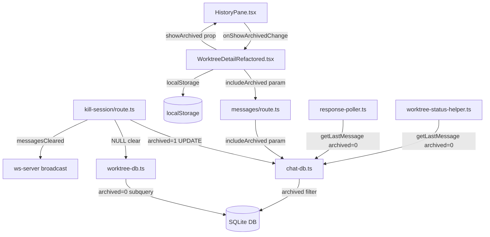

# Issue #168 設計方針書: セッション履歴保持（kill-session後の履歴閲覧）

## 概要

セッションクリア（kill-session）時にメッセージを物理削除するのではなく、論理削除（archived フラグ）に変更し、過去のセッション履歴を保持・閲覧可能にする。新セッション開始時はデフォルトで非アーカイブメッセージのみ表示し、UIトグルで過去セッションのメッセージも閲覧できるようにする。

### 背景・課題

- 現在、kill-session API でセッション終了時に `deleteMessagesByCliTool` / `deleteAllMessages` でメッセージが物理削除される
- セッションをリセットしたいが、過去の会話内容を参照したいケースがある
- 履歴が消えると、以前のプロンプトや応答を確認できなくなる

---

## Stage 1 レビュー指摘事項サマリー

以下はStage 1（通常レビュー）で検出された指摘事項と、本設計方針書への反映状況である。

| ID | 重要度 | カテゴリ | 概要 | 対応状況 |
|----|--------|----------|------|----------|
| DR1-005 | must_fix | SOLID | showArchived の状態オーナーシップが HistoryPane と親コンポーネント間で不明確 | 反映済み (セクション 5.4, 5.5) |
| DR1-001 | should_fix | SOLID | getMessages の位置パラメータが6個に増加 - オプションオブジェクトパターンを採用 | 反映済み (セクション 4.1) |
| DR1-003 | should_fix | KISS | 関数リネーム(delete->archive)は内部実装変更+JSDocに簡略化、WebSocketペイロードは messagesCleared を維持 | 反映済み (セクション 4.6, 4.7, 6, 9) |
| DR1-006 | should_fix | KISS | ChatMessage.archived は optional ではなく required にする | 反映済み (セクション 2) |
| DR1-002 | nice_to_have | DRY | `AND archived = 0` フィルタ句をモジュールレベル定数に抽出 | 反映済み (セクション 4) |
| DR1-004 | nice_to_have | YAGNI | down マイグレーションを簡略化（no-opコメントに置換） | 反映済み (セクション 10) |
| DR1-007 | nice_to_have | YAGNI | セパレータUIは初回リリースでは省略し、opacity-60 のみで区別 | 反映済み (セクション 5.3) |
| DR1-008 | nice_to_have | DRY | init-db.ts とマイグレーションのスキーマ重複は既存パターンのため現時点では許容 | 記録のみ |

---

## Stage 2 レビュー指摘事項サマリー（整合性レビュー）

以下はStage 2（整合性レビュー）で検出された指摘事項と、本設計方針書への反映状況である。
整合性レビューでは、設計書の記述と現行コードベースの差分を精査し、実装時に漏れが発生しやすい箇所を特定した。

| ID | 重要度 | カテゴリ | 概要 | 対応状況 |
|----|--------|----------|------|----------|
| CR2-001 | must_fix | 整合性 | getMessages のシグネチャ変更に伴う3箇所の呼び出し元更新が必要 | 反映済み (セクション 4.1 に呼び出し元更新リスト追加) |
| CR2-002 | must_fix | 整合性 | ChatMessage 型に archived フィールドが存在しない（実装時に追加が必要） | 確認済み (セクション 2 で既に設計済み) |
| CR2-003 | must_fix | 整合性 | ChatMessageRow 型に archived フィールドが存在しない（実装時に追加が必要） | 確認済み (セクション 2 で既に設計済み) |
| CR2-004 | must_fix | 整合性 | init-db.ts の CREATE TABLE に archived カラムが必要 | 確認済み (セクション 10 で既に設計済み) |
| CR2-005 | must_fix | 整合性 | clearLastUserMessage 新規関数の db.ts バレルファイルへのエクスポート追加が必要 | 反映済み (セクション 4.8 にバレルファイル追記) |
| CR2-006 | should_fix | 整合性 | deleteAllMessages の戻り値型が現行 void だが設計は number - 設計通り number に変更 | 反映済み (セクション 4.7 に注記追加) |
| CR2-007 | should_fix | 整合性 | HistoryPaneProps に showArchived / onShowArchivedChange の追加が必要 | 確認済み (セクション 5.4 で既に設計済み) |
| CR2-008 | should_fix | 整合性 | HistoryPane ヘッダーに flex レイアウトとトグルUIの組み込みが必要 | 確認済み (セクション 5.1 で既に設計済み) |
| CR2-009 | should_fix | 整合性 | 全 SELECT 文に archived カラムの追加が必要 | 確認済み (セクション 4.1-4.4 で既に設計済み) |
| CR2-010 | should_fix | 整合性 | getMessageById が設計書の変更対象に含まれていない | 反映済み (セクション 4.14 に追加) |
| CR2-011 | nice_to_have | 整合性 | CURRENT_SCHEMA_VERSION = 21 が設計書の前提と一致することを確認 | 確認のみ |
| CR2-012 | nice_to_have | 整合性 | kill-session/route.ts の行番号参照が正確であることを確認 | 確認のみ |
| CR2-013 | nice_to_have | 整合性 | worktree-db.ts のサブクエリ行番号参照が正確であることを確認 | 確認のみ |
| CR2-014 | nice_to_have | 整合性 | GetMessagesOptions のバレルファイルエクスポートが必要 | 反映済み (セクション 4.1 に追記) |

---

## Stage 3 レビュー指摘事項サマリー（影響分析レビュー）

以下はStage 3（影響分析レビュー）で検出された指摘事項と、本設計方針書への反映状況である。
影響分析レビューでは、設計書の変更ファイル一覧に含まれていない間接的な影響箇所を11件検出した。

| ID | 重要度 | カテゴリ | 概要 | 対応状況 |
|----|--------|----------|------|----------|
| IA3-001 | must_fix | 影響範囲 | conversation-logger.ts の getLastUserMessage がアーカイブ済みメッセージを返す可能性 - テスト戦略に動作確認が必要 | 反映済み (セクション 11 テスト戦略に追加) |
| IA3-002 | must_fix | 影響範囲 | src/lib/api-client.ts の getMessages に includeArchived パラメータが未対応 | 反映済み (セクション 3.3 に追加、変更ファイル一覧に追加) |
| IA3-003 | must_fix | 影響範囲 | worktree-status-helper.ts のモックテストでシグネチャ更新が必要 | 反映済み (セクション 11 テスト戦略に追加) |
| IA3-004 | should_fix | 影響範囲 | createMessage の引数型を Omit<ChatMessage, 'id' \| 'archived'> に変更する必要がある | 反映済み (セクション 4.15 に追加) |
| IA3-005 | should_fix | 影響範囲 | データ蓄積に対するパージ/VACUUM戦略が未定義 | 反映済み (セクション 8 パフォーマンス設計に追加) |
| IA3-006 | should_fix | 影響範囲 | session-cleanup.ts への影響分析が未記載 | 反映済み (セクション 13 影響なし確認済みファイルに追加) |
| IA3-007 | should_fix | 影響範囲 | response-poller.ts の kill-session 後の動作分析が未記載 | 反映済み (セクション 13 影響なし確認済みファイルに追加) |
| IA3-008 | nice_to_have | 影響範囲 | log-export-sanitizer.ts への影響確認（影響なし） | 反映済み (セクション 13 影響なし確認済みファイルに追加) |
| IA3-009 | nice_to_have | 影響範囲 | CLIモジュール（src/cli/）への影響分析（影響なし） | 反映済み (セクション 13 影響なし確認済みファイルに追加) |
| IA3-010 | nice_to_have | 影響範囲 | auto-yes-poller.ts への影響確認（影響なし） | 反映済み (セクション 13 影響なし確認済みファイルに追加) |
| IA3-011 | nice_to_have | 影響範囲 | assistant-response-saver.ts の createMessage 呼び出しへの影響（IA3-004 対応で解消） | 反映済み (セクション 4.15 で IA3-004 対応により解消) |

---

## Stage 4 レビュー指摘事項サマリー（セキュリティレビュー）

以下はStage 4（セキュリティレビュー）で検出された指摘事項と、本設計方針書への反映状況である。
セキュリティレビューでは、OWASP Top 10 の各項目に対する設計の安全性を精査した。重大な脆弱性は検出されなかった。

| ID | 重要度 | カテゴリ | OWASP | 概要 | 対応状況 |
|----|--------|----------|-------|------|----------|
| SEC4-007 | must_fix | SQL Injection | A03:2021 | ACTIVE_FILTER 定数の文字列連結は安全だが、定数値の誤変更が広範囲に影響するためテストカバレッジが必要 | 反映済み (セクション 11 テスト戦略に追加、セクション 12 チェックリストに追加) |
| SEC4-001 | should_fix | 入力バリデーション | A03:2021 | includeArchived パラメータの非正規値（'TRUE', '1', 'yes'）が false 扱いされることのテスト追加推奨 | 反映済み (セクション 11 テスト戦略に追加、セクション 12 チェックリストに追加) |
| SEC4-003 | should_fix | データ保持・プライバシー | 該当なし | 論理削除によるデータ保持のプライバシー影響に関するユーザー通知が未設計 | 反映済み (セクション 5.6 UI通知、セクション 7 セキュリティ設計に追加) |
| SEC4-006 | should_fix | XSS / localStorage | A07:2021 | localStorage の showArchived トグルは安全だが、storageイベントリスナー追加時も厳密比較を維持すべき | 反映済み (セクション 5.2 に注記追加) |
| SEC4-009 | should_fix | 情報漏洩 | A01:2021 | 404エラーレスポンスにworktree IDが含まれる（既存問題、Issue #168 範囲外） | 記録のみ (セクション 7 に既存課題として注記) |
| SEC4-002 | nice_to_have | アクセス制御 | A01:2021 | 既存認証ミドルウェアで適切に保護されている | 対応不要（適切に設計済み） |
| SEC4-004 | nice_to_have | Mass Assignment | A08:2021 | Omit型による archived フィールドの外部操作防止は適切 | 対応不要（適切に設計済み） |
| SEC4-005 | nice_to_have | 情報漏洩 | A04:2021 | エラーメッセージにアーカイブ関連情報が漏洩しない設計 | 対応不要（適切に設計済み） |
| SEC4-008 | nice_to_have | データ保護 | A05:2021 | ON DELETE CASCADE による物理削除は適切 | 対応不要（適切に設計済み） |

### OWASP Top 10 カバレッジ

| OWASP項目 | 検証結果 |
|-----------|---------|
| A01: Broken Access Control | 検証済み - 既存認証ミドルウェアで保護、worktree ID による絞り込み担保 |
| A02: Cryptographic Failures | 該当なし - 本変更で暗号処理の追加・変更なし |
| A03: Injection | 検証済み - パラメータバインディング使用、ACTIVE_FILTER は固定文字列 |
| A04: Insecure Design | 検証済み - エラーメッセージに機密情報を含まない |
| A05: Security Misconfiguration | 検証済み - ON DELETE CASCADE によるデータライフサイクル管理 |
| A06: Vulnerable Components | 該当なし - 新規依存なし |
| A07: XSS | 検証済み - localStorage 値の厳密比較、DOM操作なし |
| A08: Data Integrity | 検証済み - Mass Assignment 防止（Omit型） |
| A09: Logging/Monitoring | 既存ロガー使用 - 変更なし |
| A10: SSRF | 該当なし - 外部リクエスト生成なし |

---

## 1. アーキテクチャ設計

### システム構成（変更対象）



### 変更レイヤー

| レイヤー | 変更内容 |
|---------|---------|
| データベース層 | `chat_messages` に `archived` カラム追加、マイグレーション v22 |
| DB関数層 | `chat-db.ts` の全参照関数に `archived=0` フィルタ追加（`ACTIVE_FILTER` 定数使用） |
| DB関数層 | `worktree-db.ts` のサブクエリ・バッチクエリに `archived=0` フィルタ追加 |
| API層 | `kill-session/route.ts` を物理削除から論理削除に変更 |
| API層 | `messages/route.ts` に `includeArchived` クエリパラメータ追加 |
| WebSocket層 | ペイロードフィールド名は `messagesCleared` を維持（DR1-003: 未使用フィールドのリネームは不要） |
| プレゼンテーション層 | `HistoryPane.tsx` にアーカイブ表示トグルUI追加（props経由で親が状態管理） |
| 状態管理 | 親コンポーネント（WorktreeDetailRefactored.tsx）で localStorage によるトグル状態永続化 |

---

## 2. データモデル設計

### スキーマ変更

`chat_messages` テーブルに `archived` カラムを追加する。

```sql
-- 既存テーブルへのカラム追加
ALTER TABLE chat_messages ADD COLUMN archived INTEGER DEFAULT 0;

-- 既存行の安全策（SQLite ALTER TABLE ADD COLUMN のエッジケース対応）
UPDATE chat_messages SET archived = 0 WHERE archived IS NULL;

-- 複合インデックス追加（主要クエリパターンを最適化）
CREATE INDEX IF NOT EXISTS idx_messages_archived
  ON chat_messages(worktree_id, archived, timestamp DESC);
```

### カラム定義

| カラム名 | 型 | デフォルト | 説明 |
|---------|-----|-----------|------|
| `archived` | `INTEGER` | `0` | `0` = アクティブ（現行セッション）、`1` = アーカイブ済み |

### 型定義変更（`ChatMessageRow`）

```typescript
// src/lib/db/chat-db.ts
type ChatMessageRow = {
  id: string;
  worktree_id: string;
  role: 'user' | 'assistant';
  content: string;
  summary: string | null;
  timestamp: number;
  log_file_name: string | null;
  request_id: string | null;
  message_type: string | null;
  prompt_data: string | null;
  cli_tool_id: string | null;
  archived: number;  // 追加
};
```

### `ChatMessage` 型（`src/types/models.ts`）

> **DR1-006 反映**: `archived` は required フィールドとする。マイグレーション後は全行に `archived` カラムが存在し、`mapChatMessage` で確定的にマッピングされるため、optional にする理由がない。

```typescript
export interface ChatMessage {
  // ... 既存フィールド
  /** Whether this message is archived (from a previous session) */
  archived: boolean;  // 追加（required: DR1-006）
}
```

---

## 3. API設計

### 3.1 kill-session API の変更

**エンドポイント**: `POST /api/worktrees/:id/kill-session`

**変更内容**:
- `deleteMessagesByCliTool` / `deleteAllMessages` の内部実装を UPDATE に変更（関数名は維持: DR1-003）
- WebSocketペイロード: `messagesCleared: true` を維持（DR1-003: 未使用フィールドのリネームは不要）
- `worktrees.last_user_message` / `last_user_message_at` を NULL にクリア

```typescript
// kill-session/route.ts 変更後（L92-99相当）
if (targetCliTool) {
  deleteMessagesByCliTool(db, params.id, targetCliTool);  // 内部実装が論理削除に変更
} else {
  deleteAllMessages(db, params.id);  // 内部実装が論理削除に変更
}

// last_user_message のクリア
clearLastUserMessage(db, params.id);

// WebSocketブロードキャスト
broadcast(params.id, {
  type: 'session_status_changed',
  worktreeId: params.id,
  isRunning: false,
  messagesCleared: true,  // フィールド名維持（DR1-003）
  cliTool: targetCliTool || null,
});
```

### 3.2 messages API の変更

**エンドポイント**: `GET /api/worktrees/:id/messages`

**追加クエリパラメータ**:

| パラメータ | 型 | デフォルト | 説明 |
|-----------|-----|-----------|------|
| `includeArchived` | `string` | `'false'` | `'true'` の場合、アーカイブ済みメッセージも含めて返却 |

```typescript
// messages/route.ts 変更箇所
const includeArchivedParam = searchParams.get('includeArchived');
const includeArchived = includeArchivedParam === 'true';

const messages = getMessages(db, params.id, {
  before,
  limit,
  cliToolId,
  includeArchived,
});
```

### 3.3 ブラウザ側 api-client.ts の変更

> **IA3-002 反映**: `src/lib/api-client.ts`（ブラウザ側APIクライアント）の `getMessages` 関数に `includeArchived` パラメータを追加する。WorktreeDetailRefactored.tsx が messages API を呼び出す際に `includeArchived` パラメータを送信できるようにするため、この変更が必要である。

```typescript
// src/lib/api-client.ts の getMessages 関数変更
export async function getMessages(
  worktreeId: string,
  cliTool?: string,
  includeArchived?: boolean  // IA3-002: 追加
): Promise<ChatMessage[]> {
  const params = new URLSearchParams();
  if (cliTool) params.set('cliTool', cliTool);
  if (includeArchived) params.set('includeArchived', 'true');  // IA3-002: 追加

  const query = params.toString();
  const url = `/api/worktrees/${worktreeId}/messages${query ? `?${query}` : ''}`;
  // ... fetch logic
}
```

**注意**: `src/cli/utils/api-client.ts`（CLIモジュール側）は別モジュールであり、messages API を直接呼び出していないため変更不要（IA3-009 参照）。

---

## 4. DB関数設計

> **DR1-002 反映**: `AND archived = 0` フィルタ句をモジュールレベル定数として抽出し、全クエリで共通参照する。

```typescript
// src/lib/db/chat-db.ts モジュールレベル定数
/** Active (non-archived) message filter clause. Single point of change for archived filtering. */
const ACTIVE_FILTER = 'AND archived = 0';
```

### 4.1 `getMessages` の変更

> **DR1-001 反映**: 6個の位置パラメータをオプションオブジェクトパターンに変更する。これにより呼び出し側の可読性が向上し、将来のパラメータ追加も非破壊で行える。
>
> **CR2-001 反映**: 以下の3箇所の呼び出し元を全てオプションオブジェクト形式に更新すること。
> - `src/app/api/worktrees/[id]/messages/route.ts` (L57): `getMessages(db, params.id, before, limit, cliToolId)` -> `getMessages(db, params.id, { before, limit, cliToolId, includeArchived })`
> - `src/app/api/worktrees/[id]/send/route.ts` (L215): `getMessages(db, params.id, undefined, 1, cliToolId)` -> `getMessages(db, params.id, { limit: 1, cliToolId })`
> - `src/lib/session/worktree-status-helper.ts` (L102): 位置パラメータ形式 -> オプションオブジェクト形式に変更
>
> **CR2-014 反映**: `GetMessagesOptions` インターフェースは `chat-db.ts` で export し、必要に応じて `src/lib/db/db.ts` バレルファイルにも型エクスポートを追加すること。

```typescript
/** Options for getMessages query */
export interface GetMessagesOptions {
  before?: Date;
  limit?: number;
  cliToolId?: CLIToolType;
  includeArchived?: boolean;
}

export function getMessages(
  db: Database.Database,
  worktreeId: string,
  options: GetMessagesOptions = {}
): ChatMessage[] {
  const { before, limit = 50, cliToolId, includeArchived = false } = options;

  let query = `
    SELECT id, worktree_id, role, content, summary, timestamp,
           log_file_name, request_id, message_type, prompt_data, cli_tool_id, archived
    FROM chat_messages
    WHERE worktree_id = ? AND (? IS NULL OR timestamp < ?)
  `;

  const params: (string | number | null)[] = [
    worktreeId,
    before?.getTime() || null,
    before?.getTime() || null,
  ];

  // archived フィルタ（デフォルト: 非アーカイブのみ）
  if (!includeArchived) {
    query += ` ${ACTIVE_FILTER}`;
  }

  if (cliToolId) {
    query += ` AND cli_tool_id = ?`;
    params.push(cliToolId);
  }

  query += ` ORDER BY timestamp DESC LIMIT ?`;
  params.push(limit);

  const stmt = db.prepare(query);
  const rows = stmt.all(...params) as ChatMessageRow[];

  return rows.map(mapChatMessage);
}
```

### 4.2 `getLastAssistantMessageAt` の変更

```typescript
export function getLastAssistantMessageAt(
  db: Database.Database,
  worktreeId: string
): Date | null {
  const stmt = db.prepare(`
    SELECT MAX(timestamp) as last_assistant_message_at
    FROM chat_messages
    WHERE worktree_id = ? AND role = 'assistant' ${ACTIVE_FILTER}
  `);
  // ... 以下同様
}
```

### 4.3 `getLastMessage` の変更

```typescript
export function getLastMessage(
  db: Database.Database,
  worktreeId: string
): ChatMessage | null {
  const stmt = db.prepare(`
    SELECT id, worktree_id, role, content, summary, timestamp,
           log_file_name, request_id, message_type, prompt_data, cli_tool_id, archived
    FROM chat_messages
    WHERE worktree_id = ? ${ACTIVE_FILTER}
    ORDER BY timestamp DESC
    LIMIT 1
  `);
  // ... 以下同様
}
```

### 4.4 `getLastUserMessage` の変更

```typescript
export function getLastUserMessage(
  db: Database.Database,
  worktreeId: string
): ChatMessage | null {
  const stmt = db.prepare(`
    SELECT id, worktree_id, role, content, summary, timestamp,
           log_file_name, request_id, message_type, prompt_data, cli_tool_id, archived
    FROM chat_messages
    WHERE worktree_id = ? AND role = 'user' ${ACTIVE_FILTER}
    ORDER BY timestamp DESC
    LIMIT 1
  `);
  // ... 以下同様
}
```

### 4.5 `markPendingPromptsAsAnswered` の変更

```typescript
export function markPendingPromptsAsAnswered(
  db: Database.Database,
  worktreeId: string,
  cliToolId: CLIToolType
): number {
  const selectStmt = db.prepare(`
    SELECT id, prompt_data
    FROM chat_messages
    WHERE worktree_id = ?
      AND cli_tool_id = ?
      AND message_type = 'prompt'
      AND json_extract(prompt_data, '$.status') = 'pending'
      ${ACTIVE_FILTER}
    ORDER BY timestamp DESC
  `);
  // ... 以下同様
}
```

### 4.6 `deleteMessagesByCliTool` - 内部実装を論理削除に変更（関数名維持）

> **DR1-003 反映**: 関数名は `deleteMessagesByCliTool` のまま維持し、内部実装のみ UPDATE に変更する。JSDoc コメントで論理削除であることを明示する。これによりインポート/エクスポート/テストファイルのリネーム作業を回避する。

```typescript
/**
 * Logically delete (archive) messages for a specific CLI tool in a worktree.
 * Issue #168: Changed from physical DELETE to logical archive (UPDATE archived=1).
 * The function name is kept as "delete" for backward compatibility (DR1-003).
 */
export function deleteMessagesByCliTool(
  db: Database.Database,
  worktreeId: string,
  cliTool: CLIToolType
): number {
  const stmt = db.prepare(`
    UPDATE chat_messages
    SET archived = 1
    WHERE worktree_id = ? AND cli_tool_id = ? ${ACTIVE_FILTER}
  `);

  const result = stmt.run(worktreeId, cliTool);
  logger.info('archived-messages-by-cli-tool', { worktreeId, cliTool, count: result.changes });
  return result.changes;
}
```

### 4.7 `deleteAllMessages` - 内部実装を論理削除に変更（関数名維持）

> **DR1-003 反映**: 関数名は `deleteAllMessages` のまま維持し、内部実装のみ UPDATE に変更する。
>
> **CR2-006 反映**: 現行コードの `deleteAllMessages` は戻り値型が `void` だが、本設計では `number`（`result.changes`）を返す設計とする。`deleteMessagesByCliTool` は既に `number` を返しているため、一貫性のある設計となる。呼び出し元（`kill-session/route.ts` L98）では戻り値を使用していないため、非破壊的変更である。

```typescript
/**
 * Logically delete (archive) all messages for a worktree.
 * Issue #168: Changed from physical DELETE to logical archive (UPDATE archived=1).
 * The function name is kept as "delete" for backward compatibility (DR1-003).
 */
export function deleteAllMessages(
  db: Database.Database,
  worktreeId: string
): number {
  const stmt = db.prepare(`
    UPDATE chat_messages
    SET archived = 1
    WHERE worktree_id = ? ${ACTIVE_FILTER}
  `);

  const result = stmt.run(worktreeId);
  logger.info('archived-all-messages', { worktreeId, count: result.changes });
  return result.changes;
}
```

### 4.8 `clearLastUserMessage` の新規追加

> **CR2-005 反映**: この関数は新規追加であるため、`src/lib/db/db.ts` バレルファイルのエクスポートリストにも `clearLastUserMessage` を追加すること。現行の db.ts (L37-52) のエクスポートリストに含まれていないため、忘れずに追加が必要。

```typescript
/**
 * Clear last_user_message and last_user_message_at for a worktree
 * Issue #168: Called after archiving messages to keep sidebar display accurate
 */
export function clearLastUserMessage(
  db: Database.Database,
  worktreeId: string
): void {
  const stmt = db.prepare(`
    UPDATE worktrees
    SET last_user_message = NULL,
        last_user_message_at = NULL
    WHERE id = ?
  `);

  stmt.run(worktreeId);
}
```

**バレルファイル更新 (`src/lib/db/db.ts`)**:
```typescript
// db.ts エクスポートリストに追加
export { clearLastUserMessage } from './chat-db';
```

### 4.9 `deleteMessageById` は変更なし

`deleteMessageById` は `send/route.ts` で孤立メッセージ（再送時の重複）の物理削除に使用されており、これらのメッセージは履歴保持の対象外であるため、物理削除のまま維持する。

### 4.10 `mapChatMessage` の変更

```typescript
function mapChatMessage(row: ChatMessageRow): ChatMessage {
  return {
    // ... 既存フィールド
    archived: row.archived === 1,  // 追加
  };
}
```

### 4.11 `getLastMessagesByCliBatch` の変更（`worktree-db.ts`）

```typescript
// ranked_messages CTE に ACTIVE_FILTER 追加
// Note: worktree-db.ts でも同じ ACTIVE_FILTER 定数を import または再定義する
const stmt = db.prepare(`
  WITH ranked_messages AS (
    SELECT
      worktree_id,
      cli_tool_id,
      content,
      ROW_NUMBER() OVER (
        PARTITION BY worktree_id, cli_tool_id
        ORDER BY timestamp DESC
      ) as rn
    FROM chat_messages
    WHERE worktree_id IN (${placeholders})
      AND role = 'user'
      AND archived = 0
  )
  SELECT worktree_id, cli_tool_id, content
  FROM ranked_messages
  WHERE rn = 1
`);
```

### 4.12 `getWorktrees` サブクエリの変更（`worktree-db.ts`）

```sql
-- L93-94 のサブクエリ変更
(SELECT MAX(timestamp) FROM chat_messages
 WHERE worktree_id = w.id AND role = 'assistant' AND archived = 0) as last_assistant_message_at
```

### 4.13 `getWorktreeById` サブクエリの変更（`worktree-db.ts`）

```sql
-- L208-209 のサブクエリ変更
(SELECT MAX(timestamp) FROM chat_messages
 WHERE worktree_id = w.id AND role = 'assistant' AND archived = 0) as last_assistant_message_at
```

### 4.14 `getMessageById` の変更（`chat-db.ts`）

> **CR2-010 反映**: `getMessageById`（chat-db.ts L335-352）は当初設計書の変更対象に含まれていなかったが、`ChatMessageRow` に `archived` フィールドが追加されるため、この関数の SELECT 文にも `archived` カラムの追加が必要である。`archived` カラムが SELECT に含まれないと、`mapChatMessage` での `row.archived` 参照時に `undefined` となり不整合が発生する。

```typescript
export function getMessageById(
  db: Database.Database,
  messageId: string
): ChatMessage | null {
  const stmt = db.prepare(`
    SELECT id, worktree_id, role, content, summary, timestamp,
           log_file_name, request_id, message_type, prompt_data, cli_tool_id, archived
    FROM chat_messages
    WHERE id = ?
  `);
  const row = stmt.get(messageId) as ChatMessageRow | undefined;
  return row ? mapChatMessage(row) : null;
}
```

**注意**: `getMessageById` は `archived` フィルタ（`ACTIVE_FILTER`）を適用しない。この関数はメッセージIDによる直接参照であり、アーカイブ済みメッセージも取得できる必要がある（`send/route.ts` での孤立メッセージ削除用途）。

### 4.15 `createMessage` の引数型変更

> **IA3-004 反映**: `ChatMessage` 型に `archived: boolean`（required）を追加すると、現行の `createMessage` 関数の引数型 `Omit<ChatMessage, 'id'>` では全呼び出し元で `archived: false` を明示的に渡す必要が生じ、TypeScript コンパイルエラーが発生する。これを回避するため、引数型を `Omit<ChatMessage, 'id' | 'archived'>` に変更する。

```typescript
// src/lib/db/chat-db.ts
export function createMessage(
  db: Database.Database,
  message: Omit<ChatMessage, 'id' | 'archived'>  // IA3-004: 'archived' を Omit に追加
): ChatMessage {
  const id = generateId();
  const stmt = db.prepare(`
    INSERT INTO chat_messages (id, worktree_id, role, content, summary, timestamp,
      log_file_name, request_id, message_type, prompt_data, cli_tool_id)
    VALUES (?, ?, ?, ?, ?, ?, ?, ?, ?, ?, ?)
  `);
  // archived は DEFAULT 0 が適用されるため、INSERT 文に含めない
  // ...
}
```

**この変更により影響を受けない呼び出し元**（IA3-011 確認済み）:
- `src/lib/polling/response-poller.ts` - `createMessage` 呼び出し時に `archived` を渡す必要がなくなる
- `src/lib/assistant-response-saver.ts` - 同上
- `src/app/api/worktrees/[id]/send/route.ts` - 同上
- `src/app/api/hooks/claude-done/route.ts` - 同上

---

## 5. UI設計

### 5.1 HistoryPane トグルUI

`HistoryPane.tsx` のstickyヘッダー部分に「過去セッションの履歴を表示」トグルを追加する。

```typescript
// HistoryPane.tsx ヘッダー変更
<div className="sticky top-0 bg-gray-900 border-b border-gray-700 px-4 py-2 z-10
                flex items-center justify-between">
  <h3 className="text-sm font-medium text-gray-300">Message History</h3>
  <label className="flex items-center gap-1.5 cursor-pointer">
    <span className="text-xs text-gray-400">Past sessions</span>
    <input
      type="checkbox"
      checked={showArchived}
      onChange={() => onShowArchivedChange(!showArchived)}
      className="w-3.5 h-3.5 rounded border-gray-600 bg-gray-800
                 text-blue-500 focus:ring-blue-500 focus:ring-offset-0"
    />
  </label>
</div>
```

### 5.2 localStorage永続化

> **DR1-005 反映**: 状態オーナーシップは親コンポーネント（WorktreeDetailRefactored.tsx）に統一する。HistoryPane は props 経由で `showArchived` と `onShowArchivedChange` を受け取るのみとし、localStorage 管理と API 呼び出しは全て親コンポーネントが担当する。これにより Reactの "lifting state up" パターンに準拠し、状態の流れが単方向になる。

**親コンポーネント (WorktreeDetailRefactored.tsx) での状態管理:**

```typescript
const STORAGE_KEY = 'commandmate-show-archived-messages';

const [showArchived, setShowArchived] = useState<boolean>(() => {
  if (typeof window === 'undefined') return false;
  try {
    return localStorage.getItem(STORAGE_KEY) === 'true';
  } catch {
    return false;
  }
});

useEffect(() => {
  try {
    localStorage.setItem(STORAGE_KEY, String(showArchived));
  } catch {
    // localStorage unavailable
  }
}, [showArchived]);

// messages API 呼び出し時に showArchived を includeArchived パラメータとして渡す
```

> **SEC4-006 反映**: localStorage の `showArchived` 値は `=== 'true'` の厳密比較で処理されており、XSS 攻撃で localStorage が改ざんされても Boolean 値として安全にパースされる。`JSON.parse` は使用しないため任意コード実行のリスクもない。**注意**: 将来的に `storage` イベントリスナーで他タブからの変更を検知する機能を追加する場合は、同様の `=== 'true'` 厳密比較を必ず適用すること。

### 5.3 アーカイブメッセージの視覚的区別

> **DR1-007 反映**: 初回リリースでは `opacity-60` スタイリングのみでアーカイブメッセージを区別する。セパレータ（`hasArchivedBoundary` によるUI境界線）は実装しない。ユーザーフィードバックで区別が不十分との声があれば、後続Issueでセパレータを追加する。

アーカイブ済みメッセージは以下の方法で視覚的に区別する:

1. **背景色の変更**: アーカイブメッセージは `opacity-60` を適用して薄く表示

```typescript
{/* アーカイブメッセージの表示 */}
<div className={message.archived ? 'opacity-60' : ''}>
  {/* メッセージカード内容 */}
</div>
```

### 5.4 HistoryPaneProps の変更

> **DR1-005 反映**: `showArchived` と `onShowArchivedChange` を明示的な props として定義する。HistoryPane は状態を所有せず、親コンポーネントから受け取る。

```typescript
export interface HistoryPaneProps {
  messages: ChatMessage[];
  worktreeId: string;
  onFilePathClick: (path: string) => void;
  isLoading?: boolean;
  className?: string;
  showToast?: (message: string, type?: 'success' | 'error' | 'info') => void;
  onInsertToMessage?: (content: string) => void;
  // DR1-005: 状態オーナーシップを親コンポーネントに統一
  showArchived: boolean;                     // 親が管理する表示状態
  onShowArchivedChange: (value: boolean) => void;  // 親への状態変更通知
}
```

### 5.5 親コンポーネントでの messages API 呼び出し変更

> **DR1-005 反映**: 親コンポーネント（WorktreeDetailRefactored.tsx）が `showArchived` 状態を管理し、`includeArchived` パラメータとして messages API に渡す。HistoryPane はトグル操作時に `onShowArchivedChange` を呼び出すだけであり、API 呼び出しは行わない。

**データフロー:**

```
WorktreeDetailRefactored.tsx (状態オーナー)
  |-- [showArchived state] --> localStorage 永続化
  |-- [showArchived] --> HistoryPane (props: showArchived, onShowArchivedChange)
  |-- [showArchived] --> messages API (query param: includeArchived)
  |
  HistoryPane.tsx (表示のみ)
    |-- トグル操作 --> onShowArchivedChange(newValue) --> 親へ通知
```

### 5.6 アーカイブデータ保持に関するユーザー通知

> **SEC4-003 反映**: 現行の kill-session はメッセージを物理削除するため、ユーザーはセッション終了時にデータが消えることを期待している可能性がある。論理削除への変更により、ユーザーが削除したと思っているデータが実際には DB 内に残存する。特に機密情報（API キー、パスワード等）を含むメッセージが保持される可能性がある。

**対応方針**: トグル UI の近くにアーカイブ済みメッセージが保持されている旨の説明テキストを追加する。

```typescript
// HistoryPane.tsx トグルUI付近に追加するツールチップ/説明テキスト
<label className="flex items-center gap-1.5 cursor-pointer" title="Session messages are archived, not deleted. Use worktree deletion to permanently remove all data.">
  <span className="text-xs text-gray-400">Past sessions</span>
  <input
    type="checkbox"
    checked={showArchived}
    onChange={() => onShowArchivedChange(!showArchived)}
    className="w-3.5 h-3.5 rounded border-gray-600 bg-gray-800
               text-blue-500 focus:ring-blue-500 focus:ring-offset-0"
  />
</label>
```

**将来考慮事項**: ユーザーがアーカイブを物理削除できるパージ機能の導入を検討する（IA3-005 のパージ戦略と連動）。

---

## 6. WebSocket設計

> **DR1-003 反映**: WebSocket ペイロードの `messagesCleared` フィールド名は変更しない。現時点でクライアント側にこのフィールドを読み取るロジックは存在しないため、リネームはリスクに対して利益が釣り合わない。型定義の `messagesCleared` をそのまま維持する。

### SessionStatusPayload（変更なし）

```typescript
// src/hooks/useWebSocket.ts - フィールド名は変更しない
export interface SessionStatusPayload {
  type: 'session_status_changed';
  worktreeId: string;
  isRunning: boolean;
  messagesCleared?: boolean;  // フィールド名維持（DR1-003）
  cliTool: CLIToolType | null;
}
```

将来的にクライアント側で `messagesCleared` を活用する際に、必要に応じて `messagesArchived` への移行を検討する。

---

## 7. セキュリティ設計

### 認証・認可

- アーカイブメッセージへのアクセスは既存の認証ミドルウェア（`src/middleware.ts`）によって保護される
- `includeArchived` パラメータの追加によって新たな認証要件は発生しない
- messages API は既存のトークン認証を通過したリクエストのみ処理する

### 入力バリデーション

- `includeArchived` パラメータは `'true'` との厳密比較のみ（それ以外は全て `false` 扱い）
- SQLインジェクション対策: `archived` フィルタは固定値 `0` / `1` のみで、ユーザー入力を直接SQLに埋め込まない

### データ保護

- ON DELETE CASCADE は引き続き有効: worktree 削除時にアーカイブ済みメッセージも含めて全て物理削除される
- `deleteMessageById` は物理削除のまま維持（孤立メッセージのクリーンアップ用）

### データ保持とプライバシー（SEC4-003）

> **SEC4-003 反映**: 論理削除への変更により、kill-session 実行後もメッセージデータが DB 内に残存する。ユーザーの期待と実際の動作の乖離を防ぐため、以下の対策を講じる。

- **UI通知**: トグル UI に title 属性でアーカイブデータの保持について説明する（セクション 5.6 参照）
- **完全削除パス**: worktree 削除時は ON DELETE CASCADE により全メッセージ（アーカイブ含む）が物理削除される。これがユーザーがデータを完全に消去できる唯一の手段である
- **将来検討**: ユーザーがアーカイブメッセージのみを物理削除できるパージ機能（IA3-005 参照）

### 既存課題の記録（SEC4-009）

> **SEC4-009 記録**: `messages/route.ts` L24-27 の 404 エラーレスポンスに `Worktree '${params.id}' not found` という形式で worktree ID が含まれており、ID の存在確認に利用可能である。これは Issue #168 以前からの既存問題であり、本 Issue の範囲外である。認証済みリクエストのみがこのエンドポイントに到達できるため、影響は限定的。将来的にエラーメッセージを一般化（例: 'Resource not found'）することを検討する。

---

## 8. パフォーマンス設計

### インデックス戦略

新しい複合インデックスを追加し、`archived` フィルタを含むクエリを最適化する。

```sql
CREATE INDEX IF NOT EXISTS idx_messages_archived
  ON chat_messages(worktree_id, archived, timestamp DESC);
```

**カバーするクエリパターン**:

| クエリ | 使用インデックス |
|--------|----------------|
| `WHERE worktree_id = ? AND archived = 0 ORDER BY timestamp DESC` | `idx_messages_archived` |
| `WHERE worktree_id = ? AND archived = 0 AND role = ?` | `idx_messages_archived`（部分カバー） |
| `WHERE worktree_id = ? AND archived = 0 AND cli_tool_id = ?` | `idx_messages_archived`（部分カバー） |

### 既存インデックスとの関係

| 既存インデックス | 影響 |
|----------------|------|
| `idx_messages_worktree_time` | 引き続き `includeArchived=true` 時のクエリで使用 |
| `idx_messages_cli_tool` | CLI tool フィルタ時に引き続き使用 |
| `idx_messages_type` | message_type フィルタ時に引き続き使用 |

### クエリ影響分析

- **通常のメッセージ取得**: `archived=0` フィルタ追加により、新しいインデックスを使用して高速にフィルタ
- **アーカイブ含む全件取得**: `includeArchived=true` 時は `archived` フィルタなし、既存の `idx_messages_worktree_time` を使用
- **長期蓄積時**: メッセージ数が大量になった場合でも、`archived=0` フィルタによりスキャン対象が限定されるため、現行セッションの表示パフォーマンスは維持される

### データ蓄積とパージ戦略（将来考慮事項）

> **IA3-005 反映**: 物理削除から論理削除への変更により、`chat_messages` テーブルのデータは無限に蓄積される。頻繁にセッションを kill/再作成するワークフローでは、メッセージ数が急速に増加する可能性がある。

**現時点の方針**: パージ機能は実装しない（YAGNI原則）。以下の理由による:
- `archived=0` インデックスにより、現行セッションのクエリパフォーマンスはデータ蓄積の影響を受けにくい
- worktree 削除時は ON DELETE CASCADE により全メッセージ（アーカイブ含む）が物理削除される
- 一般的な使用パターンではメッセージ蓄積がボトルネックになる水準に達しにくい

**パージが必要になった場合の設計方針**（備考）:
- 一定期間（例: 30日）以上前のアーカイブメッセージを定期的に物理削除するオプション機能として実装する
- SQL: `DELETE FROM chat_messages WHERE archived = 1 AND timestamp < ?`
- 実行タイミング: サーバー起動時、または schedule-manager による定期実行
- SQLite VACUUM: パージ実行後にディスク領域を回収する場合は `VACUUM` の実行を検討する。ただし VACUUM はテーブルロックを伴うため、アクティブセッション数が少ないタイミング（サーバー起動時等）での実行が望ましい

### response-poller.ts の kill-session 後の動作分析

> **IA3-007 反映**: kill-session 後にポーリングが再開された場合の response-poller.ts の動作を分析する。

response-poller.ts は `createMessage` 経由で新しいメッセージを作成するが、`getLastMessage` は直接使用していない。kill-session 後のシナリオ（アーカイブ済みメッセージのみ存在する状態）では:
- `getMessages` / `getLastMessage` は `archived=0` フィルタにより、新セッションのメッセージのみを参照する
- アーカイブ済みメッセージはポーリング対象から除外されるため、新セッション開始後のポーリングは正常に動作する
- `createMessage` で作成される新メッセージは `archived=0`（デフォルト）で作成されるため、新セッションのメッセージとして正しく扱われる

---

## 9. 設計上の決定事項とトレードオフ

### archived方式 vs session_id方式

| 観点 | archived方式（採用） | session_id方式 |
|------|-------------------|---------------|
| **実装複雑度** | 低い - 既存関数にWHERE条件追加のみ | 高い - session管理テーブル、採番ロジックの追加が必要 |
| **マイグレーション** | ALTERで1カラム追加 | 新テーブル作成 + 既存データへのsession_id付与が必要 |
| **クエリ変更** | `AND archived = 0` の追加のみ | JOINまたはサブクエリが必要 |
| **セッション区別** | 不可（アーカイブか否かの二値のみ） | 可能（セッション単位でグループ化可能） |
| **将来の拡張性** | セッション単位の管理が必要になった場合は再設計が必要 | セッション単位のフィルタ・統計が容易 |

**決定理由**: Issue #168 の要件は「過去セッションの履歴を閲覧可能にする」であり、セッション単位のグループ化は求められていない。archived方式は実装がシンプルで、既存コードベースへの影響が最小限であるため採用する。将来的にセッション単位の管理が必要になった場合は、archived カラムを維持したまま session_id カラムを追加するマイグレーションで対応可能。

### 関数名維持の判断（DR1-003）

> **DR1-003 反映**: `deleteMessagesByCliTool` / `deleteAllMessages` の関数名はリネームせず維持する。

- 内部実装のみ物理削除（DELETE）から論理削除（UPDATE archived=1）に変更する
- JSDocコメントで論理削除であることを明示する
- 呼び出し元のインポート文、バレルファイル（`db/index.ts`）のエクスポート名、テストファイルの関数名はすべて変更不要
- これにより不要なリネーム作業を回避し、KISS原則に従う

### WebSocketペイロードの維持（DR1-003）

> **DR1-003 反映**: `messagesCleared` フィールド名は変更しない。

- 現時点でクライアント側にこのフィールドを読み取るロジックが存在しない
- 未使用フィールドのリネームは型定義の変更リスクに対して利益が釣り合わない
- 将来クライアント側で活用する際に、必要に応じてリネームを検討する

---

## 10. マイグレーション設計

### マイグレーションバージョン: 22

> **DR1-004 反映**: `down` マイグレーションは no-op コメントに簡略化する。SQLite の ALTER TABLE ADD COLUMN に対する down migration（テーブル再作成）は複雑かつリスクが高い。CommandMate では本番で down migration を実行した実績がなく、中途失敗時のデータ損失リスクがある。archived カラムは使用しなくても安全に無視できる。

```typescript
// src/lib/db/db-migrations.ts に追加
{
  version: 22,
  name: 'add-chat-messages-archived-column',
  up: (db) => {
    // Issue #168: Add archived column for session history retention
    db.exec(`
      ALTER TABLE chat_messages ADD COLUMN archived INTEGER DEFAULT 0;
    `);

    // Safety: ensure existing rows have explicit archived=0
    db.exec(`
      UPDATE chat_messages SET archived = 0 WHERE archived IS NULL;
    `);

    // Composite index for archived-filtered queries
    db.exec(`
      CREATE INDEX IF NOT EXISTS idx_messages_archived
        ON chat_messages(worktree_id, archived, timestamp DESC);
    `);

    console.log('Added archived column to chat_messages with composite index');
  },
  down: (_db) => {
    // No-op: The archived column can be safely ignored if unused.
    // SQLite ALTER TABLE DROP COLUMN requires full table recreation which
    // is complex and risks data loss. CommandMate has no production use
    // of down migrations. (DR1-004)
    console.log('Down migration for v22 is a no-op; archived column remains but is safely ignored.');
  }
}
```

### `CURRENT_SCHEMA_VERSION` の更新

```typescript
export const CURRENT_SCHEMA_VERSION = 22;  // 21 -> 22
```

### `initDatabase` の変更

`src/lib/db/init-db.ts` の `chat_messages` テーブル定義にも `archived` カラムを追加する（新規DB作成時用）。

> **DR1-008 記録**: init-db.ts とマイグレーションでスキーマが二重定義されるが、これは既存のプロジェクト規約に従ったものであり、現時点では許容する。

```sql
CREATE TABLE IF NOT EXISTS chat_messages (
  id TEXT PRIMARY KEY,
  worktree_id TEXT NOT NULL,
  role TEXT NOT NULL CHECK(role IN ('user', 'assistant')),
  content TEXT NOT NULL,
  summary TEXT,
  timestamp INTEGER NOT NULL,
  log_file_name TEXT,
  request_id TEXT,
  message_type TEXT DEFAULT 'normal',
  prompt_data TEXT,
  cli_tool_id TEXT DEFAULT 'claude',
  archived INTEGER DEFAULT 0,

  FOREIGN KEY (worktree_id) REFERENCES worktrees(id) ON DELETE CASCADE
);
```

---

## 11. テスト戦略

### 修正が必要なテストファイル

| テストファイル | 変更内容 |
|-------------|---------|
| `tests/unit/db.test.ts` | `getMessages` のオプションオブジェクトパターン対応（DR1-001）、`includeArchived` パラメータ追加テスト、`getLastUserMessage` の archived フィルタ検証、論理削除のテスト追加 |
| `tests/unit/db-delete-messages-by-cli-tool.test.ts` | `deleteMessagesByCliTool` の内部動作が論理削除に変更されたことの検証（関数名は変更なし: DR1-003）。「削除後にメッセージが0件」を「archived=0のメッセージが0件かつarchived=1のメッセージが残存」に変更 |
| `tests/integration/api-messages.test.ts` | `includeArchived` クエリパラメータのテスト追加（アーカイブ含む/含まない場合の検証） |
| `tests/integration/api-hooks.test.ts` | archived フィルタの影響確認 |
| `tests/integration/api-send-cli-tool.test.ts` | archived 対応の確認（getLastMessage の archived フィルタが send API に影響しないことの検証） |
| `tests/unit/lib/db-migrations.test.ts` | v22 マイグレーションテスト追加（archived カラム存在確認、デフォルト値確認、`idx_messages_archived` インデックス確認） |
| `tests/unit/db.test.ts` | **SEC4-007**: ACTIVE_FILTER 定数が `'AND archived = 0'` であることを検証するテスト追加（定数の誤変更を検出） |
| `tests/integration/api-messages.test.ts` | **SEC4-001**: includeArchived パラメータに非正規値（'TRUE', '1', 'yes', null）を渡した場合に false 扱いされることのテスト追加 |

### 変更不要だが動作確認が必要なテスト

| テストファイル | 確認内容 |
|-------------|---------|
| `tests/unit/db-repository-delete.test.ts` | ON DELETE CASCADE がアーカイブ済みメッセージも含めて正常に物理削除されることの確認 |
| `tests/integration/api-repository-delete.test.ts` | 同上 |
| `tests/unit/lib/conversation-logger.test.ts` | **IA3-001**: kill-session 後に `recordClaudeConversation` がログを生成しないことの確認。`getLastUserMessage` が ACTIVE_FILTER 適用後に null を返す場合、conversation-logger のログ記録がスキップされることを検証する |
| `tests/unit/lib/worktree-status-helper.test.ts` | **IA3-003**: `getMessages` のモック関数シグネチャがオプションオブジェクトパターンに更新されていることの確認。DI パターン（`typeof GetMessagesFn`）のため型自体は自動追随するが、テスト内のモック実装が新シグネチャに合致していることを検証する |

### 新規テストケース

```typescript
// tests/unit/db.test.ts に追加するテストケース例

describe('deleteAllMessages (logical archive)', () => {
  it('should set archived=1 for all messages of a worktree', () => {
    // Setup: create messages
    createMessage(db, { worktreeId: 'wt1', role: 'user', content: 'msg1', ... });
    createMessage(db, { worktreeId: 'wt1', role: 'assistant', content: 'msg2', ... });

    // Act
    const count = deleteAllMessages(db, 'wt1');

    // Assert
    expect(count).toBe(2);
    expect(getMessages(db, 'wt1')).toHaveLength(0);  // archived=0 のみ
    expect(getMessages(db, 'wt1', { includeArchived: true })).toHaveLength(2);  // 全件
  });
});

describe('getMessages with includeArchived (options object pattern)', () => {
  it('should exclude archived messages by default', () => {
    createMessage(db, { worktreeId: 'wt1', role: 'user', content: 'active', ... });
    deleteAllMessages(db, 'wt1');
    createMessage(db, { worktreeId: 'wt1', role: 'user', content: 'new', ... });

    const messages = getMessages(db, 'wt1');
    expect(messages).toHaveLength(1);
    expect(messages[0].content).toBe('new');
  });

  it('should include archived messages when includeArchived=true', () => {
    createMessage(db, { worktreeId: 'wt1', role: 'user', content: 'old', ... });
    deleteAllMessages(db, 'wt1');
    createMessage(db, { worktreeId: 'wt1', role: 'user', content: 'new', ... });

    const messages = getMessages(db, 'wt1', { includeArchived: true });
    expect(messages).toHaveLength(2);
  });

  it('should accept options object with specific parameters', () => {
    // Verify options object pattern works correctly (DR1-001)
    const messages = getMessages(db, 'wt1', {
      limit: 10,
      cliToolId: 'claude',
      includeArchived: false,
    });
    expect(messages).toBeDefined();
  });
});

describe('getLastMessage excludes archived', () => {
  it('should return only non-archived last message', () => {
    createMessage(db, { worktreeId: 'wt1', role: 'user', content: 'old', ... });
    deleteAllMessages(db, 'wt1');

    expect(getLastMessage(db, 'wt1')).toBeNull();

    createMessage(db, { worktreeId: 'wt1', role: 'user', content: 'new', ... });
    expect(getLastMessage(db, 'wt1')?.content).toBe('new');
  });
});

describe('ACTIVE_FILTER constant (SEC4-007)', () => {
  it('should have the correct SQL filter value', () => {
    // SEC4-007: Prevent accidental modification of the constant
    // that affects 11+ query locations
    expect(ACTIVE_FILTER).toBe('AND archived = 0');
  });
});

describe('includeArchived non-canonical values (SEC4-001)', () => {
  it('should treat "TRUE" (uppercase) as false', () => {
    // API level: includeArchivedParam === 'true' strict comparison
    const param = 'TRUE';
    const includeArchived = param === 'true';
    expect(includeArchived).toBe(false);
  });

  it('should treat "1" as false', () => {
    const param = '1';
    const includeArchived = param === 'true';
    expect(includeArchived).toBe(false);
  });

  it('should treat "yes" as false', () => {
    const param = 'yes';
    const includeArchived = param === 'true';
    expect(includeArchived).toBe(false);
  });

  it('should treat null (parameter absent) as false', () => {
    const param = null;
    const includeArchived = param === 'true';
    expect(includeArchived).toBe(false);
  });

  it('should only accept exact "true" string', () => {
    const param = 'true';
    const includeArchived = param === 'true';
    expect(includeArchived).toBe(true);
  });
});

describe('ChatMessage.archived field', () => {
  it('should be a required boolean field (DR1-006)', () => {
    createMessage(db, { worktreeId: 'wt1', role: 'user', content: 'test', ... });

    const messages = getMessages(db, 'wt1');
    // archived should be a boolean, not undefined
    expect(typeof messages[0].archived).toBe('boolean');
    expect(messages[0].archived).toBe(false);
  });
});
```

---

## 12. 実装チェックリスト

以下はStage 1およびStage 2のレビュー指摘事項を含む全実装項目のチェックリストである。

### must_fix（Stage 1）

- [ ] **DR1-005**: `showArchived` 状態を親コンポーネント（WorktreeDetailRefactored.tsx）に統一する
  - [ ] WorktreeDetailRefactored.tsx に `showArchived` state と localStorage 永続化を実装
  - [ ] HistoryPaneProps に `showArchived` と `onShowArchivedChange` を追加 (CR2-007)
  - [ ] HistoryPane から自前の state 管理を除去し、props 経由に変更
  - [ ] HistoryPane ヘッダーに flex items-center justify-between レイアウトを適用 (CR2-008)
  - [ ] 親コンポーネントから messages API に `includeArchived` パラメータを渡す

### must_fix（Stage 2: 整合性）

- [ ] **CR2-001**: `getMessages` シグネチャ変更に伴う全3箇所の呼び出し元を更新する
  - [ ] `messages/route.ts` (L57): `getMessages(db, params.id, { before, limit, cliToolId, includeArchived })`
  - [ ] `send/route.ts` (L215): `getMessages(db, params.id, { limit: 1, cliToolId })`
  - [ ] `worktree-status-helper.ts` (L102): オプションオブジェクト形式に変更
- [ ] **CR2-002**: `src/types/models.ts` の `ChatMessage` インターフェースに `archived: boolean` を追加する
- [ ] **CR2-003**: `chat-db.ts` の `ChatMessageRow` に `archived: number` を追加し、`mapChatMessage` に `archived: row.archived === 1` マッピングを追加する
- [ ] **CR2-004**: `init-db.ts` の `CREATE TABLE chat_messages` に `archived INTEGER DEFAULT 0` を追加し、`idx_messages_archived` インデックスも追加する
- [ ] **CR2-005**: `clearLastUserMessage` を `src/lib/db/db.ts` バレルファイルのエクスポートリストに追加する

### should_fix（Stage 1）

- [ ] **DR1-001**: `getMessages` をオプションオブジェクトパターンに変更する
  - [ ] `GetMessagesOptions` インターフェースを定義
  - [ ] `getMessages(db, worktreeId, options?)` シグネチャに変更
  - [ ] 全呼び出し元をオプションオブジェクト形式に更新
  - [ ] テストをオプションオブジェクト形式に更新
- [ ] **DR1-003**: 関数名・WebSocketペイロードフィールド名を維持する
  - [ ] `deleteMessagesByCliTool` の関数名を維持し、内部実装のみ UPDATE に変更
  - [ ] `deleteAllMessages` の関数名を維持し、内部実装のみ UPDATE に変更
  - [ ] JSDocコメントで論理削除であることを明示
  - [ ] WebSocket ペイロードの `messagesCleared` フィールド名を維持
  - [ ] `db/index.ts` バレルファイルのエクスポート名を変更しない
- [ ] **DR1-006**: `ChatMessage.archived` を required フィールドにする
  - [ ] `src/types/models.ts` で `archived: boolean` とする（`?` を除去）

### should_fix（Stage 2: 整合性）

- [ ] **CR2-006**: `deleteAllMessages` の戻り値型を `void` から `number` に変更し、`result.changes` を返すようにする
- [ ] **CR2-009**: 全 SELECT 文（getMessages, getLastMessage, getLastUserMessage, getMessageById）に `archived` カラムを追加する
- [ ] **CR2-010**: `getMessageById` (chat-db.ts L335-352) の SELECT 文に `archived` カラムを追加する（`ACTIVE_FILTER` は適用しない）

### nice_to_have（Stage 1）

- [ ] **DR1-002**: `ACTIVE_FILTER` 定数をモジュールレベルで定義
  - [ ] `chat-db.ts` に `const ACTIVE_FILTER = 'AND archived = 0'` を追加
  - [ ] 全SQLクエリで `ACTIVE_FILTER` 定数を参照
- [ ] **DR1-004**: down マイグレーションを no-op に簡略化
- [ ] **DR1-007**: セパレータUIを省略し、`opacity-60` のみで実装

### must_fix（Stage 3: 影響分析）

- [ ] **IA3-001**: conversation-logger.ts の動作確認テストをテスト戦略に追加する
  - [ ] kill-session 後に `recordClaudeConversation` がログを生成しないことを確認するテストケースを追加
- [ ] **IA3-002**: `src/lib/api-client.ts`（ブラウザ側）の `getMessages` に `includeArchived` パラメータを追加する
  - [ ] `includeArchived?: boolean` パラメータを関数シグネチャに追加
  - [ ] `true` の場合に URLSearchParams に `includeArchived=true` を追加
- [ ] **IA3-003**: worktree-status-helper.ts のモックテストで `getMessages` のモック関数シグネチャをオプションオブジェクトパターンに更新する

### should_fix（Stage 3: 影響分析）

- [ ] **IA3-004**: `createMessage` の引数型を `Omit<ChatMessage, 'id' | 'archived'>` に変更する
  - [ ] chat-db.ts の `createMessage` 関数パラメータ型を更新
  - [ ] INSERT 文に archived カラムを含めない（DEFAULT 0 が適用される）
- [ ] **IA3-005**: データ蓄積に対するパージ戦略を設計上の考慮事項として記載する（実装は YAGNI で見送り）
- [ ] **IA3-006**: session-cleanup.ts の影響分析を「影響なし確認済みファイル」セクションに記載する
- [ ] **IA3-007**: response-poller.ts の kill-session 後の動作分析をパフォーマンス設計セクションに記載する

### nice_to_have（Stage 2: 整合性）

- [ ] **CR2-014**: `GetMessagesOptions` を `src/lib/db/db.ts` バレルファイルに型エクスポートとして追加する（外部モジュールからの参照が必要な場合）

### nice_to_have（Stage 3: 影響分析）

- [ ] **IA3-008**: log-export-sanitizer.ts の影響なしを「影響なし確認済みファイル」セクションに記載する
- [ ] **IA3-009**: CLIモジュール（src/cli/）の影響なしを「影響なし確認済みファイル」セクションに記載する
- [ ] **IA3-010**: auto-yes-poller.ts の影響なしを「影響なし確認済みファイル」セクションに記載する
- [ ] **IA3-011**: assistant-response-saver.ts の影響が IA3-004 対応で解消されることを記載する

### must_fix（Stage 4: セキュリティ）

- [ ] **SEC4-007**: ACTIVE_FILTER 定数の値を検証する単体テストを追加する
  - [ ] `expect(ACTIVE_FILTER).toBe('AND archived = 0')` のテストケースを `tests/unit/db.test.ts` に追加
  - [ ] ACTIVE_FILTER の export が必要な場合は chat-db.ts から export する（テスト用）

### should_fix（Stage 4: セキュリティ）

- [ ] **SEC4-001**: includeArchived パラメータの非正規値テストを追加する
  - [ ] 'TRUE', '1', 'yes', null が全て false 扱いされることを検証するテストケースを `tests/integration/api-messages.test.ts` に追加
- [ ] **SEC4-003**: アーカイブデータ保持に関するユーザー通知を追加する
  - [ ] HistoryPane のトグル UI に title 属性で「Session messages are archived, not deleted」の説明を追加
- [ ] **SEC4-006**: localStorage の storageEvent リスナー追加時に厳密比較を維持する（将来実装時の注意事項として記録済み）
- [ ] **SEC4-009**: 404 エラーメッセージの worktree ID 露出は既存問題として記録（Issue #168 範囲外、対応不要）

### 基本実装

- [ ] マイグレーション v22 を実装（up のみ実質動作）
- [ ] `CURRENT_SCHEMA_VERSION` を 22 に更新
- [ ] `init-db.ts` に `archived` カラムを追加
- [ ] `chat-db.ts` の全参照関数に `archived=0` フィルタを追加
- [ ] `getMessageById` の SELECT 文に `archived` カラムを追加 (CR2-010)
- [ ] `worktree-db.ts` のサブクエリに `archived=0` フィルタを追加
- [ ] `clearLastUserMessage` 関数を新規追加し、バレルファイルにエクスポート (CR2-005)
- [ ] `kill-session/route.ts` を論理削除呼び出しに変更
- [ ] `messages/route.ts` に `includeArchived` クエリパラメータを追加
- [ ] HistoryPane にトグルUIを追加
- [ ] テストを追加・更新

---

## 13. 影響なし確認済みファイル

> **IA3-006, IA3-007, IA3-008, IA3-009, IA3-010 反映**: 以下のファイルは本変更の影響範囲外であることを確認済みである。設計書に明示的に記載することで、レビュー時の影響確認を不要にする。

| ファイル | 影響なしの理由 |
|---------|--------------|
| `src/lib/session-cleanup.ts` | **IA3-006**: `cleanupWorktreeSessions` はメッセージ削除を直接呼び出さない（kill-session API が処理する）。`syncWorktreesAndCleanup` は ON DELETE CASCADE により間接的にメッセージが物理削除される。worktree 自体が削除される場合はアーカイブも不要であるため、これは正しい動作である。 |
| `src/lib/polling/response-poller.ts` | **IA3-007**: `getLastMessage` を直接使用しておらず、`createMessage` 経由でのみ chat_messages に関与する。kill-session 後は `archived=0` フィルタにより新セッションのメッセージのみが対象となる（セクション 8 で詳細分析済み）。 |
| `src/lib/conversation-logger.ts` | **IA3-001**: `getLastUserMessage` の ACTIVE_FILTER 適用により、kill-session 後は null が返されログ記録がスキップされる。これは正しい動作であり、コード変更は不要だが動作確認テストが必要（セクション 11 に追加済み）。 |
| `src/lib/log-export-sanitizer.ts` | **IA3-008**: chat_messages や DB 関数に一切依存しておらず、文字列パターンマッチングのみを行うユーティリティである。本変更の影響を受けない。 |
| `src/cli/` (CLIモジュール全体) | **IA3-009**: CLI コマンド（capture, send, wait, respond, auto-yes, ls）は HTTP API 経由でサーバーと通信するため、DB 関数の変更の直接的な影響を受けない。`src/cli/utils/api-client.ts` はサーバー側の `src/lib/api-client.ts` とは別モジュールであり、messages API を直接呼び出していない。 |
| `src/lib/auto-yes-poller.ts` | **IA3-010**: chat_messages を直接参照せず、プロンプト検出とキー送信のみを行う。本変更の影響を受けない。 |
| `src/lib/assistant-response-saver.ts` | **IA3-011**: `createMessage` を呼び出してアシスタント応答を保存するが、IA3-004 の対応（`Omit<ChatMessage, 'id' | 'archived'>`）により、このファイルのコード変更は不要。 |

---

## 変更ファイル一覧

| ファイル | 変更種別 | 変更内容 |
|---------|---------|---------|
| `src/lib/db/db-migrations.ts` | 修正 | CURRENT_SCHEMA_VERSION=22、v22マイグレーション追加（down は no-op: DR1-004） |
| `src/lib/db/init-db.ts` | 修正 | chat_messages に archived カラム追加、idx_messages_archived インデックス追加 |
| `src/lib/db/chat-db.ts` | 修正 | ACTIVE_FILTER 定数追加（DR1-002）、ChatMessageRow に archived 追加（CR2-003）、getMessages をオプションオブジェクトパターンに変更（DR1-001, CR2-001）、getLastMessage/getLastUserMessage/getLastAssistantMessageAt/markPendingPromptsAsAnswered に archived=0 フィルタ（CR2-009）、getMessageById の SELECT に archived 追加（CR2-010）、deleteMessagesByCliTool/deleteAllMessages の内部実装を論理削除に変更（関数名維持: DR1-003）、deleteAllMessages の戻り値型を number に変更（CR2-006）、clearLastUserMessage 新規追加、mapChatMessage に archived マッピング |
| `src/lib/db/worktree-db.ts` | 修正 | getLastMessagesByCliBatch CTE に archived=0、getWorktrees/getWorktreeById サブクエリに archived=0 |
| `src/types/models.ts` | 修正 | ChatMessage に `archived: boolean`（required）フィールド追加（DR1-006） |
| `src/app/api/worktrees/[id]/kill-session/route.ts` | 修正 | 論理削除呼び出し（関数名変更なし: DR1-003）、clearLastUserMessage 呼び出し、WebSocketペイロード messagesCleared 維持（DR1-003） |
| `src/lib/db/db.ts` | 修正 | clearLastUserMessage のエクスポート追加（CR2-005）、GetMessagesOptions の型エクスポート追加（CR2-014） |
| `src/app/api/worktrees/[id]/messages/route.ts` | 修正 | includeArchived クエリパラメータ追加、getMessages オプションオブジェクト呼び出し（DR1-001, CR2-001） |
| `src/app/api/worktrees/[id]/send/route.ts` | 修正 | getMessages 呼び出しをオプションオブジェクト形式に変更（CR2-001） |
| `src/lib/session/worktree-status-helper.ts` | 修正 | getMessages 呼び出しをオプションオブジェクト形式に変更（CR2-001） |
| `src/hooks/useWebSocket.ts` | 変更なし | SessionStatusPayload の messagesCleared フィールド名を維持（DR1-003） |
| `src/components/worktree/HistoryPane.tsx` | 修正 | アーカイブ表示トグルUI追加（props経由: DR1-005）、opacity-60 でアーカイブメッセージ区別（DR1-007） |
| `src/components/worktree/WorktreeDetailRefactored.tsx` | 修正 | showArchived 状態管理・localStorage永続化・messages API 呼び出しを一元管理（DR1-005） |
| `tests/unit/db.test.ts` | 修正 | archived 関連テスト追加、オプションオブジェクトパターン対応（DR1-001） |
| `tests/unit/db-delete-messages-by-cli-tool.test.ts` | 修正 | 論理削除方式対応（関数名変更なし: DR1-003） |
| `tests/integration/api-messages.test.ts` | 修正 | includeArchived テスト追加 |
| `tests/unit/lib/db-migrations.test.ts` | 修正 | v22 マイグレーションテスト追加 |
| `src/lib/api-client.ts` | 修正 | **IA3-002**: getMessages に `includeArchived` パラメータ追加 |
| `src/lib/db/chat-db.ts` (createMessage) | 修正 | **IA3-004**: 引数型を `Omit<ChatMessage, 'id' \| 'archived'>` に変更 |
| `tests/unit/lib/conversation-logger.test.ts` | 修正 | **IA3-001**: kill-session 後の動作確認テスト追加 |
| `tests/unit/lib/worktree-status-helper.test.ts` | 修正 | **IA3-003**: getMessages モックシグネチャをオプションオブジェクトパターンに更新 |
| `tests/unit/db.test.ts` | 修正 | **SEC4-007**: ACTIVE_FILTER 定数値検証テスト追加 |
| `tests/integration/api-messages.test.ts` | 修正 | **SEC4-001**: includeArchived 非正規値テスト追加 |
| `src/components/worktree/HistoryPane.tsx` | 修正 | **SEC4-003**: トグル UI に title 属性でデータ保持の説明を追加 |
