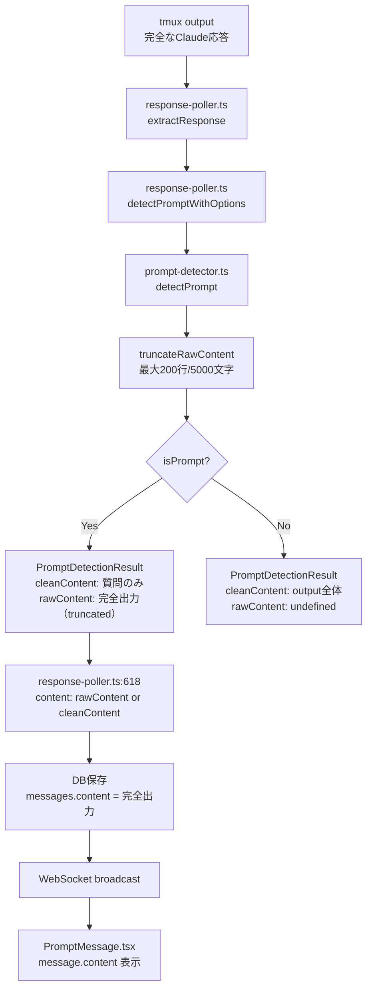

# Issue #235 設計方針書: プロンプト検出時の指示メッセージ保持（rawContent導入）

## 1. 概要

### 1.1 背景

Claudeがインタラクティブプロンプト（チェックボックス・番号付き選択肢）を返した際、選択肢の前に表示される指示テキスト/コンテキスト文が空白になり表示されない。根本原因は `prompt-detector.ts` の `cleanContent` 生成ロジックが質問テキストのみ（最大5行）を抽出し、完全なClaude応答を切り捨てていること。

### 1.2 修正方針

`PromptDetectionResult` に `rawContent` フィールドを新設し、完全なプロンプト出力を保持する。既存の `cleanContent` は変更せず後方互換性を維持する。

### 1.3 設計原則

- **KISS原則**: 既存の型に optional フィールドを追加するのみ。新しい抽象化は不要
- **後方互換性**: `cleanContent` は変更なし、`rawContent` は optional で既存コードに影響しない
- **YAGNI原則**: DB スキーマ変更、新しいコンポーネント作成は行わない
- **サイズ制御**: `rawContent` には上限を設定し、無制限なデータ膨張を防止する（[MF-001] 対応）

---

## 2. アーキテクチャ設計

### 2.1 データフロー（修正後）



### 2.2 変更範囲

```
src/lib/prompt-detector.ts     <- 型拡張 + rawContent返却（3箇所）+ truncateロジック
src/lib/response-poller.ts     <- content値をrawContent優先に（1行）
src/components/worktree/
  └── PromptMessage.tsx         <- message.content表示追加
```

### 2.3 レイヤー構成

本修正はすべて既存レイヤーの範囲内で完結する。

| レイヤー | 対象ファイル | 変更内容 |
|---------|------------|---------|
| ビジネスロジック層 | `prompt-detector.ts` | `PromptDetectionResult` 型拡張、rawContent返却、truncateロジック |
| ビジネスロジック層 | `response-poller.ts` | DB保存時のcontent値変更（1行） |
| プレゼンテーション層 | `PromptMessage.tsx` | 指示テキスト表示追加 |

---

## 3. 型設計

### 3.1 PromptDetectionResult 拡張

```typescript
// src/lib/prompt-detector.ts
export interface PromptDetectionResult {
  /** Whether a prompt was detected */
  isPrompt: boolean;
  /** Prompt data (if detected) */
  promptData?: PromptData;
  /** Clean content without prompt suffix (質問テキストのみ、既存のまま) */
  cleanContent: string;
  /**
   * Complete prompt output (stripAnsi適用済みの完全出力、truncate済み) - NEW
   * 注意: "raw"はANSIエスケープコード除去前を意味しない。
   * stripAnsi()適用済みの完全なプロンプト出力を保持する。
   * [C-001] rawContentのセマンティクスをJSDocで明確化
   */
  rawContent?: string;
}
```

### 3.2 rawContent のソース定義

| パターン | ソース変数 | 内容 | rawContent上限 |
|---------|-----------|------|---------------|
| multiple_choice | `output.trim()` | `detectMultipleChoicePrompt()` に渡されるoutput全体 | **最大200行 / 5000文字** [MF-001] |
| Yes/No | `lastLines.trim()` | 末尾20行（`lines.slice(-20)`）[SF-003] | 最大20行 |
| Approve | `lastLines.trim()` | 末尾20行（`lines.slice(-20)`）[SF-003] | 最大20行 |
| 非検出 | `undefined` | rawContent未設定（cleanContentにフォールバック） | N/A |

#### [MF-001] rawContent サイズ制限設計

multiple_choice パターンでは `captureSessionOutput()` の出力（最大10000行）がそのまま `output` として渡される。rawContent にこれをそのまま格納すると DB やメモリを圧迫する可能性がある。

**truncate ルール:**

```typescript
const RAW_CONTENT_MAX_LINES = 200;
const RAW_CONTENT_MAX_CHARS = 5000;

function truncateRawContent(content: string): string {
  const lines = content.split('\n');
  // 行数制限: 末尾200行を保持（指示テキストは通常プロンプト直前に出現するため末尾を優先）
  const truncatedLines = lines.length > RAW_CONTENT_MAX_LINES
    ? lines.slice(-RAW_CONTENT_MAX_LINES)
    : lines;
  let result = truncatedLines.join('\n');
  // 文字数制限: 5000文字を超えた場合は末尾5000文字を保持
  if (result.length > RAW_CONTENT_MAX_CHARS) {
    result = result.slice(-RAW_CONTENT_MAX_CHARS);
  }
  return result;
}
```

**設計根拠:**
- 200行 / 5000文字は、Claude CLI の通常のプロンプト出力（指示テキスト + 選択肢）を十分に含むサイズ
- 末尾を優先する理由: プロンプト検出は出力末尾で行われ、指示テキストも質問直前に位置するため
- Yes/No・Approve パターンは元々末尾20行のみのため truncate 不要

#### [SF-003] Yes/No・Approve パターンのrawContentソース拡張

Yes/No および Approve パターンでは従来 `lines.slice(-10)` の末尾10行をソースとしていたが、指示テキストが10行を超えるケースに対応するため末尾20行に拡張する。

**設計根拠:**
- multiple_choice パターンとの一貫性向上（より広い範囲をrawContentに含める方向に統一）
- 10行では指示テキストの一部が欠落するリスクがある
- 20行であれば通常のYes/No・Approve プロンプトの指示テキストを十分にカバーできる
- ユーザーから見た体験の差異を最小化する

#### [MF-S2-001] lastLines 変数のスコープ変更方針

現在の実装では `lastLines` は L97 で `lines.slice(-10).join('\n')` として定義され、Yes/No パターン（L117付近）と Approve パターン（L137付近）の両方で共有されている。[SF-003] による末尾20行への拡張にあたり、以下の方針で実装する。

**方針: L97 の共有変数を直接変更する**

```typescript
// 変更前（L97）
const lastLines = lines.slice(-10).join('\n');

// 変更後（L97）
const lastLines = lines.slice(-20).join('\n');
```

**設計根拠:**
- `lastLines` は Yes/No パターンと Approve パターンの両方で使用される共有変数であるため、L97 の定義を一箇所変更するだけで両パターンに適用される
- 各パターンで個別に `const lastLines` を再定義する方式は、変数のシャドウイングとなり可読性が低下するため不採用
- L97 の変更により、既存の `lastLines` を参照するすべての箇所（Yes/No の return 文、Approve の return 文）が自動的に末尾20行を使用する
- cleanContent の生成には影響しない（cleanContent は `lastLines` 内の特定行を抽出するロジックで生成されるため、元の行数が増えても出力は変わらない）

### 3.3 既存型への影響

| 型 | 影響 |
|---|------|
| `PromptDetectionResult` | `rawContent?: string` フィールド追加（optional、後方互換） |
| `ChatMessage` | 変更なし（`content: string` フィールドにrawContentの値が格納される） |
| `PromptData` | 変更なし |
| `BasePromptData` | 変更なし |

---

## 4. 各モジュール設計

### 4.1 prompt-detector.ts

#### 4.1.1 detectMultipleChoicePrompt() の変更

> **注**: 以下のコード例は実装の簡略表現である。実際の実装では `promptData` 内に `options` の map 処理（各選択肢の `label`, `value`, `isDefault` 抽出）が含まれる。[SF-S2-001]

```typescript
// 変更前（L488-509 付近、detectMultipleChoicePrompt 内の return 文）
return {
  isPrompt: true,
  promptData: { type: 'multiple_choice', question, options: /* options map 処理 */ },
  cleanContent: question.trim(),
};

// 変更後
return {
  isPrompt: true,
  promptData: { type: 'multiple_choice', question, options: /* options map 処理 */ },
  cleanContent: question.trim(),
  rawContent: truncateRawContent(output.trim()),  // NEW: 完全なプロンプト出力（truncate済み）[MF-001]
};
```

#### 4.1.2 Yes/No パターンの変更

> **注**: lastLines は L97 の共有変数を `lines.slice(-20)` に変更することで対応する（[MF-S2-001] Section 3.2 参照）。各パターンで個別に再定義する方式は採用しない。

```typescript
// 変更前（L120-131 付近、yesNoMatch 検出後の return 文）
return {
  isPrompt: true,
  promptData: { ... },
  cleanContent: question,
};

// 変更後
// lastLines は L97 で末尾20行に拡張済み [SF-003] [MF-S2-001]
return {
  isPrompt: true,
  promptData: { ... },
  cleanContent: question,
  rawContent: lastLines.trim(),  // NEW
};
```

#### 4.1.3 Approve パターンの変更

```typescript
// 変更前（L143-152 付近、approveMatch 検出後の return 文）[SF-S2-002]
return {
  isPrompt: true,
  promptData: { ... },
  cleanContent: content || 'Approve?',
};

// 変更後
// lastLines は L97 で末尾20行に拡張済み [SF-003] [MF-S2-001]
return {
  isPrompt: true,
  promptData: { ... },
  cleanContent: content || 'Approve?',
  rawContent: lastLines.trim(),  // NEW
};
```

#### 4.1.4 非検出パス

detectPrompt 関数内の非検出パスと、detectMultipleChoicePrompt 内の noPromptResult() ヘルパー関数の両方で rawContent を設定しない。[SF-S2-003]

```typescript
// detectPrompt() 内の非検出 return（L157-160 付近）- rawContent は undefined のまま
return {
  isPrompt: false,
  cleanContent: output.trim(),
  // rawContent は設定しない（undefined）
};
```

```typescript
// noPromptResult() ヘルパー関数（L390, L441, L448, L459, L467 等で呼び出し）
// detectMultipleChoicePrompt 内でプロンプト非検出時に使用される
// rawContent を含まない設計は意図的 - テスト戦略 Section 6.1 の「noPromptResult()」テストケースと整合
function noPromptResult(output: string): PromptDetectionResult {
  return {
    isPrompt: false,
    cleanContent: output.trim(),
    // rawContent は設定しない
  };
}
```

#### 4.1.5 truncateRawContent ヘルパー関数 [MF-001]

```typescript
// prompt-detector.ts内にプライベート関数として追加
// セキュリティ: 正規表現を使用しないためReDoSリスクなし [SF-S4-002]
// String.split('\n') と String.slice() はリテラル文字列操作のみ
const RAW_CONTENT_MAX_LINES = 200;
const RAW_CONTENT_MAX_CHARS = 5000;

function truncateRawContent(content: string): string {
  const lines = content.split('\n');
  const truncatedLines = lines.length > RAW_CONTENT_MAX_LINES
    ? lines.slice(-RAW_CONTENT_MAX_LINES)
    : lines;
  let result = truncatedLines.join('\n');
  if (result.length > RAW_CONTENT_MAX_CHARS) {
    result = result.slice(-RAW_CONTENT_MAX_CHARS);
  }
  return result;
}
```

### 4.2 response-poller.ts

#### 4.2.1 DB保存時のcontent値変更

```typescript
// 変更前（L615-623）
const message = createMessage(db, {
  worktreeId,
  role: 'assistant',
  content: promptDetection.cleanContent,  // <- 質問テキストのみ
  messageType: 'prompt',
  promptData: promptDetection.promptData,
  timestamp: new Date(),
  cliToolId,
});

// 変更後
const message = createMessage(db, {
  worktreeId,
  role: 'assistant',
  content: promptDetection.rawContent || promptDetection.cleanContent,  // <- rawContent優先 (Issue #235)
  messageType: 'prompt',
  promptData: promptDetection.promptData,
  timestamp: new Date(),
  cliToolId,
});
```

> **実装時の注意 [SF-S2-005]**: 変更箇所（L618付近）に変更理由のコメント（`// Issue #235: rawContent優先でDB保存`等）を追加すること。

#### 4.2.2 extractResponse() 内の早期プロンプト検出パスの影響分析 [MF-S3-001]

`response-poller.ts` 内の `extractResponse()` 関数（L296-310付近）には、claude用の早期プロンプト検出パスが存在する。このパスでは `detectPromptWithOptions()` が呼び出され、プロンプトが検出された場合に `extractResponse` が早期リターンする。

**フロー分析:**

```
extractResponse() L296-310:
  detectPromptWithOptions(output) -> isPrompt=true の場合
    -> return { response: stripAnsi(fullOutput), ... } として早期リターン
    -> この response は checkForResponse() に返される

checkForResponse() L609:
  -> detectPromptWithOptions(response) を再度呼び出し
  -> この2回目の呼び出しで rawContent が生成される
  -> L618: content = promptDetection.rawContent || promptDetection.cleanContent でDB保存
```

**結論:** extractResponse() 内の早期プロンプト検出パスで返される `response`（= `stripAnsi(fullOutput)`）は、`checkForResponse()` のL609で再度 `detectPromptWithOptions()` に渡される。この2回目の呼び出しで `rawContent` が正しく生成されるため、DB保存時の `content` 値は意図通り `rawContent || cleanContent` となる。extractResponse() 内の早期検出パス自体に rawContent 対応は不要。

**注意点:** extractResponse() が返す `response`（= `stripAnsi(fullOutput)`）と、L609の再検出で生成される `rawContent`（= `truncateRawContent(output.trim())` for multiple_choice、`lastLines.trim()` for Yes/No・Approve）は値が異なる可能性がある。しかし、DB保存には L609 の再検出結果が使用されるため、rawContent のtruncate制限が正しく適用される。

### 4.3 PromptMessage.tsx

#### 4.3.1 表示ロジック

`message.content`（rawContent格納先）を指示テキストとして表示する。`prompt.question` との重複を回避するフォールバックロジックを実装する。

```typescript
// フォールバック比較ロジック
function getDisplayContent(content: string | undefined | null, question: string): string | null {
  // 1. contentが空/未定義 -> nullを返し、questionのみ表示（従来動作）
  if (!content?.trim()) return null;

  // 2. contentとquestionが同一 -> contentを表示せず重複回避
  if (content.trim() === question.trim()) return null;

  // 3. contentにquestionが含まれる -> content全体を表示（指示テキスト+質問を一括表示）
  // 4. それ以外 -> contentを表示（指示テキスト部分として表示）
  return content;
}
```

> **注 [SF-S4-003]**: 上記の `content.trim() === question.trim()` による厳密等価比較は、stripAnsi()残留文字やUnicode正規化差異（NFC/NFD等）が存在する場合に、目視上同一に見える文字列が不一致と判定される可能性がある。その場合、contentが重複して表示されるが、**情報の欠落は発生しない**（content全体が表示されるため）。現時点ではUnicode正規化やC1制御文字の除去処理の追加は不要（YAGNI原則）。実運用で問題が報告された場合に `String.normalize('NFC')` の適用を検討する。

#### 4.3.2 UIレイアウトとJSX挿入位置 [SF-S2-004]

指示テキスト表示は、既存の `{/* Question */}` セクション（L49-54付近）の **前** に挿入する。これにより、指示テキスト -> 質問文/選択肢の自然な表示順序を維持する。

```
+------------------------------------------+
| Claudeからの確認                timestamp |
|                                          |
| [message.content]                        |  <- NEW: 指示テキスト表示
| (rawContent全体をプレーンテキスト表示)      |     contentがあり、questionと異なる場合のみ
|                                          |
| +--------------------------------------+ |
| | 1. Option A                          | |  <- 既存: 選択肢ボタン
| +--------------------------------------+ |
| | 2. Option B (> デフォルト)            | |
| +--------------------------------------+ |
+------------------------------------------+
```

**JSX変更の概要:**

```tsx
// 既存の PromptMessage.tsx 内 JSX（概略）
// [SF-S3-003] getDisplayContent()の結果をローカル変数にキャッシュしてDRY原則を遵守
const displayContent = getDisplayContent(message.content, prompt.question);

return (
  <div>
    {/* Header: "Claudeからの確認" + timestamp */}

    {/* === NEW: 指示テキスト表示 === [SF-S2-004] */}
    {/* {/* Question */} セクション（L49-54付近）の前に挿入 */}
    {displayContent && (
      <div className="text-sm text-gray-700 whitespace-pre-wrap mb-2">
        {displayContent}
      </div>
    )}

    {/* 既存: Question / Options (L49-54) */}
    {/* prompt.question 表示 + 選択肢ボタン */}
  </div>
);
```

> **注**: displayContent が null の場合（content が空、または question と同一の場合）は指示テキスト表示要素が描画されず、既存と同一の表示となる。
> **注 [SF-S3-003]**: getDisplayContent() の結果はローカル変数 `displayContent` にキャッシュし、条件判定とレンダリングの両方で使用する。関数を2回呼び出す方式はDRY原則に反するため不採用。

#### 4.3.3 セキュリティ

- `dangerouslySetInnerHTML` は使用しない（将来的にも使用しない方針 [C-S4-001]）
- `ReactMarkdown` によるレンダリングは行わない（プレーンテキスト表示のみ [C-S4-001]）
- React のデフォルトエスケープに依存してプレーンテキスト表示
- rawContent は `stripAnsi()` 済みのため追加のサニタイズ不要（ただし SEC-002 制限による残留制御文字の可能性あり。詳細は Section 8.2 参照 [MF-S4-001]）

---

## 5. データモデル設計

### 5.1 DB スキーマ

**変更なし**。既存の `messages` テーブルの `content TEXT NOT NULL` カラムに格納する値が変わるのみ。

| 変更前 | 変更後 |
|-------|-------|
| `content` = cleanContent（質問テキストのみ） | `content` = rawContent（truncate済み完全出力）または cleanContent（フォールバック） |

### 5.2 後方互換性

- 既存データ: `content` = cleanContent（質問テキストのみ）-> そのまま表示可能
- 新規データ: `content` = rawContent（完全出力、最大200行/5000文字）-> 指示テキスト付きで表示
- DB マイグレーション: 不要

#### [SF-S3-004] データ移行期の表示差異

本修正の適用後、DB内には既存データ（`content` = cleanContent）と新規データ（`content` = rawContent）が混在する期間が発生する。同一プロンプトタイプ（例: Approve?）であっても、データの作成時期によりUI表示が異なる。

| データ種別 | content値 | getDisplayContent結果 | UI表示 |
|-----------|----------|----------------------|--------|
| 既存データ（修正前） | cleanContent（例: `Approve?`） | `null`（content === question のため） | 質問文/選択肢のみ（従来動作） |
| 新規データ（修正後） | rawContent（例: `指示テキスト\nApprove?`） | content全体を返却 | 指示テキスト + 質問文/選択肢 |

**この表示差異は意図的な動作である。** 理由:
- 既存データに対して遡及的にrawContentを再生成することは不可能（元のtmux出力が保持されていないため）
- 新規データが蓄積されるにつれ、表示差異は自然に解消される
- 既存データの表示は従来と同一であり、劣化は発生しない
- DBマイグレーションによる既存データ更新は複雑性に対してメリットが少ないため不採用（YAGNI原則）

---

## 6. テスト戦略

### 6.1 ユニットテスト

#### prompt-detector.test.ts（8項目）

**テストファイルパス**: `tests/unit/prompt-detector.test.ts`（既存ファイルに追加）[C-S2-003]

| テストケース | 期待値 |
|------------|-------|
| multiple_choice パターン | `rawContent === truncateRawContent(output.trim())` |
| Yes/No パターン | `rawContent === lastLines.trim()` (末尾20行) |
| Approve パターン | `rawContent` が設定されている |
| プロンプト非検出 | `rawContent === undefined` |
| `noPromptResult()` | `rawContent` が含まれない |
| truncateRawContent: 200行超の入力 [MF-001] | 末尾200行が保持される |
| truncateRawContent: 5000文字超の入力 [MF-001] | 末尾5000文字が保持される |
| lastLines拡張回帰: 末尾11-20行目に(y/n)パターンがある場合 [SF-S3-002] | YES_NO_PATTERNSの行頭アンカー(^)により、行頭に出現しない限り誤検出しないことを確認 |

#### response-poller.test.ts（2項目）

**テストファイルパス**: `tests/unit/lib/response-poller.test.ts`（既存ファイルに追加）[C-S2-003]

| テストケース | 期待値 |
|------------|-------|
| rawContent 設定時 | content = rawContent で DB 保存 |
| rawContent undefined 時 | content = cleanContent にフォールバック |

### 6.2 コンポーネントテスト

#### PromptMessage.tsx（4項目）[SF-002]

**テストファイルパス**: `tests/unit/components/PromptMessage.test.tsx`（**新規作成**）[C-S2-003]

| テストケース | 期待値 |
|------------|-------|
| message.content 表示 | 指示テキストが表示される |
| message.content が空 | prompt.question のみ表示（フォールバック） |
| content に question が含まれるケース | content 全体が表示される（例: content='指示テキスト\n質問文'、question='質問文'のとき content 全体を表示） |
| 長文テキスト | 表示崩れなし |

### 6.3 テスト対象外

- `auto-yes-manager.ts`: rawContent を参照しないため影響なし（任意でリグレッション確認）
- `claude-poller.ts`: 到達不能コードのため変更・テスト不要（詳細は Section 11 参照）

---

## 7. パフォーマンス考慮

### 7.1 rawContent のサイズ

- `multiple_choice` パターン: `output` は `captureSessionOutput()` の最大10000行全体を含む可能性があるが、**`truncateRawContent()` により最大200行 / 5000文字に制限される** [MF-001]
- `Yes/No` / `Approve` パターン: 末尾20行のため軽量 [SF-003]
- 50行ウィンドウはスキャン範囲の制限であり、output自体のサイズ制限ではない

### 7.2 影響評価

| 観点 | 影響度 | 理由 |
|------|-------|------|
| DB保存 | Low | rawContent は最大5000文字に制限。プロンプトメッセージの頻度が低い [MF-001] |
| WebSocket broadcast | Low | プロンプト検出イベントの発生頻度が低い |
| メモリ | Low | rawContent は一時的に保持されるのみ。truncateにより上限あり |

---

## 8. セキュリティ設計

### 8.1 XSS対策

- `PromptMessage.tsx` で `dangerouslySetInnerHTML` を使用しない
- React のデフォルトエスケープに依存（プレーンテキスト表示）

### 8.2 入力サニタイズ

- `rawContent` は `response-poller.ts:100` の `stripAnsi()` で ANSI エスケープコードが除去済み
- Unicode ボックス描画文字（U+2500等）は `stripAnsi()` で除去されないが、React エスケープで安全に表示される

#### [MF-S4-001] stripAnsi() SEC-002 制限と残留制御文字の影響分析

`cli-patterns.ts` の `stripAnsi()` 関数には SEC-002 として以下の既知の制限が文書化されている。rawContent は従来の cleanContent（質問テキストのみ数行）と比較して大幅に大きなデータ量（最大200行/5000文字）を扱うため、残留制御文字が含まれる確率が相対的に高い。

**stripAnsi() で除去されない制御文字の種類:**

| 種類 | 範囲 | 説明 | rawContentへの影響 |
|------|------|------|-------------------|
| 8-bit CSI | 0x9B | ECMA-48 8-bit CSI（7-bit ESC[ の8-bit等価） | tmux出力に含まれる可能性は低いが、rawContentのデータ量増加により遭遇確率が微増 |
| C1制御コード | 0x80-0x9F | CSI (0x9B) 以外のC1制御文字（SS2, SS3, DCS, ST等） | 同上 |
| DEC private modes | ESC + 特殊シーケンス | ターミナルプライベートモード設定 | stripAnsi()の正規表現パターンでカバーされない一部のDECシーケンス |

**C1制御文字（0x80-0x9F）がHTML出力に含まれた場合の影響分析:**

1. **XSSリスク**: **発生しない**。ReactのテキストノードレンダリングではJSXの `{displayContent}` はDOM TextNodeとして挿入される。TextNode内の制御文字はHTMLタグとして解釈されないため、スクリプトインジェクションには至らない。
2. **表示の乱れ**: **起こりうる**。C1制御文字はブラウザによって異なる表示をする可能性がある（空白表示、置換文字表示、レイアウト崩れ等）。ただし、Claude CLIの出力にC1制御文字が含まれるケースは極めて稀であり、実運用での影響は限定的。
3. **セキュリティ結論**: rawContentのサニタイズパイプラインは `stripAnsi()` + Reactデフォルトエスケープの2層で構成されており、SEC-002の制限を考慮してもXSSリスクは発生しない。

**将来の改善検討:**
- `strip-ansi` npmパッケージ（Sindre Sorhus作）はより包括的なANSIエスケープコード除去を提供する。rawContentの表示品質を向上させる必要が生じた場合に、`stripAnsi()` の実装を `strip-ansi` パッケージに置き換えることを検討する。ただし、セキュリティ上の必要性ではなく表示品質の改善目的であるため、現時点では対応不要（YAGNI原則）。

### 8.3 データ整合性

- optional フィールド追加のため、既存データの破壊なし
- DB マイグレーション不要
- rawContent の truncate により DB 保存サイズが制御される [MF-001]

### 8.4 情報漏洩リスク [SF-S4-001]

rawContent はtmux出力の末尾最大200行/5000文字を保持し、DBに保存された後WebSocket経由でブラウザクライアントにブロードキャストされる。tmux出力には以下の情報が含まれうる。

**rawContentに含まれうる情報:**

| 情報種別 | 例 | リスク評価 |
|---------|-----|----------|
| ファイルパス | `/Users/username/project/src/...` | ユーザー名・ディレクトリ構造の露出 |
| 環境変数参照 | `$HOME`, `$PATH` 等の展開結果 | 環境情報の露出 |
| セッション情報 | tmuxセッション名・ウィンドウ情報 | 低リスク |
| Git情報 | ブランチ名、コミットハッシュ | 低リスク |

**リスク軽減要因:**

1. **既存リスクの延長**: 既存の `cleanContent` でも同種の情報（質問テキスト内のファイルパス等）がDB保存・WebSocket配信されている。rawContentはデータ量が増加するが、**新規のリスクカテゴリを導入するものではない**。
2. **ローカル開発ツール**: 本アプリケーション（CommandMate）はローカル開発ツールであり、同一マシン上でのみ動作する。WebSocketブロードキャストもlocalhost宛のため、ネットワーク越しの情報漏洩リスクは限定的。
3. **エクスポート時サニタイズ**: `log-export-sanitizer.ts` の `sanitizeForExport()` 関数により、ログエクスポート時にはHOMEパス、CM_ROOT_DIR、CM_DB_PATH、ホスト名、トークン、パスワード、SSHキー等がマスキングされる。DB内のrawContentが外部共有される際にはこのサニタイズ層が適用される。
4. **truncateによるサイズ制限**: rawContentは最大5000文字に制限されており、大量の機密情報が蓄積されるリスクは低い。

**結論:** rawContentによる情報漏洩リスクは既存のcleanContentと同等であり、ローカル開発ツールとしての利用形態を考慮すると追加の対策は不要。

---

## 9. 設計上の決定事項とトレードオフ

### 9.1 採用した設計（方針B: rawContentフィールド導入）

| 決定事項 | 理由 | トレードオフ |
|---------|------|------------|
| `rawContent` を optional で追加 | 後方互換性が高い | rawContent 未設定時のフォールバックロジックが必要 |
| `cleanContent` は変更しない | 既存のAuto-Yes等のロジックに影響しない | 2つの類似フィールドが共存する（[C-002] 将来的な統一を検討） |
| DB スキーマ変更なし | 既存データとの互換性維持 | 既存データと新規データで content の内容が異なる |
| multiple_choice では output 全体を使用（truncate付き） | 完全な指示テキストを保持しつつサイズ制御 [MF-001] | truncate により先頭部分が失われる可能性がある |
| Yes/No・Approve では末尾20行を使用 [SF-003] | multiple_choice との一貫性向上、指示テキスト欠落リスク低減 | 従来の末尾10行から拡張するため微小なメモリ増加 |
| L97 の lastLines 共有変数を直接変更 [MF-S2-001] | 一箇所の変更で全パターンに適用される | 変数シャドウイングによる個別制御は不可（現時点では不要） |

### 9.2 不採用案との比較

| 方針 | メリット | デメリット | 判定 |
|------|---------|----------|------|
| A: cleanContent全文化 | シンプル | 既存ロジック（Auto-Yes等）への影響大 | 不採用 |
| **B: rawContent新設** | **後方互換性高い** | **フィールド重複** | **採用** |
| C: promptData埋め込み | 一箇所に集約 | promptData肥大化、Auto-Yesへの混入 | 不採用 |

---

## 10. 実装順序

1. **prompt-detector.ts**: `PromptDetectionResult` 型に `rawContent?: string` 追加（JSDocに「stripAnsi適用済みの完全出力」と明記 [C-001]）
2. **prompt-detector.ts**: `truncateRawContent()` ヘルパー関数追加 [MF-001]
3. **prompt-detector.ts**: L97 の `lines.slice(-10)` を `lines.slice(-20)` に変更 [SF-003] [MF-S2-001]（Yes/No・Approve の両パターンが共有する lastLines 変数の定義箇所）
4. **prompt-detector.ts**: 各パターンで `rawContent` を返却（multiple_choice -> Yes/No -> Approve）
5. **prompt-detector.test.ts** (`tests/unit/prompt-detector.test.ts`): rawContent の検証テスト追加（8項目、truncate テスト含む [MF-001]、lastLines回帰テスト含む [SF-S3-002]）[C-S2-003]
6. **response-poller.ts**: L618 の content 値を `rawContent || cleanContent` に変更、変更理由コメント追加（`// Issue #235: rawContent優先でDB保存`）[SF-S2-005]
7. **response-poller.test.ts** (`tests/unit/lib/response-poller.test.ts`): DB保存フォールバックロジックテスト追加（2項目）[C-S2-003]
8. **PromptMessage.tsx**: message.content 表示ロジック追加（既存 Question セクション L49-54 の前に挿入）[SF-S2-004]
9. **PromptMessage.test.tsx** (`tests/unit/components/PromptMessage.test.tsx`, **新規作成**): コンポーネントテスト追加（4項目、content含むquestionケース含む [SF-002]）[C-S2-003]
10. **CLAUDE.md**: モジュール説明の更新

---

## 11. 影響なし確認済みコンポーネント

| コンポーネント | 理由 |
|-------------|------|
| `auto-yes-manager.ts` | `isPrompt` / `promptData` のみ使用。rawContent/cleanContent を直接参照しない |
| `auto-yes-resolver.ts` | `PromptData` 型のみ使用。`PromptDetectionResult` を import していない |
| `status-detector.ts` | `isPrompt` フラグのみ参照 |
| `claude-session.ts` | セッション管理のみ |
| `claude-poller.ts` | response-poller.ts に統合済み（到達不能コード）。L234付近にTODOコメントで到達不能であることが記載されており、実際のプロンプト検出・DB保存は response-poller.ts が担当する。仮に将来到達可能になった場合は、同様の `rawContent \|\| cleanContent` 変更（L245付近）が必要。[SF-001] |
| `response-poller.ts extractResponse() L296-310` | claude用の早期プロンプト検出パス。`detectPromptWithOptions()` を呼び出すが、その結果は `extractResponse` の戻り値として `checkForResponse()` に返される。`checkForResponse()` のL609で再度 `detectPromptWithOptions()` が呼ばれ、rawContent が正しく生成されてDB保存されるため、このパス自体への rawContent 対応は不要。詳細は Section 4.2.2 参照。[MF-S3-001] |
| `current-output/route.ts` | このルートは `detectPrompt()` の結果を DB 保存に使用しない。L91 のローカル型注釈（`{ isPrompt: boolean; cleanContent: string; promptData?: unknown }`）は `isPromptWaiting` と `promptData` のみを API 応答に含めるために使用しており、rawContent の有無は動作に影響しない。TypeScript の構造的部分型により、`detectPrompt()` の戻り値に rawContent が追加されても代入は型安全に行われる（余分なプロパティは無視される）。[MF-S2-002] |
| `prompt-response/route.ts` | `isPrompt` フラグのみ参照 |
| `useAutoYes.ts` | `PromptData` のみ使用 |
| `cli-tools/codex.ts` | response-poller.ts 経由で間接的に恩恵を受ける。codex.ts は独自に `detectPrompt` を呼び出すパスを持たず、`response-poller.ts` の `checkForResponse` 経由でのみプロンプト検出が行われるため、rawContent 対応は response-poller.ts の変更で自動的に適用される。[C-S3-001] |
| `MessageList.tsx` | promptメッセージ（`messageType='prompt'`）は `MessageList.tsx` の L536-544 で `PromptMessage` コンポーネントにディスパッチされるため、`MessageBubble` コンポーネント（L234-357）の `ReactMarkdown` 表示パスは到達しない。よって、`message.content` が rawContent に変更されても `MessageBubble` 内の `ReactMarkdown` でのレンダリングには影響しない。[SF-S3-001] |
| DBスキーマ | `content TEXT NOT NULL` は制限なし、マイグレーション不要 |

---

## 12. レビュー履歴

| 日付 | ステージ | レビュー種別 | 結果 | スコア |
|------|---------|------------|------|-------|
| 2026-02-11 | Stage 1 | 設計原則（通常レビュー） | 条件付き承認 | 4/5 |
| 2026-02-11 | Stage 2 | 整合性レビュー | 条件付き承認 | 4/5 |
| 2026-02-11 | Stage 3 | 影響分析レビュー | 条件付き承認 | 4/5 |
| 2026-02-11 | Stage 4 | セキュリティレビュー | 条件付き承認 | 4/5 |

---

## 13. レビュー指摘事項サマリー

### Stage 1: 設計原則レビュー（2026-02-11）

#### Must Fix

| ID | タイトル | 重要度 | 対応状況 | 反映セクション |
|----|---------|-------|---------|-------------|
| MF-001 | multiple_choiceパターンのrawContentサイズ制限欠如 | medium | 対応済み | Section 3.2, 4.1.1, 4.1.5, 6.1, 7.1, 7.2 |

#### Should Fix

| ID | タイトル | 重要度 | 対応状況 | 反映セクション |
|----|---------|-------|---------|-------------|
| SF-001 | claude-poller.tsへのrawContent対応の欠落 | low | 対応済み | Section 11 |
| SF-002 | getDisplayContent関数のテスト不足 | low | 対応済み | Section 6.2 |
| SF-003 | Yes/No・ApproveパターンのrawContentソースの一貫性 | low | 対応済み | Section 3.2, 4.1.2, 4.1.3, 7.1, 9.1 |

#### Consider（将来検討事項）

| ID | タイトル | 重要度 | 備考 |
|----|---------|-------|------|
| C-001 | cleanContentとrawContentの命名の明確化 | info | JSDocコメントで対応（Section 3.1, 実装順序 Step 1） |
| C-002 | 将来的なcleanContentフィールドの廃止検討 | info | 現時点では後方互換性のため現設計を維持。将来Issueとして検討 |
| C-003 | noPromptResult()へのrawContent非設定の明示 | info | 現設計で十分。変更不要 |

### Stage 2: 整合性レビュー（2026-02-11）

#### Must Fix

| ID | タイトル | 重要度 | 対応状況 | 反映セクション |
|----|---------|-------|---------|-------------|
| MF-S2-001 | 設計書の行番号参照と実装の不一致（Yes/No return文） - lastLines変数のスコープ変更方針の明確化 | medium | 対応済み | Section 3.2 ([MF-S2-001]), 4.1.2, 4.1.3, 9.1, 10 (Step 3) |
| MF-S2-002 | current-output/route.ts のローカル型注釈が rawContent を含まない場合のTypeScript整合性 | medium | 対応済み | Section 11 (current-output/route.ts) |

#### Should Fix

| ID | タイトル | 重要度 | 対応状況 | 反映セクション |
|----|---------|-------|---------|-------------|
| SF-S2-001 | detectMultipleChoicePromptのreturn文のコード例精度向上 | low | 対応済み | Section 4.1.1（注釈追加、options map処理への言及） |
| SF-S2-002 | Approveパターンの変更前行番号の修正 | low | 対応済み | Section 4.1.3（L143-153 -> L143-152、位置記述併記） |
| SF-S2-003 | 非検出パスのnoPromptResult()への言及追加 | low | 対応済み | Section 4.1.4（noPromptResult()ヘルパー関数の説明追加） |
| SF-S2-004 | PromptMessage.tsx のJSX挿入位置の明確化 | low | 対応済み | Section 4.3.2（JSX変更概要とQuestion前挿入の明記） |
| SF-S2-005 | response-poller.ts 変更箇所への実装コメント推奨 | info | 対応済み | Section 4.2.1（実装時注意追加）, 10 (Step 6), 14 (チェックリスト) |

#### Consider（将来検討事項）

| ID | タイトル | 重要度 | 備考 |
|----|---------|-------|------|
| C-S2-001 | auto-yes-manager.ts の detectPrompt 呼び出しにおける rawContent の扱い | info | 現状の記載で十分。将来 auto-yes-manager が content 保存に関与する場合のみ再検討 |
| C-S2-002 | claude-poller.ts の到達不能コードに関する記載の正確性 | info | 現状の記載で十分。L162, L234, L245 の確認済み |
| C-S2-003 | テスト戦略と既存テストファイルの整合性 | info | テストファイルのフルパス記載で対応（Section 6.1, 6.2, 10） |

### Stage 3: 影響分析レビュー（2026-02-11）

#### Must Fix

| ID | タイトル | 重要度 | 対応状況 | 反映セクション |
|----|---------|-------|---------|-------------|
| MF-S3-001 | response-poller.ts内の2箇所目のプロンプト検出パス（extractResponse L296-310）でrawContent反映漏れの分析欠如 | medium | 対応済み | Section 4.2.2（新設）, Section 11（extractResponse追加） |

#### Should Fix

| ID | タイトル | 重要度 | 対応状況 | 反映セクション |
|----|---------|-------|---------|-------------|
| SF-S3-001 | MessageList.tsxのMessageBubbleコンポーネントにおけるpromptData表示の影響評価不足 | low | 対応済み | Section 11（MessageList.tsx追加） |
| SF-S3-002 | lastLines変更（10行->20行）がYes/Noパターン検出精度に与える影響の分析不足 | low | 対応済み | Section 6.1（回帰テスト1件追加、7項目->8項目）, Section 14（チェックリスト追加） |
| SF-S3-003 | getDisplayContent関数の2回呼び出しによるパフォーマンスの非効率（DRY原則違反） | low | 対応済み | Section 4.3.2（JSXコード例をローカル変数キャッシュ方式に修正） |
| SF-S3-004 | 既存DBデータとの表示一貫性に関するエッジケース（データ移行期の表示差異未記載） | low | 対応済み | Section 5.2（データ移行期の表示差異を新設） |

#### Consider（将来検討事項）

| ID | タイトル | 重要度 | 備考 |
|----|---------|-------|------|
| C-S3-001 | codex.tsのPromptDetectionResult使用に関する間接影響 | info | 現時点では変更不要。codex.tsはresponse-poller.ts経由でのみプロンプト検出を行うため、将来独自のdetectPrompt呼び出しパスが追加された場合にのみ再検討。Section 11に記載済み |
| C-S3-002 | prompt-response/route.tsのpromptCheck変数のrawContent利用可能性 | info | 現時点では変更不要。isPromptとpromptDataのみ使用しておりrawContentは未参照。将来レスポンスにrawContentを含める必要が生じた場合に対応 |
| C-S3-003 | truncateRawContentの末尾切り出しにおけるサロゲートペア文字列途中切断 | info | 現時点では対応不要。JavaScriptのString.sliceはUTF-16コードユニット単位で動作するが、通常のClaude出力にサロゲートペアが含まれるケースは極めて稀。実際に問題が発生した場合にのみ対応を検討 |

### Stage 4: セキュリティレビュー（2026-02-11）

#### OWASP Top 10 チェック結果

| カテゴリ | 結果 | 備考 |
|---------|------|------|
| A01 Broken Access Control | N/A | 本変更はアクセス制御に関与しない |
| A02 Cryptographic Failures | N/A | 暗号化処理の変更なし |
| A03 Injection | Pass | createMessage()はbetter-sqlite3のパラメタライズドクエリを使用 |
| A04 Insecure Design | Pass | rawContentサイズ制限 + stripAnsi + Reactエスケープの3層防御 |
| A05 Security Misconfiguration | N/A | 設定変更なし |
| A06 Vulnerable Components | N/A | 新規依存パッケージの追加なし |
| A07 Auth Failures | N/A | 認証・認可の変更なし |
| A08 Software Data Integrity | Pass | rawContentソースはtmux captureSession出力のみ |
| A09 Logging Monitoring | Pass | 既存logger機構を継承、rawContentはDB保存で監査証跡あり |
| A10 SSRF | N/A | サーバーサイドリクエストの変更なし |

#### リスク評価

| 観点 | リスクレベル |
|------|-----------|
| 技術リスク | Low |
| セキュリティリスク | Low |
| 運用リスク | Low |

#### Must Fix

| ID | タイトル | 重要度 | 対応状況 | 反映セクション |
|----|---------|-------|---------|-------------|
| MF-S4-001 | stripAnsi()の既知の制限によるANSIエスケープコード残留リスク | medium | 対応済み | Section 4.3.3, 8.2（[MF-S4-001]新設） |

#### Should Fix

| ID | タイトル | 重要度 | 対応状況 | 反映セクション |
|----|---------|-------|---------|-------------|
| SF-S4-001 | rawContent経由のログインジェクション・情報漏洩リスクの評価不足 | low | 対応済み | Section 8.4（新設） |
| SF-S4-002 | truncateRawContent関数のReDoSリスク評価の欠如 | low | 対応済み | Section 4.1.5（セキュリティアノテーション追加） |
| SF-S4-003 | getDisplayContent関数における文字列比較の厳密性不足 | low | 対応済み | Section 4.3.1（注記追加） |

#### Consider（将来検討事項）

| ID | タイトル | 重要度 | 備考 |
|----|---------|-------|------|
| C-S4-001 | rawContentの将来的なサニタイズパイプライン拡張 | info | 現時点ではプレーンテキスト表示のみのため対策不要。dangerouslySetInnerHTML/ReactMarkdownを使用しない方針をSection 4.3.3に明記済み |
| C-S4-002 | WebSocket broadcast経由でのrawContent送信時のサイズ考慮 | info | ローカル開発ツールとして通常1-2クライアント接続のため現実的なリスクは極めて低い。将来的にマルチユーザー対応を検討する場合に再評価 |
| C-S4-003 | DB保存contentカラムのサイズ上限のドキュメント化 | info | SQLiteのTEXT型は理論上2GBまで格納可能。truncateRawContentのユニットテスト（Section 6.1の2項目）が防御ライン。将来検討として CHECK(length(content) <= 10000) 制約の追加を検討 |

---

## 14. 実装チェックリスト

Stage 1 + Stage 2 + Stage 3 + Stage 4 レビュー指摘事項を含む全実装項目:

- [ ] **[MF-001]** `prompt-detector.ts` に `truncateRawContent()` 関数を追加（RAW_CONTENT_MAX_LINES=200, RAW_CONTENT_MAX_CHARS=5000）
- [ ] **[MF-001]** `detectMultipleChoicePrompt()` で rawContent に `truncateRawContent(output.trim())` を設定
- [ ] **[MF-001]** truncateRawContent のユニットテスト追加（200行超、5000文字超の2ケース）
- [ ] **[C-001]** `PromptDetectionResult.rawContent` の JSDoc に「stripAnsi適用済みの完全出力」と明記
- [ ] `PromptDetectionResult` 型に `rawContent?: string` フィールド追加
- [ ] **[SF-003] [MF-S2-001]** L97 の `lines.slice(-10)` を `lines.slice(-20)` に変更（lastLines 共有変数の定義箇所で一括対応）
- [ ] **[SF-003]** Yes/No パターンの return 文に `rawContent: lastLines.trim()` を追加
- [ ] **[SF-003]** Approve パターンの return 文に `rawContent: lastLines.trim()` を追加
- [ ] `response-poller.ts` L618 の content 値を `rawContent || cleanContent` に変更
- [ ] **[SF-S2-005]** `response-poller.ts` L618 付近に変更理由コメント追加（`// Issue #235: rawContent優先でDB保存`）
- [ ] **[SF-S2-004] [SF-S3-003]** `PromptMessage.tsx` に `getDisplayContent()` 関数と指示テキスト表示を追加（既存 Question セクション L49-54 の前に挿入、結果はローカル変数にキャッシュ）
- [ ] **[SF-002]** PromptMessage コンポーネントテストに「content に question が含まれるケース」を追加（合計4項目）
- [ ] **[SF-001]** `claude-poller.ts` Section 11 に到達不能コードの技術的根拠を記載済み（設計書のみ、コード変更不要）
- [ ] **[MF-S2-002]** `current-output/route.ts` Section 11 にDB非保存・TypeScript構造的部分型の技術的根拠を記載済み（設計書のみ、コード変更不要）
- [ ] **[MF-S3-001]** `response-poller.ts extractResponse() L296-310` の早期プロンプト検出パスの影響分析を Section 4.2.2 および Section 11 に記載済み（設計書のみ、コード変更不要）
- [ ] **[SF-S3-001]** `MessageList.tsx` の `MessageBubble` コンポーネントがpromptメッセージに到達しないことの分析を Section 11 に記載済み（設計書のみ、コード変更不要）
- [ ] **[SF-S3-002]** prompt-detector.test.ts に lastLines拡張（10->20行）に伴う回帰テスト追加（末尾11-20行目の(y/n)パターン誤検出確認、1件）
- [ ] **[SF-S3-004]** Section 5.2 にデータ移行期の表示差異を記載済み（設計書のみ、コード変更不要）
- [ ] prompt-detector.test.ts (`tests/unit/prompt-detector.test.ts`) に rawContent 検証テスト追加（8項目、lastLines回帰テスト含む）[C-S2-003] [SF-S3-002]
- [ ] response-poller.test.ts (`tests/unit/lib/response-poller.test.ts`) に DB 保存フォールバックテスト追加（2項目）[C-S2-003]
- [ ] PromptMessage.test.tsx (`tests/unit/components/PromptMessage.test.tsx`) を**新規作成**し、コンポーネントテスト追加（4項目）[C-S2-003]
- [ ] CLAUDE.md のモジュール説明更新
- [ ] **[MF-S4-001]** Section 8.2 に stripAnsi() SEC-002 制限と残留制御文字の影響分析を記載済み（設計書のみ、コード変更不要）
- [ ] **[MF-S4-001]** Section 4.3.3 に SEC-002 制限への参照と dangerouslySetInnerHTML/ReactMarkdown 不使用方針を明記済み（設計書のみ、コード変更不要）
- [ ] **[SF-S4-001]** Section 8.4 に情報漏洩リスク分析を記載済み（設計書のみ、コード変更不要）
- [ ] **[SF-S4-002]** `truncateRawContent()` 関数定義にReDoSリスクなしのセキュリティアノテーション追加（実装時にコードコメントとして反映）
- [ ] **[SF-S4-003]** Section 4.3.1 に getDisplayContent() の文字列比較におけるUnicode正規化・残留制御文字の注記を記載済み（設計書のみ、コード変更不要）

---

*Generated by design-policy command for Issue #235*
*Date: 2026-02-11*
*Stage 1 Review Applied: 2026-02-11*
*Stage 2 Review Applied: 2026-02-11*
*Stage 3 Review Applied: 2026-02-11*
*Stage 4 Review Applied: 2026-02-11*
