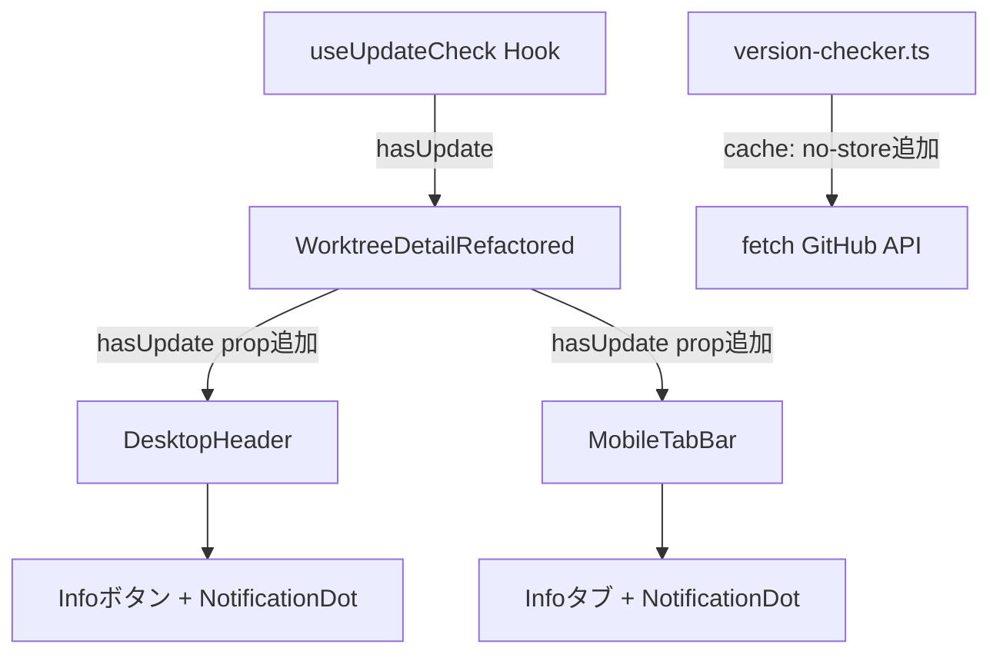

# 設計方針書: Issue #278 - fetch Data Cacheによりバージョンチェックが機能しない + Info通知表示

## 1. 概要

### Issue概要
Issue #257（バージョンアップ通知機能）および Issue #270（force-dynamic修正）の実装において、Next.jsのfetch Data Cacheが無効化されておらず、GitHub Releases APIのレスポンスがビルド時の結果でキャッシュされ続ける問題を修正する。加えて、アップデートが存在する場合にInfoボタン/タブに通知インジケーターを表示する。

### 対応項目
1. **バグ修正**: `src/lib/version-checker.ts` の fetch に `cache: "no-store"` を追加
2. **機能追加**: Infoボタン（Desktop）/ Infoタブ（Mobile）にアップデート通知インジケーターを表示

## 2. アーキテクチャ設計

### 現在のデータフロー
```
useUpdateCheck Hook → /api/app/update-check → checkForUpdate() → GitHub API
                                                                    ↓
                                              globalThis Cache (1h TTL)
                                                                    ↓
                                              UpdateNotificationBanner (InfoModal内)
```

### 変更後のデータフロー
```
useUpdateCheck Hook → /api/app/update-check → checkForUpdate() → GitHub API (cache: "no-store")
       ↓                                                              ↓
  hasUpdate状態                                    globalThis Cache (1h TTL)
       ↓                                                              ↓
  DesktopHeader (Infoボタン + インジケーター)     UpdateNotificationBanner (InfoModal内)
  MobileTabBar (Infoタブ + インジケーター)
```

### 変更概要図


## 3. 技術選定

| カテゴリ | 選定技術 | 選定理由 |
|---------|---------|---------|
| フレームワーク | Next.js 14 (既存) | 既存技術スタック |
| fetch制御 | `cache: "no-store"` | Next.js Data Cache無効化の標準手法 |
| 通知UI | NotificationDot共通コンポーネント | DRY原則準拠 (MF-001対応) |
| テスト | Vitest | 既存テストフレームワーク |

## 4. 設計パターン

### 4-1. fetch Data Cache修正

**変更箇所**: `src/lib/version-checker.ts` L184-190

```typescript
// Before
const response = await fetch(GITHUB_API_URL, {
  headers: {
    'Accept': 'application/vnd.github+json',
    'User-Agent': `CommandMate/${getCurrentVersion()}`,
  },
  signal: AbortSignal.timeout(FETCH_TIMEOUT_MS),
});

// After
const response = await fetch(GITHUB_API_URL, {
  headers: {
    'Accept': 'application/vnd.github+json',
    'User-Agent': `CommandMate/${getCurrentVersion()}`,
  },
  cache: 'no-store',
  signal: AbortSignal.timeout(FETCH_TIMEOUT_MS),
});
```

**設計根拠**:
- `export const dynamic = "force-dynamic"` はルートレベルの静的プリレンダリングを防ぐが、fetch Data Cacheは別メカニズム
- `cache: "no-store"` は個別fetch呼び出しでData Cacheを無効化する唯一の方法
- globalThisキャッシュ（1時間TTL）は引き続き有効であり、GitHub APIへの過剰リクエストを防止

### 4-2. アップデート通知インジケーター

#### [MF-001対応] NotificationDot 共通コンポーネントの抽出

**レビュー指摘**: ドットバッジのCSS className文字列 (`w-2 h-2 rounded-full bg-blue-500`) が BranchListItem、DesktopHeader、MobileTabBar の3箇所にコピーペーストで分散するDRY違反リスク。将来ドットバッジの色やサイズを変更する際に全箇所の同期が必要。

**対応方針**: 以下の2つのアプローチから選択する。

**アプローチA（推奨）: 共通コンポーネント `NotificationDot` の作成**

`src/components/common/NotificationDot.tsx` を新規作成し、3箇所すべてで再利用する。

```typescript
interface NotificationDotProps {
  /** テスト用ID */
  'data-testid'?: string;
  /** アクセシビリティラベル */
  'aria-label'?: string;
  /**
   * 追加CSSクラス（position調整用）
   * [SEC-SF-001] セキュリティ注記: このpropにはハードコードされた文字列値のみを渡すこと。
   * ユーザー入力由来の値を絶対に渡さないこと（className injection防止）。
   */
  className?: string;
}

export function NotificationDot({
  'data-testid': testId,
  'aria-label': ariaLabel,
  className = '',
}: NotificationDotProps) {
  return (
    <span
      data-testid={testId}
      className={`w-2 h-2 rounded-full bg-blue-500 ${className}`.trim()}
      aria-label={ariaLabel}
    />
  );
}
```

**アプローチB: BADGE_CLASSES 定数の定義**

`src/config/` 配下に定数を定義して一元管理する。

```typescript
// src/config/notification-badge.ts
export const NOTIFICATION_DOT_CLASSES = 'w-2 h-2 rounded-full bg-blue-500';
```

**判断**: アプローチAを推奨。コンポーネントとして抽出することで、`data-testid` や `aria-label` の属性も含めた一貫性を担保できる。BranchListItem.tsx の既存ドットバッジも将来的にこのコンポーネントに置き換えることを推奨する（ただし Issue #278 のスコープ外）。

**参照パターン**: `src/components/sidebar/BranchListItem.tsx` L109-116

```typescript
{branch.hasUnread && (
  <span
    data-testid="unread-indicator"
    className="w-2 h-2 rounded-full bg-blue-500 flex-shrink-0"
    aria-label="Has unread messages"
  />
)}
```

**設計方針**:
- NotificationDot共通コンポーネントを使用（DRY原則、MF-001対応）
- ドットバッジの色は `bg-blue-500`（情報通知）を使用
- `aria-label` でアクセシビリティ確保
- `data-testid` でテスタビリティ確保

#### Desktop: DesktopHeader コンポーネント

`DesktopHeaderProps` に `hasUpdate?: boolean` を追加し、Infoボタン横にドットバッジを表示。

```typescript
interface DesktopHeaderProps {
  // 既存props...
  hasUpdate?: boolean; // 追加
}
```

Infoボタン内のインジケーター表示:
```typescript
<button onClick={onInfoClick} className="... relative">
  {/* 既存SVGアイコン */}
  <span>Info</span>
  {hasUpdate && (
    <NotificationDot
      data-testid="info-update-indicator"
      className="absolute top-0 right-0"
      aria-label="Update available"
    />
  )}
</button>
```

##### [IMP-SF-001対応] DesktopHeader の hasUpdate props 伝搬テスト

**レビュー指摘 (Stage 3 影響分析レビュー)**: DesktopHeader は WorktreeDetailRefactored.tsx 内で定義された内部コンポーネントであり、外部からの単体テストが困難。`hasUpdate` prop の伝搬が正しく動作するかは結合的なテストでしか検証できない。設計書では `tests/unit/components/mobile/mobile-tab-bar.test.tsx` のテスト追加は明記されているが、DesktopHeader 側のテスト方針は明示されていなかった。

**対応方針**: `tests/unit/components/WorktreeDetailRefactored.test.tsx` にて、以下のテストケースを追加する:
- `useUpdateCheck` を mock し、`hasUpdate: true` を返す設定で WorktreeDetailRefactored をレンダリング
- `info-update-indicator` の `data-testid` が DOM 上に存在することを検証
- `hasUpdate: false` または `undefined` の場合に `info-update-indicator` が表示されないことを検証

**テスト実装例**:
```typescript
// useUpdateCheck の mock
vi.mock('@/hooks/useUpdateCheck', () => ({
  useUpdateCheck: vi.fn(),
}));

// hasUpdate=true のケース
it('should show info-update-indicator when update is available', () => {
  (useUpdateCheck as Mock).mockReturnValue({
    data: { hasUpdate: true, latestVersion: '2.0.0', currentVersion: '1.0.0' },
    loading: false,
    error: null,
  });
  render(<WorktreeDetailRefactored {...defaultProps} />);
  expect(screen.getByTestId('info-update-indicator')).toBeInTheDocument();
});

// hasUpdate=false のケース
it('should not show info-update-indicator when no update is available', () => {
  (useUpdateCheck as Mock).mockReturnValue({
    data: { hasUpdate: false },
    loading: false,
    error: null,
  });
  render(<WorktreeDetailRefactored {...defaultProps} />);
  expect(screen.queryByTestId('info-update-indicator')).not.toBeInTheDocument();
});
```

**注意**: WorktreeDetailRefactored.test.tsx に既存テストが存在する場合、`useUpdateCheck` の mock が追加されることで、既存テストが mock 未設定の状態で `useUpdateCheck` を呼び出してエラーになる可能性がある。既存テストの `beforeEach` または `beforeAll` で `useUpdateCheck` のデフォルト mock を設定すること。

##### [CONS-SF-001対応] DesktopHeader Infoボタンへの `relative` クラス追加

**レビュー指摘 (Stage 2 整合性レビュー)**: 上記コード例では `className="... relative"` と記載しているが、既存の DesktopHeader Infoボタン（WorktreeDetailRefactored.tsx L550-571）には `relative` CSSクラスが付与されていない。NotificationDot は `className="absolute top-0 right-0"` で絶対位置指定されるため、親要素に `relative` がないと、最も近い positioned ancestor を基準にレイアウトされてしまい、意図した位置にドットが表示されない。

**対応方針**: 実装時に DesktopHeader の Infoボタンの `className` に `relative` を追加すること。MobileTabBar のタブボタンは既に baseStyles (L118) で `relative` が含まれているため、こちらは追加不要。

**実装例**:
```typescript
// Before (既存)
<button onClick={onInfoClick} className="flex items-center gap-1 ...">

// After (relative追加)
<button onClick={onInfoClick} className="relative flex items-center gap-1 ...">
```

**注意**: `relative` を追加しても、既存のInfoボタンのレイアウトには影響しない（子要素に absolute 指定の要素がない限り、position: relative は視覚的変化を生じない）。

#### Mobile: MobileTabBar コンポーネント

`MobileTabBarProps` に `hasUpdate?: boolean` を追加し、Infoタブにドットバッジを表示。

```typescript
interface MobileTabBarProps {
  // 既存props...
  hasUpdate?: boolean; // 追加
}
```

Infoタブのインジケーター表示:
```typescript
{tab.id === 'info' && hasUpdate && (
  <NotificationDot
    data-testid="info-update-badge"
    className="absolute top-1 right-1"
    aria-label="Update available"
  />
)}
```

##### [CONS-SF-002対応] MobileTabBar バッジ描画パターンの不整合に関する注記

**レビュー指摘 (Stage 2 整合性レビュー)**: MobileTabBar の既存バッジ（ターミナルタブの hasNewOutput: bg-green-500, hasPrompt: bg-yellow-500）は、MobileTabBar.tsx L133-148 においてインライン `<span>` 要素と生のclassName文字列で描画されている。一方、新規追加する hasUpdate バッジは NotificationDot コンポーネントを使用する。同一コンポーネント内で2つの異なるバッジ描画パターンが混在することになる。

**現時点の判断**: Issue #278 のスコープでは、新規追加分のみ NotificationDot を使用し、既存のインラインバッジはそのまま維持する。NotificationDot コンポーネントが Issue #278 で導入されるため、既存バッジの置き換えは別タスクとして扱うのが適切である。

**将来対応**: 既存のターミナルタブバッジ（hasNewOutput, hasPrompt）も NotificationDot コンポーネントに統一することを推奨する。その際、NotificationDot に `color` prop を追加して `bg-green-500` や `bg-yellow-500` にも対応可能にする設計拡張を検討する。BranchListItem の既存ドットバッジ統一と合わせて、バッジ描画パターンの一元化を別 Issue として起票することを推奨する。

### 4-3. データの流れ（Props Drilling）

```
WorktreeDetailRefactored
  └─ useUpdateCheck() → { data: { hasUpdate } }
      ├─ DesktopHeader hasUpdate={data?.hasUpdate}
      └─ MobileTabBar hasUpdate={data?.hasUpdate}
```

**設計判断**: Context APIではなくprops drillingを選択
- 理由: 1階層のみの伝搬であり、Context導入はYAGNI原則に反する
- 既存パターン: `hasNewOutput`, `hasPrompt` も同様にprops経由で渡されている

#### [SF-001対応] WorktreeDetailRefactored の責務過多に関する注記

**レビュー指摘**: WorktreeDetailRefactored.tsx は既に2082行を超える大規模コンポーネントであり、useUpdateCheck() フックの呼び出しと hasUpdate の状態伝搬を追加すると責務がさらに増大する。

**現時点の判断**: 1階層のみの伝搬であり、既存パターン（hasNewOutput, hasPrompt）に準拠しているため、Issue #278 のスコープでは許容する。

**将来対応**: WorktreeDetailRefactored の責務を分割する計画（レイアウト責務とデータフェッチ責務の分離）を別 Issue として起票することを推奨する。具体的には以下の分割を検討する:
- レイアウト・ルーティング責務を持つコンテナコンポーネント
- データフェッチ・状態管理責務を持つカスタムフック群
- UIプレゼンテーション責務を持つ子コンポーネント群

## 5. 変更対象ファイル

| ファイル | 変更内容 | 種別 |
|---------|---------|------|
| `src/lib/version-checker.ts` | fetch に `cache: "no-store"` 追加、JSDocにglobalThisキャッシュの説明追記 (SF-002対応) | バグ修正 |
| `src/components/common/NotificationDot.tsx` | 通知ドットバッジ共通コンポーネント新規作成 (MF-001対応) | 新規追加 |
| `src/components/worktree/WorktreeDetailRefactored.tsx` | `useUpdateCheck` 呼出追加、DesktopHeader/MobileTabBarにhasUpdate prop伝搬 | 機能追加 |
| `src/components/worktree/WorktreeDetailRefactored.tsx` (DesktopHeader) | `hasUpdate` prop追加、Infoボタンにドットバッジ表示（NotificationDot使用） | 機能追加 |
| `src/components/mobile/MobileTabBar.tsx` | `hasUpdate` prop追加、Infoタブにドットバッジ表示（NotificationDot使用） | 機能追加 |
| `tests/unit/lib/version-checker.test.ts` | `cache: "no-store"` の検証テスト追加 (SEC-SF-002対応: リグレッション防止アサーション含む) | テスト |
| `tests/unit/components/mobile/mobile-tab-bar.test.tsx` | hasUpdateインジケーターテスト追加 | テスト |
| `tests/unit/components/common/notification-dot.test.tsx` | NotificationDotコンポーネントテスト追加 (MF-001対応) | テスト |

## 6. セキュリティ設計

### 既存セキュリティ対策（変更なし）
- [SEC-001] GITHUB_API_URL はハードコード定数（SSRF防止）
- [SEC-SF-001] レスポンスバリデーション（validateReleaseUrl, sanitizeReleaseName）
- [SEC-SF-002] User-Agent ヘッダー（GitHub API準拠）
- [SEC-SF-003] HTTPキャッシュヘッダー（Cache-Control: no-store）

### 追加セキュリティ考慮
- `cache: "no-store"` はセキュリティ向上にも寄与（古いキャッシュによる誤情報防止）
- UIインジケーターは `hasUpdate` booleanのみを使用（外部データの直接表示なし）[SEC-C-001: XSS防止の観点から理想的なパターン]

#### [SEC-SF-001対応] NotificationDot className prop のセキュリティ制約

**レビュー指摘 (Stage 4 セキュリティレビュー)**: NotificationDot は className prop を受け取り、そのまま className 文字列に結合している。現在は内部利用のみでユーザー入力に公開されていないが、防御的アプローチとして className prop がユーザー入力由来の値を受け取ってはならないことをドキュメント化すべきである。

**対応方針**:
- `src/components/common/NotificationDot.tsx` の className prop に JSDoc コメントを追加し、ハードコードされた文字列値のみを受け付けることを明記する
- className prop にはリテラル文字列（例: `"absolute top-0 right-0"`）のみを渡し、動的に生成された値やユーザー入力を渡さないことをコード規約とする

#### [SEC-SF-002対応] cache: 'no-store' のリグレッション防止テスト

**レビュー指摘 (Stage 4 セキュリティレビュー)**: 設計書 Section 5 で `cache: 'no-store'` の追加を明記しているが、既存テスト（SEC-SF-002: User-Agent ヘッダー検証）は fetch のオプションを検証しつつも cache オプションのチェックは行っていない。cache: 'no-store' が将来の変更で意図せず削除されることを防ぐテストアサーションが必要。

**対応方針**: `tests/unit/lib/version-checker.test.ts` に cache: 'no-store' を検証する明示的なテストアサーションを追加する。

**テスト実装例**:
```typescript
it('should pass cache: no-store to fetch to prevent Next.js Data Cache', async () => {
  // ... setup mock
  await checkForUpdate();
  expect(globalThis.fetch).toHaveBeenCalledWith(
    expect.any(String),
    expect.objectContaining({
      cache: 'no-store',
    })
  );
});
```

#### [SEC-C-001/C-002/C-003] セキュリティ検証済み項目

以下の項目は Stage 4 セキュリティレビューで検証済みであり、追加対応は不要:
- **SEC-C-001 (XSS防止)**: hasUpdate boolean のみによる UI 描画は正しいアプローチ
- **SEC-C-002 (SSRF防止)**: 既存の SEC-001 SSRF 制御（GITHUB_API_URL ハードコード）は変更なく適切
- **SEC-C-003 (外部リンクセキュリティ)**: 既存の `rel='noopener noreferrer'` は維持されており、NotificationDot は外部リンクを導入しない

## 7. パフォーマンス設計

### キャッシュ戦略
- **Next.js Data Cache**: `cache: "no-store"` で無効化（必須修正）
- **globalThis Cache**: 1時間TTLは維持（GitHub API rate limit対策）
- **HTTP Cache**: Route handler で `Cache-Control: no-store, no-cache, must-revalidate` 設定済み

### UI パフォーマンス
- `useUpdateCheck` はコンポーネントマウント時に1回のみ実行
- `useMemo` でbannerPropsをメモ化（既存実装）
- DesktopHeader, MobileTabBar は `memo()` でラップ済み

#### [IMP-SF-002対応] useUpdateCheck の再レンダリング影響

**レビュー指摘 (Stage 3 影響分析レビュー)**: WorktreeDetailRefactored に `useUpdateCheck()` を追加すると、`loading`/`data`/`error` の state 変化で再レンダリングが発生する。WorktreeDetailRefactored は2081行を超える大規模コンポーネントであるため、再レンダリングコストについて考慮が必要。

**分析結果**: `useUpdateCheck` はマウント時に1回のみ fetch を実行するため、state 変化は最大2回のみ:
1. `loading: false -> true` (fetch開始)
2. `loading: true -> false` + `data` 設定 (fetch完了)

**パフォーマンス影響**: 無視可能。理由は以下の通り:
- state 変化はマウント時の最大2回のみであり、ユーザー操作中の再レンダリングは発生しない
- DesktopHeader と MobileTabBar は `memo()` でラップ済みのため、`hasUpdate` prop に変化がない限り子コンポーネントの再レンダリングは発生しない
- マウント時の2回の再レンダリングは、通常のフック初期化パターン（useEffect + setState）と同等であり、体感上の遅延は生じない

### [SF-002対応] useUpdateCheck 二重呼び出しのキャッシュ動作

WorktreeDetailRefactored と VersionSection の両方で `useUpdateCheck()` を呼ぶことによる二重API呼び出しの可能性がある。`checkForUpdate()` 内部の globalThis キャッシュにより、同一プロセス内での複数呼び出しはネットワーク負荷なしでキャッシュヒットする。

**ドキュメント化要件**: `src/lib/version-checker.ts` の `checkForUpdate()` 関数の JSDoc コメントに以下の情報を明記すること:
- 同一プロセス内での複数呼び出しは globalThis キャッシュ（1時間TTL）によりネットワーク負荷なし
- キャッシュは globalThis.__updateCheckCache に保持され、TTL経過後に自動無効化

これにより、将来の開発者が二重呼び出しをパフォーマンス問題として誤認することを防止する。

## 8. 設計上の決定事項とトレードオフ

| 決定事項 | 理由 | トレードオフ |
|---------|------|-------------|
| Props drilling（Context不使用） | 1階層のみの伝搬、既存パターン準拠 | 深い階層には不適 |
| NotificationDot共通コンポーネント (MF-001) | DRY原則、3箇所のCSS重複防止 | 小さなコンポーネントが1つ増える |
| bg-blue-500（赤でなく青） | 情報通知であり緊急性が低い、既存カラー統一 | 赤の方が目立つ |
| useUpdateCheckの再利用 (SF-002) | DRY原則、既存VersionSection内で既に使用 | 2回呼出（globalThisキャッシュで実害なし） |

### 代替案との比較

**代替案1: useUpdateCheckをWorktreeDetailRefactoredで呼び、VersionSectionにdataを渡す**
- メリット: API呼出が1回のみ
- デメリット: VersionSectionのインターフェース変更が必要、既存コンポーネントの責務変更
- 判断: **採用** - WorktreeDetailRefactoredでuseUpdateCheckを呼び、DesktopHeader/MobileTabBarにhasUpdateを渡す。VersionSectionは内部でuseUpdateCheckを呼んでいるが、globalThisキャッシュにより2回目はキャッシュヒットするため実質的なコストは無視可能。

**代替案2: グローバルStateで管理（Context API）**
- メリット: props drillingが不要
- デメリット: オーバーエンジニアリング、YAGNI
- 判断: 不採用

**代替案3 (MF-001): className文字列のコピーペースト（元の設計）**
- メリット: シンプル、既存パターンの直接踏襲
- デメリット: 3箇所でのCSS重複、将来の同期コスト
- 判断: 不採用 - NotificationDot共通コンポーネントで一元管理する

## 9. i18n対応

### [SF-003対応] aria-label の言語方針

新規追加する `aria-label` は英語固定とする。

**方針確認事項**: 実装前に既存コードベースの `aria-label` の i18n 方針を確認すること:
- 既存の `aria-label` が全て英語固定であれば、本設計と一貫している
- 既存の `aria-label` の一部が i18n 対応（翻訳キー使用）されている場合は、それに合わせて本設計の `aria-label` も i18n 対応に変更する

**確認対象ファイル**:
- `src/components/sidebar/BranchListItem.tsx` - 既存の `aria-label="Has unread messages"`
- `src/components/worktree/UpdateNotificationBanner.tsx` - 既存の aria-label
- その他の `src/components/` 配下のコンポーネント

**現時点の想定**: 既存パターン（BranchListItem の `aria-label="Has unread messages"`）が英語固定であるため、本設計も英語固定とする。一貫性が確認できれば問題なし。

## 10. 受入条件

- [ ] fetch に `cache: "no-store"` が指定されていること
- [ ] NotificationDot共通コンポーネントが作成されていること (MF-001)
- [ ] アップデート対象バージョンが存在する場合、Desktop Infoボタンに通知インジケーターが表示されること
- [ ] アップデート対象バージョンが存在する場合、Mobile Infoタブに通知インジケーターが表示されること
- [ ] アップデートがない場合には通知インジケーターが表示されないこと
- [ ] 既存テストがすべてパスすること
- [ ] 新規テストが追加されていること（NotificationDotテスト含む）
- [ ] version-checker.ts のJSDocにglobalThisキャッシュの説明が記載されていること (SF-002)
- [ ] aria-label の言語方針が既存コードベースと一貫していること (SF-003)
- [ ] DesktopHeader Infoボタンに `relative` CSSクラスが付与されていること (CONS-SF-001)
- [ ] NotificationDot の absolute 配置が正しく機能すること（Desktop/Mobile両方で確認）
- [ ] WorktreeDetailRefactored のテストで `info-update-indicator` の表示/非表示が検証されていること (IMP-SF-001)
- [ ] useUpdateCheck の再レンダリング影響（最大2回）がパフォーマンス上許容可能であることが設計書に明記されていること (IMP-SF-002)
- [ ] NotificationDot の className prop に JSDoc セキュリティ注記（ユーザー入力不可）が記載されていること (SEC-SF-001)
- [ ] `tests/unit/lib/version-checker.test.ts` に `cache: 'no-store'` のリグレッション防止テストが含まれていること (SEC-SF-002)

## 11. 実装チェックリスト

### Must Fix (必須対応)

- [ ] **[MF-001] NotificationDot共通コンポーネントの作成** (DRY)
  - [ ] `src/components/common/NotificationDot.tsx` を新規作成
  - [ ] Props: `data-testid`, `aria-label`, `className` (位置調整用)
  - [ ] 基本スタイル: `w-2 h-2 rounded-full bg-blue-500`
  - [ ] DesktopHeader でNotificationDotを使用
  - [ ] MobileTabBar でNotificationDotを使用
  - [ ] `tests/unit/components/common/notification-dot.test.tsx` を追加
  - [ ] (将来) BranchListItem.tsx の既存ドットバッジもNotificationDotに置き換え検討

### Should Fix (推奨対応)

- [ ] **[SF-001] WorktreeDetailRefactored責務分割の検討Issue起票** (SRP)
  - [ ] レイアウト・データフェッチ・UI表示の責務分離を検討するIssueを作成
  - [ ] Issue #278の実装完了後に起票する

- [ ] **[SF-002] globalThisキャッシュのJSDocドキュメント化** (DRY)
  - [ ] `src/lib/version-checker.ts` の `checkForUpdate()` 関数にJSDocコメント追記
  - [ ] 「同一プロセス内での複数呼び出しは globalThis キャッシュ（1時間TTL）によりネットワーク負荷なし」を明記
  - [ ] キャッシュの保持先と無効化条件を記載

- [ ] **[SF-003] aria-label言語方針の一貫性確認** (KISS)
  - [ ] 既存コンポーネントのaria-labelの言語を確認
  - [ ] 英語固定が全体方針であることを確認
  - [ ] 一貫性に問題がある場合は方針を修正

- [ ] **[CONS-SF-001] DesktopHeader Infoボタンに `relative` クラス追加** (CSS positioning)
  - [ ] WorktreeDetailRefactored.tsx の DesktopHeader Infoボタンの className に `relative` を追加
  - [ ] NotificationDot の absolute 配置がInfoボタンを基準に正しく表示されることを確認
  - [ ] 既存のInfoボタンのレイアウトに影響がないことを確認

- [ ] **[IMP-SF-001] WorktreeDetailRefactored のユニットテストで DesktopHeader の hasUpdate 伝搬を検証** (test coverage)
  - [ ] `tests/unit/components/WorktreeDetailRefactored.test.tsx` に `info-update-indicator` の表示テストを追加
  - [ ] useUpdateCheck の mock を設定し、hasUpdate=true の場合に `info-update-indicator` data-testid が表示されることを検証
  - [ ] hasUpdate=false の場合に `info-update-indicator` が表示されないことを検証

- [ ] **[IMP-SF-002] useUpdateCheck の再レンダリング影響のドキュメント化** (performance)
  - [ ] 設計書 Section 7 パフォーマンス設計に再レンダリング影響の分析を追記（反映済）
  - [ ] useUpdateCheck の state 変化は最大2回（loading切替 + data設定）であり、パフォーマンス影響は無視可能であることを明記

- [ ] **[SEC-SF-001] NotificationDot className prop に JSDoc セキュリティ注記を追加** (Input validation)
  - [ ] `src/components/common/NotificationDot.tsx` の className prop に「ハードコードされた文字列値のみ使用可、ユーザー入力由来の値は不可」の JSDoc コメントを追加
  - [ ] className injection を防止するための開発者向け注記を明記

- [ ] **[SEC-SF-002] cache: 'no-store' リグレッション防止テスト追加** (Test coverage)
  - [ ] `tests/unit/lib/version-checker.test.ts` に `cache: 'no-store'` が fetch オプションに含まれていることを検証するテストアサーションを追加
  - [ ] `expect.objectContaining({ cache: 'no-store' })` パターンでの検証

- [ ] **[CONS-SF-002] MobileTabBar バッジ描画パターン統一の検討** (component pattern)
  - [ ] Issue #278 では新規バッジのみ NotificationDot を使用（既存バッジはスコープ外）
  - [ ] (将来) 既存のインラインバッジ（hasNewOutput, hasPrompt）を NotificationDot に統一する別 Issue の起票を検討
  - [ ] (将来) NotificationDot に `color` prop を追加する設計拡張を検討

### 基本実装

- [ ] `src/lib/version-checker.ts` に `cache: "no-store"` を追加
- [ ] WorktreeDetailRefactored に `useUpdateCheck()` 呼び出しを追加
- [ ] DesktopHeader に `hasUpdate` prop を追加
- [ ] DesktopHeader Infoボタンに `relative` クラスを追加 (CONS-SF-001)
- [ ] MobileTabBar に `hasUpdate` prop を追加
- [ ] `tests/unit/lib/version-checker.test.ts` にテスト追加
- [ ] `tests/unit/components/mobile/mobile-tab-bar.test.tsx` にテスト追加
- [ ] `tests/unit/components/WorktreeDetailRefactored.test.tsx` に `info-update-indicator` 表示テスト追加 (IMP-SF-001)

## 12. レビュー履歴

| ステージ | 日付 | ステータス | スコア | 指摘数 |
|---------|------|----------|-------|--------|
| Stage 1: 通常レビュー | 2026-02-14 | conditionally_approved | 4/5 | MF:1, SF:3, C:3 |
| Stage 2: 整合性レビュー | 2026-02-14 | approved | 5/5 | MF:0, SF:2, C:3 |
| Stage 3: 影響分析レビュー | 2026-02-14 | approved | 5/5 | MF:0, SF:2, C:3 |
| Stage 4: セキュリティレビュー | 2026-02-14 | approved | 5/5 | MF:0, SF:2, C:3 |

## 13. レビュー指摘事項サマリー

### Stage 1: 通常レビュー (2026-02-14)

#### Must Fix

| ID | 原則 | タイトル | 重要度 | 対応状況 |
|----|------|---------|--------|---------|
| MF-001 | DRY | ドットバッジUIパターンの重複定義リスク | medium | 設計に反映済 (Section 4-2) |

#### Should Fix

| ID | 原則 | タイトル | 重要度 | 対応状況 |
|----|------|---------|--------|---------|
| SF-001 | SRP | WorktreeDetailRefactored の責務過多へのさらなる追加 | low | 設計に反映済 (Section 4-3) |
| SF-002 | DRY | useUpdateCheck の二重呼び出しに関する設計根拠の明確化 | low | 設計に反映済 (Section 7) |
| SF-003 | KISS | aria-label の言語一貫性 | low | 設計に反映済 (Section 9) |

#### Consider (参考情報)

| ID | 原則 | タイトル | 重要度 | 備考 |
|----|------|---------|--------|------|
| C-001 | YAGNI | hasUpdate の optional prop 設計は適切 | info | 現行設計を維持。Context API は通知種別が増えた場合にのみ検討 |
| C-002 | Open/Closed | MobileTabBar のバッジ表示パターンの拡張性 | info | 3つ以上のタブがバッジを持つようになった時点でリファクタリング検討 |
| C-003 | DRY / ISP | DesktopHeader の内部定義 vs 外部分離 | info | 将来的に独立ファイルとして分離を検討。Issue #278 のスコープ外 |

### Stage 2: 整合性レビュー (2026-02-14)

#### Must Fix

なし

#### Should Fix

| ID | カテゴリ | タイトル | 重要度 | 対応状況 |
|----|---------|---------|--------|---------|
| CONS-SF-001 | CSS positioning consistency | DesktopHeader Infoボタンに `relative` クラスが不足 | medium | 設計に反映済 (Section 4-2, Desktop) |
| CONS-SF-002 | component pattern consistency | MobileTabBar バッジ描画パターンの不整合（inline span vs NotificationDot） | low | 設計に反映済 (Section 4-2, Mobile) |

#### Consider (参考情報)

| ID | カテゴリ | タイトル | 重要度 | 備考 |
|----|---------|---------|--------|------|
| CONS-C-001 | i18n consistency | aria-label英語固定は既存パターンと一致 | info | 英語固定が全体方針であることを確認済。UpdateNotificationBannerのi18n対応が例外的 |
| CONS-C-002 | directory structure consistency | NotificationDot の common/ 配置は既存パターンと一致 | info | Toast.tsx, LocaleSwitcher.tsx と同じディレクトリ構成 |
| CONS-C-003 | documentation accuracy | 設計書の行番号参照は概算値 | info | 実装時にソースコードの実際の行番号を確認すること |

### Stage 3: 影響分析レビュー (2026-02-14)

#### Must Fix

なし

#### Should Fix

| ID | カテゴリ | タイトル | 重要度 | 対応状況 |
|----|---------|---------|--------|---------|
| IMP-SF-001 | test coverage gap | WorktreeDetailRefactored のユニットテストで DesktopHeader の hasUpdate props 伝搬を検証するテストが未定義 | low | 設計に反映済 (Section 11, チェックリスト) |
| IMP-SF-002 | re-render scope | useUpdateCheck() の追加による WorktreeDetailRefactored の再レンダリング影響の明示化 | low | 設計に反映済 (Section 7, パフォーマンス設計) |

#### Consider (参考情報)

| ID | カテゴリ | タイトル | 重要度 | 備考 |
|----|---------|---------|--------|------|
| IMP-C-001 | backward compatibility | MobileTabBarProps の hasUpdate optional prop は後方互換 | info | optional prop のため既存呼び出し元への影響なし |
| IMP-C-002 | existing test stability | 既存 MobileTabBar テストは hasUpdate 未指定のケースを暗黙的にカバー | info | defaultProps に hasUpdate が含まれていないため既存テストは変更不要 |
| IMP-C-003 | version-checker fetch behavior | cache: no-store 追加後のネットワーク動作変化 | info | globalThis キャッシュが引き続き有効。唯一の変化は npm run build 時のビルドキャッシュ無効化（本修正の目的そのもの） |

### Stage 4: セキュリティレビュー (2026-02-14)

#### Must Fix

なし

#### Should Fix

| ID | カテゴリ | タイトル | 重要度 | 対応状況 |
|----|---------|---------|--------|---------|
| SEC-SF-001 | Input validation | NotificationDot className prop injection prevention | low | 設計に反映済 (Section 6, セキュリティ設計) |
| SEC-SF-002 | Test coverage | cache: 'no-store' security test should verify the exact fetch option | low | 設計に反映済 (Section 6, セキュリティ設計 / Section 11, チェックリスト) |

#### Consider (参考情報)

| ID | カテゴリ | タイトル | 重要度 | 備考 |
|----|---------|---------|--------|------|
| SEC-C-001 | XSS prevention | hasUpdate boolean-only UI rendering は正しいアプローチ | info | 外部APIデータの直接表示を回避。XSS防止の観点で理想的パターン |
| SEC-C-002 | SSRF prevention | 既存 SEC-001 SSRF制御は変更なく適切 | info | GITHUB_API_URL ハードコード定数。cache: no-store 追加は SSRF ベクターを導入しない |
| SEC-C-003 | External link security | 既存 rel='noopener noreferrer' は維持 | info | NotificationDot は外部リンクを導入しない。UpdateNotificationBanner の既存保護は維持 |

#### OWASP Top 10 チェック結果

| カテゴリ | ステータス | 備考 |
|---------|-----------|------|
| A01: Broken Access Control | N/A | アクセス制御変更なし |
| A02: Cryptographic Failures | N/A | 暗号操作なし |
| A03: Injection | Pass | 既存バリデーション維持、boolean-only UI |
| A04: Insecure Design | Pass | 多層防御維持 |
| A05: Security Misconfiguration | Pass | cache: no-store で Data Cache 設定修正 |
| A06: Vulnerable Components | N/A | 新規依存なし |
| A07: Auth Failures | N/A | 認証メカニズムなし |
| A08: Data Integrity Failures | Pass | レスポンスバリデーション維持 |
| A09: Logging/Monitoring | N/A | ログ変更なし |
| A10: SSRF | Pass | GITHUB_API_URL ハードコード維持 |
