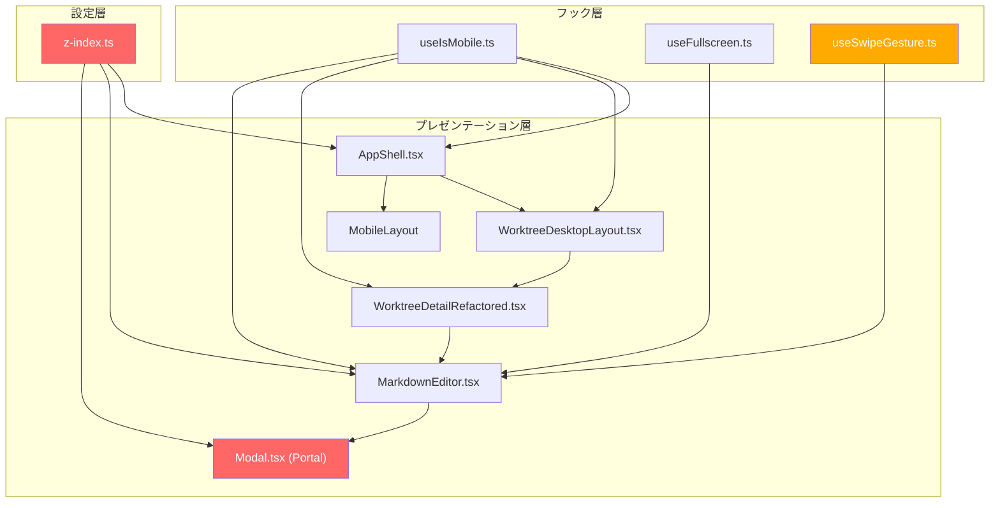

# 設計方針書: Issue #299 iPad/スマホ レイアウト崩れ・全画面表示不具合修正

## 1. 概要

### 対象Issue
- **Issue #299**: レイアウトが崩れる（iPad Chrome / スマホ）

### 症状一覧
| # | 症状 | 影響範囲 | 重要度 |
|---|------|---------|--------|
| 1 | iPad: トップ画面レイアウト崩れ | iPad横置き（縦置きでも可能性あり） | 中 |
| 2 | iPad: Markdownファイル表示崩れ | iPad横置き（縦置きでも可能性あり） | 中 |
| 3 | iPad: 全画面表示時に真っ白 | iPad縦・横双方 | 高 |
| 4 | スマホ: 全画面スクロールで全画面解除 | スマホ全般 | 中 |

### 設計方針の目的
4つの症状を個別に解決しつつ、z-index体系の統一とレスポンシブ設計の改善を行う。既存のデスクトップ・モバイルレイアウトへのリグレッションを防止する。

---

## レビュー履歴

| 段階 | 実施日 | フォーカス | 結果 | スコア |
|------|--------|-----------|------|--------|
| Stage 1 | 2026-02-18 | 設計原則 | 条件付き承認 | 4/5 |
| Stage 2 | 2026-02-18 | 整合性 | 条件付き承認 | 4/5 |
| Stage 3 | 2026-02-18 | 影響分析 | 条件付き承認 | 4/5 |
| Stage 4 | 2026-02-18 | セキュリティ | 承認 | 5/5 |

---

## レビュー指摘事項サマリー

### Stage 1: 設計原則レビュー

| ID | 重要度 | カテゴリ | 指摘内容 | 対応状況 |
|----|--------|---------|---------|---------|
| F007 | Must Fix | 設計方針 | Modal.tsxのz-index変更時のz-50競合分析が不足 | 反映済み (3.1に競合分析セクション追加) |
| F001 | Should Fix | DRY/YAGNI | MOBILE_HEADER/MOBILE_DRAWER定数追加がスコープ外と矛盾 | 反映済み (定数追加をスコープ外として削除) |
| F002 | Should Fix | DRY | MODAL=50とMOBILE_DRAWER=50の値重複の設計根拠不足 | 反映済み (F001の解消により自動解決) |
| F003 | Nice to Have | KISS | isInsideScrollableElementがoverflowYのみ | 認識済み (将来対応) |
| F004 | Nice to Have | SRP | isInsideScrollableElementの配置 | 認識済み (将来対応) |
| F005 | Nice to Have | 設計方針 | SearchBar.tsxのリサイズ非追従の設計根拠 | 認識済み (将来対応) |
| F006 | Nice to Have | 設計方針 | Phase 3の「必要に応じて」の曖昧さ | 認識済み (将来対応) |

### Stage 2: 整合性レビュー

| ID | 重要度 | カテゴリ | 指摘内容 | 対応状況 |
|----|--------|---------|---------|---------|
| F001 | Must Fix | コード整合 | Toast/ContextMenuのz-index競合分析の誤り: Toast.tsx(L205)はz-50ハードコードでZ_INDEX.TOAST未使用、ContextMenu.tsx(L228)もz-50ハードコードでZ_INDEX.CONTEXT_MENU未使用。競合分析の前提が実装と不整合 | 反映済み (3.1競合分析セクション修正、Phase 1チェックリストにToast/ContextMenu確認項目追加) |
| F002 | Should Fix | コード整合 | z-50ハードコードコンポーネント一覧が不完全: SortSelector.tsx, MobilePromptSheet.tsx, Header.tsx, WorktreeDetailRefactored.tsx, ContextMenu.txが未記載 | 反映済み (3.1コンポーネント一覧を網羅的に更新) |
| F003 | Should Fix | コード整合 | z-index.ts L34のMAXIMIZED_EDITORコメントは既に設計方針書の修正後内容と同一。変更不要 | 反映済み (チェックリストを「確認済み（変更不要）」に変更) |
| F004 | Should Fix | コード整合 | JSDocコメント修正案でMAXIMIZED_EDITOR(55)をLayer 5として挿入しているが、既存Toast(Layer 5→6)、Context menus(Layer 6→7)の番号繰り上げが未記載 | 反映済み (JSDocコメント修正案にレイヤー番号繰り上げを明示) |
| F005 | Nice to Have | テスト整合 | playwright.config.tsにiPadデバイスプロファイルが未定義。E2Eテスト実施にはiPadプロジェクト追加が必要 | 認識済み (将来対応) |
| F006 | Nice to Have | テスト整合 | useSwipeGestureテストが基本的な初期化テストのみ。isInsideScrollableElementのDOMテスト拡張が必要 | 認識済み (将来対応) |
| F007 | Nice to Have | 整合性 | handleTouchStartのHTMLElement型ガードの暗黙的前提 | 認識済み (将来対応) |
| F008 | Nice to Have | 整合性 | SearchBar.tsx変更は「iPadレスポンシブ対応」ではなく「定数統一」が目的 | 認識済み (将来対応) |

### Stage 3: 影響分析レビュー

| ID | 重要度 | カテゴリ | 指摘内容 | 対応状況 |
|----|--------|---------|---------|---------|
| F001 | Must Fix | 影響範囲 | ToastContainerがMarkdownEditor内部（Modal stacking context内）にレンダリングされるケースのスタッキングコンテキスト分析が設計方針書に欠けている。Portal経由の全画面時および通常Modal内表示時のToast動作の設計根拠が未記載 | 反映済み (3.1競合分析にスタッキングコンテキスト詳細分析を追加) |
| F002 | Should Fix | 波及効果 | ContextMenu z-50からz-70変更時のMobilePromptSheet/SlashCommandSelector/AppShell drawerとの表示順序逆転リスクの分析が不足。UIの相互排他性の明記が必要 | 反映済み (3.1競合分析にContextMenu波及効果分析を追加) |
| F003 | Should Fix | リグレッション | Toast.tsx/ContextMenu.tsxのz-index変更方式（Tailwindクラス vs inline style）が未指定。Modal.tsxとの一貫性の観点から方針を統一すべき | 反映済み (3.1にz-index指定方式統一方針を追加、チェックリスト更新) |
| F004 | Should Fix | 影響範囲 | isInsideScrollableElementのexport方針が未定義。テスト戦略でjsdom環境でのgetComputedStyle/scrollHeightモック方法が未記載 | 反映済み (3.3にexport方針追記、9テスト戦略にテスト実装方式追加) |
| F005 | Should Fix | 影響範囲 | iPad portrait(768px)時のコンテンツ幅(480px)での2カラムレイアウトの実用性分析が不足。最小ペイン幅96pxの使いにくさの検討が必要 | 反映済み (3.2にiPad portrait/landscapeコンテンツ幅の数値分析を追加) |
| F006 | Nice to Have | リグレッション | Phase 4チェックリストに既存テストスイート全体の回帰確認が欠けている | 認識済み (Phase 4チェックリストに追加) |
| F007 | Nice to Have | 波及効果 | SearchBar.tsxでMOBILE_BREAKPOINTを使うことで「フックを使っている」という誤解を生む可能性 | 認識済み (将来対応) |
| F008 | Nice to Have | 影響範囲 | Header.tsx(L25)は現在未使用コンポーネント。一覧の正確性のため注記が必要 | 認識済み (将来対応) |

### Stage 4: セキュリティレビュー

**総合評価: 承認（5/5） -- Must Fix: 0件, Should Fix: 0件, Nice to Have: 5件**

OWASP Top 10チェックリストに基づくセキュリティレビューの結果、全項目がpass/not_applicableであり、セキュリティ上の問題は検出されなかった。

| ID | 重要度 | カテゴリ | 指摘内容 | 対応状況 |
|----|--------|---------|---------|---------|
| F001 | Nice to Have | 情報漏洩 | navigator.platformは非推奨APIだが、ローカル開発ツールのためフィンガープリンティングリスクなし。スコープ外判断は適切 | 認識済み (将来対応: navigator.userAgentDataへの移行) |
| F002 | Nice to Have | DOM操作 | isInsideScrollableElementのDOM走査は読み取り専用操作でXSS/DOM clobberingリスクなし。instanceof HTMLElementガードが適切に設計されている | 認識済み (Stage2-F007で認識済み、テストで検証) |
| F003 | Nice to Have | Clickjacking | Modal z-index変更はClickjackingリスクを増加させない。backdrop操作遮断が維持される。Clickjacking防御はHTTPヘッダーで対応すべき（ローカルツールのため優先度低） | 認識済み (追加対策不要) |
| F004 | Nice to Have | XSS | rehype-sanitize + mermaid securityLevel='strict'のXSS二重防御は全画面モードでも維持される。z-index変更はXSS保護に影響しない | 認識済み (追加対策不要) |
| F005 | Nice to Have | DOM操作 | Portal追加（markdown-editor-portal div）はReact標準パターン。固定ID文字列使用でユーザー入力に依存しない。DOM汚染リスクなし | 認識済み (追加対策不要) |

---

## 2. アーキテクチャ設計

### 修正対象レイヤー



**赤**: 主要変更対象（白画面の根本原因）
**橙**: 中程度の変更

### 修正戦略

本Issueの修正は3つの独立したサブタスクに分解できる：

1. **z-index体系の統一**（症状3を解決）
2. **iPadレスポンシブ対応**（症状1・2を解決）
3. **スワイプ/スクロール分離**（症状4を解決）

---

## 3. 技術選定と設計判断

### 3.1 z-index体系の統一（症状3: 白画面対策）

#### 現状の問題

```
z-index.ts JSDocコメント: Modal dialogs (9999)
z-index.ts 定数値:        MODAL: 50
Modal.tsx 実装値:          z-[9999] (ハードコード)
MAXIMIZED_EDITOR:          55
```

Modal.tsx の `z-[9999]` により、Portal経由で `document.body` に脱出した全画面エディタ（z-55）が Modal backdrop の下に隠れて白画面になる。

#### 設計方針: Z_INDEX定数体系への統一

**方針A（採用）**: Modal.tsxをZ_INDEX定数に統一し、MAXIMIZED_EDITOR > MODALの順序を保証

```typescript
// src/config/z-index.ts（既存定数は変更しない。JSDocコメントの修正のみ [F003: MAXIMIZEDEDITORコメントは既に正しいため変更不要]）
export const Z_INDEX = {
  DROPDOWN: 10,
  SIDEBAR: 30,
  MODAL: 50,             // 据え置き（既存値を維持）
  MAXIMIZED_EDITOR: 55,  // 据え置き（MODAL < MAXIMIZED_EDITOR を保証）[F003: コメント変更不要]
  TOAST: 60,
  CONTEXT_MENU: 70,
} as const;
```

> **[F001対応] MOBILE_HEADER/MOBILE_DRAWER定数の非追加について**:
> 当初の設計ではMOBILE_HEADER(40)とMOBILE_DRAWER(50)の新規定数追加を検討したが、セクション8で「z-40/z-50ハードコード全統一はスコープ外」と定義していることとの矛盾（YAGNI違反）を回避するため、定数追加はスコープ外とする。z-index.tsの変更はJSDocコメント修正とMAXIMIZED_EDITORコメント修正のみに留める。MOBILE_HEADER/MOBILE_DRAWERの定数化は、z-40/z-50のハードコード全統一と合わせて別Issueで対応する。

**Modal.tsx変更**:
```typescript
// Before: <div className="fixed inset-0 z-[9999] overflow-y-auto">
// After:
import { Z_INDEX } from '@/config/z-index';
<div className="fixed inset-0 overflow-y-auto" style={{ zIndex: Z_INDEX.MODAL }}>
```

#### 方針Aを採用する理由
- MODAL(50) < MAXIMIZED_EDITOR(55) の順序が自然に成立
- z-[9999]というマジックナンバーを排除
- 既存のZ_INDEX定数値を変更しないためリグレッションリスクが低い

#### 代替案B（不採用）: MAXIMIZED_EDITORを10000に引き上げ
- デメリット: z-indexのインフレーション、将来の管理困難

#### 代替案C（不採用）: 全コンポーネントのz-40/z-50をZ_INDEX定数化
- デメリット: 変更範囲が大きすぎる（10コンポーネント）
- Issue #299のスコープ外。別Issueで対応推奨

#### JSDocコメント修正 [F004: レイヤー番号繰り上げを明示]

現在のz-index.ts JSDoc (L10-20):
```typescript
/**
 * Layer hierarchy (bottom to top):
 * 1. Base content (default stacking)
 * 2. Dropdown menus (10)
 * 3. Sidebar (30) - Desktop layout only
 * 4. Modal dialogs (9999) - Issue #225: Must be above all fixed elements
 * 5. Toast notifications (60)
 * 6. Context menus (70)
 */
```

修正後のJSDoc:
```typescript
/**
 * Layer hierarchy (bottom to top):
 * 1. Base content (default stacking)
 * 2. Dropdown menus (10)
 * 3. Sidebar (30) - Desktop layout only
 * 4. Modal dialogs (50)                    // <- 9999 -> 50に修正
 * 5. Maximized editor overlay (55)         // <- 新規追加 [F004]
 * 6. Toast notifications (60)              // <- Layer 5 -> 6に繰り上げ [F004]
 * 7. Context menus (70)                    // <- Layer 6 -> 7に繰り上げ [F004]
 */
```

> **[F004対応]**: MAXIMIZED_EDITOR(55)をLayer 5として挿入するため、既存のToast(60)をLayer 5→6に、Context menus(70)をLayer 6→7に番号を繰り上げる。これにより合計7レイヤーの完全な階層が明示される。

#### [F007対応] Modal(z-50)変更後のz-index競合分析

Modal.tsxの`z-[9999]`を`Z_INDEX.MODAL(50)`に変更する際、z-50をハードコードしているコンポーネントとの表示順序競合を分析する。

**z-50/z-40をハードコードしているコンポーネント一覧** [F002更新: 網羅的に調査]:

| コンポーネント | z-index値 | 用途 | Z_INDEX定数使用 |
|--------------|-----------|------|----------------|
| AppShell.tsx (drawer) | z-50 | モバイルサイドバードロワー | 未使用 |
| MobileHeader.tsx | z-40 | モバイルヘッダー | 未使用 |
| MobileTabBar.tsx | z-40 | モバイルタブバー | 未使用 |
| Toast.tsx (L205) | z-50 | 通知トースト | **未使用** (Z_INDEX.TOAST=60を使用していない) [F001] |
| ContextMenu.tsx (L228) | z-50 | コンテキストメニュー | **未使用** (Z_INDEX.CONTEXT_MENU=70を使用していない) [F001] |
| SlashCommandSelector.tsx | z-50 | スラッシュコマンド選択UI | 未使用 |
| SortSelector.tsx (L142) | z-50 | ソートセレクターUI | 未使用 [F002] |
| MobilePromptSheet.tsx (L148, L164) | z-50 | モバイルプロンプトシート | 未使用 [F002] |
| Header.tsx (L25) | z-50 | sticky header | 未使用 [F002] |
| WorktreeDetailRefactored.tsx (L1819) | z-50 | ワークツリー詳細内UI | 未使用 [F002] |

> **[F001重要注意]**: Toast.tsxとContextMenu.tsxは、z-index.tsにZ_INDEX.TOAST=60, Z_INDEX.CONTEXT_MENU=70の定数が定義されているにもかかわらず、実際にはこれらの定数を使用せず`z-50`をハードコードしている。このため、Modal.tsxをZ_INDEX.MODAL(50)に変更すると、Toast/ContextMenuとModalが同一z-index値(50)となる。

**競合分析**:

1. **createPortalによるDOM順序保証**: Modal.tsxは`createPortal`で`document.body`に配置される。同一z-index(50)の要素が複数存在する場合、DOMの後方に配置された要素が上に表示される。Modalは動的にPortalで追加されるため、常にbody内の最後に配置され、既存のz-50要素（AppShell drawer等）より上に表示される。

2. **body.style.overflow='hidden'による操作競合防止**: Modal表示時に`body.style.overflow='hidden'`が設定されるため、背面のz-50要素へのスクロール操作やインタラクションが遮断される。これにより、同一z-indexであっても操作上の競合は発生しない。

3. **[F001修正] Toast(z-50ハードコード)との表示順序リスク**: Toast.tsx(L205)は`z-50`をハードコードしており、Z_INDEX.TOAST(=60)を使用していない。そのため、Modal.tsxをz-50に変更した場合、ToastとModalが同一z-index値(50)となる。ToastContainer(`fixed bottom-4 right-4 z-50`)はModalのcreatePortalより前にDOMに存在する場合、Modalの背後に隠れるリスクがある。
   - **対策**: Phase 1の実装時にToast.tsxの`z-50`を`Z_INDEX.TOAST`(=60)に統一する。これはIssue #299のスコープ内で対応すべき最小限の修正であり、Modal(50) < Toast(60)の表示順序を保証する。Issue #299のスコープ外としている「z-40/z-50ハードコード全統一」とは異なり、Modal変更の直接的な影響を受けるコンポーネントに限定した修正である。

4. **[F001修正] ContextMenu(z-50ハードコード)との表示順序リスク**: ContextMenu.tsx(L228)も`z-50`をハードコードしており、Z_INDEX.CONTEXT_MENU(=70)を使用していない。ただし、ContextMenuとModalが同時に表示されるユースケースは限定的であり、Modal表示時のbackdropがクリックをブロックするため操作上の競合は低リスクである。
   - **推奨**: Phase 1の実装時にContextMenu.tsxの`z-50`も`Z_INDEX.CONTEXT_MENU`(=70)に統一することを推奨する。

5. **Modal表示中のコンテキスト**: Modalが開いている状態では、backdrop(半透明オーバーレイ)がユーザーのクリックをブロックするため、背面のz-40/z-50要素との操作的な競合は発生しない。

6. **[Stage3-F001対応] ToastContainerのスタッキングコンテキスト分析**: MarkdownEditor.tsx(L880)でToastContainerはエディタ内部にレンダリングされている。この配置により、以下の2つのケースでToastの表示が正しく動作する：

   **(a) 通常モード時（Modal内表示）**: WorktreeDetailRefactored.tsx(L1875)でMarkdownEditorはModal内に配置される。ToastContainer(z-60)はModal(z-50)のスタッキングコンテキスト内に閉じ込められるため、z-index値に関わらずModalのスタッキングコンテキスト内でのみ有効となる。Modal外のContextMenu(z-70)やその他のz-50コンポーネントとの表示競合は発生しない。Modal内部でのToast表示は、Modal自体のスタッキングコンテキスト内で最前面に位置するため、ユーザーへの通知として正しく機能する。

   **(b) 全画面モード時（Portal経由）**: MarkdownEditorが全画面モード(Z_INDEX.MAXIMIZED_EDITOR=55)でcreatePortal経由でdocument.bodyに配置される場合、ToastContainerはPortal内のDOM子要素となる。Toast(z-60)はMaximizedEditor(z-55)のスタッキングコンテキスト内で動作し、エディタ内部での通知表示として正常に機能する。

   **結論**: ToastContainerがMarkdownEditor内部に配置されているアーキテクチャにより、Toast.tsxのz-50をZ_INDEX.TOAST(60)に変更しても、スタッキングコンテキストの境界を超えた予期しない表示順序の問題は発生しない。

7. **[Stage3-F002対応] ContextMenu(z-70)変更後の波及効果分析**: ContextMenu.tsxのz-50をZ_INDEX.CONTEXT_MENU(70)に変更すると、同じくfixed positionでz-50をハードコードしている以下のコンポーネントより上に配置される：
   - MobilePromptSheet(z-50): モバイルプロンプトシート
   - SlashCommandSelector(z-50): スラッシュコマンド選択UI
   - AppShell drawer(z-50): モバイルサイドバードロワー

   **UIの相互排他性による安全性**: ContextMenuはファイルツリー上での右クリック（またはモバイルでの長押し）でのみ表示される。MobilePromptSheetはプロンプト入力UI、SlashCommandSelectorはスラッシュコマンド入力時に表示される。これらのUIは操作文脈が完全に異なるため、ContextMenuとMobilePromptSheet/SlashCommandSelectorが同時に表示されるシナリオは通常発生しない。万が一同時表示された場合でも、ContextMenu(z-70)がオーバーレイ(z-50)の上に出るが、ContextMenuはクリック対象外の領域をクリックすると閉じるため、操作上の問題は発生しない。

#### [Stage3-F003対応] z-index指定方式の統一方針

Toast.tsx/ContextMenu.tsxのz-index変更において、以下の2つの方式が考えられる：

| 方式 | 例 | 利点 | 欠点 |
|------|-----|------|------|
| (A) Tailwindクラス | `className="z-[60]"` | CSSクラスで統一 | マジックナンバーが残る |
| (B) inline style | `style={{ zIndex: Z_INDEX.TOAST }}` | Z_INDEX定数を直接参照、Modal.tsxと一貫 | CSSクラスとstyle属性の混在 |

**採用方針: (B) inline style方式で統一する**

理由：
- Modal.tsxでは既に `style={{ zIndex: Z_INDEX.MODAL }}` を採用する方針としている
- Z_INDEX定数を直接参照することで、z-index.tsの値を変更すれば全コンポーネントに自動反映される
- Tailwindの `z-[60]` ではz-index.tsの定数値とのリンクが切れ、値の二重管理となる（DRY違反）
- 実装時の判断ブレを防ぐため、Phase 1で変更する全コンポーネント(Modal.tsx, Toast.tsx, ContextMenu.tsx)で同一方式を採用する

具体的な変更例：
```typescript
// Toast.tsx
// Before: <div className="fixed bottom-4 right-4 z-50 ...">
// After:
import { Z_INDEX } from '@/config/z-index';
<div className="fixed bottom-4 right-4 ..." style={{ zIndex: Z_INDEX.TOAST }}>

// ContextMenu.tsx
// Before: <div className="fixed z-50 ...">
// After:
import { Z_INDEX } from '@/config/z-index';
<div className="fixed ..." style={{ zIndex: Z_INDEX.CONTEXT_MENU }}>
```

**結論**: z-[9999]からZ_INDEX.MODAL(50)への変更は、Toast.tsxおよびContextMenu.tsxのz-indexをZ_INDEX定数に統一する修正と合わせて行うことで安全である。Toast.tsxの修正(z-50 → Z_INDEX.TOAST=60)はModal表示中のToast視認性を保証するために必須であり、Phase 1のスコープに含める。ContextMenu.tsxの修正(z-50 → Z_INDEX.CONTEXT_MENU=70)は推奨事項とする。全コンポーネントでinline style方式（`style={{ zIndex: Z_INDEX.* }}`）を採用し、実装方式を統一する [Stage3-F003]。

### 3.2 iPadレスポンシブ対応（症状1・2: レイアウト崩れ対策）

#### 設計方針: breakpoint維持 + CSS調整（方針A）

**`useIsMobile`のbreakpoint（768px）は変更しない**。Tailwind CSSの`md:`プレフィクス（768px）との整合性を維持しつつ、iPad横置き時のデスクトップレイアウトをCSS側で最適化する。

#### 理由
- breakpoint変更（768px → 1024px等）はアプリ全体に影響（5コンポーネント + SearchBar.tsx）
- Tailwind `md:pl-72`（AppShell.tsx L120）との乖離が発生
- 現在のiPad縦置き（768px）でレイアウトが問題ないなら、横置きのCSS調整で対応可能

#### 具体的なCSS調整

```
iPad portrait:  768px  → isMobile=false → デスクトップレイアウト（現状維持）
iPad landscape: 1024px → isMobile=false → デスクトップレイアウト（CSS調整対象）
Desktop:        1280px+→ isMobile=false → デスクトップレイアウト（現状維持）
```

**AppShell.tsx**: サイドバー幅(w-72 = 288px)がiPad横置き(1024px)でコンテンツ領域を圧迫しないことを確認。必要に応じてサイドバー幅の調整。

**WorktreeDesktopLayout.tsx**: 2カラムレイアウトの最小幅・初期比率がiPad画面幅で適切であることを確認。

**MarkdownEditor.tsx**: 全画面・分割表示がiPad画面幅で正しく機能することを確認。

#### [Stage3-F005対応] iPad portrait/landscape時のコンテンツ幅の数値分析

iPad portrait(768px)以上ではデスクトップレイアウト（サイドバー表示 + md:pl-72パディング）が適用される。各画面サイズでのコンテンツ領域幅を以下に分析する：

| デバイス | 画面幅 | サイドバー幅(w-72) | コンテンツ領域幅 | 2カラム最小ペイン幅(20%) | 評価 |
|---------|--------|-------------------|----------------|------------------------|------|
| iPad portrait | 768px | 288px | **480px** | 96px | 要注意 |
| iPad landscape | 1024px | 288px | **736px** | 147px | 十分 |
| Desktop | 1280px+ | 288px | **992px+** | 198px+ | 十分 |

**iPad landscape(1024px)の分析**: コンテンツ領域736pxでWorktreeDesktopLayoutの2カラムレイアウト（minLeftWidth=20%, maxLeftWidth=80%）を適用した場合、最小ペイン幅は147px、最大ペイン幅は589px。ファイルツリーやエディタの表示に十分な幅であり、調整は不要。

**iPad portrait(768px)の分析**: コンテンツ領域480pxで2カラムレイアウトを適用した場合、最小ペイン幅は96px。96pxはファイルツリーの表示には狭い可能性がある。ただし、以下の理由から現時点ではモバイルレイアウトへの切り替え閾値の変更は行わない：
- ユーザーはドラッグリサイズでペイン比率を調整可能
- iPad portrait時にサイドバーを閉じることでコンテンツ領域を768px全体に拡大可能
- breakpoint変更はアプリ全体への影響が大きい（セクション3.2の理由を参照）

**Phase 3での判断基準**: iPad portrait(768px)での2カラムレイアウトの実用性は、Phase 3実装時の手動テストで確認する。ペイン比率のデフォルト値（初期比率）がiPad portraitで適切かを検証し、必要に応じてiPad portrait時のデフォルト比率調整を検討する。breakpoint自体の変更は本Issueのスコープ外とし、iPad portrait時に深刻な問題が確認された場合のみ別Issueで対応する。

#### SearchBar.tsxのハードコード修正

```typescript
// Before: const isMobile = window.innerWidth < 768;
// After:
// useIsMobileフックの使用は不要（autofocus制御のみのため）
// ただし、値をMOBILE_BREAKPOINTで統一
import { MOBILE_BREAKPOINT } from '@/hooks/useIsMobile';
const isMobile = window.innerWidth < MOBILE_BREAKPOINT;
```

### 3.3 スワイプ/スクロール分離（症状4: 全画面スクロール解除対策）

#### 設計方針: scrollable要素内でのスワイプ無効化

**useSwipeGesture.tsに`scrollable要素判定`を追加**する。touchstart時点でイベントターゲットがスクロール可能な要素内にある場合、スワイプ判定を抑制する。

#### 実装設計

```typescript
// useSwipeGesture.ts に追加するヘルパー関数
function isInsideScrollableElement(element: HTMLElement): boolean {
  let current: HTMLElement | null = element;
  while (current) {
    const { overflowY } = getComputedStyle(current);
    if (
      (overflowY === 'auto' || overflowY === 'scroll') &&
      current.scrollHeight > current.clientHeight
    ) {
      return true;
    }
    current = current.parentElement;
  }
  return false;
}
```

```typescript
// handleTouchStart内
const handleTouchStart = useCallback((e: TouchEvent) => {
  if (!enabled) return;

  // scrollable要素内ではスワイプ検出を無効化
  if (e.target instanceof HTMLElement && isInsideScrollableElement(e.target)) {
    touchStartRef.current = null;
    return;
  }

  const touch = e.touches[0];
  touchStartRef.current = { x: touch.clientX, y: touch.clientY };
  setIsSwiping(true);
}, [enabled]);
```

#### [Stage3-F004対応] isInsideScrollableElementのexport方針

`isInsideScrollableElement`はuseSwipeGesture.tsのモジュール内ヘルパー関数として定義し、**exportしない**。

理由：
- SRP（単一責任原則）: この関数はスワイプ判定のための内部実装詳細であり、外部から直接呼び出す必要がない
- useSwipeGestureフックの使用箇所はMarkdownEditor.tsx(L178)のみであり、他コンポーネントからの再利用需要がない
- 将来再利用が必要になった場合は、その時点でexportを検討する（YAGNI原則）

テスト方針については、セクション9のテスト戦略を参照。

#### 補助対策: threshold引き上げ

```typescript
// MarkdownEditor.tsx
const { ref: swipeRef } = useSwipeGesture({
  onSwipeDown: () => {
    if (isMaximized) exitFullscreen();
  },
  threshold: 150,  // 100 → 150に引き上げ（補助的）
  enabled: isMaximized && isMobile,
});
```

#### 代替案（不採用）: threshold大幅引き上げのみ
- デメリット: 正当なスワイプ操作も困難になる
- 根本原因（scroll/swipe未分離）が残る

---

## 4. データモデル設計

本Issueではデータモデル変更なし。UIレイヤーの修正のみ。

---

## 5. API設計

本IssueではAPI変更なし。UIレイヤーの修正のみ。

---

## 6. セキュリティ設計

### 6.1 z-index変更のセキュリティ影響

z-indexの変更により、Modal backdrop（ユーザーのクリックをブロックする要素）の表示順序が変わる。`Z_INDEX.MODAL = 50` でも、Modal backdrop は他のUI要素より上に位置するため、セキュリティ上の問題はない。

### 6.2 navigator.platform非推奨対応

`navigator.platform`は非推奨APIだが、現時点で機能しており、iPad Pro検出に必要。本Issueでは変更しない（技術的負債として認識し、将来の別Issueで対応）。

### 6.3 XSS/インジェクション

本修正でユーザー入力の処理は変更しないため、XSS/インジェクションリスクの増加なし。

### 6.4 Stage 4 セキュリティレビュー承認結果

Stage 4セキュリティレビュー（2026-02-18実施、スコア5/5）により、本設計の全変更がセキュリティ上安全であることが確認された。

**OWASP Top 10準拠確認**:
- A03 Injection: DOM操作は信頼されたコード内の固定値を使用。ユーザー入力はrehype-sanitizeでサニタイズされ、z-index変更はサニタイズ処理に影響しない
- A04 Insecure Design: z-index体系の統一は安全な設計。Modal backdropの操作遮断機能が維持される
- A05 Security Misconfiguration: z-index値の変更はセキュリティ設定に影響しない。mermaid securityLevel='strict'は変更されない
- その他項目(A01, A02, A06-A10): UI層の変更のみのため該当なし

**個別確認事項**:
- DOM走査（isInsideScrollableElement）の読み取り専用安全性確認済み [Stage4-F002]
- z-index変更がClickjacking防御に影響しないことを確認済み [Stage4-F003]
- XSS保護（rehype-sanitize + mermaid securityLevel='strict'）が全画面モードで維持されることを確認済み [Stage4-F004]
- Portal追加（markdown-editor-portal div）がReact標準パターンに準拠し安全であることを確認済み [Stage4-F005]

**リスク評価**: 技術リスク: 低 / セキュリティリスク: 低 / 運用リスク: 低

---

## 7. パフォーマンス設計

### 7.1 `isInsideScrollableElement`のパフォーマンス

- DOMツリーを上方に走査する処理だが、touchstart時の1回のみ実行
- `getComputedStyle`の呼び出しは軽量（ブラウザキャッシュが効く）
- タッチイベントの頻度（1回/タッチ操作開始）を考慮すると問題なし

### 7.2 z-index変更のパフォーマンス

- inline style（`style={{ zIndex: Z_INDEX.MODAL }}`）はTailwindのユーティリティクラス（`z-[9999]`）と同等のパフォーマンス
- レイヤー合成に影響なし

---

## 8. 設計上の決定事項とトレードオフ

### 採用した設計

| 決定事項 | 理由 | トレードオフ |
|---------|------|-------------|
| z-index体系をZ_INDEX定数に統一 | マジックナンバー排除、一元管理 | Modal.tsxのinline styleが増える |
| breakpoint 768px維持 + CSS調整 | Tailwindとの整合性、影響範囲最小化 | iPad専用のCSS調整が必要になる可能性 |
| scrollable要素判定でスワイプ抑制 | scroll/swipe根本分離 | DOM走査のコスト（軽微） |
| z-40/z-50ハードコード統一はスコープ外 | 変更範囲が大きすぎる（10コンポーネント） | z-index体系の不完全な統一 |
| MOBILE_HEADER/MOBILE_DRAWER定数追加はスコープ外 [F001] | YAGNI違反回避。利用箇所を変更せずに定数のみ追加するのは中途半端 | 定数化は別Issueでz-40/z-50統一と同時に対応 |
| navigator.platform変更はスコープ外 | 現時点で機能、変更リスクが高い | 技術的負債の先送り |

### スコープ判定

| 項目 | スコープ | 理由 |
|------|---------|------|
| Modal.tsx z-[9999] → Z_INDEX.MODAL | In | 白画面の直接原因 |
| z-index.ts JSDocコメント修正（Layer番号繰り上げ含む） | In | コメントと値の矛盾解消 [F004] |
| MAXIMIZED_EDITORコメント修正 | Out（変更不要）[F003] | 既に設計方針書の修正後内容と同一。確認のみ |
| Toast.tsx z-50 → Z_INDEX.TOAST統一 | In [Stage2-F001] | Modal変更によりz-50競合が発生するため必須 |
| ContextMenu.tsx z-50 → Z_INDEX.CONTEXT_MENU統一 | In（推奨）[Stage2-F001] | Modal変更の影響。操作上の競合リスクは低いが統一推奨 |
| iPadレイアウトCSS調整 | In | 症状1・2の直接対策 |
| useSwipeGesture scrollable判定 | In | 症状4の根本対策 |
| SearchBar.tsx MOBILE_BREAKPOINT使用 | In | 値の統一（軽微な変更） |
| z-40/z-50ハードコード全統一（上記以外） | Out | 別Issue推奨。Toast/ContextMenu以外のz-50コンポーネントは対象外 |
| MOBILE_HEADER/MOBILE_DRAWER定数追加 | Out [Stage1-F001] | z-40/z-50統一と同時に対応すべき |
| navigator.platform非推奨対応 | Out | 別Issue推奨 |
| useIsMobile breakpoint変更 | Out | 不要と判断 |

---

## 9. テスト戦略

### ユニットテスト

| テスト対象 | テスト内容 | ファイル |
|-----------|----------|---------|
| z-index.ts | MODAL < MAXIMIZED_EDITOR の順序テスト | 新規 |
| useSwipeGesture | scrollable要素内でのスワイプ抑制テスト | 既存更新 |
| useIsMobile | iPad portrait(768px), landscape(1024px)のテスト | 既存更新 |

#### [Stage3-F004対応] isInsideScrollableElementのテスト実装方式

`isInsideScrollableElement`はexportしないモジュール内関数であるため、直接の単体テストは行わない。代わりに、handleTouchStartの統合テストとしてuseSwipeGestureフックの振る舞いをテストする。

**テスト実装方針**: DOM要素をセットアップし、スワイプイベントを発火する統合テスト形式

```typescript
// テスト方式: handleTouchStartの統合テスト
describe('useSwipeGesture - scrollable element detection', () => {
  it('should suppress swipe inside scrollable element', () => {
    // 1. scrollable要素（overflow-y: auto, scrollHeight > clientHeight）を含むDOMをセットアップ
    // 2. scrollable要素内の子要素でtouchstartイベントを発火
    // 3. touchendイベントを発火し、スワイプコールバックが呼ばれないことを検証
  });

  it('should allow swipe outside scrollable element', () => {
    // 1. 非scrollable要素でtouchstartイベントを発火
    // 2. touchendイベントを発火し、スワイプコールバックが呼ばれることを検証
  });
});
```

**jsdom環境での制約と対策**:
- `getComputedStyle`はjsdomで部分的にサポートされるが、CSSスタイルシートを介さない場合は`element.style`に直接設定した値のみ返す。テストではDOMノードの`style.overflowY`を直接設定する
- `scrollHeight`/`clientHeight`はjsdomではデフォルト0を返す。`Object.defineProperty`でモック値を設定する

```typescript
// jsdomでのモック例
const scrollableDiv = document.createElement('div');
scrollableDiv.style.overflowY = 'auto';
Object.defineProperty(scrollableDiv, 'scrollHeight', { value: 500 });
Object.defineProperty(scrollableDiv, 'clientHeight', { value: 200 });
```

### 統合テスト

| テスト対象 | テスト内容 |
|-----------|----------|
| MarkdownEditor + Modal | 全画面表示時にz-indexが正しく積層されること |

### E2Eテスト

| テスト対象 | テスト内容 |
|-----------|----------|
| iPad viewport | Playwright device emulationでiPad viewportでのレイアウト確認 |

### 手動テスト

| テスト対象 | テスト内容 |
|-----------|----------|
| iPad実機 | 全画面白画面が解消されていること |
| スマホ実機 | 全画面スクロールで解除されないこと |
| iPad全画面+仮想キーボード | useVirtualKeyboardとの競合がないこと |

---

## 10. 変更ファイル一覧

| ファイル | 変更内容 | リスク |
|---------|---------|--------|
| `src/config/z-index.ts` | JSDocコメント修正（Layer番号繰り上げ含む [F004]）、MAXIMIZEDEDITORコメントは変更不要 [F003] | 低 |
| `src/components/ui/Modal.tsx` | `z-[9999]` → `Z_INDEX.MODAL`（競合分析済み [Stage1-F007, Stage2-F001]） | 高（8箇所の利用コンポーネント） |
| `src/components/common/Toast.tsx` | `z-50` → `Z_INDEX.TOAST`(=60)に統一（Modal変更に伴う必須対応 [Stage2-F001]） | 低 |
| `src/components/worktree/ContextMenu.tsx` | `z-50` → `Z_INDEX.CONTEXT_MENU`(=70)に統一（推奨 [Stage2-F001]） | 低 |
| `src/hooks/useSwipeGesture.ts` | `isInsideScrollableElement`追加、touchstart時判定 | 低 |
| `src/components/worktree/MarkdownEditor.tsx` | swipe threshold 100→150 | 低 |
| `src/components/worktree/SearchBar.tsx` | 768ハードコード → MOBILE_BREAKPOINT定数 | 低 |
| `src/components/layout/AppShell.tsx` | iPad横置きレイアウト調整（必要に応じて） | 中 |
| `src/components/worktree/WorktreeDesktopLayout.tsx` | iPad向けレイアウト調整（必要に応じて） | 中 |

---

## 11. 実装順序（推奨）

```
Phase 1: z-index体系統一（症状3解決）
  ├─ z-index.ts JSDoc修正（Layer番号繰り上げ含む [F004]、MAXIMIZEDEDITORコメントは変更不要 [F003]）
  ├─ Modal.tsx z-[9999] → Z_INDEX.MODAL（競合分析済み [Stage1-F007, Stage2-F001]）
  ├─ Toast.tsx z-50 → Z_INDEX.TOAST（Modal変更に伴う必須対応 [Stage2-F001]）
  └─ ContextMenu.tsx z-50 → Z_INDEX.CONTEXT_MENU（推奨 [Stage2-F001]）

Phase 2: スワイプ/スクロール分離（症状4解決）
  ├─ useSwipeGesture.ts scrollable判定追加
  └─ MarkdownEditor.tsx threshold引き上げ

Phase 3: iPadレスポンシブ対応（症状1・2解決）+ 定数統一
  ├─ SearchBar.tsx MOBILE_BREAKPOINT使用（定数統一 [Stage2-F008]）
  ├─ AppShell.tsx iPad横置きCSS調整
  └─ WorktreeDesktopLayout.tsx iPad向け調整

Phase 4: テスト
  ├─ z-index順序テスト（Modal < MAXIMIZED_EDITOR < Toast < ContextMenu）
  ├─ useSwipeGestureテスト更新
  └─ iPad viewport E2Eテスト
```

---

## 12. 実装チェックリスト

### Phase 1: z-index体系統一

- [ ] z-index.ts: JSDocコメントの「Modal dialogs (9999)」を「Modal dialogs (50)」に修正し、MAXIMIZED_EDITOR(55)をLayer 5として挿入、Toast/Context menusのレイヤー番号を繰り上げ [F004]
- [x] z-index.ts: MAXIMIZEDEDITORコメント -- 確認済み（変更不要）。現在のL34は既に「Maximized editor overlay - above Modal for iPad fullscreen support」と記載されており、設計方針書の修正後内容と同一 [F003]
- [ ] z-index.ts: MOBILE_HEADER/MOBILE_DRAWER定数は追加しない [Stage1-F001]
- [ ] Modal.tsx: `z-[9999]` を `style={{ zIndex: Z_INDEX.MODAL }}` に変更
- [ ] Modal.tsx変更後: createPortalのDOM順序で同値z-50コンポーネントより上に表示されることを確認 [Stage1-F007]
- [ ] Modal.tsx変更後: body.style.overflow='hidden'により背面操作がブロックされることを確認 [Stage1-F007]
- [ ] Toast.tsx (L205): `z-50` ハードコードを `style={{ zIndex: Z_INDEX.TOAST }}` (inline style方式)に変更する（Modal変更に伴う必須対応）[Stage2-F001, Stage3-F003]
- [ ] Toast.tsx変更後: Modal(50) < Toast(60)の表示順序が保証されることを確認 [Stage2-F001]
- [ ] ContextMenu.tsx (L228): `z-50` ハードコードを `style={{ zIndex: Z_INDEX.CONTEXT_MENU }}` (inline style方式)に変更する（推奨）[Stage2-F001, Stage3-F003]
- [ ] 変更後の全体z-index階層確認: Modal(50) < MAXIMIZED_EDITOR(55) < Toast(60) < ContextMenu(70) [Stage2-F001]

### Phase 2: スワイプ/スクロール分離

- [ ] useSwipeGesture.ts: isInsideScrollableElement関数追加（exportしない。モジュール内ヘルパーとして定義）[Stage3-F004]
- [ ] useSwipeGesture.ts: handleTouchStartにscrollable判定追加
- [ ] MarkdownEditor.tsx: threshold 100 → 150

### Phase 3: iPadレスポンシブ対応

- [ ] SearchBar.tsx: MOBILE_BREAKPOINT定数使用
- [ ] AppShell.tsx: iPad横置き確認・調整
- [ ] WorktreeDesktopLayout.tsx: iPad横置き確認・調整

### Phase 4: テスト

- [ ] z-index順序テスト（MODAL < MAXIMIZED_EDITOR）
- [ ] useSwipeGestureテスト更新（scrollable要素内でのスワイプ抑制テスト。jsdomでのgetComputedStyle/scrollHeightモックを使用した統合テスト形式）[Stage3-F004]
- [ ] iPad viewport E2Eテスト
- [ ] 手動テスト（iPad実機、スマホ実機）
- [ ] 既存テスト全通過確認（`npm run test:unit`）-- 制約条件「既存テストの破壊禁止」の明示的検証 [Stage3-F006]

---

## 13. 制約条件

- CLAUDE.mdのSOLID/KISS/YAGNI/DRY原則に準拠
- TypeScript strict mode準拠
- 既存テストの破壊禁止
- デスクトップ/モバイルレイアウトのリグレッション禁止

---

*Generated by /design-policy command for Issue #299*
*Date: 2026-02-18*
*Stage 1 Review Applied: 2026-02-18*
*Stage 2 Review Applied: 2026-02-18*
*Stage 3 Review Applied: 2026-02-18*
*Stage 4 Review Applied: 2026-02-18*
