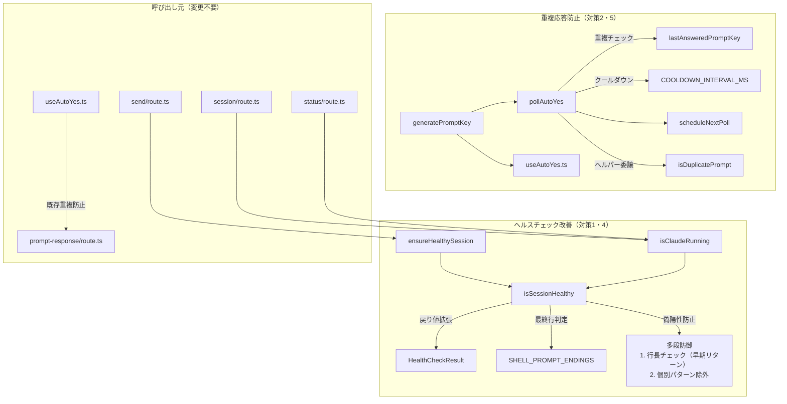

# Issue #306 設計方針書: tmuxセッション安定性改善

## 1. 概要

### 対象Issue
- **Issue #306**: Auto-Yes Pollerの重複応答によりtmuxセッションが定期的に削除される

### 変更目的
tmuxセッションが意図せず削除される3つの根本原因を修正し、セッション安定性を向上させる。

### 変更スコープ

| 対策 | 概要 | 優先度 |
|------|------|--------|
| 対策1 | SHELL_PROMPT_ENDINGS判定ロジック改善（偽陽性防止） | 必須・最優先 |
| 対策2 | サーバー側Auto-Yes Poller重複応答防止 | 必須 |
| 対策4 | ヘルスチェック構造化ログ出力（isSessionHealthy戻り値拡張） | 推奨 |
| 対策5 | 応答送信後クールダウン期間追加 | 推奨 |

> **対策3（コンテキスト残量検出・通知）はスコープ外**: 影響範囲が広く、UI変更を伴うため別Issueとする。

## 2. アーキテクチャ設計

### 変更対象コンポーネント図



### レイヤー構成

変更はすべて**ビジネスロジック層**（`src/lib/`）に閉じる。

| レイヤー | ファイル | 変更内容 |
|---------|---------|---------|
| ビジネスロジック | `src/lib/claude-session.ts` | 対策1・4 |
| ビジネスロジック | `src/lib/auto-yes-manager.ts` | 対策2・5 |
| ビジネスロジック | `src/lib/prompt-key.ts` | promptKey生成共通ユーティリティ（F002対応） |
| テスト | `tests/unit/lib/claude-session.test.ts` | 対策1・4のテスト |
| テスト | `tests/unit/lib/auto-yes-manager.test.ts` | 対策2・5のテスト |

## 3. 設計パターン

### 3.1 HealthCheckResult - 構造化戻り値パターン（対策4）

**現状**: `isSessionHealthy()` は `boolean` を返却。不健全判定理由が失われる。

**変更後**: `HealthCheckResult` interfaceで理由を構造化。

```typescript
// src/lib/claude-session.ts に定義
interface HealthCheckResult {
  healthy: boolean;
  reason?: string;
}
```

**設計判断**:
- `type` ではなく `interface` を使用（拡張性確保）
- `reason` は `string` のみ（`enum` は過剰 - YAGNI原則。F007: 現状維持が妥当）
- **`HealthCheckResult` interfaceも `@internal` exportとする**（F001対応: テストからimportして型安全な `reason` 検証を可能にする。構造的型付けでも動作するが、明示的exportの方がテストの意図が明確）

#### catchブロックのHealthCheckResult変換（S3-F001対応）

`isSessionHealthy()` のcatchブロック（現在の実装: claude-session.ts L293-295 `catch { return false; }`）も
`HealthCheckResult` 形式に変更する必要がある。設計変更により戻り値型が `Promise<boolean>` から
`Promise<HealthCheckResult>` に変わるため、catchブロックも統一的に構造化オブジェクトを返却する。

```typescript
// isSessionHealthy() のcatchブロック - HealthCheckResult形式に変更
export async function isSessionHealthy(sessionName: string): Promise<HealthCheckResult> {
  try {
    // ... 本体ロジック（第0段階〜第2段階）
  } catch {
    // S3-F001: catchブロックもHealthCheckResult形式で返却
    return { healthy: false, reason: 'capture error' };
  }
}
```

> **S3-F001設計根拠**: 現在のcatchブロックは `return false` だが、戻り値型が `HealthCheckResult` に変わるため
> TypeScriptコンパイルエラーとなる。`reason: 'capture error'` を付与することで、capturePane失敗時の
> 診断情報がログに出力され、デバッグ性が向上する。

#### 破壊的変更防止

`isClaudeRunning()` と `ensureHealthySession()` で `.healthy` を取り出し、外部APIは `boolean` を維持。

```typescript
// isClaudeRunning() - 既存のboolean戻り値を維持
export async function isClaudeRunning(worktreeId: string): Promise<boolean> {
  const sessionName = getSessionName(worktreeId);
  const exists = await hasSession(sessionName);
  if (!exists) return false;
  const result = await isSessionHealthy(sessionName);  // S2-F001: awaitが必須（async関数のためPromise<HealthCheckResult>が返る）
  return result.healthy;  // <- .healthy を取り出し
}

// ensureHealthySession() - reason付きログ出力
async function ensureHealthySession(sessionName: string): Promise<boolean> {
  const result = await isSessionHealthy(sessionName);
  if (!result.healthy) {
    console.warn(`[health-check] Session ${sessionName} unhealthy: ${result.reason}`);
    await killSession(sessionName);
    return false;
  }
  return true;
}
```

#### @internal exportパターン

テストから `isSessionHealthy()` の `reason` を検証するため、`@internal` パターンでexport。
**HealthCheckResult interfaceも同様に `@internal` exportする**（F001対応）。

```typescript
/**
 * @internal Exported for testing purposes only.
 * Enables type-safe reason validation in unit tests.
 */
export interface HealthCheckResult {
  healthy: boolean;
  reason?: string;
}

/**
 * @internal Exported for testing purposes only.
 * Follows clearCachedClaudePath() precedent (L148-156).
 */
export async function isSessionHealthy(sessionName: string): Promise<HealthCheckResult> {
```

### 3.2 多段防御パターン（対策1）

`SHELL_PROMPT_ENDINGS` の偽陽性を多段で防止。

> **重要（S2-F002対応）**: 現在の実装では `trimmed.endsWith()` でtrimmed出力全体の末尾をチェックしているが、
> 変更後は空行フィルタリング後の最終行（`lastLine`）に対して `lastLine.endsWith()` を使用する。
> この変更により空行フィルタリングが明示的に行われ、判定がより堅牢になる。
> 実装時に `trimmed.endsWith()` から `lastLine.endsWith()` への切り替え漏れに注意すること。

> **重要（F006対応）**: 行長チェックをSHELL_PROMPT_ENDINGSチェックの**前**に配置する。
> これにより、40文字以上の長い行は `$`/`#`/`%` すべてで確実に除外される。
> 元の設計（個別パターン除外が先、行長チェックが後）では、SHELL_PROMPT_ENDINGSの `some()` が
> 先にtrueを返し、行長チェックに到達しない論理的不備があった。

#### 第0段階: empty output判定 + エラーパターン検出（S2-F010対応）

`isSessionHealthy()` の冒頭で、最終行抽出の前にempty outputとエラーパターンをHealthCheckResult形式で返却する。
これによりテスト設計セクション6.2の `reason: "empty output"` 検証との整合性を確保する。

```typescript
// S2-F010: empty output判定（HealthCheckResult形式）
if (trimmed === '') {
  return { healthy: false, reason: 'empty output' };
}

// S2-F010: エラーパターン検出（HealthCheckResult形式）
// CLAUDE_SESSION_ERROR_PATTERNSによる文字列一致検出
for (const pattern of CLAUDE_SESSION_ERROR_PATTERNS) {
  if (trimmed.includes(pattern)) {
    return { healthy: false, reason: `error pattern: ${pattern}` };
  }
}
// CLAUDE_SESSION_ERROR_REGEX_PATTERNSによる正規表現検出
for (const regex of CLAUDE_SESSION_ERROR_REGEX_PATTERNS) {
  if (regex.test(trimmed)) {
    return { healthy: false, reason: `error pattern: ${regex.source}` };
  }
}
```

#### 第1段階: 最終行抽出 + 行長チェック（早期リターン）

```typescript
// 空行フィルタリング後、最終行を取得
const lines = trimmed.split('\n').filter(line => line.trim() !== '');
const lastLine = lines[lines.length - 1]?.trim() ?? '';

/**
 * シェルプロンプトは通常40文字未満。
 * 典型的なシェルプロンプト（user@host:~/project$）は30文字前後。
 * 40文字は安全マージンを含む経験的な値。
 * Claude CLIの出力行は通常もっと長い。
 */
const MAX_SHELL_PROMPT_LENGTH = 40;
if (lastLine.length >= MAX_SHELL_PROMPT_LENGTH) {
  // 長い行はシェルプロンプトではない -> 健全とみなす（早期リターン）
  return { healthy: true };
}
```

#### 第2段階: SHELL_PROMPT_ENDINGS判定 + 個別パターン除外

```typescript
// 個別パターン除外（%のみ）
// - %: `N%` パターン（コンテキスト残量表示）を除外
// NOTE(F003): 将来新たな偽陽性パターンが見つかった場合、
// 各SHELL_PROMPT_ENDINGSエントリにexclusionPatternを関連付ける構造体への
// リファクタリングを検討する。現時点では%のみでありYAGNI原則を優先。
if (SHELL_PROMPT_ENDINGS.some(ending => {
  if (!lastLine.endsWith(ending)) return false;
  if (ending === '%' && /\d+%$/.test(lastLine)) return false;
  return true;
})) {
  return { healthy: false, reason: `shell prompt ending detected: ${lastLine}` };
}
```

**変更前/変更後の比較（S2-F002対応）**:

| 項目 | 変更前（現在の実装） | 変更後（本設計） |
|------|---------------------|-----------------|
| 対象 | `trimmed` 全体 | 空行フィルタ後の最終行 `lastLine` |
| 判定 | `trimmed.endsWith(ending)` | `lastLine.endsWith(ending)` |
| 空行処理 | 暗黙的（trimmedの末尾に依存） | 明示的（`.filter(line => line.trim() !== '')` でフィルタ） |
| 戻り値 | `boolean` | `HealthCheckResult`（`{ healthy, reason? }`） |

**多段防御の適用順序（F006対応後）**:

```
1. 最終行抽出（空行フィルタリング）
2. 行長チェック: lastLine.length >= 40 -> healthy: true（早期リターン）
3. SHELL_PROMPT_ENDINGS判定 + 個別パターン除外（%のN%除外）
```

この順序により：
- 40文字以上の行は、末尾が `$`/`#`/`%` のいずれであっても、ステップ2で健全判定される
- 40文字未満かつ `N%` パターンの行は、ステップ3の個別除外で健全判定される
- 40文字未満かつ真のシェルプロンプトの行のみ、不健全と判定される

**偽陽性防止戦略テーブル**:

| 文字 | 偽陽性リスク | 防御方式 |
|------|------------|---------|
| `%` | `Context left until auto-compact: N%` | 第1段階: 行長チェック + 第2段階: `/\d+%$/` パターン除外（二重防御） |
| `$` | シェル変数展開、金額表示 | 第1段階: 行長チェック（40文字以上は除外） |
| `#` | Markdownヘッダー、コメント | 第1段階: 行長チェック（40文字以上は除外） |

**設計判断**:
- `$` と `#` に個別パターンは不要。シェルプロンプトは短いため行長チェックで十分
- `%` は `N%` パターンが短い行でも出現しうるため個別除外が必要
- `MAX_SHELL_PROMPT_LENGTH = 40` は経験的な値。典型的なシェルプロンプト（`user@host:~/project$`）は30文字前後
- **行長チェックはSHELL_PROMPT_ENDINGSチェックの前に配置**（F006: 論理的整合性の確保）

### 3.3 重複応答防止パターン（対策2）

`AutoYesPollerState` に `lastAnsweredPromptKey` を追加。

```typescript
export interface AutoYesPollerState {
  timerId: ReturnType<typeof setTimeout> | null;
  cliToolId: CLIToolType;
  consecutiveErrors: number;
  currentInterval: number;
  lastServerResponseTimestamp: number | null;
  /** Last answered prompt key for duplicate prevention (Issue #306) */
  lastAnsweredPromptKey: string | null;  // <- 追加
}
```

#### promptKey生成の共通ユーティリティ化（F002対応）

promptKey生成ロジックがクライアント（`useAutoYes.ts`）とサーバー（`pollAutoYes()`）で重複している。
DRY原則に基づき、共通ユーティリティとして切り出す。

```typescript
// src/lib/prompt-key.ts - 新規作成
/**
 * Generate a unique key for prompt deduplication.
 * Used by both client-side (useAutoYes.ts) and server-side (auto-yes-manager.ts)
 * to ensure consistent prompt identification.
 */
export function generatePromptKey(promptData: { type: string; question: string }): string {
  return `${promptData.type}:${promptData.question}`;
}
```

使用箇所:
- `src/lib/auto-yes-manager.ts` の `pollAutoYes()` 内
- `src/hooks/useAutoYes.ts` の重複防止ロジック内

#### useAutoYes.tsでのgeneratePromptKey使用（S2-F003/S2-F007対応）

`useAutoYes.ts` L77付近の既存promptKey生成コードを `generatePromptKey()` に置換する。

```typescript
// useAutoYes.ts - 変更前（L77付近）
const promptKey = `${data.promptType}:${data.question}`;

// useAutoYes.ts - 変更後
import { generatePromptKey } from '@/lib/prompt-key';
// ...
const promptKey = generatePromptKey({ type: data.promptType, question: data.question });
```

> **S2-F007対応**: セクション9には `useAutoYes.ts` のgeneratePromptKey置換が記載されているが、
> セクション3.3のコード例に明示されていなかった。上記コード例の追加により実装時の見落とし防止を図る。

#### startAutoYesPolling()初期化コード（S2-F003対応）

`startAutoYesPolling()` 内の初期化オブジェクトに `lastAnsweredPromptKey: null` を追加する。

```typescript
// auto-yes-manager.ts startAutoYesPolling() 内（L414-420付近）
const pollerState: AutoYesPollerState = {
  timerId: null,
  cliToolId,
  consecutiveErrors: 0,
  currentInterval: POLLING_INTERVAL_MS,
  lastServerResponseTimestamp: null,
  lastAnsweredPromptKey: null,  // S2-F003: 初期値をnullで明示
};
```

#### promptKeyの生成と比較

```typescript
// pollAutoYes() 内
import { generatePromptKey } from './prompt-key';

const promptKey = generatePromptKey(promptDetection.promptData);

// 重複チェック（isDuplicatePromptヘルパーに委譲 - F005対応）
if (isDuplicatePrompt(pollerState, promptKey)) {
  scheduleNextPoll(worktreeId, cliToolId);
  return;
}

// 応答送信後に記録
pollerState.lastAnsweredPromptKey = promptKey;
// S2-F004: 応答送信成功後はクールダウン間隔で次回ポーリング（セクション3.4参照）
scheduleNextPoll(worktreeId, cliToolId, COOLDOWN_INTERVAL_MS);
return;  // <- 関数末尾のscheduleNextPollに到達させない
```

#### 重複チェックヘルパー関数（F005対応）

`pollAutoYes()` の責務集中を緩和するため、重複チェックロジックをprivateヘルパーに抽出。

```typescript
/**
 * Check if the given prompt has already been answered.
 * Extracted from pollAutoYes() to reduce responsibility concentration (F005/SRP).
 */
function isDuplicatePrompt(
  pollerState: AutoYesPollerState,
  promptKey: string
): boolean {
  return pollerState.lastAnsweredPromptKey === promptKey;
}
```

> **F005設計根拠**: `pollAutoYes()` には (1)thinking検出、(2)プロンプト検出、(3)重複チェック、
> (4)自動応答解決、(5)応答送信、(6)タイムスタンプ更新、(7)クールダウン制御 の7つの責務がある。
> 重複チェックをヘルパー関数に抽出することで、メインフローの可読性を維持する。
> 今後さらに責務が増える場合は、thinking検出や応答送信もヘルパー化を検討する。

#### リセット条件

クライアント側 `useAutoYes.ts:60-62` との対称性を維持。

```typescript
// プロンプト非検出時にリセット
if (!promptDetection.isPrompt || !promptDetection.promptData) {
  pollerState.lastAnsweredPromptKey = null;  // <- リセット
  scheduleNextPoll(worktreeId, cliToolId);
  return;
}
```

> **F009設計決定**: 同一promptKeyが非検出フェーズを経ずに連続検出された場合、
> 意図的にスキップする。これが重複応答防止の本来の目的である。
> Claude CLIがエラーリトライで同一プロンプトを再表示するケースでは、
> 一旦非プロンプト状態（エラー表示）を経由するため、リセットが正常に機能する。
> 詳細はセクション7の設計決定事項を参照。

### 3.4 クールダウンパターン（対策5）

応答送信成功後、通常間隔（2秒）ではなくクールダウン間隔（5秒）で次回ポーリング。

```typescript
/** Cooldown interval after successful response (milliseconds) */
export const COOLDOWN_INTERVAL_MS = 5000;
```

#### scheduleNextPoll呼び出しパターン

```typescript
// パターンA: デフォルト間隔（thinking中、プロンプト非検出、応答不可時）
scheduleNextPoll(worktreeId, cliToolId);  // currentInterval使用

// パターンB: クールダウン（応答送信成功後）- early returnで適用箇所を1箇所に限定
scheduleNextPoll(worktreeId, cliToolId, COOLDOWN_INTERVAL_MS);
return;  // <- 関数末尾のscheduleNextPollに到達させない

// パターンC: catchブロック/共通パス
scheduleNextPoll(worktreeId, cliToolId);  // currentInterval（バックオフ含む）
```

#### pollAutoYes()の変更後の制御フロー（S2-F005対応）

応答送信成功時のearly returnにより、関数末尾の通常scheduleNextPoll()に到達しない設計を明示する。

```
pollAutoYes(worktreeId, cliToolId)
  |
  +--[try]
  |    |
  |    +-- thinking中? --> scheduleNextPoll(通常間隔) --> return  .... 経路(2)
  |    |
  |    +-- プロンプト非検出? --> lastAnsweredPromptKey = null
  |    |                          scheduleNextPoll(通常間隔) --> return  .... 経路(2)
  |    |
  |    +-- 重複promptKey? --> scheduleNextPoll(通常間隔) --> return  .... 経路(2)
  |    |
  |    +-- 応答解決不可? --> scheduleNextPoll(通常間隔) --> return  .... 経路(2)
  |    |
  |    +-- 応答送信成功 --> lastAnsweredPromptKey = promptKey
  |                         scheduleNextPoll(COOLDOWN_INTERVAL_MS) --> return  .... 経路(1)
  |
  +--[catch]
       |
       +-- incrementErrorCount()
       +-- (catchブロック終了 -> 関数末尾のscheduleNextPoll()にfallthrough到達)
       +-- scheduleNextPoll(通常間隔, バックオフ含む)  .... 経路(3)

経路(1): 応答送信成功 -> early return with COOLDOWN_INTERVAL_MS
経路(2): thinking/非検出/重複/応答不可 -> 通常パスのscheduleNextPoll()
経路(3): catchブロック -> incrementErrorCount() -> catchブロック終了後にL368相当のscheduleNextPoll()にfallthrough到達（バックオフ含む）
```

> **S2-F005設計根拠**: 現在のL368のscheduleNextPoll()は、応答成功時にはearly returnで到達しない。
> 上記フロー図により、実装者が3つの経路を明確に把握できる。

> **S3-F004補足**: 経路(3)のcatchブロックには明示的なreturn文がない。catchブロック内の `incrementErrorCount()` 実行後、
> catchブロックが終了し、関数末尾のscheduleNextPoll()（L368相当）にfallthrough到達する。
> これは現在の実装の既存動作であり、設計変更後も維持される。応答送信成功パス（経路(1)）にearly returnを追加しても、
> catchブロックのfallthrough動作には影響しない。

`scheduleNextPoll()` にオプションの `overrideInterval` パラメータを追加（F008: OCP準拠の良い拡張）:

```typescript
/**
 * Schedule next pollAutoYes() execution.
 * @param overrideInterval - Optional interval in milliseconds (S2-F009: 型定義明記).
 *   When provided (e.g., COOLDOWN_INTERVAL_MS), overrides pollerState.currentInterval.
 *   Type: number | undefined (optional parameter).
 */
function scheduleNextPoll(
  worktreeId: string,
  cliToolId: CLIToolType,
  overrideInterval?: number  // S2-F009: number | undefined型。省略時はpollerState.currentIntervalを使用
): void {
  const pollerState = autoYesPollerStates.get(worktreeId);
  if (!pollerState) return;
  // S4-F003: 下限値ガード - ポーリング間隔がPOLLING_INTERVAL_MS未満にならないことを保証
  const interval = Math.max(overrideInterval ?? pollerState.currentInterval, POLLING_INTERVAL_MS);
  pollerState.timerId = setTimeout(() => {
    pollAutoYes(worktreeId, cliToolId);
  }, interval);
}
```

## 4. セキュリティ設計

### 変更による新規セキュリティリスク: なし

| 観点 | 評価 |
|------|------|
| 入力バリデーション | 変更なし（既存のworktreeIdバリデーション継続） |
| コマンドインジェクション | 変更なし（tmux操作の既存パターン継続） |
| DoS防止 | 改善（重複応答防止でtmuxセッション負荷軽減。`scheduleNextPoll()` に下限値ガード追加 - S4-F003対応） |
| 情報漏洩 | 改善（ログに判定理由追加だがsensitive情報は含まない。reason内のlastLineはtmuxペイン出力由来だが、`MAX_SHELL_PROMPT_LENGTH=40` により長さが制限されており、sensitive情報の漏洩リスクは限定的。lastLineにCR/LF文字が含まれる可能性は理論上あるが、`.trim()` 処理により除去されるため、ログインジェクション（改行文字によるログ偽装）のリスクは排除される - S4-F002対応） |

### generatePromptKey()の用途制限（S4-F001対応）

`generatePromptKey()` の戻り値は **インメモリの文字列比較にのみ使用する**。
生成されたキーは `AutoYesPollerState.lastAnsweredPromptKey` フィールド（インメモリMapの値のプロパティ）に保存され、
`isDuplicatePrompt()` 内での文字列一致比較にのみ使用される。

> **用途制限**: `generatePromptKey()` の戻り値を以下の用途に使用する場合は、適切なサニタイズを適用すること:
> - **ログ出力**: ログインジェクション防止のため、CR/LF文字のエスケープまたは除去を適用する
> - **DB保存**: SQLインジェクション防止のため、プリペアドステートメントを使用する
> - **HTML表示**: XSS防止のため、HTMLエスケープを適用する
>
> 現在の設計では上記の用途は存在しないが、将来的な拡張時の安全性を担保するために明記する。

### scheduleNextPoll()の下限値ガード（S4-F003対応）

`scheduleNextPoll()` の `overrideInterval` パラメータに不正な値（0、負の値）が渡された場合、
`setTimeout` がほぼ即時実行となり、事実上のビジーループによるDoSリスクが生じる。
これを防止するため、`scheduleNextPoll()` 内でポーリング間隔の下限値ガードを適用する。

```typescript
// S4-F003: overrideIntervalの下限値ガード
const interval = Math.max(overrideInterval ?? pollerState.currentInterval, POLLING_INTERVAL_MS);
```

> **設計根拠**: 現在のコードパスでは `COOLDOWN_INTERVAL_MS` (5000ms) のみが `overrideInterval` に渡されるため、
> 実質的なリスクは低い。しかし、防御的プログラミングの原則に基づき、将来的な変更時の安全性を担保する。
> `POLLING_INTERVAL_MS` (2000ms) を下限とすることで、ポーリング間隔が通常間隔未満にならないことを保証する。

## 5. パフォーマンス設計

### 対策1: isSessionHealthy()のオーバーヘッド

| 項目 | 現状 | 変更後 | 差分 |
|------|------|--------|------|
| `trimmed.endsWith()` | 1回（全体末尾） | 最終行抽出+filter | +微小（文字列split） |
| 行長チェック | なし | 1回（文字列長比較、早期リターン） | +微小 |

影響: **無視可能**（`capturePane` のtmux IPC呼び出し（~50ms）に比べて桁違いに小さい）

> **F006対応による改善**: 行長チェックが先に実行されるため、40文字以上の行では
> SHELL_PROMPT_ENDINGSの `some()` ループが実行されず、わずかにパフォーマンスが向上する。

### 対策5: クールダウンによるレイテンシ影響

| 項目 | 現状 | 変更後 |
|------|------|--------|
| 応答後の次回ポーリング間隔 | 2秒 | 5秒 |
| 最悪ケースの応答遅延 | なし | +3秒（次の異なるプロンプトの検出が遅れる） |

**トレードオフ**: 応答レイテンシ +3秒 vs セッション安定性の大幅改善。
連続プロンプト（例: Y/N -> 次のY/N）の間隔はClaude CLI処理時間（通常5秒以上）があるため実影響は限定的。

## 6. テスト設計

### 6.1 対策1テスト（claude-session.test.ts）

```typescript
// 偽陽性防止テスト
describe('isSessionHealthy - false positive prevention', () => {
  it('should treat "Context left until auto-compact: 7%" as healthy', async () => {
    // N% パターンがシェルプロンプトと誤判定されないこと
  });

  it('should treat "Context left until auto-compact: 100%" as healthy', async () => {
    // 100%も同様
  });

  it('should still detect real zsh prompt ending with %', async () => {
    // 短いシェルプロンプト（user@host%）は不健全と判定
  });

  it('should treat long lines ending with $ as healthy', async () => {
    // 40文字以上の行は行長チェックで除外
  });

  it('should treat long lines ending with # as healthy', async () => {
    // 同上
  });

  it('should filter trailing empty lines before checking last line', async () => {
    // 末尾空行がフィルタされること
  });

  // F004対応: MAX_SHELL_PROMPT_LENGTH境界値テスト
  it('should treat 39-char line ending with $ as unhealthy (below threshold)', async () => {
    // 39文字（閾値未満）: シェルプロンプト判定 -> 不健全
  });

  it('should treat 40-char line ending with $ as healthy (at threshold)', async () => {
    // 40文字（閾値丁度）: 行長チェックで除外 -> 健全
  });

  it('should treat 41-char line ending with $ as healthy (above threshold)', async () => {
    // 41文字（閾値超過）: 行長チェックで除外 -> 健全
  });

  // F006対応: 行長チェックがSHELL_PROMPT_ENDINGS判定の前に実行されることの検証
  it('should apply line length check before SHELL_PROMPT_ENDINGS check', async () => {
    // 50文字の行が末尾$でも健全判定されること（行長チェック早期リターン）
  });
});
```

### 6.2 対策4テスト（claude-session.test.ts）

```typescript
// HealthCheckResult reason検証テスト
// NOTE: HealthCheckResult interfaceをimportして型安全に検証する（F001対応）
import { isSessionHealthy, type HealthCheckResult } from '@/lib/claude-session';

describe('isSessionHealthy - reason reporting', () => {
  it('should include reason for error pattern detection', async () => {
    // reason: "error pattern: ..."
  });

  it('should include reason for shell prompt ending', async () => {
    // reason: "shell prompt ending detected: ..."
  });

  it('should include reason for empty output', async () => {
    // reason: "empty output"
  });

  // S3-F001対応: capturePane例外時のreason検証テスト
  it('should include reason "capture error" when capturePane throws', async () => {
    // capturePane()が例外をスローした場合、catchブロックで
    // { healthy: false, reason: 'capture error' } を返却することを検証
  });

  it('should not include reason for healthy sessions', async () => {
    // reason: undefined
  });
});
```

### 6.3 対策2テスト（auto-yes-manager.test.ts）

```typescript
describe('pollAutoYes - duplicate prevention', () => {
  it('should not send duplicate response for same prompt', () => {
    // 同一promptKeyで2回目は送信しない
  });

  it('should reset lastAnsweredPromptKey when no prompt detected', () => {
    // プロンプト非検出時にnullリセット
  });

  it('should send response for different prompt after reset', () => {
    // リセット後の新しいプロンプトには応答する
  });

  // F009対応: エッジケーステスト
  it('should skip response when same promptKey detected consecutively without reset', () => {
    // 非検出フェーズを経ずに同一promptKeyが連続 -> 意図的にスキップ
  });
});
```

### 6.4 対策5テスト（auto-yes-manager.test.ts）

```typescript
describe('pollAutoYes - cooldown', () => {
  it('should use cooldown interval after successful response', () => {
    // 応答成功後はCOOLDOWN_INTERVAL_MS(5秒)で次回ポーリング
  });

  it('should use default interval when no response sent', () => {
    // プロンプト非検出時はPOLLING_INTERVAL_MSで次回ポーリング
  });

  // S4-F003対応: overrideInterval下限値ガードテスト
  it('should enforce minimum interval of POLLING_INTERVAL_MS when overrideInterval is 0', () => {
    // overrideInterval=0が渡された場合、POLLING_INTERVAL_MSが使用されること
  });

  it('should enforce minimum interval of POLLING_INTERVAL_MS when overrideInterval is negative', () => {
    // overrideInterval=-1が渡された場合、POLLING_INTERVAL_MSが使用されること
  });
});
```

### 6.5 promptKey共通ユーティリティテスト（F002対応）

```typescript
// tests/unit/lib/prompt-key.test.ts - 新規作成
import { generatePromptKey } from '@/lib/prompt-key';

describe('generatePromptKey', () => {
  it('should generate key from type and question', () => {
    const key = generatePromptKey({ type: 'yes_no', question: 'Continue?' });
    expect(key).toBe('yes_no:Continue?');
  });

  it('should generate different keys for different prompts', () => {
    const key1 = generatePromptKey({ type: 'yes_no', question: 'Continue?' });
    const key2 = generatePromptKey({ type: 'multiple_choice', question: 'Select option' });
    expect(key1).not.toBe(key2);
  });
});
```

### 6.6 既存テストへの影響

| テストファイル | 影響 | 対応 |
|-------------|------|------|
| `tests/unit/lib/claude-session.test.ts` | `isSessionHealthy()` と `HealthCheckResult` の export追加でimport変更 | import追加（F001対応）、既存14テストは `isClaudeRunning()` 経由のため変更不要 |
| `tests/unit/lib/auto-yes-manager.test.ts` | 既存10箇所の `vi.advanceTimersByTimeAsync(POLLING_INTERVAL_MS + 100)` は初回ポーリングのみをトリガーするため影響なし（L498, L534, L596, L636, L732, L773, L811, L851, L894, L937）。`COOLDOWN_INTERVAL_MS` は応答送信成功後の2回目以降のポーリング間隔を変更するため、初回ポーリングのみを検証する既存テストは修正不要。`scheduleNextPoll()` のシグネチャ変更（`overrideInterval` パラメータ追加）はオプションパラメータのため、既存呼び出しはそのまま動作する | 新規テスト（セクション6.4）のみで `COOLDOWN_INTERVAL_MS` 定数を使用（S3-F003対応） |
| `tests/unit/hooks/useAutoYes.test.ts` | `prompt-key.ts` 新規ファイルへのimport追加。ファイル未作成時はimportエラーが発生する | 実装順序ステップ4（セクション8）で `prompt-key.ts` 作成後に `useAutoYes.ts` 修正の依存関係を厳守。テストアサーション自体は変更不要（重複防止テスト L139-173 は同一promptDataのrerenderでfetchが1回のみ呼ばれることを検証しており、内部実装の変更に依存しない）（S3-F005対応） |
| `tests/integration/auto-yes-persistence.test.ts` | `AutoYesPollerState` への `lastAnsweredPromptKey` フィールド追加による影響なし。内部フィールドを直接参照しておらず、`getActivePollerCount()` 経由の間接検証のみ | 確認のみ。修正不要（S3-F006対応） |

## 7. 設計上の決定事項とトレードオフ

| 決定事項 | 理由 | トレードオフ | レビューID |
|---------|------|-------------|-----------|
| `HealthCheckResult` を `@internal` exportとする | テストからの型安全な `reason` 検証を可能にする | export対象が増えるが `@internal` でスコープ制限 | F001 |
| 行長チェックをSHELL_PROMPT_ENDINGSチェックの前に配置 | `some()` ループがtrueを返すと行長チェックに到達しない論理的不備を解消 | なし（純粋な改善） | F006 |
| promptKey生成を共通ユーティリティ化 | クライアント・サーバー間のDRY原則遵守 | 新規ファイル追加 | F002 |
| `isDuplicatePrompt()` ヘルパー抽出 | pollAutoYes()の責務集中緩和（SRP） | 関数呼び出しオーバーヘッド（無視可能） | F005 |
| `MAX_SHELL_PROMPT_LENGTH = 40` | 典型的シェルプロンプトは30文字前後 | 非常に短いClaude出力が偽陰性になるリスク（極めて低い） | - |
| `COOLDOWN_INTERVAL_MS = 5000` | Claude CLI処理時間（5秒以上）を考慮 | 連続プロンプト時に+3秒遅延 | - |
| `$`/`#` に個別パターン不要 | 行長チェックで十分防御可能 | 40文字未満でこれらの文字で終わるClaude出力は偽陽性（非常にまれ） | - |
| 対策3（コンテキスト残量通知）スコープ外 | UI変更を伴い、影響範囲が大きい | 本Issueではコンテキスト枯渇時の根本解決なし | F010 |
| `reason` を `string` のみ（enum不使用） | ログ出力が主な用途でenum分岐不要（YAGNI原則） | 将来enum化が必要になる可能性 | F007 |
| 同一promptKeyの連続検出は意図的にスキップ | 重複応答防止の本来の目的 | エラーリトライ時の同一プロンプトもスキップされうる | F009 |

### 同一promptKey連続検出時の動作（F009明示的記述）

同一 `promptKey` が非検出フェーズを経ずに連続で検出された場合、2回目の応答は**意図的にスキップ**する。
これが重複応答防止機能の本来の目的である。

Claude CLIがエラーリトライで同一プロンプトを再表示するケースでは、以下の理由でリセットが正常に機能する：
1. エラーリトライ時は一旦エラーメッセージが表示される（非プロンプト状態）
2. 非プロンプト検出により `lastAnsweredPromptKey` がnullリセットされる
3. リトライ後のプロンプト再表示は新規プロンプトとして正常に応答される

### SHELL_PROMPT_ENDINGS拡張方針（F003参照）

現在は `%` のみに個別除外パターン（`/\d+%$/`）を適用している。
将来新たな偽陽性パターンが見つかった場合は、以下のリファクタリングを検討する：

```typescript
// 将来的な拡張案（現時点では実装しない - YAGNI原則）
const SHELL_PROMPT_PATTERNS = [
  { ending: '$', exclusion: null },
  { ending: '#', exclusion: null },
  { ending: '%', exclusion: /\d+%$/ },
  // 新しいパターンをここに追加
];
```

### 代替案との比較

#### isSessionHealthy()の偽陽性防止

| 案 | メリット | デメリット | 採用 |
|----|---------|-----------|------|
| A: 行長チェック（先行） + 個別パターン除外 | 高い防御力、低コスト、論理的整合性 | パターン保守 | (採用)（F006対応後） |
| B: Claude CLI出力の肯定的パターン検出 | 誤検出なし | Claude CLIバージョン依存、パターン変更リスク | (不採用) |
| C: tmuxペインのプロセス存在確認 | 最も正確 | 実装複雑、クロスプラットフォーム問題 | (不採用) |

#### 重複応答防止

| 案 | メリット | デメリット | 採用 |
|----|---------|-----------|------|
| A: promptKeyベースの重複チェック（共通ユーティリティ） | シンプル、確実、DRY | 同一質問の再表示を見逃す可能性 | (採用)（F002対応でユーティリティ化） |
| B: タイムスタンプベースのウィンドウ | 時間ベースで柔軟 | 適切なウィンドウ値の選定が難しい | (不採用)（クールダウンとして併用） |
| C: tmux出力のdiffベース | 変化を正確に検出 | 実装複雑、パフォーマンス影響 | (不採用) |

## 8. 実装順序

以下の順序で実装する（依存関係順）:

1. **対策4**: `HealthCheckResult` interface定義（`@internal` export含む - F001） + `isSessionHealthy()` 戻り値拡張 + ログ出力
2. **対策1**: `SHELL_PROMPT_ENDINGS` 多段防御（**行長チェックを先に配置 - F006**、対策4の `HealthCheckResult` に依存）
3. **対策4続き**: `isClaudeRunning()` + `ensureHealthySession()` の修正（S2-F009: `isClaudeRunning()`で`await` + `.healthy`取り出し、`ensureHealthySession()`で`await` + `.healthy`/`.reason`使用）
4. **promptKey共通化（F002）**: `src/lib/prompt-key.ts` 作成、`useAutoYes.ts` と `auto-yes-manager.ts` から使用
5. **対策2**: `lastAnsweredPromptKey` 追加 + 重複チェック（`isDuplicatePrompt()` ヘルパー抽出 - F005）
6. **対策5**: `COOLDOWN_INTERVAL_MS` + `scheduleNextPoll()` 拡張

## 9. 変更対象ファイル一覧

| ファイル | 変更内容 | 対策 | レビューID |
|---------|---------|------|-----------|
| `src/lib/claude-session.ts` | HealthCheckResult定義（`@internal` export）、isSessionHealthy()拡張、多段防御（行長チェック先行）、isClaudeRunning()修正、ensureHealthySession()ログ追加 | 1, 4 | F006, F001 |
| `src/lib/prompt-key.ts` | **新規作成**: promptKey生成共通ユーティリティ | 2 | F002 |
| `src/lib/auto-yes-manager.ts` | AutoYesPollerState拡張、pollAutoYes()重複防止（isDuplicatePromptヘルパー）・リセット、COOLDOWN_INTERVAL_MS、scheduleNextPoll()拡張、startAutoYesPolling()初期化修正、generatePromptKey import | 2, 5 | F005, F002 |
| `src/hooks/useAutoYes.ts` | promptKey生成をgeneratePromptKey()に置換 | 2 | F002 |
| `tests/unit/lib/claude-session.test.ts` | 偽陽性防止テスト（境界値テスト含む）、reason検証テスト、isSessionHealthy()/HealthCheckResult import追加 | 1, 4 | F006, F001, F004 |
| `tests/unit/lib/auto-yes-manager.test.ts` | 重複防止テスト（F009エッジケース含む）、クールダウンテスト、タイマー値修正 | 2, 5 | F009 |
| `tests/unit/lib/prompt-key.test.ts` | **新規作成**: promptKey生成テスト | 2 | F002 |

### 関連コンポーネント（変更不要だが影響確認が必要）

| ファイル | 確認内容 |
|---------|---------|
| `src/lib/cli-tools/claude.ts` | ClaudeTool.isRunning()がisClaudeRunning()に直接delegate。戻り値型 `Promise<boolean>` は維持されるため変更不要。API route（8ファイル: worktrees/route.ts, [id]/route.ts, [id]/send/route.ts, [id]/current-output/route.ts, [id]/kill-session/route.ts, [id]/prompt-response/route.ts, [id]/interrupt/route.ts, repositories/route.ts）からの呼び出しチェーンの中間層として存在（S3-F002対応） |
| `src/lib/prompt-answer-sender.ts` | pollAutoYes()から呼び出し。インターフェース変更なし |
| `src/lib/cli-session.ts` | captureSessionOutput()。変更なし |
| `src/lib/session-cleanup.ts` | stopAutoYesPolling()呼び出し。インターフェース変更なし |
| `src/lib/cli-patterns.ts` | 対策3スコープ外のためコンテキスト残量パターン追加は今回なし |

## 10. レビュー履歴

| 日付 | ステージ | フォーカス | スコア | ステータス |
|------|---------|----------|--------|-----------|
| 2026-02-18 | Stage 1 | 設計原則 | 4/5 | 条件付き承認 |
| 2026-02-18 | Stage 2 | 整合性 | 4/5 | 条件付き承認 |
| 2026-02-18 | Stage 3 | 影響分析 | 4/5 | 条件付き承認 |
| 2026-02-18 | Stage 4 | セキュリティ | 4/5 | 条件付き承認 |

## 11. レビュー指摘事項サマリー（Stage 1: 設計原則）

| ID | 重要度 | 原則 | タイトル | 対応状況 | 対応セクション |
|----|--------|------|---------|---------|---------------|
| F006 | Must Fix | DIP | 多段防御の適用順序の設計不備 | 反映済み | 3.2, 5, 6.1, 8 |
| F001 | Should Fix | SRP | HealthCheckResult interfaceの@internal export | 反映済み | 3.1, 6.2, 9 |
| F002 | Should Fix | DRY | promptKey生成ロジックの重複 | 反映済み | 2, 3.3, 6.5, 8, 9 |
| F005 | Should Fix | SRP | pollAutoYes()の責務集中 | 反映済み | 3.3, 9 |
| F009 | Should Fix | other | lastAnsweredPromptKeyリセット条件のエッジケース | 反映済み | 3.3, 6.3, 7 |
| F003 | Nice to Have | OCP | SHELL_PROMPT_ENDINGS拡張方針コメント | 反映済み | 3.2, 7 |
| F004 | Nice to Have | KISS | MAX_SHELL_PROMPT_LENGTH境界値テスト追加 | 反映済み | 6.1 |
| F007 | Nice to Have | YAGNI | reason string型の妥当性確認 | 反映済み（現状維持） | 3.1, 7 |
| F008 | Nice to Have | DRY | scheduleNextPoll overrideInterval設計確認 | 反映済み（現状維持） | 3.4 |
| F010 | Nice to Have | KISS | 対策3スコープ外判断の妥当性確認 | 反映済み（現状維持） | 7 |

## 11b. レビュー指摘事項サマリー（Stage 2: 整合性レビュー）

| ID | 重要度 | カテゴリ | タイトル | 対応状況 | 対応セクション |
|----|--------|---------|---------|---------|---------------|
| S2-F001 | Must Fix | 設計-実装整合性 | isClaudeRunning()コード例のawait欠落 | 反映済み | 3.1 |
| S2-F010 | Must Fix | 設計-実装整合性 | empty output/error patternのHealthCheckResult形式コード例の欠如 | 反映済み | 3.2 |
| S2-F002 | Should Fix | 設計-実装整合性 | trimmed.endsWith()からlastLine.endsWith()への変更の明示 | 反映済み | 3.2 |
| S2-F003 | Should Fix | 設計-実装整合性 | startAutoYesPolling()初期化コードのlastAnsweredPromptKey不足 | 反映済み | 3.3 |
| S2-F004 | Should Fix | 設計内部整合性 | セクション3.3-3.4間のクールダウン相互参照不足 | 反映済み | 3.3 |
| S2-F005 | Should Fix | 設計-実装整合性 | pollAutoYes()の制御フロー図の欠如 | 反映済み | 3.4 |
| S2-F006 | Nice to Have | パターン整合性 | @internalパターンの命名規則整合性 | 確認済み（問題なし） | 3.1 |
| S2-F007 | Nice to Have | 設計-実装整合性 | useAutoYes.tsのgeneratePromptKey置換コード例の欠如 | 反映済み | 3.3 |
| S2-F008 | Nice to Have | 設計内部整合性 | テスト設計のimport文とexport設計の整合性 | 確認済み（問題なし） | 6.2 |
| S2-F009 | Nice to Have | 設計内部整合性 | 実装順序ステップ3の具体性不足 | 反映済み | 8, 3.4 |

## 11c. レビュー指摘事項サマリー（Stage 3: 影響分析レビュー）

| ID | 重要度 | カテゴリ | タイトル | 対応状況 | 対応セクション |
|----|--------|---------|---------|---------|---------------|
| S3-F001 | Must Fix | テスト影響 | isSessionHealthy()のcatchブロック戻り値がHealthCheckResult形式に変更必要 | 反映済み | 3.1, 6.2, 12 |
| S3-F002 | Should Fix | API影響 | ClaudeTool.isRunning()が関連コンポーネント表に未記載 | 反映済み | 9 |
| S3-F003 | Should Fix | テスト影響 | COOLDOWN_INTERVAL_MS導入が既存テストに影響しない根拠が不明確 | 反映済み | 6.6 |
| S3-F004 | Should Fix | 破壊的変更 | pollAutoYes()のearly return追加でcatchブロック後のfallthrough動作補足必要 | 反映済み | 3.4 |
| S3-F005 | Should Fix | テスト影響 | useAutoYes.test.tsがテスト影響テーブルに未記載 | 反映済み | 6.6 |
| S3-F006 | Should Fix | テスト影響 | auto-yes-persistence.test.tsがテスト影響テーブルに未記載 | 反映済み | 6.6 |
| S3-F007 | Nice to Have | 依存関係 | prompt-key.ts新規追加がクライアントバンドルに与える影響は最小限 | 確認済み（問題なし） | - |
| S3-F008 | Nice to Have | 依存関係 | AutoYesPollerState変更がglobalThis型宣言と既存テストに影響しないことの確認 | 確認済み（問題なし） | - |
| S3-F009 | Nice to Have | API影響 | ensureHealthySession()のconsole.warn追加とsession-cleanup.tsへの影響なし | 確認済み（問題なし） | - |
| S3-F010 | Nice to Have | API影響 | COOLDOWN_INTERVAL_MS=5000による応答レイテンシ増加の実際の影響は限定的 | 確認済み（問題なし） | 5 |

## 11d. レビュー指摘事項サマリー（Stage 4: セキュリティレビュー）

| ID | 重要度 | カテゴリ | タイトル | 対応状況 | 対応セクション |
|----|--------|---------|---------|---------|---------------|
| S4-F001 | Should Fix | OWASP-A03 | generatePromptKey()の入力にサニタイズが未適用（用途制限明記） | 反映済み | 4 |
| S4-F002 | Should Fix | ログ安全性 | ensureHealthySession()のログにセッション名が含まれる安全性確認 | 反映済み | 4 |
| S4-F003 | Should Fix | DoS | COOLDOWN_INTERVAL_MSの下限値バリデーション未設計 | 反映済み | 3.4, 4, 12 |
| S4-F004 | Nice to Have | OWASP-A04 | lastAnsweredPromptKeyリセット条件の競合状態への耐性 | 確認済み（既存設計で安全） | - |
| S4-F005 | Nice to Have | OWASP-A04 | SHELL_PROMPT_ENDINGS偽陽性の攻撃利用リスクは極めて低い | 確認済み（対応不要） | - |
| S4-F006 | Nice to Have | OWASP-A09 | エラーパターン検出のreason出力にregex.sourceが含まれる | 確認済み（現在の設計で安全） | - |
| S4-F007 | Nice to Have | DoS | 重複応答防止メカニズムのバイパスリスク評価 | 確認済み（設計上十分に堅牢） | - |
| S4-F008 | Nice to Have | OWASP-A03 | tmux sendKeys経由の入力サニタイズは既存の防御に依拠 | 確認済み（変更なし・安全） | - |

## 12. 実装チェックリスト

### Must Fix

- [ ] **F006**: `isSessionHealthy()` の行長チェックを `SHELL_PROMPT_ENDINGS` チェックの前に移動
  - [ ] 最終行抽出後、`lastLine.length >= MAX_SHELL_PROMPT_LENGTH` で早期リターン（`healthy: true`）
  - [ ] その後に `SHELL_PROMPT_ENDINGS.some()` ループと `%` 個別除外を配置
  - [ ] テスト: 50文字の `$` 終端行が健全判定されることを検証
  - [ ] テスト: 行長チェックがsome()ループの前に実行されることを検証

- [ ] **S2-F001**: `isClaudeRunning()` コード例の `await` 追加
  - [ ] `const result = await isSessionHealthy(sessionName);` に修正（セクション3.1）

- [ ] **S2-F010**: empty output/error pattern の `HealthCheckResult` 形式コード例追加
  - [ ] `if (trimmed === '') { return { healthy: false, reason: 'empty output' }; }` を実装
  - [ ] エラーパターン検出で `{ healthy: false, reason: 'error pattern: ...' }` を返却
  - [ ] テスト: `reason: "empty output"` の検証（セクション6.2）

- [ ] **S3-F001**: `isSessionHealthy()` のcatchブロックを `HealthCheckResult` 形式に変更
  - [ ] `catch { return false; }` を `catch { return { healthy: false, reason: 'capture error' }; }` に変更
  - [ ] テスト: capturePane例外時に `reason: "capture error"` が返却されることを検証（セクション6.2）

### Should Fix

- [ ] **F001**: `HealthCheckResult` interfaceに `@internal` JSDocを付与して `export` する
  - [ ] テストファイルから `import { type HealthCheckResult }` で型安全に検証
  - [ ] `isSessionHealthy()` の `@internal` export と合わせて一貫性を確保

- [ ] **F002**: `src/lib/prompt-key.ts` を新規作成し、`generatePromptKey()` を定義
  - [ ] `src/lib/auto-yes-manager.ts` の `pollAutoYes()` 内で使用
  - [ ] `src/hooks/useAutoYes.ts` の重複防止ロジック内で使用
  - [ ] `tests/unit/lib/prompt-key.test.ts` を新規作成

- [ ] **F005**: `isDuplicatePrompt()` privateヘルパー関数を `auto-yes-manager.ts` 内に作成
  - [ ] `pollAutoYes()` から重複チェックロジックを委譲
  - [ ] メインフローの可読性が維持されていることを確認

- [ ] **F009**: セクション7に同一promptKey連続検出時の動作を明示的に記載（本設計書で対応済み）
  - [ ] テスト: 非検出フェーズなしの連続同一promptKeyでスキップされることを検証

- [ ] **S2-F002**: `isSessionHealthy()` の判定を `trimmed.endsWith()` から `lastLine.endsWith()` に変更
  - [ ] 空行フィルタリング後の最終行に対して判定を適用
  - [ ] 戻り値型アノテーション `Promise<HealthCheckResult>` を明記

- [ ] **S2-F003**: `startAutoYesPolling()` 初期化オブジェクトに `lastAnsweredPromptKey: null` を追加
  - [ ] auto-yes-manager.ts L414-420付近の初期化コード修正

- [ ] **S2-F004**: セクション3.3の応答送信後コード例にクールダウンパターンへの相互参照を追加（本設計書で対応済み）

- [ ] **S2-F005**: pollAutoYes()の3経路（応答成功/通常パス/catchブロック）の制御フローを実装
  - [ ] 応答送信成功後のearly return + COOLDOWN_INTERVAL_MS指定

- [ ] **S2-F007**: `useAutoYes.ts` L77付近の `promptKey` 生成を `generatePromptKey()` に置換
  - [ ] `import { generatePromptKey } from '@/lib/prompt-key';` を追加

- [ ] **S3-F002**: `src/lib/cli-tools/claude.ts` を関連コンポーネント表に記載（本設計書で対応済み）
  - [ ] 実装時に `ClaudeTool.isRunning()` -> `isClaudeRunning()` の直接delegateを確認し、戻り値型 `Promise<boolean>` が維持されていることを検証

- [ ] **S3-F003**: `auto-yes-manager.test.ts` の既存テスト影響なしの根拠を確認（本設計書で対応済み）
  - [ ] 既存10箇所の `vi.advanceTimersByTimeAsync(POLLING_INTERVAL_MS + 100)` が初回ポーリングのみをトリガーすることを確認
  - [ ] `scheduleNextPoll()` の `overrideInterval` オプションパラメータ追加が既存呼び出しに影響しないことを確認

- [ ] **S3-F004**: `pollAutoYes()` のcatchブロック後のfallthrough動作を実装時に確認
  - [ ] catchブロック内に明示的returnがなく、`incrementErrorCount()` 後に関数末尾の `scheduleNextPoll()` にfallthrough到達することを検証
  - [ ] 応答送信成功パスのearly return追加がcatchブロックのfallthrough動作に影響しないことを確認

- [ ] **S3-F005**: `useAutoYes.test.ts` への影響確認（本設計書で対応済み）
  - [ ] 実装順序ステップ4（`prompt-key.ts` 作成 -> `useAutoYes.ts` 修正）の依存関係を厳守
  - [ ] テストアサーション自体は変更不要であることを確認

- [ ] **S3-F006**: `auto-yes-persistence.test.ts` への影響確認（本設計書で対応済み）
  - [ ] `AutoYesPollerState` への `lastAnsweredPromptKey` フィールド追加後、`getActivePollerCount()` 経由の間接検証が正常に動作することを確認

- [ ] **S4-F001**: `generatePromptKey()` の用途制限をセクション4に明記（本設計書で対応済み）
  - [ ] `prompt-key.ts` のJSDocに「戻り値はインメモリ文字列比較専用。ログ/DB/HTML出力時はサニタイズ必須」と注記
  - [ ] コードレビュー時に `generatePromptKey()` の戻り値がログ出力・DB保存・HTML表示に使用されていないことを確認

- [ ] **S4-F002**: `ensureHealthySession()` のログ出力の安全性をセクション4に補足（本設計書で対応済み）
  - [ ] `reason` 内の `lastLine` が `.trim()` 処理済みであり、CR/LF文字によるログインジェクションが排除されていることを実装時に確認
  - [ ] `MAX_SHELL_PROMPT_LENGTH=40` による長さ制限が適用されていることを確認

- [ ] **S4-F003**: `scheduleNextPoll()` 内に `overrideInterval` の下限値ガードを追加
  - [ ] `const interval = Math.max(overrideInterval ?? pollerState.currentInterval, POLLING_INTERVAL_MS);` を実装
  - [ ] ポーリング間隔が `POLLING_INTERVAL_MS` (2000ms) 未満にならないことを保証
  - [ ] テスト: `overrideInterval` に0や負の値を渡した場合に `POLLING_INTERVAL_MS` が使用されることを検証

### Nice to Have

- [ ] **F004**: `MAX_SHELL_PROMPT_LENGTH` のJSDocに「典型的なシェルプロンプトは30文字前後、40文字は安全マージン」を記載
  - [ ] 境界値テスト（39文字/40文字/41文字）を追加

- [ ] **F003**: `SHELL_PROMPT_ENDINGS` の個別除外パターン付近に将来の拡張方針コメントを記載

---

*Generated by design-policy command for Issue #306*
*Updated by apply-review agent (Stage 1: 設計原則レビュー反映) on 2026-02-18*
*Updated by apply-review agent (Stage 2: 整合性レビュー反映) on 2026-02-18*
*Updated by apply-review agent (Stage 3: 影響分析レビュー反映) on 2026-02-18*
*Updated by apply-review agent (Stage 4: セキュリティレビュー反映) on 2026-02-18*
