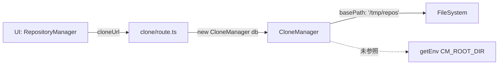
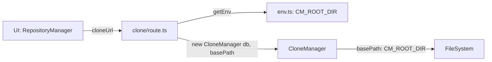

# Issue #308 設計方針書: git clone basePath修正

## 1. 概要

### 目的
CommandMate UIからgit cloneを実行した際に、`.env`で設定した`CM_ROOT_DIR`のディレクトリ配下にリポジトリが作成されるよう修正する。現在は`/tmp/repos`にハードコードされたデフォルト値が使用されている。

### スコープ
- **In scope**: 新規cloneの保存先をCM_ROOT_DIRに統一、WORKTREE_BASE_PATHの非推奨化
- **Out of scope**: 既存clone済みリポジトリのデータマイグレーション、UI通知

## 1.1 レビュー履歴

| 日付 | ステージ | レビュー観点 | 結果 | スコア |
|------|---------|-------------|------|--------|
| 2026-02-19 | Stage 1 | 設計原則（SOLID/DRY/KISS/YAGNI） | 条件付き承認 | 4/5 |
| 2026-02-19 | Stage 2 | 整合性（コード・テスト・ドキュメント整合性） | 条件付き承認 | 4/5 |
| 2026-02-19 | Stage 3 | 影響分析（影響範囲・後方互換性・性能） | 条件付き承認 | 4/5 |
| 2026-02-19 | Stage 4 | セキュリティ（OWASP Top 10・情報漏洩・インジェクション） | 条件付き承認 | 4/5 |

### レビュー指摘事項サマリー（Stage 1）

| ID | 重要度 | 原則 | 指摘概要 | 対応状況 |
|----|--------|------|---------|---------|
| D1-007 | **Must Fix** | DIP | WORKTREE_BASE_PATHのパス正規化が欠けている | 反映済み（Section 4.2.2, 5.2） |
| D1-003 | Should Fix | DRY | `resetWorktreeBasePathWarning()`に`@internal` JSDocタグ追加 | 反映済み（Section 4.2.2） |
| D1-004 | Should Fix | KISS | `[jobId]/route.ts`の修正を任意から必須に格上げ | 反映済み（Section 4.2.3, 7, 9） |
| D1-001 | Nice to Have | SRP | resolveDefaultBasePath()の責務分離は将来課題 | スキップ（将来タスク） |
| D1-002 | Nice to Have | DIP | ファクトリ関数の導入は将来検討 | スキップ（将来タスク） |
| D1-005 | Nice to Have | OCP | CloneManagerConfig設計は問題なし | スキップ（変更不要） |
| D1-006 | Nice to Have | YAGNI | 非推奨化の期限記載は将来検討 | スキップ（将来タスク） |
| D1-008 | Nice to Have | DRY | getEnv()パターン共通化は3箇所以上時に検討 | スキップ（将来タスク） |

### レビュー指摘事項サマリー（Stage 2）

| ID | 重要度 | カテゴリ | 指摘概要 | 対応状況 |
|----|--------|---------|---------|---------|
| D2-001 | **Must Fix** | code_consistency | Section 4.2.1のAfterコード例に`CM_ROOT_DIR`がpath.resolve()適用済みであるコメントが欠けている | 反映済み（Section 4.2.1） |
| D2-002 | Should Fix | code_consistency | `warnedWorktreeBasePath`の宣言位置が未指定 | 反映済み（Section 4.2.2） |
| D2-003 | Should Fix | code_consistency | `getCloneJobStatus()`が`this.config.basePath`を参照しない事実が未記載 | 反映済み（Section 4.2.3） |
| D2-004 | Should Fix | doc_accuracy | server.ts L83修正はIssue #308スコープ外（MCBD_ROOT_DIR問題） | 反映済み（Section 9） |
| D2-005 | Should Fix | test_consistency | 既存beforeEachにWORKTREE_BASE_PATHクリア処理の追加が未記載 | 反映済み（Section 6.1） |
| D2-011 | Should Fix | test_consistency | 既存テストへの影響分析と修正計画が未記載 | 反映済み（Section 6.1） |
| D2-006 | Should Fix | test_consistency | 統合テストへのgetEnvモック追加は必須（設計書記載は適切） | スキップ（既に適切に記載済み） |
| D2-007 | Nice to Have | doc_accuracy | Section 3.1のDI根拠記載は正確 | スキップ（変更不要） |
| D2-008 | Nice to Have | code_consistency | Section 5.1のパストラバーサル防止記載は正確 | スキップ（変更不要） |
| D2-009 | Nice to Have | code_consistency | pathモジュールimport確認の注意喚起は適切 | スキップ（変更不要） |
| D2-010 | Nice to Have | doc_accuracy | .env.exampleの分類は軽微な問題 | スキップ（実装影響なし） |

### レビュー指摘事項サマリー（Stage 3）

| ID | 重要度 | カテゴリ | 指摘概要 | 対応状況 |
|----|--------|---------|---------|---------|
| D3-001 | **Must Fix** | indirect_impact | Section 6.2の統合テスト設計にgetEnvモックの詳細（両route.tsへの影響、モック定義例）が不足 | 反映済み（Section 6.2） |
| D3-002 | Should Fix | indirect_impact | Section 9にDBレコード（createRepository経由のtargetPath）への影響が未記載 | 反映済み（Section 9） |
| D3-003 | Should Fix | indirect_impact | Section 9のapi-clone.test.ts説明が[jobId]/route.ts側の変更影響に言及していない | 反映済み（Section 9） |
| D3-004 | Should Fix | backward_compat | 非推奨警告メッセージに.envファイルへの具体的な移行アクションが不足 | 反映済み（Section 3.2, 4.2.2） |
| D3-005 | Should Fix | performance | getEnv()毎リクエスト呼び出しの設計根拠が未記載 | 反映済み（Section 7） |
| D3-006 | Nice to Have | operational | CM_ROOT_DIR未設定時のprocess.cwd()フォールバックの注意喚起 | スキップ（Nice to Have） |
| D3-007 | Nice to Have | indirect_impact | worktrees.tsのスキャン対象とclone先の統一効果が未記載 | スキップ（Nice to Have） |
| D3-008 | Nice to Have | direct_impact | warnedWorktreeBasePathのテスト間状態リーク防止のbeforeEach明記 | スキップ（Nice to Have） |

### レビュー指摘事項サマリー（Stage 4）

| ID | 重要度 | カテゴリ | 指摘概要 | 対応状況 |
|----|--------|---------|---------|---------|
| D4-001 | **Must Fix** | info_disclosure | パストラバーサル検証失敗時のエラーメッセージにbasePath値が含まれ、内部ディレクトリ構造が漏洩する | 反映済み（Section 5.1, 10） |
| D4-002 | **Must Fix** | injection | targetDirパラメータの型検証が欠落しており、オブジェクト/配列インジェクションのリスクがある | 反映済み（Section 4.2.1, 10） |
| D4-003 | Should Fix | info_disclosure | ディレクトリ存在チェックのエラーメッセージにtargetPathの完全パスが含まれている | 反映済み（Section 5.1, 10） |
| D4-004 | Should Fix | injection | コマンドインジェクション防止の設計根拠が設計方針書に明文化されていない | 反映済み（Section 5.3） |
| D4-005 | Should Fix | path_traversal | isPathSafe()がシンボリックリンクの実パス解決（realpath）を行わないリスク評価が未記載 | 反映済み（Section 5.1, 10） |
| D4-006 | Nice to Have | info_disclosure | 非推奨警告メッセージのサーバーログ出力（APIレスポンスには含まれず低リスク） | スキップ（Nice to Have） |
| D4-007 | Nice to Have | auth | clone APIエンドポイントに認証・認可がない（ローカル開発ツール前提で許容範囲） | スキップ（Nice to Have） |
| D4-008 | Nice to Have | ssrf | HTTPS URLバリデーションが内部ネットワークURLを拒否しない（git cloneプロトコル特性上リスク限定的） | スキップ（Nice to Have） |

---

## 2. アーキテクチャ設計

### 修正前のデータフロー



### 修正後のデータフロー



### レイヤー構成

| レイヤー | ファイル | 役割 | 変更 |
|---------|---------|------|------|
| API Route | `clone/route.ts` | HTTP → ビジネスロジック | `getEnv().CM_ROOT_DIR`取得・basePath渡し |
| Business Logic | `clone-manager.ts` | クローン操作管理 | デフォルト値改善・非推奨警告 |
| Environment | `env.ts` | 環境変数管理 | 変更なし（既存機能で対応） |

## 3. 設計パターン

### 3.1 Dependency Injection パターン

`CloneManager`の`basePath`は、コンストラクタの`config`引数として外部から注入する（DI）。

**根拠**: `CloneManager`内部で`getEnv()`を呼ばない。
- `getEnv()`は`CM_PORT`等の不要なバリデーションも実行する
- テスト時のモックが複雑化する
- 循環依存リスクの回避

```typescript
// clone/route.ts（呼び出し元）
const { CM_ROOT_DIR } = getEnv();
const cloneManager = new CloneManager(db, { basePath: CM_ROOT_DIR });
```

### 3.2 Deprecation Warning パターン

`WORKTREE_BASE_PATH`の非推奨化は、`env.ts`の既存`getEnvWithFallback()`パターンを参考にしつつ、`ENV_MAPPING`には追加しない独自実装とする。

**根拠**: Issue #76設計方針で`WORKTREE_BASE_PATH`は「フォールバック対象外」と定義済み。

```typescript
// clone-manager.ts（モジュールスコープ）
let warnedWorktreeBasePath = false;

// コンストラクタ内
const worktreeBasePath = process.env.WORKTREE_BASE_PATH;
if (worktreeBasePath && !warnedWorktreeBasePath) {
  console.warn('[DEPRECATED] WORKTREE_BASE_PATH is deprecated. Set CM_ROOT_DIR in your .env file instead.');
  warnedWorktreeBasePath = true;
}
```

## 4. 詳細設計

### 4.1 basePath決定ロジック（優先順位）

```
1. config.basePath（API RouteからgetEnv().CM_ROOT_DIRが渡される）
   ↓ 未指定の場合
2. process.env.WORKTREE_BASE_PATH（非推奨、console.warn出力）
   ↓ 未設定の場合
3. process.cwd()（最終フォールバック）
```

### 4.2 変更対象ファイル

#### 4.2.1 `src/app/api/repositories/clone/route.ts`

```typescript
// Before (L70-71)
const db = getDbInstance();
const cloneManager = new CloneManager(db);

// After
import { getEnv } from '@/lib/env';

const db = getDbInstance();
// [D2-001] getEnv().CM_ROOT_DIRはenv.ts L234でpath.resolve()適用済みの絶対パス。
// 追加のpath.resolve()は不要（二重適用しないこと）。
const { CM_ROOT_DIR } = getEnv();

// [D4-002] targetDir型検証（オブジェクト/配列インジェクション防止）
// cloneUrlにはtypeof === 'string'チェックがあるが、targetDirには型チェックがない。
// オブジェクトや配列が送信された場合にisPathSafe()やpath.resolve()で
// 予期しない動作が発生するため、文字列型を明示的に検証する。
if (targetDir !== undefined && typeof targetDir !== 'string') {
  return NextResponse.json(
    {
      success: false,
      error: {
        category: 'validation',
        code: 'INVALID_TARGET_PATH',
        message: 'targetDir must be a string',
        recoverable: true,
        suggestedAction: 'Provide a valid string path for targetDir',
      },
    },
    { status: 400 }
  );
}

const cloneManager = new CloneManager(db, { basePath: CM_ROOT_DIR });
```

- `getEnv()`のエラーハンドリング: `scan/route.ts`と同様にtry-catchなし（サーバー起動時点でバリデーション済み）
- **[D2-001]** `getEnv().CM_ROOT_DIR`は`env.ts` L234で`path.resolve(rootDir)`が適用済みの絶対パスである。実装者が追加の`path.resolve()`を重複適用しないよう注意すること。`scan/route.ts`でも同パターンで`CM_ROOT_DIR`を`isPathSafe()`の第2引数に直接使用している。
- **[D4-002]** `targetDir`パラメータは`body`からデストラクチャリングで取得されるが、`cloneUrl`と異なり型検証が欠落していた。攻撃者がオブジェクトや配列を`targetDir`として送信した場合、`isPathSafe()`の`path.resolve()`や`path.relative()`で予期しない動作（toString()呼び出しによる`[object Object]`等）が発生する可能性がある。`typeof targetDir !== 'string'`チェックにより、文字列以外の入力を早期に拒否する。

#### 4.2.2 `src/lib/clone-manager.ts`

```typescript
// Before (L189-196)
constructor(db: Database.Database, config: CloneManagerConfig = {}) {
  this.db = db;
  this.urlNormalizer = UrlNormalizer.getInstance();
  this.config = {
    basePath: config.basePath || process.env.WORKTREE_BASE_PATH || '/tmp/repos',
    timeout: config.timeout || 10 * 60 * 1000,
  };
  this.activeProcesses = new Map();
}

// After
// [D2-002] warnedWorktreeBasePathはCloneManagerクラス定義の直前（L183の前）、
// importブロックの後に宣言すること
let warnedWorktreeBasePath = false;  // モジュールスコープ

constructor(db: Database.Database, config: CloneManagerConfig = {}) {
  this.db = db;
  this.urlNormalizer = UrlNormalizer.getInstance();
  this.config = {
    basePath: config.basePath || this.resolveDefaultBasePath(),
    timeout: config.timeout || 10 * 60 * 1000,
  };
  this.activeProcesses = new Map();
}

private resolveDefaultBasePath(): string {
  const worktreeBasePath = process.env.WORKTREE_BASE_PATH;
  if (worktreeBasePath) {
    if (!warnedWorktreeBasePath) {
      console.warn(
        '[DEPRECATED] WORKTREE_BASE_PATH is deprecated. Set CM_ROOT_DIR in your .env file instead.'
      );
      warnedWorktreeBasePath = true;
    }
    // [D1-007] path.resolve()で絶対パスに正規化（相対パス指定時の予期しない動作を防止）
    // 既存動作との後方互換性あり（path.resolve()は絶対パスに対しては何もしない）
    return path.resolve(worktreeBasePath);
  }
  return process.cwd();
}
```

**設計判断**:
- `resolveDefaultBasePath()`をprivateメソッドとして抽出（SRP）
- 非推奨警告のモジュールスコープ変数は`env.ts`の`warnedKeys` Setパターンに準拠
- テスト時の警告リセット用に`resetWorktreeBasePathWarning()`エクスポート関数を追加
  - **[D1-003]** `resetWorktreeBasePathWarning()`には`@internal` JSDocタグを付与し、テスト専用であることを明示すること（`env.ts`の`resetWarnedKeys()`パターンに準拠）
  - 例: `/** @internal テスト専用。本番コードから呼び出さないこと。 */`
- **[D1-007]** `resolveDefaultBasePath()`内で`WORKTREE_BASE_PATH`の値に`path.resolve()`を適用し、絶対パスに正規化すること
  - 相対パスが指定された場合の予期しないbasePath解決を防止
  - `path.resolve()`は絶対パスに対しては何もしないため、既存動作との後方互換性が保たれる

#### 4.2.3 `src/app/api/repositories/clone/[jobId]/route.ts`（必須）

```typescript
// Before (L60-61)
const db = getDbInstance();
const cloneManager = new CloneManager(db);

// After（一貫性維持のため、必須）
import { getEnv } from '@/lib/env';

const db = getDbInstance();
const { CM_ROOT_DIR } = getEnv();
const cloneManager = new CloneManager(db, { basePath: CM_ROOT_DIR });
```

> **[D1-004]** `getCloneJobStatus()`は`basePath`を使用しないため機能上のバグへの実影響はないが、以下の理由により**必須**変更とする:
> - `WORKTREE_BASE_PATH`が設定されている環境では、`basePath`未指定時に`resolveDefaultBasePath()`が呼ばれ、不要な非推奨警告がログに出力される副作用がある
> - コードレビュー時に「なぜこちらはbasePathを渡していないのか」という疑問を生む
> - 変更量はわずか2行であり、一貫性による理解容易性のメリットが上回る
>
> **[D2-003]** 補足: `getCloneJobStatus()`の内部実装は`this.config.basePath`を一切参照しない。この変更は純粋にコード一貫性と不要な非推奨警告防止のためであり、`getCloneJobStatus()`の動作に影響を与えるものではない。実装者が`getCloneJobStatus()`内で`basePath`が使われると誤解しないよう注意すること。

#### 4.2.4 `.env.example`

```diff
-# Root directory for worktree scanning
-# This is the base directory that contains your git worktrees
+# Root directory for worktree scanning and git clone
+# This is the base directory that contains your git worktrees
+# Cloned repositories will also be saved under this directory
 CM_ROOT_DIR=/path/to/your/worktrees
```

## 5. セキュリティ設計

### 5.1 パストラバーサル防止

`CloneManager.startCloneJob()`のL303でパストラバーサル検証を実施:

```typescript
if (customTargetPath && !isPathSafe(customTargetPath, this.config.basePath!)) {
  return { success: false, error: INVALID_TARGET_PATH };
}
```

`basePath`が`/tmp/repos`から`CM_ROOT_DIR`に変わることで、`isPathSafe`の許可範囲が変更される。

**検証事項**:
- `isPathSafe`は`path.resolve()`と`path.relative()`で検証しており、basePath依存は正常動作する
- `scan/route.ts`のL26-29でも同じ`isPathSafe(repositoryPath, CM_ROOT_DIR)`パターンを使用しており、整合性が向上

**[D4-001] エラーメッセージ情報漏洩の防止（Must Fix）**:

clone-manager.ts L303-310のパストラバーサル検証失敗時のエラー処理において、L307-308で`message`フィールドを`` `Target path must be within ${this.config.basePath}` ``にオーバーライドしている箇所がある。このメッセージはAPIレスポンスとしてクライアントに直接返されるため、`this.config.basePath`の実際のパス値（= `CM_ROOT_DIR`の値）がクライアントに漏洩し、サーバーの内部ディレクトリ構造が攻撃者に知られるリスクがある。

**実装指示**:
- L307-308の`message`オーバーライドを**削除**し、`ERROR_DEFINITIONS.INVALID_TARGET_PATH`のデフォルトメッセージ（`'Target path is invalid or outside allowed directory'`）をそのまま使用すること
- これにより内部ディレクトリ構造（CM_ROOT_DIR値）が攻撃者に漏洩するリスクを排除する

```typescript
// Before (L303-310)
if (customTargetPath && !isPathSafe(customTargetPath, this.config.basePath!)) {
  return {
    success: false,
    error: {
      ...ERROR_DEFINITIONS.INVALID_TARGET_PATH,
      message: `Target path must be within ${this.config.basePath}`,  // basePath漏洩
    },
  };
}

// After（D4-001修正）
if (customTargetPath && !isPathSafe(customTargetPath, this.config.basePath!)) {
  return { success: false, error: ERROR_DEFINITIONS.INVALID_TARGET_PATH };
  // デフォルトメッセージ 'Target path is invalid or outside allowed directory' を使用
  // basePath値をエラーメッセージに含めないこと
}
```

**[D4-003] ディレクトリ存在チェックのエラーメッセージ情報漏洩防止（Should Fix）**:

clone-manager.ts L319の`` `Target directory already exists: ${targetPath}` ``もtargetPathの完全パスをクライアントに漏洩させる。このメッセージもAPIレスポンスとして返されるため、サーバーのファイルシステム構造の一部が外部に露出する。

**実装指示**:
- D4-001と同様に、`ERROR_DEFINITIONS.DIRECTORY_EXISTS`のデフォルトメッセージ（`'Target directory already exists'`）をそのまま使用するか、`path.basename(targetPath)`のみを使用するよう変更すること
- 完全パスをエラーメッセージに含めないこと

```typescript
// Before (L314-321)
if (existsSync(targetPath)) {
  return {
    success: false,
    error: {
      ...ERROR_DEFINITIONS.DIRECTORY_EXISTS,
      message: `Target directory already exists: ${targetPath}`,  // targetPath漏洩
    },
  };
}

// After（D4-003修正）: 方針A（推奨） - デフォルトメッセージ使用
if (existsSync(targetPath)) {
  return { success: false, error: ERROR_DEFINITIONS.DIRECTORY_EXISTS };
  // デフォルトメッセージ 'Target directory already exists' を使用
}

// After（D4-003修正）: 方針B - basename のみ使用
if (existsSync(targetPath)) {
  return {
    success: false,
    error: {
      ...ERROR_DEFINITIONS.DIRECTORY_EXISTS,
      message: `Target directory already exists: ${path.basename(targetPath)}`,
    },
  };
}
```

**[D4-005] シンボリックリンクのリスク評価（Should Fix）**:

`isPathSafe()`は`path.resolve()`で論理パスを正規化するが、シンボリックリンクの実パス解決（`fs.realpathSync()`）は行っていない。これにより、basePath配下にシンボリックリンクが存在する場合、論理パスではbasePath内に見えるが実際のファイルシステム上では外部ディレクトリを指している可能性がある。

**リスク評価**:
- **clone操作ではリスクは限定的**: `targetPath`は新規作成されるディレクトリであるため、既存シンボリックリンクを経由した攻撃が成立するのは、parentDirにシンボリックリンクが含まれる場合のみ
- **対比**: `src/lib/file-operations.ts`では`fs.realpathSync()`による実パス検証を実施しており、ファイル操作においてはより厳密な検証が行われている
- **将来検討事項**: parentDirのsymlink検証追加を将来的に検討する（現時点ではclone操作の特性上、優先度は低い）

### 5.2 環境変数の取り扱い

- `getEnv()`はサーバー起動時点でバリデーション済み（`CM_ROOT_DIR`は`path.resolve()`で絶対パスに変換）
- **[D1-007]** `WORKTREE_BASE_PATH`は`process.env`から直接読み取るが、`resolveDefaultBasePath()`内で`path.resolve()`を適用し絶対パスに正規化する
  - 修正前: パスバリデーションなし（相対パスやシンボリックリンクを含むパスが使用される可能性があった）
  - 修正後: `path.resolve(worktreeBasePath)`により、相対パス指定時もカレントディレクトリ基準で絶対パスに変換される
  - `isPathSafe()`の基準ディレクトリとして使用される際に、正規化されたパスが使用されることでセキュリティ上の一貫性が向上する
  - 既存動作との後方互換性は保たれる（`path.resolve()`は絶対パスに対しては何もしない）

### 5.3 コマンドインジェクション防止

**[D4-004] 設計根拠の明文化（Should Fix）**:

git cloneコマンドの実行において、以下の多層防御によりコマンドインジェクション/SSRF攻撃を防止している:

1. **URLプロトコルのホワイトリスト制限**: `UrlNormalizer.validate()`が`https://`、`git@`（SSH）、`ssh://`のみをホワイトリストで許可している。これにより:
   - `file://`プロトコルが拒否されるため、ローカルファイルシステムへの不正アクセスが防止される
   - `git://`プロトコルが拒否されるため、認証なしの暗号化されていない通信が防止される
   - その他の任意プロトコル（`ftp://`、`data://`等）も拒否される

2. **シェルインジェクション防止**: `child_process.spawn()`が配列引数（`['clone', '--progress', cloneUrl, targetPath]`）を使用し、シェルを経由しない（`shell: false`がデフォルト）。これにより:
   - cloneUrl内の`;`、`|`、`&&`等のシェルメタ文字が解釈されない
   - `--upload-pack`等のgitオプションインジェクションも、URL形式のホワイトリスト検証により防止される

3. **入力値のトリム処理**: `cloneUrl.trim()`により、前後の空白文字を除去してからspawnに渡す

これらの防御は`clone-manager.ts`と`url-normalizer.ts`の既存実装に基づくものであり、Issue #308の変更によってこのセキュリティ特性は維持される。

## 6. テスト設計

### 6.1 ユニットテスト（`clone-manager.test.ts`）

| テストケース | 説明 | basePath |
|-------------|------|----------|
| config.basePath指定時 | 指定値が使用される | 明示的に指定 |
| WORKTREE_BASE_PATHのみ設定時 | 非推奨パスが使用される + 警告出力 | `process.env` |
| CM_ROOT_DIR＋WORKTREE_BASE_PATH両方設定時 | config.basePath（CM_ROOT_DIR）が優先 | config経由 |
| どちらも未設定時 | `process.cwd()`がフォールバック | `process.cwd()` |
| 非推奨警告の重複防止 | 2回目のインスタンス化で警告なし | `process.env` |
| customTargetPath＋basePath検証 | isPathSafeが正しく動作 | 明示的に指定 |

**モック方針**:
- `vi.spyOn(process, 'cwd').mockReturnValue('/test/base')` でprocess.cwdをモック
- `beforeEach`で`process.env.WORKTREE_BASE_PATH`をクリアし環境変数リーク防止
- `resetWorktreeBasePathWarning()`で非推奨警告状態をリセット

**[D2-005] 既存beforeEachへの追加事項**:
- 既存の`clone-manager.test.ts`の`beforeEach`ブロックに、`delete process.env.WORKTREE_BASE_PATH;`を追加する必要がある
- Issue #308の変更により、`WORKTREE_BASE_PATH`が設定されている環境ではテスト結果に影響が出るため、テスト間の環境変数リークを確実に防止する

**[D2-011] 既存テストへの影響分析と修正計画**:

Issue #308の変更後、`basePath`未指定時のデフォルト値が`'/tmp/repos'`から`process.cwd()`に変わる。これにより以下の既存テストが影響を受ける:

| 既存テスト（L208-225付近） | 影響内容 |
|---------------------------|---------|
| `should use custom target path if provided (within basePath)` | `/tmp/repos/custom/target/path`をカスタムパスとして使用。basePath変更後（process.cwd()）ではisPathSafe()チェックに通らず失敗する可能性あり |

**修正方針（いずれかを選択）**:
1. **方針A（推奨）**: 既存の`new CloneManager(db)`呼び出しに明示的なbasePath指定を追加する
   - 例: `new CloneManager(db, { basePath: '/tmp/repos' })`
   - メリット: テストの意図が明確になり、デフォルト値変更の影響を受けない
2. **方針B**: `process.cwd()`をモックして既存テストとの互換性を維持する
   - 例: `vi.spyOn(process, 'cwd').mockReturnValue('/tmp/repos')`
   - デメリット: テストの暗黙的な依存関係が残る

### 6.2 統合テスト（`api-clone.test.ts`）

| テストケース | 説明 |
|-------------|------|
| CM_ROOT_DIRがbasePath | getEnv().CM_ROOT_DIRがCloneManagerに渡される |
| パストラバーサル防止 | CM_ROOT_DIR基準でisPathSafeが動作 |

**[D3-001] モック方針（getEnvモック詳細）**:

`api-clone.test.ts`は`clone/route.ts`（POST）と`[jobId]/route.ts`（GET）の両方をインポートしている（L47-48）。Issue #308の変更により、両ルートファイルに`getEnv()`呼び出しが追加されるため、テスト実行環境で`getEnv()`が適切にモックされていないと、`CM_ROOT_DIR`/`CM_PORT`/`CM_BIND`等の環境変数が未設定のままデフォルト値（`process.cwd()`等）で動作し、テスト結果が不安定になる。

- **影響範囲**: POST `/api/repositories/clone` テストと GET `/api/repositories/clone/[jobId]` テストの**両方**に影響する
- テストファイルの冒頭（`describe`ブロックの前）に以下のモックを配置すること:

```typescript
vi.mock('@/lib/env', () => ({
  getEnv: () => ({
    CM_ROOT_DIR: '/test/clone-root',
    CM_PORT: 3000,
    CM_BIND: '127.0.0.1',
    CM_DB_PATH: '/test/db'
  })
}))
```

- `CM_ROOT_DIR`の値（`'/test/clone-root'`）は、テスト内で`CloneManager`に渡される`basePath`の期待値として使用する
- POSTテストでは`CM_ROOT_DIR`が`basePath`として`CloneManager`コンストラクタに渡されることを検証する
- GETテストでは`[jobId]/route.ts`の`getEnv()`呼び出しがエラーなく動作することを確認する

## 7. 設計上の決定事項とトレードオフ

| 決定事項 | 選択肢 | 選択理由 | トレードオフ |
|---------|--------|---------|-------------|
| getEnv()をAPI Routeで呼ぶ | A: API Routeで呼ぶ（採用）<br>B: CloneManager内で呼ぶ | テスト容易性、SRP、循環依存回避 | API Route側にgetEnv()呼び出しの責務が追加される |
| WORKTREE_BASE_PATHの後方互換 | A: 即座に削除<br>B: 非推奨警告付き維持（採用）<br>C: ENV_MAPPINGに追加 | 既存ユーザーへの影響を最小化 | コードの複雑性が一時的に増加 |
| デフォルトフォールバック値 | A: process.cwd()（採用）<br>B: エラーをスロー | 明確な意図がなくても安全に動作 | 意図しないディレクトリにcloneされるリスク（ただし既に同様のフォールバックがenv.tsに存在） |
| [jobId]/route.tsの修正 | A: 必須（採用）[D1-004]<br>B: 任意 | 不要な非推奨警告の副作用防止、コード一貫性、変更量わずか2行 | API Route側のgetEnv()呼び出し箇所が増える |
| [D3-005] getEnv()毎リクエスト呼び出し | A: 毎リクエスト呼び出し（採用）<br>B: モジュールスコープでキャッシュ | scan/route.tsと同一パターン。process.env読み取り+軽量バリデーションのみのため性能影響は無視できるレベル。環境変数の動的変更にも追従できるメリットがある。 | 毎リクエストで微小なオーバーヘッドが発生するが、I/Oを伴わないため実質的な影響なし |

## 8. SOLID原則との整合性

| 原則 | 適用箇所 | 説明 |
|------|---------|------|
| **SRP** | `resolveDefaultBasePath()` 抽出 | basePath決定ロジックをコンストラクタから分離 |
| **OCP** | `CloneManagerConfig` interface | config引数でbasePath注入可能、CloneManager内部変更不要 |
| **DIP** | API Route → CloneManager | 上位層（API Route）が下位層（CloneManager）にbasePath依存を注入 |
| **DRY** | 非推奨警告パターン | env.tsのwarnedKeysパターンを踏襲 |
| **KISS** | getEnv()はAPI Routeの1箇所で呼ぶ | CloneManager内部をシンプルに保つ |

## 9. 影響範囲サマリー

### コード変更（必須）
- `src/app/api/repositories/clone/route.ts` - basePath追加（2行変更）
- `src/lib/clone-manager.ts` - デフォルト値改善・非推奨警告・path.resolve()正規化[D1-007]（約20行追加）
- `src/app/api/repositories/clone/[jobId]/route.ts` - 一貫性維持のためbasePath追加[D1-004]（2行変更）
- `.env.example` - 説明文更新（1行変更）

### スコープ外（他Issueで対応）
- **[D2-004]** ~~`server.ts` L83 - MCBD_ROOT_DIR警告メッセージ修正~~ -- `MCBD_ROOT_DIR`の非推奨化はIssue #76で対応済み（`ENV_MAPPING`で定義）。`WORKTREE_BASE_PATH`の非推奨化とは無関係のため、Issue #308のスコープから除外する。

### テスト変更
- `tests/unit/lib/clone-manager.test.ts` - basePath関連テスト更新・追加
- `tests/integration/api-clone.test.ts` - getEnvモック追加（POST `clone/route.ts`とGET `[jobId]/route.ts`の両方で使用）[D3-003]、CM_ROOT_DIRがbasePathとしてCloneManagerに渡されることの検証追加

### 変更なし（既存機能で対応）
- `src/lib/env.ts` - CM_ROOT_DIR取得は既存機能
- `src/lib/path-validator.ts` - isPathSafeはbasePath引数で動作
- `src/components/repository/RepositoryManager.tsx` - フロントエンド変更不要

**[D3-002] DBレコードへの影響（間接的）**:
- `onCloneSuccess()`（clone-manager.ts L452-488）で`createRepository(db, { path: targetPath })`によりDBに保存されるリポジトリパスが、修正後は`CM_ROOT_DIR/repo-name`となる（修正前は`/tmp/repos/repo-name`）
- 既存のclone済みリポジトリのDBレコード（旧パス`/tmp/repos/xxx`）は変更されない（Out of scopeとしてSection 1で定義済み）

## 10. 実装チェックリスト（Stage 1 + Stage 2 + Stage 3 + Stage 4 レビュー反映）

### Must Fix

- [ ] **[D1-007]** `src/lib/clone-manager.ts` - `resolveDefaultBasePath()`内で`WORKTREE_BASE_PATH`の値に`path.resolve()`を適用して絶対パスに正規化する
  - `return path.resolve(worktreeBasePath);` とする
  - `path`モジュールのimportが必要（既にimport済みか確認）
  - テスト: 相対パスが指定された場合に絶対パスに正規化されることを検証
- [ ] **[D2-001]** `src/app/api/repositories/clone/route.ts` - Afterコードに`CM_ROOT_DIR`がpath.resolve()適用済みであるコメントを追加する
  - `getEnv().CM_ROOT_DIR`はenv.ts L234で`path.resolve(rootDir)`が適用済みの絶対パス
  - 追加の`path.resolve()`を重複適用しないこと
- [ ] **[D3-001]** `tests/integration/api-clone.test.ts` - getEnvモックをテストファイル冒頭に追加する
  - `api-clone.test.ts`は`clone/route.ts`（POST）と`[jobId]/route.ts`（GET）の両方をインポートしており、両方に影響する
  - `vi.mock('@/lib/env', () => ({ getEnv: () => ({ CM_ROOT_DIR: '/test/clone-root', CM_PORT: 3000, CM_BIND: '127.0.0.1', CM_DB_PATH: '/test/db' }) }))` を`describe`ブロックの前に配置
  - POSTテストで`CM_ROOT_DIR`が`basePath`として`CloneManager`に渡されることを検証
  - GETテストで`getEnv()`呼び出しがエラーなく動作することを確認
- [ ] **[D4-001]** `src/lib/clone-manager.ts` L307-308 - パストラバーサル検証失敗時のエラーメッセージからbasePath値を除去する
  - L307-308の`message`オーバーライド（`` `Target path must be within ${this.config.basePath}` ``）を**削除**する
  - `ERROR_DEFINITIONS.INVALID_TARGET_PATH`のデフォルトメッセージ（`'Target path is invalid or outside allowed directory'`）をそのまま使用する
  - これにより内部ディレクトリ構造（CM_ROOT_DIR値）が攻撃者に漏洩するリスクを排除する
  - 修正後: `return { success: false, error: ERROR_DEFINITIONS.INVALID_TARGET_PATH };`
- [ ] **[D4-002]** `src/app/api/repositories/clone/route.ts` - `targetDir`パラメータの型検証を追加する
  - `const { cloneUrl, targetDir } = body;` の後、`startCloneJob()`呼び出しの前に`typeof targetDir !== 'string'`チェックを追加
  - `targetDir !== undefined && typeof targetDir !== 'string'` の場合、400エラーを返す
  - エラーレスポンス: `{ success: false, error: { category: 'validation', code: 'INVALID_TARGET_PATH', message: 'targetDir must be a string', recoverable: true, suggestedAction: 'Provide a valid string path for targetDir' } }`
  - オブジェクト/配列インジェクションによる`isPathSafe()`/`path.resolve()`での予期しない動作を防止

### Should Fix

- [ ] **[D1-003]** `src/lib/clone-manager.ts` - `resetWorktreeBasePathWarning()`に`@internal` JSDocタグを付与
  - `/** @internal テスト専用。本番コードから呼び出さないこと。 */` を追加
  - `env.ts`の`resetWarnedKeys()`パターンに準拠
- [ ] **[D1-004]** `src/app/api/repositories/clone/[jobId]/route.ts` - `getEnv().CM_ROOT_DIR`を取得し`CloneManager`のbasePath引数として渡す（必須変更に格上げ）
  - `import { getEnv } from '@/lib/env';` を追加
  - `const { CM_ROOT_DIR } = getEnv();` を追加
  - `new CloneManager(db, { basePath: CM_ROOT_DIR })` に変更
- [ ] **[D2-002]** `src/lib/clone-manager.ts` - `warnedWorktreeBasePath`の宣言位置をCloneManagerクラス定義の直前（L183の前）、importブロックの後に配置する
- [ ] **[D2-003]** `src/app/api/repositories/clone/[jobId]/route.ts` - 実装時に`getCloneJobStatus()`が`this.config.basePath`を参照しないことを理解した上で変更する（コード一貫性と不要な非推奨警告防止が目的）
- [ ] **[D2-004]** `server.ts` L83のMCBD_ROOT_DIR警告メッセージ修正はIssue #308のスコープから除外する（Issue #76の問題であるため）
- [ ] **[D2-005]** `tests/unit/lib/clone-manager.test.ts` - 既存の`beforeEach`ブロックに`delete process.env.WORKTREE_BASE_PATH;`を追加する
- [ ] **[D2-011]** `tests/unit/lib/clone-manager.test.ts` - 既存テスト「should use custom target path if provided (within basePath)」の修正
  - 方針A（推奨）: `new CloneManager(db)`に明示的な`{ basePath: '/tmp/repos' }`を追加
  - 方針B: `process.cwd()`をモックして互換性を維持
- [ ] **[D3-002]** 設計方針書Section 9にDBレコードへの間接的影響を記載する（反映済み）
  - `onCloneSuccess()`の`createRepository(db, { path: targetPath })`で保存されるパスが`CM_ROOT_DIR/repo-name`に変わることを認識した上で実装すること
  - 既存clone済みリポジトリのDBレコードは変更不要（Out of scope）
- [ ] **[D3-003]** `tests/integration/api-clone.test.ts` - テスト説明にPOST/GET両方への影響を明記する（設計方針書のSection 9に反映済み）
- [ ] **[D3-004]** `src/lib/clone-manager.ts` - 非推奨警告メッセージを具体的なアクションを含む形式に変更する
  - 変更前: `'[DEPRECATED] WORKTREE_BASE_PATH is deprecated. Use CM_ROOT_DIR instead.'`
  - 変更後: `'[DEPRECATED] WORKTREE_BASE_PATH is deprecated. Set CM_ROOT_DIR in your .env file instead.'`
- [ ] **[D3-005]** 設計方針書Section 7にgetEnv()毎リクエスト呼び出しの設計根拠を記載する（反映済み）
  - scan/route.tsと同一パターンであること、性能影響は無視できるレベルであることを理解した上で実装すること
- [ ] **[D4-003]** `src/lib/clone-manager.ts` L319 - ディレクトリ存在チェックのエラーメッセージからtargetPathの完全パスを除去する
  - L319の`message`オーバーライド（`` `Target directory already exists: ${targetPath}` ``）を変更する
  - 方針A（推奨）: `ERROR_DEFINITIONS.DIRECTORY_EXISTS`のデフォルトメッセージをそのまま使用する
  - 方針B: `path.basename(targetPath)`のみを使用する（完全パスは含めない）
  - D4-001と同様にサーバーのファイルシステム構造の漏洩を防止する
- [ ] **[D4-005]** 設計方針書Section 5.1にシンボリックリンクのリスク評価を記載する（反映済み）
  - clone操作ではtargetPathが新規作成されるためリスクは限定的であることを認識した上で実装すること
  - 将来的にparentDirのsymlink検証追加を検討事項として記録する

---

*Generated by design-policy command for Issue #308*
*Stage 1 レビュー指摘反映: 2026-02-19*
*Stage 2 レビュー指摘反映: 2026-02-19*
*Stage 3 レビュー指摘反映: 2026-02-19*
*Stage 4 レビュー指摘反映: 2026-02-19*
