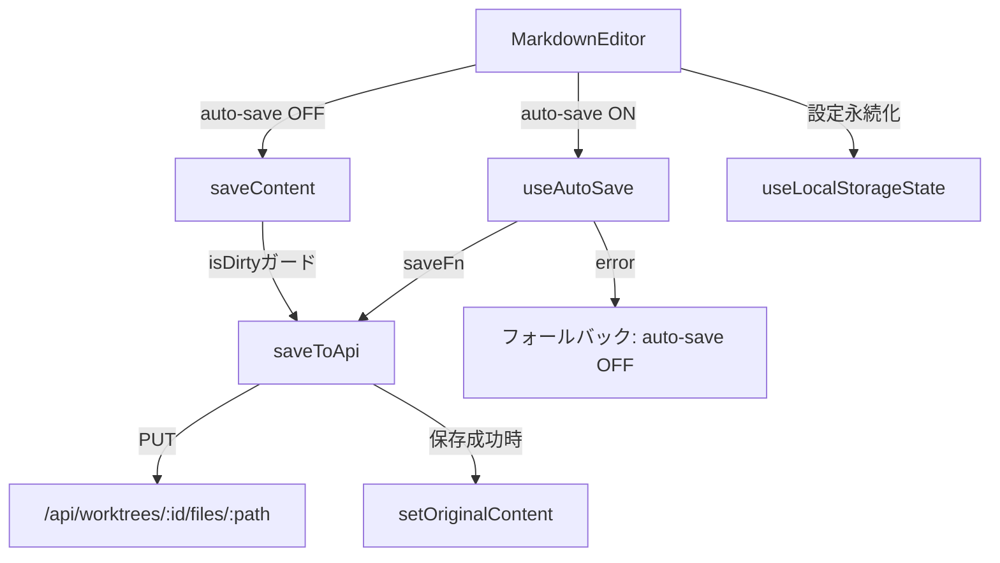
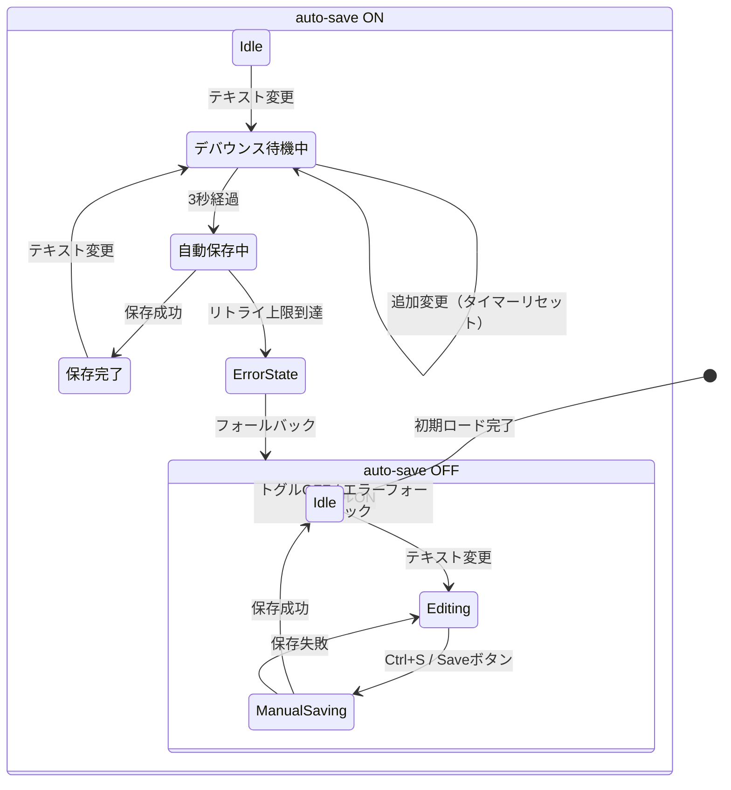

# Issue #389: MarkdownEditor Auto-Save 設計方針書

## 1. 概要

MarkdownEditorコンポーネントにauto-saveモード（ON/OFF切替可能）を追加する。既存の`useAutoSave`フックと`useLocalStorageState`フックを活用し、最小限のコード変更で安全に実装する。

### 設計原則
- **KISS**: 既存フックの再利用、新規フック不要
- **DRY**: MemoCardのuseAutoSave基本パターン（value/saveFn/debounceMs）を踏襲（disabledの動的切り替えはMarkdownEditor固有 [DR2-003]）
- **YAGNI**: i18n対応は行わない（既存MarkdownEditorと整合）
- **SRP**: 保存関数の責務分離（saveToApi / saveContent）

## 2. アーキテクチャ設計

### コンポーネント構成図



### 状態管理フロー



## 3. 技術選定

| カテゴリ | 選定技術 | 選定理由 |
|---------|---------|---------|
| 自動保存 | `useAutoSave`フック（既存） | MemoCardで基本パターン（value/saveFn/debounceMs）の実績あり。**注: disabledパラメータの動的切り替えはMarkdownEditor固有の新規利用**（[DR2-003]参照） |
| 設定永続化 | `useLocalStorageState`フック（既存） | MarkdownEditor内で既に3箇所で使用中 |
| 定数管理 | `src/types/markdown-editor.ts` | 既存のLOCAL_STORAGE_KEY_*パターンに統一 |
| UI | Tailwind CSS + lucide-react | 既存MarkdownEditorのスタイリングパターン |

### 代替案と却下理由

| 代替案 | 却下理由 |
|--------|---------|
| 新規`useMarkdownAutoSave`フック作成 | YAGNI: 既存useAutoSaveで十分 |
| サーバーサイドauto-save設定 | 過剰設計: localStorage永続化で要件を満たす |
| `useAutoSave`へのisDebouncing公開 | 不要: isDirtyチェックでデバウンス待機中を自然にカバー |

## 4. 詳細設計

### 4.1 新規定数（`src/types/markdown-editor.ts`）

```typescript
/** localStorage key for auto-save setting */
export const LOCAL_STORAGE_KEY_AUTO_SAVE = 'commandmate:md-editor-auto-save';

/** Auto-save debounce delay (3 seconds) */
export const AUTO_SAVE_DEBOUNCE_MS = 3000;
```

### 4.2 保存関数の分離

```typescript
// API呼び出し + dirty状態解除（useAutoSaveのsaveFnとして使用）
// saveFnのパラメータ(valueToSave)を使用する（クロージャのcontent stateではない）
// [DR1-001] 保存成功後にsetOriginalContent(valueToSave)を呼び出し、
// 実際にAPIへ送信された値とoriginalContentの一致を保証する
const saveToApi = useCallback(
  async (valueToSave: string): Promise<void> => {
    const response = await fetch(
      `/api/worktrees/${worktreeId}/files/${filePath}`,
      {
        method: 'PUT',
        headers: { 'Content-Type': 'application/json' },
        body: JSON.stringify({ content: valueToSave }),
      }
    );
    // [DR4-001] セッション切れ（認証失効）検出
    // 認証有効環境（CM_AUTH_TOKEN_HASH設定時）では、middleware.tsが
    // トークン検証失敗時に/loginへリダイレクト（NextResponse.redirect）を返す。
    // fetch APIはデフォルトでリダイレクトに追従するため、response.redirectedで検出する。
    // これはセキュリティ脆弱性ではなくUX改善: データロスはエラーフォールバック（Section 4.5）で防止済み。
    if (response.status === 401 || response.redirected) {
      throw new Error('Session expired. Please re-login.');
    }
    const data = await response.json();
    if (!response.ok || !data.success) {
      throw new Error(data.error?.message || 'Failed to save file');
    }
    // 実際に保存された値でoriginalContentを更新（dirty状態解除）
    setOriginalContent(valueToSave);
  },
  [worktreeId, filePath, setOriginalContent]
);

// isDirtyガード付き手動保存（Saveボタン / Ctrl+S用）
const saveContent = useCallback(async () => {
  if (!isDirty || isSaving) return;
  setIsSaving(true);
  try {
    await saveToApi(content);
    setOriginalContent(content);
    showToast('File saved successfully', 'success');
    onSave?.(filePath);
  } catch (err) {
    const message = err instanceof Error ? err.message : 'Failed to save file';
    showToast(message, 'error');
  } finally {
    setIsSaving(false);
  }
}, [saveToApi, content, isDirty, isSaving, onSave, filePath, showToast]);
```

### 4.3 useAutoSave統合

```typescript
// auto-save設定（localStorage永続化）
const { value: isAutoSaveEnabled, setValue: setAutoSaveEnabled } = useLocalStorageState({
  key: LOCAL_STORAGE_KEY_AUTO_SAVE,
  defaultValue: false,
  validate: isValidBoolean,
});

// useAutoSave統合
// [DR2-001] onSaveCompleteは使用しない。dirty状態解除はsaveToApi内部で行う（Section 4.2参照）
// useAutoSaveのonSaveCompleteは () => void 型（引数なし）のため、
// 実際に保存された値（valueToSave）を参照できない。
const {
  isSaving: isAutoSaving,
  error: autoSaveError,
  saveNow,
} = useAutoSave({
  value: content,
  saveFn: saveToApi,
  debounceMs: AUTO_SAVE_DEBOUNCE_MS,
  disabled: !isAutoSaveEnabled,
});
```

> **[DR1-001 / DR2-001] 設計決定: saveToApi内部でのdirty状態解除**
>
> useAutoSaveの`onSaveComplete`コールバックは`() => void`型であり、保存された値を引数として受け取らない（useAutoSave.ts Line 32: `onSaveComplete?: () => void`、Line 133: `onSaveCompleteRef.current?.()`で引数なし呼び出し）。
>
> そのため、`onSaveComplete`内で`setOriginalContent(content)`を呼ぶと、React stateの`content`（呼び出し時点の最新値）とuseAutoSaveが実際に保存した`valueToSave`が不一致になるタイミング問題が生じる。
>
> **採用した方針**: `saveToApi`（Section 4.2）の内部で保存成功後に`setOriginalContent(valueToSave)`を呼び出す。`saveFn`のパラメータ`valueToSave`は`useAutoSave`が`valueRef.current`から渡す実際の保存対象値であるため、originalContentとの一致が保証される。`onSaveComplete`プロパティは使用しない。

> **[DR2-003] MemoCardパターンとの差異: disabledパラメータの動的切り替え**
>
> 設計書は「MemoCardのuseAutoSaveパターンを踏襲」としているが、MemoCard（MemoCard.tsx Line 94-111）は`useAutoSave`に`disabled`パラメータを渡していない（常にauto-save有効）。`useAutoSave`の`disabled`パラメータ自体はAPIに存在する（useAutoSave.ts Line 69: `disabled = false`）が、MemoCardでの使用実績はない。
>
> MarkdownEditorでの`disabled: !isAutoSaveEnabled`による動的ON/OFF切り替え（`true` -> `false`、`false` -> `true`）はMemoCardとの差分であり、MarkdownEditor固有の新規利用パターンである。特に`disabled`が`true`から`false`に切り替わった際の`useAutoSave`内部の状態遷移（initialValueRefとの比較、デバウンスタイマーの起動）は、テストで網羅的に検証する必要がある（Section 8.3のエッジケースも参照）。

### 4.4 auto-save ON切り替え時のエッジケース対応

```typescript
// auto-save ON切り替え時、isDirty=trueなら即座にsaveNow()
const handleAutoSaveToggle = useCallback((enabled: boolean) => {
  setAutoSaveEnabled(enabled);
  if (enabled && isDirty) {
    void saveNow();
  }
}, [setAutoSaveEnabled, isDirty, saveNow]);
```

### 4.5 エラーフォールバック

```typescript
// auto-save失敗時、手動保存モードにフォールバック
useEffect(() => {
  if (autoSaveError && isAutoSaveEnabled) {
    setAutoSaveEnabled(false);
    showToast('Auto-save failed. Switched to manual save.', 'error');
  }
}, [autoSaveError, isAutoSaveEnabled, setAutoSaveEnabled, showToast]);
```

### 4.6 beforeunloadハンドラー修正

```typescript
// auto-save ON時: isDirty OR isSaving の場合のみ警告
useEffect(() => {
  const handleBeforeUnload = (e: BeforeUnloadEvent) => {
    const shouldWarn = isAutoSaveEnabled
      ? (isDirty || isAutoSaving)  // auto-save ON: デバウンス待機中(isDirty) or 保存中
      : isDirty;                    // auto-save OFF: 従来通り
    if (shouldWarn) {
      e.preventDefault();
      e.returnValue = '';
    }
  };
  // ... イベントリスナー登録/解除
}, [isDirty, isAutoSaving, isAutoSaveEnabled]);
```

### 4.7 handleKeyDown修正

```typescript
// Ctrl+S
if ((e.ctrlKey || e.metaKey) && e.key === 's') {
  e.preventDefault();
  if (isAutoSaveEnabled) {
    // [DR1-009] auto-save ON時のCtrl+Sは、saveNow()成功後にonSave(filePath)を
    // 呼び出してファイルツリーをrefreshする（ユーザーの明示的な保存操作として区別）
    void (async () => {
      await saveNow(); // デバウンスキャンセル + 即座保存
      onSave?.(filePath); // ファイルツリーrefresh
    })();
  } else {
    saveContent();  // 従来の手動保存（内部でonSave呼出済み）
  }
  return;
}
```

> **[DR1-009] 設計根拠: auto-save ON時のCtrl+SでのonSave呼び出し**
>
> 自動保存（デバウンスによる保存）ではファイルツリーrefreshを行わない（Section 7.2）が、ユーザーがCtrl+Sを明示的に押した場合はファイルツリーの即座更新を期待する。そのため、auto-save ON時のCtrl+Sは`saveNow()`の完了を待ってから`onSave(filePath)`を呼び出し、自動保存と手動保存の動作を区別する。`onSave`の呼び出しは`onSaveComplete`コールバック内ではなく、`handleKeyDown`内で`saveNow()`をawaitした後に行う。

### 4.8 handleClose修正

```typescript
const handleClose = useCallback(async () => {
  if (isAutoSaveEnabled) {
    // auto-save ON: 未保存データがあれば即座保存してから閉じる
    if (isDirty || isAutoSaving) {
      await saveNow();
      // [DR1-006] saveNow()失敗時のハンドリング
      // saveNow()はuseAutoSave内部のexecuteSaveを経由し、
      // リトライ上限到達後にerror stateを設定する（Promise自体はrejectしない）。
      // エラーフォールバック(Section 4.5)によりauto-saveがOFFになるため、
      // autoSaveErrorを確認して確認ダイアログを表示する。
      if (autoSaveError) {
        const confirmed = window.confirm('Save failed. Close anyway?');
        if (!confirmed) return;
      }
    }
  } else {
    // auto-save OFF: 従来の確認ダイアログ
    if (isDirty) {
      const confirmed = window.confirm('You have unsaved changes...');
      if (!confirmed) return;
    }
  }
  onClose?.();
}, [isAutoSaveEnabled, isDirty, isAutoSaving, saveNow, autoSaveError, onClose]);
```

> **[DR1-006] 設計根拠: handleClose失敗時のハンドリング**
>
> `saveNow()`がネットワークエラー等で失敗した場合、useAutoSaveのリトライ上限到達後にerror stateが設定される。`saveNow()`自体はrejectしないため`await`は正常完了するが、その直後にエラーフォールバック（Section 4.5）によりauto-saveがOFFになる。そのまま`onClose?.()`が呼ばれるとユーザーは未保存データの喪失に気付かない。対策として、`saveNow()`後に`autoSaveError`を確認し、エラーがある場合は`window.confirm('Save failed. Close anyway?')`で確認ダイアログを表示する。ユーザーがキャンセルした場合はクローズを中止し、手動保存を試みる機会を与える。
>
> **フロー図:**
> ```
> handleClose
>   -> isDirty || isAutoSaving?
>     -> await saveNow()
>     -> autoSaveError?
>       -> YES: confirm('Save failed. Close anyway?')
>         -> OK: onClose()
>         -> Cancel: return (クローズ中止)
>       -> NO: onClose()
>   -> onClose()
> ```

> **[DR2-002] 注意: saveNow()とエラーフォールバックuseEffectのタイミング**
>
> `handleClose`を`async`関数に変更し`await saveNow()`を呼び出す設計において、以下のタイミング問題を認識する必要がある。
>
> `saveNow()`が内部の`executeSave`でリトライ上限到達後にerror stateを設定すると、エラーフォールバックuseEffect（Section 4.5）が次のレンダリングサイクルで発火し、`isAutoSaveEnabled`を`false`に切り替える。この時点で`useAutoSave`の`disabled`が`true`になる。
>
> **saveNow()がスキップされるケース**: エラーフォールバックuseEffectが`handleClose`の`await saveNow()`の完了より前に発火した場合（例: saveNow内部のリトライ中にReactがレンダリングサイクルを挟んだ場合）、`disabled=true`となった後の`saveNow()`呼び出しは内部のdisabledチェック（useAutoSave.ts Line 171）により何もせずに返る可能性がある。
>
> **実質的な影響なし**: この場合、`autoSaveError`は既にエラーフォールバックuseEffectにより設定されているため、`handleClose`内の`if (autoSaveError)`チェックにより確認ダイアログが表示される。つまりユーザーへの通知は保証されている。
>
> **テストケース追加**: このシナリオ（saveNow()がdisabledによりスキップされるが、autoSaveErrorにより確認ダイアログが表示される）をテストケースとして追加すること。

## 5. UI設計

### 5.1 ヘッダーレイアウト

```
┌─────────────────────────────────────────────────────────┐
│ 📄 docs/readme.md [Unsaved]                             │
│                                                         │
│ [Split|Edit|Preview] [Copy] [Max] [Auto-save ◯] [Save] [×] │
│                          ↑auto-save OFF時                │
│                                                         │
│ [Split|Edit|Preview] [Copy] [Max] [Auto-save ●] Saved  [×] │
│                          ↑auto-save ON時                 │
└─────────────────────────────────────────────────────────┘
```

### 5.2 トグルスイッチ

```typescript
// data-testid="auto-save-toggle"
<button
  data-testid="auto-save-toggle"
  role="switch"
  aria-checked={isAutoSaveEnabled}
  onClick={() => handleAutoSaveToggle(!isAutoSaveEnabled)}
  className={`relative inline-flex h-5 w-9 items-center rounded-full transition-colors ${
    isAutoSaveEnabled ? 'bg-blue-600' : 'bg-gray-300'
  }`}
>
  <span className={`inline-block h-3.5 w-3.5 transform rounded-full bg-white transition-transform ${
    isAutoSaveEnabled ? 'translate-x-4' : 'translate-x-0.5'
  }`} />
</button>
```

### 5.3 保存状態インジケーター（auto-save ON時）

```typescript
// data-testid="auto-save-indicator"
// Saveボタンの代わりに表示
{isAutoSaveEnabled ? (
  <span data-testid="auto-save-indicator" className="text-sm text-gray-500">
    {isAutoSaving ? 'Saving...' : isDirty ? '' : 'Saved'}
  </span>
) : (
  <button data-testid="save-button" ...>Save</button>
)}
```

### 5.4 インジケーター状態遷移

| 状態 | isDirty | isAutoSaving | 表示 |
|-----|---------|-------------|------|
| 編集なし | false | false | "Saved" |
| デバウンス待機中 | true | false | （表示なし） |
| 保存中 | true/false | true | "Saving..." |
| 保存完了 | false | false | "Saved" |

## 6. セキュリティ設計

### 6.1 既存のセキュリティ制約の維持

- **XSS防御**: rehype-sanitize（SEC-MF-001）は変更なし
- **API認証**: PUT `/api/worktrees/:id/files/:path`の認証ミドルウェアは変更なし
- **入力バリデーション**: saveToApiはファイルAPIの既存バリデーションを使用

### 6.2 auto-save固有のセキュリティ考慮

- **localStorage**: auto-save設定のみ（boolean）を保存。センシティブデータなし
- **API呼び出し頻度**: 3秒デバウンスによる自然なレート制限
- **リトライ制限**: maxRetries=3（指数バックオフ: 1s, 2s, 4s）でDoS防御

## 7. パフォーマンス設計

### 7.1 API呼び出し頻度

- **デバウンス間隔**: 3000ms（MemoCardの300msより10倍長い）
- **最大ファイルサイズ**: 1MB（FILE_SIZE_LIMITS.MAX_SIZE）
- **最悪ケース**: 1MBファイルの3秒ごとのPUT（継続的編集中）

### 7.2 ファイルツリーrefresh制御

- auto-save成功時はonSave()を呼ばない（ファイルツリーrefreshなし）
- manual save時のみonSave()を呼び出し
- WorktreeDetailRefactoredのhandleEditorSaveの不要な発火を防止

### 7.3 レンダリング最適化

- `saveToApi`はuseCallbackでメモ化（依存: worktreeId, filePath, setOriginalContent [DR2-006]）
- `handleAutoSaveToggle`はuseCallbackでメモ化
- auto-save状態の変更はヘッダー部分のみに影響（エディタ本体は再レンダリング不要）

## 8. 設計上の決定事項とトレードオフ

### 8.1 採用した設計

| 決定事項 | 理由 | トレードオフ |
|---------|------|-------------|
| useAutoSave既存フック活用 | 基本パターン（value/saveFn/debounceMs）はMemoCardで実績あり | MemoCard（300ms）と同一フックだが用途が異なる。disabled動的切り替えはMarkdownEditor固有の新規利用 [DR2-003] |
| auto-save ON時のSaveボタン非表示 | UIの明確さ | Ctrl+Sは引き続き使用可能 |
| auto-save時のonSave()不呼出 | ファイルツリーrefresh頻度制御 | auto-save後はツリーが即座に更新されない（Ctrl+Sの手動保存時のみonSave呼出 [DR1-009]） |
| error時の自動OFF切替 | データロス防止 | ユーザーが手動でONに戻す必要がある |
| デフォルトOFF | 既存動作の互換性維持 | 新規ユーザーは手動で有効化する必要がある |

### 8.2 saveFnのパラメータ利用

`useAutoSave`の`saveFn`は内部の`valueRef.current`を引数として渡す。クロージャのcontent stateを参照するとタイミングのずれが生じるため、**必ずsaveFnのパラメータ（valueToSave）を使用**する。

```typescript
// 正しいパターン（MemoCard踏襲）
saveFn: saveToApi  // saveToApi(valueToSave: string) => Promise<void>

// 誤りパターン（タイミングずれリスク）
saveFn: async () => { await saveToApi(content); }  // クロージャ参照NG
```

### 8.3 initialValueRefエッジケース

`useAutoSave`はマウント時のvalueをinitialValueRefに保存し、初回レンダリング時のsaveをスキップする。auto-save ON切り替え時にisDirty=trueの場合、切り替え直後のvalueがinitialValueRefと一致し、auto-saveが発火しない。対策として**ON切り替え時にsaveNow()を即座呼び出す**。

> **[DR1-003] 注意: disabled=trueでマウントされる場合のinitialValueRef**
>
> useAutoSaveが`disabled=true`の状態でマウントされた場合（auto-saveデフォルトOFF）、`initialValueRef`にはマウント時点の`value`（= content state）が設定される。MarkdownEditorではファイルロード（loadContent）が非同期で行われるため、マウント時点のcontentが空文字列である可能性がある。その場合、`initialValueRef.current === ''` となり、ファイルロード後に`disabled`を`false`に切り替えると`value !== initialValueRef.current`が即座にtrueとなりデバウンスタイマーが起動する。
>
> `handleAutoSaveToggle`で`isDirty`チェック + `saveNow()`を行う対策は妥当であり、この動作は「保証された動作」として扱う。ただし、テストで以下のエッジケースシナリオを必ず検証すること。

**追加テストケース（DR1-003対応）:**

| テストケース | シナリオ | 期待動作 |
|------------|---------|---------|
| ファイルロード後にauto-save OFFのまま編集 -> auto-save ON切替 | (1) MarkdownEditorマウント（auto-save OFF）、(2) loadContent完了、(3) ユーザーがテキスト編集（isDirty=true）、(4) auto-saveトグルをON | handleAutoSaveToggleがisDirty=trueを検出しsaveNow()を即座呼び出し。保存成功後isDirty=false |
| disabled=trueマウント時のinitialValueRef値 | (1) auto-save OFF状態でマウント、(2) loadContent完了前にauto-save ON | initialValueRefが空文字列のままの場合、loadContent完了後にvalue変化でデバウンスが発火する。テストでsaveToApiが呼ばれることを確認 |
| disabled=trueマウント -> loadContent -> ON切替（変更なし） | (1) auto-save OFF状態でマウント、(2) loadContent完了（content設定）、(3) 編集なしでauto-save ON | isDirty=falseのためsaveNow()は呼ばれない。useAutoSaveのuseEffectでinitialValueRefとvalueが異なる場合でもデバウンス発火は許容（保存内容はloadContent結果と同一） |

## 9. テスト戦略

### 9.1 既存テスト更新

| テストカテゴリ | テスト数 | 更新内容 |
|-------------|--------|---------|
| Save Operations | 6 | auto-save OFF（デフォルト）時に既存動作が維持されることを確認。**既存テスト自体のロジック変更は不要**（auto-save OFFがデフォルトのため） [DR3-002] |
| Unsaved Changes Warning | 3 | beforeunload条件のisDirty OR isSaving対応。**既存テスト3件のdescribeブロック冒頭に「auto-save OFF（デフォルト）を前提としたテスト」であることをコメントで明記する** [DR3-001] |
| Keyboard Shortcuts (Ctrl+S) | 関連 | auto-save ON/OFF分岐テスト追加 |
| onClose callback | 3 | **handleCloseがasync関数に変更されるため、fireEvent.click後にwaitForでラップすることを推奨する**（特にテスト (1) 'should call onClose when close button is clicked' はisDirty=falseで同期的に完了する可能性が高いが、安全のためwaitForでラップする） [DR3-003] |

> **[DR3-004] auto-save OFF時のデフォルト動作と既存テスト互換性**
>
> auto-save機能はデフォルトOFF（`useLocalStorageState`の`defaultValue: false`）であるため、localStorageに設定が存在しない状態では従来と完全に同一の動作となる。既存テスト（Save Operations 6件、Unsaved Changes Warning 3件、onClose callback 3件）は全てauto-save OFF状態で実行されるため、**既存テストの直接的な破綻リスクはない**。ただし、以下の間接的な変更が影響する可能性がある:
> - beforeunload useEffectの依存配列が`[isDirty]`から`[isDirty, isAutoSaving, isAutoSaveEnabled]`に拡大される（再実行タイミングの変化）
> - handleCloseがsync関数からasync関数に変更される（戻り値がPromise<void>に変化）
>
> これらの変更は既存テストを壊す可能性は低いが、テストの堅牢性のためにwaitForラッピングの追加を推奨する。

### 9.2 新規テスト

| テストケース | data-testid | 検証内容 |
|------------|-------------|---------|
| トグル切替 | auto-save-toggle | ON/OFF切替でrole="switch"のaria-checked変更 |
| インジケーター表示 | auto-save-indicator | Saving.../Saved状態遷移 |
| Saveボタン非表示 | save-button | auto-save ON時に非表示 |
| デバウンス動作 | - | 3秒後にsaveToApi呼出（vi.advanceTimersByTime） |
| エラーフォールバック | - | error発生→auto-save OFF→Toast表示 |
| localStorage永続化 | - | リロード後のauto-save設定維持 |
| ON切替時の即座保存 | - | isDirty=trueでON→saveNow()呼出 |

### 9.3 Stage 3 影響分析レビューによる追加テストケース

#### 9.3.1 beforeunload テスト追加 [DR3-001]

既存の "Unsaved Changes Warning" テスト（Line 350-413）は auto-save OFF を前提としている。auto-save ON 時の beforeunload 動作をカバーするため、以下の3件のテストを新規追加する。

| テストケース | 前提条件 | 期待動作 |
|------------|---------|---------|
| auto-save ON + isDirty=false + isAutoSaving=false 時に beforeunload が登録されない | auto-save ON、編集なし、保存なし | beforeunload イベントリスナーが登録されない。ページ離脱時にブラウザ警告が表示されない |
| auto-save ON + isDirty=true 時に beforeunload が登録される | auto-save ON、テキスト編集済み（デバウンス待機中） | beforeunload イベントリスナーが登録される。ページ離脱時にブラウザ警告が表示される |
| auto-save ON + isAutoSaving=true 時に beforeunload が登録される | auto-save ON、自動保存実行中 | beforeunload イベントリスナーが登録される。保存完了前のページ離脱を防止する |

> **補足**: beforeunload useEffect の依存配列が `[isDirty, isAutoSaving, isAutoSaveEnabled]` に正しく更新されていることをテストで間接的に検証する（依存配列の変化に応じてイベントリスナーの登録/解除が正しく行われることを確認）。

#### 9.3.2 Save Operations テスト追加 [DR3-002]

既存の Save Operations テスト6件は auto-save OFF（デフォルト）で動作するため変更不要。以下の新規テストを追加する。

| テストケース | 前提条件 | 期待動作 |
|------------|---------|---------|
| auto-save ON 時に save-button が DOM に存在しない | auto-save ON に切り替え | `queryByTestId('save-button')` が `null` を返す。代わりに `auto-save-indicator` が表示される |
| auto-save ON 時の Ctrl+S で saveNow() + onSave() が呼ばれる | auto-save ON、テキスト編集済み | Ctrl+S 押下で `saveNow()` が呼ばれ、完了後に `onSave(filePath)` コールバックが呼ばれる（ファイルツリー refresh） |
| auto-save OFF 時は従来の saveContent() が呼ばれる（既存テスト互換性確認） | auto-save OFF（デフォルト） | Ctrl+S 押下で従来の `saveContent()` が呼ばれる。既存の Ctrl+S テスト（Line 252-316）と同一の動作を確認 |

> **補足**: Section 9.1 の「Save Operations 6件更新」は、既存テストのロジック変更ではなく、auto-save OFFが前提であることの明示化（コメント追加）を指す。実質的なテスト変更は新規テストの追加が中心。

#### 9.3.3 handleClose テスト追加 [DR3-003]

handleClose が async 関数に変更されることに伴い、以下のテスト更新・追加が必要。

**既存テストの更新:**
- 既存テスト 'should call onClose when close button is clicked'（Line 733-745）の `fireEvent.click(closeButton)` 後の `expect(onClose).toHaveBeenCalled()` を `await waitFor(() => expect(onClose).toHaveBeenCalled())` でラップする（isDirty=false のため同期的に完了する可能性が高いが、async 関数化への安全対策）
- 既存テスト 'should warn before closing with unsaved changes'（Line 747-767）、'should close when user confirms unsaved changes'（Line 769-789）も同様に waitFor でラップすることを推奨

**新規テスト追加:**

| テストケース | 前提条件 | 期待動作 |
|------------|---------|---------|
| auto-save ON + isDirty=true 時の handleClose | auto-save ON、テキスト編集済み | handleClose で `saveNow()` が呼ばれ、保存完了後に `onClose()` が呼ばれる。`window.confirm` は呼ばれない |
| auto-save ON + saveNow() 失敗時の confirm ダイアログ | auto-save ON、saveNow が内部エラーで autoSaveError を設定 | `saveNow()` 呼び出し後、`autoSaveError` が truthy のため `window.confirm('Save failed. Close anyway?')` が表示される。OK で `onClose()` が呼ばれ、Cancel でクローズ中止 |

## 10. 変更影響範囲サマリー

### 直接変更ファイル

| ファイル | 変更概要 |
|---------|---------|
| `src/components/worktree/MarkdownEditor.tsx` | auto-save統合（6箇所の変更） |
| `src/types/markdown-editor.ts` | 2定数追加 |
| `tests/unit/components/MarkdownEditor.test.tsx` | 既存テスト更新 + 新テスト追加 |

> **[DR3-005] 影響範囲の限定性**: 直接変更ファイルは上記3件のみであり、呼び出し元への変更は不要。具体的には:
> - `EditorProps` interface（`src/types/markdown-editor.ts`）への変更なし -- 新規定数の追加のみ
> - `WorktreeDetailRefactored.tsx` の `MarkdownEditor` 呼び出し箇所への変更不要 -- `onSave` props の動作は維持される
> - `Modal.tsx`、`MemoCard.tsx` その他の `src/types/markdown-editor.ts` インポート元への影響なし -- 新規エクスポートは既存エクスポートと独立
>
> auto-save 機能は MarkdownEditor コンポーネント内部に完全に閉じており、外部インターフェースの変更を伴わない。

### 変更なしが確認されたファイル

- `src/hooks/useAutoSave.ts` - 変更不要
- `src/hooks/useLocalStorageState.ts` - 変更不要
- `src/components/worktree/MemoCard.tsx` - 影響なし
- `src/app/api/worktrees/[id]/files/[...path]/route.ts` - 影響なし
- `src/components/worktree/WorktreeDetailRefactored.tsx` - 影響なし（EditorProps変更なし、onSave動作維持） [DR3-005]
- `src/components/ui/Modal.tsx` - 影響なし [DR3-005]

## 11. Stage 1 設計レビュー指摘事項サマリー

### 11.1 レビュー概要

| 項目 | 値 |
|-----|-----|
| レビュー日 | 2026-03-02 |
| ステージ | Stage 1: 通常レビュー（設計原則） |
| Must Fix | 1件 |
| Should Fix | 3件（反映済み） |
| Nice to Have | 4件（記録のみ、スキップ） |
| 全体評価 | 設計方針書は全体として高品質。KISS/DRY/YAGNI原則に適切に準拠。既存useAutoSave/useLocalStorageStateフックの再利用判断は優れている |

### 11.2 反映済み指摘事項

| ID | 優先度 | カテゴリ | タイトル | 反映箇所 |
|----|--------|---------|---------|---------|
| DR1-003 | Must Fix | 整合性 | initialValueRefエッジケース対策の明確化 | Section 8.3: 注意事項追記 + テストケース3件追加 |
| DR1-001 | Should Fix | SRP | onSaveCompleteでのcontent参照タイミング問題 | Section 4.3: saveToApi内部でsetOriginalContent(valueToSave)を呼ぶ方針に変更 |
| DR1-006 | Should Fix | 設計パターン | handleClose失敗時のハンドリング | Section 4.8: saveNow()失敗時の確認ダイアログ + フロー図追加 |
| DR1-009 | Should Fix | 整合性 | auto-save ON時のCtrl+SでのonSave呼び出し | Section 4.7: saveNow()成功後にonSave(filePath)呼び出し追加 |

### 11.3 スキップした指摘事項

| ID | 優先度 | タイトル | スキップ理由 |
|----|--------|---------|-------------|
| DR1-002 | Should Fix | saveContentの依存配列が過大 | 既存パターンの踏襲、即座の変更不要 |
| DR1-004 | Nice to Have | handleCloseのisDirty+isAutoSavingチェック重複 | 現在2箇所のみ、複雑性増加を避ける |
| DR1-005 | Nice to Have | エラーフォールバックのuseEffectでautoSaveError参照の安定性 | 実用上の問題なし、テストで確認で十分 |
| DR1-007 | Nice to Have | data-testidの過不足確認 | 変更不要、現行設計で十分 |
| DR1-008 | Nice to Have | auto-save設定拡張への拡張性 | YAGNI原則に従いboolean型を維持 |

### 11.4 実装チェックリスト

Stage 1レビュー反映に基づく実装時の確認事項:

- [ ] **[DR1-001]** `saveToApi`内部で`setOriginalContent(valueToSave)`を呼び出す実装に変更する
- [ ] **[DR1-001]** `onSaveComplete`からの`setOriginalContent(content)`呼び出しを削除する
- [ ] **[DR1-003]** テスト: 「ファイルロード後にauto-save OFFのまま編集 -> auto-save ON切替」のシナリオを追加する
- [ ] **[DR1-003]** テスト: `disabled=true`マウント時のinitialValueRef値（空文字列）の動作を確認する
- [ ] **[DR1-003]** テスト: `disabled=true`マウント -> loadContent -> ON切替（変更なし）の動作を確認する
- [ ] **[DR1-006]** `handleClose`で`saveNow()`後に`autoSaveError`を確認し、エラー時に確認ダイアログを表示する
- [ ] **[DR1-006]** `handleClose`の依存配列に`autoSaveError`を追加する
- [ ] **[DR1-009]** `handleKeyDown`のauto-save ON分岐で、`saveNow()`成功後に`onSave?.(filePath)`を呼び出す
- [ ] **[DR1-009]** テスト: auto-save ON時のCtrl+SでonSaveが呼ばれることを確認する

## 12. Stage 2 整合性レビュー指摘事項サマリー

### 12.1 レビュー概要

| 項目 | 値 |
|-----|-----|
| レビュー日 | 2026-03-02 |
| ステージ | Stage 2: 整合性レビュー |
| Must Fix | 2件（反映済み） |
| Should Fix | 4件（3件反映済み、1件修正不要で記録のみ） |
| Nice to Have | 3件（記録のみ、スキップ） |
| 全体評価 | 設計方針書は実装コードベースとの整合性が全体的に高い。useAutoSave/useLocalStorageStateのAPIパラメータは全て実装に存在し、設計書の使用方法は正しい。localStorageキーの命名規則も既存パターンに完全に準拠。Must Fix 2件はコードスニペットの不整合とhandleCloseのタイミング問題であり、いずれも設計書の補記で解決 |

### 12.2 反映済み指摘事項

| ID | 優先度 | カテゴリ | タイトル | 反映箇所 |
|----|--------|---------|---------|---------|
| DR2-001 | Must Fix | API整合性 | onSaveCompleteコールバックは引数を受け取らないためsaveFn内部でのsetOriginalContent呼び出しが必須 | Section 4.2: saveToApiにsetOriginalContent(valueToSave)統合、依存配列更新。Section 4.3: onSaveComplete削除、DR1-001/DR2-001統合注記に更新。Section 2: アーキテクチャ図更新 |
| DR2-002 | Must Fix | インターフェース整合性 | handleCloseが同期関数から非同期関数に変更される影響 | Section 4.8: DR2-002注記追加。saveNow()がdisabledによりスキップされるケースの明記、テストケース追加指示 |
| DR2-003 | Should Fix | パターン整合性 | MemoCardはuseAutoSaveのdisabledパラメータを使用していない | Section 1, 3, 4.3, 8.1: MemoCardパターンの記述をdisabled動的切り替えがMarkdownEditor固有の新規利用である旨に修正。テストでの網羅的検証の必要性を明記 |
| DR2-004 | Should Fix | API整合性 | useAutoSaveのデフォルトdebounceMs(300ms)と設計書の3000ms指定 | Section 12.4チェックリスト: debounceMsの明示的設定確認項目を追加 |
| DR2-006 | Should Fix | 型整合性 | saveToApiのuseCallback依存配列にsetOriginalContentが含まれていない | Section 4.2: 依存配列を[worktreeId, filePath, setOriginalContent]に更新。Section 12.4チェックリスト: ESLint exhaustive-deps整合性の確認項目を追加 |

### 12.3 スキップした指摘事項

| ID | 優先度 | タイトル | スキップ理由 |
|----|--------|---------|-------------|
| DR2-005 | Should Fix | LOCAL_STORAGE_KEY_AUTO_SAVEの命名規則 | レビュー結果で「修正不要。命名規則と配置場所は完全に整合」と判定済み |
| DR2-007 | Nice to Have | isSaving stateの名前衝突に関する整理 | NTH指定。auto-save ON時のSaveボタン非表示設計により既存テストへの影響は限定的。Section 9.1で既存テスト更新6件を記載済み |
| DR2-008 | Nice to Have | useLocalStorageStateのvalidateパラメータにisValidBooleanを使用 | NTH指定。レビュー結果で「修正不要。既存パターンとの整合性は完全」と判定済み |
| DR2-009 | Nice to Have | saveNow()の戻り値はPromise<void>でありawait可能だがエラーはrejectされない | NTH指定。レビュー結果で「修正不要。設計書の理解は正確」と判定済み。DR1-006注記で既に網羅 |

### 12.4 実装チェックリスト（Stage 2追加分）

Stage 2レビュー反映に基づく実装時の追加確認事項:

- [ ] **[DR2-001]** Section 4.3のuseAutoSave呼び出しで`onSaveComplete`プロパティを使用していないこと
- [ ] **[DR2-001]** Section 4.2のsaveToApi内部で保存成功後に`setOriginalContent(valueToSave)`が呼ばれていること
- [ ] **[DR2-002]** テスト: handleClose内でsaveNow()がdisabled(エラーフォールバック後)によりスキップされた場合でも、autoSaveErrorにより確認ダイアログが表示されることを確認する
- [ ] **[DR2-003]** テスト: disabled動的切り替え（true -> false）時のuseAutoSave内部状態遷移（initialValueRef比較、デバウンスタイマー起動）を網羅的に検証する
- [ ] **[DR2-004]** useAutoSave呼び出しに`debounceMs: AUTO_SAVE_DEBOUNCE_MS`が明示的に設定されていること（デフォルト300msに依存しない）
- [ ] **[DR2-006]** saveToApiの`useCallback`依存配列に`setOriginalContent`が含まれていること（ESLint exhaustive-deps整合性）

## 13. Stage 3 影響分析レビュー指摘事項サマリー

### 13.1 レビュー概要

| 項目 | 値 |
|-----|-----|
| レビュー日 | 2026-03-02 |
| ステージ | Stage 3: 影響分析レビュー |
| Must Fix | 3件（反映済み） |
| Should Fix | 4件（2件反映済み、2件記録のみ） |
| Nice to Have | 3件（記録のみ、スキップ） |
| 全体評価 | 影響分析の結果、auto-save機能追加による既存コードベースへの影響は限定的かつ制御可能。EditorProps interfaceへの変更はなく、WorktreeDetailRefactored.tsxやModal.tsxへの直接的なコード変更は不要。主な影響領域は既存テストであり、Must Fix 3件はすべてテスト関連 |

### 13.2 反映済み指摘事項

| ID | 優先度 | カテゴリ | タイトル | 反映箇所 |
|----|--------|---------|---------|---------|
| DR3-001 | Must Fix | テスト影響 | Unsaved Changes Warning テスト: beforeunloadハンドラーの条件変更による既存テスト破綻リスク | Section 9.1: 既存テストのコメント追記指示。Section 9.3.1: auto-save ON時のbeforeunloadテスト3件追加 |
| DR3-002 | Must Fix | テスト影響 | Save Operations テスト: Saveボタンの条件付き非表示による既存テスト破綻 | Section 9.1: 既存テスト更新内容の明確化。Section 9.3.2: save-button非表示・Ctrl+S分岐テスト3件追加 |
| DR3-003 | Must Fix | テスト影響 | onClose callback テスト: handleCloseのasync化と auto-save ON時の分岐による既存テスト影響 | Section 9.1: waitForラッピング推奨を明記。Section 9.3.3: 既存テスト更新指示 + 新規テスト2件追加 |
| DR3-004 | Should Fix | パフォーマンス | auto-save OFF時のデフォルト動作と既存テスト互換性 | Section 9.1: DR3-004注記ブロック追加（デフォルトOFFによる互換性保証の明記） |
| DR3-005 | Should Fix | テスト影響 | 影響範囲の限定性: 直接変更ファイル3件のみ | Section 10: DR3-005注記ブロック追加 + 変更なしファイルリスト拡充 |

### 13.3 スキップした指摘事項

| ID | 優先度 | タイトル | スキップ理由 |
|----|--------|---------|-------------|
| DR3-006 | Should Fix | WorktreeDetailRefactored.tsx の handleEditorSave 呼出頻度変化 | レビュー結果で「WorktreeDetailRefactoredへの直接的な変更は不要」と判定済み。Section 7.2で既にonSave不呼出を設計済み |
| DR3-007 | Should Fix | beforeunload 動作の変化: ブラウザ警告ダイアログ表示条件の拡大 | レビュー結果で「設計の方向性は正しく、ユーザー体験への悪影響はない」と判定済み。DR3-001のテスト追加でカバー |
| DR3-008 | Nice to Have | src/types/markdown-editor.ts への定数追加: 既存エクスポートへの影響なし | レビュー結果で「修正不要」と判定済み |
| DR3-009 | Nice to Have | localStorage キーの衝突リスク: 衝突なし | レビュー結果で「対応不要」と判定済み |
| DR3-010 | Nice to Have | useAutoSave の MemoCard / MarkdownEditor 間の独立性: 競合リスクなし | レビュー結果で「対応不要」と判定済み |

### 13.4 実装チェックリスト（Stage 3追加分）

Stage 3レビュー反映に基づく実装時の追加確認事項:

- [ ] **[DR3-001]** 既存 Unsaved Changes Warning テスト3件（Line 350-413）のdescribeブロック冒頭に「auto-save OFF（デフォルト）を前提」のコメントを追加する
- [ ] **[DR3-001]** テスト追加: auto-save ON + isDirty=false + isAutoSaving=false 時に beforeunload が登録されないことを確認する
- [ ] **[DR3-001]** テスト追加: auto-save ON + isDirty=true 時に beforeunload が登録されることを確認する
- [ ] **[DR3-001]** テスト追加: auto-save ON + isAutoSaving=true 時に beforeunload が登録されることを確認する
- [ ] **[DR3-002]** テスト追加: auto-save ON 時に save-button が DOM に存在しないことを確認する（`queryByTestId('save-button') === null`）
- [ ] **[DR3-002]** テスト追加: auto-save ON 時の Ctrl+S で saveNow() + onSave() が呼ばれることを確認する
- [ ] **[DR3-002]** テスト追加: auto-save OFF 時は従来の saveContent() が呼ばれることを確認する（既存テストとの互換性）
- [ ] **[DR3-003]** 既存 onClose テスト 'should call onClose when close button is clicked' の fireEvent.click 後を `await waitFor()` でラップする
- [ ] **[DR3-003]** テスト追加: auto-save ON + isDirty=true 時の handleClose で saveNow() が呼ばれ、完了後に onClose() が呼ばれることを確認する
- [ ] **[DR3-003]** テスト追加: auto-save ON + saveNow() 失敗時に confirm ダイアログが表示されることを確認する

## 14. Stage 4 セキュリティレビュー指摘事項サマリー

### 14.1 レビュー概要

| 項目 | 値 |
|-----|-----|
| レビュー日 | 2026-03-02 |
| ステージ | Stage 4: セキュリティレビュー |
| Must Fix | 0件 |
| Should Fix | 1件（反映済み） |
| Nice to Have | 9件（記録のみ、スキップ） |
| 全体評価 | セキュリティ観点で高品質な設計。auto-save機能は既存のセキュリティインフラストラクチャ（認証ミドルウェア、パスバリデーション、コンテンツバリデーション、XSSサニタイズ）を完全に維持したまま追加される。新たなセキュリティリスクを導入しない設計 |
| セキュリティスコア | 5/5 (Approved) |

### 14.2 反映済み指摘事項

| ID | 優先度 | OWASPカテゴリ | タイトル | 反映箇所 |
|----|--------|-------------|---------|---------|
| DR4-001 | Should Fix | A07 | auto-save動作中のセッション切れ（認証失効）時のエラーハンドリング不足 | Section 4.2: saveToApi内にresponse.status === 401 / response.redirected検出ロジックを追加。セッション切れ専用エラーメッセージ'Session expired. Please re-login.'を設計に追記。セキュリティ脆弱性ではなくUX改善であることを明記 |

### 14.3 スキップした指摘事項

| ID | 優先度 | OWASPカテゴリ | タイトル | スキップ理由 |
|----|--------|-------------|---------|-------------|
| DR4-002 | Nice to Have | A04 | auto-saveデバウンス3秒による最悪ケースAPI呼び出し頻度の明確化 | NTH - 単一ユーザー環境でDoSリスクは極めて低い。YAGNI原則に従い対応不要 |
| DR4-003 | Nice to Have | A05 | auto-saveエラー時のエラーメッセージにスタックトレースが含まれないことの確認 | NTH - 既存のエラーハンドリングパターンが正しく適用されている。対応不要 |
| DR4-004 | Nice to Have | localStorage | localStorage保存値のバリデーション関数isValidBooleanの適用確認 | NTH - useLocalStorageStateのvalidate関数使用により既存セキュリティ慣行に完全準拠。対応不要 |
| DR4-005 | Nice to Have | A01 | auto-saveによる定期API呼び出しが既存の認証・認可を迂回しないことの確認 | NTH - 認証ミドルウェア、パスバリデーション、コンテンツバリデーションの全てがauto-saveリクエストに対しても同様に適用。対応不要 |
| DR4-006 | Nice to Have | A03 | auto-saveで送信されるコンテンツに対する既存サニタイズの適用確認 | NTH - インジェクション対策は既存パイプラインで十分に対応。対応不要 |
| DR4-007 | Nice to Have | A08 | auto-saveの並行保存要求における整合性確認 | NTH - 単一ユーザーの単一エディタインスタンスにおけるLast Write Wins設計として適切。対応不要 |
| DR4-008 | Nice to Have | A09 | auto-saveエラーのログ記録 | NTH - サーバーサイドで適切にログされており、クライアントサイドのエラーフォールバックもユーザーに通知済み。対応不要 |
| DR4-009 | Nice to Have | A02 | localStorageに保存するauto-save設定が機密情報を含まないことの確認 | NTH - boolean値のみ保存。暗号化の必要性なし。対応不要 |
| DR4-010 | Nice to Have | A06 | 追加ライブラリ依存の脆弱性リスク | NTH - 新規外部ライブラリ依存なし。脆弱なコンポーネントのリスクはゼロ。対応不要 |

### 14.4 OWASP Top 10 セキュリティ評価

auto-save機能に対するOWASP Top 10の各カテゴリについて確認を完了し、全カテゴリでPASSと判定した。

| OWASPカテゴリ | 評価 | 根拠 |
|-------------|------|------|
| A01: Broken Access Control | PASS | 既存の認証ミドルウェア（middleware.ts）、パストラバーサル防止（isPathSafe）、拡張子チェック（isEditableFile）が全てauto-saveリクエストに適用 (DR4-005) |
| A02: Cryptographic Failures | PASS | localStorageにはboolean値のみ保存。機密データの暗号化要件なし (DR4-009) |
| A03: Injection | PASS | 既存のコンテンツバリデーション（NULLバイト検出、制御文字警告）とrehype-sanitize（XSS防御）が維持 (DR4-006) |
| A04: Insecure Design | PASS | 3秒デバウンス + maxRetries=3（指数バックオフ）でAPI呼び出し頻度を制御 (DR4-002) |
| A05: Security Misconfiguration | PASS | エラーメッセージにスタックトレースが含まれない。固定文字列のみUIに表示 (DR4-003) |
| A06: Vulnerable and Outdated Components | PASS | 新規外部ライブラリ依存なし。既存フック（useAutoSave, useLocalStorageState）のみ使用 (DR4-010) |
| A07: Identification and Authentication Failures | PASS | セッション切れ検出を設計に追加 (DR4-001)。データロスはエラーフォールバックで防止済み |
| A08: Software and Data Integrity Failures | PASS | Last Write Wins設計。単一ユーザー・単一エディタで整合性問題なし (DR4-007) |
| A09: Security Logging and Monitoring Failures | PASS | サーバーサイドでconsole.errorによるエラーログ記録。クライアントサイドでTOAST通知 (DR4-008) |
| A10: Server-Side Request Forgery (SSRF) | PASS | auto-save機能はサーバーサイドからの外部リクエストを発行しない。SSRF攻撃面なし |

### 14.5 セキュリティ総合評価

- **評価結果**: Approved (スコア: 5/5)
- **新規外部ライブラリ依存**: なし
- **既存セキュリティインフラの活用**: 認証ミドルウェア、パスバリデーション、コンテンツバリデーション、XSSサニタイズの全てを変更なしで活用
- **新たな攻撃面**: なし（auto-saveはクライアントサイドの自動化のみであり、既存APIエンドポイントのセキュリティレイヤーを完全に維持）

### 14.6 実装チェックリスト（Stage 4追加分）

Stage 4レビュー反映に基づく実装時の追加確認事項:

- [ ] **[DR4-001]** `saveToApi`内で`response.status === 401`または`response.redirected`を検出し、認証切れ専用エラーメッセージ`'Session expired. Please re-login.'`をthrowする実装を追加する
- [ ] **[DR4-001]** 認証切れ検出は`response.json()`呼び出しの前に行うこと（リダイレクト先のHTMLレスポンスのJSON解析エラーを防止）
- [ ] **[DR4-001]** エラーフォールバック（Section 4.5）により、認証切れ時もauto-save OFFへのフォールバックが正常に機能することを確認する

---

*Generated by design-policy command for Issue #389*
*Date: 2026-03-02*
*Stage 1 レビュー反映日: 2026-03-02*
*Stage 2 レビュー反映日: 2026-03-02*
*Stage 3 レビュー反映日: 2026-03-02*
*Stage 4 レビュー反映日: 2026-03-02*
