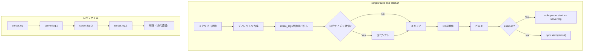

# Issue #403: サーバーログローテーション機能 - 設計方針書

## 1. 概要

### 目的
`scripts/build-and-start.sh`実行時（フォアグラウンド/デーモン両モード共通）に`logs/server.log`のローテーションを行い、長期運用でのディスク肥大化を防止する。

> **補足**: `server.log`への追記書き込み（`nohup npm start >> server.log 2>&1 &`）はデーモンモード（`--daemon`）でのみ行われる。フォアグラウンドモードではstdoutに出力されるため`server.log`への書き込みは発生しない。したがって、フォアグラウンドモードで`rotate_logs()`が実行されても、既存の`server.log`が閾値を超過していればローテーションが行われるのみであり、実害はない（空振りまたは過去のデーモン実行で蓄積されたログのローテーション）。呼び出し位置をデーモン分岐前（`mkdir -p`直後）に配置することで、実装をシンプルに保つ。

### スコープ
- **対象**: `logs/server.log`（`build-and-start.sh --daemon`経由の起動ログのみ）
- **対象外**: `data/logs/`配下のアプリケーションレベル会話ログ（`getLogDir()`管理）、`security.log`、CLIデーモン起動（`stdio: 'ignore'`）

### 背景
- 現在ログローテーション機能なし、`nohup npm start >> "$LOG_FILE" 2>&1 &`で無制限追記
- 実測46MB/182,000行に達し、ディスクI/O影響が懸念

## 2. アーキテクチャ設計

### システム構成



> **注記（SF-2）**: Issue #403受入条件3は「`scripts/build-and-start.sh --daemon`でのサーバー起動時にログローテーションが実行されること」と`--daemon`モードのみ明記しているが、`rotate_logs()`はデーモン分岐前（`mkdir -p`直後）に配置されるため、フォアグラウンドモードでも実行される。フォアグラウンドモードでは`server.log`への追記は行われないため、実行されても実害はない（空振りまたは過去のデーモン実行で蓄積されたログのローテーション）。設計方針書としては「フォアグラウンド/デーモン両モード共通」が正しい仕様であり、受入条件はデーモンモードでの主要ユースケースのみを記載したものと解釈する（セクション1補足参照）。

### 実行タイミング

```
build-and-start.sh 起動（フォアグラウンド/デーモン両モード共通）
  ├── mkdir -p logs/
  ├── rotate_logs() || WARNING  ← 新規追加（nohup実行前、失敗時は警告のみで続行）
  │   ├── ファイル存在チェック
  │   ├── サイズチェック（wc -c）
  │   ├── 世代シフト（.3削除 → .2→.3 → .1→.2 → current→.1）
  │   └── 完了ログ出力
  ├── npm run db:init
  ├── npm run build:all
  └── [デーモン] nohup npm start >> server.log 2>&1 &
      [フォアグラウンド] npm start（stdout出力、server.logへの書き込みなし）
```

### 影響を受けるファイル

| ファイル | 変更種類 | 内容 |
|---------|---------|------|
| `scripts/build-and-start.sh` | 修正 | `rotate_logs()`関数追加、起動前呼び出し |
| `docs/en/internal/PRODUCTION_CHECKLIST.md` | 修正 | Log rotation項目に説明追加 |
| `docs/internal/PRODUCTION_CHECKLIST.md` | 修正 | Log rotation項目に説明追加（日本語版） |

### 影響を受けないファイル（確認済み）

| ファイル | 理由 |
|---------|------|
| `scripts/stop-server.sh` | ログファイル名変更なし、停止処理に影響なし |
| `scripts/restart.sh` | PM2存在時は`pm2 restart`、PM2非存在時は`./scripts/stop.sh` + `./scripts/start.sh`経路（`start.sh`はPM2存在時`pm2 start`、非存在時`npm start`直接実行）。いずれの経路も`build-and-start.sh`を呼び出さないため影響なし |
| `scripts/logs.sh` | PM2/systemd専用、`server.log`非参照（既存課題、スコープ外） |
| `src/cli/utils/daemon.ts` | `stdio: 'ignore'`で`server.log`未使用 |
| `src/config/log-config.ts` | `data/logs/`管理、`logs/server.log`とは無関係 |
| `src/lib/log-manager.ts` | 会話ログ管理、`server.log`とは無関係 |
| `.claude/skills/rebuild/SKILL.md` | `./scripts/stop.sh && ./scripts/build-and-start.sh --daemon`を呼び出すが、`build-and-start.sh`の呼び出しインターフェースに変更なし。rebuild実行時にもローテーションが実行されるが、これはローテーション機能の意図された動作であり実害なし（stop.sh直後のserver.logが閾値を超過していればローテーションされる） |
| `.gitignore` | `logs/`ディレクトリは既に除外済み |

## 3. 技術選定

| カテゴリ | 選定技術 | 選定理由 |
|---------|---------|---------|
| 実装言語 | Bash | 対象が`build-and-start.sh`内のため、外部依存なし |
| サイズ検出 | `wc -c` | POSIX準拠、macOS/Linux互換（`stat`は非互換） |
| ファイル操作 | `mv`/`rm` | POSIX標準コマンド、追加依存なし |
| 設定管理 | シェル変数（定数） | シンプル、初期実装に適合 |

### 代替案との比較

| 方式 | メリット | デメリット | 採否 |
|------|---------|----------|------|
| **Bash関数（採用）** | シンプル、外部依存なし、対象スコープに適合 | テスト自動化困難 | ✅ 採用 |
| TypeScript実装 | Vitest対応、型安全 | サーバー起動前の実行が複雑化 | ❌ 不採用 |
| logrotate（OS機能） | 高機能、業界標準 | OS依存、追加設定必要、Docker環境非対応 | ❌ 不採用 |
| pm2-logrotate | PM2統合 | PM2非使用の起動経路に非対応 | ❌ 不採用 |

## 4. 詳細設計

### 4-1. 定数定義

```bash
# scripts/build-and-start.sh 先頭部に追加
MAX_LOG_SIZE_MB=10           # ローテーション閾値（MB）
MAX_LOG_GENERATIONS=3        # 保持世代数
```

### 4-2. rotate_logs()関数

#### エラー処理方針（set -e環境下）

`build-and-start.sh`はスクリプト先頭で`set -e`を宣言している（L12）。`rotate_logs()`内の`mv`/`rm`コマンドが失敗した場合（例: ディスク容量不足、パーミッション不足）、`set -e`によりスクリプト全体が即座に終了し、サーバーが起動できなくなる。

**設計判断**: ログローテーションの失敗はサーバー起動を阻害すべきではない。ローテーションは運用利便性のための機能であり、失敗時は警告を出力してスキップし、サーバー起動を継続する。

**実装方針**: `rotate_logs()`呼び出し側で`|| true`パターンを使用し、関数内部の失敗がスクリプト全体を終了させないようにする。

```bash
# 呼び出し側（セクション4-3参照）
rotate_logs || echo "WARNING: Log rotation failed, continuing with server startup" >&2
```

これにより、`rotate_logs()`関数内部は正常系のロジックに集中でき、`set -e`環境下でも安全にサーバー起動が継続される。

#### 関数実装

```bash
# Log rotation function
# Rotates server.log when file size exceeds MAX_LOG_SIZE_MB.
# Uses rename strategy (safe because rotation runs before nohup).
# Generation shift: .3 deleted → .2→.3 → .1→.2 → current→.1
#
# Error handling: This function is called with a failure-safe pattern (see section 4-3).
# If any command fails (mv, rm, wc), the function exits with non-zero status,
# the caller catches it with "|| echo WARNING... >&2", and server startup continues.
rotate_logs() {
    # Skip if log file doesn't exist
    if [ ! -f "$LOG_FILE" ]; then
        return 0
    fi

    # [S4-006] Symlink guard: prevent symlink attacks by refusing to rotate symbolic links
    if [ -L "$LOG_FILE" ]; then
        echo "WARNING: Log file is a symbolic link, skipping rotation" >&2
        return 1
    fi

    # Get file size in bytes (POSIX-compliant)
    local file_size_bytes
    file_size_bytes=$(wc -c < "$LOG_FILE")
    local max_size_bytes=$((MAX_LOG_SIZE_MB * 1024 * 1024))

    # Skip if under threshold
    if [ "$file_size_bytes" -lt "$max_size_bytes" ]; then
        return 0
    fi

    echo "=== Rotating log file ($(( file_size_bytes / 1024 / 1024 ))MB > ${MAX_LOG_SIZE_MB}MB) ==="

    # Delete oldest generation
    if [ -f "${LOG_FILE}.${MAX_LOG_GENERATIONS}" ]; then
        # [S4-006] Symlink guard for oldest generation file
        if [ -L "${LOG_FILE}.${MAX_LOG_GENERATIONS}" ]; then
            echo "WARNING: ${LOG_FILE}.${MAX_LOG_GENERATIONS} is a symbolic link, skipping rotation" >&2
            return 1
        fi
        rm -f "${LOG_FILE}.${MAX_LOG_GENERATIONS}"
    fi

    # Shift generations (N-1 → N, N-2 → N-1, ..., 1 → 2)
    local i=$((MAX_LOG_GENERATIONS - 1))
    while [ "$i" -ge 1 ]; do
        if [ -f "${LOG_FILE}.${i}" ]; then
            # [S4-006] Symlink guard for each generation file
            if [ -L "${LOG_FILE}.${i}" ]; then
                echo "WARNING: ${LOG_FILE}.${i} is a symbolic link, skipping rotation" >&2
                return 1
            fi
            mv "${LOG_FILE}.${i}" "${LOG_FILE}.$((i + 1))"
        fi
        i=$((i - 1))
    done

    # Move current to .1
    mv "$LOG_FILE" "${LOG_FILE}.1"

    echo "✓ Log rotated: ${LOG_FILE} → ${LOG_FILE}.1"
}
```

### 4-3. 呼び出し位置

```bash
# build-and-start.sh 内、mkdir -p の後、db:init の前（L63-68間に挿入）
# デーモン分岐（L73）より前に配置 → フォアグラウンド/デーモン両モードで実行される
mkdir -p "$LOG_DIR"
mkdir -p "$DATA_DIR"
chmod 755 "$DATA_DIR"

# Rotate log file if needed (before server starts)
# || pattern ensures rotation failure does not prevent server startup (see section 4-2)
rotate_logs || echo "WARNING: Log rotation failed, continuing with server startup" >&2

# Initialize database
echo "=== Initializing database ==="
```

> **設計根拠**: `rotate_logs()`をデーモン分岐内ではなく、デーモン分岐前（`mkdir -p`直後）に配置する。フォアグラウンドモードでは`server.log`への追記は行われないため、ローテーションが実行されても空振りするか、過去のデーモン実行で蓄積されたログがローテーションされるのみで実害がない。分岐内に入れないことで実装をシンプルに保つ（セクション1「概要」の補足も参照）。

### 4-4. ローテーション動作フロー

```
初期状態: server.log (15MB), server.log.1, server.log.2, server.log.3

Step 1: サイズチェック → 15MB > 10MB → ローテーション実行
Step 2: server.log.3 を削除
Step 3: server.log.2 → server.log.3 にリネーム
Step 4: server.log.1 → server.log.2 にリネーム
Step 5: server.log → server.log.1 にリネーム

結果: server.log.1 (旧current), server.log.2 (旧.1), server.log.3 (旧.2)
      server.log は nohup により新規作成される

注記: Step 5（mv）完了からnohup実行（>> server.log）までの間、server.logは
      存在しない期間がある。この間にdb:init、build:allが実行される。
      デーモンモードではnohupの >> リダイレクトにより自動的に新規作成される。
      フォアグラウンドモードではserver.logは作成されない（stdout出力のため）。
      いずれの場合もサーバー動作に影響はない。
```

## 5. セキュリティ設計

### リスク分析

| リスク | 対策 | 重要度 |
|--------|------|--------|
| ファイルパスインジェクション | `LOG_FILE`はスクリプト内定数、外部入力なし | 低（対策済み） |
| シンボリックリンク攻撃 | `rotate_logs()`内でファイル操作前に`[ -L "$LOG_FILE" ]`チェックを実施し、シンボリックリンクの場合は警告出力してスキップ（`return 1`）。世代シフト対象ファイルも同様にチェック。`[S4-006]` | 低（対策が必要） |
| TOCTOU（チェック-使用間競合） | サーバー起動前実行のためサーバープロセスとの競合はないが、シンボリックリンクチェック（`[ -L ]`）とファイル操作（`mv`/`rm`）の間にファイルが置き換えられる理論上の時間窓が存在する。ただし本プロジェクトの運用コンテキスト（単一ユーザー向け開発ツール）ではマルチユーザー並行操作リスクは現実的に極めて低く、SF-1のシンボリックリンクチェックで実用的に緩和される | 低（SF-1のシンボリックリンクチェックで実用的緩和） |
| ローテーション失敗によるサーバー起動阻害 | `rotate_logs \|\| echo WARNING`パターンで失敗時も起動継続（`set -e`下でも安全） | 対策済み |
| ディスク枯渇 | 世代数制限（3世代）で最大約40MB | 対策済み |

### ファイルパーミッション

- `rotate_logs()`はスクリプト実行ユーザーの権限で動作
- `mv`/`rm`は所有権を変更しない
- 新規`server.log`は`nohup`によりスクリプト実行ユーザー所有で作成
- **`[S4-005]` 新規`server.log`のパーミッション制御**: `nohup`によるリダイレクト（`>> "$LOG_FILE"`）で新規作成されるファイルのパーミッションはumask依存であり、デフォルトumask 022の場合644（`rw-r--r--`）となる。`server.log`にはサーバー実行時のエラー情報、パス情報、環境情報など機密性のある情報が含まれる可能性があるため、既存の`[S4-003]`（`server.pid`の`chmod 600`）パターンとの整合性を確保し、`nohup`実行直後に`chmod 640 "$LOG_FILE" 2>/dev/null || true`を適用する。これによりグループ読み取りは許可しつつ、その他ユーザーからの読み取りを制限する
  ```bash
  # デーモンモード起動部分（既存のnohup行の直後に追加）
  nohup npm start >> "$LOG_FILE" 2>&1 &
  SERVER_PID=$!
  chmod 640 "$LOG_FILE" 2>/dev/null || true  # [S4-005] ログファイルのパーミッション制御
  ```

## 6. パフォーマンス設計

### 実行コスト

| 操作 | コスト | 頻度 |
|------|--------|------|
| `wc -c` | O(1)（ファイルサイズ読取のみ） | 毎回起動時 |
| `mv`（リネーム） | O(1)（同一ファイルシステム） | 閾値超過時のみ |
| `rm` | O(1) | 最古世代存在時のみ |

- サーバー起動時の1回のみ実行（日次実行なし）
- 最悪ケース: `wc -c` + `rm` + 3回`mv` ≈ 数ミリ秒

### ディスク使用量

- 最大ディスク使用量: `MAX_LOG_SIZE_MB × (MAX_LOG_GENERATIONS + 1)` = 10MB × 4 = 40MB
- 閾値超過直前の最大: ≈ 50MB（currentが10MB未満 + 3世代各10MB以下）

## 7. 設計上の決定事項とトレードオフ

| 決定事項 | 理由 | トレードオフ |
|---------|------|-------------|
| Bash実装 | 対象がシェルスクリプト内、外部依存なし | テスト自動化困難 |
| サーバー起動時のみ | シンプル、TOCTOU問題なし | 長期稼働中のログ肥大化は防げない |
| rename方式 | サーバー起動前なので安全 | copytruncateに比べ柔軟性が低い |
| `wc -c`使用 | POSIX準拠、macOS/Linux互換 | `stat`より微妙に遅い（無視できるレベル） |
| 環境変数オーバーライドなし | YAGNI原則、初期実装のシンプルさ | 設定変更時はスクリプト直接編集が必要 |
| `rotate_logs \|\| WARNING`パターン | `set -e`環境下でもローテーション失敗がサーバー起動を阻害しない | ローテーション失敗が静かにスキップされる可能性 |
| デーモン分岐前に配置 | 実装シンプル、フォアグラウンドでも過去ログのローテーションが可能 | フォアグラウンドモードでの不要な実行（ただし実害なし） |
| 圧縮なし | シンプルさ優先、KISS原則 | 古い世代のディスク使用量最適化なし |

## 8. テスト方針

### 手動テスト（主要）

Issueの「テスト手順」セクションに準拠。Vitest（TypeScript）はシェルスクリプトのテストに不適のため、手動テストで検証。

| テスト | 内容 | 期待結果 |
|--------|------|---------|
| 基本動作 | 15MB `server.log`作成→起動 | `.1`に移動、新`server.log`作成 |
| 世代管理 | `.1`〜`.3`手動作成→15MB `server.log`→起動 | `.3`削除、各世代シフト |
| ファイルなし | `server.log`なしで起動 | スキップ、正常起動 |
| 閾値未満 | 5MB `server.log`で起動 | スキップ、正常起動 |
| ディレクトリなし | `logs/`なしで起動 | ディレクトリ作成、正常起動 |

## 9. PRODUCTION_CHECKLIST更新方針

### 英語版 (`docs/en/internal/PRODUCTION_CHECKLIST.md`)

L164付近のLog rotation項目を更新:
```markdown
- [x] Log rotation is configured (built-in: `scripts/build-and-start.sh` rotates `logs/server.log` at startup when size exceeds 10MB, keeping 3 generations)
```

### 日本語版 (`docs/internal/PRODUCTION_CHECKLIST.md`)

L164付近のLog rotation項目を更新:
```markdown
- [x] ログのローテーション設定がされている（ビルトイン: `scripts/build-and-start.sh`が起動時に`logs/server.log`のサイズが10MBを超えた場合にローテーション実行、3世代保持）
```

## 10. 将来の拡張ポイント

以下は本Issueのスコープ外とし、必要に応じて別Issueで対応:

1. **日次ローテーション**: cron等による定期実行
2. **環境変数オーバーライド**: `CM_LOG_MAX_SIZE_MB`、`CM_LOG_MAX_GENERATIONS`
3. **圧縮**: `.gz`形式での古い世代の圧縮
4. **`logs.sh`対応**: `server.log`のローテーション済みファイル（`server.log.1`、`server.log.2`、`server.log.3`）の一覧・表示サポートを追加すること。現状`logs.sh`はPM2/systemd専用であり、`build-and-start.sh --daemon`で運用するユーザーがローテーション済みの過去ログを参照する手段が提供されていない
5. **CLIデーモン起動のログ出力**: `stdio: 'ignore'`から`server.log`への出力対応
6. **`security.log`のローテーション**: セキュリティログの肥大化対策

## 11. Stage 1 レビュー指摘事項サマリー

Stage 1（設計原則レビュー）で検出された指摘事項と対応状況。

### 反映済み（should_fix: 3件）

| ID | カテゴリ | 指摘内容 | 対応内容 |
|----|---------|---------|---------|
| SF-1 | 完全性 | 概要（セクション1）の「--daemon起動時」とセクション4-3の呼び出し位置（デーモン分岐前）が矛盾 | セクション1の概要を「フォアグラウンド/デーモン両モード共通」に修正し、フォアグラウンドモードでの空振り動作について補足説明を追記。セクション4-3に設計根拠を追記。実行タイミング図も両モード表記に更新 |
| SF-2 | エラー処理 | `set -e`環境下で`rotate_logs()`内の`mv`失敗時にサーバー起動が阻害される | セクション4-2にエラー処理方針を追加。`rotate_logs \|\| echo WARNING`パターンにより失敗時も起動継続する設計を明記。セクション5リスク分析、セクション7トレードオフにも反映 |
| SF-3 | 完全性 | `restart.sh`の影響分析が不正確（「PM2使用」と単純化していたが実際はPM2非存在時に`stop.sh`+`start.sh`経路） | セクション2の影響を受けないファイル表のrestart.sh説明を実コードに基づき修正。PM2存在/非存在の両経路を正確に記載 |

### 参考（nice_to_have: 5件、本Issueでは対応しない）

- 定数の環境変数オーバーライドパターン（`${CM_LOG_MAX_SIZE_MB:-10}`）: セクション10で将来拡張として記載済み
- `wc -c`のO(1)記載の正確性: 実用上問題なし
- `logs.sh`のローテーション済みファイル対応: セクション10の拡張ポイント4でカバー
- 手動テストの具体的な事前準備コマンド例: Issue本体のテスト手順に記載
- PRODUCTION_CHECKLISTのチェックボックス状態: 運用方針に依存、実装時に判断

## 12. 実装チェックリスト

Stage 1レビュー反映後の実装チェックリスト。

- [ ] `scripts/build-and-start.sh`に`MAX_LOG_SIZE_MB=10`、`MAX_LOG_GENERATIONS=3`定数を追加（セクション4-1）
- [ ] `scripts/build-and-start.sh`に`rotate_logs()`関数を追加（セクション4-2）
- [ ] `rotate_logs()`呼び出しを`mkdir -p`直後、`db:init`前に配置（セクション4-3）
- [ ] 呼び出し時に`rotate_logs || echo "WARNING: ..." >&2`パターンを使用（SF-2対応）
- [ ] `docs/en/internal/PRODUCTION_CHECKLIST.md`のLog rotation項目を更新（セクション9）
- [ ] `docs/internal/PRODUCTION_CHECKLIST.md`のLog rotation項目を更新（セクション9）
- [ ] 手動テスト: 基本動作（閾値超過時のローテーション）
- [ ] 手動テスト: 世代管理（最古世代の削除とシフト）
- [ ] 手動テスト: ファイルなし/閾値未満のスキップ動作
- [ ] 手動テスト: フォアグラウンドモードでの正常動作
- [ ] `rotate_logs()`内にシンボリックリンクチェック（`[ -L "$LOG_FILE" ]`）を実装（`[S4-006]`、SF-1対応）
- [ ] 世代シフト対象ファイルにもシンボリックリンクチェックを実装（`[S4-006]`、SF-1対応）
- [ ] `nohup`実行直後に`chmod 640 "$LOG_FILE" 2>/dev/null || true`を追加（`[S4-005]`、SF-2対応）

## 13. Stage 2 レビュー指摘事項サマリー

Stage 2（整合性レビュー）で検出された指摘事項と対応状況。

### 反映済み（should_fix: 3件）

| ID | カテゴリ | 指摘内容 | 対応内容 |
|----|---------|---------|---------|
| SF-1 | セクション間の整合性 | セクション2のmermaidダイアグラムがデーモンモード経路のみを表示し、フォアグラウンドモード経路が欠落。本文の「両モード共通」記述と矛盾 | mermaidダイアグラムのビルド後に`daemon?`分岐ノードを追加。Yes経路で`nohup npm start >> server.log`、No経路で`npm start (stdout)`を表示し、実行タイミングのテキスト説明と整合させた |
| SF-2 | Issue本文との整合性 | Issue受入条件3が`--daemon`モードのみ明記しているが、設計方針書では「両モード共通」と記述しており乖離がある | セクション2の実行タイミング直前に注記を追加。受入条件はデーモンモードの主要ユースケースを記載したものと解釈し、設計方針書の「両モード共通」が正しい仕様であることを明記（セクション1補足への参照付き） |
| SF-3 | 定数・変数名の整合性 | セクション4-2の関数コメント内に`"|| true" pattern`と記載されているが、セクション4-3の実際の呼び出しは`|| echo "WARNING: ..." >&2`であり不一致 | セクション4-2の関数コメントを`"a failure-safe pattern (see section 4-3)"`に修正し、具体的なパターン表記を抽象化。`"|| echo WARNING..."` → `"|| echo WARNING... >&2"`に修正して実際の呼び出しコードと一致させた |

### 参考（nice_to_have: 5件、本Issueでは対応しない）

- セクション6の最悪ケースmv回数の内訳明記: 記載は正確（合計3回）であり、読み手の誤解リスクは軽微
- セクション9のPRODUCTION_CHECKLIST行番号参照のずれリスク: 将来変更時に必要に応じて対応
- セクション12のチェックリストで「ディレクトリなし」テストの個別項目化: 既存の「ファイルなし/閾値未満のスキップ動作」項目でカバー
- Issue本文とPRODUCTION_CHECKLIST更新対象範囲の差異（英語版のみ vs 両方）: 些細な差異、実装時に両方更新する
- 成功/失敗ログフォーマットの非対称性: 既存スクリプトのスタイルに準拠しており対応不要

## 14. Stage 3 レビュー指摘事項サマリー

Stage 3（影響分析レビュー）で検出された指摘事項と対応状況。

### 反映済み（should_fix: 3件）

| ID | カテゴリ | 指摘内容 | 対応内容 |
|----|---------|---------|---------|
| SF-1 | rebuild SKILLへの影響 | `.claude/skills/rebuild/SKILL.md`が`build-and-start.sh --daemon`を呼び出すため、rebuild実行時にもローテーションが行われるが、この影響が設計方針書に未記載 | セクション2の「影響を受けないファイル」テーブルに`.claude/skills/rebuild/SKILL.md`を追加。rebuild実行時のローテーションは意図された動作であり実害なしと明記 |
| SF-2 | logs.shのローテーション後のユーザー体験 | セクション10の将来拡張ポイント4「logs.sh対応」の説明が抽象的で、ローテーション済みファイルへのアクセス手段の不足が不明確 | セクション10の拡張ポイント4を具体化。`server.log.1`等のローテーション済みファイルの一覧・表示サポート追加が必要であること、現状`build-and-start.sh --daemon`運用ユーザーに過去ログ参照手段がない点を明記 |
| SF-3 | ローテーション後のserver.log不在期間 | ローテーション実行（mv）からnohup実行（>> server.log）までの間にserver.logが存在しない期間があるが、設計方針書の記載では不明確 | セクション4-4のローテーション動作フローの「結果」に注記を追加。Step 5完了からnohup実行までの間（db:init、build:all実行中）にserver.logが存在しない期間がある旨を明記 |

### 参考（nice_to_have: 6件、本Issueでは対応しない）

- DEPLOYMENT.md（日英両版）への影響: build-and-start.shを参照しているが呼び出しインターフェースに変更なく影響なし
- setup.sh/setup-env.shへの間接影響: build-and-start.shを呼び出すが呼び出しインターフェース変更なし。初回は空振り、2回目以降はローテーション恩恵あり
- CI/CDパイプラインへの影響: ci-pr.yml/publish.ymlはbuild-and-start.shを呼び出さないため影響なし
- 既存テスト（Vitest/E2E）への影響: build-and-start.shおよびserver.logを参照するテストケースなし。影響ゼロ
- .gitignoreの確認: 設計方針書の記載は正確であることを確認済み
- restart.shの影響分析の正確性確認: Stage 1で修正済みの分析は正確であることを再確認済み

## 15. Stage 4 レビュー指摘事項サマリー

Stage 4（セキュリティレビュー）で検出された指摘事項と対応状況。

### 反映済み（should_fix: 3件）

| ID | カテゴリ | 指摘内容 | 対応内容 |
|----|---------|---------|---------|
| SF-1 | シンボリックリンク攻撃 | セクション5のリスク分析でシンボリックリンク攻撃の対策が`.gitignore`と所有者アクセスのみで不十分。`server.log`がシンボリックリンクに置き換えられた場合、`mv`により意図しないファイルがリネームされるリスク | セクション5のリスク分析テーブルを「低（対策が必要）」に変更し、`[S4-006]`タグ付きで`[ -L "$LOG_FILE" ]`チェックによるガード方針を明記。セクション4-2の`rotate_logs()`関数設計にシンボリックリンクチェックを追加（currentファイル+世代シフト対象ファイル全て）。セクション12の実装チェックリストにも追加 |
| SF-2 | ログファイルのパーミッション | `nohup`で新規作成される`server.log`のパーミッションがumask依存（デフォルト644）であり、機密情報を含む可能性があるログが他ユーザーから読み取り可能。既存の`[S4-003]`（`server.pid`の`chmod 600`）との不整合 | セクション5のファイルパーミッションに`[S4-005]`タグ付きで`chmod 640`適用方針を追記。`nohup`実行直後に`chmod 640 "$LOG_FILE" 2>/dev/null \|\| true`を適用する設計を明記。セクション12の実装チェックリストにも追加 |
| SF-3 | TOCTOU（レースコンディション） | TOCTOUリスクを「なし」と評価していたが、シンボリックリンクチェックとファイル操作の間に理論上の時間窓が存在する | セクション5のリスク分析テーブルを「低（SF-1のシンボリックリンクチェックで実用的緩和）」に変更。本プロジェクトの運用コンテキスト（単一ユーザー向け開発ツール）ではマルチユーザー並行操作リスクは現実的に極めて低い旨を明記 |

### 参考（nice_to_have: 5件、本Issueでは対応しない）

- `wc -c`出力のスペーストリム: Bashの算術展開は前後のスペースを許容するため実用上問題なし
- 長期稼働中のディスク消費攻撃: サーバー起動時のみの実行制約はセクション7に明記済み、日次ローテーション（セクション10拡張ポイント1）が緩和策
- ローテーション済みファイルのアクセス制御: `mv`はパーミッションを保持するため元ファイルと同等。個人開発ツールの運用コンテキストで追加制御は不要
- パストラバーサル: `SCRIPT_DIR`/`PROJECT_DIR`は`cd + pwd`パターンで正規化済み、外部入力なし
- シェルインジェクション: 全変数展開がダブルクォート内で行われ定数のみ使用。リスクなし

---

*Generated by design-policy command for Issue #403*
*Date: 2026-03-03*
*Stage 1 review applied: 2026-03-03*
*Stage 2 review applied: 2026-03-03*
*Stage 3 review applied: 2026-03-03*
*Stage 4 review applied: 2026-03-03*
