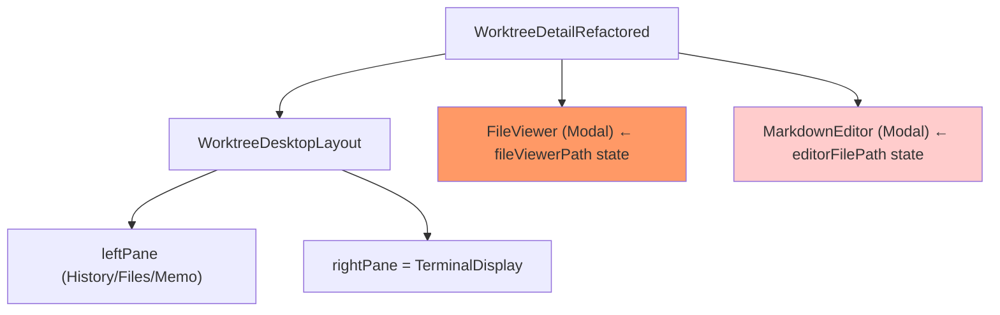
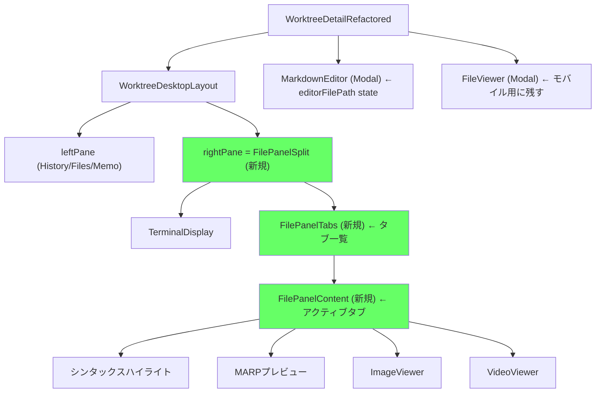

# 設計方針書: Issue #438 - PC版ファイル表示をポップアップからタブ付きサイドパネルに変更

## 1. 概要

### 目的
PC版のWorktree詳細画面で、ファイル選択時の表示方法をモーダルポップアップからTerminalペイン右側のタブ付きサイドパネルに変更する。

### スコープ
- **対象**: PC版（`useIsMobile() === false`）のファイル表示UI
- **新規コンポーネント**: `FilePanelSplit`, `FilePanelTabs`, `FilePanelContent`
- **新規フック**: `useFileTabs`
- **変更コンポーネント**: `WorktreeDetailRefactored`, `FileViewer`（モバイル用として維持）
- **非対象**: モバイル版（現行モーダル維持）、API変更、DB変更

### 設計原則
- **KISS**: `PaneResizer`等の既存コンポーネントを最大限再利用
- **DRY**: `WorktreeDesktopLayout`の2段階ネスト方式でコード重複を回避
- **SRP**: タブ管理（`FilePanelTabs`）とコンテンツ表示（`FilePanelContent`）を分離
- **最小影響範囲**: `WorktreeDesktopLayout`本体は無変更、`rightPane`の内容変更のみ

---

## 2. アーキテクチャ設計

### 現行構成



### 新構成（Issue #438）



### コンポーネント階層

```
WorktreeDetailRefactored
  ├── WorktreeDesktopLayout
  │   ├── leftPane: [HistoryPane | FileTreeView | NotesAndLogsPane]
  │   └── rightPane: FilePanelSplit (NEW)
  │       ├── TerminalDisplay (左側 - 既存)
  │       ├── PaneResizer (既存コンポーネント再利用)
  │       └── FilePanelTabs (右側 - NEW, タブ開いてる時のみ)
  │           ├── タブバー [file1.ts × | file2.json × | ...]
  │           └── FilePanelContent (アクティブタブ)
  │               ├── TextContent + シンタックスハイライト
  │               ├── MARPPreview (marp: true の .md)
  │               ├── ImageViewer
  │               └── VideoViewer
  ├── FileViewer (モバイル用モーダル - 変更最小限)
  └── MarkdownEditor (モーダル - 変更なし)
```

---

## 3. データモデル設計

### FileTab型定義

```typescript
// src/hooks/useFileTabs.ts

/** タブの状態を表す型 */
export interface FileTab {
  /** ファイルパス（タブの一意識別子） */
  path: string;
  /** タブに表示するファイル名 */
  name: string;
  /** ロード済みのコンテンツ（null = まだロードしていない） */
  content: FileContent | null;
  /** ロード中フラグ */
  loading: boolean;
  /** エラーメッセージ */
  error: string | null;
}

/** タブ管理の状態 */
export interface FileTabsState {
  /** タブ一覧（順序維持） */
  tabs: FileTab[];
  /** アクティブタブのインデックス（null = パネル非表示） */
  activeIndex: number | null;
}

/** 最大同時オープンタブ数 */
export const MAX_FILE_TABS = 5;
```

### useFileTabsフック (Reducer方式)

**責務**: 純粋な状態管理のみ（APIフェッチは行わない）

```typescript
// src/hooks/useFileTabs.ts

type FileTabsAction =
  | { type: 'OPEN_FILE'; path: string }        // ファイル開く（重複時はアクティブ化）
  | { type: 'CLOSE_TAB'; path: string }         // タブ閉じる
  | { type: 'ACTIVATE_TAB'; path: string }      // タブをアクティブに
  | { type: 'SET_CONTENT'; path: string; content: FileContent }  // コンテンツ設定
  | { type: 'SET_LOADING'; path: string; loading: boolean }      // ロード状態
  | { type: 'SET_ERROR'; path: string; error: string }           // エラー設定
  | { type: 'RENAME_FILE'; oldPath: string; newPath: string }    // リネーム
  | { type: 'DELETE_FILE'; path: string };       // ファイル削除（タブ自動クローズ）

export function useFileTabs(): {
  state: FileTabsState;
  dispatch: React.Dispatch<FileTabsAction>;
  openFile: (path: string) => 'opened' | 'activated' | 'limit_reached';
  closeTab: (path: string) => void;
  activateTab: (path: string) => void;
  onFileRenamed: (oldPath: string, newPath: string) => void;
  onFileDeleted: (path: string) => void;
}
```

**データフェッチ責務の分離**:
- `useFileTabs`は純粋な状態管理のみ（SRP原則）
- `FilePanelContent`の`useEffect`でAPIフェッチし、`dispatch(SET_CONTENT)` or `dispatch(SET_ERROR)`を呼ぶ
- フェッチ開始条件: `tab.content === null && !tab.loading && !tab.error`

---

## 4. コンポーネント設計

### 4.1 FilePanelSplit

**責務**: TerminalとFilePanelTabs の水平分割を管理する

```typescript
// src/components/worktree/FilePanelSplit.tsx

interface FilePanelSplitProps {
  /** Terminal表示コンテンツ */
  terminal: ReactNode;
  /** ファイルタブ状態（nullまたはtabs=[]のとき非表示） */
  fileTabs: FileTabsState;
  /** タブを閉じるコールバック */
  onCloseTab: (path: string) => void;
  /** タブをアクティブ化するコールバック */
  onActivateTab: (path: string) => void;
  /** .mdファイル編集ボタンのコールバック */
  onEditMarkdown: (path: string) => void;
  /** worktreeId（FilePanelContentに渡す） */
  worktreeId: string;
}
```

**動作**:
- `fileTabs.tabs.length === 0` のとき: Terminalのみ表示（フル幅）
- `fileTabs.tabs.length > 0` のとき: PaneResizerで分割表示

**初期幅**: Terminal 50% / FilePanel 50%
**最小幅**: 各200px（`PaneResizer`でのclamping）
**最大幅**: FilePanel 80%

### 4.2 FilePanelTabs

**責務**: タブバーの表示とタブ切り替えUI

```typescript
// src/components/worktree/FilePanelTabs.tsx

interface FilePanelTabsProps {
  tabs: FileTab[];
  activeIndex: number | null;
  worktreeId: string;
  onClose: (path: string) => void;
  onActivate: (path: string) => void;
  onEditMarkdown: (path: string) => void;
}
```

**UI仕様**:
- タブバー（上部固定）: `[file1.ts ×] [file2.json ×] ...`
- アクティブタブ: `border-b-2 border-cyan-500` でハイライト
- 閉じるボタン: `×` アイコン（`lucide-react: X`）
- 5タブ上限時の警告: `Toast`コンポーネントで表示（既存パターン踏襲）

### 4.3 FilePanelContent

**責務**: 選択ファイルのコンテンツ表示（シンタックスハイライト、MARP、画像、動画）

```typescript
// src/components/worktree/FilePanelContent.tsx

interface FilePanelContentProps {
  tab: FileTab;
  worktreeId: string;
  /** コンテンツ取得成功時のコールバック（useFileTabs dispatchをラップ） */
  onLoadContent: (path: string, content: FileContent) => void;
  /** コンテンツ取得エラー時のコールバック */
  onLoadError: (path: string, error: string) => void;
  /** ローディング状態変更コールバック */
  onSetLoading: (path: string, loading: boolean) => void;
  /** .mdファイル編集ボタン用コールバック */
  onEditMarkdown?: (path: string) => void;
}
```

**データフェッチ（useEffect内）**:
```typescript
useEffect(() => {
  if (tab.content !== null || tab.loading || tab.error) return;
  // フェッチ開始: content=null && !loading && !error のとき
  onSetLoading(tab.path, true);
  fetch(`/api/worktrees/${worktreeId}/files/${tab.path}`)
    .then(res => res.json())
    .then(data => onLoadContent(tab.path, data))
    .catch(err => onLoadError(tab.path, err.message))
    .finally(() => onSetLoading(tab.path, false));
}, [tab.path, tab.content, tab.loading, tab.error, worktreeId, onLoadContent, onLoadError, onSetLoading]);
```

**コンテンツ分岐**:
1. **ロード中**: スピナー
2. **エラー**: エラーメッセージ
3. **MARP Markdown** (`isMd && hasMarpFrontmatter`): `MarpPreview`コンポーネント
4. **通常 Markdown** (`.md`, MARPでない): テキスト + rehype-highlight + 「編集」ボタン
5. **画像**: 既存`ImageViewer`コンポーネント
6. **動画**: 既存`VideoViewer`コンポーネント
7. **テキスト**: シンタックスハイライト付きコードブロック

**シンタックスハイライト**:
- `highlight.js`の`highlightAuto()`を直接呼び出してハイライト済みHTMLを取得
- `dangerouslySetInnerHTML`でHTMLを設定（highlight.jsはHTMLエスケープ済みHTMLを返すため安全）
- `highlight.js/styles/github-dark.css`は`MarkdownEditor`で既に動的インポート済み
- 対応言語: Python (.py), JSON (.json), JavaScript (.js), TypeScript (.ts/.tsx), CSS (.css), HTML (.html/.htm)

### 4.4 MarpPreview（FilePanelContent内）

**責務**: MARP形式Markdownをスライドとしてレンダリング

**実装方針（サーバーサイドレンダリング方式）**:

`@marp-team/marp-core`はNode.js向けに最適化されており、Next.jsクライアントコンポーネントでの直接利用はSSRの問題やバンドルサイズの問題がある。そのため、**API Route経由でサーバーサイドMARPレンダリング**を採用する。

```
API Route: POST /api/worktrees/[id]/marp-render
  - リクエスト: { markdownContent: string }
  - レスポンス: { slides: string[] }  // スライドごとのHTML配列
  - サーバーサイドで @marp-team/marp-core を使用してHTML生成
```

```typescript
// FilePanelContent.tsx 内の関数コンポーネント

function MarpPreview({ tab, worktreeId }: { tab: FileTab; worktreeId: string }) {
  // 1. APIからスライドHTMLを取得
  // 2. iframeで表示（XSS対策: sandbox="allow-same-origin"）
  // 3. ページ送り/戻しのためにslideを分割してstateで管理
}
```

**XSS対策**:
```tsx
<iframe
  srcDoc={slideHtml}
  sandbox="allow-same-origin"  // スクリプト実行禁止
  title={`MARP slide ${currentSlide + 1}`}
/>
```

**ページ管理**: `useState<number>` でページインデックス管理

---

## 5. 技術選定

| カテゴリ | 選定技術 | 選定理由 |
|---------|---------|---------|
| タブ状態管理 | `useReducer` | 複数アクション型、testability |
| ドラッグリサイズ | 既存`PaneResizer` | 追加ライブラリ不要、既存実装再利用 |
| MARPレンダリング | `@marp-team/marp-core`（サーバーサイド） | Node.js向けAPI Route経由でSSR問題回避、バンドルサイズ最小化 |
| シンタックスハイライト | `highlight.js` の直接呼び出し | `highlight.js`は既存依存、`highlightAuto()`でサニタイズ済みHTMLを取得 |
| コンポーネントメモ化 | `React.memo` + `useMemo` | Issue #411パターン踏襲 |

---

## 6. セキュリティ設計

### S1: XSS対策（MARP）
- `iframe sandbox="allow-same-origin"` でスクリプト実行を完全禁止
- MARPの出力HTMLをそのまま`innerHTML`に渡すことは禁止（iframeのみ）
- `srcDoc`でHTMLを渡す方式を採用

### S2: ファイルパス検証
- `useFileTabs`の`openFile`では、パスはAPIレスポンス（サーバーサイドで検証済み）から来るため追加検証不要
- ファイルコンテンツ取得: 既存の`/api/worktrees/${worktreeId}/files/${filePath}` APIを使用

### S3: CSP整合性
- MARPのiframeは`allow-same-origin`のみ（same-originスクリプトのみ許可）
- 実装時に`@marp-team/marp-core`の出力HTMLにインラインスクリプトが含まれないことを検証
- 検証結果によっては`sandbox=""`（完全制限）に変更する（スタイル崩れの可能性あり）

### S4: marp-render API DoS防御
- `MAX_MARP_CONTENT_LENGTH = 1 * 1024 * 1024`（1MB）でMarkdownコンテンツをサイズ制限
- リクエストボディバリデーション: `markdownContent`が文字列かつ制限内であることを確認
- 固定文字列エラーレスポンス（D1-007パターン踏襲）

### S5: dangerouslySetInnerHTMLの安全性根拠（highlight.js）
- `highlight.js`の`highlightAuto(str).value`はHTMLエンティティエスケープ済みの文字列を返す（公式仕様）
- XSSリスクなし（ユーザー入力の`<script>`等はエンティティ変換される）
- 実装時にコードコメントで根拠を明記すること

---

## 7. パフォーマンス設計

### P1: rightPaneMemoの依存最小化
- `useFileTabs`フックをuseReducerで実装し、`state`（FileTabsState）と`dispatch`（安定参照）を返す
- `FilePanelContent`に渡す`onLoadContent`/`onLoadError`/`onSetLoading`は`useCallback`でメモ化し安定参照を確保
- `rightPaneMemo`の依存配列: `[state.terminal.*, fileTabsState, handleCloseTab, handleActivateTab, handleEditMarkdown, handleLoadContent, handleLoadError, handleSetLoading, worktreeId]`
- タブ状態変更時のみ`rightPaneMemo`が再計算される

### P2: FilePanelContent のコンテンツキャッシュ
- タブを切り替えても、一度ロードしたコンテンツは`FileTab.content`に保持（再フェッチしない）
- タブを閉じた時にコンテンツをクリア

### P3: React.memoの適用
- `FilePanelTabs`, `FilePanelContent`, `FilePanelSplit`: `memo()`ラップ
- `MarpPreview`: `memo()`ラップ（スライドHTMLが変わらない限り再レンダー不要）

---

## 8. 影響ファイルと変更内容

### 新規ファイル

| ファイル | 概要 |
|--------|------|
| `src/components/worktree/FilePanelSplit.tsx` | TerminalとFilePanelの水平分割コンポーネント |
| `src/app/api/worktrees/[id]/marp-render/route.ts` | MARP HTMLレンダリングAPI Route（サーバーサイド） |
| `src/components/worktree/FilePanelTabs.tsx` | タブバー + コンテンツ管理コンポーネント |
| `src/components/worktree/FilePanelContent.tsx` | ファイルコンテンツ表示（シンタックスハイライト・MARP・画像・動画） |
| `src/hooks/useFileTabs.ts` | タブ状態管理フック（useReducer）|
| `tests/unit/hooks/useFileTabs.test.ts` | useFileTabsフックのユニットテスト |
| `tests/unit/components/FilePanelSplit.test.tsx` | FilePanelSplitのユニットテスト |
| `tests/unit/components/FilePanelTabs.test.tsx` | FilePanelTabsのユニットテスト |
| `tests/unit/components/FilePanelContent.test.tsx` | FilePanelContentのユニットテスト |
| `tests/unit/api/marp-render.test.ts` | MARPレンダリングAPIのユニットテスト |

### 変更ファイル

| ファイル | 変更内容 |
|--------|---------|
| `src/components/worktree/WorktreeDetailRefactored.tsx` | `fileViewerPath`をuseFileTabs管理に移行、`rightPaneMemo`を`FilePanelSplit`ラップに変更、`handleFileSelect`を`openFile`に置き換え、`handleDelete`/`handleRename`にuseFileTabs連携追加 |
| `src/components/worktree/FileViewer.tsx` | 変更最小限（モバイル用として残す、またはPCでは使用しない分岐追加） |
| `package.json` | `@marp-team/marp-core`を追加 |
| `tests/unit/components/WorktreeDetailRefactored.test.tsx` | FilePanelSplit/useFileTabsをモック化（`vi.mock('@/components/worktree/FilePanelSplit', ...)`/`vi.mock('@/hooks/useFileTabs', ...)`）、FileViewerモックは残す（モバイル版用） |
| `tests/unit/components/app-version-display.test.tsx` | FileViewerモック更新 |
| `tests/integration/issue-266-acceptance.test.tsx` | FileViewerモック更新 |

---

## 9. 設計上の決定事項とトレードオフ

### 決定1: 2段階ネスト方式（WorktreeDesktopLayout本体を変更しない）

| 項目 | 内容 |
|-----|-----|
| **採用** | `rightPane`の内容を`FilePanelSplit`に変更するのみ |
| **メリット** | `WorktreeDesktopLayout`のテスト・ロジック変更不要、影響範囲最小 |
| **デメリット** | 2段階のリサイズハンドラーが存在する（レイアウト上のスペースをわずかに消費） |
| **代替案** | `WorktreeDesktopLayout`を3ペイン対応に拡張 → 既存テスト・コードへの影響が大きく不採用 |

### 決定2: useReducerによるタブ状態管理

| 項目 | 内容 |
|-----|-----|
| **採用** | `useReducer` + action型（OPEN_FILE, CLOSE_TAB, etc.） |
| **メリット** | テスト容易（reducer関数を単体テスト可能）、`dispatch`参照が安定（useMemo依存配列の安定化） |
| **デメリット** | useState複数より若干ボイラープレートが多い |
| **代替案** | `useState`複数 → dispatch参照が不安定でuseMemoに影響するため不採用 |

### 決定3: FileViewerをモバイル用として残す

| 項目 | 内容 |
|-----|-----|
| **採用** | モバイルでは引き続きFileViewerモーダルを使用 |
| **メリット** | モバイルUXを変更しない、Issue要件に合致 |
| **デメリット** | 2系統のファイル表示コードが存在（FileViewer / FilePanelContent） |
| **代替案** | FileViewerを廃止してFilePanelContentをモーダルでラップ → リスクが大きく不採用 |

---

## 10. 実装順序

1. **useFileTabs フック** (TDD: テスト→実装)
2. **FilePanelContent コンポーネント** (TDD)
3. **FilePanelTabs コンポーネント** (TDD)
4. **FilePanelSplit コンポーネント** (TDD)
5. **WorktreeDetailRefactored の統合** (既存テスト更新)
6. **@marp-team/marp-core インストール + MarpPreview統合**
7. **既存テスト更新** (WorktreeDetailRefactored.test.tsx 等)
8. **最終受入テスト**

---

## 11. 関連Issue・設計書

- Issue #411: React.memo最適化（rightPaneMemoパターン参照）
- Issue #162: FileViewer既存実装
- Issue #302: VideoViewer
- `src/components/worktree/WorktreeDesktopLayout.tsx`: PaneResizer活用パターン
- `src/components/worktree/PaneResizer.tsx`: リサイズハンドラー実装

---

*Generated by design-policy command for Issue #438*
