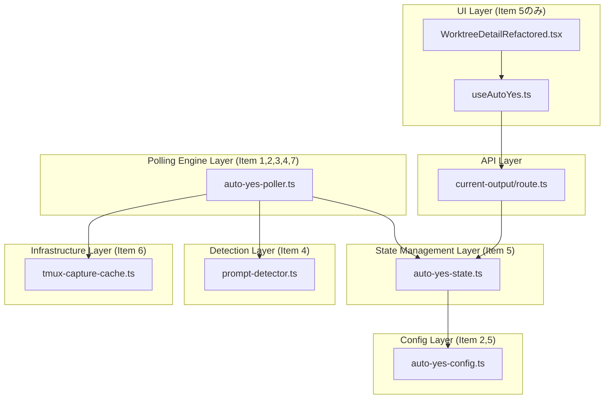
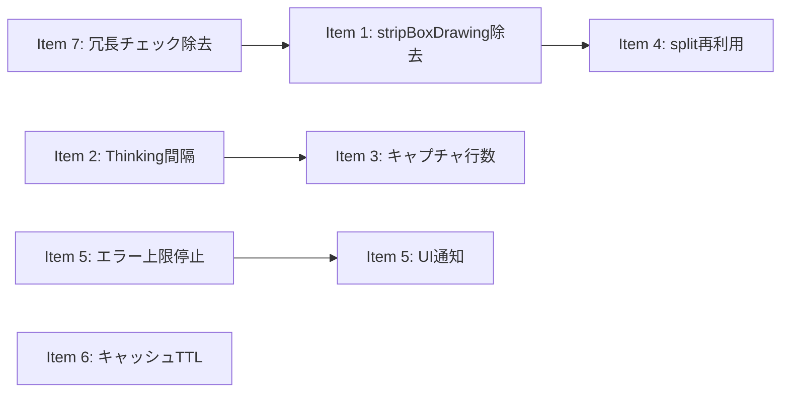

# 設計方針書: Issue #499 Auto-Yes ポーリング性能改善

## 1. 概要

### 目的
Auto-Yesポーリングループのホットパス上の無駄な処理を排除し、体感レスポンス向上と不要なリソース消費削減を実現する。

### スコープ
7項目の性能改善。変更は主にサーバーサイド（`src/lib/`）に集中し、UI変更はItem 5のstopReason通知のみ。

### 設計原則
- **KISS**: 各改善は最小限の変更で実現。過度な抽象化を避ける
- **YAGNI**: 現在必要な最適化のみ実施。将来の拡張を想定した過度な設計は行わない
- **SRP**: 既存のSRP設計（Issue #323で導入済み）を維持
- **後方互換性**: 既存API・インターフェースの破壊を最小限に

## 2. アーキテクチャ設計

### 変更影響のレイヤー図



### 既存ポーリングフロー（変更箇所マーキング）

```
pollAutoYes() [loop via setTimeout]
    ├─ validatePollingContext()          ← Item 7: 冗長チェック除去
    ├─ captureAndCleanOutput()          ← Item 3: 行数削減(5000→300)
    │   └─ stripBoxDrawing() [1回目]    ← Item 1: ここでのみ呼ぶ
    ├─ Thinking検出                     ← Item 2: 延長間隔(5s)
    │   └─ cleanOutput.split('\n')      ← Item 4: 事前split結果を再利用
    ├─ processStopConditionDelta()
    └─ detectAndRespondToPrompt()
        ├─ stripBoxDrawing() [2回目]    ← Item 1: この呼び出しを除去
        └─ detectPrompt()              ← Item 4: precomputedLines渡し
            └─ output.split('\n')      ← Item 4: precomputedLinesがあればスキップ
    └─ scheduleNextPoll()               ← [IC-007] 実際にはL407,L420,L432の3箇所から呼び出し
        └─ pollerState.currentInterval  ← Item 2: Thinking時は5s
```

**pollerState参照方式に関する注記 [IC-006]**:
- `detectAndRespondToPrompt`は`pollerState`を引数で受け取る方式
- `incrementErrorCount`は`worktreeId`のみ受け取り、内部で`getPollerState(worktreeId)`を呼ぶ方式
- 本設計書の各Itemでは実際のシグネチャに合わせて記載する。実装時は各関数の既存シグネチャを確認すること

## 3. 各改善項目の設計方針

### Item 1: stripBoxDrawing二重呼び出し除去

**変更方針**: 最小変更
- `auto-yes-poller.ts` L318: `detectPrompt(stripBoxDrawing(cleanOutput), ...)` → `detectPrompt(cleanOutput, ...)`
- `captureAndCleanOutput()` L244で既にstrip済みなので安全

**影響範囲**: auto-yes-poller.ts 1行のみ
**リスク**: なし（冗長処理の除去のみ）

### Item 2: Thinking検出時のポーリング間隔延長

**変更方針**: 設定値追加 + 条件付き間隔指定

```typescript
// auto-yes-config.ts に追加
export const THINKING_POLLING_INTERVAL_MS = 5000;

// auto-yes-poller.ts L407
scheduleNextPoll(worktreeId, cliToolId, THINKING_POLLING_INTERVAL_MS);
```

**scheduleNextPollの変更**:
```typescript
// 注意: overrideInterval引数は既に実装済み (auto-yes-poller.ts L441-444) [IC-002]
// 既存シグネチャ: scheduleNextPoll(worktreeId: string, cliToolId: string, overrideInterval?: number)
// COOLDOWN_INTERVAL_MS での呼び出し (L420) も実装済み
// 本Itemの変更は Thinking検出時に THINKING_POLLING_INTERVAL_MS を渡す1行追加のみ
function scheduleNextPoll(
  worktreeId: string,
  cliToolId: string,
  overrideInterval?: number  // 既存パラメータ（変更不要）
): void {
  const interval = overrideInterval ?? pollerState.currentInterval;
  // ... setTimeout(interval)
}
```

**影響範囲**: auto-yes-config.ts（定数追加）、auto-yes-poller.ts（Thinking検出後のscheduleNextPoll呼び出し1箇所にTHINKING_POLLING_INTERVAL_MSを渡す変更のみ）

### Item 3: stopPattern未設定時のキャプチャ行数削減

**変更方針**: 条件分岐追加

```typescript
// auto-yes-config.ts に追加
export const REDUCED_CAPTURE_LINES = 300;
export const FULL_CAPTURE_LINES = 5000;

// auto-yes-poller.ts captureAndCleanOutput内
const captureLines = pollerState.stopPattern
  ? FULL_CAPTURE_LINES
  : REDUCED_CAPTURE_LINES;
const output = await captureSessionOutput(worktreeId, cliToolId, captureLines);
```

**設計判断**:
- `captureAndCleanOutput()`にstopPattern情報を渡す必要がある
- 方法: pollerStateから直接取得（pollerStateは既にstopPatternを保持していない場合、AutoYesStateから取得）
- pollerStateにstopPattern有無のフラグを持たせるか、captureAndCleanOutputの引数で渡す
- **採用**: 引数で`captureLines`を渡す方式（最小変更）

**将来の拡張性に関する注記 [DR1-005]**:
- `captureAndCleanOutput()`にcaptureLines引数を追加する方式はYAGNI原則に沿った最小変更である
- 将来的にさらなるキャプチャパラメータ（例: captureFrom位置）が必要になった場合は、個別引数からオプションオブジェクト（`CaptureOptions`）へのリファクタリングを検討すること

**影響範囲**: auto-yes-config.ts（定数追加）、auto-yes-poller.ts（captureAndCleanOutput呼び出し部）

### Item 4: split('\n')結果の再利用

**変更方針**: オプショナル引数追加（後方互換維持）

```typescript
// prompt-detector.ts DetectPromptOptionsに追加
interface DetectPromptOptions {
  requireDefaultIndicator?: boolean;
  precomputedLines?: string[];  // 追加
}

// detectPrompt内
export function detectPrompt(
  output: string,
  options?: DetectPromptOptions
): PromptDetectionResult {
  const lines = options?.precomputedLines ?? output.split('\n');
  // 以降、linesを使用
}
```

**auto-yes-poller.ts側**:
```typescript
// pollAutoYes内で1回だけsplit
const lines = cleanOutput.split('\n');

// Thinking検出
const recentLines = lines.slice(-THINKING_CHECK_LINE_COUNT);
if (detectThinking(cliToolId, recentLines.join('\n'))) { ... }

// detectAndRespondToPrompt呼び出し時にlinesも渡す
detectAndRespondToPrompt(worktreeId, pollerState, cliToolId, cleanOutput, lines);
```

**スコープ制限**:
- `detectMultipleChoicePrompt()`は`detectPrompt()`内部の private 関数のため、内部でlinesを再利用するだけ（外部APIに影響なし）
- 本Issueでは`auto-yes-poller.ts`からの呼び出しのみ対応。他の呼び出し元（response-poller, status-detector）は別Issue

**設計判断: detectMultipleChoicePrompt内部のsplit非伝播について [DR1-001]**:
- `detectMultipleChoicePrompt(output, options)`は内部で独自に`output.split('\n')`を実行している（prompt-detector.ts L747）
- `detectPrompt`に`precomputedLines`を渡しても、`detectMultipleChoicePrompt`には伝播しない。これは**意図的な設計判断**である
- 理由: `detectMultipleChoicePrompt`は関数カプセル化を維持するため、独立した入力（string型のoutput）を受け取る設計とする。precomputedLinesの伝播はシグネチャ変更を要し、関数の独立性を損なう
- 結果として、precomputedLines最適化によるsplit削減は「3回→2回」ではなく「3回→2回（detectPrompt内1回 + detectMultipleChoicePrompt内1回）」となる。detectPrompt内のsplit 1回分の削減が本Itemの効果である
- detectMultipleChoicePromptへのprecomputedLines伝播は、プロファイリングで必要性が確認された場合に別Issueで検討する

### Item 5: 連続エラー上限での自動停止

**変更方針**: 閾値チェック追加 + UI通知

```typescript
// auto-yes-config.ts に追加
export const AUTO_STOP_ERROR_THRESHOLD = 20;

// 既存: type AutoYesStopReason = 'expired' | 'stop_pattern_matched' (auto-yes-config.ts L43)
// 変更: 'consecutive_errors' を追加 [IC-003]
export type AutoYesStopReason = 'expired' | 'stop_pattern_matched' | 'consecutive_errors';
```

**閾値チェックの配置先 [DR1-002]**:

`incrementErrorCount`（L161-167）は2箇所のcatchブロックから呼ばれる:
1. `detectAndRespondToPrompt`内のcatch（L368-374）
2. `pollAutoYes`外側のcatch（L423-428）

閾値チェックは**`incrementErrorCount`関数の呼び出し直後**（各catchブロック内）ではなく、**`incrementErrorCount`関数内部の末尾**に統合する。理由:
- 2箇所のcatchブロックそれぞれに閾値チェックを書くとDRY違反になる
- `incrementErrorCount`はエラー数増加とバックオフ計算を担うが、「エラー蓄積に基づく停止判定」はエラーカウント管理の延長線上にある責務であり、SRP違反とはならない
- 二重停止判定のリスクを構造的に排除できる（チェックが1箇所に集約されるため）

```typescript
// auto-yes-poller.ts incrementErrorCount内（L167の後に追加）
// 注意: 実際のシグネチャは incrementErrorCount(worktreeId: string) の1引数 [IC-001]
// pollerStateは内部で getPollerState(worktreeId) により取得される
function incrementErrorCount(worktreeId: string): void {
  const pollerState = getPollerState(worktreeId);
  if (!pollerState) return;
  pollerState.consecutiveErrors++;
  pollerState.currentInterval = calculateBackoffInterval(pollerState.consecutiveErrors);
  // 閾値チェック: ここに集約することで二重判定を防止 [DR1-002]
  if (pollerState.consecutiveErrors >= AUTO_STOP_ERROR_THRESHOLD) {
    disableAutoYes(worktreeId, 'consecutive_errors');
    stopAutoYesPolling(worktreeId);
  }
}
```

**incrementErrorCount内stopAutoYesPolling後のscheduleNextPoll安全性 [IA-009]**:
- `incrementErrorCount`内で`stopAutoYesPolling(worktreeId)`を呼ぶと、timerId clearとMap.deleteが実行される
- 呼び出し元の`pollAutoYes`がcatchブロック後にL432の`scheduleNextPoll`をfallthrough呼び出しする可能性がある
- `scheduleNextPoll`内のnullガード（L447: `if (!pollerState) return`）により、pollerStateが削除済みの場合はearly returnする
- Node.jsシングルスレッド環境のため実際の競合リスクはないが、この防御的動作により安全にハンドルされる

**影響範囲（変更不要ファイルの確認結果）[IA-001, IA-002, IA-007]**:
- `src/lib/polling/auto-yes-manager.ts`（barrel file）: AutoYesStopReason型をre-export（auto-yes-state.ts経由）。TypeScript型システムにより自動伝播するため、barrel file自体の変更は不要
- `src/lib/auto-yes-state.ts`: AutoYesStopReasonをauto-yes-config.tsからre-exportしている（L18）。型定義の変更は自動伝播するため変更不要
- `src/app/api/worktrees/[id]/current-output/route.ts`: L134でautoYesState?.stopReasonをそのままクライアントに返却する中間層。'consecutive_errors'値も透過的に返却されるため変更不要
- `src/hooks/useAutoYes.ts`: autoYesEnabled=falseで自動停止するため、新しいstopReasonによる影響なし。変更不要

**UI側変更（WorktreeDetailRefactored.tsx 3箇所の変更）[IA-003]**:
```typescript
// 変更箇所1: L202 state定義のリネーム + 型変更
// 現在の実装 (L202): const [stopReasonPending, setStopReasonPending] = useState<boolean>(false)
// 変更: リネーム + 型変更 boolean → AutoYesStopReason | null [IC-004]
const [pendingStopReason, setPendingStopReason] =
  useState<AutoYesStopReason | null>(null);

// 変更箇所2: L391 条件分岐 + setter変更
// 現行: setStopReasonPending(true) （stopReason === 'stop_pattern_matched' の場合のみ）
// 変更: setPendingStopReason(data.autoYes.stopReason) に変更し、条件分岐にconsecutive_errorsを追加
if (data.autoYes.stopReason === 'stop_pattern_matched' || data.autoYes.stopReason === 'consecutive_errors') {
  setPendingStopReason(data.autoYes.stopReason);
}

// 変更箇所3: L784-786 Toast表示ロジックをstopReason値に応じた分岐に変更
// 現行: if (stopReasonPending) { toast.info(...); setStopReasonPending(false); }
// 変更: pendingStopReason値に応じた通知レベル分け
if (pendingStopReason === 'stop_pattern_matched') {
  toast.info(t('autoYes.stopPatternMatched'));
  setPendingStopReason(null);
} else if (pendingStopReason === 'consecutive_errors') {
  toast.warning(t('autoYes.consecutiveErrorsStopped'));
  setPendingStopReason(null);
}
```

**i18n**:
```json
// locales/ja/autoYes.json
{ "consecutiveErrorsStopped": "連続エラーによりAuto-Yesが自動停止しました" }
// locales/en/autoYes.json
{ "consecutiveErrorsStopped": "Auto-Yes stopped due to consecutive errors" }
```

### Item 6: キャッシュTTLとポーリング間隔のずらし

**変更方針**: 定数値変更のみ

```typescript
// tmux-capture-cache.ts L39
export const CACHE_TTL_MS = 3000; // 2000 → 3000
```

**影響範囲**: 全tmux captureキャッシュ利用箇所（auto-yes-poller, response-poller, current-output API, worktree-status-helper）に影響するが、いずれも最大1秒の表示遅延増加のみ。

### Item 7: validatePollingContext冗長チェック除去

**変更方針**: 冗長コード除去 + コメント追記

```typescript
// auto-yes-poller.ts L217
// 現行: if (!autoYesState?.enabled || isAutoYesExpired(autoYesState))
// 変更: if (!autoYesState?.enabled)
// コメント: getAutoYesState()内でisAutoYesExpired→disableAutoYes済みのため、
//          enabled falseチェックのみで十分
```

## 4. 実装順序と依存関係



**推奨実装順序**:
1. Item 7 → Item 1 → Item 6（低リスク、独立、ウォームアップ）
2. Item 2 → Item 3（ポーリング効率化、相互関連）
3. Item 4（インターフェース変更、テスト影響大）
4. Item 5（最も変更範囲が広い: server + config + UI + i18n）

## 5. テスト戦略

### テストカテゴリ

| Item | テスト種別 | テスト内容 |
|------|----------|----------|
| 1 | Unit | `vi.spy`でstripBoxDrawing呼び出し回数=1を検証 |
| 2 | Unit | Thinking検出→scheduleNextPollの間隔が5sであることを検証 |
| 3 | Unit | stopPattern有無でcaptureSessionOutputの引数行数が異なることを検証 |
| 4 | Unit | precomputedLinesが渡された場合にsplit不実行を検証 |
| 5 | Unit | 連続エラー20回→disableAutoYes('consecutive_errors')呼び出しを検証 |
| 5-UI | Unit | stopReason別のToast表示レベル（info/warning）を検証 |
| 5-UI | Regression | stop_pattern_matched既存動作の非破壊を検証 |
| 6 | Unit | CACHE_TTL_MS=3000の定数値テスト |
| 7 | Code Review | isAutoYesExpired除去+コメント存在を確認 |

### 影響テストファイル

- `tests/unit/lib/auto-yes-manager.test.ts` - Item 1, 2, 3, 5 (stripBoxDrawing呼び出し回数、Thinking間隔、captureLines引数、エラー上限停止) [IA-004]
- `tests/unit/config/auto-yes-config.test.ts` - Item 5 (AutoYesStopReason型)
- `tests/integration/auto-yes-persistence.test.ts` - Item 5 (状態永続化)
- `tests/unit/prompt-detector.test.ts` - Item 4 (新シグネチャ)
- `tests/unit/lib/auto-yes-resolver.test.ts` - Item 5 (resolver動作確認)
- `tests/unit/auto-yes-manager-cleanup.test.ts` - Item 5 (新stopReason)
- `tests/unit/lib/tmux-capture-cache.test.ts` - Item 6 (CACHE_TTL_MS定数値アサーション L52: 2000→3000に更新が必要) [IA-005]
- `tests/unit/lib/tmux-capture-invalidation.test.ts` - Item 6 (CACHE_TTL_MSモック値 L89: 2000→3000に更新が必要) [IA-005]

## 6. セキュリティ設計

### OWASP Top 10 セキュリティレビュー結果

Stage 4セキュリティレビュー（2026-03-16実施）により、OWASP Top 10全カテゴリおよびXSS/Race Conditions/Input Validationの追加観点で検証済み。総合評価: **PASS**（リスクレベル: LOW）。must_fix/should_fix指摘なし。

### 変更なし項目
- 認証/認可: 変更なし（既存ミドルウェアで保護済み）
- パス検証: 変更なし（isValidWorktreeId既存）
- XSS: 変更なし（i18nキーは固定文字列）
- ReDoS: 変更なし（safe-regex2既存）

### Item 5固有のセキュリティ考慮
- `consecutive_errors` stopReasonはAPI経由でクライアントに返される
- 値は固定リテラル文字列のため、インジェクションリスクなし
- UI側ではi18n翻訳キーへのマッピングのみ（ユーザー入力を表示しない）

## 7. パフォーマンス設計

### 期待される効果

| Item | 効果 | 定量的見積もり |
|------|------|-------------|
| 1 | 毎ポーリングの文字列処理削減 | 5000行分のstripBoxDrawing 1回/2秒 削減 |
| 2 | Thinking中のポーリング頻度削減 | 2秒→5秒（60%削減） |
| 3 | tmux captureプロセスコスト削減 | 5000行→300行（94%削減、stopPattern未設定時） |
| 4 | 配列生成・GC負荷削減 | split('\n') 3回→2回（detectPrompt内1回削減）[DR1-001] ※detectMultipleChoicePrompt内のsplitは関数カプセル化維持のため残存 |
| 5 | 破損セッション時のリソース開放 | 最大8時間→最大20分 |
| 6 | 同時リクエスト時のtmuxプロセス削減 | キャッシュヒット率向上 |
| 7 | 微小な処理削減 | isAutoYesExpired 1回/ポーリング 削減 |

## 8. 設計上の決定事項とトレードオフ

| 決定事項 | 採用理由 | トレードオフ |
|---------|---------|------------|
| キャプチャ行数300行 | 全消費者の最大使用量をカバー | stopPattern使用時は5000行維持が必要 |
| Thinking間隔5秒 | 応答遅延許容範囲内 | Thinking終了後最大5秒の検出遅延 |
| キャッシュTTL 3秒 | キャッシュヒット率向上 | 最大3秒の表示遅延（現状2秒→3秒）。**効果はポーリング間隔2秒の通常ケースでのみ高い。backoff時（最大60秒）やThinking時（5秒）はキャッシュミスが発生するため効果が限定的** [DR1-004] |
| Item 3 + Item 6 キャッシュ行数不一致 [IA-006] | auto-yes-pollerのキャプチャ行数を300行に削減、response-pollerは10000行を維持 | auto-yes-pollerが300行でキャッシュした結果は、response-pollerの10000行リクエストではキャッシュミスとなる（getCachedCaptureのrequested Lines > entry.capturedLinesチェックによる）。キャッシュTTL延長（Item 6）の効果は同一ポーラー内の連続リクエストに限定される。cross-pollerでのキャッシュヒットは期待できない |
| detectPromptオプショナル引数 | 後方互換性維持 | 呼び出し元ごとに最適化が必要 |
| precomputedLinesとThinking検出のjoin再結合 [DR1-003] | detectThinkingのシグネチャ（string受け取り）を維持 | 事前splitしたlinesからslice(-50).join('\n')で再結合するため、split最適化の効果を一部相殺する。ただし、現行コードでも同等のslice+joinを行っているため実質的な性能差は微小。detectThinkingのシグネチャをstring[]対応にする案はスコープ外とし、別Issueで検討する |
| エラー閾値20回 | 20分で停止（十分なリトライ） | 一時的な障害でも20分後に停止 |
| UI stopReason値保持方式 | 通知レベル分岐が可能 | state管理の変更が必要 |

### 代替案との比較

| 代替案 | 不採用理由 |
|-------|----------|
| detectPromptの引数をstring→string[]に変更 | 後方互換性破壊、影響範囲大 |
| キャプチャ行数50行（最小） | Thinking検出・rawContent生成に不十分 |
| キャッシュTTL 5秒以上 | 表示遅延が体感できるレベル |
| エラー閾値5回 | 一時的な障害での誤停止リスク |

## 9. 制約条件

- 既存のAuto-Yes関連テストが全てパスすること
- `npm run test:unit`, `npm run lint`, `npx tsc --noEmit` パス必須
- 既存のdetectPrompt呼び出し元（response-poller, status-detector）に影響を与えないこと
- globalThisパターン（Issue #153）を維持すること

## 10. レビュー指摘対応サマリー

### Stage 1: 通常レビュー（設計原則）

| ID | 重要度 | カテゴリ | タイトル | 対応 |
|----|--------|---------|---------|------|
| DR1-001 | should_fix | DRY | detectMultipleChoicePrompt内部のsplit非伝播 | Item 4に意図的な設計判断として明記。性能見積もりを修正（3→2回） |
| DR1-002 | should_fix | SoC | エラー閾値チェックの配置先 | Item 5にincrementErrorCount内部への統合方針を明記 |
| DR1-003 | nice_to_have | KISS | Thinkingチェックのjoin再結合オーバーヘッド | Section 8トレードオフに追記 |
| DR1-004 | nice_to_have | YAGNI | キャッシュTTL変更の限定的効果 | Section 8トレードオフに追記 |
| DR1-005 | nice_to_have | SOLID | captureAndCleanOutput引数追加のOCP | Item 3に将来のリファクタリング指針を追記 |
| DR1-006 | nice_to_have | DRY | scheduleNextPollのoverrideInterval一貫性 | 問題なし。既存パターンとの一貫性が確認済み |

### Stage 2: 整合性レビュー

| ID | 重要度 | カテゴリ | タイトル | 対応 |
|----|--------|---------|---------|------|
| IC-001 | must_fix | シグネチャ不一致 | incrementErrorCount関数シグネチャの不一致 | Item 5コード例を実際のシグネチャ（1引数: worktreeId）に修正 |
| IC-002 | must_fix | 既存実装との不整合 | scheduleNextPollのoverrideInterval引数が既に実装済み | Item 2を修正。overrideIntervalは既存パラメータであり、変更はThinking検出時の呼び出し1行追加のみと明記 |
| IC-003 | should_fix | 変更差分の明示化 | AutoYesStopReason型の現状と変更の明示化不足 | Item 5のコード例に既存型と追加値の差分を明記 |
| IC-004 | should_fix | 既存実装の記載 | WorktreeDetailRefactored.txのstate管理方式の不正確な記載 | Item 5 UI側変更に現在の実装（stopReasonPending: boolean）を明記し、リネーム+型変更であることを記載 |
| IC-005 | should_fix | 定数定義元の不一致 | THINKING_CHECK_LINE_COUNTの定義元がレイヤー図と不一致 | レイヤー図にauto-yes-state.tsが定数を保持する旨の注記を追加 |
| IC-006 | consider | 設計前提整理 | pollerStateの参照方式の前提整理 | ポーリングフロー図の後に参照方式の注記を追加 |
| IC-007 | consider | フロー図の簡略化 | scheduleNextPoll呼び出し位置の簡略化 | フロー図にL407,L420,L432の3箇所呼び出しを注記 |

### Stage 3: 影響分析レビュー

| ID | 重要度 | カテゴリ | タイトル | 対応 |
|----|--------|---------|---------|------|
| IA-001 | should_fix | 影響範囲漏れ | AutoYesStopReason型変更のbarrel file re-export影響が未記載 | Item 5に変更不要ファイルとしてauto-yes-manager.ts（barrel file）、auto-yes-state.tsのre-exportチェーンを明記 |
| IA-002 | should_fix | 影響範囲漏れ | current-output APIルートのstopReason返却ロジックの影響が未記載 | Item 5に変更不要ファイルとしてcurrent-output/route.ts（透過的返却）を明記 |
| IA-003 | should_fix | 影響範囲漏れ | WorktreeDetailRefactored.tsxのstate型変更影響の詳細不足 | Item 5 UI側変更を3箇所の変更として詳細化（L202 state定義、L391 条件分岐+setter、L784-786 Toast表示） |
| IA-004 | should_fix | テスト漏れ | Item 3 captureAndCleanOutput引数変更のテストファイルが未特定 | Section 5影響テストファイルにauto-yes-manager.test.tsをItem 3対象として追加 |
| IA-005 | should_fix | テスト漏れ | Item 6 CACHE_TTL_MS変更のテストファイルが未特定 | Section 5影響テストファイルにtmux-capture-cache.test.ts、tmux-capture-invalidation.test.tsを追加 |
| IA-006 | consider | 影響範囲確認 | Item 3 + Item 6 キャッシュ行数不一致によるcross-pollerキャッシュミス | Section 8トレードオフにcross-pollerキャッシュミスの制限事項を追記 |
| IA-007 | consider | 影響範囲確認 | useAutoYes hookへの間接影響 | Item 5に変更不要ファイルとしてuseAutoYes.tsを明記（autoYesEnabled=falseで安全） |
| IA-008 | consider | 影響範囲確認 | response-poller/status-detectorのdetectPromptスコープ外確認 | 対応不要。設計方針書の記載が正確であることを確認済み |
| IA-009 | consider | 並行アクセス | incrementErrorCount内stopAutoYesPolling後のscheduleNextPoll競合 | Item 5にscheduleNextPollのnullガード（L447）による安全性を注記 |
| IA-010 | consider | テスト漏れ | stripBoxDrawing呼び出し回数テストの既存テストへの影響 | 実装時に既存テストのmock設定を確認（呼び出し回数2回→1回の期待値更新が必要な可能性） |
| IA-011 | nice_to_have | i18n | i18nファイルの影響箇所がテストファイルリストに未反映 | テスト戦略としてi18nキーの存在はビルド時/lint時に検出可能。必要に応じて別途テスト追加を検討 |

### Stage 4: セキュリティレビュー（OWASP Top 10）

総合評価: **PASS** / リスクレベル: **LOW** / must_fix: 0件 / should_fix: 0件

| ID | 重要度 | カテゴリ | タイトル | 対応 |
|----|--------|---------|---------|------|
| SEC4-001 | consider | A05-Security-Misconfiguration | CACHE_TTL_MS延長(2s->3s)による古いデータ表示の許容範囲確認 | 対応不要。1秒の追加遅延は許容範囲内。invalidateCache()による即座のキャッシュ無効化は送信後に実行されるため応答送信直後の状態反映に影響なし |
| SEC4-002 | consider | A04-Denial-of-Service | AUTO_STOP_ERROR_THRESHOLD=20とThinking間隔5sのDoS考慮 | 対応不要。既存のMAX_CONCURRENT_POLLERS=50制限とexponential backoff機構によりリソース枯渇リスクは制御済み |
| SEC4-003 | nice_to_have | A07-Data-Exposure | stopReason API応答に内部状態名(consecutive_errors)が含まれる | 対応不要。stopReason値は固定列挙型であり具体的な状態や機密情報は含まれない。設計上意図的（UI通知目的） |

**OWASP Top 10チェックリスト結果**:
- A01 Broken Access Control: PASS - 新規パラメータはすべてサーバーサイド定数。既存認証ミドルウェア維持
- A02 Cryptographic Failures: N/A - 暗号関連変更なし
- A03 Injection: PASS - consecutive_errorsは固定リテラル。UI側はi18nキーマッピングのみ
- A04 Insecure Design: PASS - validatePollingContext簡略化は安全（二重チェック除去）
- A05 Security Misconfiguration: PASS (with note) - CACHE_TTL_MS変更は許容範囲
- A06 Vulnerable Components: N/A - 新規ライブラリ依存なし
- A07 Identification/Authentication: N/A - 認証機構変更なし
- A08 Software/Data Integrity: PASS - 定数はreadonly/const定義
- A09 Security Logging/Monitoring: PASS - consecutive_errorsによる停止もログ記録される
- A10 SSRF: PASS - captureSessionOutputはtmuxローカルプロセスのみ
- XSS: PASS - i18n翻訳済み固定文字列のみ
- Race Conditions: PASS - Node.jsシングルスレッド+nullガードで安全
- Input Validation: PASS - 全定数はハードコード。scheduleNextPollにfloor guard実装済み

---

*Generated by /design-policy command for Issue #499*
