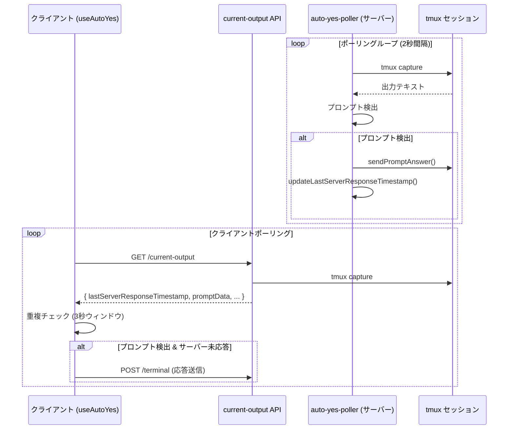
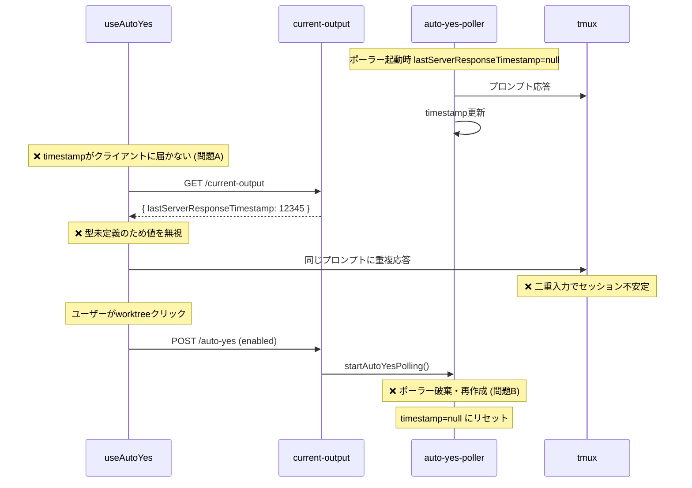
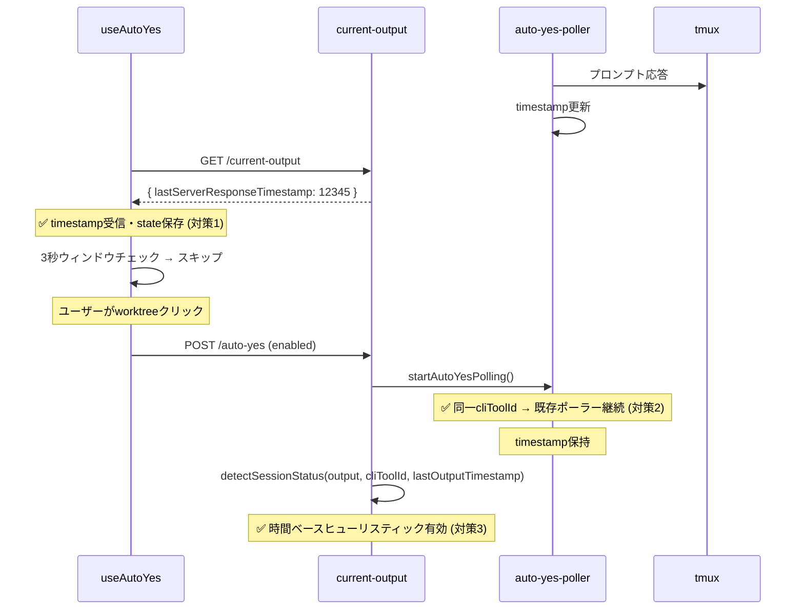

# Issue #501 設計方針書: Auto-Yesサーバー/クライアント二重応答とポーラー再作成によるステータス不安定

## 1. アーキテクチャ設計

### 現状のAuto-Yesアーキテクチャ



### 問題発生フロー



### 対策間の依存関係 (ref: DR1-008)

3つの対策は独立した修正ではなく、以下の依存関係を持つ:

```
対策2 (ポーラー冪等化) ──前提条件──> 対策3 (ステータス検出改善)
対策2 (ポーラー冪等化) ──効果最大化──> 対策1 (タイムスタンプ伝播)
```

- **対策2 → 対策3**: 対策3は `lastServerResponseTimestamp` を `detectSessionStatus()` に渡すが、対策2のポーラー冪等化がなければ、ポーラー再作成時にタイムスタンプがリセットされ、対策3の時間ベースヒューリスティックが無効化される
- **対策2 → 対策1**: 対策1のクライアント側3秒ウィンドウチェックは `lastServerResponseTimestamp` の連続性に依存する。対策2がタイムスタンプの保持を保証することで、対策1の重複防止が安定して機能する
- **対策1は単独でも部分的に有効**: 型定義補完とパイプライン接続自体は対策2なしでも動作するが、ポーラー再作成後にタイムスタンプがリセットされるケースでは効果が限定される

### 修正後のアーキテクチャ



## 2. 技術選定

既存技術スタックの範囲内での修正。新規ライブラリ・依存関係の追加なし。

| カテゴリ | 技術 | 理由 |
|---------|------|------|
| 状態管理 | React useState | 既存パターン踏襲（lastServerResponseTimestamp用） |
| 重複防止 | タイムスタンプ比較 | 既存設計（Issue #138）の完成 |
| ステータス検出 | 既存lastOutputTimestampパラメータ | 新規メカニズム不要 |

## 3. 設計パターン

### 3.1 対策1: パイプライン補完パターン

既存のデータパイプライン（API → クライアント → フック）の欠落箇所を補完する。

```
API Response → CurrentOutputResponse型 → fetchCurrentOutput() → useState → useAutoYes()
                    ↑ 型追加               ↑ 値抽出・保存          ↑ 引数渡し
```

**具体的な変更内容** (ref: DR2-001, DR2-002):

1. **CurrentOutputResponse型への フィールド追加** (`WorktreeDetailRefactored.tsx`):
   ```typescript
   // CurrentOutputResponse型に以下を追加
   lastServerResponseTimestamp?: number | null;
   ```
   APIレスポンスには既に `lastServerResponseTimestamp` が含まれているが、クライアント側の型定義に未定義のため、TypeScriptの型チェックで値にアクセスできない状態を解消する。

2. **fetchCurrentOutput()内でのstate保存**:
   ```typescript
   // fetchCurrentOutput()内、data取得後に追加
   setLastServerResponseTimestamp(data.lastServerResponseTimestamp ?? null);
   ```
   `useState<number | null>(null)` で `lastServerResponseTimestamp` のstateを新規追加し、`fetchCurrentOutput()` 内で `data.lastServerResponseTimestamp` を `setLastServerResponseTimestamp()` で保存する。

3. **useAutoYes呼び出しへの引数追加**:
   ```typescript
   useAutoYes({ ..., lastServerResponseTimestamp })
   ```

**設計判断**: 新しいContext/Storeを導入せず、既存のprops/state伝播パターンに従う。

### 3.2 対策2: 冪等性パターン（Idempotent Start）

`startAutoYesPolling()` を冪等操作に変更。同一パラメータでの再呼び出しが副作用なし。

```typescript
// Before: 毎回破棄・再作成
startAutoYesPolling(id, cliToolId) → stopAutoYesPolling(id) → 新規作成

// After: 冪等操作
startAutoYesPolling(id, cliToolId) →
  既存ポーラーあり && cliToolId一致 → { started: true, reason: 'already_running' }
  既存ポーラーあり && cliToolId不一致 → stop → 新規作成
  既存ポーラーなし → 新規作成
```

**具体的な実装差分** (ref: DR2-003):

`auto-yes-poller.ts` の `startAutoYesPolling()` 関数内、既存ポーラー確認ブロック(L492付近の `if (existingPoller)` 内)に以下のロジックを挿入する:

```typescript
// L492付近: 既存ポーラーがある場合のブロック内
const existingState = getPollerState(worktreeId);
if (existingState?.cliToolId === cliToolId) {
  // 同一cliToolId → 既存ポーラーを継続（タイムスタンプ等の状態を保持）
  return { started: true, reason: 'already_running' };
}
// cliToolId不一致の場合のみ stop → 新規作成
stopAutoYesPolling(worktreeId);
```

**設計判断**:
- `already_running` 時も `started: true` を返す → API側の変更最小化
- `reason` フィールドで内部的に新規起動と再利用を区別可能

### 3.3 対策3: 既存機構活用パターン

`detectSessionStatus()` の既存オプショナルパラメータ `lastOutputTimestamp` を呼び出し側で活用する。

**設計判断**:
- `status-detector.ts` の既存実装（`STALE_OUTPUT_THRESHOLD_MS = 5000ms`）をそのまま利用
- 呼び出し元（`current-output/route.ts`, `worktree-status-helper.ts`）のみ変更
- 新たなクールダウンロジック不要

**TypeScript型変換の注意事項** (ref: DR2-004):

`detectSessionStatus()` の第3引数 `lastOutputTimestamp` の型は `Date` (Date型) であるが、`getLastServerResponseTimestamp()` の戻り値は `number | null` (Date.now()のミリ秒値) である。呼び出し側で `new Date(timestamp)` による変換が必要:

```typescript
// worktree-status-helper.ts および current-output/route.ts での呼び出し
const lastTs = getLastServerResponseTimestamp(worktreeId);
const lastOutputTimestamp = lastTs != null ? new Date(lastTs) : undefined;
detectSessionStatus(output, cliToolId, lastOutputTimestamp);
```

`null` (タイムスタンプ未設定) の場合は `undefined` を渡す（オプショナルパラメータのデフォルト動作を維持）。

**Auto-Yes未使用worktreeでの動作不変性** (ref: DR3-005): Auto-Yesを一度も有効にしていないworktreeでは、`autoYesPollerStates` Mapにエントリが存在せず、`getLastServerResponseTimestamp()` は `null` を返す。上記の変換により `undefined` が `detectSessionStatus()` に渡されるため、既存のデフォルト動作（時間ベースヒューリスティック無効）が維持される。つまり、Auto-Yes未使用のworktree（大多数のケース）では従来と完全に同一の動作となる。動作変化が生じるのはAuto-Yesポーラーが起動中のworktreeのみである。

**タイムスタンプのセマンティクスに関する設計判断** (ref: DR1-004):

本対策では `lastServerResponseTimestamp`（サーバーのAuto-Yesポーラーがプロンプトに応答した時刻）を `detectSessionStatus()` の `lastOutputTimestamp`（出力の最終更新時刻）パラメータとして渡す。これら2つの概念には以下のセマンティックギャップが存在する:

| パラメータ | 本来の意味 | 実際に渡される値 |
|-----------|-----------|----------------|
| `lastOutputTimestamp` | tmuxバッファの出力が最後に変更された時刻 | サーバーがプロンプトに応答を送信した時刻 |

この近似が妥当である根拠:
1. **因果関係**: サーバーがプロンプトに応答を送信すると、その入力テキストがtmuxバッファに反映される。つまり `sendPromptAnswer()` 成功直後にtmux出力は実際に更新される
2. **時間差の許容範囲**: プロンプト応答送信からtmux出力更新までの遅延はミリ秒単位であり、`STALE_OUTPUT_THRESHOLD_MS = 5000ms` の閾値に対して無視できる
3. **判定の方向性**: 「サーバーが応答してから5秒経てばready」という判定は、「出力が5秒以上更新されていなければready」という元の設計意図と実質的に同等の結果をもたらす。サーバー応答後はCLIが処理を進めるため、5秒間出力が安定していればreadyと判断して問題ない

この近似により、tmux captureの差分監視機構を新規導入することなく、既存の時間ベースヒューリスティックを活用できる。

## 4. データフロー設計

### lastServerResponseTimestamp のライフサイクル

```
[サーバー側]
auto-yes-poller.ts: detectAndRespondToPrompt()
  → sendPromptAnswer() 成功
  → updateLastServerResponseTimestamp(worktreeId, Date.now())
  → AutoYesPollerState.lastServerResponseTimestamp に保存

[API経由]
current-output/route.ts: GET handler
  → getLastServerResponseTimestamp(worktreeId)
  → レスポンスJSON に含めて返却

[クライアント側]
WorktreeDetailRefactored.tsx: fetchCurrentOutput()
  → data.lastServerResponseTimestamp を useState に保存
  → useAutoYes({ ..., lastServerResponseTimestamp }) に渡す

useAutoYes.ts: useAutoYes()
  → lastServerResponseTimestamp と Date.now() の差分を計算
  → DUPLICATE_PREVENTION_WINDOW_MS (3秒) 以内ならスキップ
```

### 対策間のデータ依存 (ref: DR1-008)

```
対策2: startAutoYesPolling() 冪等化
  → AutoYesPollerState.lastServerResponseTimestamp を保持
    ↓ (依存)
対策3: worktree-status-helper.ts / current-output/route.ts
  → getLastServerResponseTimestamp() で取得
  → detectSessionStatus() の lastOutputTimestamp に渡す
    ↓ (依存)
対策1: クライアント側
  → current-output API から lastServerResponseTimestamp を受信
  → useAutoYes の3秒ウィンドウチェックに使用
```

対策2が保証するタイムスタンプの連続性は、対策1と対策3の両方が正しく機能するための前提条件である。

### ポーラー状態のライフサイクル（修正後）

```
[起動]
POST /auto-yes (enabled: true)
  → startAutoYesPolling(worktreeId, cliToolId)
  → 既存ポーラー確認
    → 同一cliToolId: 既存継続 (状態保持)
    → 異なるcliToolId: stop → 新規作成
    → なし: 新規作成

[ポーリング中]
pollAutoYes() → validatePollingContext() → captureAndCleanOutput()
  → processStopConditionDelta() → detectAndRespondToPrompt()
  → scheduleNextPoll()

[停止]
POST /auto-yes (enabled: false) → stopAutoYesPolling()
session-cleanup → stopAutoYesPolling()
resource-cleanup → 孤立ポーラー検出・停止
```

## 5. API設計

### 変更なし

既存APIのレスポンス形式・エンドポイントに変更なし。
- `GET /api/worktrees/[id]/current-output` は既に `lastServerResponseTimestamp` を返している
- `POST /api/worktrees/[id]/auto-yes` の `pollingStarted` セマンティクスは変更なし（`already_running` でも `true`）

**注記** (ref: DR2-007): 対策3により `detectSessionStatus()` に `lastOutputTimestamp` が渡されるようになることで、ステータス判定の精度が向上する。これにより、同一のtmux出力に対する `status` / `thinking` / `isPromptWaiting` 等の返却値が従来と異なる場合がある（APIレスポンス形式の変更ではなく、判定精度の向上による値の変化）。

## 6. セキュリティ設計

### セキュリティレビュー検証結果

Stage 4セキュリティレビュー（2026-03-16実施）により、本設計の3つの対策がセキュリティ上の新たなリスクを導入しないことを確認済み。全7項目の検証結果はいずれも nice_to_have（対応不要）であり、must_fix / should_fix の指摘はゼロである。

**検証済みセキュリティ領域**:

| 領域 | 検証結果 | 根拠 |
|------|---------|------|
| 入力バリデーション | 変更なし | 既存の `worktreeId` / `cliToolId` バリデーション（`isValidWorktreeId`, `isValidCliTool`）が継続。クライアント側 `lastServerResponseTimestamp` の typeof ガードは任意改善（SEC4-001） |
| 認証・認可 | 変更なし | 全変更は認証ミドルウェア（`middleware.ts`）の下流で動作。新規APIエンドポイントの追加なし（SEC4-007） |
| tmuxインジェクション | 変更なし | tmux capture / send-keys の呼び出しパターンに変更なし。既存サニタイズ機構が維持（SEC4-006） |
| リソース枯渇 | 改善方向 | 対策2の冪等化により不要なポーラー破棄・再作成が削減。`MAX_CONCURRENT_POLLERS` 制限は維持（SEC4-003） |
| 情報露出 | 変更なし | `lastServerResponseTimestamp` は既にAPIレスポンスに含まれており、新たなデータ露出なし（SEC4-005） |
| タイミング攻撃 | 該当なし | タイムスタンプはサーバー側メモリ内Mapで管理。外部からの操作経路なし（SEC4-004） |

**任意改善候補**: クライアント側での `typeof data.lastServerResponseTimestamp === 'number'` ガード追加（SEC4-001）。localhost/LAN利用かつ認証済みアクセスのため優先度は低い。

## 7. パフォーマンス設計

### 改善点

- **ポーラー再作成コスト削減**: 同一cliToolIdでの `startAutoYesPolling()` 再呼び出し時、ポーラー停止→再作成のオーバーヘッドを回避
- **重複応答削減**: クライアント側の3秒ウィンドウ有効化により、tmuxへの不要な入力送信が削減される
- **ステータス検出精度向上**: 時間ベースヒューリスティックにより、不要なwaitingステータスの返却が削減 → サイドバー更新頻度の安定化

### パフォーマンス懸念なし

- `getLastServerResponseTimestamp()` は `Map.get()` でO(1)
- `detectSessionStatus()` への追加パラメータは単純な時刻比較のみ
- 既存ポーリング間隔・バックオフロジックに変更なし
- **新規useStateの再レンダリング影響** (ref: DR3-007): 対策1で追加する `setLastServerResponseTimestamp()` は `fetchCurrentOutput()` 内でポーリングごと（2秒間隔）に呼ばれるが、サーバーの `lastServerResponseTimestamp` が更新されるのはAuto-Yesポーラーがプロンプトに応答したタイミングのみである。値が変化しない場合、Reactは同一primitive値の `setState` に対して再レンダリングをスキップするため、追加の再レンダリングコストは実質的にプロンプト応答時のみ発生する

## 8. 設計上の決定事項とトレードオフ

### 採用した設計

| 決定事項 | 理由 | トレードオフ |
|---------|------|-------------|
| 既存パイプラインの補完 | 新規メカニズム不要、変更最小 | - |
| ポーラー冪等起動 | 状態保持、API互換性維持 | cliToolId変更検出のみstop→create |
| 既存lastOutputTimestamp活用 | 実装済みロジック活用、テスト済み | worktreeId単位のため複数CLI並行時の精度制限 |
| already_runningでstarted:true | API互換性維持 | 呼び出し元が新規/継続を区別するにはreason確認必要 |

### 不採用とした代替案

| 代替案 | 不採用理由 |
|-------|-----------|
| WebSocket化 | オーバーエンジニアリング。既存ポーリングアーキテクチャでタイムスタンプ伝播可能 |
| グローバルState管理（Redux等） | 既存のuseState + props伝播パターンで十分 |
| サーバー側のみでAuto-Yes応答 | クライアント側にもプロンプト応答機能があり、設計上の互換性を維持する必要がある |
| cliToolId単位のタイムスタンプ管理 | 現時点で同一worktreeの複数CLI同時利用は稀。将来課題として記録 |

### 既知の制限事項 (ref: DR3-006)

- **cliToolId変更時の一時的な二重応答リスク**: ユーザーがAuto-Yesを無効にして即座にcliToolIdを変更して再有効化した場合（例: claudeからcodexに切り替え）、対策2の設計通り既存ポーラーはstopされ新規作成となり、`lastServerResponseTimestamp` が `null` にリセットされる。このリセットは適切（異なるCLIツールの応答タイムスタンプは意味がない）だが、リセット直後はクライアント側の3秒ウィンドウチェックがスキップされるため、一時的に二重応答が発生する可能性がある。ただし、CLIツール切り替え自体が稀な操作であり、対応は不要。既知の制限事項として記録する。

### スコープ外事項

- **cliToolId単位のタイムスタンプ管理**: 現在worktreeId単位。将来的に複数CLIツール同時利用が増えた場合に検討
- **ポーラー状態の永続化**: メモリ内Map管理のまま（サーバー再起動時にリセットされるが、Auto-Yesは再起動後に再設定される設計）

## 9. 変更ファイル一覧

### 直接変更（5ファイル）

| ファイル | 対策 | 変更内容 | 変更量 |
|---------|------|---------|-------|
| `src/components/worktree/WorktreeDetailRefactored.tsx` | 1 | `CurrentOutputResponse` interfaceに `lastServerResponseTimestamp?: number \| null` を追加、useState追加、fetch内setState、useAutoYes引数追加 (ref: DR3-001) | 小 |
| `src/lib/auto-yes-poller.ts` | 2 | startAutoYesPolling()の冪等化ロジック | 小 |
| `src/app/api/worktrees/[id]/current-output/route.ts` | 3 | L111で取得済みの `lastServerResponseTimestamp` を `new Date()` で変換し、L86の `detectSessionStatus()` 第3引数に渡す。`null` の場合は `undefined` を渡す (ref: DR2-006) | 極小 |
| `src/lib/session/worktree-status-helper.ts` | 3 | `auto-yes-manager` から `getLastServerResponseTimestamp` をimport追加。取得値を `new Date()` で変換し `detectSessionStatus()` 第3引数に渡す (ref: DR2-005) | 小 |
| `src/app/api/worktrees/[id]/auto-yes/route.ts` | 2 | already_running時のハンドリング（変更なしの可能性あり） | 極小 |

### テスト新規作成・更新

| ファイル | 内容 |
|---------|------|
| `tests/unit/lib/auto-yes-manager.test.ts` | ポーラー冪等起動・cliToolId変更時の再作成テスト追加 |
| `tests/unit/lib/worktree-status-helper.test.ts` | 新規作成: lastOutputTimestamp引数渡しテスト |

### 新規モジュール間依存 (ref: DR1-003)

本修正により以下の新しいimport依存が発生する。この依存方向は意図的な設計判断である:

| 依存元 | 依存先 | 使用関数 | 理由 |
|--------|--------|---------|------|
| `src/lib/session/worktree-status-helper.ts` | `src/lib/polling/auto-yes-manager.ts` | `getLastServerResponseTimestamp()` | detectSessionStatus()にlastOutputTimestampを渡すため |

worktree-status-helper.tsは従来 detection/status-detector.ts と tmux/session管理にのみ依存していたが、Auto-Yesの応答タイムスタンプ情報が必要になったため、auto-yes-managerへの依存を追加する。将来的にDI的アプローチ(引数としてlastOutputTimestampを外部から注入)への移行も可能だが、現時点では呼び出し箇所が限定的であり、KISS原則に従い直接import参照とする。

### 間接影響（変更不要）

- `src/hooks/useAutoYes.ts` - 引数が正しく渡されるようになる。**重要 (ref: DR3-002)**: 現状、`useAutoYes` の `DUPLICATE_PREVENTION_WINDOW_MS`（3秒）による二重応答防止チェック（L75-80）は、`lastServerResponseTimestamp` が常に `undefined` として渡されているため **事実上無効** である（Issue #138で仕組みは実装されたが、呼び出し側からの引数渡しが欠落していたため一度も有効化されていない）。対策1の実装により初めてこのチェックが有効化される。これは本バグ修正の重要度を示す根拠である
- `src/lib/detection/status-detector.ts` - 既存lastOutputTimestampロジックが活用される
- `src/lib/session-cleanup.ts` - stopAutoYesPolling()の動作変更なし
- `src/lib/resource-cleanup.ts` - ポーラー検出ロジックに影響なし。対策2の冪等化により `startAutoYesPolling()` が既存ポーラーを再利用するケースが増えるが、`Map.has(worktreeId)` が `true` を維持するため、`cleanupOrphanedMapEntries()` の孤立検出ロジックには影響しない (ref: DR3-003)
- `src/app/api/worktrees/route.ts` - ステータス判定結果が改善。具体的には、対策3により `detectSessionStatus()` に `lastOutputTimestamp` が渡されることで、従来 `isProcessing=true` / `status='running'` と判定されていたケースが `isProcessing=false` / `status='ready'`（`reason='no_recent_output'`）に変化しうる。これによりサイドバーのステータスアイコンが 'running' から 'idle/ready' に変わる場合がある (ref: DR3-004)
- `src/app/api/worktrees/[id]/route.ts` - ステータス判定結果が改善。`worktrees/route.ts` と同様に、`isProcessing` フラグおよび `status` の返却値が変化しうる (ref: DR3-004)

## 10. 実装順序

対策間の依存関係を考慮した推奨実装順序:

```
対策2 (ポーラー冪等化) → 対策1 (タイムスタンプ伝播) → 対策3 (ステータス検出改善)
```

**理由**:
- 対策2がタイムスタンプの保持を保証（対策3の前提条件）
- 対策1はクライアント側の独立した変更だが、対策2のタイムスタンプ保持があると効果が最大化
- 対策3は対策2に依存（ポーラー再作成でタイムスタンプがリセットされないことが前提）

## 11. レビュー指摘事項サマリ (Stage 1: 通常レビュー)

### 対応済み指摘

| ID | 重要度 | カテゴリ | タイトル | 対応内容 | 反映箇所 |
|----|--------|---------|---------|---------|---------|
| DR1-004 | must_fix | KISS | lastServerResponseTimestampとlastOutputTimestampの概念的な違いが不明瞭 | セマンティックギャップの根拠と近似の妥当性を文書化 | セクション3.3 |
| DR1-003 | should_fix | KISS | worktree-status-helper.tsへの暗黙的な依存増加 | 新規モジュール間依存を明示的に文書化 | セクション9 |
| DR1-008 | should_fix | SOLID | 対策間の依存関係が実装順序セクションのみに記載 | アーキテクチャ設計(セクション1)とデータフロー設計(セクション4)に依存関係を追加 | セクション1, 4 |

### 対応不要（nice_to_have）

| ID | カテゴリ | タイトル | 判断 |
|----|---------|---------|------|
| DR1-001 | SOLID | CurrentOutputResponse型のインライン定義 | 現時点では変更不要。型が成長した場合にtypes/へ移動を検討 |
| DR1-002 | SOLID | 対策2のOCP配慮 | 変更不要。reasonフィールドのunion type化は将来的に検討 |
| DR1-005 | YAGNI | reasonフィールドの必要性 | reasonフィールドは害がなく、ログ・テスト目的で有用 |
| DR1-006 | YAGNI | 不採用案の記載が適切 | 良い設計判断として記録。変更不要 |
| DR1-007 | DRY | lastOutputTimestamp渡しの2箇所重複 | 2箇所のみの重複であり、コード量が小さいため関数抽出は任意 |

## 12. レビュー指摘事項サマリ (Stage 2: 整合性レビュー)

### 対応済み指摘 (must_fix)

| ID | 重要度 | カテゴリ | タイトル | 対応内容 | 反映箇所 |
|----|--------|---------|---------|---------|---------|
| DR2-001 | must_fix | 整合性 | CurrentOutputResponse型にlastServerResponseTimestampフィールドが未定義 | 具体的なフィールド仕様 `lastServerResponseTimestamp?: number \| null` を明記 | セクション3.1 |
| DR2-002 | must_fix | 整合性 | fetchCurrentOutput()内のsetState呼び出し追加が未記載 | useState追加、fetchCurrentOutput内でのsetLastServerResponseTimestamp()呼び出し、useAutoYes引数追加の具体的なコード変更を明記 | セクション3.1 |
| DR2-003 | must_fix | 整合性 | startAutoYesPolling()冪等化の具体的な実装差分が不明確 | L492付近のif(existingPoller)ブロック内でのcliToolId比較ロジックと戻り値を具体的に記載 | セクション3.2 |

### 対応済み指摘 (should_fix)

| ID | 重要度 | カテゴリ | タイトル | 対応内容 | 反映箇所 |
|----|--------|---------|---------|---------|---------|
| DR2-004 | should_fix | 整合性 | detectSessionStatus()の型不一致 (number -> Date変換が必要) | `getLastServerResponseTimestamp()` の戻り値 `number \| null` を `new Date(timestamp)` で変換する必要があることを明記。nullの場合はundefinedを渡す | セクション3.3 |
| DR2-005 | should_fix | 整合性 | worktree-status-helper.tsでの型変換記載不足 | 変更ファイル一覧にnew Date()変換の必要性を反映 | セクション9 |
| DR2-006 | should_fix | 整合性 | current-output/route.tsでの型変換記載不足 | 変更ファイル一覧にL111の値をnew Date()で変換しL86の第3引数に渡す具体的手順を記載 | セクション9 |

### 対応不要（nice_to_have）

| ID | カテゴリ | タイトル | 判断 |
|----|---------|---------|------|
| DR2-007 | 整合性 | API設計「変更なし」記述と対策3の実質的なレスポンス値変更 | セクション5に注記を追加済み（判定精度向上による値変化の可能性） |
| DR2-008 | 整合性 | STALE_OUTPUT_THRESHOLD_MS = 5000msの値一致確認 | 対応不要。設計書の記載は正確 |
| DR2-009 | 整合性 | AutoYesPollerState型の設計書記載とコードの一致確認 | 対応不要。設計書の記載は正確 |
| DR2-010 | 整合性 | auto-yes-manager.tsバレルファイルからの再エクスポート確認 | 対応不要。設計書のimportパス記載は正確 |

## 13. レビュー指摘事項サマリ (Stage 3: 影響分析レビュー)

### 対応済み指摘 (must_fix)

| ID | 重要度 | カテゴリ | タイトル | 対応内容 | 反映箇所 |
|----|--------|---------|---------|---------|---------|
| DR3-001 | must_fix | 影響範囲 | CurrentOutputResponse型にlastServerResponseTimestamp未定義のためコンパイルエラーリスク | 変更ファイル一覧の変更内容に `CurrentOutputResponse` interfaceへの `lastServerResponseTimestamp?: number \| null` 追加を明記 | セクション9 |
| DR3-002 | must_fix | 影響範囲 | useAutoYesの3秒ウィンドウチェックが事実上無効である現状認識の不足 | 間接影響セクションの `useAutoYes.ts` 記述に、Issue #138以降 `DUPLICATE_PREVENTION_WINDOW_MS` チェックが一度も有効化されていない現状と、対策1で初めて有効化される旨を明記 | セクション9 |

### 対応済み指摘 (should_fix)

| ID | 重要度 | カテゴリ | タイトル | 対応内容 | 反映箇所 |
|----|--------|---------|---------|---------|---------|
| DR3-003 | should_fix | 影響範囲 | resource-cleanup.tsへの間接影響の根拠不足 | 冪等化により `Map.has(worktreeId)` が `true` を維持するため孤立検出ロジックに影響がない根拠を追記 | セクション9 |
| DR3-004 | should_fix | 影響範囲 | サイドバーステータス表示変化の具体的影響分析不足 | `worktrees/route.ts` および `worktrees/[id]/route.ts` の記述に、`isProcessing` フラグ変化とサイドバーアイコン変化の具体的影響を明記 | セクション9 |
| DR3-005 | should_fix | 影響範囲 | Auto-Yes未使用worktreeでの動作不変性が未明記 | セクション3.3に、Auto-Yes未使用worktreeでは `getLastServerResponseTimestamp()` が `null` を返し `undefined` に変換されるため既存動作に変化がないことを明記 | セクション3.3 |
| DR3-006 | should_fix | 影響範囲 | cliToolId変更時のタイムスタンプリセットによる一時的な二重応答リスク | セクション8に既知の制限事項として、cliToolId変更時のタイムスタンプリセットと一時的な二重応答リスクを文書化 | セクション8 |
| DR3-007 | should_fix | 影響範囲 | 新規useStateの再レンダリング影響分析不足 | セクション7に、`setLastServerResponseTimestamp()` がポーリングごとに呼ばれるが値未変化時はReactがレンダリングをスキップする旨を追記 | セクション7 |

### 対応不要（nice_to_have）

| ID | カテゴリ | タイトル | 判断 |
|----|---------|---------|------|
| DR3-008 | 影響範囲 | current-output/route.tsの変更に対するテスト計画不足 | worktree-status-helper.tsのテストで同等のロジックがカバーされる。追加テストは任意 |
| DR3-009 | 影響範囲 | サーバー再起動時のポーラー状態消失の影響パス未文書化 | スコープ外事項に記載済み。再起動後はCLIセッション自体も切断されている可能性が高く実害は限定的 |
| DR3-010 | 影響範囲 | session-cleanup.tsのstopAutoYesPolling()と対策2の冪等化の相互作用 | 現状の記載で十分。cleanup後のrestart時はMapにエントリがないため新規作成となり冪等化は関与しない |

## 14. レビュー指摘事項サマリ (Stage 4: セキュリティレビュー)

### 総合評価

セキュリティ上の重大な懸念なし。設計書セクション6の「影響なし」判断は妥当であることをセキュリティレビューにより確認。3つの対策はいずれもサーバー側メモリ内の状態管理とクライアント側の型定義補完に限定されており、入力バリデーション・認証・tmuxサニタイズ等の既存セキュリティ機構に変更を加えない。

| 重要度 | 件数 |
|--------|------|
| must_fix | 0 |
| should_fix | 0 |
| nice_to_have | 7 |

### 全指摘一覧（nice_to_have）

| ID | カテゴリ | タイトル | 判断 |
|----|---------|---------|------|
| SEC4-001 | 入力バリデーション | lastServerResponseTimestamp の型チェックがクライアント側で未記載 | 任意改善。localhost/LAN利用かつ認証済みアクセスのためリスクは極めて低い。セクション6に改善候補として記録済み |
| SEC4-002 | ロジック安全性 | cliToolId 比較による冪等性チェックの安全性確認 | 対応不要。既存の `isValidCliTool()` ホワイトリストチェックで十分 |
| SEC4-003 | リソース枯渇 | ポーラー冪等化によるリソース枯渇リスクの軽減確認 | 対応不要。冪等化は改善方向であり `MAX_CONCURRENT_POLLERS` 制限も維持 |
| SEC4-004 | タイミング攻撃 | lastOutputTimestamp を利用したステータス検出のタイミング操作リスク | 対応不要。タイムスタンプはサーバー側メモリで完全管理。外部操作経路なし |
| SEC4-005 | 情報露出 | lastServerResponseTimestamp のAPIレスポンスへの露出 | 対応不要。既存のデータ露出範囲に変更なし |
| SEC4-006 | tmuxインジェクション | 新規 tmux コマンドインジェクション経路の不在確認 | 対応不要。tmux呼び出しパターンに変更なし |
| SEC4-007 | 認証・認可 | 認証バイパスの不在確認 | 対応不要。認証・認可メカニズムに変更なし |
