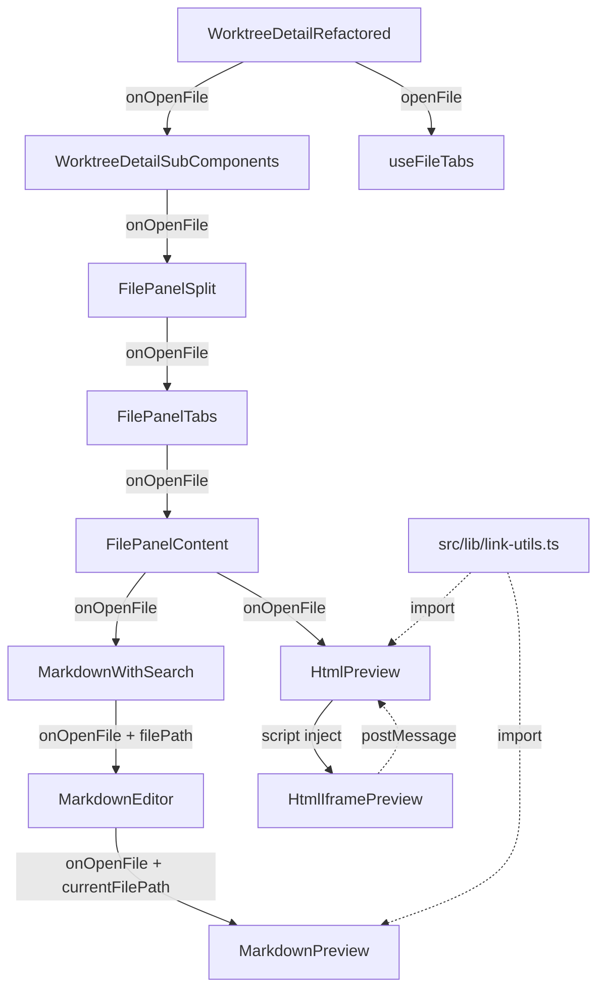

# Issue #505 ファイル内リンクナビゲーション 設計方針書

## 1. 概要

ファイルパネルのMarkdown/HTMLプレビュー内のリンクをクリックした際、同ワークツリー内の相対パスファイルを新しいファイルタブとして開く機能を実装する。併せてファイルタブUIを改善する。

### スコープ
- Markdownプレビュー内リンク対応（相対パス・外部URL・アンカー）
- HTMLプレビュー内リンク対応（interactiveモードのみ、postMessage経由）
- タブUI改善（上限30、ドロップダウン、MOVE_TO_FRONT）
- デスクトップビューのみ対象

## 2. アーキテクチャ設計

### コンポーネント構成図



> **[DR1-006, DR3-003] 設計注記**: MarpEditorWithSlides の Slides ビューは `sandbox=""` でスクリプト実行不可のため、リンク対応ができない。ただし **Editor モードでは MarpEditorWithSlides が MarkdownEditor を呼び出す際に onOpenFile を明示的にフォワードする必要がある**（DR3-003: should_fix に昇格）。MarpEditorWithSlides は FilePanelContent.tsx 内のインライン関数定義（line 340-407）であり、パラメータリストに `onOpenFile` を追加して MarkdownEditor に伝播すること。

### レイヤー構成

| レイヤー | コンポーネント | 責務 |
|---------|-------------|------|
| 共通ユーティリティ | `src/lib/link-utils.ts` | リンク種別判定・パス解決 [DR1-001, DR1-002] |
| 状態管理 | `useFileTabs` | タブ状態・MOVE_TO_FRONT・openFile |
| コントローラー | `WorktreeDetailRefactored` | openFile起点・Toast通知 |
| 中間伝播 | `WorktreeDetailSubComponents` -> `FilePanelSplit` -> `FilePanelTabs` -> `FilePanelContent` | onOpenFile props伝播 [DR3-001] WorktreeDetailSubComponents はデスクトップコンテンツのルーティング層として WDR と FilePanelSplit の間に位置する |
| プレゼンテーション | `MarkdownPreview`, `HtmlPreview` | リンクハンドリング（共通ユーティリティ利用） [DR2-001] MarkdownPreview は本変更により「純粋な Markdown レンダリング」から「Markdown レンダリング + リンクハンドリング」に責務が拡張される。memo 化は props 全体を依存とするため onOpenFile/currentFilePath 変更時にも正しく再レンダリングされる |

### データフロー

```
[ユーザーがリンクをクリック]
  |
[MarkdownPreview/HtmlPreview]
  - classifyLink() でリンク種別判定 [DR1-002]
  - resolveRelativePath() で相対パス解決 [DR1-001]
  - 外部URL -> window.open
  - アンカー -> スクロール
  |
[onOpenFile(resolvedPath)] コールバック伝播
  |
[WorktreeDetailRefactored]
  - fileTabs.openFile(path) 呼び出し
  - result判定 -> showTabLimitToast() で通知（limit_reached時）[DR1-010]
```

## 3. 設計パターン

### 3-1. Callback Drilling パターン

`onOpenFile` コールバックをコンポーネントツリーの7階層を通じて伝播する。

**選定理由**:
- 既存の `onFileSaved`, `onDirtyChange` 等が同パターンで実装済み
- Context化するには影響範囲が限定的すぎる
- YAGNI原則に従い、現時点ではシンプルな props drilling で十分

**トレードオフ**: 中間コンポーネントが props を受け渡すだけになるが、既存パターンと一貫性を保てる

**[DR1-004] Context 移行の判断基準**: 今後2つ以上の新規 callback が同じ経路（WDR -> FPS -> FPT -> FPC -> ME -> MP）を伝播する場合は、FilePanel 専用の Context 導入を検討する。現在 onOpenFile は既存の onFileSaved/onDirtyChange（5階層）より2階層深い7階層に伝播する初のケースであり、中間コンポーネント4つ（FilePanelSplit, FilePanelTabs, FilePanelContent, MarkdownEditor）が純粋なパススルーとなる。

**[DR1-004] 後方互換性**: 中間コンポーネント4つの props 型に `onOpenFile` を追加する際は `optional`（`?`）として定義し、既存の利用箇所に影響を与えないこと。

### 3-2. リンク種別判定（共通ユーティリティ）

リンク種別判定ロジックは共通ユーティリティモジュール `src/lib/link-utils.ts` に切り出す [DR1-001, DR1-002]。MarkdownPreview と HtmlPreview の両方からこのモジュールを import して使用する。

```typescript
// src/lib/link-utils.ts -- 共通リンクユーティリティ [DR1-001, DR1-002]

/** リンクの種別 */
type LinkType = 'anchor' | 'external' | 'relative';

/**
 * リンクの種別を判定する共通ユーティリティ
 * MarkdownPreview の handleLinkClick と HtmlPreview の handleLinkFromIframe の両方で使用
 */
function classifyLink(href: string): LinkType {
  if (href.startsWith('#')) return 'anchor';
  if (href.startsWith('http://') || href.startsWith('https://')) return 'external';
  return 'relative';
}

/**
 * 相対パスを解決するユーティリティ
 * クライアントサイドの簡易チェックのみ。本格的なパストラバーサル防止は
 * サーバーサイドの path-validator.ts に委ねる（Section 6-2 参照）。
 */
function resolveRelativePath(currentFilePath: string, href: string): string | null {
  const baseDir = currentFilePath.substring(0, currentFilePath.lastIndexOf('/') + 1);

  try {
    const base = new URL(baseDir, 'file:///');
    const resolved = new URL(href, base);
    const resolvedPath = resolved.pathname;

    // [DR1-005] new URL() で解決済みのパスに '..' は残らないため、
    // includes('..') チェックは行わない。
    // 簡易バリデーション: パスが有効であることを確認
    if (resolvedPath.startsWith('/')) {
      const stripped = resolvedPath.substring(1); // 先頭の / を除去
      if (stripped.length > 0) {
        return stripped;
      }
    }
  } catch {
    // 不正なパス
  }
  return null;
}
```

**使用例 -- MarkdownPreview**:

```typescript
import { classifyLink, resolveRelativePath } from '@/lib/link-utils';

function handleLinkClick(href: string) {
  if (!href) return;

  const linkType = classifyLink(href);

  switch (linkType) {
    case 'anchor':
      scrollToAnchor(href);
      break;
    case 'external':
      window.open(href, '_blank', 'noopener,noreferrer');
      break;
    case 'relative': {
      const resolvedPath = resolveRelativePath(currentFilePath, href);
      if (resolvedPath && onOpenFile) {
        onOpenFile(resolvedPath);
      }
      break;
    }
  }
}
```

**使用例 -- HtmlPreview (handleLinkFromIframe)**:

```typescript
import { classifyLink, resolveRelativePath } from '@/lib/link-utils';

function handleLinkFromIframe(href: string) {
  // [DR4-003] 入力サニタイズ: postMessage 経由の href は任意の値を取りうるため
  // classifyLink に渡す前にバリデーションを行う
  if (!href || typeof href !== 'string') return;
  if (href.length > 2048) return; // 最大長チェック
  if (/[\x00-\x1f\x7f]/.test(href)) return; // 制御文字の排除

  const linkType = classifyLink(href);

  switch (linkType) {
    case 'external':
      window.open(href, '_blank', 'noopener,noreferrer');
      break;
    case 'relative': {
      const resolvedPath = resolveRelativePath(filePath, href);
      if (resolvedPath && onOpenFile) {
        onOpenFile(resolvedPath);
      }
      break;
    }
    // anchor は iframe 内リンクでは無視
  }
}
```

### 3-3. Script Injection パターン（HtmlPreview）

HtmlPreview コンポーネントがiframe srcDocに注入するスクリプトの責務分離。

```
HtmlPreview (責務: スクリプト注入 + postMessage受信)
  | 注入済みhtmlContent
HtmlIframePreview (責務: iframe表示のみ)
```

**設計判断**: HtmlIframePreview は純粋な表示コンポーネントに保つ。スクリプト注入とpostMessage受信の両方をHtmlPreviewに集約することで、セキュリティ境界を明確にする。

**[DR2-004] Safe モードの動作**: Safe モード（`sandbox=""`）ではスクリプト実行が不可のため、HtmlPreview はスクリプト注入を行わず htmlContent をそのまま HtmlIframePreview に渡す。スクリプト注入は Interactive モード（`sandbox="allow-scripts"`）のみで実行される。

## 4. 技術選定

### 4-1. クライアントサイドパス解決

| 候補 | 選定 | 理由 |
|------|------|------|
| `new URL()` | ○ | ブラウザ標準API、相対パス解決が可能 |
| `path` モジュール | × | Node.js専用、ブラウザでは使用不可 |
| 自前ユーティリティ | △ | フォールバックとして部分的に使用 |

**実装方針**: `new URL()` ベースで基本的なパス正規化を行う。クライアントサイドでは UX 目的の簡易チェック（明らかに不正なパスの早期フィルタ）のみ行い、本格的なパストラバーサル防止はファイル取得API呼び出し時にサーバーサイドの `path-validator.ts` に委ねる。

**[DR1-001] 配置先**: パス解決ユーティリティ `resolveRelativePath` は `src/lib/link-utils.ts` に配置する。MarkdownPreview.tsx 内にインライン定義しない。

**[DR1-005] パストラバーサルチェックの設計**:

`new URL()` による解決後のパスには `..` が残らない（URL API が正規化する）ため、`includes('..')` チェックは行わない。代わりに以下の簡易バリデーションを行う:

1. `resolvedPath` が `/` で始まることを確認（URL API の正規化結果）
2. 先頭の `/` を除去した後、空文字でないことを確認（ルート自体への参照を防止）
3. これはあくまで UX 目的の簡易チェックであり、セキュリティはサーバーサイドの `path-validator.ts` が担保する

```typescript
// [DR1-005] 修正後のバリデーション
function resolveRelativePath(currentFilePath: string, href: string): string | null {
  const baseDir = currentFilePath.substring(0, currentFilePath.lastIndexOf('/') + 1);

  try {
    const base = new URL(baseDir, 'file:///');
    const resolved = new URL(href, base);
    const resolvedPath = resolved.pathname;

    // new URL() 解決済みパスの簡易バリデーション
    // - startsWith('/') は URL API の仕様上常に true
    // - stripped が空でないことで「ルート自体」への参照を排除
    // 注意: セキュリティはサーバーサイド path-validator.ts が担保する
    if (resolvedPath.startsWith('/')) {
      const stripped = resolvedPath.substring(1);
      if (stripped.length > 0) {
        return stripped;
      }
    }
  } catch {
    // 不正なパス
  }
  return null;
}
```

### 4-2. rehype-sanitize カスタムスキーマ

```typescript
import { defaultSchema } from 'rehype-sanitize';

const customSchema = {
  ...defaultSchema,
  attributes: {
    ...defaultSchema.attributes,
    a: [
      ...(defaultSchema.attributes?.a ?? []),
      // [DR4-001] 許可リスト方式: http:, https:, mailto:, tel:, #（アンカー）、相対パスのみ許可
      // 拒否リスト方式（javascript: のみブロック）では data:text/html や vbscript: が通過するため不採用
      ['href', /^(?:#|mailto:|tel:|https?:\/\/|(?![a-zA-Z][a-zA-Z0-9+.-]*:))/],
    ],
  },
};
```

**注意**: `rehypeSanitize` -> `rehypeHighlight` の実行順序を維持し、サニタイズ後に `href` が保持されることをテストで検証する。

**[DR4-001] 許可リスト方式への変更理由**: 従来の `/^(?!javascript:).*$/`（拒否リスト方式）では `javascript:` スキームのみをブロックするが、`data:text/html,<script>alert(1)</script>` や `vbscript:` など他の危険なスキームが許可される。許可リスト方式に変更することで、明示的に安全と判定されたスキーム（http:, https:, mailto:, tel:, #, 相対パス）のみを許可し、未知の危険スキームを自動的にブロックする。あるいは rehype-sanitize のデフォルトスキーマ（既に安全なプロトコルのみ許可）をそのまま使用し、href の追加カスタマイズを行わない方がより安全である。

### 4-3. postMessage セキュリティ設計

```typescript
// メッセージスキーマ
interface CommandMateLinkClickMessage {
  type: 'commandmate:link-click';
  href: string;
}

// iframe注入スクリプト
const LINK_CLICK_SCRIPT = `
<script>
document.addEventListener('click', function(e) {
  var target = e.target;
  while (target && target.tagName !== 'A') {
    target = target.parentElement;
  }
  if (target && target.href) {
    e.preventDefault();
    parent.postMessage({
      type: 'commandmate:link-click',
      href: target.getAttribute('href')
    }, '*');
  }
});
</script>`;

// 受信側バリデーション
useEffect(() => {
  if (sandboxLevel !== 'interactive') return;

  const handler = (event: MessageEvent) => {
    // origin検証: sandbox iframeからは 'null' 文字列
    if (event.origin !== 'null') return;

    // スキーマ検証
    const data = event.data;
    if (!data || typeof data !== 'object') return;
    if (data.type !== 'commandmate:link-click') return;
    if (typeof data.href !== 'string') return;

    // [DR1-007] postMessage 経由の href は一切信頼しない。
    // classifyLink + resolveRelativePath で処理し、
    // 最終的にサーバーサイド path-validator.ts で安全性を担保する。
    // [DR4-002] postMessage 経由の href が HtmlSourceViewer の
    // dangerouslySetInnerHTML に到達しないことを実装時に確認すること。
    handleLinkFromIframe(data.href);
  };

  window.addEventListener('message', handler);
  return () => window.removeEventListener('message', handler);
}, [sandboxLevel, onOpenFile, filePath]);
```

## 5. タブUI設計

### 5-1. useFileTabs reducer 拡張

```typescript
// 新規アクション追加
type FileTabsAction =
  | ... // 既存アクション
  | { type: 'MOVE_TO_FRONT'; path: string };

// MOVE_TO_FRONT reducer
case 'MOVE_TO_FRONT': {
  const index = state.tabs.findIndex(t => t.path === action.path);
  if (index === -1 || index === 0) return state;
  const tab = state.tabs[index];
  const newTabs = [tab, ...state.tabs.filter((_, i) => i !== index)];
  return { tabs: newTabs, activeIndex: 0 };
}
```

> **[DR1-003] 設計注記**: `moveToFront` メソッドは `openFile` とは別メソッドとして UseFileTabsReturn に追加する。既存の `openFile` の戻り値型（`'opened' | 'activated' | 'limit_reached'`）や動作契約は変更しない。

**[DR2-007] moveToFront メソッドの実装サンプル**:

```typescript
// UseFileTabsReturn への追加
interface UseFileTabsReturn {
  // ... 既存メソッド
  moveToFront: (path: string) => void;
}

// useFileTabs 内の実装
const moveToFront = useCallback((path: string) => {
  dispatch({ type: 'MOVE_TO_FRONT', path });
}, [dispatch]);

return { ...existingReturn, moveToFront };
```

### 5-2. ACTIVATE_TAB vs MOVE_TO_FRONT 使い分け

| 操作 | アクション | 効果 |
|------|----------|------|
| タブバー内タブクリック | `ACTIVATE_TAB` | activeIndex変更のみ、順序維持 |
| ドロップダウン選択 | `MOVE_TO_FRONT` | タブをインデックス0に移動 |

> **[DR1-009] 設計注記**: タブ表示方式は「ドロップダウンから選択時に MOVE_TO_FRONT でタブを先頭に移動する」方式を採用する。これにより「先頭5タブ固定表示」ルールだけでタブバーの表示が決定でき、「アクティブタブが6番目以降にある」状態は（ドロップダウン選択直後の一瞬を除いて）発生しない。「先頭4タブ+アクティブタブ」の代替方式は不採用とする。

### 5-3. ドロップダウンUI

```
[Tab1] [Tab2] [Tab3] [Tab4] [Tab5] [v +N]
```

- 先頭5タブをタブバーに表示
- 6番目以降はドロップダウンメニューで選択
- ドロップダウンから選択したタブは MOVE_TO_FRONT で先頭に移動

> **[DR1-008] 設計注記**: ドロップダウンメニュー部分は実装段階で責務が肥大化する場合、TabDropdownMenu サブコンポーネントとして切り出すことを検討する。FilePanelTabs は「どのタブをタブバーに表示し、どれをドロップダウンに含めるか」のロジックのみ持ち、ドロップダウンの開閉UI/メニュー表示は TabDropdownMenu に委譲する形を推奨する。

## 6. セキュリティ設計

### 6-1. XSS防止

| 対策 | 実装箇所 | 詳細 |
|------|---------|------|
| rehype-sanitize | MarkdownPreview | 許可リスト方式でプロトコル制限 [DR4-001] |
| iframe sandbox | HtmlPreview | `allow-scripts` のみ（allow-same-origin なし） |
| postMessage origin検証 | HtmlPreview | `'null'` のみ許可 |
| postMessage schema検証 | HtmlPreview | `commandmate:link-click` namespace必須 |

**[DR1-007] postMessage セキュリティに関する重要な注記**:

postMessage の `origin='null'` 検証は sandbox iframe の仕様上の制約であり、完全な送信元認証ではない。同ページ内の他の sandbox iframe や悪意のあるブラウザ拡張機能からも同じ `'null'` origin でメッセージを送信される可能性がある。namespace prefix (`'commandmate:link-click'`) によるフィルタリングも秘密情報ではないため偽装可能である。

そのため、postMessage 経由で受信した `href` の値は**一切信頼しない**。受信した href は必ず以下の処理を経由する:
1. `classifyLink()` によるリンク種別判定（外部URLは window.open で開き、ファイルシステムアクセスは行わない）
2. `resolveRelativePath()` によるクライアントサイドの簡易パス解決
3. サーバーサイドの `path-validator.ts` による最終的なパスバリデーション（ファイル取得API経由）

この多層防御により、postMessage の送信元が偽装された場合でもセキュリティは担保される。

### 6-2. パストラバーサル防止

| レイヤー | 対策 | 位置づけ |
|---------|------|---------|
| クライアントサイド | `new URL()` による正規化 + 簡易バリデーション [DR1-005] | UX目的の早期フィルタ（セキュリティ境界ではない） |
| サーバーサイド | `path-validator.ts` による検証（ファイル取得API経由） | **主たるセキュリティ防御** |

**[DR1-005] 設計上の重要な注意点**: クライアントサイドの `resolveRelativePath` はセキュリティ境界ではない。`new URL()` で解決済みのパスに `..` は残らないため、`includes('..')` によるチェックは無意味であり、また `..` を含む正当なファイル名（例: `..config.js`）を誤って拒否するリスクがある。パストラバーサル防止の責務はサーバーサイドの `path-validator.ts` が負う。

### 6-3. iframe セキュリティ

- Safe モード: `sandbox=""` -> スクリプト実行不可 -> リンク対応なし
- Interactive モード: `sandbox="allow-scripts"` -> postMessage対応
- `allow-same-origin` は付与しない -> DOM直接アクセス防止
- `allow-top-navigation` は付与しない -> ページ遷移防止

**[DR4-002] HtmlSourceViewer の dangerouslySetInnerHTML に関する注記**:

既存の HtmlSourceViewer は `dangerouslySetInnerHTML={{ __html: lines[idx] }}` を使用して highlight.js の出力を表示している。Issue #505 の変更自体はこのコードに直接触れないが、postMessage 経由で受け取った href 値が HtmlSourceViewer のレンダリングパスに到達しないことを実装時に確認する必要がある。postMessage の href は `handleLinkFromIframe` で処理され、`classifyLink` + `resolveRelativePath` を経由して `onOpenFile` を呼び出すのみであり、HtmlSourceViewer の表示内容には影響しない設計である。中長期的には highlight.js 出力に対する DOMPurify サニタイズの追加を検討する。

## 7. パフォーマンス設計

### 7-1. イベントリスナー管理

- postMessage リスナーは `useEffect` で登録・`return` でクリーンアップ
- split モードでも HtmlPreview コンポーネント単位で1リスナーのみ
- sandboxLevel が `safe` の場合はリスナー登録しない
- **[DR4-004]** postMessage リスナーの登録タイミングを iframe のロード完了後に限定することで、iframe ロード前の競合メッセージを排除できる。useEffect の依存配列に iframe ref を追加することを検討（nice_to_have）
- **[DR4-005]** onOpenFile 呼び出しに debounce（300ms 程度）を追加することで、ユーザーの連続クリックによる不要な API 呼び出しを抑制し UX 改善にもつながる（nice_to_have）

### 7-2. メモ化

- MarkdownPreview の `markdownComponents` は `useMemo` で既にメモ化済み
- カスタム `a` コンポーネントも `useMemo` 内に含める
- rehype-sanitize のカスタムスキーマはモジュールレベル定数として定義

### 7-3. タブ数増加の影響

- MAX_FILE_TABS を 5->30 に増加
- localStorage 永続化データ量が最大6倍
- 各タブは path のみ永続化（content は再fetch）-> 影響は軽微
- **[DR3-005] ストレージ容量の確認**: 30 paths * ~200 bytes = ~6KB per worktree。localStorage の一般的な上限（5-10MB）に対して十分小さく、多数の worktree を扱う場合でも問題なし。コード変更は不要

## 8. 設計上の決定事項とトレードオフ

| 決定事項 | 理由 | トレードオフ |
|---------|------|-------------|
| Callback drilling（Context不使用） | 既存パターンとの一貫性、YAGNI [DR1-004] | 7階層の props 伝播。2つ以上の新規 callback 追加時に Context 検討 |
| onOpenFile は void 返却 | Toast通知はWDR側で一元管理 | リンク要素への即時フィードバック不可 |
| Safe モードではリンク対応なし | sandbox="" はスクリプト実行不可 | Safe モードユーザーはリンク使用不可 |
| クライアント側パス解決 + サーバー検証 | UX（即座にタブ開く）+ セキュリティ [DR1-005] | クライアント側は簡易チェックのみ、サーバーが主防御 |
| 先頭5タブ固定表示 + MOVE_TO_FRONT | シンプルなUI [DR1-009] | ドロップダウン選択でタブ順序が変わる |
| postMessage namespace prefix | 他メッセージとの衝突防止 [DR1-007] | href は一切信頼せず多層防御で安全性担保 |
| rehype-sanitize 許可リスト方式 | 未知の危険スキーム自動ブロック [DR4-001] | 正規表現がやや複雑になるが安全性向上 |
| handleLinkFromIframe 入力サニタイズ | postMessage 経由の任意値に対する防御 [DR4-003] | 追加のバリデーションコスト（軽微） |
| link-utils.ts 共通モジュール | DRY原則 [DR1-001, DR1-002] | 新規ファイル追加 |
| Tab上限Toast集約 | DRY原則 [DR1-010] | ヘルパー関数追加 |

### 代替案との比較

| 代替案 | メリット | デメリット | 判定 |
|--------|---------|----------|------|
| React Context で onOpenFile 伝播 | props drilling 解消 | 影響範囲大、既存パターンと不整合 | 不採用 |
| iframe allow-top-navigation | Safe モードでもリンク対応可 | セキュリティリスク（外部サイトへの遷移） | 不採用 |
| MutationObserver でリンク検知 | スクリプト注入不要 | sandbox="" では MutationObserver も実行不可 | 不採用 |
| resolveRelativePath を MarkdownPreview にインライン定義 | ファイル追加不要 | HtmlPreview と共有できず DRY 違反 [DR1-001] | 不採用 |
| 先頭4タブ+アクティブタブ方式 | アクティブタブが常に見える | 表示ロジックが複雑化 [DR1-009] | 不採用 |

## 9. 変更対象ファイル一覧

### プロダクションコード

| ファイル | 変更内容 | 新規/既存 |
|---------|---------|----------|
| `src/lib/link-utils.ts` | classifyLink, resolveRelativePath 共通ユーティリティ [DR1-001, DR1-002] | **新規** |
| `src/hooks/useFileTabs.ts` | MAX_FILE_TABS=30, MOVE_TO_FRONT | 既存 |
| `src/types/markdown-editor.ts` | EditorProps.onOpenFile | 既存 |
| `src/components/worktree/WorktreeDetailRefactored.tsx` | onOpenFile起点, showTabLimitToast() [DR1-010] | 既存 |
| `src/components/worktree/WorktreeDetailSubComponents.tsx` | onOpenFile props パススルー（optional） [DR3-001] デスクトップコンテンツのルーティング層として WDR から FilePanelSplit への中間伝播を担う | 既存 |
| `src/components/worktree/FilePanelSplit.tsx` | onOpenFile props（optional） [DR1-004] | 既存 |
| `src/components/worktree/FilePanelTabs.tsx` | onOpenFile props（optional）, ドロップダウンUI [DR1-004]。[DR2-009] FilePanelTabs は onOpenFile を直接使用せず、FilePanelContent への純粋なパススルーとしてのみ伝播する | 既存 |
| `src/components/worktree/FilePanelContent.tsx` | onOpenFile伝播（optional） [DR1-004]。[DR2-005] 内部サブコンポーネント MarkdownWithSearch はファイル内ローカル関数のため、そのインライン型定義に `onOpenFile?: (path: string) => void` を追加し MarkdownEditor に伝播すること。[DR3-003] MarpEditorWithSlides インライン関数のパラメータリストにも `onOpenFile` を追加し MarkdownEditor にフォワードすること | 既存 |
| `src/components/worktree/MarkdownEditor.tsx` | onOpenFile + filePath伝播（optional） [DR1-004]。[DR2-002] MarkdownPreview の呼び出し箇所が2箇所（モバイル用・デスクトップ用）あり、両方に onOpenFile と currentFilePath を渡すこと。[DR3-009] MarkdownEditor は既存の `filePath` prop を持つため、新規の currentFilePath prop は不要。既存の `filePath` をそのまま MarkdownPreview の `currentFilePath` として渡す | 既存 |
| `src/components/worktree/MarkdownPreview.tsx` | カスタムa, rehype-sanitize, link-utils import [DR1-001] | 既存 |
| `src/components/worktree/HtmlPreview.tsx` | onOpenFile, postMessage, link-utils import [DR1-001, DR1-007] | 既存 |

### テストコード

| ファイル | テスト内容 | 新規/既存 |
|---------|---------|----------|
| `tests/unit/lib/link-utils.test.ts` | classifyLink, resolveRelativePath [DR1-001, DR1-002, DR1-005] | **新規** |
| `tests/unit/hooks/useFileTabs.test.ts` | MOVE_TO_FRONT。[DR3-002] 既存テストは MAX_FILE_TABS を動的に参照しているため、値変更（5->30）による既存テスト破損はなし。MAX_FILE_TABS=30 の値自体を検証するリグレッションガードテストの追加を推奨 | 既存 |
| `tests/unit/components/FilePanelTabs.test.tsx` | ドロップダウンUI。[DR3-006] 既存の FilePanelContent モック（props から `{ tab }` のみ destructure）を更新し、新規 optional prop `onOpenFile` を含めること。既存テストは onOpenFile が optional のため破損しないが、モックの型精度のために更新が必要 | 既存 |
| `tests/unit/components/HtmlPreview.test.tsx` | postMessage統合テスト | 新規 |
| `tests/unit/components/MarkdownPreview.test.tsx` | リンクハンドラ, rehype-sanitize | 新規 |

## 10. 制約条件

- SOLID原則: 各コンポーネントの責務を明確に分離（HtmlPreview vs HtmlIframePreview）。resolveRelativePath は `src/lib/link-utils.ts` に配置し、MarkdownPreview にインライン定義しない [DR1-001]
- KISS原則: クライアントサイドパス解決は UX 目的の簡易チェックのみ、セキュリティ防御はサーバーに委ねる [DR1-005]
- YAGNI原則: Safe モードのリンク対応、モバイル対応は別Issueに先送り。[DR3-003] MarpEditorWithSlides の Editor モードでの onOpenFile フォワードは should_fix に昇格（Slides ビューのみ不要）
- DRY原則: パス解決 + リンク種別判定ユーティリティは `src/lib/link-utils.ts` で共有 [DR1-001, DR1-002]。タブ上限 Toast メッセージは `showTabLimitToast()` ヘルパーに集約 [DR1-010]

## 11. 実装チェックリスト

### Must Fix

- [ ] **[DR1-005]** `resolveRelativePath` から `includes('..')` チェックを削除し、`new URL()` 解決後の簡易バリデーション（パスが空でないこと）に置き換える
- [ ] **[DR1-005]** クライアントサイドのパスチェックは UX 目的の簡易フィルタであり、セキュリティ境界ではないことをコードコメントに明記する
- [ ] **[DR1-005]** パストラバーサル防止の主防御はサーバーサイド `path-validator.ts` であることを確認する
- [ ] **[DR2-003]** Toast メッセージ "Maximum 5 file tabs" のハードコード値を `MAX_FILE_TABS` 定数を参照した動的メッセージに変更する。`showTabLimitToast()` ヘルパー内で `` `Maximum ${MAX_FILE_TABS} file tabs. Close a tab first.` `` のようにテンプレートリテラルを使用し、テストで動的メッセージが正しく生成されることを検証する

### Should Fix (Stage 4: Security Review)

- [ ] **[DR4-001]** rehype-sanitize カスタムスキーマを拒否リスト方式（`/^(?!javascript:).*$/`）から許可リスト方式（`/^(?:#|mailto:|tel:|https?:\/\/|(?![a-zA-Z][a-zA-Z0-9+.-]*:))/`）に変更する。または rehype-sanitize のデフォルトスキーマをそのまま使用する
- [ ] **[DR4-001]** テストで `data:text/html,<script>alert(1)</script>` や `vbscript:alert(1)` の href がサニタイズされることを検証する
- [ ] **[DR4-002]** postMessage 経由の href が HtmlSourceViewer の dangerouslySetInnerHTML に到達しないことを実装時に確認する
- [ ] **[DR4-003]** `handleLinkFromIframe` の先頭で入力サニタイズを行う: (1) 最大長チェック（2048文字）、(2) 制御文字の排除（`/[\x00-\x1f\x7f]/`）、(3) null/undefined/非string チェック

### Should Fix (Stage 1-3)

- [ ] **[DR1-001]** `src/lib/link-utils.ts` を新規作成し、`resolveRelativePath` を配置する
- [ ] **[DR1-001]** MarkdownPreview と HtmlPreview の両方から `src/lib/link-utils.ts` を import する
- [ ] **[DR1-002]** `classifyLink(href): 'anchor' | 'external' | 'relative'` を `src/lib/link-utils.ts` に追加する
- [ ] **[DR1-002]** `handleLinkClick`（MarkdownPreview）と `handleLinkFromIframe`（HtmlPreview）で `classifyLink` を使用する
- [ ] **[DR1-004]** 中間コンポーネント4つの `onOpenFile` props を optional（`?`）で定義する
- [ ] **[DR1-004]** 設計判断として「2つ以上の新規 callback 追加時に Context 検討」をコードコメントに残す
- [ ] **[DR1-007]** postMessage 受信後の href を信頼せず、必ず `classifyLink` + `resolveRelativePath` + サーバーサイド検証を経由する
- [ ] **[DR1-010]** タブ上限 Toast メッセージを `showTabLimitToast()` ヘルパー関数に集約し、`handleFilePathClick` と `handleFileSelect` の両方から呼び出す
- [ ] **[DR2-001]** MarkdownPreview の責務変更（純粋な表示 -> レンダリング + リンクハンドリング）を認識し、memo 化が onOpenFile/currentFilePath 変更時にも正しく動作することを確認する
- [ ] **[DR2-002]** MarkdownEditor 内の MarkdownPreview 呼び出し箇所が2箇所（モバイル用・デスクトップ用）あるため、両方に onOpenFile と currentFilePath を渡す
- [ ] **[DR2-004]** HtmlPreview のスクリプト注入は Interactive モードのみで実行し、Safe モードでは htmlContent をそのまま HtmlIframePreview に渡す実装とする
- [ ] **[DR2-005]** FilePanelContent.tsx 内のローカル関数 MarkdownWithSearch のインライン型定義に `onOpenFile?: (path: string) => void` を追加し、MarkdownEditor に伝播する
- [ ] **[DR2-007]** UseFileTabsReturn に `moveToFront` メソッドを追加し、`dispatch({ type: 'MOVE_TO_FRONT', path })` をラップする
- [ ] **[DR2-009]** FilePanelTabs の onOpenFile は FilePanelContent への純粋なパススルーであることを明確にし、FilePanelTabs 自体では onOpenFile を直接使用しない
- [ ] **[DR3-001]** WorktreeDetailSubComponents.tsx に onOpenFile optional prop を追加し、WDR から FilePanelSplit への中間伝播を行う。WDR が FilePanelSplit を直接レンダリングしている場合はこの変更は不要だが、WorktreeDetailSubComponents が中間レイヤーとして機能している場合は必須
- [ ] **[DR3-003]** FilePanelContent.tsx 内の MarpEditorWithSlides インライン関数に onOpenFile パラメータを追加し、MarkdownEditor に伝播する（DR1-006 の nice_to_have から should_fix に昇格）
- [ ] **[DR3-006]** FilePanelTabs.test.tsx の FilePanelContent モックを更新し、onOpenFile optional prop を destructure に含める
- [ ] **[DR3-009]** MarkdownEditor から MarkdownPreview への currentFilePath 伝播は、MarkdownEditor の既存 filePath prop を再利用する。新規 prop の追加は不要

### Nice to Have (Stage 4: Security Review)

- [ ] **[DR4-004]** postMessage リスナーの登録タイミングを iframe のロード完了後に限定する（useEffect の依存配列に iframe ref を追加）
- [ ] **[DR4-005]** onOpenFile 呼び出しに debounce（300ms 程度）を追加し、連続クリックによる不要な API 呼び出しを抑制する

### Nice to Have (Stage 1-3)

- [ ] **[DR1-003]** `moveToFront` メソッドを `openFile` とは別メソッドとして定義し、`openFile` の契約を変更しない
- [ ] **[DR1-006]** MarpEditorWithSlides への onOpenFile 伝播の必要性を実装時に確認し、不要なら省略する
- [ ] **[DR1-008]** ドロップダウンUIの責務が肥大化する場合、TabDropdownMenu サブコンポーネントに切り出す
- [ ] **[DR1-009]** タブ表示方式は MOVE_TO_FRONT 方式に統一し、「先頭4タブ+アクティブタブ」方式は実装しない
- [ ] **[DR2-006]** MarpEditorWithSlides の Editor モードで MarkdownEditor に onOpenFile を渡す場合、MarpEditorWithSlides の props 型にも `onOpenFile?: (path: string) => void` を追加し伝播する
- [ ] **[DR2-008]** 設計方針書内の伝播階層数の記述を統一する（「WDR を含む7コンポーネントを通過」等）。中間パススルーコンポーネントの列挙に MarkdownWithSearch を含め5つとする
- [ ] **[DR2-010]** Issue の rehype-sanitize 記述を「相対パスおよび外部URLの href を許可し、javascript: スキームのみブロックする」と更新するとより正確になる（Issue 更新は任意）
- [ ] **[DR3-002]** MAX_FILE_TABS=30 の値自体を検証するリグレッションガードテストを useFileTabs.test.ts に追加する（既存テストは動的参照のため破損しない）
- [ ] **[DR3-004]** resolveRelativePath のテストに、スペース・Unicode 文字・非常に長いパスなどのエッジケースを追加する。file:/// プロトコルは URL 正規化目的のみで使用しており、実際のファイルシステムアクセスには使用しないことをドキュメント化する
- [ ] **[DR3-005]** localStorage データサイズの上限確認は完了（~6KB/worktree）。コード変更は不要
- [ ] **[DR3-007]** ドロップダウンメニューにキーボードナビゲーションを追加する（Tab/Shift+Tab でフォーカス移動、Enter/Space で選択、Escape で閉じる、Arrow keys でメニュー内移動）。`role='menu'` / `role='menuitem'` ARIA 属性の使用を検討
- [ ] **[DR3-008]** 新規依存パッケージの追加は不要であることを確認済み（rehype-sanitize は既存依存、link-utils.ts は外部依存なし）
- [ ] **[DR3-010]** MAX_FILE_TABS ロールバック安全性を確認済み。RESTORE アクションの slice ロジックにより、値を 30 から 5 に戻しても localStorage の既存データは安全に切り詰められる

## 12. レビュー指摘事項サマリー（Stage 1: 通常レビュー）

| ID | 重要度 | カテゴリ | タイトル | 対応状況 |
|----|--------|---------|---------|---------|
| DR1-001 | should_fix | SOLID | resolveRelativePath を src/lib/ に切り出し | Section 3-2, 4-1, 9 に反映 |
| DR1-002 | should_fix | DRY | classifyLink() 共通ユーティリティ作成 | Section 3-2 に反映 |
| DR1-003 | nice_to_have | SOLID | moveToFront を openFile と別メソッドに | Section 5-1 に注記追加 |
| DR1-004 | should_fix | KISS | Callback Drilling の Context 移行基準明記 | Section 3-1, 8 に反映 |
| DR1-005 | **must_fix** | KISS | resolveRelativePath の includes('..') チェック削除 | Section 4-1, 6-2 に反映 |
| DR1-006 | nice_to_have | YAGNI | MarpEditorWithSlides への onOpenFile 不要の可能性 | Section 2 に注記追加 |
| DR1-007 | should_fix | pattern | postMessage の href 値を信頼しない設計 | Section 4-3, 6-1 に反映 |
| DR1-008 | nice_to_have | SOLID | ドロップダウンUI のサブコンポーネント化 | Section 5-3 に注記追加 |
| DR1-009 | nice_to_have | KISS | MOVE_TO_FRONT 方式に統一 | Section 5-2, 5-3 に反映 |
| DR1-010 | should_fix | DRY | Toast メッセージのヘルパー集約 | Section 2, 8, 9 に反映 |

## 13. レビュー指摘事項サマリー（Stage 2: 整合性レビュー）

| ID | 重要度 | カテゴリ | タイトル | 対応状況 |
|----|--------|---------|---------|---------|
| DR2-001 | should_fix | 設計 vs コードベース | MarkdownPreview の責務変更（純粋表示 -> リンクハンドリング）の明示 | Section 2 レイヤー構成, Section 11 に反映 |
| DR2-002 | should_fix | 設計 vs コードベース | MarkdownEditor 内 MarkdownPreview 呼び出し2箇所への伝播 | Section 9, Section 11 に反映 |
| DR2-003 | **must_fix** | 設計 vs Issue | Toast メッセージ "Maximum 5" のハードコード値が MAX_FILE_TABS=30 と矛盾 | Section 11 Must Fix に反映 |
| DR2-004 | should_fix | 設計 vs コードベース | Safe モードではスクリプト注入をスキップすることの明示 | Section 3-3, Section 11 に反映 |
| DR2-005 | should_fix | 設計 vs コードベース | MarkdownWithSearch インライン型に onOpenFile 追加 | Section 9, Section 11 に反映 |
| DR2-006 | nice_to_have | 設計 vs コードベース | MarpEditorWithSlides Editor モードでの onOpenFile 伝播確認 | Section 11 Nice to Have に反映 |
| DR2-007 | should_fix | 設計 vs コードベース | UseFileTabsReturn moveToFront メソッドのコードサンプル | Section 5-1, Section 11 に反映 |
| DR2-008 | nice_to_have | 設計書内整合性 | 伝播階層数「7階層」の数え方と中間コンポーネント数の統一 | Section 11 Nice to Have に反映 |
| DR2-009 | should_fix | 設計 vs コードベース | FilePanelTabs の onOpenFile は純粋パススルー | Section 9, Section 11 に反映 |
| DR2-010 | nice_to_have | 設計 vs Issue | rehype-sanitize カスタムスキーマの記述差異（実質矛盾なし） | Section 11 Nice to Have に反映 |

## 14. レビュー指摘事項サマリー（Stage 3: 影響分析レビュー）

| ID | 重要度 | カテゴリ | タイトル | 対応状況 |
|----|--------|---------|---------|---------|
| DR3-001 | should_fix | Missing Affected File | WorktreeDetailSubComponents.tsx が影響ファイルリストに未記載 | Section 2, 9, 11 に反映 |
| DR3-002 | should_fix | Test Impact | 既存 useFileTabs テストは MAX_FILE_TABS 動的参照のため破損なし | Section 9 テストコード, Section 11 に反映 |
| DR3-003 | should_fix | Missing Affected File | MarpEditorWithSlides の Editor モードで onOpenFile フォワード必須（nice_to_have から昇格） | Section 2, 9, 10, 11 に反映 |
| DR3-004 | nice_to_have | Browser Compatibility | new URL() の file:/// ベースでのブラウザ間差異 | Section 11 Nice to Have に反映 |
| DR3-005 | should_fix | State Management Impact | localStorage データサイズ増加の上限確認（~6KB/worktree） | Section 7-3, Section 11 に反映 |
| DR3-006 | should_fix | Existing Test Impact | FilePanelTabs.test.tsx のモックに onOpenFile prop 更新が必要 | Section 9, Section 11 に反映 |
| DR3-007 | nice_to_have | Accessibility Impact | ドロップダウンメニューのキーボードナビゲーション未指定 | Section 11 Nice to Have に反映 |
| DR3-008 | nice_to_have | Build/Bundle Impact | 新規依存パッケージ追加なし（正の所見） | Section 11 Nice to Have に反映 |
| DR3-009 | should_fix | Missing Impact Analysis | MarkdownEditor の既存 filePath prop を currentFilePath として再利用 | Section 9, Section 11 に反映 |
| DR3-010 | nice_to_have | Migration/Rollback | MAX_FILE_TABS ロールバック時の安全性確認（正の所見） | Section 11 Nice to Have に反映 |

## 15. レビュー指摘事項サマリー（Stage 4: セキュリティレビュー）

**総合評価**: PASS_WITH_RECOMMENDATIONS（リスクレベル: MEDIUM）

**セキュリティチェックリスト（OWASP Top 10 2021）**:

| カテゴリ | 結果 | 備考 |
|---------|------|------|
| A01 Broken Access Control | PASS | path-validator.ts による堅牢なパストラバーサル防止。symlink 防御含む |
| A02 Cryptographic Failures | N/A | 暗号化関連の処理は変更範囲外 |
| A03 Injection | PASS (要対応) | rehype-sanitize の拒否リスト方式を許可リスト方式に変更推奨 [DR4-001] |
| A04 Insecure Design | PASS | 多層防御アプローチ、sandbox iframe、trust-nothing 設計は適切 |
| A05 Security Misconfiguration | PASS | iframe sandbox 属性の設定は正しい |
| A06 Vulnerable Components | PASS | 新規外部依存パッケージの追加なし |
| A07 Authentication Failures | N/A | 認証は既存 middleware.ts で処理、変更なし |
| A08 Software Integrity | PASS | iframe srcDoc へのスクリプト注入はハードコードのみ |
| A09 Logging/Monitoring | N/A | ログ・監視の変更なし |
| A10 SSRF | PASS | 外部URL はブラウザ側で window.open、サーバーサイドフェッチなし |

| ID | 重要度 | カテゴリ | タイトル | 対応状況 |
|----|--------|---------|---------|---------|
| DR4-001 | should_fix | A03:2021-Injection / XSS | rehype-sanitize カスタムスキーマを許可リスト方式に変更 | Section 4-2, 6-1, 11 に反映 |
| DR4-002 | should_fix | A03:2021-Injection / XSS | HtmlSourceViewer の dangerouslySetInnerHTML が postMessage href から到達不可であることの確認 | Section 4-3, 6-3, 11 に反映 |
| DR4-003 | should_fix | A01:2021-Broken Access Control | handleLinkFromIframe の入力サニタイズ（最大長・制御文字チェック） | Section 3-2, 11 に反映 |
| DR4-004 | nice_to_have | A05:2021-Security Misconfiguration | postMessage リスナー登録タイミングの最適化 | Section 7-1, 11 に反映 |
| DR4-005 | nice_to_have | A07:2021-DoS | onOpenFile 呼び出しへの debounce 追加 | Section 7-1, 11 に反映 |

---

*Generated by design-policy command for Issue #505*
*Updated with Stage 1 review findings (DR1-001 to DR1-010) on 2026-03-16*
*Updated with Stage 2 review findings (DR2-001 to DR2-010) on 2026-03-16*
*Updated with Stage 3 review findings (DR3-001 to DR3-010) on 2026-03-16*
*Updated with Stage 4 security review findings (DR4-001 to DR4-005) on 2026-03-16*
