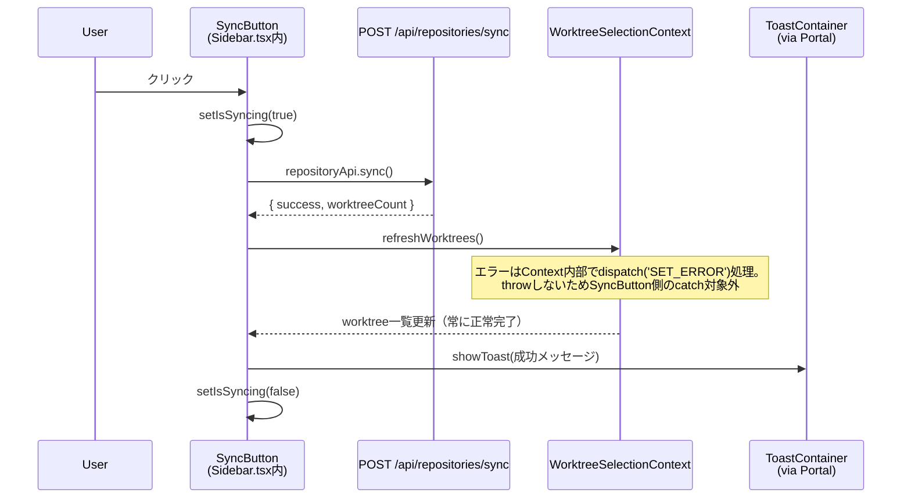

# Issue #506 サイドバーブランチ同期ボタン 設計方針書

## 1. 概要

サイドバーヘッダーにブランチ同期ボタンを追加し、クリックでリポジトリスキャン→DB同期→worktree一覧再取得を実行する機能。

## 2. アーキテクチャ設計

### システム構成図



### レイヤー構成

```
プレゼンテーション層
└── Sidebar.tsx
    └── SyncButton（インラインコンポーネント）
        ├── UIボタン（ローディング状態管理）
        ├── syncハンドラ（repositoryApi.sync → refreshWorktrees）
        └── ToastContainer（createPortal → document.body）

既存レイヤー（変更なし）
├── API層: POST /api/repositories/sync
├── Context層: WorktreeSelectionContext.refreshWorktrees()
└── 共通UI: Toast.tsx（useToast, ToastContainer）
```

## 3. 技術選定

| カテゴリ | 選定技術 | 選定理由 |
|---------|---------|---------|
| コンポーネント配置 | Sidebar.tsx内インライン | 既存パターン準拠（GroupHeader, ViewModeToggle等） |
| 状態管理 | useState（ローカル） | isSyncing状態のみ。Contextへの追加は不要 |
| API呼び出し | repositoryApi.sync() | 既存api-client.tsのラッパー使用 |
| worktree再取得 | refreshWorktrees() | WorktreeSelectionContextの既存関数 |
| Toast表示 | useToast + createPortal | stacking context問題の回避 |
| アイコン | インラインSVG | 既存Sidebarパターン準拠。lucide-react依存追加なし |
| i18n | next-intl（common名前空間） | 既存プロジェクトのi18n方式。既存のi18n名前空間はcommon, worktree, autoYes, error, prompt, auth, scheduleの7つであり、sidebar名前空間は存在しない。SyncButton用のキー（syncSuccess, syncError, syncAuthError, syncButtonLabel）は既存の **common名前空間** に追加する（`locales/en/common.json`, `locales/ja/common.json`）。`useTranslations('common')` を使用する。既存Sidebar文字列（'Branches'等）のi18n化は本Issueスコープ外とし、SyncButton追加分のみi18n対応する |

## 4. 設計パターン

### コンポーネント分離パターン（memo化対策）

```typescript
// Sidebar.tsx内のインラインコンポーネント
const SyncButton = memo(function SyncButton({
  refreshWorktrees,
}: {
  refreshWorktrees: () => Promise<void>;
}) {
  const [isSyncing, setIsSyncing] = useState(false);
  const isSyncingRef = useRef(false); // useCallback依存配列の安定化のためRef管理
  const { showToast, toasts, removeToast } = useToast();
  const t = useTranslations('common');

  const handleSync = useCallback(async () => {
    if (isSyncingRef.current) return;
    isSyncingRef.current = true;
    setIsSyncing(true);
    try {
      const result = await repositoryApi.sync();
      // refreshWorktrees()は内部でエラーをContextのerror stateに反映するため、
      // throwしない。SyncButton側のcatch対象はrepositoryApi.sync()のエラーのみ。
      await refreshWorktrees();
      showToast(
        t('syncSuccess', { count: result.worktreeCount }),
        'success',
        3000
      );
    } catch (error) {
      if (error instanceof ApiError && error.status === 401) {
        showToast(t('syncAuthError'), 'error', 5000);
      } else {
        showToast(t('syncError'), 'error', 5000);
      }
    } finally {
      isSyncingRef.current = false;
      setIsSyncing(false);
    }
  }, [refreshWorktrees, showToast, t]); // isSyncingをRefで管理し依存配列から除外

  return (
    <>
      <button
        type="button"
        onClick={handleSync}
        disabled={isSyncing}
        aria-label={t('syncButtonLabel')}
        className="p-1 rounded text-gray-300 hover:text-white hover:bg-gray-700
          focus:outline-none focus:ring-2 focus:ring-blue-500
          disabled:opacity-50 disabled:cursor-not-allowed transition-colors"
      >
        <SyncIcon className={isSyncing ? 'animate-spin' : ''} />
      </button>
      {createPortal(
        <ToastContainer toasts={toasts} onClose={removeToast} />,
        document.body
      )}
    </>
  );
});
```

### Portal パターン（stacking context回避）

- `Sidebar`は`AppShell.tsx`で`position: fixed` + `translate-x-0`/`-translate-x-full`（Tailwind CSSクラス）で配置される
- CSS仕様上、translateX（transformプロパティの一部）適用要素は新しいcontaining blockを生成する可能性がある
- 子要素の`position: fixed`はviewportではなくSidebarを基準に配置される
- `createPortal`で`ToastContainer`を`document.body`にマウントし回避
- **段階的アプローチ**: 既存のMarkdownEditor等ではPortalなしでToastContainerが動作している実績がある。実装時はまずPortalなしで動作確認し、Sidebarのtransform配置によるstacking context問題が実際に発生する場合にのみcreatePortalを導入する
- **SSR互換性（IMPACT-004）**: Next.js 14のServer Componentsアーキテクチャにおいて、createPortalのターゲットにdocument.bodyを直接参照する場合、SSR/hydration時にdocumentが利用不可となる。段階的アプローチ（F-007）によりPortalなし方式を優先するため、通常はこの問題は発生しない。Portal採用が必要になった場合は、useStateでmountedフラグを管理し、マウント後にのみPortalをレンダリングするパターンを適用すること:
  ```typescript
  const [mounted, setMounted] = useState(false);
  useEffect(() => { setMounted(true); }, []);
  // render内: mounted && createPortal(<ToastContainer .../>, document.body)
  ```

### 既存パターンとの整合性

| パターン | 既存例 | 本実装 |
|---------|-------|-------|
| インラインコンポーネント | GroupHeader, ViewModeToggle, ChevronIcon | SyncButton, SyncIcon |
| ボタンスタイル | SortSelector: `p-1 rounded text-gray-300 hover:text-white` | 同一スタイル適用 |
| memo化 | 既存インラインコンポーネント（GroupHeader, ViewModeToggle等）はmemo未使用。Sidebar全体はmemo化済み | SyncButtonはuseToastによるstate変更のSidebar全体への波及を防ぐためmemo化する（既存インラインコンポーネントとは異なる判断） |
| API呼び出し | RepositoryManager: `repositoryApi.sync()` | 同じAPI使用 |
| Toast利用 | MarkdownEditor: `useToast + ToastContainer` | 同じパターン + Portal |

## 5. データモデル設計

新規テーブル・スキーマ変更なし。既存のAPIレスポンスをそのまま使用。

```typescript
// POST /api/repositories/sync のレスポンス（既存）
// 注: api-client.tsではインライン型リテラルとして定義されている（名前付きインターフェースではない）。
// 以下は設計書での参照用に型構造を明示したもの。実装時に名前付き型を追加するかは任意。
// api-client.ts: repositoryApi.sync(): Promise<{ success: boolean; message: string; worktreeCount: number; repositoryCount: number; repositories: string[]; }>
interface SyncResponse {
  success: boolean;
  message: string;
  worktreeCount: number;
  repositoryCount: number;
  repositories: string[];
}
```

## 6. API設計

既存API使用のため新規API設計なし。

| メソッド | エンドポイント | 用途 | 変更 |
|---------|-------------|------|------|
| POST | /api/repositories/sync | リポジトリスキャン＋DB同期 | なし |
| GET | /api/worktrees | worktree一覧取得 | なし（refreshWorktrees経由） |

## 7. セキュリティ設計

- **認証**: 既存のmiddleware.tsによるトークン認証がsync APIに適用済み。CM_AUTH_TOKEN_HASHが未設定の場合は認証がバイパスされる（後方互換性）。認証無効環境でもSyncButtonは正常動作する（401エラーが発生しないため通常フローで完了する）（SEC-006）
- **401エラー対応**: 認証エラー時はToast通知のみ。再認証フローには介入しない
- **エラーレスポンスの情報漏洩防止（SEC-001）**: POST /api/repositories/sync のエラーレスポンスにおいて、内部エラーメッセージ（ファイルシステムパス、DB内部エラー等）をクライアントに返してはならない。実装時は汎用的なエラーメッセージ（例: `'Failed to sync repositories'`）のみをレスポンスに含め、詳細エラーはサーバーサイドの`logger.error`のみに出力すること。SyncButton側のcatchブロックでは、サーバーから返されるエラーメッセージの内容に依存せず、i18nの`syncError`キーで固定メッセージを表示する（OWASP A01:2021 - Information Disclosure）
- **XSS**: ToastメッセージはReactのJSXエスケープにより安全。i18nメッセージはnext-intlのICU MessageFormat経由でレンダリングされる。テンプレート変数（worktreeCount）はサーバーレスポンス由来の数値型であり、ReactのJSXエスケープとnext-intlのICU MessageFormatによる二重保護がある（SEC-005）
- **CSRF保護（SEC-002）**: 以下の3層により保護される。「Next.js API RoutesのビルトインCSRF保護」は存在しないため、保護根拠を正確に記載する:
  1. **SameSite Cookie**: SameSite=strict属性によりクロスサイトリクエストにCookieが送信されない
  2. **Content-Type制約**: fetchApiはContent-Type: application/jsonを送信する。HTMLフォームからのPOSTはapplication/jsonを送信できないため、フォームベースのCSRF攻撃を防止
  3. **同一オリジンポリシー**: ブラウザの同一オリジンポリシーによりクロスオリジンからのfetchリクエストがブロックされる
- **サーバーサイドレート制限（SEC-003）**: クライアントサイドではisSyncingRefによる二重実行防止を実装するが、悪意あるユーザーがブラウザ開発者ツールや自動化スクリプトでrepositoryApi.sync()を連続呼び出しした場合のサーバーサイド保護は本Issueスコープでは実装しない。sync APIはファイルシステムスキャンを伴う重い処理であり、連続呼び出しによるサーバー負荷が懸念される。このリスクを認識した上で、サーバーサイドレート制限の導入は将来Issueとして対応する（OWASP A04:2021 - Insecure Design）
- **レスポンスのパス情報（SEC-004）**: POST /api/repositories/sync のレスポンスにrepositories配列（ファイルシステムの絶対パス）が含まれている。SyncButtonではworktreeCountのみを使用し、パス情報には依存しない。パス情報の除去は既存API側の改善として別Issue化を検討する（OWASP A01:2021 - Information Disclosure）

## 8. パフォーマンス設計

### 再レンダリング最適化

| 対策 | 詳細 |
|------|------|
| SyncButton分離 | useToastのstate変更がSidebar全体に波及しない |
| memo化 | SyncButtonをmemo()でラップ |
| useCallback | handleSyncをメモ化 |

### ポーリング競合

- 既存ポーリング（2-10秒間隔）と同期ボタンの同時実行は許容
- fetchは冪等のため機能的問題なし
- 将来的にはポーリングタイマーリセットを検討（別Issue）
- **将来Issue**: SyncButton成功時にポーリングタイマーをリセットすることで不要なfetchを削減する最適化を検討する（IMPACT-006）

### RepositoryManagerとの同時実行（IMPACT-001）

- **背景**: page.tsx（ホーム画面）ではRepositoryManagerのhandleSyncRepositoriesとSidebarのSyncButtonが同時に利用可能であり、両者がrepositoryApi.sync()（POST /api/repositories/sync）を同時に呼び出す可能性がある
- **サーバーサイドの安全性**: sync APIの内部処理（syncWorktreesToDB）はSQLiteのbetter-sqlite3を使用しており、better-sqlite3は同期的API（synchronous API）であるため、Node.jsのシングルスレッド実行モデルにより同一プロセス内での並行実行は発生しない。複数のHTTPリクエストが同時に到着しても、DB操作は逐次実行される
- **UIレベルの同時実行**: 一方がsyncing中に他方も開始できるが、上記の理由により機能的に安全である。両方のUIがそれぞれ独自のisSyncing状態を管理するため、UIフィードバックも独立して正しく動作する
- **結論**: 同時実行を防止するロック機構は不要。将来的にuseSyncRepositoriesフックを共通化する際に、共有isSyncing状態の導入を検討する（別Issue、セクション12 DRY原則参照）

### refreshWorktrees()による再レンダリング波及（IMPACT-003）

- **影響**: refreshWorktrees()は内部でfetchWorktrees()を呼び出し、dispatch({type:'SET_LOADING', isLoading:true})を実行する。これによりWorktreeSelectionContext全体のisLoadingがtrueになり、Contextを購読する全コンポーネント（Sidebar、page.tsx内のWorktreeList等）が再レンダリングされる
- **評価**: 現行のポーリング（2-10秒間隔）でも同じrefreshWorktrees()経路を通るため、SyncButton追加による追加的なパフォーマンス悪化はない。SyncButtonのmemo化はuseToastのstate変更波及防止が目的であり、Context由来の再レンダリングはmemo化では防げない（propsではなくContext値の変更であるため）
- **結論**: 追加対策は不要。パフォーマンス問題が顕在化した場合はContext分割（isLoadingを別Contextに分離）を検討する（別Issue）

### タイムアウト

- 通常1-3秒で完了
- 大量リポジトリ環境では10秒超の可能性
- ローディング表示でフィードバック（本Issue）
- AbortControllerによるタイムアウト制御は将来検討（別Issue）
- **運用上の注意**: Sidebarは常時表示の高頻度アクセスUIであり、RepositoryManagerのSettings画面とは利用頻度が異なる。10秒間のdisabled状態はローディングアニメーション（animate-spin）で視覚的にフィードバックされるため、ユーザーは処理中であることを認識できる。isSyncingRefガードにより連打による多重実行は防止される。AbortControllerによるタイムアウト制御は将来Issueとして対応する（IMPACT-005）

## 9. 設計上の決定事項とトレードオフ

| 決定事項 | 採用理由 | トレードオフ |
|---------|---------|------------|
| Sidebar.tsx内ローカルハンドラ | 既存の責務分離パターン維持 | Context経由の再利用性は低下 |
| インラインSVGアイコン | 既存Sidebarパターン準拠、依存追加なし | lucide-reactの統一性は得られない |
| createPortal方式 | stacking context問題を確実に回避 | テストでPortal先DOMの検証が複雑化 |
| SyncButton分離 | memo化効果を維持 | コンポーネント数が増加 |
| ポーリング競合許容 | シンプル実装、冪等のため安全 | 稀に二重fetchが発生 |

### 代替案との比較

#### syncハンドラの配置
- **採用**: Sidebar.tsx内ローカルハンドラ
- **代替**: WorktreeSelectionContextに追加
  - メリット: 他コンポーネントからも呼べる
  - デメリット: Contextの責務拡大（repositoryApi依存追加）

#### Toast配置
- **採用**: React Portal（createPortal → document.body）
- **代替**: AppShellレベルにToastContainer配置
  - メリット: Portal不要
  - デメリット: コンポーネント間の結合度が増加

## 10. 変更対象ファイル

| ファイル | 変更内容 | リスク |
|---------|---------|-------|
| `src/components/layout/Sidebar.tsx` | SyncButtonインラインコンポーネント追加、ヘッダーにボタン配置 | 低（既存パターンの拡張） |
| `tests/unit/components/layout/Sidebar.test.tsx` | repositoryApiモック追加、SyncButton関連テスト追加 | 低 |
| `locales/en/common.json` | syncSuccess, syncError, syncAuthError, syncButtonLabel キーを追加 | 低 |
| `locales/ja/common.json` | syncSuccess, syncError, syncAuthError, syncButtonLabel キーを追加 | 低 |

## 11. テスト戦略

### ユニットテスト

```typescript
describe('SyncButton', () => {
  it('renders sync button in sidebar header');
  it('calls repositoryApi.sync() on click');
  it('calls refreshWorktrees() after successful sync');
  it('disables button during sync');
  it('shows success toast on sync success');
  it('shows error toast on sync failure');
  it('handles 401 error appropriately');
});
```

### 既存テストへの影響（IMPACT-002）

- 既存の`Sidebar.test.tsx`は`vi.mock('@/lib/api-client')`でworktreeApiのみをモックしている（repositoryApiはモック対象外）
- SyncButton追加により、repositoryApiのモックが必要になる。モック定義に`repositoryApi: { sync: vi.fn() }`を追加しないと、SyncButtonのhandleSync内のrepositoryApi.sync()が未定義となりテストがクラッシュする
- ApiErrorクラスのモックまたはインポートも必要（401エラーテストケースで使用）
- 既存テストケースのロジック自体は影響を受けないが、モック定義の拡張が必須

### E2Eテストへの影響（IMPACT-007）

- サイドバーヘッダーに新しいボタンが追加されることで、既存のE2Eテスト（Playwright）でサイドバーヘッダーのレイアウトやクリックターゲットに依存するテストが影響を受ける可能性がある
- 実装時に既存E2Eテストスイートでサイドバー関連テストの有無を確認し、影響がある場合は修正すること

### createPortalテスト注意事項

- Portal先DOMは`screen`クエリでは検出不可の場合あり
- `document.querySelector`または`within(document.body)`を使用
- テスト環境でcreatePortalモックも検討可能

## 12. 制約条件

- SOLID原則: SyncButtonは同期操作に関連する責務（UI表示・API呼び出し・Toast通知）をカプセル化する。これらは厳密にはSRPの観点で別責務だが、現時点の規模ではさらなる分離は不要と判断し、意図的にまとめている。将来機能拡大する場合はカスタムフック抽出等の分離を検討する
- KISS原則: 既存パターンの踏襲、新規抽象化なし
- YAGNI原則: タイムアウト制御、ポーリングリセットは将来Issue
- DRY原則: 既存のuseToast、repositoryApi、refreshWorktreesを再利用。RepositoryManager.tsxにも同様の同期ロジック（repositoryApi.sync + isSyncing状態管理）が存在するが、エラーハンドリング方式が異なる（state変数 vs Toast）ため、現時点ではカスタムフック抽出は行わない。将来的にuseSyncRepositoriesフックとして共通化を検討する（別Issue）

## 13. レビュー指摘対応サマリー（Stage 1: 設計原則レビュー）

レビュー日: 2026-03-16 / 総合評価: PASS_WITH_COMMENTS / リスク: LOW

### Must Fix（対応済み）

| ID | 指摘内容 | 対応内容 |
|----|---------|---------|
| F-001 | ToastContainerのprop名が実際のAPI（`onClose`）と不一致（`removeToast`と記載） | セクション4のコード例を `onClose={removeToast}` に修正 |
| F-002 | useCallbackの依存配列にisSyncingを含めると参照が不安定になりmemo化効果が低下 | useRefでisSyncingを管理し、依存配列から除外。コード例を修正 |

### Should Fix（対応済み）

| ID | 指摘内容 | 対応内容 |
|----|---------|---------|
| F-003 | SyncButtonが3つの責務を内包しているのに「単一責任」と記述している（SRP誤解） | セクション12の記述を修正。SRP違反を認識した上で現規模では意図的にまとめていることを明記 |
| F-004 | RepositoryManagerとSyncButtonで同期ロジックが重複する（DRY違反） | セクション12のDRY原則の記述にRepositoryManagerとの重複を認識していること、将来的なフック共通化の方針を追記 |
| F-005 | 既存Sidebar.tsxにuseTranslationsが存在せず、SyncButtonのみi18n化すると一貫性がない | セクション3のi18n選定理由に、既存Sidebar文字列のi18n化はスコープ外である旨を明記 |

### Nice to Have（一部対応）

| ID | 指摘内容 | 対応内容 |
|----|---------|---------|
| F-006 | SyncButtonのアクション完了後の振る舞いが拡張しにくい | 対応不要（現スコープで問題なし。セクション8で既に将来Issue化を言及済み） |
| F-007 | createPortalの必要性について検証が望ましい | セクション4のPortalパターンに段階的アプローチ（まずPortalなしで確認）を追記 |

### 実装チェックリスト

- [ ] ToastContainerのpropは `onClose={removeToast}` を使用すること（F-001）
- [ ] handleSyncのisSyncingガードはuseRefで管理し、useCallback依存配列に含めないこと（F-002）
- [ ] createPortalは実際にstacking context問題が発生する場合のみ導入すること（F-007）
- [ ] i18nメッセージはSyncButton追加分のみ対応（既存Sidebar文字列は対象外）（F-005）
- [ ] RepositoryManagerとの同期ロジック重複を認識し、将来的なフック共通化をIssue化検討すること（F-004）

## 14. レビュー指摘対応サマリー（Stage 2: 整合性レビュー）

レビュー日: 2026-03-16 / 総合評価: conditionally_approved (4/5) / リスク: LOW

### Must Fix（対応済み）

| ID | 指摘内容 | 対応内容 |
|----|---------|---------|
| CONS-001 | i18n名前空間'sidebar'が存在しない。既存名前空間はcommon, worktree, autoYes, error, prompt, auth, scheduleの7つのみ | セクション3のi18n選定を `common名前空間` に変更。コード例の `useTranslations('sidebar')` を `useTranslations('common')` に修正。セクション10の変更対象ファイルに `locales/en/common.json`, `locales/ja/common.json` を明記 |
| CONS-002 | memo化の整合性テーブルが不正確。既存インラインコンポーネント（GroupHeader, ViewModeToggle等）はmemo未使用なのに「Sidebar全体がmemo → SyncButton内部もmemo」と記載 | セクション4の整合性テーブルを修正。既存インラインコンポーネントはmemo未使用であること、SyncButtonはuseToastによるstate変更の波及防止のためmemo化する技術的根拠を明記 |

### Should Fix（対応済み）

| ID | 指摘内容 | 対応内容 |
|----|---------|---------|
| CONS-003 | API呼び出しの既存例が「WorktreeList: repositoryApi.sync()」と記載されているが、実際にはRepositoryManager.tsxが呼び出し元 | セクション4の整合性テーブルを「RepositoryManager: repositoryApi.sync()」に修正 |
| CONS-004 | refreshWorktrees()は内部でエラーをContext stateに反映しthrowしないため、SyncButton側のcatch対象外である点が未記載 | セクション2のシーケンス図にNote追加。セクション4のコード例にコメントで振る舞いの注釈を追加 |
| CONS-005 | SyncResponseインターフェースはapi-client.tsに名前付き型として存在せず、インライン型リテラルで定義されている | セクション5の型定義にapi-client.tsのインライン型リテラルに準拠する旨のコメントを追加 |

### Consider（認識済み、対応不要）

| ID | 指摘内容 | 判断 |
|----|---------|------|
| CONS-006 | Sidebar.tsx内の既存ハードコード文字列とのi18n一貫性 | Stage 1 F-005で既に認識済み・スコープ外として記載済み。将来Issueとしてサイドバー全体のi18n化を計画 |
| CONS-007 | AppShellのtransform適用はtranslate-x-0/translate-x-fullによるもので、transformプロパティ直接指定ではない | セクション4のPortalパターン説明をTailwind CSSクラス名（translate-x-0/-translate-x-full）に修正。段階的アプローチ（F-007対応済み）で十分 |

### 整合性マトリクス

| 観点 | 状態 | 備考 |
|------|------|------|
| 設計書 vs コードベース | partially_consistent -> consistent | CONS-001〜003の修正により整合性確保 |
| セクション間整合性 | consistent | 論理的整合性は問題なし |
| 設計書 vs Issue要件 | consistent | Issue #506の要件に対して適切にスコープ |
| 設計書 vs アーキテクチャ | mostly_consistent | 既存レイヤー構成に準拠 |

### 実装チェックリスト（Stage 2 追加分）

- [ ] i18nは `useTranslations('common')` を使用すること。sidebar名前空間は使用しない（CONS-001）
- [ ] `locales/en/common.json` と `locales/ja/common.json` にsyncSuccess, syncError, syncAuthError, syncButtonLabelキーを追加すること（CONS-001）
- [ ] SyncButtonのmemo化はuseToastのstate変更波及防止が目的であることを認識すること。既存インラインコンポーネント（GroupHeader等）はmemo未使用（CONS-002）
- [ ] repositoryApi.sync()の参照元はRepositoryManager.tsxであること（WorktreeListではない）を認識すること（CONS-003）
- [ ] refreshWorktrees()は内部エラーをContextのerror stateに反映しthrowしないため、try-catchのcatch対象はrepositoryApi.sync()のエラーのみ（CONS-004）
- [ ] SyncResponse型はapi-client.tsではインライン型リテラル。名前付き型の追加は任意（CONS-005）

## 15. レビュー指摘対応サマリー（Stage 3: 影響分析レビュー）

レビュー日: 2026-03-16 / 総合評価: conditionally_approved (4/5) / リスク: LOW

### Must Fix（対応済み）

| ID | 指摘内容 | 対応内容 |
|----|---------|---------|
| IMPACT-001 | RepositoryManagerとSyncButtonの同時実行による競合状態が未分析。syncWorktreesToDBの並行実行時の安全性やUIフィードバックの設計が不足 | セクション8に「RepositoryManagerとの同時実行」の項を新設。better-sqlite3の同期APIとNode.jsシングルスレッドモデルによりDB操作は逐次実行されること、UIレベルの同時実行も機能的に安全である根拠を記載 |

### Should Fix（対応済み）

| ID | 指摘内容 | 対応内容 |
|----|---------|---------|
| IMPACT-002 | 既存Sidebar.test.tsxのモック構成への影響が未分析。repositoryApiモック未定義によるテストクラッシュの可能性 | セクション11に「既存テストへの影響」の項を新設。repositoryApiモック追加の必要性、ApiErrorクラスのインポート要件を明記 |
| IMPACT-003 | refreshWorktrees()がContextのisLoadingをtrueに変更することによる再レンダリング波及が未分析 | セクション8に「refreshWorktrees()による再レンダリング波及」の項を新設。既存ポーリングと同じ経路を通るため追加的悪化はないことを根拠とともに明記 |
| IMPACT-004 | createPortalのdocument.body直接参照におけるSSR互換性が未分析 | セクション4のPortalパターンにSSR互換性の項を追加。段階的アプローチでPortalなし優先、Portal採用時のmountedフラグパターンを記載 |
| IMPACT-005 | 大量リポジトリ環境でのSync APIレスポンス時間のUX影響が未分析 | セクション8のタイムアウトにSidebarが高頻度アクセスUIであることを踏まえた運用上の注意点を追記 |

### Consider（認識済み）

| ID | 指摘内容 | 判断 |
|----|---------|------|
| IMPACT-006 | ポーリングサイクルとの重複fetch最適化 | セクション8のポーリング競合に「将来Issue: SyncButton成功時のポーリングタイマーリセット」を具体的に追記済み |
| IMPACT-007 | E2Eテストへの影響 | セクション11に「E2Eテストへの影響」の項を新設。実装時の確認事項として記載 |
| IMPACT-008 | モバイルdrawer表示でのSyncButtonレイアウト影響 | 実装チェックリストに確認項目として追加 |

### 影響マトリクス

| 影響区分 | ファイル | リスク | 設計書での対応状況 |
|---------|---------|-------|-----------------|
| 直接変更 | Sidebar.tsx | low | 対応済み |
| 直接変更 | Sidebar.test.tsx | medium | IMPACT-002で対応 |
| 直接変更 | locales/en/common.json | low | 対応済み |
| 直接変更 | locales/ja/common.json | low | 対応済み |
| 間接影響 | WorktreeSelectionContext.tsx | low | IMPACT-003で対応 |
| 間接影響 | RepositoryManager.tsx | low | IMPACT-001で対応 |
| 間接影響 | AppShell.tsx（モバイル） | low | IMPACT-008で対応 |
| 影響なし | /api/repositories/sync/route.ts | - | 確認済み |
| 影響なし | api-client.ts | - | 確認済み |
| 影響なし | Toast.tsx | - | 確認済み |
| 影響なし | SidebarContext.tsx | - | 確認済み |

### 実装チェックリスト（Stage 3 追加分）

- [ ] RepositoryManagerとSyncButtonの同時実行が機能的に安全であることを実装時に確認すること（IMPACT-001）
- [ ] 既存Sidebar.test.tsxのvi.mock定義にrepositoryApi: { sync: vi.fn() }を追加すること（IMPACT-002）
- [ ] 既存テストでApiErrorクラスのモックまたはインポートを追加すること（IMPACT-002）
- [ ] createPortal採用時はuseState mountedフラグパターンでSSR互換性を確保すること（IMPACT-004）
- [ ] モバイルdrawer表示でのSyncButtonレイアウトを確認すること（IMPACT-008）
- [ ] E2Eテストスイートでサイドバー関連テストの影響有無を確認すること（IMPACT-007）

## 16. レビュー指摘対応サマリー（Stage 4: セキュリティレビュー）

レビュー日: 2026-03-16 / 総合評価: conditionally_approved (4/5) / リスク: LOW

### OWASP Top 10 チェック結果

| カテゴリ | 状態 | 備考 |
|---------|------|------|
| A01: Broken Access Control | pass_with_comments | SEC-002（CSRF記述正確性）、SEC-004（レスポンスのパス情報）改善対応済み |
| A02: Cryptographic Failures | pass | 本Issue範囲では暗号処理不使用 |
| A03: Injection | pass | ユーザー入力を受け付けず、DB書き込みも行わない |
| A04: Insecure Design | pass_with_comments | SEC-003（サーバーサイドレート制限）将来Issue化を明記 |
| A05: Security Misconfiguration | pass | 既存設定を継承、新規設定追加なし |
| A06: Vulnerable Components | pass | 新規依存ライブラリの追加なし |
| A07: Auth Failures | pass | 401エラーハンドリング設計済み |
| A08: Data Integrity | pass | sync処理の冪等性確認済み |
| A09: Logging & Monitoring | pass | logger.errorでエラーログ出力。SEC-001対応後もサーバーサイドログは維持 |
| A10: SSRF | not_applicable | 外部URLへのリクエストなし |

### Must Fix（対応済み）

| ID | 指摘内容 | 対応内容 |
|----|---------|---------|
| SEC-001 | sync APIの500エラーレスポンスで内部エラーメッセージ（ファイルシステムパス、DB内部エラー等）がクライアントに露出する | セクション7に「エラーレスポンスの情報漏洩防止」の項を新設。汎用エラーメッセージのみをレスポンスに含め、詳細エラーはサーバーサイドログのみに出力する方針を明記 |

### Should Fix（対応済み）

| ID | 指摘内容 | 対応内容 |
|----|---------|---------|
| SEC-002 | CSRF保護メカニズムの記述が不正確。Next.js API Routes自体にビルトインCSRFトークン検証は存在しない | セクション7のCSRF項目を全面修正。SameSite Cookie、Content-Type制約、同一オリジンポリシーの3層保護を正確に記載 |
| SEC-003 | SyncButton連打・自動化によるDoS的リクエストへのサーバーサイド保護が未設計 | セクション7に「サーバーサイドレート制限」の項を新設。リスク認識と将来Issue化の方針を明記 |
| SEC-004 | sync APIレスポンスのrepositories配列にファイルシステムパスが含まれる | セクション7に「レスポンスのパス情報」の項を新設。SyncButtonではworktreeCountのみ使用、パス情報除去は別Issue化を検討する旨を明記 |

### Consider（認識済み）

| ID | 指摘内容 | 判断 |
|----|---------|------|
| SEC-005 | i18nテンプレート変数（worktreeCount）の安全性記述をより明確に | セクション7のXSS項目を補強。数値型であること、ReactのJSXエスケープとnext-intlのICU MessageFormatによる二重保護を明記 |
| SEC-006 | 認証無効時（CM_AUTH_TOKEN_HASH未設定）の動作について言及がない | セクション7の認証項目に認証無効環境での正常動作を補足記載 |

### 実装チェックリスト（Stage 4 追加分）

- [ ] sync APIのcatchブロックで内部エラーメッセージをクライアントに返さないこと。汎用メッセージ（例: 'Failed to sync repositories'）のみ返し、詳細はlogger.errorに出力すること（SEC-001）
- [ ] SyncButton側のcatchではサーバーエラーメッセージに依存せず、i18nの固定メッセージを表示すること（SEC-001）
- [ ] CSRF保護はSameSite Cookie、Content-Type: application/json制約、同一オリジンポリシーの3層に依存していることを認識すること（SEC-002）
- [ ] サーバーサイドレート制限は本Issueスコープ外。将来Issue化を検討すること（SEC-003）
- [ ] SyncButtonではSyncResponseのworktreeCountのみを使用し、repositories配列（パス情報）には依存しないこと（SEC-004）

---

*Generated by design-policy command - 2026-03-16*
*Stage 1 レビュー指摘反映 - 2026-03-16*
*Stage 2 整合性レビュー指摘反映 - 2026-03-16*
*Stage 3 影響分析レビュー指摘反映 - 2026-03-16*
*Stage 4 セキュリティレビュー指摘反映 - 2026-03-16*
