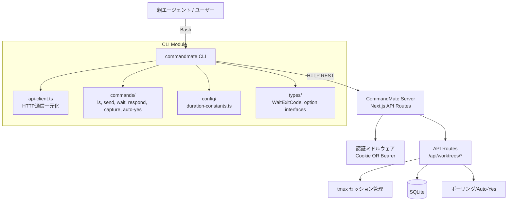

# 設計方針書: Issue #518 CLI基盤コマンドの実装

## 1. 概要

CommandMate v0.5 Agent Orchestration Phase 1 として、コーディングエージェントが CLI 経由で複数 worktree のエージェントを操作するための6つのCLIコマンド（ls / send / wait / respond / capture / auto-yes）を実装する。

## 2. アーキテクチャ設計

### 2-1. システム構成図



### 2-2. レイヤー構成

| レイヤー | 責務 | ファイル群 |
|---------|------|-----------|
| コマンド層 | CLI引数解析、バリデーション、出力フォーマット | `src/cli/commands/{ls,send,wait,respond,capture,auto-yes}.ts` |
| 通信層 | HTTP通信、認証、エラーハンドリング | `src/cli/utils/api-client.ts` |
| 設定層 | CLI固有定数、型定義 | `src/cli/config/duration-constants.ts`, `src/cli/types/index.ts` |
| サーバー層（既存） | REST API、ビジネスロジック | `src/app/api/worktrees/*/route.ts` |

### 2-3. 前提実装: middleware.ts Bearer トークン対応

CLIコマンド群の実装前に、`src/middleware.ts` の `verifyTokenEdge()` へ `Authorization: Bearer` ヘッダー抽出ロジックを追加する。Cookie OR Bearer のいずれかで認証成功とする。

> **[IA3-01] [MUST FIX] Cookie-first 検証順序の明示**: middleware.ts の認証フローでは **Cookie 検証を最初に実行し、Bearer トークンはフォールバックとしてのみ検証する**。この順序は既存のブラウザ認証（Cookie ベース）を壊さないために必須である。ブラウザリクエストが Cookie と Authorization ヘッダーの両方を含む場合（ブラウザ拡張やfetch with credentialsなど）、Bearer を先にチェックすると 401 JSON が返却されブラウザ認証が破壊される。
>
> **認証フロー（実装順序厳守）:**
>
> 1. **Cookie チェック（既存動作を維持）**: `cm_auth_token` Cookie からトークンを取得し `verifyTokenEdge()` で検証
>    - 成功: `NextResponse.next()` を返す（**ここで終了、Bearer チェックは行わない**）
>    - 失敗: 次のステップへ
> 2. **Bearer トークンチェック（フォールバック）**: `Authorization: Bearer` ヘッダーからトークンを抽出し `verifyTokenEdge()` で検証
>    - 成功: `NextResponse.next()` を返す
>    - 失敗: 次のステップへ
> 3. **認証失敗レスポンスの分岐**:
>    - リクエストに `Authorization` ヘッダーが存在する場合（= CLI リクエスト）: **HTTP 401 JSON レスポンス** を返す（`{ error: "Unauthorized" }`）。リダイレクトしない
>    - `Authorization` ヘッダーが存在しない場合（= ブラウザリクエスト）: 従来通り `/login` へリダイレクト
>
> **[DR1-10]** この分岐により、CLI は 401 ステータスコードを受け取り、`handleApiError()` で適切なエラーメッセージを表示できる。
>
> **リグレッション防止テスト**: Bearer トークン追加後、以下のシナリオを統合テストで検証すること:
> - Cookie のみのリクエスト（ブラウザ通常フロー）: 認証成功
> - Bearer のみのリクエスト（CLI フロー）: 認証成功
> - Cookie + Authorization ヘッダー両方あり: Cookie で認証成功（Bearer は無視される）
> - 無効な Cookie + 有効な Bearer: Bearer で認証成功
> - 認証情報なし: `/login` へリダイレクト
> - 無効な Bearer のみ: 401 JSON レスポンス

> **[DR2-04] 実装順序**: middleware.ts の Bearer トークン対応は、CLI コマンド群の全てが依存する前提実装である。**CLI コマンド実装より先に middleware.ts の変更を完了すること**。実装チェックリスト (Section 14) にも個別項目として明記済み。

**影響ファイル:**
- `src/middleware.ts`: Bearer トークン抽出追加 + 認証失敗時のレスポンス分岐
- `src/lib/security/auth.ts`: 必要に応じてヘルパー追加

## 3. 技術選定

| カテゴリ | 選定技術 | 選定理由 |
|---------|---------|---------|
| CLIフレームワーク | Commander.js (既存) | 既存CLIで使用済み、`addCommand()` パターンで拡張可能 |
| HTTPクライアント | Node.js 18+ 組み込み `fetch` | 外部依存追加不要、CLI軽量化 |
| テーブル出力 | 自前実装（padEnd/padStart） | 依存追加不要、簡易テーブルで十分 |
| ログ出力 | CLILogger (既存) | 既存パターン踏襲 |
| テスト | Vitest + `vi.fn()` fetchモック | 既存テスト基盤と統一 |

### 不採用とした代替案

| 代替案 | 不採用理由 |
|--------|-----------|
| axios / node-fetch | Node.js 18+ 組み込み fetch で十分。依存追加は CLI ビルドサイズ増大 |
| cli-table3 等のテーブルライブラリ | 依存追加不要。出力項目が少ないため自前で十分 |
| `@/*` パスエイリアス | tsconfig.cli.json が未対応。相対パスで統一 |

## 4. 設計パターン

### 4-1. Factory パターン（コマンド生成）

既存の `createIssueCommand()` / `createDocsCommand()` と同じパターンで各コマンドを実装。

> **[DR1-08] addCommand() パターン選択の根拠**: 既存CLIには2つのコマンド登録パターンが存在する。init/start/stop/status はインライン `program.command().action()` パターン、issue/docs は `program.addCommand(createXxxCommand())` ファクトリパターンを採用している。新規6コマンドは後者のファクトリパターンに統一する。理由: (1) Issue #264 で導入されたファクトリパターンはサブコマンドのネストに対応可能、(2) index.ts の肥大化を防止、(3) コマンドごとの独立テストが容易。
>
> **[DR2-10] 既存パターンとの対比**: 既存コマンドのシグネチャは2種類ある。
> - **インラインパターン**: `export async function startCommand(options: StartOptions): Promise<void>` -- 関数を直接 export し、index.ts 内で `program.command('start').action(startCommand)` として登録
> - **ファクトリパターン**: `export function createIssueCommand(): Command` -- `Command` オブジェクトを返す関数を export し、index.ts 内で `program.addCommand(createIssueCommand())` として登録
>
> 新規6コマンドは全て `createXxxCommand(): Command` シグネチャで統一する。

```typescript
// src/cli/commands/ls.ts
export function createLsCommand(): Command {
  const cmd = new Command('ls');
  cmd.description('List worktrees with status')
    .option('--json', 'JSON output')
    .option('--quiet', 'IDs only')
    .option('--branch <prefix>', 'Filter by branch prefix')
    .option('--token <token>', 'Auth token')
    .action(async (options: LsOptions) => { /* ... */ });
  return cmd;
}
```

### 4-2. Facade パターン（API Client）

全HTTPリクエストを `ApiClient` クラスに一元化し、ベースURL構築とHTTPリクエスト実行を担う。

> **[DR1-01] 責務分離**: ApiClient クラスは SRP に従い、以下の3つの関心事を分離する。
> - **HTTP通信**: `ApiClient` クラス本体が担う（`get<T>`, `post<T>` メソッド）
> - **トークン解決**: `resolveAuthToken(options)` ヘルパー関数として分離（`--token` > `CM_AUTH_TOKEN` の優先順位ロジック）
> - **エラー分類**: `handleApiError(error, status)` ヘルパー関数として分離（ECONNREFUSED, 401, 404, 500 のユーザー向けメッセージ生成）
>
> これらは `api-client.ts` 内のモジュールレベル関数として定義し、別ファイルへの分割は不要。テスト時に個別関数をインポートしてテスト可能にする。

> **[DR1-05] ジェネリックメソッドの使用パターン**: `get<T>` / `post<T>` のジェネリック型パラメータは呼び出し時に明示指定する。Phase 1 では以下の使用パターンを想定:
> ```typescript
> client.get<WorktreeListResponse>('/api/worktrees')
> client.get<CurrentOutputResponse>(`/api/worktrees/${id}/current-output`)
> // [DR2-05] send API のリクエストキーは content（message ではない）
> // [DR2-05] レスポンスは ChatMessage オブジェクト（201 ステータス）
> client.post<ChatMessage>(`/api/worktrees/${id}/send`, { content: message, cliToolId: agent })
> // [DR2-02] duration は文字列から parseDurationToMs() でミリ秒に変換してから送信
> client.post<void>(`/api/worktrees/${id}/auto-yes`, { enabled, duration: parseDurationToMs(options.duration), cliToolId: agent })
> // [DR2-06] prompt-response API は cliTool パラメータも受け付ける
> // レスポンスは { success: boolean; answer: string; reason?: string }
> client.post<PromptResponseResult>(`/api/worktrees/${id}/prompt-response`, { answer, cliTool: agent })
> ```
> Phase 2 以降でエンドポイント数が増加した場合、型付きラッパーメソッド（`getWorktrees()`, `postSend(id, body)` 等）の導入を検討する。

```typescript
// src/cli/utils/api-client.ts

/** トークン解決（--token > CM_AUTH_TOKEN） */
export function resolveAuthToken(options?: { token?: string }): string | undefined {
  return options?.token || process.env.CM_AUTH_TOKEN;
}

/** APIエラー分類・ユーザー向けメッセージ生成 */
export function handleApiError(error: unknown, status?: number): { message: string; exitCode: number } {
  // ECONNREFUSED -> DEPENDENCY_ERROR, 401 -> CONFIG_ERROR, etc.
}

export class ApiClient {
  private baseUrl: string;
  private token?: string;

  constructor(options?: { baseUrl?: string; token?: string }) {
    const port = process.env.CM_PORT || '3000';
    this.baseUrl = options?.baseUrl || `http://localhost:${port}`;
    this.token = resolveAuthToken(options);
  }

  async get<T>(path: string): Promise<T> { /* fetch + handleApiError */ }
  async post<T>(path: string, body?: unknown): Promise<T> { /* fetch + handleApiError */ }
}
```

### 4-3. Strategy パターン（出力フォーマット）

`--json` / `--quiet` / デフォルト の3フォーマットを統一的に扱う。

> **[DR1-02] 適用対象コマンドの限定**: `formatOutput` は複数の出力形式を持つコマンドのみが使用する。全コマンドが3フォーマットを実装するわけではない。
>
> | コマンド | 出力方式 | formatOutput 使用 |
> |---------|---------|-----------------|
> | `ls` | json / quiet / table | Yes |
> | `capture` | json / plain text | Yes（json / table のみ） |
> | `wait` | json（exit 10 時のプロンプト情報） | No（直接 `console.log` + `JSON.stringify`） |
> | `send` | 成功/エラーメッセージ | No（直接 `console.error` / `process.exit`） |
> | `respond` | 成功/エラーメッセージ | No（直接 `console.error` / `process.exit`） |
> | `auto-yes` | 成功/エラーメッセージ | No（直接 `console.error` / `process.exit`） |
>
> send, respond, auto-yes は既存 CLI パターン（docs.ts, issue.ts）と同様に `console.log` / `console.error` を直接使用する。

```typescript
type OutputFormat = 'json' | 'quiet' | 'table';

function formatOutput<T>(data: T, format: OutputFormat, formatter: {
  json: (data: T) => string;
  quiet: (data: T) => string;
  table: (data: T) => string;
}): string { /* ... */ }
```

## 5. データモデル設計

### 5-1. CLI固有型定義

> **[DR1-03] ExitCode と WaitExitCode の使い分け**: wait コマンドは以下の判定ツリーでどちらの終了コードを使用するか決定する。
> - **インフラエラー**（ECONNREFUSED, 認証失敗）: `ExitCode` を使用（DEPENDENCY_ERROR, CONFIG_ERROR）
> - **wait 固有の結果**（完了, プロンプト検出, タイムアウト）: `WaitExitCode` を使用（SUCCESS, PROMPT_DETECTED, TIMEOUT）

```typescript
// src/cli/types/index.ts に追加

/** wait コマンド専用終了コード
 * [DR2-01] ERROR: 1 は ExitCode.DEPENDENCY_ERROR = 1 と衝突するため削除。
 * インフラエラー（ECONNREFUSED, 認証失敗等）は ExitCode を使用する。
 * WaitExitCode は wait 固有の結果のみを表現する。
 */
export const WaitExitCode = {
  SUCCESS: 0,
  PROMPT_DETECTED: 10,
  TIMEOUT: 124,
} as const;
export type WaitExitCode = typeof WaitExitCode[keyof typeof WaitExitCode];

/** 各コマンドのオプション型 */
export interface LsOptions {
  json?: boolean;
  quiet?: boolean;
  branch?: string;
  token?: string;
}

export interface SendOptions {
  agent?: string;
  autoYes?: boolean;
  duration?: string;
  stopPattern?: string;
  token?: string;
}

export interface WaitOptions {
  timeout?: number;
  onPrompt?: 'agent' | 'human';
  stallTimeout?: number;
  token?: string;
}

export interface RespondOptions {
  agent?: string;
  token?: string;
}

export interface CaptureOptions {
  json?: boolean;
  agent?: string;
  token?: string;
}

export interface AutoYesOptions {
  enable?: boolean;
  disable?: boolean;
  duration?: string;
  stopPattern?: string;
  agent?: string;
  token?: string;
}
```

### 5-2. API レスポンス型（CLI側定義）

> **[DR1-06] [MUST FIX] トレーサビリティ規約**: CLI側で定義する全てのAPIレスポンス型には、サーバー側のソースオブトゥルースを参照するコメントを付与すること。これにより Phase 1 開発中の型ドリフトを防止する。
>
> **コメント規約**:
> ```typescript
> // Mirrors: src/types/models.ts Worktree + src/app/api/worktrees/route.ts session status fields
> ```
>
> **Phase 2 移行パス**:
> - 共通型の配置先: `src/types/api-contracts.ts`（新規作成）
> - サーバー側の既存型（`src/types/models.ts` の `Worktree` 等）を権威ソースとする
> - CLI側型は `api-contracts.ts` から re-export する形に移行
> - `tsconfig.cli.json` のパス設定を更新して `src/types/` をインポート可能にする

```typescript
// src/cli/types/api-responses.ts
// Mirrors: src/types/models.ts Worktree + src/app/api/worktrees/route.ts response shape

export interface WorktreeListResponse {
  worktrees: WorktreeItem[];
  repositories: unknown[];  // CLI では使用しない
}

export interface WorktreeItem {
  id: string;
  // [DR2-08] サーバー側 Worktree 型のフィールド名は "name"（"branch" ではない）
  // ls --branch フィルタは worktree.name に対してプレフィックスマッチを行う
  name: string;
  cliToolId?: string;
  isSessionRunning: boolean;
  isWaitingForResponse: boolean;
  isProcessing: boolean;
  // [DR2-09] agent フィルタ時に特定 CLI ツールのステータスを参照するために必要
  sessionStatusByCli?: Partial<Record<string, {
    isRunning: boolean;
    isWaitingForResponse: boolean;
    isProcessing: boolean;
  }>>;
  // ... 他のフィールドは必要に応じて追加
}

// [DR2-03] サーバー実態に合わせて不足フィールドを追加
// Mirrors: src/app/api/worktrees/[id]/current-output/route.ts response shape
export interface CurrentOutputResponse {
  isRunning: boolean;
  isComplete: boolean;
  isPromptWaiting: boolean;
  isGenerating: boolean;
  content: string;
  fullOutput: string;                          // [DR2-03] 追加
  realtimeSnippet: string;
  lineCount: number;
  lastCapturedLine: number;                    // [DR2-03] 追加
  promptData: PromptData | null;
  autoYes: {                                   // [DR2-03] 完全な型定義に更新
    enabled: boolean;
    expiresAt: number | null;
    stopReason?: string;
  };
  thinking: string;
  thinkingMessage: string | null;              // [DR2-03] 追加
  cliToolId?: string;
  isSelectionListActive: boolean;              // [DR2-03] 追加（wait 完了判定に影響の可能性）
  lastServerResponseTimestamp: number | null;  // [DR2-03] 追加
  serverPollerActive: boolean;                 // [DR2-03] 追加
}

// [DR2-06] prompt-response API のレスポンス型
export interface PromptResponseResult {
  success: boolean;
  answer: string;
  reason?: string;  // 'prompt_no_longer_active' 等
}

/** wait exit 10 時のCLI拡張出力型 */
export interface WaitPromptOutput {
  worktreeId: string;
  cliToolId: string;
  type: string;
  question: string;
  options: unknown[];
  status: string;
  [key: string]: unknown;  // PromptData の他フィールド
}
```

### 5-3. Duration 定数（CLI独自定義）

```typescript
// src/cli/config/duration-constants.ts

/** 許可されるduration値とミリ秒変換マップ */
export const DURATION_MAP: Record<string, number> = {
  '1h': 3_600_000,
  '3h': 10_800_000,
  '8h': 28_800_000,
} as const;

export const ALLOWED_DURATIONS = Object.keys(DURATION_MAP);

export function parseDurationToMs(duration: string): number | null {
  return DURATION_MAP[duration] ?? null;
}
```

## 6. API設計

### 6-1. コマンド-API マッピング

| CLI コマンド | HTTP メソッド | API エンドポイント |
|-------------|-------------|-------------------|
| `ls` | GET | `/api/worktrees` |
| `send` | POST | `/api/worktrees/:id/send` |
| `send --auto-yes` | POST + POST | `/api/worktrees/:id/auto-yes` → `/api/worktrees/:id/send` |
| `wait` | GET (polling) | `/api/worktrees/:id/current-output` |
| `respond` | POST | `/api/worktrees/:id/prompt-response` |
| `capture` | GET | `/api/worktrees/:id/current-output` |
| `auto-yes` | POST | `/api/worktrees/:id/auto-yes` |

> **[DR2-11] send API のセッション自動起動**: send API (`POST /api/worktrees/:id/send`) は、セッションが未起動の場合に自動的にセッションを開始する副作用がある。CLI の send コマンドは事前にセッション起動チェックを行う必要はない。

#### CLI オプション名と API ボディキーの対応表

> **[DR2-12]** 全コマンド共通で `--agent` CLI オプションは API ボディの `cliToolId`（または `cliTool`）にマッピングされる。

| CLI オプション | API ボディキー | 対象コマンド |
|---------------|--------------|-------------|
| `--agent` | `cliToolId` | send, auto-yes, capture |
| `--agent` | `cliTool` | respond (prompt-response API) |
| メッセージ引数 | `content` | send |
| 回答引数 | `answer` | respond |
| `--duration` (文字列) | `duration` (数値: `parseDurationToMs()` で変換) | auto-yes |

### 6-2. エラーハンドリング戦略

| エラー種別 | HTTPステータス | CLIの振る舞い | 終了コード |
|-----------|--------------|-------------|-----------|
| サーバー未起動 | ECONNREFUSED | エラーメッセージ + `commandmate start` を案内 | ExitCode.DEPENDENCY_ERROR (1) |
| ネットワークタイムアウト | fetch AbortError / timeout | `Server did not respond in time. Check server status.` | ExitCode.DEPENDENCY_ERROR (1) |
| 認証失敗 | 401/403 | `--token` or `CM_AUTH_TOKEN` を案内 | ExitCode.CONFIG_ERROR (2) |
| 入力バリデーションエラー | 400 | サーバーからのエラーメッセージを表示（例: `Invalid worktree ID format`） | ExitCode.CONFIG_ERROR (2) |
| レート制限 | 429 | `Rate limited. Please retry after a moment.` + リトライ案内 | ExitCode.DEPENDENCY_ERROR (1) |
| Worktree不在 | 404 | `Worktree not found: <id>` | ExitCode.UNEXPECTED_ERROR (99) |
| サーバーエラー | 500 | サーバーエラーメッセージ表示 | ExitCode.UNEXPECTED_ERROR (99) |
| タイムアウト | - | タイムアウトメッセージ | WaitExitCode.TIMEOUT (124) |

> **[IA3-09] エラーマッピングの網羅性**: `handleApiError()` は上記の全ステータスコードを網羅すること。特に HTTP 400（current-output API が不正な worktree ID フォーマットで返却）、HTTP 429（auth.ts のレートリミッターが返却）、および fetch の AbortError / TypeError（ネットワークタイムアウト、DNS 解決失敗等）は ECONNREFUSED とは異なるエラーパスであるため、個別のハンドリングが必要。各ステータスコードのテストケースを `api-client.test.ts` に追加すること。

### 6-3. 出力規則

| 出力先 | 用途 |
|--------|------|
| stdout | 最終結果のみ（JSON、テーブル、ID）。パイプライン利用を想定 |
| stderr | 進捗表示、エラーメッセージ、デバッグログ |

## 7. セキュリティ設計

### 7-1. 認証フロー

> **[IA3-01] Cookie-first 検証順序**: 以下のフローは Cookie を最初に検証する順序を明示している。詳細は Section 2-3 を参照。

```
CLI → [--token / CM_AUTH_TOKEN] → ApiClient
  → Authorization: Bearer <token> ヘッダー付与
  → Server middleware.ts
    → (1) Cookie cm_auth_token チェック → 成功なら API 実行（Bearer 無視）
    → (2) Cookie 失敗 → Authorization: Bearer チェック → 成功なら API 実行
    → (3) 両方失敗 → Authorization ヘッダー有無で分岐:
         - Authorization あり（CLI）: 401 JSON
         - Authorization なし（ブラウザ）: /login リダイレクト
```

**トークン取得優先順位:**
1. `--token <token>` コマンドオプション
2. `CM_AUTH_TOKEN` 環境変数
3. （Phase 2以降）設定ファイル（パーミッション 0600 で保護）

> **[SEC4-01] [MUST FIX] --token フラグによるトークン漏洩リスク対策**: `--token` オプションはプロセスリスト（`ps aux`）、`/proc/pid/cmdline`、シェル履歴（`.bash_history`, `.zsh_history`）にトークンが記録されるリスクがある。以下の対策を実装すること:
>
> 1. **ヘルプテキストへの警告追記**: 全コマンドの `--token` オプション description に「WARNING: Token will be visible in process list. Prefer CM_AUTH_TOKEN env var.」を明記する
> 2. **stderr 警告出力**: `resolveAuthToken()` 関数内で、`options.token` が使用された場合（= 環境変数ではなくコマンドライン引数からトークンが取得された場合）、stderr に以下の警告を1回出力する:
>    ```
>    Warning: --token flag exposes token in process list and shell history. Use CM_AUTH_TOKEN environment variable instead.
>    ```
> 3. **Phase 2**: 設定ファイル（`~/.commandmate/config.json`、パーミッション 0600）からのトークン読み込みを優先的に実装する

> **[SEC4-02] [MUST FIX] HTTP 通信におけるトークン平文送信の警告**: `ApiClient` のコンストラクタで `baseUrl` が以下の条件を満たす場合、stderr に警告を出力すること:
>
> - `baseUrl` が `localhost`、`127.0.0.1`、`::1` 以外のホストを指している **かつ** `https://` ではない場合
>
> 警告メッセージ:
> ```
> Warning: Connecting to remote server over HTTP. Auth token will be sent in plaintext. Use HTTPS for non-localhost connections.
> ```
>
> **設計上の注意**: この警告は `ApiClient` コンストラクタ内で1回のみ出力する。ポーリング等で繰り返し出力しないこと。

### 7-2. 入力バリデーション

| パラメータ | バリデーション |
|-----------|-------------|
| worktree ID | 英数字 + ハイフンのみ（既存 `isValidWorktreeId()` に準拠）。**[SEC4-04]** ApiClient の URL パス構築時にも `encodeURIComponent()` を適用するか、各コマンドの action ハンドラ冒頭で `isValidWorktreeId()` を必ず呼び出すガードパターンを採用すること（パストラバーサル防止） |
| message | 空文字列禁止、最大長は API 側で制御 |
| duration | `1h` / `3h` / `8h` のいずれか |
| agent | `CLI_TOOL_IDS` に含まれる値。[DR2-07] `tsconfig.cli.json` の `include` が `src/cli/**/*` のみのため `src/lib/cli-tools/types.ts` への相対インポートはビルドエラーになる可能性がある。以下のいずれかで対応すること: **(A)** `tsconfig.cli.json` の `include` に `src/lib/cli-tools/types.ts` を追加（最小スコープ拡張）、**(B)** `CLI_TOOL_IDS` と `isCliToolType()` のサブセットを `src/cli/config/cli-tool-ids.ts` に複製し、DR1-09 同様のクロスバリデーションテストで同期を保証する |
| timeout | 正の整数 |
| stop-pattern | 文字列（サーバー側で正規表現バリデーション）。**[SEC4-06]** CLI 側で事前に長さチェック（`MAX_STOP_PATTERN_LENGTH = 500`）を実施する。超過時は「stop-pattern exceeds maximum length of 500 characters」エラーを表示して終了する。サーバーから 400 エラーが返された場合（safe-regex2 による ReDoS 検出等）のエラーメッセージ表示も実装すること |

### 7-3. コマンドインジェクション防止

- CLI は HTTP リクエストのみ発行し、シェルコマンド実行はしない
- ユーザー入力は JSON ボディに格納して送信（文字列連結によるURL構築はしない）

### 7-4. 認証・認可の前提と制限事項

> **[SEC4-03] [SHOULD FIX] Phase 1 の認可モデル**: Phase 1 では Bearer トークンによる認証（authentication）のみを実装し、コマンド単位の認可（authorization）は実装しない。有効なトークンを持つ CLI ユーザーは全ての worktree に対して全操作（send, auto-yes, respond 等）が可能である。
>
> **前提**: Phase 1 は単一ユーザー/ローカル利用を想定しており、この制限は許容範囲である。
>
> **Phase 2 検討**: マルチユーザー対応時にスコープベースの認可を導入する。例: read-only トークン（ls, capture, wait のみ許可）、write トークン（全操作許可）。

> **[SEC4-05] [SHOULD FIX] Bearer 認証失敗のレート制限**: サーバー側 `auth.ts` には `createRateLimiter()`（5回失敗で15分ロックアウト）が実装されている。ただし `middleware.ts` は Edge Runtime であり、`auth.ts` のレートリミッター（Node.js ランタイム）を直接参照できない可能性がある。
>
> **Phase 1 対応**: middleware.ts の Bearer 認証失敗パスでレートリミッターが適用されるかを実装時に確認する。Edge Runtime 制約がある場合、API Route レベル（Node.js ランタイム）でのレート制限適用を検討すること。
>
> **確認事項**: `middleware.ts` の `verifyTokenEdge()` 失敗時に `recordFailure()` が呼ばれる設計になっているか、実装時に検証すること。

### 7-5. 監査ログ

> **[SEC4-07] [SHOULD FIX] CLI リクエストのサーバー側監査ログ**: Phase 1 では以下の最低限のログ記録を実装する:
>
> - **Bearer トークン認証失敗**: `middleware.ts` で認証失敗時に IP アドレス付きでログ記録する（`console.warn` レベル）
>
> **Phase 2 検討**: CLI 操作の監査ログ（操作種別、worktree ID、タイムスタンプ、ソース識別子）の導入を計画する。対象イベント:
> - send コマンドによるエージェント操作
> - auto-yes の有効化/無効化
> - respond コマンドによるプロンプト応答

## 8. パフォーマンス設計

### 8-1. ポーリング戦略（wait コマンド）

| パラメータ | 値 | 理由 |
|-----------|---|------|
| ポーリング間隔 | 5秒 | [IA3-02] サーバー側 tmux-capture-cache の TTL=2秒 とのオーバーラップを確保。3秒では毎回キャッシュ期限切れとなりヒット率が約0%になる。5秒間隔なら同一 worktree を監視する UI（ブラウザ）のポーリングによるキャッシュ恩恵を受けられる |
| デフォルトタイムアウト | なし（明示指定必須ではない） | 長時間タスク対応 |
| stall-timeout | 300秒（デフォルトなし、オプション指定時のみ） | 無応答検出 |

> **[IA3-02] キャッシュ TTL とポーリング間隔の整合性**: サーバー側 `tmux-capture-cache.ts` はキャプチャ結果を TTL=2秒でキャッシュし、同一プロセス内の並行リクエストは singleflight パターンで統合する。ただし CLI からの HTTP リクエストは別プロセスのため singleflight の恩恵はない。ポーリング間隔を5秒に設定することで、ブラウザ UI のポーリング（別経路でキャッシュを温める）との間にキャッシュヒットの可能性が生まれる。Phase 2 では SSE（Server-Sent Events）またはロングポーリングによるポーリング廃止を検討する。

### 8-2. 複数 worktree 同時待機

```typescript
// wait abc123 def456 の場合
const results = await Promise.allSettled(
  worktreeIds.map(id => pollWorktree(id, options))
);
```

> **[DR1-07] エラー分離方針**: 複数 worktree の同時待機では `Promise.allSettled` を使用し、1つの worktree でネットワークエラーが発生しても他の worktree の監視を継続する。終了コード解決戦略: 全て成功なら 0、プロンプト検出があれば 10、いずれかがエラーなら最初の非ゼロ終了コードを返す。`--json` オプション指定時は全 worktree の結果を配列で出力する。

- 各 worktree のポーリングは独立して並列実行
- サーバー側 tmux-capture-cache (TTL=2秒) により重複キャプチャは最小化

> **[IA3-08] 複数 CLI インスタンスの並行ポーリング制限**: 同一 worktree に対して複数の CLI プロセスが `commandmate wait` を実行した場合、各プロセスが独立してポーリングを行うため、サーバー負荷が N 倍になる。tmux-capture-cache の singleflight パターンはプロセス内の並行リクエストにのみ有効であり、HTTP リクエスト間では機能しない。**Phase 1 での想定利用パターン**: 1つの worktree につき wait を実行する CLI インスタンスは1つのみ。**Phase 2 検討**: current-output API に ETag / If-None-Match ヘッダーを追加し、出力が変化していない場合は 304 Not Modified を返却する条件付きリクエストの導入を検討する。

## 9. テスト設計

### 9-1. テスト戦略

| テスト種別 | 対象 | 手法 |
|-----------|------|------|
| 単体テスト | ApiClient, duration 変換, 出力フォーマット, ステータス導出 | `vi.fn()` で fetch モック |
| コマンドテスト | 各コマンドの引数解析・バリデーション | Commander.js の `parseAsync` テスト |
| 統合テスト | サーバーとの接続フロー | モックサーバー or 実サーバー |

### 9-2. fetchモックヘルパー

> **[IA3-05] global.fetch リストア機構**: `mock-api.ts` は `global.fetch` を上書きするため、テスト間の干渉を防ぐために `restoreFetch()` リストア関数を提供し、各テストファイルの `afterEach` で呼び出すこと。既存テストヘルパー（logger-mock.ts 等）は `global.fetch` を操作しないが、将来の追加テストとの干渉を防ぐためにも必須。

```typescript
// tests/helpers/mock-api.ts
const originalFetch = global.fetch;

export function mockFetchResponse(data: unknown, status = 200): void {
  global.fetch = vi.fn().mockResolvedValue({
    ok: status >= 200 && status < 300,
    status,
    json: () => Promise.resolve(data),
    text: () => Promise.resolve(JSON.stringify(data)),
  });
}

export function mockFetchError(error: string): void {
  global.fetch = vi.fn().mockRejectedValue(new Error(error));
}

/** テスト後に global.fetch を元に戻す。afterEach で呼び出すこと */
export function restoreFetch(): void {
  global.fetch = originalFetch;
}
```

> **使用パターン**:
> ```typescript
> import { mockFetchResponse, restoreFetch } from '../../../helpers/mock-api';
> afterEach(() => { restoreFetch(); });
> ```

### 9-3. クロスバリデーションテスト（必須）

> **[IA3-03] [IA3-04] 重要度引き上げ: nice_to_have -> should_fix**: Stage 3 影響分析により、CLI側とサーバー側で型定義・定数が二重管理されるリスクが Phase 1 開発中に顕在化する可能性が高いと判断。クロスバリデーションテストを推奨（nice_to_have）から必須推奨（should_fix）に引き上げる。

> **[DR1-09] [IA3-04] Duration 定数クロスバリデーション**: CLI側 `DURATION_MAP` の全キーに対して `parseDurationToMs()` を適用した出力値が、サーバー側 `ALLOWED_DURATIONS`（`src/config/auto-yes-config.ts`）の値と完全一致することを検証する。テスト環境（`tests/` ディレクトリ）では CLI ビルドスコープ外のモジュールもインポート可能なため、コンパイル時の安全ネットとして機能する。

> **[IA3-03] API レスポンス型クロスバリデーション**: Duration 定数に加え、以下の型定義についてもサーバー側との整合性を検証するテストを追加すること:
> - `CurrentOutputResponse` の主要フィールド名がサーバー側レスポンスと一致すること
> - `WorktreeListResponse` の構造がサーバー側 `/api/worktrees` のレスポンスと一致すること
> - テストファイル: `tests/unit/cli/config/cross-validation.test.ts`（新規）
>
> これにより、サーバー側 API が変更された場合にテストが即座に失敗し、CLI 側の型定義更新が必要であることを検出できる。

### 9-4. テストファイル構成

```
tests/unit/cli/
├── commands/
│   ├── ls.test.ts
│   ├── send.test.ts
│   ├── wait.test.ts
│   ├── respond.test.ts
│   ├── capture.test.ts
│   └── auto-yes.test.ts
├── utils/
│   └── api-client.test.ts
└── config/
    └── duration-constants.test.ts
```

## 10. 実装ファイル一覧

### 新規作成

| ファイル | 責務 |
|---------|------|
| `src/cli/commands/ls.ts` | ls コマンド |
| `src/cli/commands/send.ts` | send コマンド |
| `src/cli/commands/wait.ts` | wait コマンド |
| `src/cli/commands/respond.ts` | respond コマンド |
| `src/cli/commands/capture.ts` | capture コマンド |
| `src/cli/commands/auto-yes.ts` | auto-yes コマンド |
| `src/cli/utils/api-client.ts` | HTTP クライアント |
| `src/cli/utils/output-formatter.ts` | 出力フォーマットユーティリティ（ls, capture のみ使用。DR1-04: Phase 1 では ls.ts 内に定義し、capture で再利用が必要になった時点で抽出しても可） |
| `src/cli/config/duration-constants.ts` | Duration 定数 |
| `src/cli/types/api-responses.ts` | API レスポンス型 |
| `tests/helpers/mock-api.ts` | fetch モックヘルパー |
| `tests/unit/cli/commands/ls.test.ts` | ls テスト |
| `tests/unit/cli/commands/send.test.ts` | send テスト |
| `tests/unit/cli/commands/wait.test.ts` | wait テスト |
| `tests/unit/cli/commands/respond.test.ts` | respond テスト |
| `tests/unit/cli/commands/capture.test.ts` | capture テスト |
| `tests/unit/cli/commands/auto-yes.test.ts` | auto-yes テスト |
| `tests/unit/cli/utils/api-client.test.ts` | ApiClient テスト |
| `tests/unit/cli/config/duration-constants.test.ts` | Duration テスト |
| `tests/unit/cli/config/cross-validation.test.ts` | [IA3-03][IA3-04] CLI/サーバー間型・定数クロスバリデーションテスト |

### 変更

| ファイル | 変更内容 |
|---------|---------|
| `src/cli/index.ts` | 6コマンドの `addCommand()` 登録追加 |
| `src/cli/types/index.ts` | WaitExitCode, 各コマンドOptions型追加 |
| `src/middleware.ts` | Bearer トークン認証サポート追加 |
| `src/lib/security/auth.ts` | Bearer トークン抽出ヘルパー（必要に応じて） |

## 11. 設計上の決定事項とトレードオフ

| 決定事項 | 理由 | トレードオフ |
|---------|------|-------------|
| Node.js 組み込み fetch 使用 | 依存最小化、CLI ビルドサイズ抑制 | axios 等のリトライ機能が使えない |
| CLI 側で API レスポンス型を独自定義 | tsconfig.cli.json の制約回避 | DRY 違反（Phase 2 で共通化予定） |
| Duration 定数を CLI 側で独自定義 | safe-regex2 依存の回避 | DRY 違反（Phase 2 で共通化予定） |
| wait の exit code を 10 番台に配置 | 既存 ExitCode enum との衝突回避 | GNU 慣例と一部異なる |
| isComplete フィールドを使わない | 実装が isPromptWaiting と同値で紛らわしい | API の意図と実装のギャップ |
| prompt-response API を使用 | messageId 不要、ステートレス | respond API の方が機能リッチ |

## 12. Phase 2 以降の検討事項

- exit 3（LLM/ネットワークエラー検出）のパターン定義と実装
- **[SEC4-01] 設定ファイルベース認証**: `~/.commandmate/config.json`（パーミッション 0600）からのトークン読み込みを優先的に実装する。`--token` フラグおよび環境変数よりも安全なトークン保持方法として位置づける
- **[DR1-06] CLI / サーバー間の共通型定義移行**:
  - 共通型の配置先: `src/types/api-contracts.ts`（新規作成）
  - 含める型: `WorktreeListResponse`, `CurrentOutputResponse`, `WaitPromptOutput` 等
  - サーバー側の既存型（`src/types/models.ts` の `Worktree`）を権威ソース（single source of truth）とする
  - CLI 側は `api-contracts.ts` からの re-export に切り替え
  - `tsconfig.cli.json` の `paths` / `include` を更新して `src/types/` を参照可能にする
- **[DR1-05] ApiClient 型付きラッパーメソッド**: エンドポイント数増加時に `getWorktrees()`, `postSend()` 等のラッパーを導入
- Duration 定数の共通化
- `capture --full` オプション
- セッション未起動時のエラー返却オプション
- **[IA3-02] ポーリング廃止**: SSE（Server-Sent Events）またはロングポーリングによる wait コマンドのポーリング廃止
- **[IA3-08] 条件付きリクエスト**: current-output API に ETag / If-None-Match ヘッダーを追加し、出力未変更時の処理負荷を削減
- **[SEC4-03] スコープベース認可**: マルチユーザー対応時に read-only トークン / write トークンの認可レイヤーを導入
- **[SEC4-07] CLI 操作監査ログ**: 操作種別、worktree ID、タイムスタンプ、ソース識別子を含む監査ログの導入
- **[SEC4-08] 環境変数のプロセス間漏洩対策**: 設定ファイルベース認証（パーミッション 0600）による `CM_AUTH_TOKEN` 環境変数の代替
- **[SEC4-09] baseUrl ホワイトリスト検証**: baseUrl を外部公開する場合、許可ホストのホワイトリスト検証を追加
- **[SEC4-11] CLI 配布のサプライチェーン対策**: npm publish 時の package-lock.json 固定、npm audit の CI 統合

## 13. レビュー指摘事項サマリー

### Stage 1: 設計原則レビュー

| ID | 重要度 | カテゴリ | タイトル | 対応セクション | ステータス |
|----|--------|---------|---------|--------------|-----------|
| DR1-06 | must_fix | DRY | APIレスポンス型のトレーサビリティ規約・Phase 2 移行パス | Section 5-2, 12 | 反映済 |
| DR1-01 | should_fix | SOLID | ApiClient の責務分離（トークン解決・エラー分類の関数抽出） | Section 4-2 | 反映済 |
| DR1-02 | should_fix | SOLID | 出力フォーマッター適用対象コマンドの明確化 | Section 4-3 | 反映済 |
| DR1-05 | should_fix | YAGNI | ジェネリックメソッドの使用パターン文書化 | Section 4-2, 12 | 反映済 |
| DR1-08 | should_fix | SOLID | addCommand() パターン選択の根拠追記 | Section 4-1 | 反映済 |
| DR1-10 | should_fix | SOLID | middleware の CLI 向け 401 JSON レスポンス分岐 | Section 2-3 | 反映済 |
| DR1-03 | nice_to_have | SOLID | ExitCode / WaitExitCode 使い分け判定ツリー | Section 5-1 | 反映済 |
| DR1-04 | nice_to_have | KISS | output-formatter.ts の YAGNI 考慮 | Section 10 | 反映済 |
| DR1-07 | nice_to_have | KISS | Promise.allSettled によるエラー分離 | Section 8-2 | 反映済 |
| DR1-09 | nice_to_have | DRY | Duration 定数クロスバリデーションテスト | Section 9-3 | 反映済 |

### Stage 2: 整合性レビュー

| ID | 重要度 | カテゴリ | タイトル | 対応セクション | ステータス |
|----|--------|---------|---------|--------------|-----------|
| DR2-01 | must_fix | consistency | WaitExitCode.ERROR=1 が ExitCode.DEPENDENCY_ERROR=1 と衝突 | Section 5-1 | 反映済 |
| DR2-02 | must_fix | consistency | auto-yes API の duration: CLI文字列をミリ秒変換して送信する手順が未記載 | Section 4-2, 6-1 | 反映済 |
| DR2-03 | must_fix | consistency | CurrentOutputResponse 型にサーバー実態の6フィールドが不足 | Section 5-2 | 反映済 |
| DR2-04 | should_fix | consistency | middleware.ts Bearer 対応の実装順序注記 | Section 2-3 | 反映済 |
| DR2-05 | should_fix | consistency | send API リクエストキーが message ではなく content | Section 4-2 | 反映済 |
| DR2-06 | should_fix | consistency | prompt-response API のリクエスト/レスポンス形状不足 | Section 4-2, 5-2 | 反映済 |
| DR2-07 | should_fix | consistency | isCliToolType() の CLI ビルドスコープ外インポート問題 | Section 7-2 | 反映済 |
| DR2-08 | should_fix | consistency | WorktreeItem.branch はサーバー側では name フィールド | Section 5-2 | 反映済 |
| DR2-09 | should_fix | consistency | WorktreeItem に sessionStatusByCli が未定義 | Section 5-2 | 反映済 |
| DR2-10 | nice_to_have | consistency | ファクトリパターンと既存パターンの対比明確化 | Section 4-1 | 反映済 |
| DR2-11 | nice_to_have | consistency | send API のセッション自動起動の副作用を明記 | Section 6-1 | 反映済 |
| DR2-12 | nice_to_have | consistency | CLI オプション名と API ボディキーの対応表追加 | Section 6-1 | 反映済 |

### Stage 3: 影響分析レビュー

| ID | 重要度 | カテゴリ | タイトル | 対応セクション | ステータス |
|----|--------|---------|---------|--------------|-----------|
| IA3-01 | must_fix | middleware_regression | middleware.ts Bearer トークン追加時の Cookie-first 検証順序の明示 | Section 2-3, 7-1 | 反映済 |
| IA3-02 | should_fix | api_load | wait コマンド 3秒ポーリングとキャッシュ TTL=2秒のミスマッチ | Section 8-1 | 反映済（5秒に変更） |
| IA3-03 | should_fix | build_impact | API レスポンス型のクロスバリデーションテスト引き上げ | Section 9-3 | 反映済 |
| IA3-04 | should_fix | dependency_impact | Duration 定数クロスバリデーションテスト引き上げ | Section 9-3 | 反映済 |
| IA3-05 | should_fix | test_infrastructure | mock-api.ts の global.fetch リストア機構追加 | Section 9-2 | 反映済 |
| IA3-08 | should_fix | concurrent_polling | 複数 CLI インスタンスの並行ポーリング制限の文書化 | Section 8-2 | 反映済 |
| IA3-09 | should_fix | error_propagation | handleApiError の HTTP 400/429/timeout エラーマッピング追加 | Section 6-2 | 反映済 |
| IA3-06 | nice_to_have | binary_entry_point | bin/commandmate.js 変更不要の確認（ポジティブ所見） | - | 確認済 |
| IA3-07 | nice_to_have | command_conflict | 既存コマンドとの命名衝突なしの確認（ポジティブ所見） | - | 確認済 |

### Stage 4: セキュリティレビュー

| ID | 重要度 | OWASP | タイトル | 対応セクション | ステータス |
|----|--------|-------|---------|--------------|-----------|
| SEC4-01 | must_fix | A04 | --token フラグによるトークン漏洩リスク（stderr 警告 + ヘルプテキスト） | Section 7-1 | 反映済 |
| SEC4-02 | must_fix | A05 | HTTP 通信におけるトークン平文送信（非 localhost 警告） | Section 7-1 | 反映済 |
| SEC4-03 | should_fix | A01 | Bearer トークン認証は認証のみで認可がない（Phase 1 制限事項） | Section 7-4, 12 | 反映済 |
| SEC4-04 | should_fix | A03 | worktree ID の URL パス構築における安全性確認 | Section 7-2 | 反映済 |
| SEC4-05 | should_fix | A07 | CLI 経由の認証失敗に対するレート制限の適用確認 | Section 7-4 | 反映済 |
| SEC4-06 | should_fix | A03 | --stop-pattern の ReDoS リスクに対する CLI 側バリデーション不足 | Section 7-2 | 反映済 |
| SEC4-07 | should_fix | A09 | CLI リクエストのサーバー側ログ記録が未設計 | Section 7-5, 12 | 反映済 |
| SEC4-08 | consider | A02 | CM_AUTH_TOKEN 環境変数のプロセス間漏洩リスク | Section 12 | 反映済 |
| SEC4-09 | consider | A10 | ApiClient の baseUrl による SSRF リスク | Section 12 | 反映済 |
| SEC4-10 | consider | A06 | 新規外部依存なし（ポジティブ所見） | - | 確認済 |
| SEC4-11 | consider | A08 | CLI ビルドパイプラインのサプライチェーンリスク | Section 12 | 反映済 |
| SEC4-12 | consider | A03 | message / answer 引数の入力サニタイズ（既存対策で十分） | - | 確認済 |

## 14. 実装チェックリスト

### 必須（must_fix）

- [ ] **[DR1-06]** `src/cli/types/api-responses.ts` の全型定義にサーバー側ソースオブトゥルースを参照するコメントを付与する
  - 例: `// Mirrors: src/types/models.ts Worktree + src/app/api/worktrees/route.ts`
- [ ] **[DR1-06]** Section 12 の Phase 2 移行パスに従い、`src/types/api-contracts.ts` の設計を Phase 2 タスクとして起票する
- [ ] **[DR2-01]** `WaitExitCode` から `ERROR: 1` を削除する。インフラエラーは `ExitCode` を使用し、wait 固有結果は `SUCCESS: 0`, `PROMPT_DETECTED: 10`, `TIMEOUT: 124` のみとする
- [ ] **[DR2-02]** auto-yes コマンドの実装で、CLI が受け取った文字列 duration ('1h' 等) を `parseDurationToMs()` でミリ秒数値に変換してから API に送信する。ApiClient の post 呼び出しで変換を実施すること
- [ ] **[DR2-03]** `CurrentOutputResponse` 型に以下のフィールドを追加する: `fullOutput`, `lastCapturedLine`, `thinkingMessage`, `isSelectionListActive`, `lastServerResponseTimestamp`, `serverPollerActive`。`autoYes` の型を `{ enabled: boolean; expiresAt: number | null; stopReason?: string }` に更新する
- [ ] **[IA3-01]** `middleware.ts` の認証フローで **Cookie 検証を最初に実行し、Bearer トークンはフォールバックとしてのみ検証する**。Cookie 成功時は Bearer チェックをスキップすること。Section 2-3 のフロー順序を厳守する
- [ ] **[IA3-01]** middleware Bearer 対応後、以下のリグレッションテストシナリオを実装する: (1) Cookie のみ成功、(2) Bearer のみ成功、(3) Cookie+Bearer 両方ありで Cookie 優先、(4) 無効 Cookie + 有効 Bearer で Bearer 成功、(5) 認証情報なしでリダイレクト、(6) 無効 Bearer のみで 401 JSON
- [ ] **[SEC4-01]** 全コマンドの `--token` オプションのヘルプテキストに「WARNING: Token will be visible in process list. Prefer CM_AUTH_TOKEN env var.」を明記する
- [ ] **[SEC4-01]** `resolveAuthToken()` 関数で `options.token` が使用された場合、stderr に「Warning: --token flag exposes token in process list and shell history. Use CM_AUTH_TOKEN environment variable instead.」を1回出力する
- [ ] **[SEC4-02]** `ApiClient` コンストラクタで `baseUrl` が localhost/127.0.0.1/::1 以外かつ https:// でない場合、stderr に HTTP 平文通信の警告を1回出力する

### 推奨（should_fix）

- [ ] **[DR1-01]** `api-client.ts` で `resolveAuthToken()` と `handleApiError()` をモジュールレベル関数として export する
- [ ] **[DR1-01]** `api-client.test.ts` で `resolveAuthToken` と `handleApiError` を個別にテストする
- [ ] **[DR1-02]** `ls.ts` と `capture.ts` のみ `formatOutput` を使用する。`send`, `respond`, `auto-yes` は `console.log` / `console.error` を直接使用する
- [ ] **[DR1-05]** ApiClient の `get<T>` / `post<T>` 呼び出しで型パラメータを明示指定する
- [ ] **[DR1-08]** 全6コマンドを `createXxxCommand()` ファクトリ関数 + `program.addCommand()` パターンで実装する
- [ ] **[DR1-10]** `middleware.ts` で `Authorization` ヘッダーの有無により認証失敗レスポンスを分岐する（CLI: 401 JSON / ブラウザ: リダイレクト）
- [ ] **[DR2-04]** `middleware.ts` の Bearer トークン対応を **CLI コマンド実装より先に** 完了する（全 CLI コマンドの前提実装）
- [ ] **[DR2-05]** send API のリクエストボディキーは `content`（`message` ではない）を使用する。レスポンス型は `ChatMessage` とする
- [ ] **[DR2-06]** prompt-response API のリクエストに `cliTool` パラメータを含める。レスポンス型 `PromptResponseResult` を `api-responses.ts` に追加する。`success: false` 時の `reason` 検査ロジックを respond コマンドに実装する
- [ ] **[DR2-07]** `isCliToolType()` / `CLI_TOOL_IDS` のインポート方法を決定する: (A) `tsconfig.cli.json` の `include` 拡張、または (B) `src/cli/config/cli-tool-ids.ts` に複製 + クロスバリデーションテスト
- [ ] **[DR2-08]** `WorktreeItem.branch` ではなく `WorktreeItem.name` を使用する（サーバー側 Worktree 型に合わせる）
- [ ] **[DR2-09]** `WorktreeItem` に `sessionStatusByCli` フィールドを追加し、agent フィルタ時に特定 CLI ツールのステータスを参照可能にする

#### Stage 4 セキュリティ should_fix

- [ ] **[SEC4-03]** Section 7-4 に Phase 1 の認可モデル前提（単一トークンによる全操作許可）を文書化する。Phase 2 計画にスコープベース認可を追加する
- [ ] **[SEC4-04]** 各コマンドの action ハンドラ冒頭で `isValidWorktreeId()` を必ず呼び出すガードパターンを実装する。または ApiClient の get/post メソッド内で worktree ID セグメントに `encodeURIComponent()` を適用する
- [ ] **[SEC4-05]** `middleware.ts` の Bearer 認証失敗パスでレートリミッター（`recordFailure()`）が適用されるかを実装時に検証する。Edge Runtime 制約がある場合、API Route レベルでのレート制限を検討する
- [ ] **[SEC4-06]** CLI 側で `--stop-pattern` の長さチェック（`MAX_STOP_PATTERN_LENGTH = 500`）を事前に実施する。超過時はエラーメッセージを表示して終了する
- [ ] **[SEC4-06]** サーバーから 400 エラーが返された場合（safe-regex2 による ReDoS 検出等）の CLI 側エラーメッセージ表示を実装する
- [ ] **[SEC4-07]** `middleware.ts` で Bearer トークン認証失敗時に IP アドレス付きでログ記録する（`console.warn` レベル）

#### Stage 3 影響分析 should_fix

- [ ] **[IA3-02]** wait コマンドのポーリング間隔を **5秒** に設定する（3秒ではキャッシュ TTL=2秒とのミスマッチでヒット率が約0%になるため）
- [ ] **[IA3-03]** `tests/unit/cli/config/cross-validation.test.ts` を新規作成し、`CurrentOutputResponse` と `WorktreeListResponse` の主要フィールド名がサーバー側レスポンスと一致することを検証するテストを追加する
- [ ] **[IA3-04]** Duration 定数クロスバリデーションテストで、`parseDurationToMs()` の全出力値がサーバー側 `ALLOWED_DURATIONS` と完全一致することを検証する（DR1-09 の引き上げ）
- [ ] **[IA3-05]** `tests/helpers/mock-api.ts` に `restoreFetch()` 関数を追加し、全 CLI コマンドテストの `afterEach` で呼び出す
- [ ] **[IA3-08]** wait コマンドのヘルプテキストまたはドキュメントに「1 worktree につき 1 CLI インスタンスでの使用を推奨」を明記する
- [ ] **[IA3-09]** `handleApiError()` に HTTP 400（CONFIG_ERROR）、429（DEPENDENCY_ERROR + リトライ案内）、fetch AbortError/TypeError（DEPENDENCY_ERROR）のハンドリングを追加する
- [ ] **[IA3-09]** `api-client.test.ts` に HTTP 400、429、fetch timeout の各テストケースを追加する

### 推奨（nice_to_have）

- [ ] **[DR1-03]** wait コマンドでインフラエラーは `ExitCode` を、wait 固有結果は `WaitExitCode` を使用する
- [ ] **[DR1-04]** `output-formatter.ts` の作成タイミングを検討する（ls.ts 内定義 → capture で再利用時に抽出、または初めから分離）
- [ ] **[DR1-07]** 複数 worktree 待機で `Promise.allSettled` を使用し、エラー分離を実装する
- [ ] **[DR1-09]** Duration 定数のクロスバリデーションテストを追加する
- [ ] **[DR2-10]** 新規コマンドの `createXxxCommand(): Command` シグネチャが既存の `startCommand()` 関数 export パターンと異なることをコード内コメントで明記する
- [ ] **[DR2-11]** send コマンドの実装で、API がセッション未起動時に自動起動する動作を把握し、CLI 側で事前チェック不要であることを確認する
- [ ] **[DR2-12]** CLI の `--agent` オプションを API ボディの `cliToolId` (send, auto-yes, capture) または `cliTool` (respond) にマッピングする
- [ ] **[IA3-07]** `src/cli/index.ts` にコメントブロックを追加し、インフラコマンド群（init/start/stop/status）とエージェントオーケストレーションコマンド群（ls/send/wait/respond/capture/auto-yes）を分離する
- [ ] **[SEC4-08]** Phase 2 の設定ファイルベース認証ではファイルパーミッション 0600 での保護を実装する
- [ ] **[SEC4-09]** baseUrl を外部公開する場合は許可ホストのホワイトリスト検証を追加する
- [ ] **[SEC4-12]** message 引数の最大長制限を CLI 側でも実施することを検討する（サーバー側 tmux send-keys のエスケープは既存 execFile で対応済み）

## 15. レビュー履歴

| 日付 | ステージ | レビュー種別 | 指摘数 | 反映数 |
|------|---------|------------|--------|--------|
| 2026-03-18 | Stage 1 | 設計原則レビュー | 10 (must:1, should:5, nice:4) | 10/10 |
| 2026-03-18 | Stage 2 | 整合性レビュー | 12 (must:3, should:6, nice:3) | 12/12 |
| 2026-03-18 | Stage 3 | 影響分析レビュー | 9 (must:1, should:6, nice:2) | 9/9 |
| 2026-03-18 | Stage 4 | セキュリティレビュー | 12 (must:2, should:5, consider:5) | 12/12 |

---

*Generated by design-policy command for Issue #518*
*Date: 2026-03-18*
*Stage 1 review applied: 2026-03-18*
*Stage 2 review applied: 2026-03-18*
*Stage 3 review applied: 2026-03-18*
*Stage 4 review applied: 2026-03-18*
