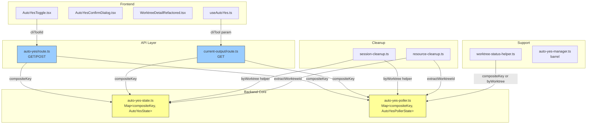

# Issue #525: Auto-Yesエージェント毎独立制御 設計方針書

## 1. 概要

### 目的
Auto-Yes機能の状態管理キーを`worktreeId`単体から`worktreeId:cliToolId`複合キーに変更し、UIからエージェント毎に独立したAuto-Yes制御を可能にする。

### スコープ
- バックエンド: 状態管理・ポーラー・API・クリーンアップの複合キー対応
- フロントエンド: エージェントタブ毎のトグルUI・状態表示
- スコープ外: Auto-Yes状態のDB永続化（in-memory管理を維持）

---

## 2. アーキテクチャ設計

### システム構成図（変更箇所）



### レイヤー構成（変更の流れ）

```
1. auto-yes-state.ts    ← 最初に変更（他の全てが依存）
2. auto-yes-poller.ts   ← state.tsの新シグネチャを使用
3. auto-yes/route.ts    ← API層のcliToolId渡し修正
4. current-output/route.ts ← 参照のみ修正
5. session-cleanup.ts   ← byWorktreeヘルパー使用
6. resource-cleanup.ts  ← extractWorktreeId使用
7. worktree-status-helper.ts ← 参照修正
8. Frontend (Toggle/Dialog/Detail/Hook)
```

---

## 3. 複合キー設計

### キー形式

```typescript
// [SF-002] 区切り文字の定数化
const COMPOSITE_KEY_SEPARATOR = ':' as const;

// 複合キーの形式
type CompositeKey = `${string}:${CLIToolType}`;  // "worktreeId:claude"

// ヘルパー関数（auto-yes-state.ts内に配置 ※SF-003参照）
export function buildCompositeKey(worktreeId: string, cliToolId: CLIToolType): string {
  return `${worktreeId}${COMPOSITE_KEY_SEPARATOR}${cliToolId}`;
}

export function extractWorktreeId(compositeKey: string): string {
  const lastIndex = compositeKey.lastIndexOf(COMPOSITE_KEY_SEPARATOR);
  return lastIndex === -1 ? compositeKey : compositeKey.substring(0, lastIndex);
}

export function extractCliToolId(compositeKey: string): CLIToolType | null {
  const lastIndex = compositeKey.lastIndexOf(COMPOSITE_KEY_SEPARATOR);
  if (lastIndex === -1) return null;
  const cliToolId = compositeKey.substring(lastIndex + 1);
  return isValidCliTool(cliToolId) ? cliToolId : null;
}
```

### [SEC4-SF-004] 設計判断: `lastIndexOf(':')` の理由と防御的アサーション

worktreeIdにコロンが含まれる可能性は低い（`isValidWorktreeId()`で英数字+ハイフンに制限）が、念のため最後のコロンで分割する。

**重要な前提条件:** `COMPOSITE_KEY_SEPARATOR`（コロン）を区切り文字として使用するためには、worktreeIdにコロンが含まれないことが必須である。この前提は`isValidWorktreeId()`のバリデーションルールに暗黙的に依存しているため、将来`isValidWorktreeId()`の許容文字が変更された場合にcompositeKeyの分解が破壊されるリスクがある。

**防御策:**
1. `buildCompositeKey`のJSDocに「worktreeIdにCOMPOSITE_KEY_SEPARATORが含まれていないことが前提」である旨を明記すること
2. `buildCompositeKey`内でworktreeIdに`COMPOSITE_KEY_SEPARATOR`が含まれていないことをアサーションで検証する防御的コードを追加すること

```typescript
/**
 * compositeKeyを生成する。
 * @precondition worktreeId に COMPOSITE_KEY_SEPARATOR (':') が含まれていないこと。
 *   この前提は isValidWorktreeId() で英数字+ハイフンに制限されていることに依存する。
 *   isValidWorktreeId() の許容文字を変更する場合は本関数への影響を必ず確認すること。
 */
export function buildCompositeKey(worktreeId: string, cliToolId: CLIToolType): string {
  if (worktreeId.includes(COMPOSITE_KEY_SEPARATOR)) {
    throw new Error(`worktreeId must not contain '${COMPOSITE_KEY_SEPARATOR}': ${worktreeId}`);
  }
  return `${worktreeId}${COMPOSITE_KEY_SEPARATOR}${cliToolId}`;
}
```

### [SF-003] 複合キーヘルパー関数の配置判断

`buildCompositeKey` / `extractWorktreeId` / `extractCliToolId` は auto-yes-state.ts 以外のモジュール（poller, cleanup, resource-cleanup）からも使用されるユーティリティである。SRP の観点からは独立した `auto-yes-key.ts` への分離が望ましい。

**実装時の判断基準:**
- 利用箇所が3モジュール以上に広がる場合 → `auto-yes-key.ts` に分離
- auto-yes-state.ts のファイルサイズが大きくなりすぎる場合 → 分離
- 現在のファイルサイズで収まる場合 → auto-yes-state.ts 内に留めても可

いずれの場合も barrel ファイル（auto-yes-manager.ts）からの re-export で外部インターフェースは統一する。

### [SF-001] byWorktreeフィルタリングのDRY原則

auto-yes-state.ts と auto-yes-poller.ts の両方で `keys().filter(key => extractWorktreeId(key) === worktreeId)` パターンが重複するリスクがある。以下の方針で対処する。

**方針:** auto-yes-poller.ts の byWorktree ヘルパー実装では、auto-yes-state.ts の `getCompositeKeysByWorktree()` を直接再利用するか、ジェネリックなフィルタリング関数を共有ユーティリティとして抽出する。

```typescript
// 推奨パターン A: state.ts の関数を poller.ts から再利用
// auto-yes-poller.ts 内
import { getCompositeKeysByWorktree } from './auto-yes-state';

export function stopAutoYesPollingByWorktree(worktreeId: string): void {
  // state側のキー取得ではなくpoller自身のMapを走査する必要があるため、
  // 共通フィルタ関数を使う
  const pollerKeys = Array.from(pollerStates.keys())
    .filter(key => extractWorktreeId(key) === worktreeId);
  pollerKeys.forEach(key => stopAutoYesPolling(key));
}

// 推奨パターン B: ジェネリック関数を共有（ヘルパー分離時）
// auto-yes-key.ts
export function filterKeysByWorktree(keys: Iterable<string>, worktreeId: string): string[] {
  return Array.from(keys).filter(key => extractWorktreeId(key) === worktreeId);
}
```

### byWorktreeヘルパー関数

```typescript
// worktreeIdに属する全エージェントのキーを取得
export function getCompositeKeysByWorktree(worktreeId: string): string[] {
  return Array.from(autoYesStates.keys())
    .filter(key => extractWorktreeId(key) === worktreeId);
}

// worktreeId指定で全エージェント分を一括削除
export function deleteAutoYesStateByWorktree(worktreeId: string): number {
  const keys = getCompositeKeysByWorktree(worktreeId);
  keys.forEach(key => autoYesStates.delete(key));
  return keys.length;
}
```

---

## 4. バックエンド設計

### 4-1. auto-yes-state.ts の変更

#### インターフェース変更

```typescript
// 変更なし（cliToolIdはキーに含まれるため、状態オブジェクト内には不要）
export interface AutoYesState {
  enabled: boolean;
  enabledAt: number;
  expiresAt: number;
  stopPattern?: string;
  stopReason?: AutoYesStopReason;
}
```

#### 関数シグネチャ変更

| 関数 | 変更前 | 変更後 |
|------|--------|--------|
| `setAutoYesEnabled` | `(worktreeId, enabled, duration?, stopPattern?)` | `(worktreeId, cliToolId, enabled, duration?, stopPattern?)` |
| `getAutoYesState` | `(worktreeId)` | `(worktreeId, cliToolId)` |
| `disableAutoYes` | `(worktreeId, reason?)` | `(worktreeId, cliToolId, reason?)` |
| `deleteAutoYesState` | `(worktreeId)` | `(compositeKey)` ※直接キー指定（バリデーション注意: 下記参照） |
| `checkStopCondition` | `(worktreeId, cleanOutput, onStopMatched?)` | `(compositeKey, cleanOutput, onStopMatched?)` ※下記注記参照 |
| `getAutoYesStateWorktreeIds` | `()` → `string[]` | `()` → `string[]` ※返り値が複合キー配列に変化 |

#### [CS-MF-002] checkStopCondition の onStopMatched コールバック型変更

compositeKey化に伴い、`checkStopCondition` の `onStopMatched` コールバックの引数型も変更が必要である。

**変更前:**
```typescript
onStopMatched?: (worktreeId: string) => void;
// 呼び出し例: checkStopCondition(worktreeId, newContent, stopAutoYesPolling)
// stopAutoYesPolling は (worktreeId: string) => void
```

**変更後:**
```typescript
onStopMatched?: (compositeKey: string) => void;
// 呼び出し例: checkStopCondition(compositeKey, newContent, stopAutoYesPolling)
// stopAutoYesPolling は (compositeKey: string) => void （Section 4-2 参照）
```

**影響範囲:**
- `auto-yes-poller.ts` の `processStopConditionDelta` 関数: `checkStopCondition` を呼び出す箇所で、第1引数を `compositeKey` に変更し、第3引数の `onStopMatched` コールバックも `stopAutoYesPolling(compositeKey)` を呼ぶ形に変更する必要がある
- `processStopConditionDelta` 自体の引数も `worktreeId` から `compositeKey` に変更するか、内部で `buildCompositeKey(worktreeId, cliToolId)` を呼ぶ必要がある（CS-C-003 参照）
- `disableAutoYes` もコールバック連鎖内で呼ばれる場合があるため、`compositeKey` から `extractWorktreeId` / `extractCliToolId` で分解して呼び出す

#### [MF-001] compositeKey引数に対するバリデーション戦略

`deleteAutoYesState(compositeKey)` および `checkStopCondition(compositeKey, ...)` は引数がcompositeKey形式に変更されるため、既存の `isValidWorktreeId()` バリデーションがそのままでは適用できない。以下のバリデーション方針を適用する。

```typescript
// compositeKeyバリデーション方針:
// 1. extractWorktreeId() で worktreeId を抽出
// 2. 抽出した worktreeId に対して isValidWorktreeId() を適用
// 3. extractCliToolId() で cliToolId を抽出し isValidCliTool() で検証
//
// 実装例（deleteAutoYesState内）:
function deleteAutoYesState(compositeKey: string): boolean {
  const worktreeId = extractWorktreeId(compositeKey);
  if (!isValidWorktreeId(worktreeId)) {
    return false;  // バリデーション失敗
  }
  const cliToolId = extractCliToolId(compositeKey);
  if (!cliToolId) {
    return false;  // 不正なcliToolId
  }
  return autoYesStates.delete(compositeKey);
}
```

この方針は `deleteAutoYesState` と `checkStopCondition` の両方に適用する。compositeKeyを直接受け取る全ての公開関数で、内部的に分解してバリデーションを行うこと。

#### 新規追加関数

| 関数 | シグネチャ | 説明 |
|------|----------|------|
| `buildCompositeKey` | `(worktreeId, cliToolId) → string` | 複合キー生成 |
| `extractWorktreeId` | `(compositeKey) → string` | worktreeId抽出 |
| `extractCliToolId` | `(compositeKey) → CLIToolType \| null` | cliToolId抽出 |
| `getCompositeKeysByWorktree` | `(worktreeId) → string[]` | worktree配下の全キー |
| `deleteAutoYesStateByWorktree` | `(worktreeId) → number` | 一括削除 |

### 4-2. auto-yes-poller.ts の変更

#### Map キー変更

```typescript
// Before
globalThis.__autoYesPollerStates: Map<string, AutoYesPollerState>  // key: worktreeId

// After
globalThis.__autoYesPollerStates: Map<string, AutoYesPollerState>  // key: compositeKey
```

#### 関数シグネチャ変更（公開API）

| 関数 | 変更前 | 変更後 |
|------|--------|--------|
| `startAutoYesPolling` | `(worktreeId, cliToolId)` | `(worktreeId, cliToolId)` ※内部でcompositeKey生成 |
| `stopAutoYesPolling` | `(worktreeId)` | `(compositeKey)` |
| `isPollerActive` | `(worktreeId)` | `(compositeKey)` |
| `getLastServerResponseTimestamp` | `(worktreeId)` | `(compositeKey)` |
| `getAutoYesPollerWorktreeIds` | `()` → `string[]` | `()` → `string[]` ※返り値が複合キー配列 |

#### [IA-MF-002] 内部関数群のcompositeKey対応方針

auto-yes-poller.ts には公開APIの他に、以下の内部関数群が存在し、全て現在 `worktreeId` をキーとして `pollerStates` (Map) を操作している。compositeKey化に伴い、これら全ての内部関数の引数変更が必要である。

**内部関数の分類と変更方針:**

| 分類 | 関数名 | 現行引数 | 変更方針 |
|------|--------|---------|---------|
| **ポーリングループ** | `pollAutoYes` | `(worktreeId, cliToolId)` | 引き続き `(worktreeId, cliToolId)` を受け取り、内部で `buildCompositeKey` する。ポーリングループの起点であり、tmux操作に `worktreeId` と `cliToolId` の両方が必要なため |
| **スケジューリング** | `scheduleNextPoll` | `(worktreeId, cliToolId)` | `pollAutoYes` と同様に `(worktreeId, cliToolId)` を受け取り、内部で `buildCompositeKey` する |
| **コンテキスト検証** | `validatePollingContext` | `(worktreeId)` | `(compositeKey)` に変更。pollerStates の参照のみで worktreeId/cliToolId の分解が不要 |
| **キャプチャ処理** | `captureAndCleanOutput` | `(worktreeId, cliToolId)` | 引き続き `(worktreeId, cliToolId)` を受け取る。tmux capture に両方必要 |
| **プロンプト検出** | `detectAndRespondToPrompt` | `(worktreeId, cliToolId, ...)` | 引き続き `(worktreeId, cliToolId)` を受け取る。tmux send-keys に両方必要 |
| **タイムスタンプ更新** | `updateLastServerResponseTimestamp` | `(worktreeId)` | `(compositeKey)` に変更。pollerStates の更新のみ |
| **エラーカウント** | `resetErrorCount` | `(worktreeId)` | `(compositeKey)` に変更。pollerStates の更新のみ |
| **エラーカウント** | `incrementErrorCount` | `(worktreeId)` | `(compositeKey)` に変更（**[IA-MF-001] 参照**） |
| **状態取得** | `getPollerState` | `(worktreeId)` | `(compositeKey)` に変更。pollerStates の参照のみ |
| **重複判定** | `isDuplicatePrompt` | `(worktreeId, ...)` | `(compositeKey, ...)` に変更。pollerStates の参照のみ |
| **停止条件** | `processStopConditionDelta` | `(worktreeId, ...)` | `(compositeKey, ...)` に変更（CS-MF-002 で既に言及） |

**設計原則:**
- tmux操作（capture/send-keys）が必要な関数 → `(worktreeId, cliToolId)` を引数に取り、内部で `buildCompositeKey` して pollerStates にアクセス
- pollerStates (Map) の参照・更新のみの関数 → `(compositeKey)` を直接受け取る
- この分類により、compositeKey の生成・分解が最小限の箇所に集約される

#### [IA-MF-001] incrementErrorCount 内の disableAutoYes/stopAutoYesPolling のcompositeKey対応

`incrementErrorCount()` は連続エラー上限到達時に `disableAutoYes()` と `stopAutoYesPolling()` を呼び出してポーラーを停止する。compositeKey化後、これらの呼び出し引数を正しく変更する必要がある。

```typescript
// 変更前（現行実装 auto-yes-poller.ts L187-188 付近）
function incrementErrorCount(worktreeId: string): void {
  const state = pollerStates.get(worktreeId);
  if (!state) return;
  state.consecutiveErrors++;
  if (state.consecutiveErrors >= MAX_CONSECUTIVE_ERRORS) {
    disableAutoYes(worktreeId, 'consecutive_errors');  // worktreeIdのみ
    stopAutoYesPolling(worktreeId);                     // worktreeIdのみ
  }
}

// 変更後（compositeKey対応）
function incrementErrorCount(compositeKey: string): void {
  const state = pollerStates.get(compositeKey);
  if (!state) return;
  state.consecutiveErrors++;
  if (state.consecutiveErrors >= MAX_CONSECUTIVE_ERRORS) {
    // compositeKey から worktreeId と cliToolId を分解して disableAutoYes に渡す
    const worktreeId = extractWorktreeId(compositeKey);
    const cliToolId = extractCliToolId(compositeKey);
    if (cliToolId) {
      disableAutoYes(worktreeId, cliToolId, 'consecutive_errors');
    }
    stopAutoYesPolling(compositeKey);  // compositeKey をそのまま渡す
  }
}
```

**注意事項:**
- `disableAutoYes` は Section 4-1 の通り `(worktreeId, cliToolId, reason?)` のシグネチャであるため、compositeKey を分解して渡す必要がある
- `stopAutoYesPolling` は compositeKey を直接受け取るシグネチャ（本 Section 4-2 の公開API変更参照）であるため、そのまま渡す
- `extractCliToolId` が `null` を返すケースは、compositeKey が不正な場合のみであり、正常なポーラー動作中には発生しない。ただし防御的に `null` チェックを行う

#### 新規追加関数

| 関数 | シグネチャ | 説明 |
|------|----------|------|
| `stopAutoYesPollingByWorktree` | `(worktreeId) → void` | worktree配下の全ポーラー停止 |
| `isAnyPollerActiveForWorktree` | `(worktreeId) → boolean` | いずれかのポーラーがアクティブか |
| `getLatestServerResponseTimestampForWorktree` | `(worktreeId) → number \| null` | 全エージェント中の最新タイムスタンプ |

#### startAutoYesPolling の変更

```typescript
// [CS-SF-001] Idempotencyチェックの設計意図:
// 既存実装では worktreeId ベースで cliToolId が異なる場合は停止→再作成していたが、
// compositeKey 化後は同じ compositeKey = 同じ (worktreeId, cliToolId) の組合せであるため、
// cliToolId 比較ロジックは不要になる。compositeKey が同じなら必然的に同一エージェント。
// 異なるエージェントの場合は異なる compositeKey となるため、別のポーラーとして独立管理される。
export function startAutoYesPolling(
  worktreeId: string,
  cliToolId: CLIToolType
): StartPollingResult {
  const compositeKey = buildCompositeKey(worktreeId, cliToolId);

  // Idempotencyチェック: 同じcompositeKeyの既存ポーラーがあれば再利用
  // (compositeKey にcliToolIdが含まれるため、既存実装の cliToolId 比較は不要)
  const existing = pollerStates.get(compositeKey);
  if (existing?.timerId) {
    return { started: false, reason: 'already_running' };
  }

  // 既存ポーラーが存在するがtimerId未設定の場合（停止済み状態）は、
  // 既存エントリを削除して新規作成する
  if (existing) {
    pollerStates.delete(compositeKey);
  }

  // MAX_CONCURRENT_POLLERS チェック（全compositeKey合計）
  if (getActivePollerCount() >= MAX_CONCURRENT_POLLERS) {
    return { started: false, reason: 'max_concurrent_reached' };
  }

  // 新規ポーラー作成（compositeKeyをMapキーに使用）
  // ...
}
```

### 4-3. API設計

#### GET `/api/worktrees/:id/auto-yes`

```typescript
// クエリパラメータ: ?cliToolId=claude
// [SEC4-SF-003] GET APIにもisValidWorktreeIdバリデーションを追加（POST側と同等のセキュリティレベル）
export async function GET(
  request: NextRequest,  // _request → request に変更
  { params }: { params: { id: string } }
): Promise<NextResponse> {
  // [SEC4-SF-003] worktreeIdフォーマット検証（POST側と同等）
  if (!isValidWorktreeId(params.id)) {
    return NextResponse.json({ error: 'Invalid worktree ID format' }, { status: 400 });
  }

  const cliToolId = request.nextUrl.searchParams.get('cliToolId');

  if (cliToolId && isValidCliTool(cliToolId)) {
    // 指定エージェントの状態を返却
    const state = getAutoYesState(params.id, cliToolId);
    return NextResponse.json({
      enabled: state?.enabled ?? false,
      expiresAt: state?.expiresAt ?? null,
    });
  }

  // パラメータ省略時: 全エージェントの状態をマップ形式で返却
  const allKeys = getCompositeKeysByWorktree(params.id);
  const states: Record<string, AutoYesResponse> = {};
  for (const key of allKeys) {
    const toolId = extractCliToolId(key);
    if (toolId) {
      const state = getAutoYesState(params.id, toolId);
      states[toolId] = {
        enabled: state?.enabled ?? false,
        expiresAt: state?.expiresAt ?? null,
      };
    }
  }
  return NextResponse.json(states);
}
```

#### [IA-SF-002] GET API の cliToolId パラメータ追加に伴うフロントエンド影響

GET `/api/worktrees/:id/auto-yes` に `cliToolId` クエリパラメータが追加されることに伴い、フロントエンド側でこのAPIを呼び出している箇所でも `cliToolId` を付与する必要がある。

**影響を受けるフロントエンドコンポーネント:**

| コンポーネント/フック | 現行の呼び出し | 変更後 |
|---------------------|--------------|--------|
| `useAutoYes.ts` | GET `/api/worktrees/${id}/auto-yes` | GET `/api/worktrees/${id}/auto-yes?cliToolId=${cliTool}` |
| `WorktreeDetailRefactored.tsx` | useAutoYes 経由（間接） | useAutoYes の cliTool パラメータで制御（変更不要） |

**注意:** `useAutoYes.ts` は既に `cliTool` パラメータを受け取っているため、GET リクエストURLに `cliToolId` クエリパラメータを付与する変更のみで対応可能。フック利用側（WorktreeDetailRefactored.tsx 等）の変更は不要。

#### POST `/api/worktrees/:id/auto-yes`

```typescript
// [CS-MF-001] cliToolId引数を明示的に渡す
// [SEC4-SF-002] 不正なcliToolIdは400エラーで明示的に拒否する（デフォルトフォールバック禁止）
export async function POST(
  request: NextRequest,
  { params }: { params: { id: string } }
): Promise<NextResponse> {
  const body = await request.json();
  // [SEC4-SF-002] cliToolId省略時のデフォルト'claude'は後方互換性のため維持する。
  // ただし、不正な値（存在しないツールID等）が明示的に指定された場合は
  // デフォルトへのフォールバックではなく400エラーで拒否すること。
  // 既存実装(route.ts L156-158)のフォールバック動作を廃止し、本設計に統一する。
  const cliToolId = body.cliToolId ?? 'claude';

  if (!isValidCliTool(cliToolId)) {
    // 不正なcliToolIdを暗黙的にclaudeにフォールバックすると、
    // 意図しないエージェントにauto-yesが有効化されるリスクがある。
    // 明示的に拒否し、クライアントに正しい値の指定を求める。
    return NextResponse.json({ error: 'Invalid cliToolId' }, { status: 400 });
  }

  if (body.enabled) {
    // enable時: cliToolIdを第2引数として渡す（Section 4-1 シグネチャ変更に準拠）
    setAutoYesEnabled(params.id, cliToolId, body.enabled, body.duration, body.stopPattern);
    startAutoYesPolling(params.id, cliToolId);
  } else {
    // disable時:
    //   - cliToolId指定あり → 該当エージェントのみ停止
    //   - cliToolId指定なし → worktreeIdプレフィックスで全エージェント停止
    if (body.cliToolId) {
      const compositeKey = buildCompositeKey(params.id, cliToolId);
      stopAutoYesPolling(compositeKey);
      disableAutoYes(params.id, cliToolId, 'manual');
    } else {
      stopAutoYesPollingByWorktree(params.id);
      // 全エージェント分を無効化
      const keys = getCompositeKeysByWorktree(params.id);
      for (const key of keys) {
        const toolId = extractCliToolId(key);
        if (toolId) disableAutoYes(params.id, toolId, 'manual');
      }
    }
  }
  // ...
}
```

#### GET `/api/worktrees/:id/current-output`

```typescript
// [CS-SF-002] 既存cliToolパラメータの取得・バリデーション・compositeKey生成
const cliToolRaw = request.nextUrl.searchParams.get('cliTool') ?? 'claude';

// cliTool パラメータの型バリデーション（CLIToolType への変換）
// isCliToolType() を使用して有効なツールIDか検証する（CS-C-001 参照）
if (!isCliToolType(cliToolRaw)) {
  return NextResponse.json(
    { error: `Invalid cliTool: ${cliToolRaw}` },
    { status: 400 }
  );
}
const cliTool: CLIToolType = cliToolRaw;
const compositeKey = buildCompositeKey(params.id, cliTool);

// [IA-SF-001] autoYes: 単一オブジェクト形式を維持（後方互換）
// getAutoYesState も cliTool パラメータを渡してエージェント毎の状態を取得する
const autoYesState = getAutoYesState(params.id, cliTool);  // ※ worktreeId + cliTool の2引数必須
const serverPollerActive = isPollerActive(compositeKey);
const lastServerResponseTimestamp = getLastServerResponseTimestamp(compositeKey);
```

### 4-4. クリーンアップ設計

#### session-cleanup.ts

[CS-SF-004] 既存実装（session-cleanup.ts L87）では CLI_TOOL_IDS のforループ内で各エージェントのリソースを順次クリーンアップしている。auto-yes の停止・削除処理について、以下2つのアプローチを比較検討した上で byWorktree ヘルパー方式を採用する。

| アプローチ | 説明 | メリット | デメリット |
|-----------|------|---------|-----------|
| **A: byWorktreeヘルパー** | `stopAutoYesPollingByWorktree(worktreeId)` で一括停止 | 呼び出し側がシンプル、auto-yes固有のキー走査を隠蔽 | 既存forループと独立した走査が発生（二重走査） |
| **B: 既存forループ内統合** | CLI_TOOL_IDS ループ内で `stopAutoYesPolling(buildCompositeKey(worktreeId, cliToolId))` を呼ぶ | 既存ループを活用し走査が1回で完結 | auto-yes停止ロジックがcleanup関数に分散、forループの責務が増加 |

**採用: アプローチA（byWorktreeヘルパー）**

理由:
- auto-yes の内部キー構造（compositeKey）をクリーンアップ側に露出させない
- byWorktree ヘルパーは他の箇所（resource-cleanup.ts 等）でも再利用可能
- 二重走査のコストは auto-yes エントリ数が少ないため無視できる

```typescript
// worktree削除時: byWorktreeヘルパーで全エージェント分クリーンアップ
export async function cleanupWorktreeSessions(...) {
  // ... 既存のforループ（CLI_TOOL_IDS）でセッション停止等 ...

  // auto-yes: byWorktreeヘルパーで一括クリーンアップ（forループ外）
  stopAutoYesPollingByWorktree(worktreeId);    // 全エージェント分
  deleteAutoYesStateByWorktree(worktreeId);    // 全エージェント分
  // ...
}
```

#### resource-cleanup.ts

```typescript
// 孤立エントリ検出: compositeKeyからworktreeIdを抽出してDB照合
// [SEC4-MF-001] extractWorktreeIdの戻り値に対するisValidWorktreeIdバリデーションを必須とする
export function cleanupOrphanedMapEntries() {
  const compositeKeys = getAutoYesStateWorktreeIds();  // 複合キー配列
  const validWorktreeIds = new Set(dbWorktreeIds);

  for (const compositeKey of compositeKeys) {
    const worktreeId = extractWorktreeId(compositeKey);
    // [SEC4-MF-001] extractWorktreeIdの戻り値をDB照合前にバリデーション
    if (!isValidWorktreeId(worktreeId)) {
      logger.warn(`Invalid worktreeId extracted from compositeKey: ${compositeKey}`);
      deleteAutoYesState(compositeKey);  // 不正なキーのエントリを削除
      continue;
    }
    if (!validWorktreeIds.has(worktreeId)) {
      deleteAutoYesState(compositeKey);  // 孤立エントリ削除
    }
  }
  // ポーラーも同様
}
```

### 4-5. worktree-status-helper.ts

```typescript
// cliToolId毎ループ内で適切なcompositeKeyを使用
for (const cliToolId of cliToolIds) {
  const compositeKey = buildCompositeKey(worktreeId, cliToolId);
  const lastServerResponseTs = getLastServerResponseTimestamp(compositeKey);
  // ...
}
```

---

## 5. フロントエンド設計

### 5-1. コンポーネント変更

#### WorktreeDetailRefactored.tsx

```typescript
// 変更: auto-yes状態がアクティブタブのcliToolIdに紐づく
// useAutoYes hookのcliToolパラメータにactiveTabのcliToolIdを渡す
const { lastAutoResponse } = useAutoYes({
  worktreeId,
  cliTool: activeCliToolId,  // アクティブタブのエージェント
  // ...
});
```

#### AutoYesToggle.tsx

```typescript
// 変更: cliToolNameの表示を強化
// エージェント名をトグルラベルに含める
// 例: "Auto-Yes (Claude): ON  残り 2:30:00"
```

#### AutoYesConfirmDialog.tsx

```typescript
// 変更: 確認ダイアログにエージェント名を表示
// "Claude の Auto-Yes を有効にしますか？"
```

### 5-2. useAutoYes.ts

```typescript
// 既にcliToolパラメータを受け取っている
// 変更: serverPollerActiveチェックがcompositeKey対応のAPIレスポンスを使用
// current-output APIが既にcliToolパラメータで絞り込むため、フック側の変更は最小
```

---

## 6. 後方互換性

### 保証する互換性

| 項目 | 互換性 | 根拠 |
|------|--------|------|
| CLI `auto-yes --agent` | 維持 | API POSTのcliToolIdパラメータは変更なし |
| CLI `capture --json` | 維持 | current-output APIのautoYesフィールド型は変更なし |
| CLI `send --auto-yes` | 維持 | [IA-SF-003] API POST の body.cliToolId フィールド名は変更なし。CLI側のリクエストボディ構造に変更不要。API内部で cliToolId を第2引数として `setAutoYesEnabled` に渡す変更はAPI層で吸収される |
| single agent利用時 | 維持 | cliToolIdデフォルト='claude'で従来と同じ動作 |
| useAutoYes hook | 維持 | cliToolパラメータ既存 |

### 破壊的変更

| 項目 | 影響 | 対策 |
|------|------|------|
| `setAutoYesEnabled`シグネチャ | 全呼び出し元 | コンパイルエラーで検出可能 |
| `stopAutoYesPolling`引数 | 全呼び出し元 | compositeKey必須化 |
| `getAutoYesState`シグネチャ | 全呼び出し元 | cliToolId必須化 |
| `getAutoYesStateWorktreeIds`返値 | resource-cleanup等 | extractWorktreeIdで対応 |

---

## 7. セキュリティ設計

### 既存セキュリティの維持

- [SEC-MF-001] worktreeId形式検証: 変更なし
- [SEC-SF-002] duration ホワイトリスト: 変更なし
- [SEC-SF-003] stopPattern ReDoS防止: 変更なし
- [SEC-SF-004] cliToolId ホワイトリスト: 変更なし

### 新規セキュリティ考慮

- `buildCompositeKey`: 入力の`worktreeId`と`cliToolId`は呼び出し前に既存バリデーションで検証済みを前提。[SEC4-SF-004] worktreeIdにCOMPOSITE_KEY_SEPARATORが含まれていないことをアサーションで検証する防御的コードを含む（Section 3 参照）
- `extractWorktreeId`: 不正なキー形式に対してフォールバック（元の文字列を返す）
- **[MF-001] compositeKey引数のバリデーション**: `deleteAutoYesState(compositeKey)` と `checkStopCondition(compositeKey, ...)` では、compositeKeyを `extractWorktreeId()` + `extractCliToolId()` で分解し、それぞれ `isValidWorktreeId()` / `isValidCliTool()` でバリデーションを行う。詳細は Section 4-1 の「compositeKey引数に対するバリデーション戦略」を参照
- **[SEC4-MF-001] extractWorktreeIdの全使用箇所でのバリデーション必須ルール**: `extractWorktreeId(compositeKey)` はコロンが含まれない場合に元の文字列をそのまま返すフォールバック動作を持つ。この戻り値が `isValidWorktreeId()` バリデーションなしに後続処理（DB照合等）に渡された場合、不正な文字列がworktreeIdとして扱われるリスクがある（OWASP A03:2021 Injection）。以下のルールを適用する:
  - `extractWorktreeId()` の戻り値を使用する全ての箇所で `isValidWorktreeId()` チェックを必須とする
  - 特に `resource-cleanup.ts` の `cleanupOrphanedMapEntries` 内で `extractWorktreeId` の結果を DB 照合する前にバリデーションを行うこと
  - `stopAutoYesPollingByWorktree` 内部でも同様にバリデーションを行うこと
  - バリデーション失敗時は処理をスキップし、[SEC4-C-001] に従いlogger.warnレベルでログを記録すること
- **[SEC4-SF-002] POST APIでの不正cliToolIdの明示的拒否**: `body.cliToolId` に不正な値が指定された場合は、デフォルト'claude'へのフォールバックではなく400エラーで拒否する。既存実装(route.ts L156-158)のフォールバック動作を廃止する。cliToolId省略時のデフォルト'claude'は後方互換性のため維持する（Section 4-3 POST API 参照）
- **[SEC4-SF-003] GET APIのworktreeIdバリデーション**: GET `/api/worktrees/:id/auto-yes` のハンドラ先頭にも `isValidWorktreeId(params.id)` バリデーションを追加し、POST側と同等のセキュリティレベルを適用する（Section 4-3 GET API 参照）

---

## 8. パフォーマンス設計

### リソース影響

| 項目 | 変更前 | 変更後 | 影響 |
|------|--------|--------|------|
| ポーラー数/worktree | 最大1 | 最大5（CLIToolType数: claude, codex, gemini, vibe-local, opencode） | 軽微 |
| Map エントリ数 | N worktrees | N x 最大5 | 軽微 |
| tmux capture頻度 | 2秒/worktree | 2秒/agent/worktree | 同一tmuxセッションへの負荷増 |

### MAX_CONCURRENT_POLLERS

[CS-SF-003] 現在値: 50。CLI_TOOL_IDS は ['claude', 'codex', 'gemini', 'vibe-local', 'opencode'] の5ツールであるため、同一worktreeで最大5エージェント同時ポーリングの場合、10 worktrees で上限到達。実運用では2エージェント同時が典型的なため、現在の制限値で十分。必要に応じて将来拡大。

**注意:** CLIToolType の数が増減した場合、上記の上限到達計算を再評価すること。

#### [SEC4-SF-001] per-worktreeポーラー上限の検討

compositeKey化により同一worktreeで最大5ポーラーが同時稼働可能になる。MAX_CONCURRENT_POLLERS=50は全compositeKey合計で制御されるが、悪意あるクライアント（認証済み）が全worktreeの全エージェントに対してauto-yesを有効化するDoSベクトルが存在する。

**検討結果:**
- **per-worktree上限（MAX_POLLERS_PER_WORKTREE）**: 本Issueでは導入しない。理由: 実運用で1 worktreeに5エージェント全てを同時にauto-yesで稼働させるユースケースは正当であり、上限を設けると正当な利用を制限するリスクがある。MAX_CONCURRENT_POLLERS=50の全体上限で十分なDoS防止が提供される
- **レート制限**: auto-yes POST APIエンドポイントに対するレート制限は、Issue #153, #225 でも指摘されている既知の課題である。本Issueのスコープ外とするが、compositeKey化により攻撃面が拡大（worktree数 x agent数）するため、将来のIssueとして優先度を上げて検討すること
- **リスク認識**: 認証ミドルウェアにより未認証リクエストは拒否されるため、リスクは認証済みクライアントからの攻撃に限定される。ローカルネットワーク内での使用が前提であり、実質的なリスクは低い

---

## 9. 設計上の決定事項とトレードオフ

### 採用した設計

| 決定事項 | 理由 | トレードオフ |
|---------|------|-------------|
| 文字列複合キー `worktreeId:cliToolId` | シンプル、既存Map構造を維持 | ネストMapより型安全性が低い |
| byWorktreeヘルパー関数 | クリーンアップの明示性 | 線形走査のコスト（エントリ数少なく問題なし） |
| current-output APIの単一オブジェクト維持 | CLI後方互換性 | UI側で全エージェント状態の一括取得が非効率 |
| cliToolIdデフォルト='claude' | 単一エージェント利用時の後方互換 | 暗黙のデフォルトによる混乱の可能性 |

### 代替案との比較

| 代替案 | メリット | デメリット | 判定 |
|--------|---------|-----------|------|
| ネストMap `Map<worktreeId, Map<cliToolId, State>>` | 型安全、byWorktree操作が自然 | 既存コード大幅変更、globalThisパターンとの不整合 | 不採用 |
| AutoYesStateにcliToolIdフィールド追加 | Stateオブジェクト自体に情報を持つ | キーの冗長性、検索時の非効率 | 不採用 |
| DB永続化と同時対応 | 再起動耐性 | スコープ肥大化、別Issue切り出し推奨 | 不採用 |

---

## 10. テスト戦略

### 単体テスト（優先度高）

1. **auto-yes-state.ts**: buildCompositeKey/extractWorktreeId/extractCliToolId、複合キーでのCRUD、byWorktreeヘルパー
2. **auto-yes-poller.ts**: 複合キーでの起動/停止、byWorktreeヘルパー、同一worktreeの複数ポーラー同時稼働
3. **API route**: cliToolIdパラメータの受け渡し、GET/POSTの複合キー対応
4. **クリーンアップ**: 孤立エントリの正しい検出・削除

### 結合テスト

- 複数エージェント同時auto-yes有効化 → 独立した状態保持の確認
- エージェントA無効化 → エージェントBの状態が保持されることの確認

### 既存テスト更新

- `tests/unit/lib/auto-yes-manager.test.ts` — [IA-SF-004] validatePollingContext, captureAndCleanOutput, processStopConditionDelta, detectAndRespondToPrompt のテストが含まれており、compositeKey化で全て影響を受ける
- `tests/unit/lib/worktree-status-helper.test.ts`
- `tests/integration/auto-yes-persistence.test.ts`
- `tests/unit/auto-yes-manager-cleanup.test.ts`
- `tests/unit/session-cleanup-issue404.test.ts`
- `tests/unit/resource-cleanup.test.ts`

---

## 11. 実装順序

```
Phase 1: 基盤（auto-yes-state.ts）
  1-1. COMPOSITE_KEY_SEPARATOR定数定義 [SF-002]
  1-2. buildCompositeKey/extractWorktreeId/extractCliToolId [SF-003: 配置判断]
  1-3. Mapキー複合キー化
  1-4. 関数シグネチャ変更
  1-5. deleteAutoYesState/checkStopConditionのcompositeKeyバリデーション実装 [MF-001]
  1-6. byWorktreeヘルパー追加（filterKeysByWorktree共通化検討）[SF-001]
  1-7. 単体テスト（バリデーション失敗ケース含む）
  1-8. auto-yes-manager.ts barrel更新（新規export追加）[C-004]

Phase 2: ポーラー（auto-yes-poller.ts）
  2-1. Mapキー複合キー化
  2-2. 公開API関数のキー統一（stopAutoYesPolling, isPollerActive等）
  2-3. 内部関数群のcompositeKey対応 [IA-MF-002]
       - pollerStates参照のみの関数: compositeKey引数に変更
       - tmux操作が必要な関数: (worktreeId, cliToolId)を維持し内部でbuildCompositeKey
  2-4. incrementErrorCount のcompositeKey対応 [IA-MF-001]
       - disableAutoYes呼び出しでcompositeKey分解
       - stopAutoYesPolling呼び出しでcompositeKey直接渡し
  2-5. byWorktreeヘルパー追加（state.tsのフィルタ関数再利用）[SF-001]
  2-6. startAutoYesPolling同時実行対応
  2-7. 単体テスト（auto-yes-manager.test.ts更新含む）[IA-SF-004]
  2-8. auto-yes-manager.ts barrel更新 [C-004]

Phase 3: API層
  3-1. auto-yes/route.ts GET/POST修正
  3-2. current-output/route.ts修正
  3-3. API単体テスト

Phase 4: クリーンアップ
  4-1. session-cleanup.ts修正
  4-2. resource-cleanup.ts修正
  4-3. worktree-status-helper.ts修正
  4-4. クリーンアップテスト

Phase 5: フロントエンド
  5-1. WorktreeDetailRefactored.tsx
  5-2. AutoYesToggle.tsx
  5-3. AutoYesConfirmDialog.tsx
  5-4. useAutoYes.ts（最小変更）
```

---

## 12. レビュー履歴

| Stage | レビュー名 | 日付 | スコア | ステータス |
|-------|-----------|------|--------|-----------|
| Stage 1 | 通常レビュー（設計原則） | 2026-03-20 | 4/5 | conditionally_approved |
| Stage 2 | 整合性レビュー | 2026-03-20 | 4/5 | conditionally_approved |
| Stage 3 | 影響分析レビュー | 2026-03-20 | 4/5 | conditionally_approved |
| Stage 4 | セキュリティレビュー | 2026-03-20 | 4/5 | conditionally_approved |

---

## 13. レビュー指摘事項サマリー

### Stage 1: 通常レビュー（設計原則）

| ID | 重要度 | 原則 | タイトル | 対応状況 |
|----|--------|------|---------|---------|
| MF-001 | Must Fix | SRP | deleteAutoYesStateの責務変更によるセキュリティバリデーション欠落リスク | 反映済み（Section 4-1, 7） |
| SF-001 | Should Fix | DRY | byWorktreeヘルパーの重複実装リスク | 反映済み（Section 3） |
| SF-002 | Should Fix | OCP | compositeKey形式のハードコーディング | 反映済み（Section 3） |
| SF-003 | Should Fix | SRP | auto-yes-state.tsへの複合キーヘルパー配置 | 反映済み（Section 3） |
| C-001 | Consider | KISS | getAutoYesStateWorktreeIdsの返り値セマンティクス変更 | 記録（実装時検討） |
| C-002 | Consider | YAGNI | getLatestServerResponseTimestampForWorktreeの必要性 | 記録（実装時検討） |
| C-003 | Consider | KISS | GET APIの二重レスポンス形式 | 記録（実装時検討） |
| C-004 | Consider | DRY | barrelファイル(auto-yes-manager.ts)の更新コスト | 反映済み（Section 11） |

### Consider項目の詳細（実装時検討事項）

- **C-001**: `getAutoYesStateWorktreeIds` / `getAutoYesPollerWorktreeIds` の関数名が返り値の実態（複合キー配列）と乖離する。実装時に `getAutoYesStateCompositeKeys()` への名前変更、または JSDoc での返り値説明追加を検討する。
- **C-002**: `getLatestServerResponseTimestampForWorktree` は具体的な使用箇所が現時点で不明確。YAGNI原則に基づき、実装時に実際に必要となるまで追加を遅延させることを検討する。
- **C-003**: GET `/api/worktrees/:id/auto-yes` の cliToolId 指定時（単一オブジェクト）と省略時（マップ形式）の二重レスポンス形式について、常にマップ形式で統一する代替案も検討に値する。ただし後方互換性の観点から現設計を維持する判断も妥当。

### Stage 2: 整合性レビュー

| ID | 重要度 | タイトル | 対応状況 |
|----|--------|---------|---------|
| CS-MF-001 | Must Fix | setAutoYesEnabled のシグネチャ変更と auto-yes/route.ts POST での呼び出しの不整合 | 反映済み（Section 4-3 POST コード例を修正） |
| CS-MF-002 | Must Fix | checkStopCondition の onStopMatched コールバックシグネチャの矛盾 | 反映済み（Section 4-1 に詳細注記追加） |
| CS-SF-001 | Should Fix | startAutoYesPolling のIdempotencyチェック設計と既存実装の差異 | 反映済み（Section 4-2 コード例に設計意図コメント追加） |
| CS-SF-002 | Should Fix | current-output/route.ts で cliTool バリデーション欠落 | 反映済み（Section 4-3 current-output コード例にバリデーション追加） |
| CS-SF-003 | Should Fix | CLIToolTypeの数が「最大4」ではなく「最大5」 | 反映済み（Section 8 の数値を5に修正、上限到達計算を再算出） |
| CS-SF-004 | Should Fix | session-cleanup.ts でのbyWorktreeヘルパーと既存ループの比較検討欠落 | 反映済み（Section 4-4 に比較検討表と採用理由を追加） |
| CS-C-001 | Consider | isValidCliTool 関数の重複定義 | 記録（isCliToolType統一使用を推奨、Section 4-3に反映） |
| CS-C-002 | Consider | disableAutoYes のシグネチャ変更が不完全（内部呼び出し箇所） | 記録（実装時検討） |
| CS-C-003 | Consider | processStopConditionDelta での compositeKey 渡し方の明示がない | 記録（CS-MF-002注記内で言及） |
| CS-C-004 | Consider | worktree-status-helper.ts の getLastServerResponseTimestamp 呼び出し方が不明確 | 記録（実装時検討） |

### Stage 3: 影響分析レビュー

| ID | 重要度 | タイトル | 対応状況 |
|----|--------|---------|---------|
| IA-MF-001 | Must Fix | incrementErrorCount内のdisableAutoYes/stopAutoYesPollingのcompositeKey未対応 | 反映済み（Section 4-2 に変更前後コード例と注意事項を追加） |
| IA-MF-002 | Must Fix | auto-yes-poller.ts内部関数群のキー変更の網羅的記述不足 | 反映済み（Section 4-2 に内部関数分類表と設計原則を追加） |
| IA-SF-001 | Should Fix | current-output/route.tsのgetAutoYesState呼び出しにcliToolIdなし | 反映済み（Section 4-3 current-outputコード例にコメント追記） |
| IA-SF-002 | Should Fix | auto-yes/route.ts GET のcliToolId対応に伴うフロントエンド影響未記載 | 反映済み（Section 4-3 にフロントエンド影響サブセクション追加） |
| IA-SF-003 | Should Fix | CLI sendコマンドのauto-yes連携における影響未記載 | 反映済み（Section 6 後方互換性表に追記） |
| IA-SF-004 | Should Fix | テスト戦略でauto-yes-manager.test.tsの更新が未記載 | 反映済み（Section 10 既存テスト更新リストに追加） |
| IA-C-001 | Consider | 非アクティブタブのauto-yes状態の視覚的フィードバック | 記録（UX検討事項） |
| IA-C-002 | Consider | stopAllAutoYesPollingのcompositeKey対応（ログ出力） | 記録（実装時検討） |
| IA-C-003 | Consider | getActivePollerCount()のセマンティクス変更 | 記録（実装時検討） |

### Stage 3 Consider項目の詳細（実装時検討事項）

- **IA-C-001**: 非アクティブタブでの auto-yes 有効/無効状態の視覚的フィードバック（例: タブにインジケータバッジ表示）は現スコープ外。将来的なUX改善として検討する。ユーザーは現状タブを切り替えて各エージェントの auto-yes 状態を確認する必要がある。
- **IA-C-002**: `stopAllAutoYesPolling()` は全エントリをイテレートして停止するため、キーが compositeKey に変わっても動作自体は変わらない。ただしログ出力で compositeKey がそのまま表示されると可読性が低下するため、実装時に `extractWorktreeId()` を使って worktreeId を表示するか検討する。
- **IA-C-003**: `getActivePollerCount()` の返り値の意味が「worktree数」から「エージェント単位のポーラー数」に変わる。`MAX_CONCURRENT_POLLERS` との比較に使われているため動作としては意図通りだが、JSDoc を更新して返り値がエージェント単位のポーラー数であることを明記すること。

### Stage 4: セキュリティレビュー

| ID | 重要度 | OWASP | タイトル | 対応状況 |
|----|--------|-------|---------|---------|
| SEC4-MF-001 | Must Fix | A03:2021 Injection | extractWorktreeIdのフォールバック動作が未検証入力をそのまま返すリスク | 反映済み（Section 4-4 resource-cleanup.ts、Section 7 セキュリティ設計） |
| SEC4-SF-001 | Should Fix | A04:2021 Insecure Design | MAX_CONCURRENT_POLLERS=50のリソース枯渇リスク再評価不足 | 反映済み（Section 8 per-worktreeポーラー上限の検討） |
| SEC4-SF-002 | Should Fix | A01:2021 Broken Access Control | POST APIでcliToolIdバリデーション失敗時のデフォルトフォールバックが暗黙的 | 反映済み（Section 4-3 POST API、Section 7 セキュリティ設計） |
| SEC4-SF-003 | Should Fix | A05:2021 Security Misconfiguration | GET APIのisValidWorktreeIdバリデーション追加 | 反映済み（Section 4-3 GET API、Section 7 セキュリティ設計） |
| SEC4-SF-004 | Should Fix | A04:2021 Insecure Design | compositeKey区切り文字':'に対するエスケープ戦略の欠如 | 反映済み（Section 3 buildCompositeKeyにアサーション追加） |
| SEC4-C-001 | Consider | A09:2021 Logging | compositeKeyバリデーション失敗時のセキュリティログ出力 | 記録（実装時検討） |
| SEC4-C-002 | Consider | A08:2021 Integrity | byWorktreeヘルパーの線形走査によるタイミング攻撃の可能性 | 記録（対応不要と判断） |
| SEC4-C-003 | Consider | A07:2021 Authentication | auto-yes APIエンドポイントのレート制限の継続検討 | 記録（将来Issue検討、Section 8に記載） |

### Stage 4 Consider項目の詳細（実装時検討事項）

- **SEC4-C-001**: compositeKeyバリデーション（deleteAutoYesState、checkStopCondition内）が失敗した場合、`logger.warn`レベルでの記録を推奨する。バリデーション失敗は不正な入力の試行を示す可能性があり、攻撃検知やデバッグに有用。
- **SEC4-C-002**: `getCompositeKeysByWorktree`等のbyWorktreeヘルパーはMap全キーを線形走査してフィルタリングする。エントリ数が増加した場合、理論的にはタイミングサイドチャネルとなりうるが、本システムはローカルネットワーク内での使用が前提であり、MAX_CONCURRENT_POLLERS=50の制限によりエントリ数は有界であるため、実質的なリスクは極めて低い。現時点で対応不要。
- **SEC4-C-003**: Issue #153, #225でも指摘されているレート制限の欠如について、compositeKey化により攻撃面が拡大するため重要性が相対的に増加する。将来のIssueとしてレート制限の導入を検討すること。本Issueのスコープ外とすることは妥当。

### OWASP Top 10 チェック結果（Stage 4）

| カテゴリ | 状態 | 備考 |
|---------|------|------|
| A01: Broken Access Control | pass_with_notes | cliToolIdホワイトリスト検証実装。GET APIにisValidWorktreeId欠落(SEC4-SF-003)を指摘・対応 |
| A02: Cryptographic Failures | pass | 本変更に該当なし |
| A03: Injection | conditional_pass | extractWorktreeIdの全使用箇所でのバリデーション保証を追加(SEC4-MF-001) |
| A04: Insecure Design | pass_with_notes | per-worktree上限の検討結果を明記(SEC4-SF-001)、compositeKey区切り文字の防御的アサーション追加(SEC4-SF-004) |
| A05: Security Misconfiguration | pass_with_notes | GET APIのworktreeIdバリデーション追加(SEC4-SF-003) |
| A06: Vulnerable Components | pass | 新たな外部依存なし |
| A07: Identification and Authentication | pass | 認証ミドルウェア変更なし |
| A08: Data Integrity | pass | compositeKeyの一貫した使用で担保 |
| A09: Logging and Monitoring | pass_with_notes | バリデーション失敗時のログ出力を推奨(SEC4-C-001) |
| A10: SSRF | not_applicable | 該当なし |

### Stage 2 Consider項目の詳細（実装時検討事項）

- **CS-C-001**: `isValidCliTool()` は auto-yes/route.ts 内のローカル定義であり、`cli-tools/types.ts` の `isCliToolType()` と同等機能が重複している。実装時に `isCliToolType()` への統一を推奨する。Section 4-3 の current-output コード例では `isCliToolType()` を使用するよう修正済み。
- **CS-C-002**: `disableAutoYes` のシグネチャが `(worktreeId, cliToolId, reason?)` に変更されるが、`getAutoYesState` や `setAutoYesEnabled` の内部から `disableAutoYes` が呼ばれる箇所でも `cliToolId` を渡す必要がある。これらの内部依存の修正漏れに注意すること。
- **CS-C-003**: `processStopConditionDelta` の引数を `worktreeId` から `compositeKey` に変更するか、引数に `(worktreeId, cliToolId)` を取り内部で `buildCompositeKey` する方式を選択すること。既に `cliToolId` がポーラー状態に含まれている場合は後者が自然。
- **CS-C-004**: `worktree-status-helper.ts` で `getLastServerResponseTimestamp` の呼び出しが、既存実装ではcliToolIdループ外で1回だが、設計方針書ではループ内で compositeKey 毎に呼ぶ構造に変更される。実装時にループ構造全体を見直し、既存のパフォーマンス特性を維持すること。

---

## 14. 実装チェックリスト

### Must Fix 対応

- [ ] **[MF-001]** `deleteAutoYesState(compositeKey)` 内で `extractWorktreeId()` + `isValidWorktreeId()` によるバリデーションを実装
- [ ] **[MF-001]** `checkStopCondition(compositeKey, ...)` 内で同様のバリデーションを実装
- [ ] **[MF-001]** compositeKeyバリデーション失敗時の戻り値/動作を定義（false返却 or 早期リターン）
- [ ] **[MF-001]** バリデーション失敗ケースの単体テストを追加

### Should Fix 対応

- [ ] **[SF-001]** byWorktreeフィルタリングパターンの重複を回避する実装方針を決定（パターンA: poller側でextractWorktreeId直接使用 / パターンB: filterKeysByWorktree共通関数）
- [ ] **[SF-001]** auto-yes-poller.ts の byWorktree ヘルパーが auto-yes-state.ts のフィルタロジックと重複しないことを確認
- [ ] **[SF-002]** `COMPOSITE_KEY_SEPARATOR` 定数を定義し、buildCompositeKey/extractWorktreeId/extractCliToolId で使用
- [ ] **[SF-003]** 複合キーヘルパー関数の配置を最終決定（auto-yes-state.ts内 or auto-yes-key.ts分離）
- [ ] **[SF-003]** いずれの配置でも barrel ファイル（auto-yes-manager.ts）経由で re-export

### Stage 2 Must Fix 対応

- [ ] **[CS-MF-001]** auto-yes/route.ts POST で `setAutoYesEnabled(params.id, cliToolId, body.enabled, ...)` と cliToolId を第2引数に渡す
- [ ] **[CS-MF-001]** disable処理で `disableAutoYes(params.id, cliToolId, 'manual')` と cliToolId を渡す
- [ ] **[CS-MF-002]** `checkStopCondition` の `onStopMatched` コールバック型を `(compositeKey: string) => void` に変更
- [ ] **[CS-MF-002]** `processStopConditionDelta` の引数を compositeKey 対応に変更
- [ ] **[CS-MF-002]** onStopMatched コールバック内で `stopAutoYesPolling(compositeKey)` を呼ぶよう修正
- [ ] **[CS-MF-002]** コールバック連鎖内の `disableAutoYes` 呼び出しで compositeKey から worktreeId/cliToolId を分解して渡す

### Stage 2 Should Fix 対応

- [ ] **[CS-SF-001]** startAutoYesPolling のIdempotencyチェックで、停止済みポーラー（timerId未設定）のエントリ削除処理を実装
- [ ] **[CS-SF-001]** compositeKey 化により cliToolId 比較ロジックが不要になったことを確認
- [ ] **[CS-SF-002]** current-output/route.ts で cliTool パラメータの `isCliToolType()` バリデーションを追加
- [ ] **[CS-SF-002]** バリデーション失敗時に 400 エラーレスポンスを返す
- [ ] **[CS-SF-003]** Section 8 のポーラー数上限を CLIToolType 5ツール基準で再計算（10 worktrees で上限到達）
- [ ] **[CS-SF-004]** session-cleanup.ts で byWorktree ヘルパーを forループ外で呼び出す実装

### Stage 3 Must Fix 対応

- [ ] **[IA-MF-001]** `incrementErrorCount` の引数を `worktreeId` から `compositeKey` に変更
- [ ] **[IA-MF-001]** `incrementErrorCount` 内の `disableAutoYes` 呼び出しで compositeKey を `extractWorktreeId` / `extractCliToolId` で分解して `(worktreeId, cliToolId, 'consecutive_errors')` を渡す
- [ ] **[IA-MF-001]** `incrementErrorCount` 内の `stopAutoYesPolling` 呼び出しに compositeKey をそのまま渡す
- [ ] **[IA-MF-001]** `extractCliToolId` が null を返すケースの防御的チェックを実装
- [ ] **[IA-MF-002]** `validatePollingContext` の引数を `(compositeKey)` に変更
- [ ] **[IA-MF-002]** `updateLastServerResponseTimestamp` の引数を `(compositeKey)` に変更
- [ ] **[IA-MF-002]** `resetErrorCount` の引数を `(compositeKey)` に変更
- [ ] **[IA-MF-002]** `getPollerState` の引数を `(compositeKey)` に変更
- [ ] **[IA-MF-002]** `isDuplicatePrompt` の引数を `(compositeKey, ...)` に変更
- [ ] **[IA-MF-002]** `pollAutoYes` / `scheduleNextPoll` は `(worktreeId, cliToolId)` を維持し内部で `buildCompositeKey` する実装を確認
- [ ] **[IA-MF-002]** `captureAndCleanOutput` / `detectAndRespondToPrompt` は `(worktreeId, cliToolId)` を維持（tmux操作に両方必要）

### Stage 3 Should Fix 対応

- [ ] **[IA-SF-001]** current-output/route.ts の `getAutoYesState(params.id, cliTool)` 呼び出しで cliTool パラメータが正しく渡されていることを確認
- [ ] **[IA-SF-002]** `useAutoYes.ts` の GET リクエストURLに `cliToolId` クエリパラメータを付与
- [ ] **[IA-SF-002]** フロントエンドから auto-yes GET API を呼び出す全箇所で cliToolId パラメータ付与を確認
- [ ] **[IA-SF-003]** CLI `send --auto-yes` コマンドの互換性を確認（API POST body.cliToolId フィールド名が変更されていないこと）
- [ ] **[IA-SF-004]** `tests/unit/lib/auto-yes-manager.test.ts` の全テストケースを compositeKey 対応に更新

### Stage 4 Must Fix 対応

- [ ] **[SEC4-MF-001]** `extractWorktreeId()` の全使用箇所で戻り値に対する `isValidWorktreeId()` チェックを実装
- [ ] **[SEC4-MF-001]** `resource-cleanup.ts` の `cleanupOrphanedMapEntries` 内で `extractWorktreeId` の結果を DB 照合する前に `isValidWorktreeId()` バリデーションを追加
- [ ] **[SEC4-MF-001]** `stopAutoYesPollingByWorktree` 内部でも `extractWorktreeId` 戻り値のバリデーションを実装
- [ ] **[SEC4-MF-001]** バリデーション失敗時に `logger.warn` レベルでログを記録（SEC4-C-001 対応含む）
- [ ] **[SEC4-MF-001]** バリデーション失敗ケースの単体テストを追加

### Stage 4 Should Fix 対応

- [ ] **[SEC4-SF-001]** Section 8 の per-worktree ポーラー上限に関する検討結果を確認（現時点では導入しない判断）
- [ ] **[SEC4-SF-001]** レート制限の将来対応について Issue 起票を検討
- [ ] **[SEC4-SF-002]** auto-yes/route.ts POST で不正な `cliToolId` 指定時に 400 エラーを返す実装（既存のデフォルトフォールバック動作を廃止）
- [ ] **[SEC4-SF-002]** `cliToolId` 省略時のデフォルト 'claude' は維持することを確認
- [ ] **[SEC4-SF-003]** GET `/api/worktrees/:id/auto-yes` のハンドラ先頭に `isValidWorktreeId(params.id)` バリデーションを追加
- [ ] **[SEC4-SF-003]** バリデーション失敗時に 400 エラーレスポンスを返す
- [ ] **[SEC4-SF-004]** `buildCompositeKey` の JSDoc に worktreeId が COMPOSITE_KEY_SEPARATOR を含まない前提を明記
- [ ] **[SEC4-SF-004]** `buildCompositeKey` 内で worktreeId に COMPOSITE_KEY_SEPARATOR が含まれていないことをアサーションで検証する防御的コードを追加

### Consider 対応（実装時判断）

- [ ] **[C-001]** 関数名変更の検討: `getAutoYesStateWorktreeIds` → `getAutoYesStateCompositeKeys`
- [ ] **[C-001]** 関数名変更の検討: `getAutoYesPollerWorktreeIds` → `getAutoYesPollerCompositeKeys`
- [ ] **[C-002]** `getLatestServerResponseTimestampForWorktree` の必要性を実装時に再評価
- [ ] **[C-003]** GET APIレスポンス形式の統一可否を実装時に検討
- [ ] **[C-004]** 各Phase完了時に auto-yes-manager.ts の re-export リストを更新
- [ ] **[CS-C-001]** `isValidCliTool()` を `isCliToolType()` に統一
- [ ] **[CS-C-002]** `disableAutoYes` の内部呼び出し箇所（getAutoYesState, setAutoYesEnabled内）での cliToolId 伝播を確認
- [ ] **[CS-C-003]** `processStopConditionDelta` の引数設計を最終決定（compositeKey直接 or worktreeId+cliToolId）
- [ ] **[CS-C-004]** worktree-status-helper.ts の `getLastServerResponseTimestamp` ループ構造変更時のパフォーマンス影響を確認
- [ ] **[IA-C-001]** 非アクティブタブの auto-yes 状態バッジ表示の UX 検討（将来拡張）
- [ ] **[IA-C-002]** `stopAllAutoYesPolling` のログ出力で `extractWorktreeId` 使用を検討
- [ ] **[IA-C-003]** `getActivePollerCount()` の JSDoc を更新（返り値がエージェント単位のポーラー数であることを明記）
- [ ] **[SEC4-C-001]** compositeKeyバリデーション失敗時に `logger.warn` レベルでの記録を実装（攻撃検知・デバッグ用）
- [ ] **[SEC4-C-002]** byWorktreeヘルパーのタイミング攻撃リスクは対応不要と確認（MAX_CONCURRENT_POLLERSでエントリ数有界）
- [ ] **[SEC4-C-003]** auto-yes POST APIのレート制限について将来Issueとして起票を検討

---

*Generated by design-policy command for Issue #525*
*Date: 2026-03-20*
*Stage 1 review findings applied: 2026-03-20*
*Stage 2 review findings applied: 2026-03-20*
*Stage 3 review findings applied: 2026-03-20*
*Stage 4 review findings applied: 2026-03-20*
