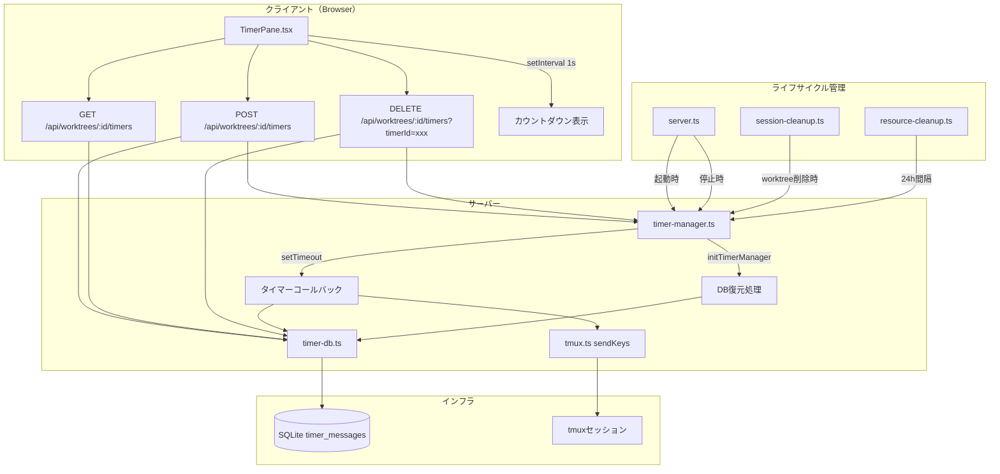
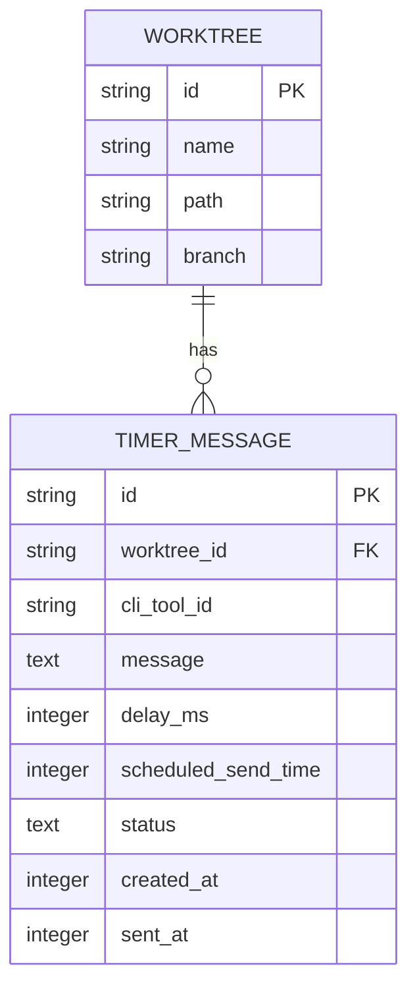

# Issue #534 指定時間後メッセージ送信 - 設計方針書

## 1. アーキテクチャ設計

### システム構成図



### レイヤー構成

| レイヤー | ファイル | 責務 |
|---------|--------|------|
| プレゼンテーション | `src/components/worktree/TimerPane.tsx`, `src/components/worktree/NotesAndLogsPane.tsx` | タイマーUI、カウントダウン表示 |
| API | `src/app/api/worktrees/[id]/timers/route.ts` | Timer CRUD エンドポイント |
| ビジネスロジック | `src/lib/timer-manager.ts` | setTimeout管理、DB復元、送信実行 |
| データアクセス | `src/lib/db/timer-db.ts` | timer_messages CRUD |
| 設定 | `src/config/timer-constants.ts` | 時間選択肢、上限定数 |
| インフラ | `src/lib/tmux/tmux.ts` | メッセージ送信（sendKeys） |

---

## 2. 技術選定

| カテゴリ | 選定技術 | 選定理由 |
|---------|---------|---------|
| タイマー制御 | Node.js `setTimeout` | ワンショット実行に最適。croner不要 |
| Hot Reload対策 | `globalThis` パターン | schedule-manager.ts と同一方式 |
| DB永続化 | SQLite `timer_messages` テーブル | 既存DB基盤、再起動復元に必要 |
| メッセージ送信 | `tmux.ts` `sendKeys()` | HTTP不要。schedule-managerのjob-executorパターンと同様に内部モジュール直接呼び出し |
| カウントダウン | クライアント `setInterval` 1秒 | サーバーSSE/WebSocket不要。auto-yes-configの`formatTimeRemaining()`再利用 |
| 時間選択UI | 5分単位プリセット | auto-yes-configのALLOWED_DURATIONSパターン踏襲 |

### 代替案との比較

| 項目 | 採用案 | 代替案 | 不採用理由 |
|------|-------|--------|-----------|
| タイマー実行 | `setTimeout` | `croner` (cron) | ワンショットにcronは過剰 |
| 送信方式 | `tmux.ts` 直接 | HTTP Terminal API呼び出し | 自分自身へのHTTPリクエストは不要な複雑さ |
| カウントダウン | クライアントsetInterval | SSE/WebSocket | 残り時間表示のためだけにサーバー接続は過剰 |
| テーブル設計 | 専用 `timer_messages` | 既存 `scheduled_executions` 拡張 | 責務が異なる（ワンショット vs cron定期） |

---

## 3. 設計パターン

### 3-1. globalThis シングルトンパターン（timer-manager.ts）

```typescript
// schedule-manager.ts と同一パターン
interface TimerManagerState {
  timers: Map<string, NodeJS.Timeout>;  // timerId → setTimeout handle
  initialized: boolean;
}

declare global {
  var __timerManagerState: TimerManagerState | undefined;
}

function getState(): TimerManagerState {
  if (!globalThis.__timerManagerState) {
    globalThis.__timerManagerState = {
      timers: new Map(),
      initialized: false,
    };
  }
  return globalThis.__timerManagerState;
}
```

### 3-2. Facade パターン（session-cleanup.ts 統合）

```typescript
// 既存の cleanupWorktreeSessions() に追加
// stopAutoYesPollingByWorktree → deleteAutoYesStateByWorktree → stopScheduleForWorktree
// の後に stopTimersForWorktree を追加
try {
  stopTimersForWorktree(worktreeId);
  result.pollersStopped.push('timer-manager');
} catch (e) { /* error handling */ }
```

### 3-3. try-catch-finally エラーハンドリングパターン（job-executor.ts 踏襲）

> **[DP-004対応][CON-MF-001対応]** executeTimer内でのtmuxセッション名解決には、CLIToolManagerのSingletonインスタンスを使用する。
> `CLIToolManager.getInstance().getTool(cliToolId)` でICLIToolインスタンスを取得し、`tool.getSessionName(worktreeId)` でtmuxセッション名を導出する。
> これはterminal/route.tsおよび他の既存コードと同一パターンである。
> timer-manager.ts内に独自のセッション名解決ロジックを実装しない（SRP遵守）。

```typescript
// タイマー発火時のコールバック
async function executeTimer(timerId: string): Promise<void> {
  try {
    const timer = getTimerById(timerId);
    if (!timer || timer.status !== 'pending') return;

    // [DP-004][CON-MF-001] CLIToolManager Singletonパターンでtmuxセッション名を解決
    // terminal/route.ts と同一のAPI呼び出しパターン
    const cliTool = CLIToolManager.getInstance().getTool(timer.cli_tool_id as CLIToolType);
    const sessionName = cliTool.getSessionName(timer.worktree_id);

    updateTimerStatus(timerId, 'sending');
    await sendKeys(sessionName, timer.message, true);
    updateTimerStatus(timerId, 'sent');
  } catch (error) {
    const msg = error instanceof Error ? error.message : String(error);
    updateTimerStatus(timerId, 'failed');
    logger.error('timer:send-failed', { timerId, error: msg });
  }
}
```

---

## 4. データモデル設計

### ER図



### timer_messages テーブル設計（v23マイグレーション）

```sql
CREATE TABLE timer_messages (
  id TEXT PRIMARY KEY,
  worktree_id TEXT NOT NULL,
  cli_tool_id TEXT NOT NULL,
  message TEXT NOT NULL,
  delay_ms INTEGER NOT NULL,              -- [DP-005] UI表示用（元の設定値）。scheduled_send_time = created_at + delay_ms
  scheduled_send_time INTEGER NOT NULL,
  status TEXT NOT NULL DEFAULT 'pending',
  created_at INTEGER NOT NULL DEFAULT (unixepoch() * 1000),
  sent_at INTEGER,
  FOREIGN KEY (worktree_id) REFERENCES worktrees(id) ON DELETE CASCADE
);

CREATE INDEX idx_timer_messages_worktree_status
  ON timer_messages(worktree_id, status);

CREATE INDEX idx_timer_messages_status_scheduled
  ON timer_messages(status, scheduled_send_time);
```

#### v23マイグレーション down関数（IMP-SF-004）

> **[IMP-SF-004対応]** ロールバック用のdown関数を定義する。
> FOREIGN KEY制約（ON DELETE CASCADE）により、worktrees削除時にtimer_messagesも自動削除される。

```sql
-- v23 down
DROP INDEX IF EXISTS idx_timer_messages_status_scheduled;
DROP INDEX IF EXISTS idx_timer_messages_worktree_status;
DROP TABLE IF EXISTS timer_messages;
```

| カラム | 型 | 説明 |
|-------|-----|------|
| id | TEXT PK | UUID（crypto.randomUUID()） |
| worktree_id | TEXT FK | 対象worktree |
| cli_tool_id | TEXT | エージェント種別（'claude', 'codex'等） |
| message | TEXT | 送信メッセージ（MAX 10000文字） |
| delay_ms | INTEGER | 遅延時間（ミリ秒）。scheduled_send_time = created_at + delay_ms の関係で冗長だが、UI表示で元の設定値（例:「15分後に送信」）を表示する目的で保持する [DP-005] |
| scheduled_send_time | INTEGER | 送信予定時刻（epoch ms） |
| status | TEXT | 'pending' → 'sending' → 'sent' / 'failed' / 'cancelled' |
| created_at | INTEGER | 作成時刻（epoch ms） |
| sent_at | INTEGER | 実送信時刻（nullable） |

### ステータス遷移図

```
pending → sending → sent
  │         │
  │         └→ failed（送信エラー）
  └→ cancelled（ユーザーキャンセル / worktree削除）
```

---

## 5. API設計

### RESTful API

| メソッド | パス | 説明 |
|---------|------|------|
| POST | `/api/worktrees/[id]/timers` | タイマー登録 |
| GET | `/api/worktrees/[id]/timers` | タイマー一覧取得 |
| DELETE | `/api/worktrees/[id]/timers?timerId=xxx` | タイマーキャンセル |

### POST /api/worktrees/[id]/timers

```typescript
// Request
{
  cliToolId: string;       // 'claude' | 'codex' | etc.
  message: string;         // 1〜10000文字
  delayMs: number;         // 300000〜31500000（5分〜8時間45分）
}

// Response 201
{
  id: string;
  worktreeId: string;
  cliToolId: string;
  message: string;
  delayMs: number;
  scheduledSendTime: number;
  status: 'pending';
  createdAt: number;
}

// Response 400
{ error: 'Invalid message' | 'Invalid delay' | 'Invalid agent' | 'Max timers reached' }
```

### GET /api/worktrees/[id]/timers

> **[CON-SF-002対応]** GETレスポンスにworktreeIdを含めない設計は意図的である。
> クライアントはパスパラメータ[id]からworktreeIdを既知であるため、レスポンスサイズ削減のため省略する。
> POST側でworktreeIdを返すのは作成確認のためであり、GET側との差異は許容する。

```typescript
// Response 200
{
  timers: Array<{
    id: string;
    cliToolId: string;
    message: string;
    delayMs: number;
    scheduledSendTime: number;
    status: 'pending' | 'sending' | 'sent' | 'failed' | 'cancelled';
    createdAt: number;
    sentAt: number | null;
  }>;
}
```

### DELETE /api/worktrees/[id]/timers?timerId=xxx

> **[CON-SF-004対応]** pendingステータス以外のタイマーに対するDELETE要求は409 Conflictを返す。
> 既にcancelled/sent/failedのタイマーはキャンセル不可であり、クライアントに明確なエラーを返す。

```typescript
// Response 200
{ success: true }

// Response 404
{ error: 'Timer not found' }

// Response 409 [CON-SF-004] pending以外のステータスのタイマーへのキャンセル要求
{ error: 'Timer is not in pending status' }
```

### バリデーション

| 項目 | ルール |
|------|--------|
| worktreeId（パスパラメータ） | [SEC-SF-002] typeof文字列チェック + 非空チェック + `getWorktreeById()` で存在確認 |
| message | 非空、最大10000文字（MAX_COMMAND_LENGTH）。[CON-C-002] timer APIルート内でローカル定数として定義する（terminal/route.tsと同様、共通定数化は行わない） |
| cliToolId | `isCliToolType()` で検証 |
| delayMs | `isValidTimerDelay()`による範囲チェック（MIN_DELAY_MS〜MAX_DELAY_MS、DELAY_STEP_MS刻み） [DP-001] |
| timerId（DELETEクエリパラメータ） | [SEC-SF-001] `isValidUuidV4(timerId)` によるUUID v4形式チェック。不正形式は400 |
| 上限 | worktree当たりpending最大5件 |

---

## 6. セキュリティ設計

| 対策 | 実装方法 | 参考 |
|------|---------|------|
| 認証 | 既存middleware（トークン認証） | middleware.ts |
| worktree存在確認 | `getWorktreeById()` + typeof/非空チェック [SEC-SF-002] | terminal API route |
| CLI tool検証 | `isCliToolType()` 型ガード | terminal API route |
| メッセージ長制限 | MAX_COMMAND_LENGTH=10000 | terminal API route |
| delay値検証 | TIMER_DELAYS配列のホワイトリスト | auto-yes-config パターン |
| 上限制御 | MAX_TIMERS=5 per worktree | DoS防止 |
| SQLインジェクション | プリペアドステートメント | 既存DB操作パターン |
| エラーメッセージ | catch句で固定文字列レスポンス [SEC-MF-001] | terminal/route.ts L89-94 |
| timerId検証 | `isValidUuidV4(timerId)` によるUUID形式チェック [SEC-SF-001] | schedule-config.ts, execution-logs/[logId]/route.ts L33 |
| コマンドインジェクション防止 | tmux sendKeysはexecFile()使用（shell interpretation経由なし）[SEC-C-001] | tmux.ts L216-217 |

### 6-1. エラーレスポンスの固定文字列パターン [SEC-MF-001]

> **[SEC-MF-001対応]** POST/GET/DELETE各APIハンドラのcatch句では、`error.message`をクライアントに返さず、
> 固定文字列（例: `'Internal server error'`）を返す。これはterminal/route.tsの既存パターン（L89-94: `'Failed to send command to terminal'`固定文字列）を踏襲する。
> executeTimer内の`logger.error('timer:send-failed', { timerId, error: msg })`はサーバーサイドのsetTimeoutコールバック内であり
> クライアントに直接返されないが、API route層で内部エラー詳細がクライアントに漏洩しないことを二重に保証する。

```typescript
// 各APIハンドラのcatch句パターン（terminal/route.ts踏襲）
} catch (error) {
  logger.error('timer:api-error', { error: error instanceof Error ? error.message : String(error) });
  return NextResponse.json(
    { error: 'Internal server error' },  // 固定文字列。error.messageを返さない
    { status: 500 }
  );
}
```

### 6-2. timerId UUID形式バリデーション [SEC-SF-001]

> **[SEC-SF-001対応]** DELETE APIでクエリパラメータ`timerId`を受け取る際、
> `isValidUuidV4(timerId)`（`src/config/schedule-config.ts`の既存関数）でUUID v4形式チェックを行い、
> 不正な形式の場合は400 Bad Requestを返す。
> 既存パターン: `execution-logs/[logId]/route.ts`（L33）、`schedules/[scheduleId]/route.ts`（L36）。

```typescript
// DELETE handler内
const timerId = searchParams.get('timerId');
if (!timerId || !isValidUuidV4(timerId)) {
  return NextResponse.json({ error: 'Invalid timer ID' }, { status: 400 });
}
```

### 6-3. worktreeIdパスパラメータのバリデーション [SEC-SF-002]

> **[SEC-SF-002対応]** URLパスパラメータ`[id]`（worktreeId）について、typeof文字列チェックと非空チェックを
> `getWorktreeById()`による存在確認の前に実施する。
> terminal/route.tsでは暗黙的にDB存在確認で処理しているが、セキュリティ設計書としての明示性を高めるため記載する。

```typescript
// 各APIハンドラ共通パターン
const { id } = await params;
if (typeof id !== 'string' || id.length === 0) {
  return NextResponse.json({ error: 'Invalid worktree ID' }, { status: 400 });
}
const worktree = getWorktreeById(id);
if (!worktree) {
  return NextResponse.json({ error: 'Worktree not found' }, { status: 404 });
}
```

---

## 7. パフォーマンス設計

| 項目 | 方針 |
|------|------|
| カウントダウン | クライアントsetInterval 1秒。サーバー負荷なし |
| タイマー一覧取得 | INDEXed query（worktree_id, status） |
| setTimeout | 最大5件/worktree。メモリ影響軽微 |
| DB復元 | サーバー起動時1回のみ。pending全件SELECT |
| globalThis Map | worktree削除時にエントリ削除。24h間隔で孤立検出（[CON-SF-003] resource-cleanup.ts統合、詳細はセクション10参照） |

---

## 8. 設計上の決定事項とトレードオフ

| 決定事項 | 理由 | トレードオフ |
|---------|------|-------------|
| `setTimeout`使用 | ワンショットに最適 | Node.jsプロセス再起動で消失→DB復元で対処 |
| `tmux.ts`直接呼び出し | HTTP経由不要、依存明確 | Terminal APIのセキュリティ検証を経由しない→timer-manager内で検証 |
| 専用テーブル`timer_messages` | scheduled_executionsと責務分離 | テーブル数増加 |
| クライアント側カウントダウン | サーバー負荷なし | 時刻ずれ可能性→実用上問題なし |
| 過去時刻タイマー即座送信 | ユーザー期待に沿う | [SEC-SF-003] 全worktree分のpendingタイマーが同時発火するリスクあり。MAX_TIMERS=5/worktreeの制限と実環境のworktree数を考慮すると実害は限定的。staggering（段階的実行）は将来検討事項とし、現時点では即座発火方式を採用 |
| リトライなし | シンプルさ優先 | 一時的エラーで永久失敗→ユーザーが再登録で対処 |
| MobileTabBar非追加 | 既存5タブ維持 | Timer専用タブなし→memoタブ経由でアクセス |
| NotesAndLogsPane 4タブ化 | timer追加でflex-1均等4分割 | [IMP-SF-003] モバイル（320px幅以下）でタップ領域が縮小する可能性→実装時にユーザビリティ検証が必要 |

---

## 9. モジュール設計詳細

### 9-1. src/config/timer-constants.ts

> **[DP-001対応]** TIMER_DELAYS配列をハードコードせず、MIN/MAX/STEP定数から動的生成する方式に変更。
> 保守性向上のため、範囲チェック方式の`isValidTimerDelay`を採用する。

```typescript
// 遅延時間の範囲定数（5分単位、5分〜8時間45分）
export const MIN_DELAY_MS = 5 * 60 * 1000;       // 300000 (5分)
export const MAX_DELAY_MS = 525 * 60 * 1000;     // 31500000 (8時間45分)
export const DELAY_STEP_MS = 5 * 60 * 1000;      // 300000 (5分刻み)

// MIN/MAX/STEPから動的に生成（ハードコード105個を排除）
export const TIMER_DELAYS: number[] = Array.from(
  { length: Math.floor((MAX_DELAY_MS - MIN_DELAY_MS) / DELAY_STEP_MS) + 1 },
  (_, i) => MIN_DELAY_MS + i * DELAY_STEP_MS
);

export const MAX_TIMERS_PER_WORKTREE = 5;

export const TIMER_STATUS = {
  PENDING: 'pending',
  SENDING: 'sending',
  SENT: 'sent',
  FAILED: 'failed',
  CANCELLED: 'cancelled',
} as const;

export type TimerStatus = typeof TIMER_STATUS[keyof typeof TIMER_STATUS];

// [DP-001] 範囲チェック方式によるバリデーション（配列includes不要）
export function isValidTimerDelay(value: unknown): value is number {
  return typeof value === 'number' &&
    value >= MIN_DELAY_MS &&
    value <= MAX_DELAY_MS &&
    value % DELAY_STEP_MS === 0;
}
```

### 9-2. src/lib/db/timer-db.ts

> **[DP-002対応]** 既存のDB操作モジュール（chat-db.ts, memo-db.ts, session-db.ts, worktree-db.ts）と同様に`src/lib/db/`配下に配置する。

```typescript
// CRUD関数
export function createTimer(params: CreateTimerParams): TimerMessage;
export function getTimersByWorktree(worktreeId: string): TimerMessage[];
export function getTimerById(id: string): TimerMessage | undefined;
export function getPendingTimers(): TimerMessage[];  // 復元用
export function updateTimerStatus(id: string, status: TimerStatus, sentAt?: number): void;
export function cancelTimer(id: string): boolean;
export function cancelTimersByWorktree(worktreeId: string): number;
```

### 9-3. src/lib/timer-manager.ts

> **[DP-003対応]** 既存のschedule-manager.tsと同様に`src/lib/`直下に配置する。

> **[IMP-C-003対応]** initTimerManager()のDB復元処理ではMAX_TIMERS_PER_WORKTREE上限チェックを行わない。
> DB上にpendingとして既に存在するレコードは全て復元する。上限チェックは新規登録API（POST）でのみ適用する。
> これは、サーバー再起動前に正常に登録されたタイマーを確実に復元するための設計判断である。

```typescript
// 公開API
export function initTimerManager(): void;          // server.ts起動時（DB復元、上限チェックなし）
export function stopAllTimers(): void;              // server.ts停止時（IMP-MF-001: Map.clear()同期先行）
export function scheduleTimer(timerId: string, delayMs: number): void;
export function cancelScheduledTimer(timerId: string): void;
export function stopTimersForWorktree(worktreeId: string): void;  // session-cleanup用
export function getActiveTimerCount(): number;      // resource-cleanup用
export function getTimerWorktreeIds(): Set<string>;  // [CON-SF-003] resource-cleanup孤立検出用アクセサ
```

### 9-4. TimerPane.tsx

```typescript
// Props
interface TimerPaneProps {
  worktreeId: string;
  cliToolId: string;
}

// 内部状態
// - timers: TimerMessage[] （GET APIからポーリング、[CON-C-003] ポーリング間隔: 10秒）
// - message: string
// - selectedDelay: TimerDelay
// - countdown: Map<string, string> （setInterval 1秒更新）
// [CON-C-003] タイマー一覧同期: 10秒間隔でGET APIをポーリング。
// POST/DELETE操作後は楽観的UI更新（ローカルstate即時反映）を併用する。
// ポーリング間隔定数は timer-constants.ts に TIMER_LIST_POLL_INTERVAL_MS = 10000 として定義する。

// [IMP-C-002] ポーリングライフサイクル:
// - マウント時: useEffect内でsetIntervalを開始（10秒間隔）
// - アンマウント時: useEffectのクリーンアップでclearIntervalを実行
// - NotesAndLogsPaneはactiveSubTab === 'timer'の条件付きレンダリングのため、
//   タブ切替時にTimerPaneはアンマウント→再マウントされポーリングは適切に停止・再開する
// - visibilitychange対応: useFilePollingフックのパターンを参考に、
//   document.visibilityState === 'hidden'時はポーリングを一時停止し、
//   'visible'復帰時に再開する実装を推奨する
```

---

## 10. サーバーライフサイクル統合

### 起動順序（server.ts）

```
1. await initializeWorktrees()
2. initScheduleManager()        // 既存
3. initTimerManager()           // ★追加
4. initResourceCleanup()        // 既存
```

### 停止順序（gracefulShutdown）

> **[CON-SF-001対応]** 以下の順序はserver.tsの実際のgracefulShutdown()と正確に対応させている。
> 既存コードではstopAllSchedules()の直後にstopResourceCleanup()が実行され、その後にcloseWebSocket()が続く。
> stopAllTimers()はstopAllSchedules()とstopResourceCleanup()の間に挿入する。

> **[IMP-MF-001対応]** stopAllTimers()はMap.clear()を同期的に先行実行し、その後に個々のclearTimeout()を行う。
> これにより、resource-cleanup内のcleanupOrphanedMapEntries()がstopAllTimers()と並行実行された場合でも、
> getTimerWorktreeIds()が空Setを返すだけで実害は発生しない。
> resource-cleanup側のgetTimerWorktreeIds()呼び出しが空Setを返しても安全であることを保証する。

```
1. stopAllPolling()             // 既存（server.ts L297）
2. stopAllAutoYesPolling()      // 既存（server.ts L300）
3. stopAllSchedules()           // 既存（server.ts L303）
4. stopAllTimers()              // ★追加（stopAllSchedules直後に挿入）
5. stopResourceCleanup()        // 既存（server.ts L306）
6. closeWebSocket()             // 既存（server.ts L309）
```

### stopAllTimers() 実装方針（IMP-MF-001）

```typescript
export function stopAllTimers(): void {
  const state = getState();
  // Step 1: 同期的にMap参照を確保してからclear()
  // これによりgetTimerWorktreeIds()は即座に空Setを返すようになる
  const entries = Array.from(state.timers.entries());
  state.timers.clear();  // ★同期的に先行クリア

  // Step 2: 個々のsetTimeoutハンドルをクリア
  for (const [timerId, handle] of entries) {
    clearTimeout(handle);
    logger.info('timer:cleared', { timerId });
  }

  // Step 3: DB上のpendingタイマーをcancelledに更新
  cancelAllPendingTimers();
  state.initialized = false;
}
```

### クリーンアップ統合（session-cleanup.ts）

```
cleanupWorktreeSessions(worktreeId):
  1. stopAutoYesPollingByWorktree()   // 既存
  2. deleteAutoYesStateByWorktree()   // 既存
  3. stopScheduleForWorktree()        // 既存
  4. stopTimersForWorktree()          // ★追加
  5. killSessions (tmux)              // 既存
```

### リソースクリーンアップ統合（resource-cleanup.ts） [CON-SF-003]

> timer-managerのglobalThis Mapにおける孤立エントリ検出を、既存のcleanupOrphanedMapEntries()に統合する。
> 既存パターン（autoYesStates, autoYesPollers, scheduleManager）と同一方式で実装する。

**統合方針:**

1. `timer-manager.ts` から `getTimerWorktreeIds(): Set<string>` をexportする
   - globalThisのtimers Mapからアクティブなタイマーを持つworktreeIdの一意セットを返す
2. `resource-cleanup.ts` の `cleanupOrphanedMapEntries()` に以下を追加する:
   - `getTimerWorktreeIds()` で取得したworktreeIdセットをDB上の有効worktreeIdと照合
   - 孤立エントリは `stopTimersForWorktree(worktreeId)` で削除
3. `CleanupMapResult` 型に `deletedTimerWorktreeIds: string[]` を追加する

```typescript
// resource-cleanup.ts の cleanupOrphanedMapEntries() に追加するロジック
// 既存の scheduleManager 孤立検出と同一パターン
const timerWorktreeIds = getTimerWorktreeIds();
for (const worktreeId of timerWorktreeIds) {
  if (!validWorktreeIds.has(worktreeId)) {
    stopTimersForWorktree(worktreeId);
    result.deletedTimerWorktreeIds.push(worktreeId);
  }
}
```

### 既存テストファイルへの影響（IMP-SF-001, IMP-SF-002）

> timer-managerを参照するモジュール（session-cleanup.ts, resource-cleanup.ts）の既存テストファイルにモック追加が必要。

| テストファイル | 必要な修正 | 関連指摘ID |
|--------------|----------|-----------|
| `tests/unit/session-cleanup.test.ts` | `vi.mock('@/lib/timer-manager')` のモック定義を追加（stopTimersForWorktree） | IMP-SF-001 |
| `tests/unit/session-cleanup-issue404.test.ts` | `vi.mock('@/lib/timer-manager')` のモック定義を追加（stopTimersForWorktree） | IMP-SF-001 |
| `tests/unit/resource-cleanup.test.ts` | `vi.mock('@/lib/timer-manager')` のモック追加（getTimerWorktreeIds, stopTimersForWorktree）+ CleanupMapResult検証のアサーションに `deletedTimerWorktreeIds` を追加 | IMP-SF-002 |
| `tests/unit/components/worktree/NotesAndLogsPane.test.tsx` | Timerタブの存在確認テスト追加、4タブレンダリングの検証 | IMP-SF-003 |

---

## 11. i18n設計

> **[CON-C-001]** timer関連のi18nキーはschedule名前空間に追加する。ファイル数の抑制と、
> 既にscheduleがタブUIで使われている点を考慮し、独立名前空間は作成しない。
> ただし、キープレフィックスを `timer.*` とすることでschedule（cron定期実行）との概念的分離を維持する。

`schedule` 名前空間に追加（`locales/{lang}/schedule.json`）:

**locales/en/schedule.json:**

```json
{
  "timerTab": "Timer",
  "timer": {
    "title": "Delayed Message Timer",
    "agent": "Agent",
    "message": "Message",
    "delay": "Send after",
    "register": "Register Timer",
    "cancel": "Cancel",
    "noTimers": "No timers registered",
    "maxReached": "Maximum 5 timers per worktree",
    "status": {
      "pending": "Pending",
      "sending": "Sending...",
      "sent": "Sent",
      "failed": "Failed",
      "cancelled": "Cancelled"
    }
  }
}
```

**locales/ja/schedule.json:** [IMP-C-001]

```json
{
  "timerTab": "タイマー",
  "timer": {
    "title": "遅延メッセージタイマー",
    "agent": "エージェント",
    "message": "メッセージ",
    "delay": "送信タイミング",
    "register": "タイマー登録",
    "cancel": "キャンセル",
    "noTimers": "登録されたタイマーはありません",
    "maxReached": "1つのworktreeにつき最大5件です",
    "status": {
      "pending": "待機中",
      "sending": "送信中...",
      "sent": "送信済み",
      "failed": "失敗",
      "cancelled": "キャンセル済み"
    }
  }
}
```

---

## 12. Stage 1 設計原則レビュー指摘事項サマリー

レビュー日: 2026-03-24 / 総合評価: PASS_WITH_MINOR_FINDINGS

### 指摘事項一覧

| ID | 重要度 | カテゴリ | タイトル | 対応状況 |
|----|--------|---------|---------|---------|
| DP-001 | Minor | DRY | TIMER_DELAYS配列のハードコード排除 | 対応済: MIN/MAX/STEP定数による動的生成方式に変更 |
| DP-002 | Info | KISS | timer-db.tsの配置パス明記 | 対応済: `src/lib/db/timer-db.ts`をレイヤー構成表に明記 |
| DP-003 | Minor | 設計一貫性 | timer-manager.ts, timer-constants.tsのフルパス明記 | 対応済: `src/lib/timer-manager.ts`, `src/config/timer-constants.ts`を明記 |
| DP-004 | Minor | SRP | executeTimer内のtmuxセッション名解決ロジック | 対応済: CLIToolManagerによるセッション名解決をコード例に追記 |
| DP-005 | Info | YAGNI | delay_msカラムの目的コメント | 対応済: スキーマ定義・カラム説明にUI表示目的のコメントを追記 |

### 実装チェックリスト

- [ ] [DP-001] `src/config/timer-constants.ts`: MIN_DELAY_MS / MAX_DELAY_MS / DELAY_STEP_MS 定数を定義し、TIMER_DELAYSをArray.fromで動的生成する
- [ ] [DP-001] `src/config/timer-constants.ts`: isValidTimerDelay()を範囲チェック方式（MIN/MAX/STEP剰余チェック）で実装する
- [ ] [DP-002] `src/lib/db/timer-db.ts`: 既存のDB操作モジュールと同じディレクトリに配置する
- [ ] [DP-003] `src/lib/timer-manager.ts`: schedule-manager.tsと同じsrc/lib/直下に配置する
- [ ] [DP-003] `src/config/timer-constants.ts`: auto-yes-config.tsと同じsrc/config/配下に配置する
- [ ] [DP-004] `src/lib/timer-manager.ts`: executeTimer内でCLIToolManager（getCliTool + getSessionName）を使用してtmuxセッション名を解決する
- [ ] [DP-005] DBマイグレーションSQL: delay_msカラムにUI表示目的のコメントを記載する

---

## 13. Stage 2 整合性レビュー指摘事項サマリー

レビュー日: 2026-03-24 / 総合評価: conditionally_approved (Score: 4/5)

### 指摘事項一覧

| ID | 重要度 | カテゴリ | タイトル | 対応状況 |
|----|--------|---------|---------|---------|
| CON-MF-001 | Must Fix | 設計書内部整合性 | executeTimer内のCLIToolManager APIがコードベースの実際のAPIと不一致 | 対応済: `CLIToolManager.getInstance().getTool()` パターンに修正（セクション3-3） |
| CON-SF-001 | Should Fix | 既存コードベースとの整合性 | gracefulShutdown内のstopAllTimers()の挿入位置が既存パターンと不整合 | 対応済: server.tsの実際の行番号を付記し停止順序を正確に記述（セクション10） |
| CON-SF-002 | Should Fix | 設計書内部整合性 | GET APIのレスポンスにworktreeIdが含まれていない | 対応済: 意図的な差異であることを明記（セクション5 GET API） |
| CON-SF-003 | Should Fix | 既存パターンとの整合性 | resource-cleanup.tsへのtimer-manager統合方法が未記載 | 対応済: cleanupOrphanedMapEntries()統合方針・アクセサ関数・コード例を追記（セクション9-3, 10） |
| CON-SF-004 | Should Fix | 設計書内部整合性 | cancelTimer()とDELETE APIのステータス遷移の整合性 | 対応済: pending以外のステータスへのDELETE要求は409 Conflictを返す仕様を明記（セクション5 DELETE API） |
| CON-C-001 | Consider | 既存パターンとの整合性 | i18n名前空間の選択根拠 | 対応済: schedule名前空間に追加する合理的理由を明記（セクション11） |
| CON-C-002 | Consider | 既存パターンとの整合性 | MAX_COMMAND_LENGTHの定義場所 | 対応済: timer APIルート内ローカル定義とする方針を明記（セクション5 バリデーション） |
| CON-C-003 | Consider | セクション間整合性 | TimerPane.tsxのポーリング間隔が未定義 | 対応済: 10秒間隔ポーリング + 楽観的UI更新方針を明記（セクション9-4） |

### 整合性マトリクス

| 観点 | 評価 | 備考 |
|------|------|------|
| 設計書 vs コードベース | 4/5 | CLIToolManager API修正済（CON-MF-001）。主要パターン（globalThis, session-cleanup, DB操作配置）は整合 |
| 設計書内部セクション間 | 4/5 | GET/POSTレスポンス差異を明文化（CON-SF-002）。cancelTimer境界ケースを明確化（CON-SF-004） |
| 設計書 vs 既存パターン | 4/5 | resource-cleanup統合方針を詳細化（CON-SF-003）。schedule-manager, auto-yes-configのパターンを踏襲 |
| 設計書 vs サーバーライフサイクル | 4/5 | gracefulShutdown停止順序をserver.ts行番号付きで正確に記述（CON-SF-001） |

### 実装チェックリスト（Stage 2追加分）

- [ ] [CON-MF-001] `src/lib/timer-manager.ts`: executeTimer内で `CLIToolManager.getInstance().getTool(cliToolId as CLIToolType)` を使用する（getCliTool()は使用しない）
- [ ] [CON-SF-001] `server.ts`: stopAllTimers()をstopAllSchedules()とstopResourceCleanup()の間に挿入する
- [ ] [CON-SF-002] GET APIレスポンスにはworktreeIdを含めない（パスパラメータから既知のため）
- [ ] [CON-SF-003] `src/lib/timer-manager.ts`: `getTimerWorktreeIds(): Set<string>` をexportする
- [ ] [CON-SF-003] `src/lib/resource-cleanup.ts`: cleanupOrphanedMapEntries()にtimer-manager孤立検出ロジックを追加する
- [ ] [CON-SF-003] `src/lib/resource-cleanup.ts`: CleanupMapResult型に `deletedTimerWorktreeIds: string[]` を追加する
- [ ] [CON-SF-004] `src/app/api/worktrees/[id]/timers/route.ts`: DELETE handler内でpending以外のステータスのタイマーには409を返す
- [ ] [CON-C-001] i18nキーはschedule名前空間に `timer.*` プレフィックスで追加する
- [ ] [CON-C-002] `src/app/api/worktrees/[id]/timers/route.ts`: MAX_COMMAND_LENGTH=10000をルート内ローカル定数として定義する
- [ ] [CON-C-003] `src/config/timer-constants.ts`: TIMER_LIST_POLL_INTERVAL_MS = 10000 を定義する
- [ ] [CON-C-003] `src/components/worktree/TimerPane.tsx`: POST/DELETE後に楽観的UI更新を実装する

---

## 14. Stage 3 影響分析レビュー指摘事項サマリー

レビュー日: 2026-03-24 / 総合評価: conditionally_approved (Score: 4/5)

### 指摘事項一覧

| ID | 重要度 | カテゴリ | タイトル | 対応状況 |
|----|--------|---------|---------|---------|
| IMP-MF-001 | Must Fix | server.ts停止順序の影響 | stopAllTimers()のMap.clear()同期先行実行によるresource-cleanup競合回避 | 対応済: stopAllTimers()実装方針をセクション10に追記。Map.clear()同期先行+個別clearTimeout後続の2段階方式 |
| IMP-SF-001 | Should Fix | session-cleanup.ts変更の影響 | 既存テストファイルへのtimer-managerモック追加 | 対応済: session-cleanup.test.ts, session-cleanup-issue404.test.tsのモック要件をセクション10に追記 |
| IMP-SF-002 | Should Fix | resource-cleanup.ts変更の影響 | CleanupMapResult型拡張による既存テストへの影響 | 対応済: resource-cleanup.test.tsのモック・アサーション更新要件をセクション10に追記 |
| IMP-SF-003 | Should Fix | NotesAndLogsPane UI影響 | 4タブ化によるモバイルタップ領域縮小リスク | 対応済: 設計判断・トレードオフ表にモバイル320px検証要件を追記（セクション8） |
| IMP-SF-004 | Should Fix | DBマイグレーション影響 | v23マイグレーションdown関数の記載 | 対応済: DROP TABLE/DROP INDEX文をセクション4に追記 |
| IMP-C-001 | Consider | i18nファイル影響 | ja側i18n翻訳テキスト定義 | 対応済: locales/ja/schedule.jsonの翻訳テキストをセクション11に追記 |
| IMP-C-002 | Consider | パフォーマンス影響 | TimerPaneポーリングのvisibilitychange対応 | 対応済: ポーリングライフサイクル（マウント/アンマウント/visibilitychange）をセクション9-4に追記 |
| IMP-C-003 | Consider | パフォーマンス影響 | DB復元時のMAX_TIMERS上限チェック不適用 | 対応済: initTimerManager()で上限チェックを行わない設計判断をセクション9-3に追記 |
| IMP-C-004 | Consider | MobileTabBar影響 | MobileTabBarにTimerタブを追加しない設計判断 | 確認済: 既存設計判断（セクション8 MobileTabBar非追加）で対応済。影響なし |

### 影響リスク評価

| リスク要因 | リスクレベル | 軽減策 |
|-----------|------------|--------|
| 既存テスト破損 | Medium | session-cleanup, resource-cleanup, NotesAndLogsPaneの4テストファイルにモック追加が必要（IMP-SF-001/002） |
| DBマイグレーション失敗 | Low | FOREIGN KEY ON DELETE CASCADEとINDEX作成のみ。down関数でロールバック可能（IMP-SF-004） |
| server.tsライフサイクル競合 | Medium | stopAllTimers()のMap.clear()同期先行実行で回避（IMP-MF-001） |
| UIレグレッション | Low | 4タブ化のモバイル320px幅でのユーザビリティ確認（IMP-SF-003） |
| メモリリーク | Low | globalThis Mapの孤立エントリはresource-cleanup.tsで24h間隔で検出・削除。MAX_TIMERS=5で上限あり |

### 実装チェックリスト（Stage 3追加分）

- [ ] [IMP-MF-001] `src/lib/timer-manager.ts`: stopAllTimers()内でMap.clear()を同期的に先行実行し、その後に個々のclearTimeout()を実行する2段階方式を実装する
- [ ] [IMP-MF-001] `src/lib/timer-manager.ts`: resource-cleanup側のgetTimerWorktreeIds()が空Setを返しても安全であることをコードコメントに記載する
- [ ] [IMP-SF-001] `tests/unit/session-cleanup.test.ts`: `vi.mock('@/lib/timer-manager')` を追加する（stopTimersForWorktreeのモック）
- [ ] [IMP-SF-001] `tests/unit/session-cleanup-issue404.test.ts`: `vi.mock('@/lib/timer-manager')` を追加する（stopTimersForWorktreeのモック）
- [ ] [IMP-SF-002] `tests/unit/resource-cleanup.test.ts`: `vi.mock('@/lib/timer-manager')` を追加する（getTimerWorktreeIds, stopTimersForWorktreeのモック）
- [ ] [IMP-SF-002] `tests/unit/resource-cleanup.test.ts`: CleanupMapResult検証のアサーションに `deletedTimerWorktreeIds` を追加する
- [ ] [IMP-SF-003] `src/components/worktree/NotesAndLogsPane.tsx`: 4タブ化実装後にモバイル（320px幅以下）でのタップ領域ユーザビリティを確認する
- [ ] [IMP-SF-003] `tests/unit/components/worktree/NotesAndLogsPane.test.tsx`: Timerタブの存在確認テストを追加する
- [ ] [IMP-SF-004] `src/lib/db/db-migrations.ts`: v23マイグレーションのdown関数（DROP TABLE IF EXISTS timer_messages, DROP INDEX x2）を実装する
- [ ] [IMP-C-001] `locales/ja/schedule.json`: timer関連の日本語翻訳テキストを追加する
- [ ] [IMP-C-002] `src/components/worktree/TimerPane.tsx`: visibilitychange対応（ブラウザタブ非アクティブ時のポーリング一時停止）を実装する
- [ ] [IMP-C-003] `src/lib/timer-manager.ts`: initTimerManager()のDB復元処理ではMAX_TIMERS_PER_WORKTREE上限チェックを行わない（既存pendingレコードを全て復元する）

---

## 15. Stage 4 セキュリティレビュー指摘事項サマリー

レビュー日: 2026-03-24 / 総合評価: conditionally_approved (Score: 4/5)

### リスク評価

| リスク要因 | リスクレベル |
|-----------|------------|
| 技術的リスク | Low |
| セキュリティリスク | Low |
| 運用リスク | Low |

### OWASP Top 10 チェック結果

| 項目 | 評価 | 備考 |
|------|------|------|
| A01 Broken Access Control | Pass | 既存middleware認証、worktree存在確認、isCliToolType検証で対策済み |
| A02 Cryptographic Failures | N/A | タイマー機能では暗号化対象データなし |
| A03 Injection | Pass | SQLプリペアドステートメント、tmux sendKeysはexecFile使用でshell injection防止済み |
| A04 Insecure Design | Pass (with notes) | MAX_TIMERS=5、MAX_COMMAND_LENGTH=10000、delayMsホワイトリスト検証でDoS防止。エラーメッセージ固定文字列化対応済（SEC-MF-001） |
| A05 Security Misconfiguration | Pass | 新規設定項目なし。既存認証・IP制限設定を継承 |
| A06 Vulnerable Components | Pass | 新規外部依存なし。Node.js setTimeout、既存SQLite/tmux基盤を使用 |
| A07 Authentication Failures | Pass | 既存middleware.ts認証を継承。新規認証ロジックなし |
| A08 Software Data Integrity | Pass | タイマーステータス遷移が定義済み |
| A09 Logging/Monitoring | Pass | logger.error/infoによるタイマー操作ログ記録設計済み |
| A10 SSRF | N/A | タイマー機能は外部HTTP通信なし |

### 指摘事項一覧

| ID | 重要度 | カテゴリ | タイトル | 対応状況 |
|----|--------|---------|---------|---------|
| SEC-MF-001 | Must Fix | エラーメッセージ情報漏洩 | APIハンドラのcatch句で固定文字列レスポンスを返す方針の明記 | 対応済: セクション6-1にcatch句パターンとコード例を追記。terminal/route.ts L89-94パターン踏襲 |
| SEC-SF-001 | Should Fix | 入力バリデーション | DELETE APIのtimerIdにUUID形式バリデーション | 対応済: セクション5バリデーション表とセクション6-2にisValidUuidV4()使用方針を明記 |
| SEC-SF-002 | Should Fix | 入力バリデーション | worktreeIdパスパラメータのtypeofチェック・非空チェック | 対応済: セクション5バリデーション表とセクション6-3にtypeof/非空チェック方針を明記 |
| SEC-SF-003 | Should Fix | DoS防止 | DB復元時の過去時刻タイマー一括発火リスク | 対応済: セクション8トレードオフ表にリスクと軽減策（MAX_TIMERS=5制限、staggeringは将来検討）を追記 |
| SEC-C-001 | Consider | コマンドインジェクション | sendKeys経由のコマンドインジェクションリスクは既存対策で軽減済み | 確認済: セクション6セキュリティ設計表にexecFile使用の旨を追記 |
| SEC-C-002 | Consider | 認証・認可 | タイマー登録者とキャンセル操作者の認可チェック | 対応不要: シングルユーザー前提。将来のマルチユーザー対応時の検討事項として記録 |
| SEC-C-003 | Consider | リソースリーク | globalThis Mapの孤立エントリ検出は既存パターンで対策済み | 確認済: resource-cleanup.ts統合（セクション10 CON-SF-003）で対策済み |
| SEC-C-004 | Consider | 入力バリデーション | message内容のサニタイズ要否 | 対応不要: Reactデフォルトエスケープとtmux execFileの組み合わせでXSS/コマンドインジェクション防止済み |

### 実装チェックリスト（Stage 4追加分）

- [ ] [SEC-MF-001] `src/app/api/worktrees/[id]/timers/route.ts`: POST/GET/DELETE各ハンドラのcatch句で`error.message`をクライアントに返さず固定文字列（`'Internal server error'`）を返す
- [ ] [SEC-SF-001] `src/app/api/worktrees/[id]/timers/route.ts`: DELETE handler内で`isValidUuidV4(timerId)`によるUUID形式バリデーションを実装し、不正形式は400を返す
- [ ] [SEC-SF-001] `src/config/schedule-config.ts`の`isValidUuidV4`をimportして使用する
- [ ] [SEC-SF-002] `src/app/api/worktrees/[id]/timers/route.ts`: POST/GET/DELETE各ハンドラでworktreeIdパスパラメータのtypeofチェックと非空チェックを`getWorktreeById()`の前に実施する
- [ ] [SEC-SF-003] `src/lib/timer-manager.ts`: initTimerManager()のDB復元処理で過去時刻タイマー即座発火の動作をコードコメントに記載する（staggeringは将来検討事項）
- [ ] [SEC-C-001] `src/app/api/worktrees/[id]/timers/route.ts`: セキュリティコメントとしてtmux sendKeysがexecFile()使用でshell injection防止済みである旨を記載する（任意）

---

*Generated by design-policy command for Issue #534*
