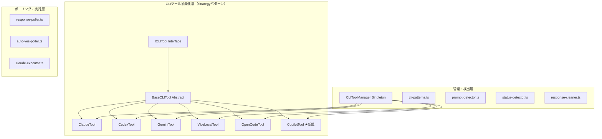

# 設計方針書: Issue #545 Copilot-CLI対応

## 1. アーキテクチャ設計

### システム構成（変更箇所）



### レイヤー構成

本変更は既存アーキテクチャを拡張するものであり、新しいレイヤーの追加は不要。

| レイヤー | 変更内容 |
|---------|---------|
| CLIツール層（`src/lib/cli-tools/`） | CopilotTool新規追加、types/manager更新 |
| 検出層（`src/lib/detection/`） | copilotパターン追加 |
| ポーリング層（`src/lib/polling/`） | copilotディスパッチ追加 |
| セッション層（`src/lib/session/`） | claude-executor.tsにcopilotケース追加 |
| UI層（`src/components/`） | AgentSettingsPaneにcopilot選択肢追加 |

## 2. 技術選定

### 前提調査が必要な事項

| 項目 | 現時点の想定 | 確認方法 | 設計への影響 |
|------|------------|---------|------------|
| コマンド形式 | `gh copilot`（gh CLI拡張） | `gh copilot --help` 実行 | `BaseCLITool.command = 'gh'`、引数に`copilot`サブコマンド |
| 対話モード | ワンショット（`suggest`/`explain`） | 実際にコマンド実行して確認 | tmuxセッション管理アプローチの適用方法 |
| 画像入力 | 非対応の可能性が高い | ドキュメント・ヘルプ確認 | IImageCapableCLITool実装の要否 |
| TUIレイアウト | 不明 | ターミナル出力キャプチャ | status-detector.tsの検出ロジック設計 |

### 技術スタック（変更なし）

| カテゴリ | 選定技術 | 理由 |
|---------|---------|------|
| 言語 | TypeScript | 既存技術スタック |
| フレームワーク | Next.js 14 | 既存技術スタック |
| セッション管理 | tmux | 既存のCLIセッション管理基盤を利用 |
| テスト | Vitest | 既存テストフレームワーク |

## 3. 設計パターン

### 3-1. Strategyパターン（既存拡張）

CopilotToolは既存のStrategyパターンに従い実装する。

> **[DR1-003] DRY注記**: `getErrorMessage()` が4つのCLIツールファイルに重複定義されており、copilot.tsで5つ目になる。既知の技術的負債（D1-002）であり、本Issueではcopilot.tsでも同じパターンを踏襲し、D1-002リファクタリングの対象として記録する。
>
> **[DR1-010] DRY注記**: `sendMessage()` の共通パターン（sendKeys -> wait -> Enter -> wait -> pastedText -> invalidateCache）も5つのツールに重複しており、copilotで6つ目になる。D1-004リファクタリング（Template Methodパターン導入）を別Issueで計画する。

> **[DR2-006] interrupt() メソッド**: `ICLITool` インターフェースの `interrupt(worktreeId: string): Promise<void>` は `BaseCLITool` にデフォルト実装がある（Escape キー送信）。CopilotTool では BaseCLITool のデフォルト実装を継承する。ただし copilot のインタラクションモデルによっては Escape キーでの中断が機能しない可能性があるため、Phase 1 前提調査で動作確認を行う。

```typescript
// src/lib/cli-tools/copilot.ts
export class CopilotTool extends BaseCLITool {
  readonly id: CLIToolType = 'copilot';
  readonly name = 'GitHub Copilot';
  readonly command = 'gh';  // gh CLI拡張として実行

  // interrupt() は BaseCLITool のデフォルト実装（Escape キー送信）を継承 [DR2-006]

  async isInstalled(): Promise<boolean> {
    // 'gh' コマンドの存在 + 'gh copilot' 拡張の存在を確認
    // gh extension list で copilot が含まれるかチェック
    // import パターンの詳細はセクション 3-3 参照 [DR2-012]
  }

  async isRunning(worktreeId: string): Promise<boolean> {
    const sessionName = this.getSessionName(worktreeId);
    return await hasSession(sessionName);
  }

  async startSession(worktreeId: string, worktreePath: string): Promise<void> {
    // tmuxセッション作成 → gh copilot 起動
    // 前提調査結果に基づき、REPL or ワンショットラッパーを選択
  }

  async sendMessage(worktreeId: string, message: string): Promise<void> {
    // 前提調査結果に基づき実装
    // REPL: プロンプト待機 → メッセージ送信（sendKeys -> wait -> Enter -> wait -> detectAndResendIfPastedText -> invalidateCache）[DR2-005]
    // ワンショット: gh copilot suggest "message" 実行（escapeShellArg 新規実装要 [DR2-004]）
    // 注意: 既存ツールの sendMessage() 共通パターン（D1-004）に従うこと [DR1-010]
  }

  async killSession(worktreeId: string): Promise<void> {
    // セッション終了
  }
}
```

### 3-2. コマンド形式の設計判断

**問題**: `gh copilot` はスタンドアロンコマンドではなく gh CLI 拡張。`claude-executor.ts` の `executeClaudeCommand()` (line 157-158) は現在 `cliToolId` を直接コマンド名として `execFile(cliToolId, args, ...)` に渡している。そのため copilot の場合 `execFile('copilot', ...)` として実行されてしまい、正しい `gh` コマンドとして実行されない。

**解決策**: **新規ユーティリティ関数** `getCommandForTool()` を追加し、コマンド名解決をマッピング関数に委譲する。[DR1-001] [DR2-001]

> **[DR2-001] 重要**: `getCommandForTool()` は既存関数の修正ではなく、**新規に追加する関数**である。`executeClaudeCommand()` 内の `execFile(cliToolId, args, ...)` を `execFile(getCommandForTool(cliToolId), args, ...)` に変更するリファクタリングが必要。

```typescript
// claude-executor.ts - buildCliArgs() の隣に配置する【新規】コマンド名解決関数
function getCommandForTool(cliToolId: CLIToolType): string {
  // CLIToolManager とはライフサイクルが異なるため、
  // シンプルなマッピング関数として実装する（OCP準拠）
  const commandMap: Record<string, string> = {
    copilot: 'gh',
    // 他のツールは cliToolId がそのままコマンド名
  };
  return commandMap[cliToolId] ?? cliToolId;
}

// buildCliArgs() への追加
case 'copilot':
  // gh copilot suggest "message"
  return ['copilot', 'suggest', message];
```

**executeClaudeCommand()** でのコマンド名解決（既存コード変更）:
```typescript
// 変更前（line 157-158）:
// const child = execFile(cliToolId, args, { ... });

// 変更後: getCommandForTool() を使用してコマンド名を解決
const commandName = getCommandForTool(cliToolId);
const child = execFile(commandName, args, { ... });
```

> **[DR1-001] OCP対応**: 将来新しいツールが追加された場合も `getCommandForTool()` のマッピングに追加するだけで対応可能。`executeClaudeCommand()` 本体の修正は不要。

**ALLOWED_CLI_TOOLS の導出 [DR1-009] [DR2-002 must_fix]**: `claude-executor.ts` の `ALLOWED_CLI_TOOLS` (line 37) は現在 `new Set(['claude', 'codex', 'gemini', 'vibe-local', 'opencode'])` とハードコードされており、`CLI_TOOL_IDS` と二重管理になっている。さらに `claude-executor.ts` は `CLI_TOOL_IDS` を import していない。copilot 追加時に `ALLOWED_CLI_TOOLS` への追加を忘れるとスケジュール実行で copilot が拒否される。

> **[DR2-002] must_fix への昇格**: DR1-009 で should_fix としていた本件を must_fix に昇格する。copilot 追加を安全に行うため、以下のいずれかを **必須** で実施する:
> - **推奨**: `CLI_TOOL_IDS` を import し、`ALLOWED_CLI_TOOLS` を `new Set(CLI_TOOL_IDS)` から導出する
> - **代替**: スケジュール実行で一部ツールを除外する意図がある場合は、その理由をコード内コメントに明記し、`ALLOWED_CLI_TOOLS` と `CLI_TOOL_IDS` の同期を保証するテストケースを追加する

### 3-3. isInstalled() のオーバーライド [DR1-004 must_fix]

BaseCLITool の `isInstalled()` は `which ${this.command}` で確認するが、`command = 'gh'` の場合 gh CLI の存在だけでは copilot 拡張のインストール状態を確認できない。

**LSP準拠要件**: `BaseCLITool.isInstalled()` の事後条件は「戻り値 `true` ならばこのツールでセッション開始可能」である。`CopilotTool` でもこの契約を保証するため、`isInstalled()` のオーバーライドは **Phase 2 コア実装の必須チェック項目** とする。

> **[DR2-012] [SEC4-001] import パターンの明示**: 既存ツール（codex.ts, gemini.ts）は `BaseCLITool.isInstalled()` をオーバーライドしていないため、オーバーライドの先例がない。`copilot.ts` では `execFileAsync` のローカル定義が必要。**[SEC4-001 must_fix]** base.ts の既存パターン（exec 使用）ではなく、execFile を使用する。exec はシェルインジェクションリスクがあるため、copilot.ts では exec を使用してはならない。base.ts の exec 使用は既知の技術的負債（SEC4-007）として記録する:

```typescript
import { execFile } from 'child_process';
import { promisify } from 'util';
const execFileAsync = promisify(execFile);

async isInstalled(): Promise<boolean> {
  try {
    // Step 1: gh CLI の存在確認
    // [SEC4-001] exec() ではなく execFile() を使用しシェルインジェクションを防止
    await execFileAsync('which', ['gh'], { timeout: 5000 });
    // Step 2: copilot 拡張の存在確認
    // [SEC4-001] exec() ではなく execFile() を使用しシェルインジェクションを防止
    const { stdout } = await execFileAsync('gh', ['extension', 'list'], { timeout: 5000 });
    return stdout.includes('copilot');
  } catch {
    return false;
  }
}
```

**必須テストケース [DR1-004]**:
- `gh` がインストール済みだが copilot 拡張がない場合に `false` を返すこと
- `gh` 自体がインストールされていない場合に `false` を返すこと
- `gh` と copilot 拡張の両方がインストール済みの場合に `true` を返すこと

### 3-4. ワンショット実行モデル（想定パターン）

> **[DR1-006] 注意**: 本セクションはREPLモデル（3-1）と並列して記載されている。Phase 1 前提調査完了後に、採用しなかったモデルのセクションを「不採用（理由: xxx）」として明示的にマークし、実装者の混乱を防ぐこと。

copilot-cli が永続的な REPL をサポートしない場合、以下のアプローチを採用:

> **[DR2-004] [SEC4-002] escapeShellArg() は新規実装が必要**: 以下のコード例で使用している `escapeShellArg()` 関数はコードベースに現時点で存在しない。ワンショットモデル採用時にはこの関数を **新規実装** する必要がある。ただし、tmux sendKeys 経由の場合は tmux 側でエスケープされるため、sendKeys の引数にシェルコマンド文字列を渡す形式では `escapeShellArg()` が必要だが、sendKeys でメッセージのみを渡す形式（REPLモデル）では不要。Phase 1 前提調査で採用モデル確定後に対応を確定すること。
>
> **[SEC4-002 must_fix] escapeShellArg() 実装要件**:
> ワンショットモデル採用時、`escapeShellArg()` は以下の要件を満たすこと:
> 1. **推奨方式**: シングルクォートラッピング方式 (`'...'` + 内部シングルクォートは `'\''` にエスケープ)
> 2. **必須テストケース**: 以下の入力に対してインジェクションが成立しないことをテストで検証する:
>    - ダブルクォート (`"`)
>    - シングルクォート (`'`)
>    - バッククォート (`` ` ``)
>    - コマンド置換 (`$(...)`)
>    - セミコロンによるコマンド連結 (`; command`)
>    - 改行文字 (`\n`)
>    - null バイト (`\0`)
> 3. **メッセージ長上限**: `MAX_MESSAGE_LENGTH` 相当の上限を設ける（tmux sendKeys のバッファ制約との整合性を考慮）
> 4. **不採用の場合**: REPL モデル採用でこの経路を使わない場合は、設計書にワンショットモデル不採用と明記し、`escapeShellArg()` を実装しないこと

> **[DR2-005] sendMessage() パターンの整合性**: 既存ツール（Codex: codex.ts line 229 等）の `sendMessage()` は `detectAndResendIfPastedText()` を呼び出している。ワンショットモデルの場合でも、sendKeys 経由でメッセージを送信する限り pasted text 検出が必要かどうかを Phase 1 で確認すること。不要と判断した場合は理由をコメントに明記する。

```typescript
// tmux セッション内でワンショットコマンドを繰り返し実行するラッパー
async sendMessage(worktreeId: string, message: string): Promise<void> {
  const sessionName = this.getSessionName(worktreeId);
  // tmux セッション内で gh copilot suggest "message" を実行
  // 注意: escapeShellArg() は新規実装が必要 [DR2-004]
  await sendKeys(sessionName, `gh copilot suggest "${escapeShellArg(message)}"`, true);
  // 注意: detectAndResendIfPastedText() の要否を Phase 1 で確認 [DR2-005]
  invalidateCache(sessionName);
}
```

**注意**: シェルインジェクション防止のため、メッセージのエスケープ処理が必須。

> **[DR1-008] セキュリティ境界の区別**: ワンショット実行モデルでのシェル引数エスケープは、sendKeys() 経由の tmux エスケープとは **異なるセキュリティ境界** に位置する。詳細はセクション 6-1 を参照。

## 4. データモデル設計

### DB変更: なし

copilot追加に伴うDBスキーマ変更は不要。既存のworktree-db.tsの`cliToolId`カラムに`'copilot'`値を格納するのみ。CLI_TOOL_IDSからの型導出により、バリデーションは自動で対応される。

## 5. API設計

### API変更: なし（自動対応）

APIルートの`cliToolId`パラメータバリデーションは`CLI_TOOL_IDS`配列から導出されているため、types.tsに`'copilot'`を追加するだけで全APIルートが自動的にcopilotを受け入れる。

## 6. セキュリティ設計

### 6-1. コマンドインジェクション防止

| 対策 | 実装箇所 | 内容 |
|------|---------|------|
| セッション名バリデーション | `validation.ts` | 既存の`SESSION_NAME_PATTERN`で自動防止 |
| execFile使用 | `claude-executor.ts` | シェル展開なし（exec禁止） |
| メッセージエスケープ（tmux経路） | `copilot.ts` | sendKeys経由（tmuxエスケープ済み） |
| メッセージエスケープ（シェル経路） | `copilot.ts` | ワンショット実行時のシェル引数エスケープ |
| ALLOWED_CLI_TOOLS | `claude-executor.ts` | copilot追加（CLI_TOOL_IDSからの導出を推奨 [DR1-009] [SEC4-004]） |
| エラーメッセージのサニタイズ | `validation.ts` | [SEC4-005] バリデーション失敗時のエラーメッセージに未検証入力を含めない（制御文字除去・長さ切り詰め） |
| getCommandForTool() テスト | `claude-executor.ts` | [SEC4-008] copilot -> 'gh' マッピングのユニットテストで安全性検証 |

> **[DR1-008] 2つのセキュリティ境界**: copilot 実装では以下の2つの異なるエスケープ処理が必要になる場合がある:
> 1. **tmux sendKeys 経路**: tmux の `send-keys` コマンドに渡す際のエスケープ。既存の `sendKeys()` 関数が処理する。REPLモデル採用時に使用。
> 2. **シェル引数経路**: `gh copilot suggest "${message}"` のようにシェルコマンド文字列としてメッセージを構築する際のエスケープ。ワンショット実行モデル採用時に使用。`escapeShellArg()` 等の専用関数で処理する。
>
> これらは異なるセキュリティ境界であり、混同してはならない。Phase 1 前提調査でどちらのモデルを採用するか確定した時点で、該当するエスケープ方式の実装を確実に行うこと。

> **[SEC4-005 should_fix] エラーメッセージへの未検証入力のサニタイズ**:
> `validation.ts` の `validateSessionName()` はバリデーション失敗時に `Invalid session name format: ${sessionName}` としてユーザー入力をそのままエラーメッセージに含めている。ログインジェクション（制御文字、ANSI エスケープシーケンス）のリスクがある。以下のいずれかで対応する:
> - エラーメッセージに含めるセッション名を先頭50文字に切り詰め、制御文字を除去する
> - エラーメッセージに入力値を含めず、呼び出し元でログ出力時にサニタイズする

> **[SEC4-008 should_fix] buildCliArgs() copilot ケースの安全性確認**:
> `buildCliArgs()` に追加する copilot ケース (`return ['copilot', 'suggest', message]`) は `executeClaudeCommand()` の `execFile` 経由で実行されるため、メッセージはシェル展開されず安全である。ただし `getCommandForTool()` が正しく `'gh'` を返すことが前提であり、マッピングミスで `'copilot'` がコマンド名として使われると `execFile` が別のバイナリを実行するリスクがある。
> **必須テスト**: `getCommandForTool('copilot')` が `'gh'` を返すユニットテストを追加し、`ALLOWED_CLI_TOOLS` のホワイトリストチェックが `getCommandForTool()` の前に実行されることを確認する。

### 6-2. gh CLI拡張特有のリスク

| リスク | 対策 |
|-------|------|
| GitHub認証トークンの漏洩 | 下記 [SEC4-003] 詳細対策参照 |
| GitHub APIレート制限 | copilot CLIの内部制御に委ねる（CommandMate側での制御不要） |
| GH_TOKEN/GITHUB_TOKEN の子プロセス継承 | 下記 [SEC4-010] 詳細対策参照 |

> **[SEC4-003 should_fix] GitHub 認証トークンの tmux capture 経由漏洩リスク対策**:
> tmux セッション出力にトークンが表示されないという想定は gh の標準動作に基づくが、以下のケースで漏洩の可能性がある:
> - `GH_DEBUG=1` 環境変数が設定された場合、gh CLI がデバッグ出力にトークン情報を含む可能性
> - gh copilot のエラー出力にトークン情報が含まれる可能性
>
> **必須対策**:
> 1. `env-sanitizer.ts` の `SENSITIVE_ENV_KEYS` に `GH_DEBUG` を追加し、子プロセスでデバッグモードが有効にならないよう防止する
> 2. Phase 1 前提調査で `gh copilot` のエラー出力にトークン情報が含まれないことを実際に確認し、結果を Issue コメントに記録する
> 3. 既存の `log-export-sanitizer.ts` の `GITHUB_TOKEN` パターンが capture 出力にも適用されることを確認する
>
> **[SEC4-010 should_fix] GH_TOKEN / GITHUB_TOKEN の環境変数管理**:
> `env-sanitizer.ts` の `SENSITIVE_ENV_KEYS` には CM_* プレフィックスのプロジェクト固有変数のみが含まれている。`GH_TOKEN` / `GITHUB_TOKEN` は gh copilot の正常動作に必要だが、`claude-executor.ts` 経由で起動される他の CLI ツール（claude, codex 等）にも継承されている。
>
> **対策**:
> - 即座の対応: 設計書およびコード内コメントに「GH_TOKEN は gh copilot の動作に必要なため意図的にサニタイズ対象外とする」旨を明記する
> - 将来的な改善: ツール別の環境変数フィルタリング（copilot 以外のツールには GH_TOKEN を渡さない）を検討する（別 Issue で対応）

### 6-3. 追加セキュリティ考慮事項

> **[SEC4-006 nice_to_have] tmux セッション名のワイルドカード展開リスク**:
> tmux の `-t` オプションでセッション名を指定する際、tmux はプレフィックスマッチを行う場合がある（例: `mcbd-copilot-1` が `mcbd-copilot-10` にもマッチしうる）。tmux の `-t` オプションに `=` プレフィックスを付けると完全一致になる（`=sessionName` 形式）。現行のセッション名フォーマット (`mcbd-{toolId}-{worktreeId}`) が十分に一意であり、`SESSION_NAME_PATTERN` でワイルドカード文字は拒否済みのため、現状維持で許容される。

> **[SEC4-007 nice_to_have] execFile 使用の一貫性: base.ts の技術的負債**:
> プロジェクト全体で execFile の使用が推進されているが、`base.ts` (line 6, 12, 29) で `exec` が使用されている。command プロパティが readonly ハードコード値であるため即座の脆弱性ではないが、防御の一貫性が欠ける。CopilotTool では [SEC4-001] に従い execFile を使用する。base.ts の exec 使用は将来的に `execFileAsync('which', [this.command])` に変更することを推奨する（別 Issue で対応）。

> **[SEC4-009 nice_to_have] gh copilot による外部 API 呼び出しの SSRF リスク評価**:
> gh copilot は GitHub API を呼び出すが、CommandMate が直接制御する外部 API 呼び出しではなく、SSRF リスクは低い。プロキシ環境での運用を想定する場合は、`env-sanitizer.ts` でプロキシ関連環境変数（`HTTP_PROXY`, `HTTPS_PROXY`）の扱いを明確化する。現時点では対応不要。

## 7. パフォーマンス設計

### 初期化待機時間

前提調査結果に基づき決定するが、初期推定値:

| パラメータ | 推定値 | 根拠 |
|-----------|-------|------|
| COPILOT_INIT_WAIT_MS | 3000ms | Codexと同等（gh拡張の起動） |
| COPILOT_POLL_INTERVAL_MS | 1000ms | 他ツールと同等 |
| COPILOT_INIT_MAX_ATTEMPTS | 30 | Geminiと同等 |

### キャプチャ行数

- デフォルト: 標準キャプチャ行数を使用
- TUI分析結果によりOpenCode同様の200行キャプチャが必要になる可能性あり

## 8. 設計上の決定事項とトレードオフ

### 採用した設計

| 決定事項 | 理由 | トレードオフ |
|---------|------|-------------|
| `command = 'gh'` | copilotはgh CLI拡張のため | isInstalled()のオーバーライドが必要 |
| D1-003移行延期 | 6番目のツール追加で移行閾値到達だが独立リファクタとして扱う。**[DR1-002] copilot実装PRクローズ条件として、D1-003レジストリパターン移行Issueの作成を含める。** | switch-caseが6分岐に増加（管理コスト微増） |
| MAX_SELECTED_AGENTS=4維持 | 6ツール中4選択で十分なカバレッジ | 5ツール同時使用不可 |
| バレルエクスポートしない | VibeLocalTool/OpenCodeToolと同じパターン | importが直接パスになる |
| IImageCapableCLITool条件付き | 画像対応未確認。**[DR1-005] Phase 1 で画像サポート調査結果をIssueコメントに記録し、IImageCapableCLITool実装要否の決定をPhase 2開始前にレビューする。** | 調査完了まで確定不可 |

### 代替案との比較

| 案 | メリット | デメリット | 採否 |
|----|---------|-----------|------|
| スタンドアロンcommand='copilot' | isInstalled()のオーバーライド不要 | 実在しないコマンド名、which検出不可 | 不採用 |
| D1-003移行を同時実施 | 技術的負債の即時解消 | Issue #545のスコープ肥大化 | 不採用（別Issue） |
| MAX_SELECTED_AGENTS=5に増加 | より多くのツール同時使用可 | UIの複雑化、モバイル表示制約 | 不採用 |

## 9. 検出パターン設計

### cli-patterns.ts への追加

> **[DR2-003] 関数名の修正**: `getCliToolSkipPatterns()` という独立した関数は存在しない。skip patterns は `getCliToolPatterns()` の戻り値の `skipPatterns` プロパティとして返される。以下のコード例は `getCliToolPatterns()` への copilot ケース追加を示す。

> **[DR2-009] skipPatterns の型**: `COPILOT_SKIP_PATTERNS` は `readonly RegExp[]` 型で定義する。`OPENCODE_SKIP_PATTERNS` (cli-patterns.ts line 231) と同じパターンに従う。

```typescript
// copilot-cliのプロンプトパターン（前提調査後に確定）
export const COPILOT_PROMPT_PATTERN = /TBD/;  // 前提調査で確定
export const COPILOT_THINKING_PATTERN = /TBD/; // 前提調査で確定
export const COPILOT_SKIP_PATTERNS: readonly RegExp[] = [/* 前提調査で確定 */]; // [DR2-009]

// getCliToolPatterns() への copilot ケース追加 [DR2-003]
case 'copilot':
  return {
    promptPattern: COPILOT_PROMPT_PATTERN,
    separatorPattern: COPILOT_SEPARATOR_PATTERN,
    thinkingPattern: COPILOT_THINKING_PATTERN,
    skipPatterns: COPILOT_SKIP_PATTERNS,
  };
```

> **[DR2-008] buildDetectPromptOptions() の対応**: `buildDetectPromptOptions()` (cli-patterns.ts line 487-499) は現在 claude と opencode のみ `requireDefaultIndicator: false` を返す。copilot のプロンプトインジケータが標準インジケータ（> / ❯）を使用しない場合、`requireDefaultIndicator: false` の設定が必要になる。Phase 1 前提調査で copilot のプロンプトインジケータを確認し、`buildDetectPromptOptions()` の戻り値を決定すること。

### status-detector.ts への追加

> **[IA3-005 should_fix]** status-detector.ts には以下の tool-specific 分岐が存在し、copilot の挙動を個別に定義する必要がある:
> 1. **promptInput の全バッファ使用判定 (line 184)**: 現在 opencode/codex/claude のみ対応。copilot が全バッファと lastLines のどちらを使用すべきかを Phase 1 調査で決定する。
> 2. **Claude selection list 検出 (line 203)**: copilot は Claude 型の selection list を持たないため、この分岐には影響なし（確認のみ）。
> 3. **OpenCode TUI 検出 (line 233)**: copilot が TUI を持つ場合、独自の TUI 検出が必要になる可能性あり。Phase 1 で確認。
> 4. **Codex 特有検出 (line 330)**: copilot には適用されない（確認のみ）。

ステータス検出優先順位（既存ロジックに準拠）:
1. インタラクティブプロンプト検出 → `waiting`
2. 思考インジケータ検出 → `running`
3. copilot固有TUI処理（前提調査結果に基づく）
4. 入力プロンプト検出 → `ready`
5. 時間ベースヒューリスティック → `ready`
6. デフォルト → `running`

### response-cleaner.ts への追加

```typescript
export function cleanCopilotResponse(raw: string): string {
  // 前提調査結果に基づき実装
  // 1. ANSI コード除去
  // 2. copilot固有のバナー/装飾除去
  // 3. プロンプト行除去
  // 4. レスポンス本体の抽出
}
```

## 10. ファイル変更一覧

### 新規ファイル

| ファイル | 内容 |
|---------|------|
| `src/lib/cli-tools/copilot.ts` | CopilotToolクラス |
| `tests/unit/cli-tools/copilot.test.ts` | CopilotToolユニットテスト |
| `tests/unit/detection/copilot-patterns.test.ts` | copilot検出パターンテスト |

### 変更ファイル（確定）

| ファイル | 変更内容 |
|---------|---------|
| `src/lib/cli-tools/types.ts` | CLI_TOOL_IDS, CLI_TOOL_DISPLAY_NAMES に'copilot'追加 |
| `src/cli/config/cli-tool-ids.ts` | CLI側CLI_TOOL_IDSに追加 |
| `src/lib/cli-tools/manager.ts` | CopilotTool初期化・登録: `import { CopilotTool } from './copilot'` 追加、コンストラクタ内に `this.tools.set('copilot', new CopilotTool())` 追加（VibeLocalTool/OpenCodeTool と同じパターン）[DR2-007] |
| `src/lib/session/claude-executor.ts` | ALLOWED_CLI_TOOLS追加、buildCliArgs() copilotケース、コマンド名解決 |
| `src/lib/detection/cli-patterns.ts` | copilotパターン定義・switch-case追加 |
| `src/lib/detection/prompt-detector.ts` | copilotケース追加 |
| `src/lib/detection/status-detector.ts` | copilotケース追加 |
| `src/lib/response-cleaner.ts` | cleanCopilotResponse追加 |
| `src/lib/assistant-response-saver.ts` | **[IA3-007 should_fix]** cleanCliResponse() (line 193-207) の switch 文に `case 'copilot': return cleanCopilotResponse(output)` を追加。response-cleaner.ts の `cleanCopilotResponse` 実装とセットで対応。response-poller.ts の re-export にも `cleanCopilotResponse` を追加 |
| `src/lib/polling/response-poller.ts` | **[IA3-003 must_fix]** 20箇所以上の cliToolId 分岐ポイントを個別にリストアップし、copilot の分類を決定する。特に **completion detection (line 372-375)** は copilot 完了検出ロジックの追加が必須（現状 isCodexOrGeminiComplete/isClaudeComplete/isOpenCodeDone のいずれにも含まれず完了検出が機能しない）。Phase 1 調査後に REPL 型なら codex/gemini 合流、ワンショットなら独自ロジックを決定 [DR1-007] |
| `src/lib/log-manager.ts` | **[IA3-001 must_fix]** ツール名マッピング(line 94, 104, 140)を `CLI_TOOL_DISPLAY_NAMES` import に置換。**[IA3-002 must_fix]** `listLogs()` (line 190) の `['claude', 'codex', 'gemini']` ハードコードを `CLI_TOOL_IDS` import に置換し、'all' 指定時に copilot/vibe-local/opencode を含む全ツールのログを返すよう修正 |
| `src/lib/cmate-parser.ts` | パーミッション検証copilotケース追加 |
| `src/lib/cmate-validator.ts` | **[IA3-004 should_fix]** copilot の permission モデル対応。現在 (line 251-252) は `cliToolId === 'codex'` のみ CODEX_SANDBOXES、それ以外は CLAUDE_PERMISSIONS を使用。copilot が Claude/Codex いずれとも異なる permission モデルを持つ場合、専用バリデーションルールを追加。Phase 1 で permission モデルを調査し分岐ロジックを決定 |
| `src/components/worktree/AgentSettingsPane.tsx` | copilot選択肢追加 |

### 変更ファイル（前提調査結果に依存）

| ファイル | 条件 |
|---------|------|
| `src/lib/session/worktree-status-helper.ts` | TUIレイアウトにより200行キャプチャが必要な場合 |
| `src/lib/response-extractor.ts` | **[IA3-006 should_fix]** resolveExtractionStartIndex() で opencode (line 88) と codex (line 103) に専用ロジックあり、copilot は汎用パスを通る。汎用パスで正しく動作するかを Phase 3 テストで明示的に検証する |
| `src/lib/prompt-answer-sender.ts` | **[IA3-009 should_fix]** line 50 で `cliToolId === 'claude'` のマルチチョイスプロンプト特別処理あり。Phase 1 で copilot のプロンプト応答方式を確認し、変更要否を明確化する |
| `src/lib/command-merger.ts` | **[IA3-011 nice_to_have]** line 194 で `cliToolId === 'claude'` の場合にのみ true を返す分岐あり。Phase 1 で copilot のコマンドマージ対応要否を判断 |

## 11. テスト戦略

### 新規テスト

| テストファイル | テスト内容 |
|--------------|-----------|
| `tests/unit/cli-tools/copilot.test.ts` | CopilotTool: isInstalled, isRunning, startSession, sendMessage, killSession, getSessionName |
| `tests/unit/detection/copilot-patterns.test.ts` | copilotプロンプト/思考/セパレータパターンのマッチング |
| `tests/unit/response-cleaner-copilot.test.ts` | cleanCopilotResponse: ANSI除去、バナー除去、レスポンス抽出 |

### 既存テスト更新

> **[IA3-008 should_fix]** 64ファイルが cliToolId/CLI_TOOL_IDS を参照しており、テスト更新対象を網羅的にリストアップする必要がある。

| テストファイル | 更新内容 | 優先度 |
|--------------|---------|--------|
| `tests/unit/cli-tools/types-cli-tool-ids.test.ts` | CLI_TOOL_IDSに'copilot'含むことを確認 | 必須 |
| `tests/unit/cli-tools/display-name.test.ts` | 'copilot' → 'Copilot' 表示名テスト | 必須 |
| `tests/unit/cli-tools/manager.test.ts` | getAllTools()で6ツール返ることを確認 | 必須 |
| `tests/unit/cli/config/cross-validation.test.ts` | CLI/サーバー間の同期確認 | 必須 |
| `tests/unit/components/worktree/AgentSettingsPane.test.tsx` | copilot選択肢の表示・選択テスト | 必須 |
| `tests/unit/lib/claude-executor.test.ts` | **[IA3-008]** ALLOWED_CLI_TOOLS に copilot 含む確認、buildCliArgs() copilot ケース、getCommandForTool() テスト | 必須 |
| `tests/unit/lib/cli-patterns.test.ts` | **[IA3-008]** copilot パターン追加（promptPattern, thinkingPattern, skipPatterns） | 必須 |
| `tests/unit/lib/resolve-extraction-start-index.test.ts` | **[IA3-008]** copilot がデフォルトパスで正しく動作することを検証 | 推奨 |
| `tests/unit/cli/commands/send.test.ts` | **[IA3-008]** `--agent copilot` オプションのテスト | 推奨 |
| `tests/unit/cli/commands/respond.test.ts` | **[IA3-008]** `--agent copilot` オプションのテスト | 推奨 |
| `tests/unit/cli/commands/capture.test.ts` | **[IA3-008]** `--agent copilot` オプションのテスト | 推奨 |
| `tests/unit/cli/commands/auto-yes.test.ts` | **[IA3-008]** `--agent copilot` オプションのテスト | 推奨 |
| `tests/integration/api-send-cli-tool.test.ts` | **[IA3-008]** copilot ツール指定のメッセージ送信テスト | 推奨 |
| `tests/integration/api-respond-cli-tool.test.ts` | **[IA3-008]** copilot ツール指定の応答テスト | 推奨 |
| `tests/integration/api-kill-session-cli-tool.test.ts` | **[IA3-008]** copilot セッション終了テスト | 推奨 |

> **[IA3-012 nice_to_have]** DR2-002 実施後、スケジュール実行 API (`src/app/api/worktrees/[id]/schedules/route.ts`) が copilot を受け入れることを意図的に確認するテストを追加する。

## 12. 実装順序

```
Phase 1: 前提調査
  ↓
Phase 2: コア実装（types → copilot.ts → manager → executor）
  ↓
Phase 3: 検出・クリーニング（patterns → detector → cleaner → poller）
  ↓
Phase 4: UI・スケジュール（AgentSettingsPane → cmate → log-manager）
  ↓
Phase 5: テスト・ドキュメント
```

各フェーズは前のフェーズの完了に依存するため、順次実行する。

## 13. レビュー指摘事項サマリー（Stage 1: 設計原則レビュー）

### must_fix

| ID | 原則 | タイトル | 対応セクション |
|----|------|---------|--------------|
| DR1-004 | LSP | CopilotTool の isInstalled() が BaseCLITool の契約を暗黙的に変更する | 3-3 |

### should_fix

| ID | 原則 | タイトル | 対応セクション |
|----|------|---------|--------------|
| DR1-001 | OCP | executeClaudeCommand() のコマンド名解決をマッピング関数に委譲 | 3-2 |
| DR1-002 | OCP | cli-patterns.ts の switch-case 6分岐化に伴う D1-003 移行Issue作成 | 8 |
| DR1-005 | ISP | IImageCapableCLITool の判断フローをPhase 1で明確化 | 8 |
| DR1-006 | KISS | REPL/ワンショットモデルの確定後に不採用モデルを明示的にマーク | 3-4 |
| DR1-009 | DIP | ALLOWED_CLI_TOOLS を CLI_TOOL_IDS から導出 **[DR2-002 により must_fix に昇格]** | 3-2 |

### nice_to_have

| ID | 原則 | タイトル | 対応セクション |
|----|------|---------|--------------|
| DR1-003 | DRY | getErrorMessage() 重複（D1-002記録） | 3-1 |
| DR1-007 | YAGNI | response-poller.ts 変更対象を「確認対象」に再分類 | 10 |
| DR1-008 | SRP | ワンショット実行モデルのシェル引数エスケープの責務を明記 | 6-1, 3-4 |
| DR1-010 | DRY | sendMessage() 共通パターン重複（D1-004記録） | 3-1 |

## 14. 実装チェックリスト（Stage 1 + Stage 2 レビュー反映）

### Phase 1: 前提調査

- [ ] `gh copilot --help` でコマンド形式を確認
- [ ] REPL / ワンショットモデルの確定
- [ ] **[DR1-005]** 画像サポート調査結果を Issue コメントに記録
- [ ] **[DR1-005]** IImageCapableCLITool 実装要否の決定をレビュー
- [ ] **[DR1-006]** 前提調査完了後、採用しなかったモデルのセクション（3-1 or 3-4）を「不採用」としてマーク
- [ ] **[DR2-006]** copilot で Escape キーによる中断（interrupt()）が機能するか確認
- [ ] **[SEC4-003]** gh copilot のエラー出力にトークン情報が含まれないことを実際に確認し、結果を Issue コメントに記録
- [ ] **[DR2-008]** copilot のプロンプトインジケータを確認し、`buildDetectPromptOptions()` の `requireDefaultIndicator` 戻り値を決定
- [ ] **[IA3-004]** copilot の permission モデルを調査し、cmate-validator.ts での分岐ロジックを決定
- [ ] **[IA3-005]** copilot の promptInput 判定方式（全バッファ or lastLines）を決定
- [ ] **[IA3-005]** copilot の TUI 有無を確認し、status-detector.ts での独自検出の要否を決定
- [ ] **[IA3-009]** copilot のプロンプト応答方式を確認し、prompt-answer-sender.ts の変更要否を明確化
- [ ] **[IA3-011]** command-merger.ts の copilot 対応要否を判断

### Phase 2: コア実装

- [ ] types.ts に `'copilot'` 追加（CLI_TOOL_IDS）
- [ ] copilot.ts で CopilotTool クラス実装
- [ ] **[DR2-012] [SEC4-001 must_fix]** copilot.ts に `execFile`, `promisify` の import と `execFileAsync` のローカル定義を追加（exec ではなく execFile を使用）
- [ ] **[SEC4-001 must_fix]** isInstalled() で `execFileAsync('which', ['gh'])` および `execFileAsync('gh', ['extension', 'list'])` を使用（exec 禁止）
- [ ] **[DR1-004 must_fix]** isInstalled() オーバーライド実装（gh + copilot 拡張の2段階確認）
- [ ] **[DR1-004 must_fix]** isInstalled() テスト: gh あり / copilot 拡張なし -> false
- [ ] **[DR1-004 must_fix]** isInstalled() テスト: gh なし -> false
- [ ] **[DR1-004 must_fix]** isInstalled() テスト: gh + copilot 拡張あり -> true
- [ ] **[DR2-007]** manager.ts に `import { CopilotTool } from './copilot'` と `this.tools.set('copilot', new CopilotTool())` を追加
- [ ] **[DR2-001 must_fix]** claude-executor.ts に `getCommandForTool()` を **新規関数として** 追加
- [ ] **[DR2-001 must_fix]** `executeClaudeCommand()` の `execFile(cliToolId, ...)` を `execFile(getCommandForTool(cliToolId), ...)` に変更
- [ ] **[DR2-002 must_fix] [SEC4-004]** `CLI_TOOL_IDS` を import し、`ALLOWED_CLI_TOOLS` を `new Set(CLI_TOOL_IDS)` から導出（または同期テスト追加）
- [ ] **[SEC4-005]** validation.ts の validateSessionName() エラーメッセージで未検証入力をサニタイズ（先頭50文字切り詰め + 制御文字除去）
- [ ] **[SEC4-010]** env-sanitizer.ts のコード内コメントに「GH_TOKEN は gh copilot の動作に必要なため意図的にサニタイズ対象外」と明記
- [ ] **[SEC4-003]** env-sanitizer.ts の SENSITIVE_ENV_KEYS に GH_DEBUG を追加
- [ ] **[SEC4-003]** log-export-sanitizer.ts の GITHUB_TOKEN パターンが capture 出力にも適用されることを確認
- [ ] **[DR1-003]** copilot.ts の getErrorMessage() に D1-002 リファクタリング候補コメント追加

### Phase 3: 検出・クリーニング

- [ ] **[DR2-003]** cli-patterns.ts の `getCliToolPatterns()` に copilot ケース追加（`skipPatterns` プロパティ含む）
- [ ] **[DR2-009]** `COPILOT_SKIP_PATTERNS` を `readonly RegExp[]` 型で定義
- [ ] **[DR2-008]** `buildDetectPromptOptions()` に copilot ケース追加（Phase 1 調査結果に基づく）
- [ ] **[DR1-007]** response-poller.ts の各ディスパッチポイントで変更要否を個別判断（全ポイント一律追加しない）
- [ ] **[DR2-004] [SEC4-002 must_fix]** ワンショットモデル採用時: `escapeShellArg()` を新規実装（シングルクォートラッピング方式推奨）
- [ ] **[SEC4-002 must_fix]** ワンショットモデル採用時: escapeShellArg() の必須テストケース実装（ダブルクォート、シングルクォート、バッククォート、$()、; command、改行、null バイト）
- [ ] **[SEC4-002 must_fix]** ワンショットモデル採用時: メッセージ長上限（MAX_MESSAGE_LENGTH）の設定
- [ ] **[SEC4-002]** REPL モデル採用時: ワンショットモデル不採用を設計書に明記し、escapeShellArg() を実装しないことを確認
- [ ] **[DR1-008]** 採用モデルに応じたエスケープ方式の実装（tmux経路 or シェル引数経路）
- [ ] **[DR2-005]** sendMessage() で `detectAndResendIfPastedText()` の要否を確認し、不要な場合は理由をコメントに明記
- [ ] **[IA3-003 must_fix]** response-poller.ts の completion detection (line 372-375) に copilot 完了検出ロジックを追加（REPL型: codex/gemini 合流 or ワンショット型: 独自ロジック）
- [ ] **[IA3-003 must_fix]** response-poller.ts の 20箇所以上の cliToolId 分岐ポイントを個別に精査し、copilot の分類を決定・実装
- [ ] **[IA3-006]** response-extractor.ts の汎用パスで copilot のレスポンス抽出が正しく機能することをテストで検証
- [ ] **[IA3-007]** assistant-response-saver.ts の cleanCliResponse() に `case 'copilot': return cleanCopilotResponse(output)` を追加

### Phase 4: UI・スケジュール

- [ ] AgentSettingsPane に copilot 選択肢追加
- [ ] **[IA3-001 must_fix]** log-manager.ts のツール名マッピング (line 94, 104, 140) を `CLI_TOOL_DISPLAY_NAMES` import に置換
- [ ] **[IA3-002 must_fix]** log-manager.ts の `listLogs()` (line 190) の `['claude', 'codex', 'gemini']` ハードコードを `CLI_TOOL_IDS` import に置換
- [ ] **[IA3-004]** cmate-validator.ts に copilot の permission バリデーション分岐を追加（Phase 1 調査結果に基づく）

### Phase 5: テスト・ドキュメント

- [ ] **[DR1-010]** copilot.ts の sendMessage() に D1-004 リファクタリング候補コメント追加
- [ ] **[DR2-002]** ALLOWED_CLI_TOOLS と CLI_TOOL_IDS の同期テスト追加（代替案採用時）
- [ ] **[IA3-008] [SEC4-008]** claude-executor.test.ts に copilot 関連テスト追加（ALLOWED_CLI_TOOLS, buildCliArgs, getCommandForTool）
- [ ] **[SEC4-008 should_fix]** getCommandForTool('copilot') === 'gh' のユニットテスト追加
- [ ] **[SEC4-008 should_fix]** ALLOWED_CLI_TOOLS チェックが getCommandForTool() 呼び出し前に実行されることの検証テスト
- [ ] **[IA3-008]** cli-patterns.test.ts に copilot パターンテスト追加
- [ ] **[IA3-006]** resolve-extraction-start-index.test.ts に copilot デフォルトパス検証テスト追加
- [ ] **[IA3-012]** スケジュール実行 API が copilot を受け入れることの確認テスト追加（DR2-002 実施後）

### PR クローズ条件

- [ ] **[DR1-002]** D1-003 レジストリパターン移行 Issue を作成済みであること

## 15. レビュー指摘事項サマリー（Stage 2: 整合性レビュー）

### must_fix

| ID | カテゴリ | タイトル | 対応セクション |
|----|---------|---------|--------------|
| DR2-001 | code_consistency | getCommandForTool() は新規関数追加であり、executeClaudeCommand() の既存コード変更が必要 | 3-2 |
| DR2-002 | code_consistency | ALLOWED_CLI_TOOLS を CLI_TOOL_IDS から導出（must_fix に昇格） | 3-2 |

### should_fix

| ID | カテゴリ | タイトル | 対応セクション |
|----|---------|---------|--------------|
| DR2-003 | code_consistency | getCliToolSkipPatterns() は存在しない。getCliToolPatterns() の skipPatterns プロパティを使用 | 9, 10 |
| DR2-004 | code_consistency | escapeShellArg() は新規実装が必要 | 3-4 |
| DR2-005 | code_consistency | sendMessage() に detectAndResendIfPastedText() パターンが欠落 | 3-1, 3-4 |
| DR2-006 | type_consistency | interrupt() の BaseCLITool デフォルト実装継承を明記、動作確認を Phase 1 に追加 | 3-1 |
| DR2-007 | architecture_consistency | manager.ts への CopilotTool 登録の具体的コード例を追加 | 10 |
| DR2-008 | code_consistency | buildDetectPromptOptions() の copilot 対応方針を Phase 1 調査に追加 | 9 |
| DR2-012 | code_consistency | isInstalled() オーバーライドの import パターンを明示 | 3-3 |

### nice_to_have

| ID | カテゴリ | タイトル | 対応セクション | 対応状況 |
|----|---------|---------|--------------|---------|
| DR2-009 | doc_consistency | COPILOT_SKIP_PATTERNS の型を readonly RegExp[] で定義 | 9 | 反映済み |
| DR2-010 | doc_consistency | MAX_SELECTED_AGENTS=4 の UI 制約根拠 | 8 | スキップ（既存説明で十分） |
| DR2-011 | doc_consistency | D1-003 レジストリパターン移行閾値のコード内コメント確認 | 8 | 対応不要（確認のみ） |

## 16. ロールバック戦略 [IA3-010]

copilot サポートに問題が発生した場合のロールバック手順:

### 技術的手順

1. `src/lib/cli-tools/types.ts` の `CLI_TOOL_IDS` から `'copilot'` を削除
2. TypeScript コンパイルエラーにより全変更箇所が自動検出される
3. コンパイルエラーに従い各ファイルの copilot 関連コードを削除

### DB レコードの扱い

- 既存 worktree レコードに `cliToolId='copilot'` が保存されている可能性がある
- `isCliToolType()` バリデーションで `'copilot'` が不正値となるため、UI 表示エラーが発生しうる
- **対策**: `isCliToolType()` のフォールバック（不明な cliToolId のデフォルト表示）が既に存在するか確認し、存在しない場合は防御的なフォールバックを追加する
- worktree レコード自体の削除は不要（cliToolId はセッション管理にのみ使用され、アーカイブ済み worktree では参照されない）

### ロールバック影響の限定性

- copilot 追加は既存ツールの動作に影響しない（新しい enum 値の追加のみ）
- `CLI_TOOL_IDS` からの削除で型安全にロールバック可能

## 17. レビュー指摘事項サマリー（Stage 3: 影響分析レビュー）

### must_fix

| ID | カテゴリ | タイトル | 対応セクション |
|----|---------|---------|--------------|
| IA3-001 | missing_impact | log-manager.ts のツール名マッピングが hardcoded で copilot 未対応 | 10, 14 (Phase 4) |
| IA3-002 | missing_impact | log-manager.ts listLogs() が claude/codex/gemini のみ hardcoded | 10, 14 (Phase 4) |
| IA3-003 | missing_impact | response-poller.ts の cliToolId 分岐箇所が網羅的に分析されていない（特に completion detection） | 10, 14 (Phase 3) |

### should_fix

| ID | カテゴリ | タイトル | 対応セクション |
|----|---------|---------|--------------|
| IA3-004 | missing_impact | cmate-validator.ts の permission バリデーションが copilot 未対応 | 10, 14 (Phase 1, Phase 4) |
| IA3-005 | missing_impact | status-detector.ts の tool-specific 分岐で copilot の挙動が未定義 | 9, 14 (Phase 1) |
| IA3-006 | missing_impact | response-extractor.ts の cliToolId 分岐で copilot が default パス未検証 | 10, 11, 14 (Phase 3, Phase 5) |
| IA3-007 | missing_impact | assistant-response-saver.ts cleanCliResponse() に copilot ケース追加の詳細が不足 | 10, 14 (Phase 3) |
| IA3-008 | missing_test_impact | テスト更新対象の網羅性不足（10ファイル追加） | 11 |
| IA3-009 | missing_impact | prompt-answer-sender.ts の Claude multi-choice 分岐が copilot に影響する可能性 | 10, 14 (Phase 1) |

### nice_to_have

| ID | カテゴリ | タイトル | 対応セクション | 対応状況 |
|----|---------|---------|--------------|---------|
| IA3-010 | rollback_strategy | ロールバック戦略が未記載 | 16 (新規セクション) | 反映済み |
| IA3-011 | missing_impact | command-merger.ts の claude 専用分岐 | 10, 14 (Phase 1) | 反映済み |
| IA3-012 | existing_behavior_safety | 既存ツールの動作への影響は限定的であることの確認 | 11, 14 (Phase 5) | 反映済み |

## 18. レビュー指摘事項サマリー（Stage 4: セキュリティレビュー）

### must_fix

| ID | カテゴリ | OWASP | タイトル | 対応セクション |
|----|---------|-------|---------|--------------|
| SEC4-001 | command_injection | A03:2021 | isInstalled() で exec() を execFile() に置換 | 3-3, 6-3, 14 (Phase 2) |
| SEC4-002 | command_injection | A03:2021 | escapeShellArg() 実装要件とセキュリティテスト | 3-4, 14 (Phase 3) |

### should_fix

| ID | カテゴリ | OWASP | タイトル | 対応セクション |
|----|---------|-------|---------|--------------|
| SEC4-003 | sensitive_data_exposure | A02:2021 | GitHub 認証トークンの tmux capture 経由漏洩リスク対策 | 6-2, 14 (Phase 1, Phase 2) |
| SEC4-004 | input_validation | A03:2021 | ALLOWED_CLI_TOOLS と CLI_TOOL_IDS の二重管理リスク（DR2-002 と統合） | 6-1, 14 (Phase 2) |
| SEC4-005 | command_injection | A03:2021 | validateSessionName() エラーメッセージの未検証入力サニタイズ | 6-1, 14 (Phase 2) |
| SEC4-008 | input_validation | A03:2021 | buildCliArgs() copilot ケースの getCommandForTool() マッピング安全性テスト | 6-1, 14 (Phase 5) |
| SEC4-010 | sensitive_data_exposure | A02:2021 | GH_TOKEN/GITHUB_TOKEN の環境変数管理の明確化 | 6-2, 14 (Phase 2) |

### nice_to_have

| ID | カテゴリ | OWASP | タイトル | 対応セクション | 対応状況 |
|----|---------|-------|---------|--------------|---------|
| SEC4-006 | session_injection | A03:2021 | tmux セッション名のワイルドカード展開リスク | 6-3 | 記録済み（現状維持で許容） |
| SEC4-007 | defense_in_depth | A03:2021 | base.ts の exec 使用の技術的負債記録 | 6-3 | 記録済み（別 Issue で対応） |
| SEC4-009 | ssrf_prevention | A10:2021 | gh copilot の外部 API 呼び出し SSRF リスク評価 | 6-3 | 記録済み（現時点で対応不要） |

---

*Generated by design-policy command for Issue #545*
*Date: 2026-03-25*
*Stage 1 review applied: 2026-03-25*
*Stage 2 review applied: 2026-03-26*
*Stage 3 review applied: 2026-03-26*
*Stage 4 review applied: 2026-03-26*
