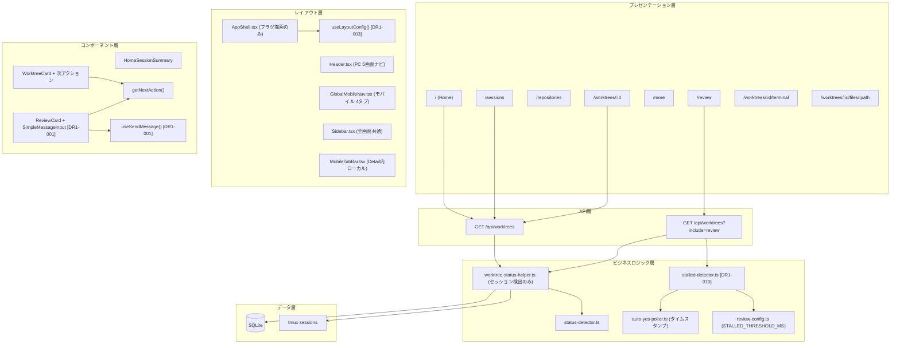

# Issue #600 設計方針書: ホーム中心のUX刷新とWorktree Detail中心導線の再設計

## 1. アーキテクチャ設計

### システム構成図



### レイヤー構成

| レイヤー | 責務 | 新規/変更 |
|---------|------|----------|
| プレゼンテーション層 (`src/app/`) | ページルーティング・画面構成 | 4画面新設、Home再設計 |
| レイアウト層 (`src/components/layout/`, `mobile/`) | ナビゲーション・レスポンシブ制御 | Header改修、GlobalMobileNav新設 |
| コンポーネント層 (`src/components/`) | UI部品 | ReviewCard新設、WorktreeCard拡張 |
| ビジネスロジック層 (`src/lib/`) | ステータス算出・次アクション | getNextAction新設、stalled-detector新設 [DR1-010] |
| API層 (`src/app/api/`) | データ取得・集約 | worktrees API拡張 |
| データ層 (`src/lib/db/`) | DBアクセス | **変更なし** |

### 設計原則

- **DBスキーマ変更なし**: Review画面のステータス（Done/Approval/Stalled）は既存フィールドからリアルタイム算出
- **既存API後方互換**: 追加フィールドはオプショナル、CLIクライアントへの影響なし
- **段階的実装**: Phase 1（画面枠組み）→ Phase 2（deep link・Detail改修）→ Phase 3（統合・テスト）
- **コンポーネント再利用**: 新規コンポーネントは最小限、共通ロジックはカスタムフックで共有 [DR1-001]
- **単一責務原則（SRP）**: レイアウト判断・送信ロジック・Stalled判定は専用モジュールに分離 [DR1-003, DR1-010]

---

## 2. 技術選定

| カテゴリ | 選定技術 | 選定理由 |
|---------|---------|---------|
| フレームワーク | Next.js 14 App Router | 既存技術スタック |
| 状態管理 | useReducer + useSearchParams | 既存パターン踏襲 + deep link対応 |
| ナビゲーション | usePathname + useSearchParams | App Router標準API |
| スタイル | Tailwind CSS | 既存技術スタック |
| テスト | Vitest + Playwright | 既存技術スタック |

### 技術的判断

| 判断事項 | 採用 | 却下 | 理由 |
|---------|------|------|------|
| Review画面API | 既存API拡張（`?include=review`） | 専用エンドポイント新設 | 保守コスト削減、後方互換維持 |
| `/worktrees/:id/reply` | 新設しない（インライン返信） | 専用ページ新設 | 画面遷移コスト回避、MessageInput再利用 |
| Stalled判定 | auto-yes-pollerタイムスタンプ | tmux capture直接呼出し | worktree多数環境のパフォーマンス |
| deep link | useSearchParams | useState | URL共有・ブックマーク対応 |
| インライン返信 [DR1-001] | SimpleMessageInput + useSendMessage | MessageInput variant prop | SRP維持、送信ロジック共通化で機能乖離リスク回避 |
| モバイルナビ | GlobalMobileNav新規 | MobileTabBar拡張 | 責務分離（グローバル vs ローカル） |

---

## 3. 設計パターン

### 3-1. Strategy パターン（既存踏襲）

CLIツール抽象化層（`src/lib/cli-tools/`）は既にStrategy パターンを適用。今回の変更では新規Strategyの追加なし。

### 3-2. 送信ロジック共通化パターン（新規適用） [DR1-001 対応]

MessageInput（474行、フル機能版）に variant を追加するのではなく、送信ロジックをカスタムフックに抽出し、軽量版を別コンポーネントとして新設する。

```typescript
// src/hooks/useSendMessage.ts（新規）- 送信ロジック共通フック
// 責務: terminal API送信 + chat-db永続化のみ [DR3-001]
// 画像添付リセット・pasted-text処理等の副作用は含まない
export function useSendMessage(worktreeId: string, agentId?: string) {
  // API呼び出し（terminal API送信 + chat-db永続化）、エラーハンドリング、送信状態管理
  return { send, isSending, error, onSuccess, onError };
}
```

```typescript
// src/components/review/SimpleMessageInput.tsx（新規）- Review画面用軽量版
// テキスト入力 + 送信ボタンのみ。useSendMessage() を利用。
// onSuccess: テキストクリアのみ
// セキュリティ [DR4-004]: dangerouslySetInnerHTML は使用しない。
//   入力値はプレーンテキストとして chat-db に保存、表示は React デフォルトエスケープを利用。
//   command パラメータの長さ制限は既存 terminal API の MAX_COMMAND_LENGTH（10000）に準拠。
```

```typescript
// src/components/worktree/MessageInput.tsx（既存）- フル機能版
// 下書き永続化、ファイル添付、スラッシュコマンド等。useSendMessage() を利用。
// variant prop は追加しない。
// onSuccess: useImageAttachment.resetAfterSend() + pasted-text-helper再送 + テキストクリア [DR3-001]
// onError: エラートースト表示
```

> **設計変更理由 (DR1-001)**: 当初は MessageInput に variant='simplified' を追加する方針だったが、レビューにより SRP 違反リスクが指摘された。simplified 版と default 版で共有するロジックは送信処理のみであり、共有部分が少ないにもかかわらず同一コンポーネントに押し込むのは不適切。送信ロジックを `useSendMessage()` フックに抽出し、フル機能版（MessageInput）と軽量版（SimpleMessageInput）に分離する。両者が `useSendMessage()` を共有することで、機能乖離リスクを回避しつつ SRP を維持する。

> **責務範囲の明確化 (DR3-001)**: `useSendMessage()` の責務は **API呼び出し（terminal API送信 + chat-db永続化）** に限定する。現在の MessageInput の送信処理は `WorktreeDetailRefactored` 内の `onSendMessage`/`handleSendMessage` 経由で実行されており、送信前後に以下の副作用と連携している:
> - `useImageAttachment` の `resetAfterSend()` による画像添付状態リセット
> - `chat-db` 経由のメッセージ永続化
> - terminal API への キー送信（`session-key-sender`）
> - `pasted-text-helper` による Enter 再送
>
> これらの副作用のうち、`useSendMessage()` が包含するのは **terminal API 送信と chat-db 永続化のみ** とし、画像添付リセット・pasted-text 処理は **呼び出し側の onSuccess/onError コールバック** で処理する。SimpleMessageInput は onSuccess でテキストクリアのみ、既存 MessageInput は onSuccess で画像添付リセット + pasted-text 再送 + テキストクリアを行う。この設計により、`useSendMessage()` を SimpleMessageInput に適用する際の副作用移行範囲が明確になり、画像添付送信や pasted-text 対応の退行バグを防止する。

### 3-3. Derived State パターン（新規適用） [DR1-002 備考]

Review画面のステータスはDBに保存せず、既存データからリアルタイム導出する。

> **OCP に関する備考 (DR1-002)**: 現在の `getNextAction()` は if 文の連鎖で次アクションを決定している。ステータスパターンが限定的な現時点では if 文で十分だが、CLIツール固有のステータスが追加される場合は、アクションマッピングテーブル（`Record<SessionStatus, (promptType, isStalled) => string>`）への移行を検討する。YAGNI 原則とのバランスを考え、現時点では現在の設計を許容する。

```typescript
// src/lib/session/next-action-helper.ts
export function getNextAction(
  status: SessionStatus | null,
  promptType: PromptType | null,
  isStalled: boolean
): string {
  if (!status) return 'Start';
  if (status === 'idle') return 'Start';
  if (status === 'ready') return 'Send message';
  if (status === 'waiting' && promptType === 'approval') return 'Approve / Reject';
  if (status === 'waiting') return 'Reply to prompt';
  if (status === 'running' && isStalled) return 'Check stalled';
  if (status === 'running') return 'Running...';
  // exhaustive check: SessionStatus が将来拡張された場合にコンパイルエラーで検出する [DR2-005]
  const _exhaustive: never = status;
  return 'Running...';
}

export type ReviewStatus = 'done' | 'approval' | 'stalled';

export function getReviewStatus(
  worktreeStatus: 'todo' | 'doing' | 'done' | null,
  sessionStatus: SessionStatus | null,
  promptType: PromptType | null,
  isStalled: boolean
): ReviewStatus | null {
  if (worktreeStatus === 'done') return 'done';
  if (sessionStatus === 'waiting' && promptType === 'approval') return 'approval';
  if (sessionStatus === 'running' && isStalled) return 'stalled';
  return null;
}
```

### 3-4. Conditional Layout パターン（新規適用） [DR1-003 対応]

pathname に基づくレイアウト判断を専用フック `useLayoutConfig()` に集約し、AppShell は返却されたフラグに基づいて描画するだけにする。これにより、新画面追加時はフック内のマッピングテーブルを更新するだけで済み、AppShell への条件分岐集中（SRP違反）を回避する。

```typescript
// src/hooks/useLayoutConfig.ts（新規）
interface LayoutConfig {
  showSidebar: boolean;
  showGlobalNav: boolean;
  showLocalNav: boolean;
  autoCollapseSidebar: boolean;
}

const LAYOUT_MAP: Record<string, Partial<LayoutConfig>> = {
  '/sessions': { autoCollapseSidebar: true },
  '/worktrees/': { showGlobalNav: false, showLocalNav: true },
  // 新画面追加時はここにエントリを追加するだけ
};

export function useLayoutConfig(): LayoutConfig {
  const pathname = usePathname();
  // pathname に基づきマッピングテーブルからフラグを解決
  // デフォルト値: { showSidebar: true, showGlobalNav: true, showLocalNav: false, autoCollapseSidebar: false }
}
```

```typescript
// AppShell.tsx - フラグに基づく描画のみ（条件分岐ロジックを持たない）
const { showSidebar, showGlobalNav, showLocalNav, autoCollapseSidebar } = useLayoutConfig();
```

> **設計変更理由 (DR1-003)**: 当初は AppShell.tsx 内で usePathname() に基づく条件分岐を直接記述する方針だったが、レビューにより SRP 違反（新画面追加のたびに AppShell を修正する必要がある）が指摘された。pathname に基づくレイアウト判断を `useLayoutConfig()` フックに集約することで、AppShell の責務を「フラグに基づく描画」に限定し、SRP を維持する。SidebarContext への `autoCollapsedPaths` 追加も不要となり、レイアウト判断ロジックの分散も解消される。

---

## 4. データモデル設計

### 既存モデル（変更なし）

```typescript
// src/types/models.ts - 変更不要
export interface Worktree {
  id: string;
  status?: 'todo' | 'doing' | 'done' | null;
  // ... 既存フィールド
}
```

### APIレスポンス拡張（オプショナルフィールド追加）

```typescript
// GET /api/worktrees?include=review のレスポンス
export interface WorktreeWithReviewStatus extends Worktree {
  // 既存フィールドすべて + 以下のオプショナルフィールド
  reviewStatus?: ReviewStatus | null;  // 'done' | 'approval' | 'stalled' | null
  isStalled?: boolean;                  // Stalled判定結果
  nextAction?: string;                  // 次アクション表示文字列
}
```

### 新規定数

```typescript
// src/config/review-config.ts
export const STALLED_THRESHOLD_MS = 300_000; // 5分（デフォルト）
export const REVIEW_POLL_INTERVAL_MS = 7_000; // 7秒
```

### DBスキーマ変更: **なし**

Review画面に必要なすべてのステータスは既存データからリアルタイム算出する。

---

## 5. API設計

### 既存API拡張

```
GET /api/worktrees                    - 既存（変更なし）
GET /api/worktrees?include=review     - Review用追加フィールド付き
GET /api/worktrees?repository=<path>  - 既存フィルタ（変更なし）
```

### `?include=review` レスポンス差分

| フィールド | 型 | 説明 | `include=review` なし | `include=review` あり |
|-----------|---|------|---------------------|---------------------|
| `reviewStatus` | `ReviewStatus \| null` | Review画面用ステータス | 含まれない | 含まれる |
| `isStalled` | `boolean` | Stalled判定 | 含まれない | 含まれる |
| `nextAction` | `string` | 次アクション表示 | 含まれない | 含まれる |

### レスポンス全体構造 [DR2-010 対応]

既存の `GET /api/worktrees` は `{ worktrees: [...], repositories: [...] }` 構造を返す。`?include=review` 時もこの構造を維持する。

```typescript
// ?include=review 時のレスポンス全体構造
{
  worktrees: WorktreeWithReviewStatus[],  // reviewStatus/isStalled/nextAction が追加
  repositories: Repository[]              // 既存と同一（変更なし）
}
```

**Repositories画面のデータ取得方針**: Repositories画面は既存の `GET /api/worktrees` の `repositories` 配列を利用する。専用の `/api/repositories` エンドポイントは新設しない。これにより、既存のAPIレスポンス構造を活用し、保守コストを抑える。

### 後方互換性

- 既存フィールドの型・値は一切変更しない
- 追加フィールドはすべてオプショナル
- `include` パラメータなしの既存レスポンスは完全互換
- CLI側の `WorktreeListResponse` 型への影響なし

### 共有キャッシュと既存Contextの責務分担 [DR3-001 対応]

`useWorktreesCache()` を導入しても、既存の `WorktreeSelectionContext` と二重に worktrees 一覧をポーリングしないよう責務を明確に分離する。

- `useWorktreesCache()` は **worktrees 一覧の唯一の取得元** とし、Home / Sessions / Review / Sidebar が共通利用する
- `WorktreeSelectionContext` は worktree 一覧の取得責務を持たず、**選択中 worktree ID・詳細取得・markAsViewed** に責務を限定する
- `AppProviders.tsx` に共有キャッシュProviderを追加し、`SidebarProvider` / `WorktreeSelectionProvider` / 各ページが同一キャッシュを参照する
- これにより、Sidebar が `WorktreeSelectionContext.worktrees` を直接参照している現構造から、共有キャッシュ経由の単一データソースへ段階的に移行する

> **影響範囲メモ (DR3-001)**: `AppProviders.tsx`, `WorktreeSelectionContext.tsx`, `Sidebar.tsx`, `AppShell.tsx` の責務境界が変わる。設計方針書段階でこの分担を固定しておかないと、`useWorktreesCache()` 追加後も `WorktreeSelectionContext` 側ポーリングが残り、API呼び出し重複と状態不整合を招く。

---

## 6. 画面設計

### 6-1. Home画面（`/`）

**責務**: Mission Control / Inbox。判断・優先度付けの画面。

**構成**:
- セッション集計サマリー（Running / Waiting のカウント） [DR2-011: Stalled カウントは除外。Home画面では `include=review` を付与しないため、Stalled判定は不可。Stalled数の把握はReview画面に委ねる]
- 最近のアクティビティ（直近の変化があったworktree）
- 各専門画面への1クリック導線
- クライアントサイド集計（worktrees APIの既存レスポンスを利用）
  - **セキュリティ注記 [DR4-005]**: クライアントサイド集計値は **表示目的のみ**。アクセス制御や操作可否の判断には使用しない

**既存コンポーネントの移動**:
- `RepositoryManager` → `/repositories` へ移動
- `ExternalAppsManager` → `/more` へ移動
- `WorktreeList`（探索機能） → `/sessions` へ移動

**移動先への導線設計 (DR3-003)**:

Home画面の全面書き換えにより、外部ブックマーク・ブラウザ履歴・CLI docs コマンドから直接 `/`（ルート）にアクセスした場合、従来の RepositoryManager 等が表示されなくなる。ユーザー混乱を軽減するため以下を実施する:

1. **ショートカットカード**: Home画面に RepositoryManager・WorktreeList・ExternalAppsManager の移動先を明示するショートカットカードを目立つ配置で設ける（「Repositories はこちら」「Sessions はこちら」等）
2. **初回案内バナー**: 初回表示時にUIの変更を案内する dismissible バナーを表示する（localStorage で表示済みフラグを管理）
3. **テスト影響**: `tests/integration/issue-288-acceptance.test.tsx` 等、Home画面のコンポーネント構成を前提としたテストを影響テスト一覧に追加する

### 6-2. Sessions画面（`/sessions`） [DR1-005 対応]

**責務**: Worktree探索・検索・絞り込みの専用面。

**構成**:
- 全worktreeの一覧表示（Repository名 / Branch名 / Agent / Status / 次アクション）
- サイドバーと内容が重複するため、Sessions画面ではサイドバー自動折りたたみ

**ロジック共通化 (DR1-005, DR3-009)**:
- Sessions 画面と Sidebar の Worktree リスト表示ロジック（フィルタ、ソート、グループ化）を共通フック `useWorktreeList()` に抽出する
- `sidebar-utils.ts` の `sortBranches()`, `groupBranches()` ロジックをフックに統合
- Sessions 画面と Sidebar の両方が `useWorktreeList()` を利用する形にし、UI は別々でもデータ取得・加工ロジックは共通化する
- これにより DRY 違反の拡大を防止する
- `toBranchItem()` を持つ `src/types/sidebar.ts` は Sidebar 固有の表示変換に責務を限定し、Sessions画面の一覧整形ロジックは `useWorktreeList()` 側へ寄せる
- `BranchListItem.tsx` は Sidebar専用表示として維持し、Sessions画面は別の一覧行コンポーネントを持つか、共有する場合も props を Sidebar前提に固定しない

**ソート状態管理の分離設計 (DR3-009)**:

`useWorktreeList()` はソート・フィルタの **実行ロジックのみ** を提供し、ソート状態の **保持** は呼び出し側に委ねる。これにより、Sidebar のソート変更が Sessions 画面に波及する問題を回避する。

```typescript
// useWorktreeList() のインターフェース [DR3-009]
export function useWorktreeList(options: {
  worktrees: Worktree[];
  sortKey: SortKey;
  sortDirection: SortDirection;
  viewMode: ViewMode;
  searchQuery?: string;
}): {
  sortedWorktrees: Worktree[];
  groupedWorktrees: BranchGroup[];
}
```

- **Sidebar**: `SidebarContext`（localStorage パターン）経由で sortKey/sortDirection/viewMode を管理し、`useWorktreeList()` に注入する。既存の SidebarContext の状態管理構造は変更しない
- **Sessions 画面**: 独自の `useState` + localStorage で sortKey/sortDirection/viewMode を管理し、`useWorktreeList()` に注入する。Sessions 画面固有の localStorage キー（例: `sessions-sort-key`）を使用し、Sidebar の localStorage キーとは独立させる
- **状態の独立性**: Sessions 画面とSidebar で異なるソート設定を同時に保持でき、一方の変更が他方に波及しない

### 6-3. Repositories画面（`/repositories`）

**責務**: Repository登録・clone・sync・excluded restore。

**構成**:
- 既存 `RepositoryManager` をほぼそのまま移動
- Repository一覧 + 操作ボタン

### 6-4. Review画面（`/review`）

**責務**: Done / Approval / Stalled の処理面。

**構成**:
- 3タブフィルタ: Done | Approval | Stalled
- ReviewCard: Repository名 / Branch名 / Agent / Status / 次アクション + インライン返信
- PC: インライン返信フォーム（`SimpleMessageInput` + `useSendMessage()`） [DR1-001]
- モバイル: カードタップで `/worktrees/:id?pane=terminal` へ遷移
- ポーリング: `REVIEW_POLL_INTERVAL_MS`（7秒）で `?include=review` を取得

### 6-5. More画面（`/more`）

**責務**: Settings / External Apps / Help / Auth の補助面。

**構成**:
- External Apps（既存 `ExternalAppsManager` 移動）
- Theme / Locale 設定
- Auth情報
- Help / About

### 6-6. Worktree Detail（`/worktrees/:id`） [DR1-007 対応]

**責務**: 主実行画面（変更は最小限）。

**変更点**:
- ヘッダーに Repository名・Branch名・Agent・Status・次アクション 常時表示
- deep link対応（`?pane=xxx`）
- タブ状態を `useSearchParams()` で管理

**事前リファクタリング（WorktreeDetailRefactored 分割戦略） (DR1-007)**:

WorktreeDetailRefactored.tsx（1966行）への deep link 対応・ヘッダー情報追加を安全に行うため、Issue #600 の一環として以下の責務分割を先行して実施する。

1. **ヘッダー部分抽出**: `WorktreeDetailHeader.tsx` として抽出（Repository名・Branch名・Agent・Status・次アクション表示）
2. **タブ状態管理抽出**: `useWorktreeTabState()` フックに抽出（useSearchParams 連携含む）
3. **レスポンシブ分岐分離**: `WorktreeDetailDesktop.tsx` / `WorktreeDetailMobile.tsx` に分離

この前処理により、後続の deep link 対応やヘッダー情報追加が個別の小さなコンポーネントへの変更となり、レビュー容易性とバグ混入リスク軽減が得られる。

---

## 7. ナビゲーション設計

### PC ナビゲーション

```
┌──────────────────────────────────────────────────────────────┐
│ [Logo] CommandMate    Home | Sessions | Repos | Review | More│  ← Header.tsx
├──────────┬───────────────────────────────────────────────────┤
│ Sidebar  │  メインコンテンツ                                  │
│ (常時)   │                                                   │
│ Sessions │                                                   │
│ で自動   │                                                   │
│ 折りたたみ│                                                   │
└──────────┴───────────────────────────────────────────────────┘
```

### モバイル ナビゲーション

**通常画面（Home / Sessions / Review / More）:**
```
┌──────────────────────────┐
│ [≡] CommandMate          │  ← ハンバーガー（サイドバー）
├──────────────────────────┤
│                          │
│  メインコンテンツ         │
│                          │
├──────────────────────────┤
│ Home | Sessions | Review | More │  ← GlobalMobileNav.tsx
└──────────────────────────┘
```

**Detail画面（`/worktrees/:id`）:**
```
┌──────────────────────────┐
│ ← Back   Repo / Branch   │  ← MobileHeader.tsx
├──────────────────────────┤
│                          │
│  Detail コンテンツ        │
│                          │
├──────────────────────────┤
│ terminal | history | files | memo | info │  ← MobileTabBar.tsx（既存）
└──────────────────────────┘
```

**排他制御**: `usePathname().startsWith('/worktrees/')` で判定。

### deep link pane マッピング [DR2-006 対応]

pane値9種は既存の `MobileActivePane`（5値）・`LeftPaneTab`（3値）とは1対1対応ではないため、専用の `DeepLinkPane` 型を新設し、既存型への変換ロジックを `useWorktreeTabState()` フック内に閉じ込める。

```typescript
// src/types/ui-state.ts - DeepLinkPane型を新設 [DR2-006]
export type DeepLinkPane = 'terminal' | 'history' | 'git' | 'files' | 'notes' | 'logs' | 'agent' | 'timer' | 'info';

// ランタイム型ガード関数 [DR4-002, DR4-010 Must Fix]
const VALID_PANES = new Set<DeepLinkPane>([
  'terminal', 'history', 'git', 'files', 'notes', 'logs', 'agent', 'timer', 'info'
]);
export function isDeepLinkPane(value: string): value is DeepLinkPane {
  return VALID_PANES.has(value as DeepLinkPane);
}

// MobileActivePane・LeftPaneTab型は既存のまま維持（pane値9種への拡張はしない）
// DeepLinkPane → MobileActivePane/LeftPaneTab への変換は useWorktreeTabState() 内で実装
```

> **セキュリティ設計規約 (DR4-010 Must Fix)**: `useWorktreeTabState()` の冒頭で `searchParams.get('pane')` を `isDeepLinkPane()` で検証し、不正値は `'terminal'` にフォールバックする。フォールバック後の pane 値のみを内部ロジックで使用し、生の `searchParams.get('pane')` 値をコンポーネント内で直接参照しない。これにより DOM-based XSS の経路を遮断する。

| pane値 (DeepLinkPane) | PC (LeftPaneTab) | モバイル (MobileTab + subTab) |
|--------|-----------------|------------------------------|
| `terminal` | terminal | terminal |
| `history` | history (message) | history |
| `git` | history (git subTab) | history + git subTab |
| `files` | files | files |
| `notes` | memo (notes subTab) | memo + notes subTab |
| `logs` | memo (logs subTab) | memo + logs subTab |
| `agent` | memo (agent subTab) | memo + agent subTab |
| `timer` | memo (timer subTab) | memo + timer subTab |
| `info` | - | info |

---

## 8. セキュリティ設計

### 認証

- 新規URL（`/sessions`, `/repositories`, `/review`, `/more`）は既存ワイルドカードmatcherで自動保護
- `AUTH_EXCLUDED_PATHS` に誤って追加されていないことをテストで検証（**Must Fix: DR4-003** 統合テストで必須検証）
- 設定変更は不要

### 入力バリデーション

#### `?include` パラメータのホワイトリスト検証 [DR4-001]

- 許可値を定数として定義する: `const VALID_INCLUDE_VALUES = ['review'] as const`
- 不正値（許可値に含まれない値）は **無視してincludeなしと同等** に扱う。エラーレスポンスは返さない（情報漏洩防止）
- カンマ区切り対応する場合は各値を個別にホワイトリスト検証する: `const includes = new Set(searchParams.get('include')?.split(',').filter(v => VALID_INCLUDE_VALUES.includes(v)) ?? [])`
- 不正パラメータはログ出力せずサイレントフォールバック（DoSログ汚染防止） [DR4-007]

#### `?pane=xxx` パラメータのランタイムホワイトリスト検証 [DR4-002, DR4-010 Must Fix]

- `src/types/ui-state.ts` にランタイム型ガード関数を定義する:

```typescript
const VALID_PANES = new Set<DeepLinkPane>([
  'terminal', 'history', 'git', 'files', 'notes', 'logs', 'agent', 'timer', 'info'
]);

export function isDeepLinkPane(value: string): value is DeepLinkPane {
  return VALID_PANES.has(value as DeepLinkPane);
}
```

- `useWorktreeTabState()` の **冒頭** で `searchParams.get('pane')` を型ガードで検証し、不正値は `'terminal'` にフォールバックする
- **設計規約**: フォールバック後の pane 値のみを内部ロジックで使用し、生の `searchParams.get('pane')` 値をコンポーネント内で直接参照しない
- 不正パラメータはログ出力せずサイレントフォールバック（DoSログ汚染防止） [DR4-007]

### XSS対策 [DR4-004]

- `SimpleMessageInput` / `ReviewCard` では `dangerouslySetInnerHTML` を **使用しない**
- `useSendMessage()` 内で command パラメータの長さ制限は既存 terminal API の `MAX_COMMAND_LENGTH`（10000）に準拠する
- chat-db 永続化時の入力値は **プレーンテキスト** として保存し、表示時は React のデフォルトエスケープを利用する
- インラインスクリプトや `eval()` は使用しない [DR4-006]

### CSP（Content Security Policy） [DR4-006]

- CSP ヘッダーの導入は Issue #600 のスコープ外とし、**別 Issue として起票** する
- ただし Issue #600 の新規コンポーネント（SimpleMessageInput / ReviewCard）ではインラインスクリプトや `eval()` を使用しない方針とし、将来の CSP 導入時に対応不要な状態を維持する

### CSRF対策 [DR4-008]

- 認証 Cookie の `SameSite=strict` 設定と同一オリジン fetch により防御
- 追加の CSRF トークン実装は不要
- この前提は `SimpleMessageInput` の `useSendMessage()` にも適用される

### セキュリティログ方針 [DR4-007]

- 不正な `include` / `pane` パラメータはログ出力せずサイレントフォールバック（DoS ログ汚染防止）
- 存在しない worktree ID への送信試行は既存 terminal API のエラーログに委ねる
- 新規のセキュリティログ追加は不要（既存 middleware / API のログで十分カバー）

---

## 9. パフォーマンス設計

| 画面 | 集計方式 | ポーリング間隔 | 根拠 |
|------|---------|-------------|------|
| Home | クライアントサイド集計 | 既存worktrees APIのポーリング | worktree < 50で十分 |
| Sessions | 既存APIそのまま | 既存 | 変更なし |
| Review | サーバーサイド算出（`?include=review`） | 7秒 | Stalled判定はサーバー必須 |
| Detail | 既存 | 既存 | 変更なし |

### ポーリング状態の共有キャッシュ設計 [DR1-009 対応]

複数画面（Home、Sessions、Review、Sidebar）が同一の worktrees API をポーリングする場合、不要な API 呼び出しの重複やステータス更新タイミングのズレが生じるリスクがある。

**方針**:
- worktrees API のポーリング結果を React Context ベースの共有キャッシュで一元管理する
- 共有キャッシュフック `useWorktreesCache()` を新設し、複数画面から同一データを参照できるようにする
- Review 画面在中時は共有キャッシュのフェッチが `?include=review` を付与し、base データと review データの両方を更新する。Review 画面を離れた場合は通常モードに戻る [DR3-010]
- 既存のポーリング機構（`useFilePolling` 等）との統合方針: worktrees 一覧のポーリングは共有キャッシュに統合し、個別 worktree のファイル/ターミナルポーリングは既存機構を維持する
- `WorktreeSelectionContext` に残っている一覧取得・ポーリング責務は共有キャッシュへ移し、selection context は選択状態管理へ縮退させる [DR3-001]

**Phase 1 での暫定対応 (DR3-004)**:

`useWorktreesCache()` は Phase 2 で導入するが、Phase 1 で作成する全画面（Home/Sessions/Review/Sidebar改修）が独自に worktrees API を fetch すると、Phase 2 で全画面のデータ取得ロジックを書き換える手戻りが発生する。これを防止するため、Phase 1 では `useWorktreesCache()` と同一インターフェースの **薄いラッパー**（内部実装は直接 fetch）を配置し、Phase 2 でラッパーの中身をキャッシュ実装に差し替える戦略を採用する。

```typescript
// Phase 1: src/hooks/useWorktreesCache.ts - 薄いラッパー（直接fetch）
// Phase 2 でキャッシュ実装に差し替え。呼び出し側の変更不要
export function useWorktreesCache(options?: { includeReview?: boolean }) {
  // Phase 1: 各画面が個別にfetchするのと同等だが、インターフェースを固定
  // Phase 2: React Context ベースの共有キャッシュに差し替え
}
```

**Review画面ポーリングの統合 (DR3-010)**:

Review 画面の 7 秒ポーリング（`?include=review`）と共有キャッシュの通常ポーリングが 2 系統並行するリスクを回避するため、`useWorktreesCache()` に拡張フェッチモードを設ける。Review 画面在中時は共有キャッシュ自体が `?include=review` 付きでフェッチし、base データと review データの両方を 1 回の API 呼び出しで更新する。Review 画面を離れた場合は通常モード（`?include` なし）に自動で戻る。これにより 2 系統が 1 系統に統合される。

**フェッチモード切替時のデータ整合性保証 [DR4-009]**:

Phase 2 のキャッシュ実装において、フェッチモード切替時（Review画面への遷移/離脱時）にレースコンディションが発生するリスクを防止するため、以下の方針を適用する:

1. フェッチモード切替時は進行中の fetch を **AbortController でキャンセル** する
2. 通常モードに戻った際は review 用フィールド（`reviewStatus`, `isStalled`, `nextAction`）を **undefined にクリア** する
3. Phase 2 実装時のテストケースとして「モード切替時のデータ整合性」を追加する（Review画面離脱直後に `?include=review` 付きレスポンスが返却された場合に review 用フィールドが通常モード画面に残留しないことを検証）

> **設計変更理由 (DR1-009)**: 当初はポーリング状態の共有について明記されていなかったが、レビューにより複数画面からの並行ポーリングによる競合リスクが指摘された。React Context ベースの共有キャッシュにより、API 呼び出しの重複を防止し、画面間のステータス一貫性を確保する。

### Stalled判定の最適化 [DR1-010 対応]

Stalled 判定ロジックは `worktree-status-helper.ts` には追加せず、専用モジュール `stalled-detector.ts` に配置する。これにより、worktree-status-helper.ts は純粋にセッションステータス検出の責務に留まり、DIP違反を回避する。

- **Stalled判定モジュール**: `src/lib/detection/stalled-detector.ts`（新規）
  - `auto-yes-manager.ts` 経由で `getLastServerResponseTimestamp()` を取得
  - `STALLED_THRESHOLD_MS` との比較によるStalled判定
  - 各worktreeのStalled判定はO(1)のタイムスタンプ比較。API全体ではworktree数に比例（O(N)）するが、既存の `detectWorktreeSessionStatus()` と同等のオーダーであり、worktree < 50 の前提で十分なパフォーマンス [DR3-006]
- **呼び出し元**: APIルートハンドラが `?include=review` の場合のみ `stalled-detector.ts` を呼び出す
- **worktree-status-helper.ts**: セッションステータス検出のみ。Stalled判定は含まない

> **設計変更理由 (DR1-010)**: 当初は worktree-status-helper.ts に Stalled 判定を追加する方針だったが、レビューによりセッション検出の責務と Review ビジネスルールの責務が混在する DIP 違反が指摘された。Stalled 判定を専用モジュールに分離し、API ルートハンドラが必要時のみ呼び出す構成とすることで、責務を明確に分離する。

---

## 10. 設計上の決定事項とトレードオフ

| 決定事項 | 選択 | トレードオフ |
|---------|------|-------------|
| DBスキーマ変更なし | リアルタイム算出 | API応答時の計算コスト（軽微） |
| 既存API拡張 | `?include=review` | クエリパラメータの複雑化 |
| MessageInput分離 [DR1-001] | useSendMessage + SimpleMessageInput新設 | コンポーネント数増加（SRP維持のトレードオフ） |
| サイドバー維持 | 全画面共通 | Sessions画面との重複（useWorktreeList共通化で軽減 [DR1-005]） |
| GlobalMobileNav新設 | MobileTabBarと分離 | コンポーネント数増加 |
| deep link段階的実装 | Phase分割 | 全機能完了までのリードタイム |
| useWorktreesCache Phase 1薄いラッパー戦略 [DR3-004] | インターフェース固定でPhase間手戻り回避 | Phase 1では共有キャッシュの恩恵なし（ポーリング競合は一時的に存在） |

### 代替案比較

| 案 | メリット | デメリット | 判定 |
|----|---------|----------|------|
| Review専用APIエンドポイント | 責務明確 | 保守コスト倍増、コード重複 | 却下 |
| DBにreviewStatusカラム追加 | クエリ高速 | マイグレーション必要、データ二重管理 | 却下 |
| /reply専用ページ | 独立した体験 | 画面遷移コスト、送信ロジック重複 | 却下 |
| サイドバー廃止 | Sessions画面に統合 | 他画面からのクイックアクセス喪失 | 却下 |

---

## 11. 実装計画概要

### Phase依存関係マトリクス [DR2-012 対応]

| ファイル | 作成Phase | 初回使用Phase | 備考 |
|---------|----------|-------------|------|
| `src/config/review-config.ts` | Phase 1 | Phase 2 | Stalled閾値定数の事前定義。Phase 1ではReview画面のDone/Approvalフィルタで `REVIEW_POLL_INTERVAL_MS` のみ使用。`STALLED_THRESHOLD_MS` はPhase 2の `stalled-detector.ts` から初めて使用 |
| `src/hooks/useLayoutConfig.ts` | Phase 1 | Phase 1 | AppShell改修と同時に使用開始 |
| `src/hooks/useWorktreeList.ts` | Phase 1 | Phase 1 | Sessions画面・Sidebar共通化で使用開始 |
| `src/lib/detection/stalled-detector.ts` | Phase 2 | Phase 2 | `review-config.ts` の `STALLED_THRESHOLD_MS` を参照 |
| `src/lib/session/next-action-helper.ts` | Phase 2 | Phase 2 | Review画面・Detail画面の次アクション表示 |
| `src/hooks/useWorktreesCache.ts` | Phase 1（薄いラッパー） | Phase 1 | Phase 1では直接fetch実装。Phase 2でキャッシュ実装に差し替え [DR3-004] |
| `src/hooks/useSendMessage.ts` | Phase 2 | Phase 2 | SimpleMessageInput・MessageInput共通。責務はAPI呼び出しのみ [DR3-001] |

### Phase 1: 画面枠組み・ナビゲーション（推定新規ファイル: 約10個）

**新規ファイル:**
- `src/app/sessions/page.tsx`
- `src/app/repositories/page.tsx`
- `src/app/review/page.tsx`
- `src/app/more/page.tsx`
- `src/components/mobile/GlobalMobileNav.tsx`
- `src/components/home/HomeSessionSummary.tsx`
- `src/config/review-config.ts` ※Phase 1では `REVIEW_POLL_INTERVAL_MS` のみ使用。`STALLED_THRESHOLD_MS` はPhase 2から使用 [DR2-012]
- `src/hooks/useLayoutConfig.ts` [DR1-003]
- `src/hooks/useWorktreeList.ts` [DR1-005]
- `src/hooks/useWorktreesCache.ts` [DR3-004] ※Phase 1では薄いラッパー（直接fetch）。Phase 2でキャッシュ実装に差し替え

**主要変更ファイル:**
- `src/app/page.tsx` - 全面書き換え
- `src/components/layout/Header.tsx` - PC 5画面ナビ追加
- `src/components/layout/AppShell.tsx` - useLayoutConfig利用（条件分岐はフックに委譲） [DR1-003]
- `src/contexts/SidebarContext.tsx` - `autoCollapsedPaths` 追加は不要に [DR1-003]
- `src/components/providers/AppProviders.tsx` - 共有キャッシュProviderの組み込み位置を調整 [DR3-001]
- `src/contexts/WorktreeSelectionContext.tsx` - 一覧取得責務を shared cache へ移管 [DR3-001]

### Phase 2: deep link・Detail改修

**新規ファイル:**
- `src/lib/session/next-action-helper.ts`
- `src/lib/detection/stalled-detector.ts` [DR1-010]
- `src/components/review/ReviewCard.tsx`
- `src/components/review/SimpleMessageInput.tsx` [DR1-001]
- `src/hooks/useSendMessage.ts` [DR1-001]
- `src/hooks/useWorktreeTabState.ts` [DR1-007]
- ~~`src/hooks/useWorktreesCache.ts`~~ Phase 1に前倒し（薄いラッパー）。Phase 2ではキャッシュ実装に差し替え [DR3-004]
- `src/components/worktree/WorktreeDetailHeader.tsx` [DR1-007]
- `src/components/worktree/WorktreeDetailDesktop.tsx` [DR1-007]
- `src/components/worktree/WorktreeDetailMobile.tsx` [DR1-007]

**主要変更ファイル:**
- `src/components/worktree/WorktreeDetailRefactored.tsx` - 責務分割（Header/Desktop/Mobile抽出）+ useSearchParams移行 [DR1-007]
- `src/components/worktree/MessageInput.tsx` - 送信ロジックをuseSendMessageに抽出（variant追加はしない） [DR1-001]
- `src/components/worktree/WorktreeCard.tsx` - 次アクション表示
- `src/components/mobile/MobileTabBar.tsx` - searchParams統合
- `src/types/ui-state.ts` - `DeepLinkPane` 型新設（MobileActivePane・LeftPaneTab型は既存維持） [DR2-006]
- `src/types/ui-actions.ts` - アクション型更新
- `src/hooks/useWorktreeUIState.ts` - reducer更新
- `src/components/worktree/LeftPaneTabSwitcher.tsx` - 拡張tab対応
- `src/app/api/worktrees/route.ts` - `?include=review` 対応、Stalled判定はstalled-detector経由 [DR1-010]
- `src/lib/session/worktree-status-helper.ts` - セッションステータス検出のみ（Stalled判定は追加しない） [DR1-010]
- `src/types/sidebar.ts` - Sidebar固有変換責務の見直し（Sessions画面の一覧整形と分離） [DR3-002]
- `src/components/layout/Sidebar.tsx` - `useWorktreeList()` / 共有キャッシュへの接続変更 [DR3-002]

### Phase 3: 統合・テスト・ドキュメント

**主要作業:**
- 既存テスト修正（38ファイル以上） [DR3-002]
- 新規テスト作成
- E2Eテスト更新
- `docs/architecture.md` 更新

---

## 12. テスト戦略

### ユニットテスト

| テスト対象 | テスト内容 | Phase |
|-----------|----------|-------|
| `getNextAction()` | 全SessionStatus × PromptType × isStalled組み合わせ | 2 |
| `getReviewStatus()` | Done/Approval/Stalled/null判定 | 2 |
| `STALLED_THRESHOLD_MS` | 閾値境界テスト | 2 |
| `SimpleMessageInput` [DR1-001] | 送信・エラーハンドリング・無効化 | 2 |
| `useSendMessage` [DR1-001] | API呼び出し・状態管理・エラーハンドリング | 2 |
| `useLayoutConfig` [DR1-003] | pathname別レイアウトフラグ解決 | 1 |
| `useLayoutConfig` デフォルト値検証 [DR3-005] | `/` と `/worktrees/:id` のレイアウトフラグが導入前後で変化しないこと。特に showGlobalNav/showLocalNav と既存 MobileTabBar の整合性 | 1 |
| `stalled-detector` [DR1-010] | 閾値境界テスト・タイムスタンプ比較 | 2 |

### 統合テスト

| テスト対象 | テスト内容 | Phase | 優先度 |
|-----------|----------|-------|--------|
| 認証ミドルウェア [DR4-003 Must Fix] | 新規URL4件の保護検証（詳細は下記） | 1 | **Must Fix** |
| worktrees API | `?include=review` レスポンス | 2 | Should Fix |
| 後方互換性 | 既存CLIレスポンス互換 | 3 | Should Fix |
| キャッシュモード切替 [DR4-009] | フェッチモード切替時のデータ整合性 | 2 | Should Fix |

#### 認証ミドルウェア保護検証テストケース [DR4-003 Must Fix]

以下の3種のテストケースを Phase 1 の統合テストで **必須実装** する:

1. **認証なしアクセス拒否テスト**: `/sessions`, `/repositories`, `/review`, `/more` の4パスに認証なしでアクセスした場合、401または302（ログインリダイレクト）が返されることを検証
2. **AUTH_EXCLUDED_PATHS 除外検証テスト**: `AUTH_EXCLUDED_PATHS` にこれら4パスが含まれていないことをアサーションで検証（誤追加防止）
3. **middleware.config.matcher パターン検証テスト**: middleware の matcher 正規表現がこれら4パスにマッチすることをユニットテストで検証

### 既存テスト影響範囲 [DR3-002 対応]

今回の変更で影響を受ける既存テストは **38ファイル以上**（unit 15ファイル + integration 23ファイル）に及ぶ [DR3-002]。特にWorktreeDetailRefactored分割に伴う以下の4ファイルは、分割後のコンポーネント構造に合わせた根本的な書き換えが必要であり、Phase 2の独立タスクとして工数を見積もる:

- `tests/unit/components/worktree/WorktreeDetailRefactored-mobile-overflow.test.tsx` - **根本書き換え**
- `tests/unit/components/worktree/WorktreeDetailRefactored-cli-tab-switching.test.tsx` - **根本書き換え**
- `tests/unit/components/WorktreeDetailRefactored.test.tsx` - **根本書き換え**
- `tests/integration/worktree-detail-integration.test.tsx` - **根本書き換え**

その他の影響テスト:

- レイアウト系: `tests/unit/components/layout/AppShell.test.tsx`, `tests/unit/components/layout/Sidebar.test.tsx`, `tests/unit/contexts/SidebarContext.test.tsx`
- モバイルナビ系: `tests/unit/components/mobile/MobileTabBar.test.tsx`, `tests/integration/issue-278-acceptance.test.ts`
- Home画面前提テスト [DR3-003]: `tests/integration/issue-288-acceptance.test.tsx` 等、Home画面のコンポーネント構成を前提としたテスト
- 型・変換系: `tests/unit/types/left-pane-tab.test.ts`, `tests/unit/types/sidebar.test.ts`, `tests/unit/lib/sidebar-utils.test.ts`
- 認証・API互換系: `tests/integration/auth-middleware.test.ts`, `src/cli/types/api-responses.ts` に依存する CLI テスト群

### 後方互換性検証の具体化 [DR3-003 対応]

APIの後方互換性は「問題なし」と書くだけでなく、既存CLI型と呼び出し経路を検証対象として固定する。

- `src/cli/types/api-responses.ts` の `WorktreeListResponse` / `WorktreeItem` は **必須フィールド不変・追加フィールド無視可能** を維持する
- `src/cli/commands/ls.ts` が `GET /api/worktrees` を従来どおり解釈できることを確認する
- `?include=review` 追加によっても、`include` なしレスポンスの JSON shape は `{ worktrees, repositories }` のまま不変とする
- 統合テストでは `include` なし / `include=review` ありの両ケースを比較し、差分が review 用オプショナルフィールドのみに限定されることを検証する

### E2Eテスト

| テスト対象 | テスト内容 | Phase |
|-----------|----------|-------|
| ナビゲーション | PC 5画面遷移、モバイル 4タブ遷移 | 1, 3 |
| deep link | pane パラメータでタブ復元 | 2, 3 |
| Review画面 | フィルタ、インライン返信 | 2, 3 |
| 退行テスト | 既存機能の動作確認 | 3 |

---

## 13. リスクと軽減策

| リスク | 影響度 | 軽減策 |
|-------|-------|--------|
| WorktreeDetailRefactored（1966行）の大規模変更 | 高 | 事前リファクタリングで責務分割（Header/TabState/Desktop/Mobile抽出）後にdeep link対応 [DR1-007] |
| 既存テスト38ファイル以上への波及 [DR3-002] | 中 | テスト修正をPhase別に計画。特にWorktreeDetailRefactored分割に伴う4ファイル（mobile-overflow/cli-tab-switching/WorktreeDetailRefactored本体/worktree-detail-integration）は根本的書き換えが必要 |
| Stalled判定の精度 | 低 | 閾値を設定定数化、チューニング可能に |
| パフォーマンス（Review画面ポーリング） | 低 | 7秒間隔、タイムスタンプ比較のみ、共有キャッシュで重複防止 [DR1-009] |

---

## 14. Stage 1 レビュー指摘事項サマリー

### レビュー概要

| 項目 | 値 |
|------|---|
| レビューステージ | Stage 1: 設計原則レビュー |
| レビュアー | Claude Opus |
| Must Fix | 2件 |
| Should Fix | 5件 |
| Nice to Have | 3件 |

### 指摘事項一覧

| ID | 重要度 | カテゴリ | タイトル | 対応状況 |
|----|--------|---------|---------|---------|
| DR1-001 | Should Fix | SOLID (SRP) | MessageInput variant追加によるSRP違反リスク | 反映済: useSendMessage + SimpleMessageInput分離 |
| DR1-002 | Should Fix | SOLID (OCP) | getNextAction() のOCP違反リスク | 反映済: 備考として記載、YAGNI考慮で現設計許容 |
| DR1-003 | Must Fix | SOLID (SRP) | AppShell.tsx pathname条件分岐集中 | 反映済: useLayoutConfig() フックに集約 |
| DR1-004 | Nice to Have | KISS | deep link pane マッピングの複雑性 | 備考記録（設計変更なし） |
| DR1-005 | Should Fix | DRY | Sessions画面とサイドバーの機能重複 | 反映済: useWorktreeList() 共通フック |
| DR1-006 | Nice to Have | YAGNI | More画面の設計範囲が広い | 備考記録（設計変更なし） |
| DR1-007 | Should Fix | コンポーネント設計 | WorktreeDetailRefactored分割戦略の欠如 | 反映済: Header/TabState/Desktop/Mobile抽出 |
| DR1-008 | Nice to Have | API設計 | include クエリパラメータの拡張設計 | 備考記録（設計変更なし） |
| DR1-009 | Should Fix | 状態管理 | ポーリング状態の競合リスク | 反映済: useWorktreesCache() 共有キャッシュ |
| DR1-010 | Must Fix | SOLID (DIP) | worktree-status-helper Stalled判定DIP違反 | 反映済: stalled-detector.ts 分離 |

### Nice to Have 備考（設計方針書への変更なし）

**DR1-004**: deep link pane マッピングの複雑性について、`useDeepLinkPane()` フックへの閉じ込めと `PANE_CONFIG` 設定オブジェクトの一元管理は有効な提案。実装時に検討する。

**DR1-006**: More画面の Theme/Locale/Auth/Help は新規UI開発が必要であり、Phase 1 では ExternalAppsManager の移動のみを行い、残りは将来の Issue として分離することを検討する。

**DR1-008**: include パラメータがカンマ区切りの複数値を受け付けるかを実装時に明確化する。推奨実装: `const includes = new Set(searchParams.get('include')?.split(',') ?? [])`

---

## 15. レビュー対応 実装チェックリスト

### Must Fix

- [ ] **DR1-003**: `src/hooks/useLayoutConfig.ts` を新設し、pathname別レイアウトフラグ解決を実装
- [ ] **DR1-003**: `AppShell.tsx` から pathname 条件分岐を除去し、useLayoutConfig() のフラグに基づく描画に変更
- [ ] **DR1-003**: `SidebarContext.tsx` への `autoCollapsedPaths` 追加を取りやめ（useLayoutConfig で対応）
- [ ] **DR1-010**: `src/lib/detection/stalled-detector.ts` を新設し、Stalled判定ロジックを実装
- [ ] **DR1-010**: `worktree-status-helper.ts` にはStalled判定を追加しない
- [ ] **DR1-010**: APIルートハンドラ（`?include=review`）から stalled-detector を呼び出す

### Should Fix

- [ ] **DR1-001**: `src/hooks/useSendMessage.ts` を新設し、MessageInput から送信ロジックを抽出
- [ ] **DR1-001**: `src/components/review/SimpleMessageInput.tsx` を新設（useSendMessage利用）
- [ ] **DR1-001**: `MessageInput.tsx` を useSendMessage 利用に修正（variant prop は追加しない）
- [ ] **DR1-002**: getNextAction() に OCP 備考コメントを記載（将来のマッピングテーブル化の余地）
- [ ] **DR1-005**: `src/hooks/useWorktreeList.ts` を新設し、Sessions/Sidebar のフィルタ・ソート・グループ化を共通化
- [ ] **DR1-007**: WorktreeDetailRefactored から WorktreeDetailHeader を抽出
- [ ] **DR1-007**: WorktreeDetailRefactored から useWorktreeTabState フックを抽出
- [ ] **DR1-007**: WorktreeDetailRefactored を WorktreeDetailDesktop / WorktreeDetailMobile に分離
- [ ] **DR1-009**: `src/hooks/useWorktreesCache.ts` を新設し、worktrees ポーリングの共有キャッシュを実装

---

## 16. Stage 2 レビュー指摘事項サマリー

### レビュー概要

| 項目 | 値 |
|------|---|
| レビューステージ | Stage 2: 整合性レビュー |
| レビュアー | Claude Opus |
| Must Fix | 2件 |
| Should Fix | 6件 |
| Nice to Have | 4件 |

### 指摘事項一覧

| ID | 重要度 | カテゴリ | タイトル | 対応状況 |
|----|--------|---------|---------|---------|
| DR2-001 | Must Fix | Issue整合性 | Issue本文にvariant='simplified'方式の旧記載が残存 | 反映済: Issue本文をSimpleMessageInput + useSendMessage()方式に更新 |
| DR2-002 | Should Fix | Issue整合性 | Issue本文にautoCollapsedPaths旧記載が残存 | 反映済: Issue本文をuseLayoutConfig()方式に更新 |
| DR2-003 | Should Fix | Issue整合性 | Issue本文にworktree-status-helper Stalled判定旧記載が残存 | 反映済: Issue本文をstalled-detector.ts方式に更新 |
| DR2-004 | Should Fix | Issue整合性 | Issue本文Phase 2タスクにvariant記載残存 | 反映済: Issue本文をSimpleMessageInput方式に更新 |
| DR2-005 | Should Fix | コード整合性 | getNextAction()にexhaustive checkが欠如 | 反映済: satisfies neverパターンを設計方針書に追加 |
| DR2-006 | Should Fix | 型整合性 | deep link pane値とMobileActivePane/LeftPaneTab型の関係が曖昧 | 反映済: DeepLinkPane型新設を明記、既存型への変換をuseWorktreeTabState()に閉じ込め |
| DR2-007 | Nice to Have | 内部整合性 | Review画面ポーリング間隔がIssue本文と設計方針書で表現が異なる | 反映済: Issue本文を7秒固定に更新 |
| DR2-008 | Nice to Have | パス正確性 | Issue本文の新規ファイルリストがPhase別に整理されていない | 備考記録（設計方針書のPhase別分類が正） |
| DR2-009 | Nice to Have | コード整合性 | Worktree型参照が実際の型定義と微妙に異なる | 対応不要（設計方針書の記載は正確） |
| DR2-010 | Should Fix | API整合性 | worktrees APIレスポンスのrepositories配列が設計方針書で言及なし | 反映済: APIセクションにレスポンス全体構造とRepositories画面のデータ取得方針を追加 |
| DR2-011 | Nice to Have | 内部整合性 | Home画面のStalled集計とinclude=review未使用方針の矛盾 | 反映済: Home画面集計サマリーからStalledを除外（Running/Waitingのみ） |
| DR2-012 | Must Fix | 内部整合性 | Phase 1のreview-config.tsとPhase 2のstalled-detector.tsの依存関係が不明確 | 反映済: Phase依存関係マトリクスを追加、review-config.tsに使用Phase注記 |

### Nice to Have 備考（Stage 2）

**DR2-007**: Issue本文のポーリング間隔記載を「7秒（REVIEW_POLL_INTERVAL_MS = 7000）」に更新済み。

**DR2-008**: Issue本文の新規ファイルリストは全Phase横断のリスト。設計方針書セクション11のPhase別分類が正として扱う。

**DR2-009**: 設計方針書の Worktree 型記載は正確であり、対応不要。

---

## 17. Stage 2 レビュー対応 実装チェックリスト

### Must Fix（Stage 2）

- [x] **DR2-001**: Issue #600 本文の `/worktrees/:id/reply の仕様` をSimpleMessageInput + useSendMessage()方式に更新
- [x] **DR2-012**: Phase依存関係マトリクスを設計方針書セクション11に追加。review-config.tsにPhase別使用注記を追加

### Should Fix（Stage 2）

- [x] **DR2-002**: Issue #600 本文の「サイドバーの扱い」をuseLayoutConfig()方式に更新
- [x] **DR2-003**: Issue #600 本文の主要変更ファイルリストでworktree-status-helperの説明を更新、stalled-detector.tsを新規ファイルに追加
- [x] **DR2-004**: Issue #600 本文のPhase 2タスクをSimpleMessageInput方式に更新
- [x] **DR2-005**: getNextAction()にexhaustive check（satisfies neverパターン）を追加
- [x] **DR2-006**: DeepLinkPane型を新設し、MobileActivePane/LeftPaneTab型とは別に定義する方針を明記。ui-state.tsの変更記載を修正
- [x] **DR2-010**: API設計セクションにレスポンス全体構造とRepositories画面のデータ取得方針を追加

---

## 18. Stage 3 レビュー指摘事項サマリー

### レビュー概要

| 項目 | 値 |
|------|---|
| レビューステージ | Stage 3: 影響分析レビュー |
| レビュアー | Claude Opus |
| Must Fix | 2件 |
| Should Fix | 5件 |
| Nice to Have | 3件 |

### 指摘事項一覧

| ID | 重要度 | カテゴリ | タイトル | 対応状況 |
|----|--------|---------|---------|---------|
| DR3-001 | Must Fix | 波及効果 | useSendMessage()フックの責務範囲が不明確（画像添付・pasted-text等の副作用連携） | 反映済: セクション3-2にuseSendMessage()の責務範囲を明確化（API呼び出しのみ、副作用はonSuccess/onErrorコールバックで処理） |
| DR3-002 | Should Fix | テスト範囲 | テスト影響範囲が23ファイルではなく38ファイル以上 | 反映済: テスト戦略セクション12の件数を38ファイル以上に修正、根本書き換え必要な4ファイルを明示 |
| DR3-003 | Should Fix | 波及効果 | Home画面全面書き換え時の移動コンポーネントの導線設計不足 | 反映済: セクション6-1にショートカットカード・初回案内バナー・テスト影響を追加 |
| DR3-004 | Should Fix | Phase依存 | useWorktreesCache()のPhase 2配置でPhase 1の手戻りリスク | 反映済: Phase 1に薄いラッパー（直接fetch）を配置し、Phase 2でキャッシュ実装に差し替える戦略を採用。Phase依存マトリクス更新 |
| DR3-005 | Should Fix | 波及効果 | useLayoutConfig()のデフォルト値が既存画面の挙動変更リスク | 反映済: テスト戦略にデフォルト値検証テスト（導入前後でレイアウトフラグ不変）を追加 |
| DR3-006 | Nice to Have | パフォーマンス | Stalled判定のO(1)記述がAPI全体のO(N)と混同されうる | 反映済: セクション9のパフォーマンス記述を明確化 |
| DR3-007 | Nice to Have | 後方互換性 | 新規4画面URL追加のmiddleware保護テスト具体化 | 備考記録 |
| DR3-008 | Nice to Have | 後方互換性 | CLI側コマンドのAPI後方互換性テスト具体化 | 備考記録 |
| DR3-009 | Must Fix | 波及効果 | useWorktreeList()共通フックがSidebarContextのソート状態管理と衝突 | 反映済: セクション6-2にuseWorktreeList()のインターフェース明確化（実行ロジックのみ提供、状態保持は呼び出し側）、Sessions画面とSidebarの独立したソート状態管理を明記 |
| DR3-010 | Should Fix | パフォーマンス | Review画面ポーリングとuseWorktreesCache()の2系統並行リスク | 反映済: セクション9にuseWorktreesCache()の拡張フェッチモード（Review画面在中時は?include=review付きフェッチに切替）を追加 |

### Nice to Have 備考（Stage 3）

**DR3-007**: テスト戦略に AUTH_EXCLUDED_PATHS への誤追加検出テスト、middleware.config.matcher パターンの正規表現テストを追加することは有効。実装時に検討する。

**DR3-008**: Phase 3 のテスト戦略「後方互換性: 既存CLIレスポンス互換」に、(1) `?include=review` なしの場合に reviewStatus/isStalled/nextAction フィールドが含まれないことのアサーション、(2) CLI 側 api-client.ts が unknown フィールドを含むレスポンスを正常にパースできることのユニットテスト、の 2 点を実装時に具体化する。

---

## 19. Stage 3 レビュー対応 実装チェックリスト

### Must Fix（Stage 3）

- [ ] **DR3-001**: `useSendMessage()` の責務を API 呼び出し（terminal API 送信 + chat-db 永続化）に限定。画像添付リセット・pasted-text 処理は onSuccess/onError コールバックで処理する設計を実装
- [ ] **DR3-009**: `useWorktreeList()` はソート・フィルタの実行ロジックのみ提供。ソート状態の保持は呼び出し側（Sidebar: SidebarContext, Sessions: 独自 useState + localStorage）に委ねるインターフェースで実装

### Should Fix（Stage 3）

- [ ] **DR3-002**: テスト修正対象を 38 ファイル以上として計画。WorktreeDetailRefactored 分割に伴う 4 ファイルの根本書き換えを Phase 2 独立タスクとして工数見積もり
- [ ] **DR3-003**: Home 画面にショートカットカード（移動先への導線）と初回案内バナー（dismissible）を実装
- [ ] **DR3-004**: Phase 1 で `useWorktreesCache()` の薄いラッパー（直接 fetch）を配置。Phase 2 でキャッシュ実装に差し替え
- [ ] **DR3-005**: `useLayoutConfig()` のデフォルト値が `/` と `/worktrees/:id` で導入前後の挙動と一致することを検証するユニットテストを Phase 1 で作成
- [ ] **DR3-010**: `useWorktreesCache()` に拡張フェッチモードを実装。Review 画面在中時は `?include=review` 付きフェッチに自動切替、離脱時は通常モードに復帰

---

## 20. Stage 4 レビュー指摘事項サマリー

### レビュー概要

| 項目 | 値 |
|------|---|
| レビューステージ | Stage 4: セキュリティレビュー（OWASP Top 10 準拠） |
| レビュアー | Claude Opus |
| Must Fix | 2件 |
| Should Fix | 5件 |
| Nice to Have | 3件 |

### 総合評価

既存の認証基盤（middleware + SameSite=strict Cookie + Bearer トークン + IP制限）は堅牢であり、新規4画面は middleware matcher パターンにより自動的に認証保護される設計は適切。DBスキーマ変更なし・既存API後方互換の方針もセキュリティ面で好ましい。主な改善点は、設計方針書におけるバリデーション実装指針の具体化と、テスト計画における認証保護検証の優先度引き上げである。

### 指摘事項一覧

| ID | 重要度 | カテゴリ | タイトル | 対応状況 |
|----|--------|---------|---------|---------|
| DR4-001 | Should Fix | 入力バリデーション (A03) | `?include` クエリパラメータのホワイトリスト検証実装指針不足 | 反映済: セクション8に許可値定数定義・不正値サイレントフォールバック・カンマ区切り検証方針を追加 |
| DR4-002 | Should Fix | 入力バリデーション (A03) | `?pane` パラメータの型安全なバリデーション指針不足 | 反映済: セクション7・8にランタイム型ガード関数 `isDeepLinkPane()` の定義方針を追加。DR4-010と合わせて対応 |
| DR4-003 | **Must Fix** | Broken Access Control (A01) | 新規4画面の認証保護テストがNice to Have扱い | 反映済: セクション12の統合テストをMust Fixに昇格、具体的テストケース3種を明記 |
| DR4-004 | Should Fix | Injection (A03) | SimpleMessageInputのXSSリスク考慮が未記載 | 反映済: セクション3-2にサニタイズ方針、セクション8にXSS対策方針を追加 |
| DR4-005 | Nice to Have | Insecure Design (A04) | クライアントサイド集計の信頼性注記がない | 反映済: セクション6-1に「表示目的のみ、アクセス制御に使用しない」注記を追加 |
| DR4-006 | Should Fix | Security Misconfiguration (A05) | CSPヘッダーの考慮がない | 反映済: セクション8にCSP方針（スコープ外・別Issue起票、インラインスクリプト/eval不使用方針）を追加 |
| DR4-007 | Nice to Have | Logging (A09) | セキュリティイベントログ方針が未記載 | 反映済: セクション8にログ方針（サイレントフォールバック、既存ログで十分）を追加 |
| DR4-008 | Nice to Have | CSRF対策 (A05) | CSRF対策が既存メカニズムに依存する旨が未記載 | 反映済: セクション8にCSRF対策方針（SameSite=strict + 同一オリジンfetch）を追加 |
| DR4-009 | Should Fix | Data Integrity (A08) | useWorktreesCache()のモード切替時レースコンディション | 反映済: セクション9にAbortControllerによるキャンセル・review用フィールドクリア・テストケース追加方針を記載 |
| DR4-010 | **Must Fix** | Injection (A03) | deep linkのpaneパラメータのランタイム検証不足（DOM-based XSSリスク） | 反映済: セクション7にランタイム型ガード関数定義・設計規約を追加、セクション8にホワイトリスト検証の実装指針を追加 |

### Nice to Have 備考（Stage 4）

**DR4-005**: クライアントサイド集計値は現時点で表示目的のみのため低リスク。将来の拡張時に集計値を条件として使用しない旨の注記をセクション6-1に追加済み。

**DR4-007**: 不正パラメータのサイレントフォールバックはDoSログ汚染防止の観点から適切。既存middleware/APIのログで十分カバーされる。

**DR4-008**: SameSite=strict + 同一オリジンfetchの組み合わせにより実質的なCSRF防御は確保済み。追加のCSRFトークン実装は不要。

---

## 21. Stage 4 レビュー対応 実装チェックリスト

### Must Fix（Stage 4）

- [ ] **DR4-003**: 新規URL4件（`/sessions`, `/repositories`, `/review`, `/more`）の認証保護を検証する統合テストを Phase 1 で実装。以下の3テストケースを必須とする:
  - [ ] 認証なしアクセスで 401/302 が返されること
  - [ ] `AUTH_EXCLUDED_PATHS` にこれら4パスが含まれていないこと
  - [ ] middleware.config.matcher パターンがこれら4パスにマッチすること
- [ ] **DR4-010**: `src/types/ui-state.ts` に `isDeepLinkPane()` ランタイム型ガード関数を実装。`useWorktreeTabState()` の冒頭で pane 値を検証し、不正値は `'terminal'` にフォールバック。生の `searchParams.get('pane')` 値をコンポーネント内で直接参照しない設計規約を遵守

### Should Fix（Stage 4）

- [ ] **DR4-001**: `?include` パラメータのホワイトリスト検証を実装。`VALID_INCLUDE_VALUES` 定数定義、不正値はサイレントフォールバック（エラーレスポンス不返却）
- [ ] **DR4-002**: `isDeepLinkPane()` 型ガード関数を `src/types/ui-state.ts` に実装（DR4-010 と合わせて対応）
- [ ] **DR4-004**: `SimpleMessageInput` / `ReviewCard` で `dangerouslySetInnerHTML` を使用しないことを実装時に確認。入力値はプレーンテキスト保存、React デフォルトエスケープで表示
- [ ] **DR4-006**: CSP ヘッダー導入の別 Issue を起票。Issue #600 の新規コンポーネントではインラインスクリプト / `eval()` を使用しない
- [ ] **DR4-009**: `useWorktreesCache()` Phase 2 実装時に AbortController によるフェッチキャンセル、review 用フィールドクリア、モード切替テストを実装
