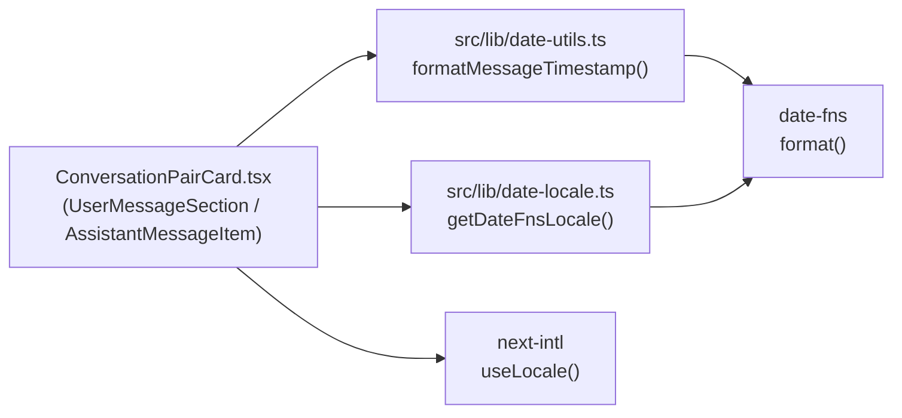

# 設計方針書: Issue #687 MessageHistoryタイムスタンプ日付表示

## 概要

`ConversationPairCard.tsx` のタイムスタンプ表示を `toLocaleTimeString()`（時刻のみ）から date-fns `format(..., 'PPp', { locale })` による日付+時刻表示に変更する。

---

## 1. アーキテクチャ設計

### システム構成



### レイヤー構成

| レイヤー | 対象ファイル | 役割 |
|---------|------------|------|
| プレゼンテーション層 | `src/components/worktree/ConversationPairCard.tsx` | タイムスタンプ表示UI |
| ユーティリティ層 | `src/lib/date-utils.ts` | `formatMessageTimestamp` 関数 |
| ローカライズ層 | `src/lib/date-locale.ts` | next-intl → date-fns ロケール変換（既存） |

---

## 2. 技術選定

| カテゴリ | 選定技術 | 理由 |
|---------|---------|------|
| 日付フォーマット | date-fns `format()` + `'PPp'` | MessageList.tsx / PromptMessage.tsx との統一、ロケール対応 |
| ロケール解決 | next-intl `useLocale()` + `getDateFnsLocale()` | 既存パターン踏襲、安定参照 |
| Invalid Date ガード | 空文字フォールバック | `formatRelativeTime` と同一方針、防御的実装 |

### 採用しない選択肢

| 選択肢 | 不採用理由 |
|--------|-----------|
| `toLocaleDateString()` + `toLocaleTimeString()` | ロケール制御が OS 依存で不統一 |
| MessageList.tsx / PromptMessage.tsx の `format()` を直接共通化 | スコープ拡大・別 Issue |
| カスタムフォーマット文字列（'yyyy/MM/dd HH:mm' 等） | 'PPp' を使う既存実装との不統一 |

---

## 3. 設計パターン

### 薄いラッパー関数パターン（Single Responsibility）

`formatMessageTimestamp` は date-fns `format()` の薄いラッパーとして実装し、以下の責務のみを持つ：

1. `Date` → フォーマット済み文字列への変換
2. Invalid Date ガード（空文字フォールバック）
3. locale オプション渡し

> **`src/lib/date-utils.ts` への追記方針**: 既存 import (`import { formatDistanceToNow } from 'date-fns'` L10, `import type { Locale } from 'date-fns'` L11) はそのまま維持し、`formatDistanceToNow` 行を `import { formatDistanceToNow, format } from 'date-fns'` に変更（または `format` を別行で追加）するだけで十分。`Locale` 型の追加 import は不要（既に L11 に存在）。新規ファイル作成ではなく、既存ファイル末尾に `formatMessageTimestamp` 関数を追記する。

```typescript
// src/lib/date-utils.ts に追加（既存 import を再掲）
import { formatDistanceToNow, format } from 'date-fns';
import type { Locale } from 'date-fns';

/**
 * メッセージ用タイムスタンプを「日付 + 時刻」のロケライズ済み文字列に整形する。
 *
 * - フォーマット: `'PPp'` （date-fns の Long localized date + Long localized time）
 *   - 例（ja）: `2026年1月1日 21:34`
 *   - 例（enUS）: `January 1, 2026 at 9:34 PM`
 * - `MessageList.tsx` / `PromptMessage.tsx` と完全に同一のフォーマット仕様で、
 *   本関数はそのフォーマット文字列 `'PPp'` をアプリ全体で一元管理する目的で新設する。
 *
 * @param timestamp 表示対象の `Date` オブジェクト
 * @param locale 任意。`getDateFnsLocale()` 等で取得した date-fns ロケール。
 *   省略時は date-fns のデフォルトロケール（enUS 相当）でフォーマットされる。
 *   UI コンポーネントから呼び出す場合は `useLocale()` 由来のロケールを必ず渡すこと。
 * @returns フォーマット済み文字列。`Invalid Date` または実行時に `Date` 以外が混入した場合は空文字を返す（防御的フォールバック）。
 */
export function formatMessageTimestamp(timestamp: Date, locale?: Locale): string {
  if (!(timestamp instanceof Date) || isNaN(timestamp.getTime())) {
    return '';
  }
  return format(timestamp, 'PPp', locale ? { locale } : undefined);
}
```

> **'PPp' フォーマットの意味**: date-fns における `'PPp'` は「Long localized date (`PP`) + Long localized time (`p`)」を意味する。
> ロケールごとに自然な日付+時刻表現に変換されるため、ハードコードされた `'yyyy/MM/dd HH:mm'` のような独自書式と比較して
> 多言語対応に優れる。本プロジェクトでは `MessageList.tsx` / `PromptMessage.tsx` で既に採用済みであり、本 Issue でもこれに揃える。

> **locale 引数の取り扱い**: `locale` はオプショナルだが、`formatRelativeTime` との API 統一のために残している。
> `formatMessageTimestamp` の主な利用箇所は React UI コンポーネント (`'use client'` 配下) であり、
> 通常は `useLocale()` 経由のロケールを必ず渡すこと。省略した場合は date-fns デフォルト（enUS 相当）が使われ、
> UI 上では予期しない言語表記になる可能性があるため、ユニットテスト以外で省略は推奨しない。

> **`message.timestamp` の型保証に関する前提**: `formatMessageTimestamp` は引数を `Date` 型に限定する。
> ChatMessage 型は `src/types/models.ts:223` で `timestamp: Date` と定義されており、
> API レスポンス由来のメッセージは `src/components/worktree/WorktreeDetailSubComponents.tsx:93` の `parseMessageTimestamps()` および `src/hooks/useInfiniteMessages.ts:72` の同名関数によって、コンポーネントに渡る前に Date 化されている。
> したがって ConversationPairCard / MessageList / PromptMessage の各呼び出し点では `message.timestamp` は常に `Date` 型である。
> 万一 string 型の timestamp が混入した場合は、通常は TypeScript 型エラーで検知される。
> 実行時に `unknown` / `as any` 経由で `Date` 以外が渡された場合も、`timestamp instanceof Date` ガードで空文字にフォールバックし、レンダリングクラッシュを避ける。
> 将来 ChatMessage を生成する別経路（optimistic update, テストフィクスチャ等）を追加する際は、必ず Date 型を渡すこと。

### 既存パターン踏襲（Consistency）

`ConversationPairCard.tsx` での呼び出しは `MessageList.tsx:66`（L62-65 はロケール取得・`useTranslations`、`format()` 呼び出しは L66 単独） / `PromptMessage.tsx:74`（L69-71 はロケール取得・`useState`、`format()` 呼び出しは L74 単独）と同一パターンで実装：

```typescript
// ConversationPairCard.tsx の UserMessageSection / AssistantMessageItem 内
const locale = useLocale();
const dateFnsLocale = getDateFnsLocale(locale);

const formattedTime = useMemo(
  () => formatMessageTimestamp(message.timestamp, dateFnsLocale),
  [message.timestamp, dateFnsLocale]
);
```

#### `useMemo` の必要性に関する補足

既存の `MessageList.tsx:66` / `PromptMessage.tsx:74`（L62-65 / L69-71 はロケール取得・他フック呼び出しで、`format()` 呼び出しは単独行）は **`useMemo` を使わず、関数ボディで直接 `format()` を呼び出している** 点に留意する。
本設計方針では `ConversationPairCard.tsx` 既存実装が `useMemo` を使っているためこれを踏襲しているが、以下の代替実装も検討可能である：

```typescript
// 代替案: useMemo を外し、MessageList.tsx / PromptMessage.tsx と完全に同一パターンに揃える
const locale = useLocale();
const dateFnsLocale = getDateFnsLocale(locale);
const formattedTime = formatMessageTimestamp(message.timestamp, dateFnsLocale);
```

- `getDateFnsLocale(locale)` は同期 Map ルックアップで実行コストは極小
- `format()` 自体も非常に軽量
- `UserMessageSection` / `AssistantMessageItem` は `React.memo` でラップされているため、親の再レンダリングは props 比較で抑制される
- KISS 原則および `MessageList.tsx` / `PromptMessage.tsx` との完全な一貫性を優先するなら、`useMemo` を外す案も妥当

実装時はチーム判断で「既存 ConversationPairCard 実装の `useMemo` を踏襲」または「MessageList/PromptMessage に揃えて `useMemo` を外す」のいずれかを選択する。

---

## 4. コンポーネント設計

### memo 化サブコンポーネントとの整合性

`UserMessageSection` (L199) と `AssistantMessageItem` (L262) は `React.memo` でラップされている。

- `useLocale()` は next-intl コンテキストを購読するため、locale 変更時にサブコンポーネントが再レンダリングされる（**正しい挙動**）
- `getDateFnsLocale(locale)` は `DATE_FNS_LOCALE_MAP[locale]` の純粋ルックアップのため、**同一 locale 文字列に対して常に同一参照を返す**（memo 比較に影響しない）
- `useMemo` 依存配列を `[message.timestamp, dateFnsLocale]` に更新することで、locale 変更時のみ再計算される

### 親コンポーネント（HistoryPane）への影響

`ConversationPairCard` の Props インターフェース (`ConversationPairCardProps`, L22-35) は本変更で**変更しない**。
親である `HistoryPane.tsx` (L150-289) は ConversationPairCard に props を渡すのみでタイムスタンプ表示ロジックには関与しないため、HistoryPane 側の修正は**不要**。
回帰テスト `tests/unit/components/HistoryPane.test.tsx` も時刻表示のアサーションを使用していないため、テスト追加・修正は不要。

### 'use client' 配下のタイムゾーン挙動

`ConversationPairCard.tsx` は `'use client'` 配下のため CSR のみで描画される。`format()` の出力はクライアントのタイムゾーンに従い、SSR/CSR 間のハイドレーションミスマッチは発生しない。

---

## 5. API設計

新規 API は追加しない。フロントエンドのユーティリティ関数のみ変更。

---

## 6. セキュリティ設計

| 観点 | 方針 | OWASP Top 10 との関係 |
|------|------|----------------------|
| XSS | `formatMessageTimestamp()` の戻り値は React の通常テキストノードとして描画する。`dangerouslySetInnerHTML`、HTML 文字列連結、属性への未エスケープ挿入は行わない。date-fns `format()` は日付値と固定フォーマットから文字列を返すだけで、メッセージ本文などユーザー入力を混入しない。 | A03 Injection の低減 |
| 入力バリデーション | `formatMessageTimestamp(timestamp: Date, locale?: Locale)` は `Date` 型を契約としつつ、実行時ガードとして `timestamp instanceof Date` と `isNaN(timestamp.getTime())` を確認し、異常値は空文字にフォールバックする。API レスポンス由来の timestamp は `parseMessageTimestamps()` で Date 化済みであることを前提にする。 | A04 Insecure Design / A05 Security Misconfiguration の低減 |
| date-fns 安全性 | フォーマット文字列は実装内固定の `'PPp'` とし、ユーザー入力・翻訳文・locale 文字列から組み立てない。これによりフォーマットトークン注入や意図しない巨大出力を避ける。date-fns は既存依存であり、新規パッケージ追加は行わない。 | A06 Vulnerable and Outdated Components の追加リスクなし |
| ロケール注入 | `useLocale()` の値は next-intl / `SUPPORTED_LOCALES` により `en` / `ja` へ制限される。`getDateFnsLocale(locale)` は `DATE_FNS_LOCALE_MAP` の allowlist ルックアップで、未知 locale は `enUS` にフォールバックする。locale 文字列を dynamic import、パス、コマンド、HTML に直接渡さない。 | A03 Injection / A05 Security Misconfiguration の低減 |
| コマンドインジェクション | 本変更はクライアント表示ロジックと date utility のみで、shell 実行、ファイル操作、DB クエリ、外部リクエストを追加しない。timestamp / locale はコマンド文字列に渡されない。 | A03 Injection の該当経路なし |
| 認可・機密性 | 表示対象は既存の `ChatMessage.timestamp` の整形のみで、取得対象データ・API レスポンス・認可境界は変更しない。日付+時刻表示により新規の機密情報は追加されない。 | A01 Broken Access Control / A02 Cryptographic Failures への影響なし |

### セキュリティ境界

- 信頼境界は「API/DB 由来の timestamp を UI 表示用 `Date` に変換する箇所」と「locale 文字列を date-fns Locale オブジェクトへ変換する箇所」の 2 点。
- timestamp は `ChatMessage.timestamp: Date` 型と `parseMessageTimestamps()` により UI 到達前に正規化する。`formatMessageTimestamp()` 側でも異常値フォールバックを持ち、単一箇所の漏れで画面全体がクラッシュしないようにする。
- locale は `SUPPORTED_LOCALES` と `DATE_FNS_LOCALE_MAP` の allowlist で扱い、ユーザーが任意の date-fns locale モジュール名やフォーマット文字列を指定できる設計にはしない。
- date-fns `format()` の結果は React がテキストとしてエスケープするため、XSS 防御は React の標準レンダリングに委ねる。実装時に `innerHTML` 系 API へ変更しないこと。

---

## 7. パフォーマンス設計

- `useMemo` による再計算抑制（既存パターン維持）
- `getDateFnsLocale()` の参照安定性により、locale 未変更時は memo 再計算されない
- `format()` 自体の実行コストは無視できるレベル

### `useLocale()` 追加による再レンダリング影響の定量評価

- locale 変更は `LocaleSwitcher` (`src/components/common/LocaleSwitcher.tsx`) 経由でのみ発生し、UI 操作頻度として極めて稀
- HistoryPane に N 件の ConversationPair が積まれた場合、locale 変更時に N 個の `UserMessageSection` + 最大 N×複数 個の `AssistantMessageItem` が再レンダリングされる
  - 再レンダリング自体は React.memo + 軽量 useMemo (Map ルックアップ + format 呼び出し) で軽量
  - 通常のメッセージ受信フロー（新着メッセージ追加）では locale は変わらず、`message.timestamp` / `dateFnsLocale` が共に安定していれば useMemo がキャッシュ返却するため再計算ゼロ
- 結論: パフォーマンス劣化は無視できるレベル

### バンドル・ビルド影響

- `format` 関数は既に `src/components/worktree/MessageList.tsx:14`, `src/components/worktree/PromptMessage.tsx:12`, `src/lib/log-manager.ts:8` で import 済み
- `src/lib/date-utils.ts` への新規 import 追加によるバンドルサイズ増加はツリーシェイキングにより無視できるレベル（シンボル参照のみ追加）
- 新規パッケージ・新規ロケール追加もないため、ビルド時間・チャンクサイズへの影響なし

---

## 8. テスト設計

### 追加 describe ブロック（既存ファイル `tests/unit/lib/date-utils.test.ts` に追記）

> **注**: `tests/unit/lib/date-utils.test.ts` は既存ファイルで、`formatRelativeTime` のテスト（既存）が含まれる。本 Issue では新規ファイル作成ではなく、既存ファイルに `describe('formatMessageTimestamp', ...)` ブロックを追記する形で実装する。

```typescript
describe('formatMessageTimestamp', () => {
  describe('basic formatting', () => {
    it('should format Date with ja locale using PPp format', () => {
      const date = new Date('2026-01-01T12:34:56Z');
      const result = formatMessageTimestamp(date, ja);
      expect(typeof result).toBe('string');
      expect(result.length).toBeGreaterThan(0);
    });

    it('should format Date with en-US locale using PPp format', () => {
      const date = new Date('2026-01-01T12:34:56Z');
      const result = formatMessageTimestamp(date, enUS);
      expect(typeof result).toBe('string');
      expect(result.length).toBeGreaterThan(0);
    });

    it('should format Date without locale using date-fns default', () => {
      const date = new Date('2026-01-01T12:34:56Z');
      const result = formatMessageTimestamp(date);
      expect(typeof result).toBe('string');
      expect(result.length).toBeGreaterThan(0);
    });
  });

  describe('edge cases', () => {
    it('should return empty string for Invalid Date', () => {
      const result = formatMessageTimestamp(new Date('invalid'));
      expect(result).toBe('');
    });

    it('should return empty string for non-Date runtime value', () => {
      const result = formatMessageTimestamp('2026-01-01T12:34:56Z' as unknown as Date);
      expect(result).toBe('');
    });
  });

  describe('output consistency', () => {
    it('should produce same output as format(date, PPp, { locale }) from MessageList', () => {
      const date = new Date('2026-01-01T12:34:56Z');
      const result = formatMessageTimestamp(date, ja);
      const expected = format(date, 'PPp', { locale: ja });
      expect(result).toBe(expected);
    });
  });
});
```

### 回帰テスト対象（既存）

| ファイル | タイプ | 影響有無 | 備考 |
|---------|-------|---------|------|
| `tests/unit/components/worktree/ConversationPairCard.test.tsx` | Unit | 影響なし | タイムスタンプのアサーションを使用していない（Issue #485 の insert ボタン関連のみ）。回帰実行のみ。 |
| `src/components/worktree/__tests__/ConversationPairCard.test.tsx` | Unit (co-located) | 影響あり | L111-120 `should display timestamp` は `expect(screen.getAllByText(/12:34/).length).toBeGreaterThan(0)` の正規表現アサーションで、変更後も「時刻のみ」表示のままでも通過し得る。本 Issue の表示仕様変更（日付+時刻）を保証するため、`getByText(/January 1, 2024.*12:34/)` など、日付部分を含む明示的なアサーションへ更新する。あわせて複数 assistant message のカウンタ表示と長い英語日付が同一行に出るため、既存のレンダリングテストで表示要素が欠落しないことを回帰確認する。 |
| `tests/integration/conversation-pair-card.test.tsx` | Integration | 影響なし | CSS制約（`whitespace-pre-wrap`, `break-words`, `[word-break:break-word]` 等）の確認に特化しており、タイムスタンプ表示のアサーションを使用していない。回帰実行のみ。 |
| `tests/unit/components/HistoryPane.test.tsx` | Unit | 影響なし | 親コンポーネントのテスト。タイムスタンプ表示のアサーションを使用していない。回帰実行のみ。 |

### `tests/setup.ts` グローバルモックとの相互作用

`tests/setup.ts` L5-21 で `vi.mock('next-intl', () => ({ useLocale: () => 'en', ... }))` が**全テスト共通**で適用されている。これにより：

- ConversationPairCard コンポーネントのテストは常に enUS ロケールで実行される
- `formatMessageTimestamp` 関数単体のテスト（§8 サンプル）は date-fns Locale を直接引数で渡すため、グローバルモックの影響を受けない（`ja` / `enUS` を明示的に指定可能）
- ConversationPairCard コンポーネントの ja ロケール表示テストを追加したい場合は、当該テストファイル冒頭で `vi.mock('next-intl', () => ({ useLocale: () => 'ja', ... }))` を上書きする必要がある
- **本 Issue のスコープ**: `formatMessageTimestamp` 関数単体のロケールテスト（ja/enUS）を追加し、ConversationPairCard コンポーネント側では `tests/setup.ts` の enUS モック前提で日付+時刻表示を確認する。ConversationPairCard の ja ロケール別表示テストはスコープ外とし、ja 出力は関数単体テストで担保する。

### 表示仕様変更のテスト責務

`ConversationPairCard` のタイムスタンプは本 Issue で「時刻のみ」から「日付+時刻」へ見える仕様が変わる。
そのため `formatMessageTimestamp` の単体テストだけでなく、少なくとも co-located component test の `should display timestamp` では日付部分を含む表示を検証する。
`tests/setup.ts` の `useLocale()` モックは `en` 固定のため、component test では enUS 出力を前提にし、ja 表示の詳細は `formatMessageTimestamp` 単体テストで担保する。

---

## 9. 設計上の決定事項とトレードオフ

| 決定事項 | 採用理由 | トレードオフ |
|---------|---------|------------|
| `formatMessageTimestamp` を `date-utils.ts` に追加 | `formatRelativeTime` と同一モジュールで SRP を満たす。date-fns 変換の集約 | 相対時刻・絶対時刻の 2 責務が同居するが、両者とも「表示用日付フォーマット」として凝集度は高い |
| `ConversationPairCard` のサブコンポーネント内で `useLocale()` を呼ぶ | `MessageList.tsx` / `PromptMessage.tsx` との同一パターン。コードの一貫性 | 親コンポーネントから props 受け渡しする案と比較すると hook 呼び出しが分散するが、memo 安定性は担保される |
| `'PPp'` フォーマット採用 | `MessageList.tsx` / `PromptMessage.tsx` と完全統一。ロケール対応済み | date-fns バージョンによって秒の有無が変わる可能性があるが、既存実装と同一のため一貫性を優先 |
| `AssistantMessageList.tsx:22` を今回のスコープ外 | Issue は MessageHistory (HistoryPane の ConversationPairCard) のみ対象 | Home 画面のアシスタントチャットで同じ「日付不明」問題が残るが、別 Issue で追跡可能 |

---

## 10. スコープ外（および技術的負債のトラッキング）

| 対象 | 理由 |
|------|------|
| `MessageList.tsx:66` / `PromptMessage.tsx:74`（`format()` 呼び出し行単独。L62-65 / L69-71 はロケール取得等） | 既に `format(..., 'PPp', { locale })` を直接呼び出している。本 Issue では ConversationPairCard 修正に限定するため変更しない（後述の **フォローアップ Issue** で `formatMessageTimestamp` への移行を予定） |
| `MessageList.tsx:603` | `new Date().toLocaleTimeString()` によるリアルタイム現在時刻表示。目的が異なる |
| `AssistantMessageList.tsx:22` | ホーム画面アシスタントチャット。別 Issue で対応 |

### DRY 観点の技術的負債（フォローアップ Issue で対応）

本 Issue では `formatMessageTimestamp` を新設するが、Issue スコープを ConversationPairCard に限定する都合上、
`MessageList.tsx:66` / `PromptMessage.tsx:74`（`format()` 呼び出しが単独で行われている行。L62-65 / L69-71 は `useLocale()` / `getDateFnsLocale()` / `useTranslations()` 等の周辺コードで、置換対象外）には依然として `format(new Date(message.timestamp), 'PPp', { locale })` の直接呼び出しが残る。
これは「`'PPp'` フォーマット仕様が 3 箇所に分散する」DRY 違反であり、フォーマット変更時に複数箇所の修正が必要となる技術的負債として認識する。

**設計判断**: 本 Issue は MessageHistory（HistoryPane の `ConversationPairCard`）の不具合修正に集中し、横断的な置き換えは別 Issue に分離する。

**フォローアップ作業（別 Issue）**:

| ファイル | 変更内容 |
|---------|---------|
| `src/components/worktree/MessageList.tsx:66`（`format()` 呼び出し行単独。L62-65 はロケール取得・`useTranslations` のため置換対象外） | `format(new Date(message.timestamp), 'PPp', { locale })` → `formatMessageTimestamp(new Date(message.timestamp), dateFnsLocale)` に置換 |
| `src/components/worktree/PromptMessage.tsx:74`（`format()` 呼び出し行単独。L69-71 はロケール取得・`useState` のため置換対象外） | 同上 |

#### `new Date(message.timestamp)` 再ラップに関する注意

上記置換例ではフォローアップ実装者の判断材料として、現状コードに合わせて `new Date(message.timestamp)` を残した形を例示している。
ただし `ChatMessage.timestamp` は `src/types/models.ts` で **既に `Date` 型に定義** されており、
API レスポンスは `WorktreeDetailSubComponents.tsx` の `parseMessageTimestamps` / `useInfiniteMessages.ts` 経由で
クライアントに渡る前に `Date` 化されているため、`new Date(...)` の再ラップは **冗長だが安全側で害はない**。

- **そのまま残す場合**（既存コードからの差分最小化を優先）:
  ```typescript
  formatMessageTimestamp(new Date(message.timestamp), dateFnsLocale)
  ```
  既に `Date` 型のオブジェクトに対する `new Date(date)` は valid Date のコピーを返すため挙動は変わらない。

- **除去する場合**（型定義に従いシンプルに書く）:
  ```typescript
  formatMessageTimestamp(message.timestamp, dateFnsLocale)
  ```
  本 Issue の `ConversationPairCard` 側使用例（本書 L113）と統一されるため、**フォローアップ Issue ではこちらを推奨** する。

これにより、`'PPp'` フォーマット文字列を `src/lib/date-utils.ts` に完全集約し、`formatMessageTimestamp` 新設の本来の意義（フォーマット仕様の一元管理）を達成する。
**本設計方針書のマージ後にフォローアップ Issue を作成し、技術的負債として可視化・追跡すること。**

---

## 変更対象ファイルサマリー

| ファイル | 変更種別 | 変更内容 |
|---------|---------|---------|
| `src/lib/date-utils.ts` | 追加 | `formatMessageTimestamp(timestamp: Date, locale?: Locale): string` 関数。既存 import (`formatDistanceToNow`, `Locale` 型) は維持し、`format` のみを既存 import 行に追加。 |
| `src/components/worktree/ConversationPairCard.tsx` | 修正 | `useLocale` / `getDateFnsLocale` import 追加、`toLocaleTimeString()` → `formatMessageTimestamp()` 置換、`useMemo` 依存配列更新 |
| `tests/unit/lib/date-utils.test.ts` | 修正（既存ファイルへ describe ブロック追加） | 既存の `formatRelativeTime` テストと共存させ、`formatMessageTimestamp` 用 `describe` ブロックを追記 |
| `src/components/worktree/__tests__/ConversationPairCard.test.tsx` | 修正 | `should display timestamp` を時刻部分のみの正規表現から、日付+時刻を確認するアサーションへ更新 |
