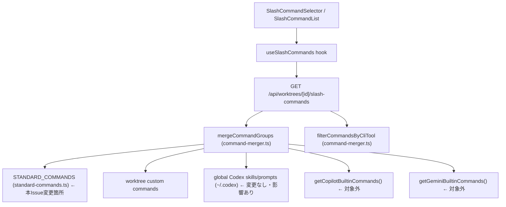

# Issue #689 設計方針書: STANDARD_COMMANDS 最新化

## 概要

Claude Code / Codex の最新スラッシュコマンドを `src/lib/standard-commands.ts` に追加し、ユーザーが CommandMate のコマンド選択 UI から直接選択できるようにする。

## 1. アーキテクチャ設計

### システム構成図



### 変更対象レイヤー

本Issue の変更は **データ定義層のみ** に閉じる。

| レイヤー | ファイル | 変更有無 |
|---------|---------|---------|
| データ定義 | `src/lib/standard-commands.ts` | **変更あり** |
| テスト | `tests/unit/lib/standard-commands.test.ts` | **変更あり** |
| テスト（統合） | `tests/integration/api-worktree-slash-commands.test.ts` | **変更あり** |
| API / ロジック | `src/app/api/worktrees/[id]/slash-commands/route.ts` | 変更なし |
| コマンドマージ | `src/lib/command-merger.ts` | 変更なし |
| Codex skill/prompt ローダー | `src/lib/slash-commands.ts` (`loadCodexSkills` / `loadCodexPrompts`) | 変更なし（ただし同名衝突・テスト隔離の影響あり） |
| UI コンポーネント | `src/components/worktree/SlashCommandList.tsx` 等 | 変更なし |
| 型定義 | `src/types/slash-commands.ts` | 変更なし（新カテゴリ追加なし） |

## 2. 技術選定

既存技術スタックに準拠。新規技術導入なし。

| カテゴリ | 選定 | 理由 |
|---------|------|------|
| 言語 | TypeScript | 既存 |
| フレームワーク | Next.js 14 | 既存 |
| テスト | Vitest | 既存 |
| データ形式 | 静的配列定数 | 既存アーキテクチャを維持 |

## 3. 設計パターン

### 静的定数パターン（既存踏襲）

`STANDARD_COMMANDS` は `SlashCommand[]` 型の静的配列定数として定義されている。本Issue でもこのパターンを維持する。

```typescript
// 既存パターン（変更なし）
export const STANDARD_COMMANDS: SlashCommand[] = [
  {
    name: 'effort',
    description: 'モデルの思考コストを調整 (high/medium/low)',
    category: 'standard-config',
    isStandard: true,
    source: 'standard',
    filePath: '',
    // cliTools: undefined  ← Claude-only 後方互換パターン
  },
  // ...
];
```

### `cliTools` 設計方針（Issue #594 opt-in 原則）

> **Stage 1 レビュー反映（DR1-001）**: 新規追加 4 件（effort/fast/focus/lazy）は当初 `cliTools: undefined` を採用予定だったが、Issue #594 で確立した opt-in 原則（明示的に対象 CLI を列挙する）との整合のため、**`cliTools: ['claude']` を明示**する方針に変更した。`undefined` は既存 8 件のみの後方互換用とし、新規定義では使用しない。

| パターン | `cliTools` 値 | 適用対象 |
|---------|--------------|---------|
| Claude-only（既存・後方互換） | `undefined`（未設定） | 既存8件 |
| Claude-only（新規・明示） | `['claude']` | 新規4件（effort/fast/focus/lazy） ← **DR1-001 対応** |
| Claude+Codex 共有 | `['claude', 'codex']` | 既存7件 |
| Codex-only | `['codex']` | 既存9件 + 新規8件（plan/goal/agent等） |
| Codex+OpenCode 共有 | `['codex', 'opencode']` | 既存1件（new） |
| OpenCode-only | `['opencode']` | 既存7件 |

#### 設計判断の根拠（DR1-001）

- **Issue #594 opt-in 原則**: 共有コマンドは `cliTools` で対象 CLI を明示する。新規定義では暗黙の `undefined` ルール（=Claude-only）に依存しないことが望ましい。
- **SOLID/OCP・DIP**: `undefined` という暗黙の意味付けを増やすことは、`src/types/slash-commands.ts` の JSDoc にある『undefined does NOT mean "all tools" — it means claude-only』という暗黙ルールへの依存を強める。新規定義で明示することで実装ガイドラインに沿う。
- **後方互換性**: 既存 8 件の `undefined` は変更しないため、`filterCommandsByCliTool()`（`src/lib/command-merger.ts` L184-201）の挙動は不変（`undefined` または `cliTools.includes('claude')` のいずれでも Claude として扱われる）。
- **OpenCode/Claude との共有可能性検討**（DR1-004 対応）:

| コマンド名 | OpenCode 検討 | Claude 検討 | 共有しない理由 |
|-----------|--------------|------------|---------------|
| `plan` | 未実装 | 未実装 | Codex 固有モード |
| `goal` | 未実装 | 未実装 | Codex 固有モード |
| `agent` | `/agents` が既存（複数形・OpenCode-only） | 未実装 | DR1-002 で命名差別化（単数 vs 複数）、CLI 別に隔離 |
| `subagents` | 未実装 | 未実装 | Codex 固有概念 |
| `fork` | 未実装 | 未実装 | Codex セッション固有 |
| `memories` | 未実装 | 未実装 | Codex メモリ管理 |
| `skills` | 別実装あり（`.codex/skills` ローダーで解決済み） | 別実装あり（`.claude/skills` ローダーで解決済み） | `src/lib/slash-commands.ts` 側で別経路から提供されるため、STANDARD_COMMANDS では Codex-only |
| `hooks` | 未実装 | 未実装 | Codex 固有のフック設定 |

### `/agent`（Codex新規）と `/agents`（OpenCode既存）の命名差別化方針（DR1-002 対応）

新規 Codex 追加 `agent`（単数）と既存 OpenCode 定義 `agents`（複数）は、CLI 仕様上の別物として並立する。

| コマンド名 | `cliTools` | description（差別化） | 役割 |
|-----------|-----------|---------------------|------|
| `agent` | `['codex']` | Switch active agent (Codex) | アクティブエージェント切替（単数操作） |
| `agents` | `['opencode']` | List/manage all available agents (OpenCode) | エージェント一覧・管理（複数操作） |

#### UI 上の混乱が発生しない理由

- `filterCommandsByCliTool()` は CLI ツール別に表示コマンドを隔離するため、Codex セッションでは `agent` のみ、OpenCode セッションでは `agents` のみが表示される。
- 同一 CLI で両者が同時に表示されることはなく、検索フィルタでも CLI 別フィルタ後のセットに対して動作するため、両方ヒットする状況は発生しない。
- description は意図的に異なる文言（`Switch active agent` vs `List/manage all available agents`）とし、コマンドリストの意味が明確になるようにする。

#### 追加テスト方針（§7 と整合）

- `filterCommandsByCliTool('codex')` で `agent` のみ返ること、`agents` を返さないことを検証。
- `filterCommandsByCliTool('opencode')` で `agents` のみ返ること、`agent` を返さないことを検証。
- `filterCommandsByCliTool('claude')` でどちらも返らないことを回帰検証。
- description の差別化（両者の文言が異なること）を文字列比較で検証。

## 4. データモデル設計

### 追加コマンド定義（確定）

#### Claude Code 追加（4件） ※ DR1-001 反映で `cliTools: ['claude']` 明示

| コマンド名 | category | `cliTools` | description |
|-----------|---------|-----------|-------------|
| `effort` | `standard-config` | `['claude']` | モデルの思考コストを調整 (high/medium/low) |
| `fast` | `standard-config` | `['claude']` | 応答速度優先モードへ切替 |
| `focus` | `standard-session` | `['claude']` | フォーカスモード切替 |
| `lazy` | `standard-config` | `['claude']` | lazy モード切替 |

> **DR1-001 反映**: 当初設計では `cliTools: undefined`（既存 Claude-only 8 件と同一パターン）を採用予定だったが、Issue #594 opt-in 原則との整合のため `['claude']` 明示に変更。既存 8 件の `undefined` は後方互換のため据え置く。`filterCommandsByCliTool()` の挙動は変わらず、Claude セッションでのみ表示される。

#### Codex 追加（8件）

| コマンド名 | category | `cliTools` | description | 共有しない理由（DR1-004） |
|-----------|---------|-----------|-------------|---------------------------|
| `plan` | `standard-session` | `['codex']` | 計画モード切替 | Codex 固有モード（OpenCode/Claude 未実装） |
| `goal` | `standard-session` | `['codex']` | ゴール設定モード | Codex 固有モード（OpenCode/Claude 未実装） |
| `agent` | `standard-session` | `['codex']` | エージェント切替（単数） | OpenCode `/agents`（複数）と別物として並立、CLI 別隔離（DR1-002） |
| `subagents` | `standard-session` | `['codex']` | サブエージェント管理 | Codex 固有概念（OpenCode/Claude 未実装） |
| `fork` | `standard-session` | `['codex']` | セッションフォーク | Codex セッション固有（OpenCode/Claude 未実装） |
| `memories` | `standard-config` | `['codex']` | メモリ管理 | Codex メモリ管理（OpenCode/Claude 未実装） |
| `skills` | `standard-config` | `['codex']` | スキル管理 | OpenCode/Claude は別経路（`.codex/skills` `.claude/skills` ローダー）で提供済み |
| `hooks` | `standard-config` | `['codex']` | フック管理 | Codex 固有のフック設定（OpenCode/Claude 未実装） |

### 件数構成サマリー

> **DR1-001 反映**: Claude-only の定義方式を「`undefined` 一括」から「`undefined`（既存・後方互換）」と「`['claude']` 明示（新規）」に分離。表示総数（フィルタ後の見え方）は変わらないが、定義方式の内訳を明記する。

| 区分 | 変更前 | 変更後 |
|------|-------|-------|
| STANDARD_COMMANDS 総件数 | 33 | **45** |
| Claude-only (`undefined`、後方互換) | 8 | 8 |
| Claude-only (`['claude']`、明示) | 0 | **4** ← 新規追加（DR1-001） |
| Claude-only 合計 | 8 | **12** |
| shared（内訳: claude+codex=6, claude+codex+opencode=1, claude+opencode=1, codex+opencode=1） | 9 | 9 |
| Codex-only (`['codex']`) | 9 | **17** |
| OpenCode-only (`['opencode']`) | 7 | 7 |
| Codex 表示総数（codex+opencode 1 + claude+codex 6 + claude+codex+opencode 1 + Codex-only） | 17 | **25** |
| Claude 表示総数（undefined 8 + ['claude'] 4 + claude+codex 6 + claude+codex+opencode 1 + claude+opencode 1） | **16** | **20** |
| OpenCode 表示総数（claude+codex+opencode 1 + claude+opencode 1 + codex+opencode 1 + OpenCode-only 7） | 10 | 10 |

> **DR2-001 反映**: Claude 表示総数の値を 17→21 から **16→20** に訂正。実コード `src/lib/standard-commands.ts` を機械的に数えると、変更前の Claude 可視は 8（undefined）+ 8（cliTools に 'claude' を含む既存: clear/compact/resume/model/permissions/status/review/help）= **16 件**。変更後は新規 4 件追加で **20 件**。
>
> **DR2-005 反映**: shared の内訳と各 CLI 表示総数の算出ロジックを表内に明示。実装作業者が件数を機械的に検算可能。

### FREQUENTLY_USED 更新

```typescript
// 変更前
codex: ['new', 'undo', 'diff', 'approvals', 'mcp']

// 変更後
codex: ['new', 'undo', 'diff', 'approvals', 'plan']
```

Claude・OpenCode は現行維持。

#### `mcp` → `plan` 置換の選定根拠（DR1-005 対応）

- **`mcp` 除外理由**: Codex CLI 標準フローから外れる管理系コマンドであり、ユーザーの日常的な作業フローでは頻繁に呼び出されない。STANDARD_COMMANDS には引き続き存在するため、必要時はコマンド一覧から検索可能。
- **`plan` 採用理由**: Codex の対話起点として最も使用される計画モード切替コマンドであり、ユーザー作業フローの中心的コマンドである。FREQUENTLY_USED（UI 上で即アクセス可能な 5 件枠）への昇格が UX 改善に直結する。
- **5 件構成の維持**: 既存の枠数を変えないことでテスト・UI レイアウトへの影響を最小化（KISS 原則）。
- **新規 8 件中 `plan` のみ昇格させる根拠**: `goal` `agent` `subagents` `fork` `memories` `skills` `hooks` はいずれも特定タスク向けの管理系または専門機能であり、対話起点としての汎用性は `plan` に劣る。

### `/undo` の扱い

本Issue では削除しない（Hypothesis 6が Unverifiable のため現状維持）。別Issue で再検討。

## 5. API設計

変更なし。既存 `GET /api/worktrees/[id]/slash-commands?cliTool=<CLIToolType>` がそのまま利用される。

### 対象 CLI と後方互換性（DR3-003）

`cliTool` は `src/lib/cli-tools/types.ts` の `CLI_TOOL_IDS` に従い、以下 6 種を受け付ける。

- `claude`
- `codex`
- `gemini`
- `vibe-local`
- `opencode`
- `copilot`

本 Issue では API ルート実装・クエリパラメータ仕様・レスポンス型を変更しない。`vibe-local` は現状 STANDARD_COMMANDS の表示対象が 0 件であり、`filterCommandsByCliTool(groups, 'vibe-local')` は空集合を返す仕様としてマトリクステストで固定する。

### API レスポンス後方互換性（S7-002）

`sources` オブジェクトの形状は変更しない。`sources.standard` の件数は増加するが、型定義は変更なし。

```typescript
// 変更なし（後方互換）
interface SlashCommandsResponse {
  groups: SlashCommandGroup[];
  sources: {
    standard: number;   // 件数のみ増加
    worktree: number;
    mcbd: number;
    skill: number;
    codexSkill: number;
  };
  cliTool: CLIToolType;
}
```

`sources.standard` の増加は、worktree/global Codex skill/prompt による同名上書きがない状態での期待値とする。`mergeCommandGroups()` は標準コマンドを先に登録し、その後 worktree command / global Codex skill / global Codex prompt / Copilot builtin / Gemini builtin を後勝ちで登録するため、同名コマンドが存在する場合は `sources.standard` が期待件数より少なくなる可能性がある。この挙動は既存の SF-1（worktree 優先）および global Codex 優先ルールであり、本 Issue では変更しない。

### Global Codex skill/prompt との同名衝突（DR3-001）

`src/app/api/worktrees/[id]/slash-commands/route.ts` は `loadCodexSkills()` / `loadCodexPrompts()` を basePath 未指定で呼び出すため、`~/.codex/skills` と `~/.codex/prompts` の global 定義も merge 対象になる。これらは `cliTools: ['codex']` かつ `source: 'codex-skill'` として追加され、`mergeCommandGroups()` の後勝ちルールにより STANDARD_COMMANDS の同名コマンドを上書きできる。

本 Issue で追加する `plan`, `skills`, `hooks`, `memories` 等は、ユーザー定義 Codex skill/prompt と衝突しやすい名前である。衝突時に標準コマンドではなくユーザー定義が表示されるのは既存仕様として維持する。ただし、受入条件・統合テストで「標準 `/plan` が表示される」ことを確認する場合は、global Codex skill/prompt の影響を排除した deterministic な環境で検証する必要がある。

テスト方針:

- 通常の Codex 統合テストでは `loadCodexSkills()` / `loadCodexPrompts()` を mock して空配列を返すか、`HOME` / `os.homedir()` 相当を一時ディレクトリへ隔離し、global 定義の影響を受けない状態で STANDARD_COMMANDS の表示件数・存在を検証する。
- 別テストとして、global Codex prompt `plan.md` または skill `skills/SKILL.md` が存在する場合に `source: 'codex-skill'` のユーザー定義が `source: 'standard'` の標準コマンドを上書きすることを検証してもよい。この場合、標準コマンドが見えないことは仕様どおりであり失敗扱いにしない。

## 6. セキュリティ設計

本 Issue では認証・認可・ファイル読込・コマンド実行ロジックは変更しない。変更対象は `STANDARD_COMMANDS` / `FREQUENTLY_USED` の静的定数とテストに限定する。ただし同じ表示経路には worktree custom command / global Codex skill / global Codex prompt が混在するため、「静的定数だからリスクなし」と断定せず、標準コマンド追加分の安全条件を明文化する。

### セキュリティ境界

| 区分 | 対象 | 扱い |
|------|------|------|
| 信頼境界内 | `STANDARD_COMMANDS`, `FREQUENTLY_USED`, テスト fixtures | リポジトリ内レビュー済みの静的定数として扱う |
| 信頼境界外 | worktree custom commands, `.claude/commands`, `.claude/skills`, `~/.codex/skills`, `~/.codex/prompts` | ユーザー定義入力として扱い、既存 loader / merge / UI 表示経路の安全性に依存する |

本 Issue で追加する標準コマンドは信頼境界内の静的定数だが、API レスポンスや UI コンポーネントでは信頼境界外のコマンドと同一の `SlashCommand` 型で扱われる。したがって、標準コマンド定義の安全性を保つだけでなく、既存表示経路が HTML として解釈しないことを回帰テストで固定する。

### コマンド名インジェクション対策

新規追加する標準コマンド名は、以下の制約を満たすものだけを許可する。

- `name` は `/^[a-z][a-z0-9-]*$/` に一致する小文字 ASCII の識別子とする。
- `/`, `:`, 空白, `.`, `..`, パス区切り文字, `<`, `>`, 引用符, バッククォート, 制御文字を含めない。
- `filePath` は既存標準コマンドと同じく空文字 `''` とし、ユーザー入力由来のパスを持たせない。
- `source` は必ず `'standard'` とし、worktree/global/builtin 由来のコマンドと混同しない。
- 新規標準コマンドでは `invocation` を設定しない。`getSlashCommandTrigger()` の `/prompts:` 分岐は Codex prompt 用であり、標準コマンド追加では使用しない。

`SlashCommandList` では `getSlashCommandTrigger(command)` が返す文字列を React の text child として描画する。標準コマンドの選択はコマンド文字列の挿入であり、本 Issue では shell 実行・ファイル実行・API ルーティングの解釈ルールを変更しない。

### XSS / description サニタイズ

`description` はプレーンテキストとして扱う。新規標準コマンドでは HTML / Markdown / URL / JavaScript スキームを意味する文字列を入れず、既存定義と同じ英語 ASCII の短文に統一する方針とする。

安全条件:

- `SlashCommandList` は `command.description` と trigger を React の text child として描画し、`dangerouslySetInnerHTML` / `innerHTML` を使用しない。
- `description` には `<`, `>`, 制御文字, `javascript:`, `onerror=`, `onclick=` など HTML/イベント属性として誤読される文字列を含めない。
- 将来 UI が rich text 化される場合も、`description` を HTML として解釈しないことを前提条件とする。HTML 表示が必要になった場合は本 Issue とは別にサニタイズ方針を設計する。

### 入力バリデーション

API の `cliTool` は既存の `CLI_TOOL_IDS` / `validateCliTool()` に従い、6 ツール（`claude`, `codex`, `gemini`, `vibe-local`, `opencode`, `copilot`）以外を受け付けない。本 Issue では API バリデーション仕様を変更しない。

静的定数に対する追加テストでは、少なくとも以下を検証する。

- `STANDARD_COMMANDS` 全件の `name` が許可 regex に一致すること。
- `description` が空でなく、HTML タグ・制御文字・危険な URI/イベント属性パターンを含まないこと。
- 標準コマンド全件の `source === 'standard'`、`filePath === ''` が維持されること。
- 本 Issue で追加する 12 件の `cliTools` が `['claude']` または `['codex']` の明示値であり、`undefined` を新規に増やさないこと。
- 悪意ある `name` / `description` を持つテスト用コマンドを `SlashCommandList` に渡しても、HTML として解釈されず text としてエスケープ表示されること。

### OWASP Top 10 観点

| OWASP 観点 | 本 Issue での扱い |
|------------|------------------|
| A01 Broken Access Control | 認可・セッション・権限判定は変更しない。影響なし。 |
| A02 Cryptographic Failures | 暗号化・秘密情報・トークン処理は変更しない。影響なし。 |
| A03 Injection | コマンド名は静的 allowlist かつ ASCII regex でテスト固定する。UI は text child 描画であり HTML/SQL/shell として解釈しない。 |
| A04 Insecure Design | 信頼境界、同名上書き、表示経路の前提を本章と Stage 3 影響範囲で明文化する。 |
| A05 Security Misconfiguration | API レスポンス形状・`sources` 形状・`cliTool` バリデーションは変更しない。 |
| A06 Vulnerable and Outdated Components | 新規依存関係は導入しない。 |
| A07 Identification and Authentication Failures | 認証・ユーザー識別は変更しない。 |
| A08 Software and Data Integrity Failures | 標準コマンドはリポジトリ内静的定数としてレビュー・テスト対象にする。外部から標準定義を動的取得しない。 |
| A09 Security Logging and Monitoring Failures | ログ出力・監査イベントは変更しない。 |
| A10 Server-Side Request Forgery | ネットワーク取得・外部 URL 読込は追加しない。 |

### セキュリティテスト方針

- `tests/unit/lib/standard-commands.test.ts` に静的定数の allowlist 検証を追加する。
- `SlashCommandList` の component test または既存の近い UI テストに、悪意ある `name` / `description` を text として表示する XSS 回帰ケースを追加する。
- Stage 3 の global Codex skill/prompt 衝突テストでは、ユーザー定義コマンドは信頼境界外であることを前提にし、標準コマンドの安全性テストと混同しない。
- 本 Issue ではサーバー側 sanitizer や runtime 変換処理を新設しない。静的定数の allowlist と React text rendering の回帰テストで安全性を固定する。

## 7. テスト設計

### ユニットテスト更新箇所（`tests/unit/lib/standard-commands.test.ts`）

| 行 | テスト内容 | 変更前 → 変更後 |
|---|----------|--------------|
| L20 | テスト名（`it()` 第1引数） ← **DR1-003 対応** | `'should have 33 standard commands (8 Claude-only + 9 shared + 9 Codex-only + 7 OpenCode-only)'` → `'should have 45 standard commands (12 Claude-only + 9 shared + 17 Codex-only + 7 OpenCode-only)'` |
| L21 | 総件数 | `toBe(33)` → `toBe(45)` |
| L35-51 | Claude-only コマンドリスト（`undefined` 検証）テスト名: `'should have Claude commands without cliTools field (backward compatible)'` ← **DR1-001 / DR2-003 対応** | 既存 8 件のまま据え置き（テスト名も据え置き）。新規 4 件は別テストブロックで `['claude']` 明示を検証 |
| L79-100 | Codex-only コマンドリスト（L96-99 で `/new` の特別扱いあり） | 9件 → 17件（plan/goal/agent等追加） |
| L119-124 | OpenCode 件数 | `toBe(10)` → 変更なし `toBe(10)` |
| L126-131 | Codex 件数 | `toBe(17)` → `toBe(25)` |
| L213 | FREQUENTLY_USED.codex の `new`, `undo` テスト | `mcp` → `plan` に変更（テスト本体内のアサーション側） |

> **DR2-002 反映**: 行番号を実コード `tests/unit/lib/standard-commands.test.ts` の現状（commit時点）と整合させた（L36-50 → L35-51、L80-94 → L79-100、L194 → L213）。実装作業者が誤った行を修正するリスクを排除。

### 追加テスト項目

1. `effort`, `fast`, `lazy` が `standard-config` に、`focus` が `standard-session` に存在すること（DR1-003 反映：category 配置を具体化）
2. 新規 Claude 4 件（`effort`, `fast`, `focus`, `lazy`）が `cliTools: ['claude']` を明示していること（DR1-001 反映：`undefined` ではなく `['claude']` を検証）。**テスト名は `'should have new Claude-only commands (effort/fast/focus/lazy) with explicit cliTools: ["claude"]'` のような独立した it ブロックを追加する**（DR2-003 反映：既存 L35 テスト『should have Claude commands without cliTools field』とは別ブロックで SSoT を明確化）
3. `plan`, `goal`, `agent`, `subagents`, `fork`, `memories`, `skills`, `hooks` が `['codex']` で存在すること
4. `FREQUENTLY_USED.codex` に `plan` が含まれること
5. `FREQUENTLY_USED.codex` に `mcp` が含まれないこと（回帰テスト: S3-004）
6. Claude 表示総数が **20** 件であること（既存 16 件 + 新規 4 件）（DR2-001 反映：17→21 ではなく 16→20 が正）
7. `agent`（Codex）と `agents`（OpenCode）の description 文言が異なること（DR1-002 反映：混同防止）

> **DR2-003 反映 - 既存テスト L35 の名称更新要否について**:
>
> 既存テスト L35 のテスト名 `'should have Claude commands without cliTools field (backward compatible)'` は **据え置き**（リネーム不要）とする。理由は以下:
>
> - このテストの検証対象は『**`undefined` のままの後方互換 8 件**』であり、新規 4 件追加後もこのリストは変更されない（rewind/config/context/cost/pr-comments/doctor/export/todos の 8 件）。テスト名は依然として正確である。
> - 新規 4 件（effort/fast/focus/lazy）は別の独立 it ブロック（追加テスト項目 2）で `cliTools: ['claude']` 明示を検証する。
> - これにより、**既存 8 件の `undefined` パターン**と**新規 4 件の `['claude']` 明示パターン**が、それぞれ独立したテストで SSoT として明示される（既存テスト名の意味を変えずに方針転換できる）。
> - もし既存テスト名を「Claude-only すべて」を含意するように変更すると、新規 4 件で例外が生じテスト本体との不整合が発生する。よって据え置きが正しい設計判断である。

### 統合テスト（`tests/integration/api-worktree-slash-commands.test.ts`）

Codex テスト（L99-128）に `plan`, `goal`, `agent`, `subagents`, `fork`, `memories`, `skills`, `hooks` の 8 件検証を追加する。

実装時の注意:

- `allNames.toContain(...)` だけでなく、該当コマンドの `source === 'standard'` と `cliTools === ['codex']` を検証する。
- global Codex skill/prompt の影響を受けないように、`loadCodexSkills()` / `loadCodexPrompts()` を空配列に mock する、または HOME 相当を一時ディレクトリに隔離する（DR3-001）。
- `sources.standard` の期待値を検証する場合は、同名上書きがない deterministic な環境でのみ行う。global Codex 定義を混ぜるテストでは `sources.standard` が減少しうるため、件数固定アサートを避ける。

### Copilot 同名衝突テスト（S7-003 対応）

`cliTool=copilot` ケースを **API route integration test として**追加し、Codex-only コマンド（`goal`/`subagents`/`fork`/`memories`/`hooks` 等）が Copilot に漏れないこと、および Copilot builtin と同名の `plan`/`agent`/`skills` が Copilot builtin として表示されることを検証する（DR3-002）。

```typescript
// 追加テストイメージ
it('should keep Copilot builtins isolated from Codex standard commands', async () => {
  // GET /api/worktrees/[id]/slash-commands?cliTool=copilot を呼び出す
  const data = await requestWorktreeSlashCommands('copilot');
  const commands = data.groups.flatMap(g => g.commands);

  for (const name of ['plan', 'agent', 'skills']) {
    const cmd = commands.find(c => c.name === name);
    expect(cmd).toBeDefined();
    expect(cmd?.source).toBe('builtin');
    expect(cmd?.cliTools).toEqual(['copilot']);
  }

  for (const codexOnlyName of ['goal', 'subagents', 'fork', 'memories', 'hooks']) {
    expect(commands.map(c => c.name)).not.toContain(codexOnlyName);
  }

  // API 後方互換: top-level sources.builtin は追加しない（S7-002）
  expect(data.sources).not.toHaveProperty('builtin');
});
```

`filterCommandsByCliTool(groupByCategory(STANDARD_COMMANDS), 'copilot')` のユニットテストは「STANDARD_COMMANDS に Copilot 表示対象がない」ことの確認には有効だが、Copilot builtin の route-level 注入・後勝ち上書きは検証できない。したがって、同名衝突の本体は必ず `tests/integration/api-worktree-slash-commands.test.ts` で API route を通して検証する。

Gemini についても同様に、`clear` / `compact` / `model` / `quit` / `help` が Gemini builtin として route-level で注入されるため、既存 Gemini 統合テストでは `source: 'builtin'`, `cliTools: ['gemini']` を必要に応じて確認する。

### CLI ツール隔離マトリクステスト（DR1-006 対応）

新規 8 件のみの Copilot 隔離テストでは既存 Codex-only 9 件（undo/logout/quit/approvals/diff/mention/mcp/init/feedback）の隔離が暗黙にしか担保されないため、テーブル駆動方式で全 STANDARD_COMMANDS の CLI 可視性を SSoT 化する。

```typescript
// 期待される CLI 可視性マトリクス（SSoT）
const EXPECTED_CLI_VISIBILITY: Record<string, CLIToolType[]> = {
  // Claude-only（既存・undefined 後方互換）— filterCommandsByCliTool は undefined を 'claude' として扱う
  rewind: ['claude'], config: ['claude'], context: ['claude'],
  // ... 既存 8 件すべて

  // Claude-only（新規・['claude'] 明示） ← DR1-001 反映
  effort: ['claude'], fast: ['claude'], focus: ['claude'], lazy: ['claude'],

  // Codex-only（新規 + 既存）
  plan: ['codex'], goal: ['codex'], agent: ['codex'], subagents: ['codex'],
  fork: ['codex'], memories: ['codex'], skills: ['codex'], hooks: ['codex'],
  undo: ['codex'], mcp: ['codex'], approvals: ['codex'], /* ... */

  // shared
  clear: ['claude', 'codex'], compact: ['claude', 'codex', 'opencode'], /* ... */

  // OpenCode-only
  agents: ['opencode'], /* ... */
};

it.each(Object.entries(EXPECTED_CLI_VISIBILITY))(
  '%s should be visible only for expected CLI tools',
  (name, expected) => {
    const cmd = STANDARD_COMMANDS.find(c => c.name === name);
    expect(cmd).toBeDefined();
    // undefined（後方互換）の場合は ['claude'] として扱う
    const actual = cmd!.cliTools ?? ['claude'];
    expect([...actual].sort()).toEqual([...expected].sort());
  }
);

// 各 CLI ツールの表示集合を検証（Copilot/Gemini/vibe-local を含む全6ツール、DR2-004 反映）
it.each(['claude', 'codex', 'opencode', 'copilot', 'gemini', 'vibe-local'] as const)(
  'filterCommandsByCliTool(%s) should return only commands visible for that tool',
  (cliTool) => {
    const filtered = filterCommandsByCliTool(groups, cliTool);
    const filteredNames = filtered.flatMap(g => g.commands).map(c => c.name);
    const expected = Object.entries(EXPECTED_CLI_VISIBILITY)
      .filter(([, tools]) => tools.includes(cliTool as CLIToolType))
      .map(([name]) => name);
    expect(new Set(filteredNames)).toEqual(new Set(expected));
  }
);
```

このマトリクスが SSoT となり、将来のコマンド追加・`cliTools` 変更時に必ず 1 行追加すれば検証できるようになる（DRY 原則の改善）。Copilot/Gemini/vibe-local も同じテーブルで網羅され、ユニット層でカバレッジが確保される（**DR2-004 反映**: `CLIToolType` は 6 ツール（claude/codex/gemini/vibe-local/opencode/copilot）であり、当初 5 ツールのみだった検証対象を vibe-local を追加して 6 ツールに拡張）。

> **DR2-004 反映 - vibe-local の扱い**:
>
> vibe-local は STANDARD_COMMANDS に該当エントリが 0 件（`cliTools` に 'vibe-local' を含むコマンドは皆無）。`filterCommandsByCliTool(groups, 'vibe-local')` は全件除外され空集合を返す。これは『vibe-local CLI は組み込みコマンド非対応のため、STANDARD_COMMANDS では意図的に未提供』という現状仕様を表す。マトリクステストの空集合検証によりこの仕様が SSoT 化され、将来 vibe-local がスラッシュコマンドをサポートしたときの追加判断ログが残る。

> **DR2-006 反映 - undefined フォールバックの根拠と 2 つの it.each の役割分担**:
>
> - **マトリクス検証 1（1 つ目の `it.each`）**: 各コマンドの `cliTools` 値（または `undefined` のフォールバック値）が期待 CLI 集合と一致することを検証。具体的には `cmd!.cliTools ?? ['claude']` のフォールバックを使う（`filterCommandsByCliTool` (`src/lib/command-merger.ts` L184-201) と同じロジック: `undefined` を Claude として扱う）。
> - **マトリクス検証 2（2 つ目の `it.each`）**: `filterCommandsByCliTool()` が各 CLI に対して期待集合のみを返すことを E2E 的に検証。
> - **EXPECTED_CLI_VISIBILITY 上の表記方針**: 既存 8 件（undefined）も新規 4 件（明示 ['claude']）もマトリクス上はどちらも `['claude']` と記述する。これは `filterCommandsByCliTool` の挙動（undefined を 'claude' として扱う）を SSoT に閉じ込めるための意図的な設計判断であり、**個別の定義方式（undefined vs ['claude']）の差異は別の it ブロック（追加テスト項目 2）で検証する**。
> - **filterCommandsByCliTool の実コード根拠**: `src/lib/command-merger.ts` L184-201 で `cliToolId === 'claude' ? !cmd.cliTools || cmd.cliTools.includes('claude') : cmd.cliTools?.includes(cliToolId)` という分岐により、Claude セッションでは undefined と `['claude']` 明示の双方がヒットする。よって本 Issue で新規 4 件を `['claude']` 明示にしても既存 Claude セッションでの可視性は不変。

#### `agent`/`agents` 命名差別化の追加検証（DR1-002 対応）

```typescript
// CLI 別隔離の検証
it('agent (Codex) and agents (OpenCode) should be isolated by CLI tool', () => {
  const codexCommands = filterCommandsByCliTool(groups, 'codex')
    .flatMap(g => g.commands).map(c => c.name);
  const opencodeCommands = filterCommandsByCliTool(groups, 'opencode')
    .flatMap(g => g.commands).map(c => c.name);
  const claudeCommands = filterCommandsByCliTool(groups, 'claude')
    .flatMap(g => g.commands).map(c => c.name);

  expect(codexCommands).toContain('agent');
  expect(codexCommands).not.toContain('agents');
  expect(opencodeCommands).toContain('agents');
  expect(opencodeCommands).not.toContain('agent');
  expect(claudeCommands).not.toContain('agent');
  expect(claudeCommands).not.toContain('agents');
});

// description 差別化の検証
it('agent and agents should have distinct descriptions', () => {
  const agent = STANDARD_COMMANDS.find(c => c.name === 'agent');
  const agents = STANDARD_COMMANDS.find(c => c.name === 'agents');
  expect(agent?.description).not.toBe(agents?.description);
});
```

## 8. 設計上の決定事項とトレードオフ

| 決定事項 | 採用理由 | トレードオフ |
|---------|---------|------------|
| 静的配列定数を維持（動的読込なし） | 既存アーキテクチャとの一貫性、実装コスト最小 | CLI更新のたびに手動更新が必要 |
| Claude追加4件を `cliTools: ['claude']` 明示（DR1-001 反映） | Issue #594 opt-in 原則の継承徹底、SOLID/OCP・DIP 強化、暗黙ルール（`undefined`=Claude）への新規依存を排除 | 既存 8 件（`undefined`）と新規 4 件（`['claude']`）の定義方式が混在（テストで両パターンを検証） |
| Codex追加8件を `cliTools: ['codex']` のみ | Issue #594のopt-in原則遵守、DR1-004 共有可能性検討表で各コマンドの判断ログを保全 | Claude側で同名コマンドが存在してもコマンド共有しない |
| `/agent`（Codex）と `/agents`（OpenCode）の並立（DR1-002 反映） | CLI 仕様上の別物として差別化（単数 vs 複数）、`filterCommandsByCliTool` による CLI 別隔離で UI 混乱を防止 | 類似命名のため命名規約上の注意が必要（テストで隔離検証） |
| 新カテゴリ作成しない | 型・定数・テストへの影響を最小化 | 将来的にカテゴリ整理が必要になる可能性 |
| 5件構成を維持（FREQUENTLY_USED） | テスト変更を最小化、UI レイアウト維持 | `mcp` を除外するためユーザー好みに依存（DR1-005 で根拠を明文化） |
| `/undo` 維持 | Unverifiable状態での誤削除回避 | Codex側で廃止済みの場合、不要なコマンドが表示され続ける |

## 9. 実装手順

1. `src/lib/standard-commands.ts` の `STANDARD_COMMANDS` 配列に 4+8=12 件を追加
   - Claude 4 件（effort/fast/focus/lazy）は `cliTools: ['claude']` 明示（DR1-001 反映）
   - Codex 8 件（plan/goal/agent/subagents/fork/memories/skills/hooks）は `cliTools: ['codex']`
   - `agent` の description は `'Switch active agent'` 等、既存 `agents` と差別化（DR1-002 反映）
2. `FREQUENTLY_USED.codex` を更新（`mcp` → `plan`、DR1-005 で根拠明文化）
3. `tests/unit/lib/standard-commands.test.ts` のアサート値とテスト名を更新
   - L20 `it()` 第 1 引数の更新（DR1-003 反映）
   - L21 総件数 33 → 45
   - 新規 4 件は `cliTools: ['claude']` を明示検証（DR1-001 反映）
4. 新規追加コマンドのテストを追加
   - 各コマンドの存在・category・cliTools 検証
   - `agent`/`agents` 命名差別化検証（DR1-002 反映）
5. CLI ツール隔離マトリクステストを追加（DR1-006 反映、SSoT 化）
6. `tests/integration/api-worktree-slash-commands.test.ts` に統合テストを追加
7. Codex 統合テストでは global Codex skill/prompt の影響を mock または一時 HOME で隔離（DR3-001）
8. Copilot/Gemini builtin の同名衝突は API route integration test で `source` / `cliTools` / `sources` 形状まで検証（DR3-002）
9. Copilot/Gemini/vibe-local 隔離テストをマトリクス方式で網羅（DR1-006 + DR2-004 反映、全 6 ツール）
10. テストの件数アサーションを Claude 表示総数 = **20** で検証（DR2-001 反映、17/21 ではない）
11. テスト更新時は実コード行番号 L35-51 / L79-100 / L213 を参照（DR2-002 反映）
12. 既存テスト L35 名は据え置き、新規 4 件 `['claude']` 明示は独立 it ブロックで検証（DR2-003 反映）
13. `STANDARD_COMMANDS` の `name` / `description` / `source` / `filePath` / `invocation` に対するセキュリティ allowlist テストを追加（DR4-002 / DR4-003）
14. `SlashCommandList` に悪意ある `name` / `description` を渡しても HTML として解釈されない XSS 回帰テストを追加（DR4-003）
15. `npm run lint && npx tsc --noEmit && npm run test:unit && npm run test:integration` で確認

## 10. レビュー履歴

| Stage | 日付 | レビュアー | 結果 | 反映ファイル |
|-------|------|-----------|------|-------------|
| Stage 1（設計原則） | 2026-05-01 | architecture-review-agent | Must Fix 2 / Should Fix 4 / Nice to Have 2 | `dev-reports/issue/689/multi-stage-design-review/stage1-review-result.json` |
| Stage 2（整合性） | 2026-05-01 | architecture-review-agent | Must Fix 3 / Should Fix 3 / Nice to Have 2 | `dev-reports/issue/689/multi-stage-design-review/stage2-review-result.json` |
| Stage 3（影響範囲） | 2026-05-01 | codex | Must Fix 1 / Should Fix 3 / Nice to Have 0 | `dev-reports/issue/689/multi-stage-design-review/stage3-review-result.json` |
| Stage 4（セキュリティ） | 2026-05-01 | codex | Must Fix 1 / Should Fix 3 / Nice to Have 0 | `dev-reports/issue/689/multi-stage-design-review/stage4-review-result.json` |

## 11. レビュー指摘事項サマリー

### Stage 1 反映状況

| ID | Severity | タイトル | 反映状況 | 反映セクション |
|----|----------|---------|---------|---------------|
| DR1-001 | Must Fix | Claude追加4件の `cliTools: undefined` 採用は Issue #594 opt-in 原則と矛盾 | ✅ 反映済み | §3 cliTools 設計方針 / §4 件数構成 / §4 Claude Code 追加表 / §7 テスト / §8 トレードオフ / §9 実装手順 |
| DR1-002 | Must Fix | `/agent` と `/agents` の命名衝突・差別化方針が未記述 | ✅ 反映済み | §3 命名差別化方針 / §4 Codex 追加表 / §7 テスト / §8 トレードオフ / §9 実装手順 |
| DR1-003 | Should Fix | テスト L20 の `it()` 説明文更新が漏れている | ✅ 反映済み | §7 テスト更新表 / §7 追加テスト項目 |
| DR1-004 | Should Fix | OpenCode/Claude 共有可能性の判断ログが不足 | ✅ 反映済み | §3 共有可能性検討表 / §4 Codex 追加表（共有しない理由列追加） |
| DR1-005 | Should Fix | FREQUENTLY_USED.codex の `mcp`→`plan` 置換根拠が未記述 | ✅ 反映済み | §4 FREQUENTLY_USED 更新（選定根拠を追記） |
| DR1-006 | Should Fix | Copilot/Gemini 隔離テストの SSoT 化（テーブル駆動）が不足 | ✅ 反映済み | §7 CLI ツール隔離マトリクステスト |
| DR1-007 | Nice to Have | 標準コマンド最新性の再発防止策の追記 | ⏭ 今回スキップ（Nice to Have） | - |
| DR1-008 | Nice to Have | description の英語統一（命名規約） | ⏭ 今回スキップ（Nice to Have） | - |

### Stage 2 反映状況

| ID | Severity | タイトル | 反映状況 | 反映セクション |
|----|----------|---------|---------|---------------|
| DR2-001 | Must Fix | §4 件数構成サマリーの『Claude 表示総数 17→21』が実コード（16→20）と不整合 | ✅ 反映済み | §4 件数構成サマリー / §7 追加テスト項目 6 |
| DR2-002 | Must Fix | §7 のテスト更新表の行番号（L36-50/L80-94/L194）が現コード（L35-51/L79-100/L213）と乖離 | ✅ 反映済み | §7 テスト更新表 |
| DR2-003 | Must Fix | DR1-001 反映で既存テスト L35『should have Claude commands without cliTools field』の名称更新要否が不明瞭 | ✅ 反映済み | §7 追加テスト項目 2 / §7 既存テスト名称据え置きの根拠注記 |
| DR2-004 | Should Fix | §7 CLI ツール隔離マトリクスの対象 CLI ツール集合に `vibe-local` が欠落（5 ツール → 全 6 ツールに拡張） | ✅ 反映済み | §7 マトリクステスト（it.each 第2引数）/ vibe-local の扱い注記 |
| DR2-005 | Should Fix | §4 件数構成サマリーの shared 内訳が暗黙のまま（各 CLI 表示総数の算出ロジック不明） | ✅ 反映済み | §4 件数構成サマリー（shared 内訳と CLI 表示総数の算出ロジック注記を追加） |
| DR2-006 | Should Fix | §7 EXPECTED_CLI_VISIBILITY マトリクスの 2 つの it.each の役割分担と undefined フォールバック根拠が曖昧 | ✅ 反映済み | §7 マトリクステスト末尾の DR2-006 反映注記（filterCommandsByCliTool L184-201 挙動を明記） |
| DR2-007 | Nice to Have | §3 cliTools 設計方針表の数値が個別検算可能な形になっていない | ⏭ 今回スキップ（Nice to Have） | - |
| DR2-008 | Nice to Have | filterCommandsByCliTool() と getFrequentlyUsedCommands() の DRY 違反が設計方針書から見えない | ⏭ 今回スキップ（Nice to Have） | - |

### Stage 3 反映状況

| ID | Severity | タイトル | 反映状況 | 反映セクション |
|----|----------|---------|---------|---------------|
| DR3-001 | Must Fix | global Codex skill/prompt の同名上書きと統合テストの環境依存が未整理 | ✅ 反映済み | §1 システム構成図 / §1 変更対象レイヤー / §5 Global Codex skill/prompt との同名衝突 / §7 統合テスト |
| DR3-002 | Should Fix | Copilot/Gemini builtin の route-level 注入は unit matrix だけでは検証できない | ✅ 反映済み | §7 Copilot 同名衝突テスト / §9 実装手順 |
| DR3-003 | Should Fix | API の `cliTool` 対象が 6 ツールであることが §5 に明記されていない | ✅ 反映済み | §5 対象 CLI と後方互換性 |
| DR3-004 | Should Fix | `sources.standard` 件数は同名上書きの有無で変動するため固定条件が必要 | ✅ 反映済み | §5 API レスポンス後方互換性 / §7 統合テスト |

### Stage 4 反映状況

| ID | Severity | タイトル | 反映状況 | 反映セクション |
|----|----------|---------|---------|---------------|
| DR4-001 | Must Fix | セキュリティ章が「静的定数なのでリスクなし」と断定しており、信頼境界と表示経路の前提が不足 | ✅ 反映済み | §6 セキュリティ境界 / OWASP Top 10 観点 |
| DR4-002 | Should Fix | コマンド名インジェクションを防ぐ `name` / `filePath` / `source` / `invocation` の allowlist 条件が未定義 | ✅ 反映済み | §6 コマンド名インジェクション対策 / 入力バリデーション / §12 Stage 4 セキュリティ対応 |
| DR4-003 | Should Fix | `description` の XSS 前提と UI 回帰テストが未定義 | ✅ 反映済み | §6 XSS / description サニタイズ / セキュリティテスト方針 / §12 Stage 4 セキュリティ対応 |
| DR4-004 | Should Fix | OWASP Top 10 の各観点に対する影響有無が明文化されていない | ✅ 反映済み | §6 OWASP Top 10 観点 |

## 12. 実装チェックリスト

### Must Fix 対応

- [ ] DR1-001: 新規 Claude 4 件（effort/fast/focus/lazy）の `cliTools` を `['claude']` で明示
- [ ] DR1-001: 既存 Claude 8 件の `undefined` は据え置き（後方互換）
- [ ] DR1-001: テストで `['claude']` 明示パターンを検証する別ブロックを追加
- [ ] DR1-002: `agent`（Codex）の description を `'Switch active agent'` 等に設定
- [ ] DR1-002: `agents`（OpenCode）の description と差別化されていることを確認
- [ ] DR1-002: `filterCommandsByCliTool` による CLI 別隔離テストを追加（codex/opencode/claude）

### Should Fix 対応（Stage 1）

- [ ] DR1-003: `it()` 第 1 引数（テスト名）を新件数構成に合わせて更新
- [ ] DR1-003: 新規 4 件の category 配置（effort/fast/lazy=standard-config、focus=standard-session）を具体的に検証
- [ ] DR1-004: §3/§4 の共有可能性検討表に従い、各 Codex 8 件が `['codex']` のみであることを検証
- [ ] DR1-005: `FREQUENTLY_USED.codex` に `plan` が含まれ、`mcp` が含まれないことを回帰テスト
- [ ] DR1-006: `EXPECTED_CLI_VISIBILITY` マトリクスを定義し、`it.each` でテーブル駆動テスト
- [ ] DR1-006: Copilot/Gemini/vibe-local を含む **6 つの CLI ツール**で `filterCommandsByCliTool` の網羅検証（DR2-004 反映で 5→6 に拡張）

### Stage 2 Must Fix 対応

- [ ] DR2-001: 件数アサーションテストで Claude 表示総数を **20 件**として検証（17/21 ではない）
- [ ] DR2-001: マトリクステストの『claude を含む行数』が 20 になることをクロスチェック
- [ ] DR2-002: テスト更新時に実コード行番号（L35-51 / L79-100 / L213）を参照し誤った行を修正しないこと
- [ ] DR2-003: 既存 L35 テスト名 `'should have Claude commands without cliTools field (backward compatible)'` は据え置き（リネーム不要）
- [ ] DR2-003: 新規 4 件の `['claude']` 明示検証は独立した it ブロック（テスト名: `'should have new Claude-only commands (effort/fast/focus/lazy) with explicit cliTools: ["claude"]'`）として追加

### Stage 2 Should Fix 対応

- [ ] DR2-004: マトリクステストの 2 つ目の `it.each` 第2引数を `['claude', 'codex', 'opencode', 'copilot', 'gemini', 'vibe-local']` の 6 ツールに設定
- [ ] DR2-004: vibe-local に対する `filterCommandsByCliTool` が空集合を返すことを暗黙に検証（マトリクスで vibe-local を含む行が 0 件のため）
- [ ] DR2-005: 実装時、件数表（§4）の内訳を参照して機械的に検算可能なテストを書く（shared の内訳・各 CLI 表示総数の算出ロジック注記に従う）
- [ ] DR2-006: マトリクステストのコメントに 2 つの it.each の役割分担と undefined フォールバック根拠を明記

### Stage 3 影響範囲対応

- [ ] DR3-001: Codex 統合テストでは `loadCodexSkills()` / `loadCodexPrompts()` を mock して空配列にする、または HOME 相当を一時ディレクトリへ隔離する
- [ ] DR3-001: global Codex skill/prompt が標準コマンドと同名の場合、`source: 'codex-skill'` が `source: 'standard'` を上書きする既存仕様を必要に応じて別テストで確認
- [ ] DR3-002: cliTool=copilot の API route integration test を追加し、`plan` / `agent` / `skills` が `source: 'builtin'`, `cliTools: ['copilot']` で表示されることを検証
- [ ] DR3-002: `goal` / `subagents` / `fork` / `memories` / `hooks` など Copilot に存在しない Codex-only コマンドが cliTool=copilot に漏れないことを検証
- [ ] DR3-003: API 仕様・テストでは `claude` / `codex` / `gemini` / `vibe-local` / `opencode` / `copilot` の全 6 ツールを対象として扱う
- [ ] DR3-004: `sources.standard` の件数固定アサートは同名上書きがない deterministic なテストケースに限定し、`sources.builtin` は追加しないことを検証

### Stage 4 セキュリティ対応

- [ ] DR4-001: 設計・実装レビュー時に、標準コマンドは信頼境界内、worktree/global Codex 定義は信頼境界外として扱う前提を確認
- [ ] DR4-002: `STANDARD_COMMANDS` 全件の `name` が `/^[a-z][a-z0-9-]*$/` に一致し、危険文字（`/`, `:`, 空白, `<`, `>`, 引用符, バッククォート, 制御文字等）を含まないことをテスト
- [ ] DR4-002: 標準コマンド全件の `source === 'standard'`, `filePath === ''`, 新規標準コマンドでは `invocation` 未設定をテスト
- [ ] DR4-003: `description` がプレーンテキストであり、HTML タグ・制御文字・`javascript:`・イベント属性風文字列を含まないことをテスト
- [ ] DR4-003: `SlashCommandList` で悪意ある `name` / `description` が HTML として解釈されず text として表示されることを回帰テスト
- [ ] DR4-004: OWASP Top 10 観点で、本 Issue が認証・暗号・依存関係・SSRF・ログ処理を変更しないことを PR レビューで確認

### 静的検査・テスト

- [ ] `npm run lint`
- [ ] `npx tsc --noEmit`
- [ ] `npm run test:unit`
- [ ] `npm run test:integration`

## 関連情報

- **Issue**: #689
- **主要変更ファイル**: `src/lib/standard-commands.ts`, `tests/unit/lib/standard-commands.test.ts`
- **参照Issue**: #4（Codex cliTools導入）, #56（標準コマンド初期実装）, #594（共有コマンドopt-in化）, #379（OpenCode対応）
- **設計方針書作成日**: 2026-05-01
