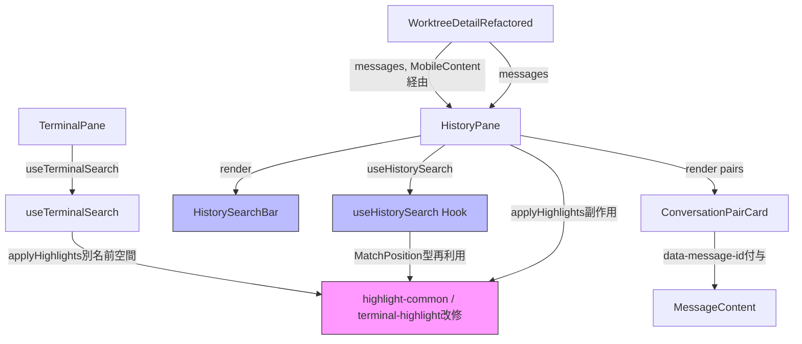

# Issue #716 設計方針書: HistoryPane メッセージテキスト検索機能

## 1. 概要

### 目的
Worktree詳細画面の履歴(History)ペインに、メッセージテキスト検索機能を追加する。CSS Custom Highlight API によるハイライト、件数表示、前/次ナビゲーションを提供し、過去会話の検索コストを下げる。

### 背景
Issue #701 で履歴表示件数が 50〜250 件に拡張されたことで、目視で過去会話を探すコストが上昇した。本機能でその課題を解消する。

### スコープ
- ✅ HistoryPane 内のメッセージテキストに対する部分一致検索
- ✅ CSS Custom Highlight API + fallback overlay によるハイライト
- ✅ TerminalSearch との名前空間分離（同画面共存）
- ❌ 正規表現検索（別Issue）
- ❌ Ctrl/Cmd+F グローバルショートカット（別Issue）
- ❌ archived / limit 超過の検索（別Issue）

## 2. アーキテクチャ設計

### 2.1 コンポーネント関係図



### 2.2 レイヤー責務

| レイヤー | コンポーネント | 責務 |
|---------|--------------|------|
| プレゼンテーション | `HistoryPane`, `HistorySearchBar`, `ConversationPairCard` | UI レンダリング、ユーザー入力受付、トグル制御 |
| Hook（状態管理） | `useHistorySearch` | 検索 state、debounce、matchPositions 計算、IME composition 処理、navigation |
| ハイライト基盤 | `terminal-highlight` 改修 / `highlight-common` | CSS Custom Highlight API ラップ、fallback overlay、名前空間分離 |
| データソース | `ChatMessage[]` (props) | DB から取得済み messages を入力として受領 |

### 2.3 データフロー

```
[ユーザー入力]
   ↓
HistorySearchBar (input.onChange + {...compositionHandlers})  [DR1-003]
   ↓ setQuery(q)
useHistorySearch (debounce 300ms, IME-aware via internal ref)
   ↓ runSearch(debouncedQuery)
   ├→ findMatches(messages, query) → HistoryMatch[] (messageId 単位)
   ├→ resolveCurrentMatch(matches, globalIndex) → { messageId, localIndex } | null  [DR1-002]
   ↓ setState({matchPositions, currentIndex: 0})
   ↓ useLayoutEffect in HistoryPane
   ├→ container.querySelectorAll('[data-message-id]')  [DR1-007: MessageContent の親 div に付与]
   ├→ メッセージごとに applyHistoryHighlights(el, match.ranges, localIdx)  [DR1-001]
   ├→ currentMatch.messageId の要素へ scrollIntoView({block:'center', behavior:'smooth'})
   ↓ ConversationPairCard (memo 維持、autoExpanded props 追加なし)  [DR1-005]
   ↓ HistoryPane 内部で expandStateSnapshotRef を使った展開制御
```

## 3. 技術選定

| カテゴリ | 選定技術 | 選定理由 |
|---------|---------|---------|
| 検索アルゴリズム | `String.prototype.toLowerCase()` + `indexOf` | RegExp 不使用で ReDoS 回避（SEC-TS-001 踏襲） |
| ハイライト機構 | CSS Custom Highlight API | DOM 変更不要で XSS 安全、textContent ベースで Markdown 非依存（SEC-TS-002 踏襲） |
| Fallback | absolute-positioned overlay | CSS Custom Highlight API 未対応ブラウザ向け、`pointer-events: none` で既存ボタン操作維持 |
| 状態管理 | React `useState` + `useRef` (HistoryPane 内部) | localStorage 永続化不要、worktree/タブ切替で自動クリーンアップ |
| Debounce | `setTimeout` + ref | `useTerminalSearch` 踏襲、**300ms**（`useTerminalSearch.ts` で `DEBOUNCE_MS` を export 化して共有、DR2-004） |
| 最小クエリ長 | indexOf 前のガード | **2 文字**（`useTerminalSearch.ts` で `MIN_QUERY_LENGTH` を export 化して共有、DR2-004） |
| IME 対応 | `compositionstart` / `compositionend` イベント | 日本語等の変換中に部分マッチで件数が乱高下するUXを回避 |
| テスト | Vitest + Testing Library | プロジェクト既存構成 |

## 4. 設計パターン

### 4.1 Strategy パターン（名前空間注入）

> **[Stage1 DR1-001 反映 / Must Fix]**: 当初案では `applyTerminalHighlights` / `clearTerminalHighlights` を `applyHighlights` / `clearHighlights` にリネームし namespace 引数を追加する設計であったが、これは OCP（変更に閉じる）違反であり、§11.1 の「O: 既存呼び出しを変更せず拡張」と矛盾していた。本版では **既存関数名 `applyTerminalHighlights` / `clearTerminalHighlights` を完全に維持**し、新たに **`applyHistoryHighlights` / `clearHistoryHighlights` を追加 export**する方針に変更する（既存呼び出し側=`useTerminalSearch` は一切変更不要）。

`terminal-highlight.ts` を改修し、内部実装を共通化（DRY 維持）しつつ、TerminalPane 向けと History 向けで別の export 関数を提供することで HistoryPane / TerminalPane の名前空間衝突を回避する。

```typescript
// src/lib/terminal-highlight.ts（改修）
// [Stage2 DR2-005 反映]: fallback overlay の背景色を namespace ごとに分離するため
// fallbackOverlayBgColor を HighlightNamespace に追加する。
// showFallbackOverlay は namespace.fallbackOverlayBgColor を参照する形に改修する。
export interface HighlightNamespace {
  highlightName: string;          // 'terminal-search' | 'history-search'
  currentHighlightName: string;   // 'terminal-search-current' | 'history-search-current'
  fallbackOverlayId: string;      // 'terminal-search-fallback-overlay' | 'history-search-fallback-overlay'
  /** [DR2-005] Fallback overlay の background-color。namespace ごとに視覚的に区別する。 */
  fallbackOverlayBgColor: string;
}

const TERMINAL_SEARCH_NAMESPACE: HighlightNamespace = {
  highlightName: 'terminal-search',
  currentHighlightName: 'terminal-search-current',
  fallbackOverlayId: 'terminal-search-fallback-overlay',
  fallbackOverlayBgColor: 'rgba(255, 165, 0, 0.6)', // 既存色（オレンジ系、後方互換）
};

// [Stage1 DR1-010 反映 / Nice to Have]: 共通モジュール化前段として export する。
// 将来 file-search 等が増えた際に search-highlight.ts へ集約しやすい配置。
// [Stage2 DR2-005 反映]: 同画面同時検索時の視覚的区別のため、背景色は青系を採用。
export const HISTORY_SEARCH_NAMESPACE: HighlightNamespace = {
  highlightName: 'history-search',
  currentHighlightName: 'history-search-current',
  fallbackOverlayId: 'history-search-fallback-overlay',
  fallbackOverlayBgColor: 'rgba(96, 165, 250, 0.5)', // 青系（terminal=オレンジ系と区別）
};

// --- 内部共通実装（private） ---
function applyHighlightsInternal(
  container: Element,
  matchPositions: MatchPosition[],
  currentIndex: number,
  namespace: HighlightNamespace,
): void { /* ... 既存ロジックを namespace 引数化して共通化 ... */ }

function clearHighlightsInternal(namespace: HighlightNamespace): void { /* ... */ }

// --- 既存 public API（シグネチャ・関数名 変更なし、後方互換 100%） ---
export function applyTerminalHighlights(
  container: Element,
  matchPositions: MatchPosition[],
  currentIndex: number,
): void {
  applyHighlightsInternal(container, matchPositions, currentIndex, TERMINAL_SEARCH_NAMESPACE);
}

export function clearTerminalHighlights(): void {
  clearHighlightsInternal(TERMINAL_SEARCH_NAMESPACE);
}

// --- Issue #716 新規 public API ---
export function applyHistoryHighlights(
  container: Element,
  matchPositions: MatchPosition[],
  currentIndex: number,
): void {
  applyHighlightsInternal(container, matchPositions, currentIndex, HISTORY_SEARCH_NAMESPACE);
}

export function clearHistoryHighlights(): void {
  clearHighlightsInternal(HISTORY_SEARCH_NAMESPACE);
}
```

**メリット**:
- 既存 `useTerminalSearch` / `TerminalSearchBar` の呼び出し側を**一切変更しない**（OCP 完全準拠）
- DRY 原則: 内部実装は単一の `applyHighlightsInternal` / `clearHighlightsInternal` に集約
- 関数名にコンテキスト（terminal / history）が残るため `terminal-highlight.ts` というモジュール名との整合性も維持しつつ、将来別 namespace 追加時は対応する `applyXxxHighlights` を追加するだけで済む

**トレードオフ**:
- 関数が4つに増える（public API のサーフェスが拡大）
- 将来的に file-search など第3の namespace が増えると `terminal-highlight.ts` の責務が肥大化する可能性があるため、その時点で `src/lib/search-highlight.ts` へのリネームを検討（DR1-010 の(A)案、現時点では YAGNI）

> **[Stage2 DR2-011 反映 / Nice to Have]**: 第3の namespace（file-search / log-search 等）が追加される場合の `search-highlight.ts` マイグレーション戦略（§10 DR1-010 関連行と相互参照）:
> - **(i) terminal-highlight.ts のまま `applyFileSearchHighlights` 等を追加 export**: 責務肥大化、3 つで限界。**現在の方式の自然な延長**。
> - **(ii) `src/lib/search-highlight.ts` にリネーム + `applyXxxHighlights` を集約**: 破壊的だが OCP 準拠の限界点で実施。`useTerminalSearch` 側の import パスを一括更新する必要がある。
> - **(iii) namespace ごとに `src/lib/{terminal,history,file}-search-highlight.ts` に分割し、共通実装を `src/lib/highlight-common.ts` に切り出す**: 最も整然としているが、変更コスト最大。
>
> **Issue #716 では (ii)/(iii) は YAGNI として見送り、(i) の暫定形態で 2 namespace まで運用する**。第3 namespace 登場時に上記 3 案から再評価する。本決定は §10 「`HISTORY_SEARCH_NAMESPACE` 配置」エントリの「将来 file-search 等が増えた段階で `src/lib/search-highlight.ts` へのリネームを検討」と整合する。

**採用判定**: ✅ ラッパー関数追加方式（DR1-001 推奨(A)案）を採用。既存 `applyTerminalHighlights` / `clearTerminalHighlights` のシグネチャは変更しない。`showFallbackOverlay`（terminal-highlight.ts 内）は `namespace.fallbackOverlayBgColor` を参照する形に改修する（既存呼び出し側は `TERMINAL_SEARCH_NAMESPACE.fallbackOverlayBgColor = 'rgba(255, 165, 0, 0.6)'` で既存色維持されるため後方互換）。

### 4.2 副作用パターン（ハイライト適用）

ハイライトは props 伝播ではなく `useLayoutEffect` 副作用として適用し、`ConversationPairCard` の memo 化を維持する。

> **[Stage1 DR1-002 反映 / Must Fix]**: 当初案では `matchPositions.forEach((match, idx) => { ... currentMatchIsInThisMessage(idx, currentIndex) ? localIndex : -1 ... })` という記述があり、グローバル `currentIndex` から「該当メッセージ内の何番目のマッチか」へ変換する補助関数が未定義であった。本版では `useHistorySearch` Hook が **`currentMatch: { messageId: string; localIndex: number } | null`** を return することで、HistoryPane 側は線形→局所変換を意識せずに済む設計に変更する（責務分離の明確化）。

> **[Stage1 DR1-007 反映 / Should Fix]**: `data-message-id` の付与位置を以下の不変条件付きで確定する:
> - **付与位置**: `ConversationPairCard` 内の **MessageContent の親要素（pre-wrap な `<div>`）** に付与する（UserMessageSection / AssistantMessageItem ごとに 1 個）。
> - **textContent オフセット不変条件**: `findMatches` で計算するオフセットは `message.content`（生テキスト、`toLowerCase().indexOf` ベース）に対するものであり、`container.querySelector('[data-message-id="..."]').textContent` のオフセットと**一致**する必要がある。ファイルパスを表示する `<button>` 要素が内部に混入していても、`Element.textContent` は子要素のテキストノードを連結するため、`message.content` と `messageEl.textContent` のオフセットは等価になる（path button もテキスト復元可能）。
> - 万一 MessageContent が `pre`/`code`/`a` 等で構造化された Markdown 出力に変更された場合は、本不変条件が破れるため §10 に「Markdown 対応: しない」の決定事項で固定化する。

> **[Stage1 DR1-012 反映 / Nice to Have]**: `useLayoutEffect` を採用する理由は「CSS Custom Highlight API による Range 生成と DOM レイアウト確定の間にブラウザ paint が挟まると、未ハイライト状態の一瞬のフラッシュ（FOUC 類似）が見える可能性がある」ため、同期実行でハイライト適用とスクロール処理を 1 フレーム内に閉じる。useTerminalSearch との差分は、TerminalPane が単一スクロール要素なのに対し History は複数メッセージ要素を跨ぐためフラッシュが視認されやすいことに起因する。また HistoryPane 既存の **scroll position 復元 useLayoutEffect とは別関心事**であり、本 effect は「検索アクティブ中（`isOpen && matchCount > 0`）のみ実行」であるため、復元 effect とは実行条件で排他的に動作する。同一コンポーネント内では宣言順（declaration order）で実行されるため、検索ハイライト effect は scroll 復元 effect より**後**に宣言し、スクロール競合が起きないようにする（本宣言順序の具体的指示は本節 §4.2 末尾「Effect 宣言順序の規約」を正とし、§15 からは本節を参照するに留める）。

> **[Stage2 DR2-001 反映 / Must Fix]**: AssistantMessageItem の `MessageContent` 親 `<div>` は collapsed 状態だと `displayContent = truncatedText` + `<span>...</span>` をレンダリングするため、`messageEl.textContent === message.content` という **DR1-007 の textContent オフセット不変条件が成立しない**（`textContent === truncatedText + '...'`）。この『データソース（`message.content` 全文）と DOM の二重表現問題』を解消するため、本版では以下のシーケンスを必須とする:
>
> 1. **HistoryPane 内で `autoExpandedIds: Set<string>` 独自管理**（DR2-002 解決策B と統合）。`findMatches` の結果から「マッチを含む pair（`pair.id`）」を集約し、HistoryPane 自身の state として保持する。
> 2. **ConversationPairCard には `isExpanded={useConversationHistory.isExpanded(pair.id) || autoExpandedIds.has(pair.id)}` を OR 計算して渡す**ことで、検索アクティブ中はマッチを含む pair 内のすべての AssistantMessageItem が `isExpanded=true`（= `displayContent = message.content`、truncate 無効）に切り替わる。これにより `messageEl.textContent === message.content` が成立する。
> 3. **副作用（useLayoutEffect）の宣言順序を厳密に守る**:
>    - **Effect A (autoExpandedIds 計算)**: `useLayoutEffect(() => { setAutoExpandedIds(computeMatchedPairIds(matchPositions, pairs)); }, [isOpen, matchPositions, pairs])` で先に展開対象を確定する
>    - **Effect B (ハイライト適用)**: `useLayoutEffect(() => { applyHistoryHighlights(...); }, [isOpen, matchPositions, currentMatch, autoExpandedIds])` で**依存配列に `autoExpandedIds` を含める**ことで、Effect A による setState → ConversationPairCard 再レンダリング → DOM の `textContent` が `message.content` と一致した状態を待ってから、次の `useLayoutEffect` サイクルでハイライトを適用する
> 4. **代替（より堅牢な将来案）**: `MessageContent` の親 `<div>` 直下に `<span data-message-text>{displayContent}</span>` のような『生テキストのみを持つ専用 inline 要素』を分離し、`querySelector('[data-message-id] [data-message-text]')` でハイライト対象を限定する。これなら truncate UI 部分（`<span>...</span>`）が `textContent` に混入せず、collapsed/expanded の状態に依存せず不変条件が成立する。現状の Issue #716 スコープでは「初版は (1)〜(3) の自動展開方式」「(4) の専用要素分離は将来改善余地」とし、§10 に決定事項として記録する。

> **[Stage2 DR2-012 反映 / Nice to Have]**: 上記 effect 宣言順序の指示は本節 §4.2 に集約する。§15 実装順序からは「effect 宣言順序の詳細は §4.2 末尾参照」とのみ記載し、重複を排除する。

#### Effect 宣言順序の規約（DR2-001 / DR2-012 統合）

HistoryPane 内の `useLayoutEffect` は以下の順序で**必ず宣言する**:

```typescript
// (1) scrollPosition 保存 effect（既存）
useLayoutEffect(() => { /* save scrollTop to ref */ }, [/* messages 変化前トリガ */]);

// (2) scrollPosition 復元 effect（既存、検索アクティブ中はスキップ）
useLayoutEffect(() => {
  if (isOpen && matchPositions.length > 0) return; // 検索中スキップ
  /* restore scrollTop from ref */
}, [messages.length]);

// (3) autoExpandedIds 計算 effect（DR2-001 新規）
useLayoutEffect(() => {
  if (!isOpen || matchPositions.length === 0) {
    setAutoExpandedIds(new Set());
    return;
  }
  setAutoExpandedIds(computeMatchedPairIds(matchPositions, pairs));
}, [isOpen, matchPositions, pairs]);

// (4) ハイライト適用 effect（DR2-001 で autoExpandedIds を依存配列に含めるよう拡張）
useLayoutEffect(() => {
  // autoExpandedIds 反映後の DOM（messageEl.textContent === message.content）に対してハイライト適用
  /* applyHistoryHighlights ... + scrollIntoView */
}, [isOpen, matchPositions, currentMatch, autoExpandedIds]);
```

宣言順序を入れ替えた場合、(2) の scroll 復元と (4) の scrollIntoView が同一フレームで競合する可能性、または (3) 反映前に (4) が走り `textContent !== message.content` の状態でハイライトを適用してオフセットがずれる可能性がある。**この宣言順序は §15 実装順序および §15.1 実装チェックリストの正典**である。

```typescript
// HistoryPane.tsx 内部
// [DR2-002 反映]: useConversationHistory の I/F は変更せず、HistoryPane 内で autoExpandedIds を独自管理
const { expandedPairs, isExpanded: isManuallyExpanded, toggleExpand } = useConversationHistory(messages);
const [autoExpandedIds, setAutoExpandedIds] = useState<Set<string>>(new Set());

const { currentMatch, matchPositions, isOpen } = useHistorySearch({ messages: searchableMessages });

// (3) autoExpandedIds 計算 effect（DR2-001 反映）
// マッチを含む pair を強制展開対象として算出。Effect (4) より先に実行する。
useLayoutEffect(() => {
  if (!isOpen || matchPositions.length === 0) {
    setAutoExpandedIds(new Set());
    return;
  }
  // computeMatchedPairIds: matchPositions の messageId から所属 pair.id を逆引きして Set 化
  setAutoExpandedIds(computeMatchedPairIds(matchPositions, pairs));
}, [isOpen, matchPositions, pairs]);

// (4) ハイライト適用 effect（DR2-001 反映で autoExpandedIds を依存配列に追加）
// autoExpandedIds の反映後の DOM（textContent === message.content）に対してハイライト適用
// HistoryPane 内 pair render: <ConversationPairCard isExpanded={isManuallyExpanded(pair.id) || autoExpandedIds.has(pair.id)} ... />
useLayoutEffect(() => {
  const container = scrollContainerRef.current;
  if (!container) return;

  if (!isOpen || matchPositions.length === 0) {
    clearHistoryHighlights();
    return;
  }

  // メッセージごとにグルーピングしたマッチに対して、各メッセージ要素に適用
  // currentMatch.localIndex は useHistorySearch 内で線形→局所変換済み（DR1-002）
  // この時点では autoExpandedIds 反映済のため、AssistantMessageItem は isExpanded=true で全文 textContent を持つ（DR2-001）
  matchPositions.forEach((match) => {
    const el = container.querySelector(`[data-message-id="${match.messageId}"]`);
    if (!el) return;
    const localIdx = currentMatch?.messageId === match.messageId ? currentMatch.localIndex : -1;
    applyHistoryHighlights(el, match.ranges, localIdx);
  });

  // currentMatch を含むメッセージ要素へスクロール
  if (currentMatch) {
    const el = container.querySelector(`[data-message-id="${currentMatch.messageId}"]`);
    el?.scrollIntoView({ block: 'center', behavior: 'smooth' });
  }

  return () => {
    clearHistoryHighlights();
  };
}, [isOpen, matchPositions, currentMatch, autoExpandedIds]);
```

**ConversationPairCard 呼び出し例（HistoryPane.tsx 内の pair 描画）**:

```tsx
{pairs.map(pair => (
  <ConversationPairCard
    key={pair.id}
    pair={pair}
    // [DR2-002 反映]: 手動展開（useConversationHistory）と検索自動展開（autoExpandedIds）の OR
    isExpanded={isManuallyExpanded(pair.id) || autoExpandedIds.has(pair.id)}
    onToggleExpand={() => toggleExpand(pair.id)}
    // 既存 props はそのまま（破壊なし）
    onInsertToMessage={onInsertToMessage}
    {/* ... */}
  />
))}
```

**検索終了時の状態復元**:
- 検索 close（`isOpen === false`）になった瞬間、Effect (3) が `setAutoExpandedIds(new Set())` を呼ぶ。
- これにより `isManuallyExpanded(pair.id) || autoExpandedIds.has(pair.id)` は元の手動展開状態のみに自動復元される。
- **スナップショット ref 不要**（DR2-002 解決策B のメリット）。プライバシー保護も `autoExpandedIds` が Set のクリアで自動達成。

**メリット**:
- ConversationPairCard の memo 化を維持（pair 件数 × 入力文字数オーダーの再描画を回避）
- ハイライト適用ロジックを HistoryPane に集約
- `currentMatch` を Hook 側で算出することで、線形→局所変換ロジックを HistoryPane から排除（KISS）

**トレードオフ**:
- DOM クエリ（`querySelector`）が発生するが、メッセージ要素単位なので低コスト
- `useLayoutEffect` は同期実行のためマッチ数が多いと paint をブロックするが、500件上限で最悪値は限定的

### 4.3 リソースクリーンアップパターン

```typescript
// useHistorySearch.ts 内部
useEffect(() => {
  return () => {
    // unmount 時の完全クリーンアップ
    if (debounceRef.current) clearTimeout(debounceRef.current);
    clearHistoryHighlights();
    // state はGC任せ、ref は明示クリア（プライバシー保護）
    debouncedQueryRef.current = '';
  };
}, []);
```

## 5. データモデル

### 5.0 用語と型対応表（DR2-006 反映 / Should Fix）

> **[Stage2 DR2-006 反映]**: `matchPositions` / `MatchPosition` / `localIndex` / `currentIndex` の 3 階層命名が混在しているため、本節で正式に定義する。以降のすべてのサンプルコード・受入条件・テスト記述はこの用語に従う。

| 用語 | 型 | 意味 | 出所 |
|------|----|------|------|
| `MatchPosition` | `{ start: number; end: number }` | 1 つのマッチの textContent 内位置（オフセット範囲） | `terminal-highlight.ts` から再利用 |
| `HistoryMatch` | `{ messageId: string; ranges: MatchPosition[] }` | 1 メッセージ内の全マッチ集合 | 本 Issue 新規 |
| `matchPositions` | `HistoryMatch[]` | 全メッセージのマッチ集合（`useHistorySearch` return） | 本 Issue 新規 |
| `matchCount` | `number` | 全 `MatchPosition` を線形 linearize した時の総数（500件で打ち切り） | `useHistorySearch` return |
| `currentIndex` | `number` (0-based) | 全 `MatchPosition` を線形 linearize した時のグローバル位置 | `useHistorySearch` return |
| `currentMatch` | `{ messageId: string; localIndex: number } \| null` | `currentIndex` が指すメッセージとそのメッセージ内ローカル位置 | `useHistorySearch` return（DR1-002） |
| `localIndex` | `number` (0-based) | `currentMatch.messageId` メッセージ内 `ranges` のローカル位置（何番目か） | 内部用語 |

**Issue 受入条件における `matchPositions` の意味確認**:
- 受入条件『`useHistorySearch` の unmount 時、worktreeId 切替時、kill-session 時に `query` / `matchPositions` / `debounceRef` を完全クリア』の `matchPositions` は **`HistoryMatch[]` 全体**を指す。
- 受入条件『matchPositions の再計算がスキップされる』も同様に **`HistoryMatch[]` 全体の再生成スキップ**を意味する。

### 5.1 型定義

```typescript
// 既存型を再利用
import type { ChatMessage } from '@/types/models';
import type { MatchPosition } from '@/lib/terminal-highlight';

// 新規型
export interface HistoryMatch {
  /** マッチしたメッセージのID */
  messageId: string;
  /** メッセージ content 内の textContent オフセット範囲（複数マッチ可） */
  ranges: MatchPosition[];
}

export interface UseHistorySearchOptions {
  /** 検索対象メッセージ配列（archived/pendingは事前にフィルタ済み想定） */
  messages: ChatMessage[];
}

export interface UseHistorySearchReturn {
  isOpen: boolean;
  query: string;
  /** メッセージ全体に対するマッチ数（500件で打ち切り） */
  matchCount: number;
  /** 0-based 連番。マッチを linearize した時のグローバル位置 */
  currentIndex: number;
  isAtMaxMatches: boolean;
  /** Per-message hit positions, used by HistoryPane for highlight application */
  matchPositions: HistoryMatch[];
  /**
   * [Stage1 DR1-002 反映]
   * 現在の currentIndex が指す「対象メッセージID + そのメッセージ内ローカル位置」。
   * HistoryPane は本オブジェクトを参照することで、グローバル→ローカル位置変換ロジックを持たずに済む。
   * matchCount === 0 または isOpen === false の場合は null。
   */
  currentMatch: { messageId: string; localIndex: number } | null;
  openSearch: () => void;
  closeSearch: () => void;
  setQuery: (q: string) => void;
  nextMatch: () => void;
  prevMatch: () => void;
  /**
   * [Stage1 DR1-003 反映]
   * IME composition 状態は HistorySearchBar の onCompositionStart/onCompositionEnd に
   * 直接バインドする `compositionHandlers` を提供する。Hook 利用側で setComposing(boolean) を
   * 呼ぶ必要をなくし、ISP に沿った形に整理する。
   */
  compositionHandlers: {
    onCompositionStart: () => void;
    onCompositionEnd: () => void;
  };
}
```

#### 5.1.1 線形→局所位置変換ヘルパー（Hook 内部、§4.2 DR1-002 補足）

```typescript
// useHistorySearch.ts 内部
function resolveCurrentMatch(
  matches: HistoryMatch[],
  globalIndex: number,
): { messageId: string; localIndex: number } | null {
  if (matches.length === 0 || globalIndex < 0) return null;
  let cursor = 0;
  for (const m of matches) {
    if (globalIndex < cursor + m.ranges.length) {
      return { messageId: m.messageId, localIndex: globalIndex - cursor };
    }
    cursor += m.ranges.length;
  }
  return null;
}
```

- 線形位置 → 局所位置の決定論的アルゴリズム。
- O(N) ループだが N は最大 500 件で固定上限のため許容範囲。
- 本ヘルパーは Hook 内部に閉じ込め、`currentMatch` として外に公開する。

### 5.2 検索対象フィルタリング

```typescript
// HistoryPane.tsx 内部で事前フィルタ
const searchableMessages = useMemo(
  () => messages.filter(m =>
    !m.archived &&                               // archived 除外
    m.content != null && m.content.length > 0    // Pending（content無し）除外
  ),
  [messages]
);
```

## 6. API設計（コンポーネント I/F）

### 6.1 useHistorySearch Hook

```typescript
function useHistorySearch(options: UseHistorySearchOptions): UseHistorySearchReturn;
```

**設計判断**:
- 入力は `messages: ChatMessage[]` のみ。
- **[Stage2 DR2-003 反映]** `useHistorySearch` は `containerRef` を取らない（責務分離: **Hook はマッチ計算のみ、DOM 操作は HistoryPane が `useLayoutEffect` 内で担当**）。これは `useTerminalSearch` が `containerRef` を取り Hook 内で `container.textContent` を走査する設計と**意図的に非対称**である。HistoryPane が messageId 単位の複数 DOM 要素にハイライトを適用するため、Hook 側で DOM 操作を行うと責務が肥大化することを回避する設計。
- **[Stage1 DR1-003 反映]** IME composition 状態は Hook 内部の `useRef<boolean>` で保持し、外部に `compositionHandlers` を return する。HistorySearchBar は `<input {...compositionHandlers} />` のように展開して使用するだけで、`setComposing` を明示的に呼ぶ必要はない。Hook 内部では `setQuery` が呼ばれた際に composition 中ならば debounce タイマーをリセットせず、`compositionend` 後に debounce を発火させる。
- `matchPositions` と `currentMatch` を返すことで HistoryPane が副作用としてハイライト適用可能（DR1-002）
- **[Stage2 DR2-004 反映]** debounce 時間 `DEBOUNCE_MS` (300ms) と最小クエリ長 `MIN_QUERY_LENGTH` (2) は `useTerminalSearch.ts` から rename import で共有（`useHistorySearch` 内では内部利用のみ、再 export しない）。

### 6.2 HistorySearchBar Props

```typescript
interface HistorySearchBarProps {
  query: string;
  onQueryChange: (q: string) => void;
  matchCount: number;
  currentIndex: number;
  onNext: () => void;
  onPrev: () => void;
  onClose: () => void;
  isAtMaxMatches: boolean;
  /**
   * [Stage1 DR1-003 反映]
   * useHistorySearch が return する compositionHandlers をそのまま受け取り、
   * input 要素にスプレッドする。HistorySearchBar 側で setComposing(boolean) を
   * 直接呼ばないことで I/F を簡素化する。
   */
  compositionHandlers: {
    onCompositionStart: () => void;
    onCompositionEnd: () => void;
  };
}
```

### 6.3 ConversationPairCard の自動展開（props 追加なし方針）

> **[Stage1 DR1-005 反映 / Should Fix]**: 当初案では `ConversationPairCard` に `autoExpanded?: boolean` を新規 props として追加する設計だったが、これは「検索アクティブ中の一時的な展開状態」という内部実装の漏出であり、Card の memo 化を破る可能性があった。本版では **`ConversationPairCard` の I/F を変更せず**、HistoryPane 内部で展開状態を管理する方式に変更する。

> **[Stage2 DR2-002 反映 / Must Fix]**: 当初の §6.3 サンプルコードは `expandedPairIds` / `setExpandedPairIds` というローカル変数を仮定していたが、これは現状の `useConversationHistory` の I/F（`expandedPairs: Set<string>` + `toggleExpand: (pairId) => void`、bulk setter なし）と整合していない。本版では **解決策B（HistoryPane 内で `autoExpandedIds: Set<string>` を独自管理、`useConversationHistory` 改修なし）** を採用する。検討した3案:
>
> - **解決策A**: `useConversationHistory` に `expandAll(pairIds)` / `restoreExpansion(snapshot)` を追加 → 他コンポーネントへの波及あり、却下
> - **解決策B（採用）**: HistoryPane 側で `autoExpandedIds: Set<string>` を独自管理。ConversationPairCard の `isExpanded` を `useConversationHistory.isExpanded(pair.id) || autoExpandedIds.has(pair.id)` で OR 計算。検索終了時は `autoExpandedIds = new Set()` でクリアするだけで元の手動展開状態が**自動的に**復元される（スナップショット ref 不要）
> - **解決策C**: `useConversationHistory` の return に `setExpandedPairs` setter を追加 → 既存呼び出し側に未使用 setter が漏れる、却下
>
> **採用理由（解決策B のメリット）**:
> - `useConversationHistory.ts` および既存呼び出し側を**一切変更しない**（OCP）
> - `expandStateSnapshotRef` 不要（KISS）。検索アクティブ／非アクティブの判定は `autoExpandedIds.size > 0` のみで完結
> - 手動 expand と自動 expand が `OR` で合成されるため、ユーザーが検索中に手動で別 pair を展開した状態も検索終了後にそのまま維持される（UX 連続性）
> - `useConversationHistory.expandedPairs` の参照は不要、`isManuallyExpanded(pair.id)` のみ使う

**実装方針（HistoryPane 内部に閉じ込める、DR2-002 解決策B）**:

```typescript
// HistoryPane.tsx 内部
// [DR2-002 反映]: useConversationHistory は無改修。HistoryPane 内で autoExpandedIds を独自管理
const { pairs, isExpanded: isManuallyExpanded, toggleExpand } = useConversationHistory(messages);
const [autoExpandedIds, setAutoExpandedIds] = useState<Set<string>>(new Set());
const { isOpen, matchPositions } = useHistorySearch({ messages: searchableMessages });

// Effect (3) autoExpandedIds 計算（§4.2 Effect 宣言順序の規約と同一）
useLayoutEffect(() => {
  if (!isOpen || matchPositions.length === 0) {
    // 検索終了 or マッチなし: autoExpandedIds をクリア
    // → isManuallyExpanded(pair.id) のみが残り、元の手動展開状態へ自動復元
    setAutoExpandedIds(new Set());
    return;
  }
  // 検索アクティブ + マッチあり: マッチを含む pair を強制展開対象に
  const matchedPairIds = computeMatchedPairIds(matchPositions, pairs);
  setAutoExpandedIds(matchedPairIds);
}, [isOpen, matchPositions, pairs]);

// pair 描画時の isExpanded: 手動展開 OR 検索自動展開
{pairs.map(pair => (
  <ConversationPairCard
    key={pair.id}
    pair={pair}
    isExpanded={isManuallyExpanded(pair.id) || autoExpandedIds.has(pair.id)}
    onToggleExpand={() => toggleExpand(pair.id)}
    {/* 既存 props はそのまま */}
  />
))}

// computeMatchedPairIds の参考実装
function computeMatchedPairIds(matches: HistoryMatch[], pairs: ConversationPair[]): Set<string> {
  const messageIdToPairId = new Map<string, string>();
  for (const pair of pairs) {
    if (pair.userMessage) messageIdToPairId.set(pair.userMessage.id, pair.id);
    for (const am of pair.assistantMessages) messageIdToPairId.set(am.id, pair.id);
  }
  const result = new Set<string>();
  for (const m of matches) {
    const pid = messageIdToPairId.get(m.messageId);
    if (pid) result.add(pid);
  }
  return result;
}
```

**メリット**:
- `ConversationPairCard` の既存 props・memo 化が完全に保たれる
- `useConversationHistory.ts` の I/F・実装が**完全に無変更**（DR2-002 解決策B）
- `expandStateSnapshotRef` 不要、スナップショット復元ロジックも不要
- 検索終了で元の expand 状態へ自動復元（プライバシー保護）
- `autoExpandedIds` は (1) AssistantMessageItem の truncate 無効化（DR2-001 解消）と (2) ConversationPairCard の展開制御 を**同時に**担う単一の状態源

**トレードオフ**:
- HistoryPane に `autoExpandedIds` state が増えるが、Card の I/F 拡張や `useConversationHistory` 改修よりも局所化された変更で済む。

## 7. セキュリティ設計

| 項目 | 対策 |
|------|------|
| **XSS** | CSS Custom Highlight API + textContent ベース、innerHTML 不使用、`<mark>` 挿入なし |
| **ReDoS** | indexOf ベース、RegExp 不使用 |
| **プライバシー（検索クエリ）** | `console.log` / `error message` / `log-export-sanitizer` 経路に出力しない |
| **メモリリーク** | unmount / worktreeId 切替 / kill-session 時に query / matchPositions / debounceRef を完全クリア |
| **DoS（巨大クエリ）** | 最小2文字、最大マッチ500件で打ち切り |
| **DoM Cross-talk** | 名前空間分離（history-search / terminal-search）で TerminalPane と独立 |

### 7.1 globals.css 追加（namespace 別ハイライト + fallback overlay）

> **[Stage2 DR2-005 反映 / Should Fix]**: `terminal-search-fallback-overlay` と `history-search-fallback-overlay` の見た目を区別するため、背景色を namespace ごとに分離する。実装は §4.1 の `HighlightNamespace.fallbackOverlayBgColor` で JS 側から制御するが、必要に応じて `globals.css` にも ID セレクタでの上書きを追加可能（CSS 一元管理を将来採用する余地として残す）:

```css
/* Issue #716: HistoryPane 検索ハイライト */
::highlight(history-search) {
  background-color: rgba(96, 165, 250, 0.4);
  color: inherit;
}
::highlight(history-search-current) {
  background-color: rgba(59, 130, 246, 0.7);
  color: inherit;
}
/* fallback overlay の背景色は JS 側 (namespace.fallbackOverlayBgColor) で制御。
   将来 CSS 一元管理へ移行する場合は ID セレクタで上書き可能:
   #history-search-fallback-overlay { background-color: rgba(96, 165, 250, 0.5); }
   #terminal-search-fallback-overlay { background-color: rgba(255, 165, 0, 0.6); }
*/
```

### 7.2 ArrowDownToLine ボタンと検索ハイライトの z-index 関係（Issue #485 相互作用）

> **[Stage2 DR2-009 反映]**: ConversationPairCard / MemoCard 等で `onInsertToMessage` 用の挿入ボタン（ArrowDownToLine アイコン）は `absolute` 配置されている。CSS Custom Highlight API の `::highlight()` 疑似要素はテキストノード上に描画される背景レイヤーであり、`absolute` 配置の DOM 要素（ボタン）とは z-stacking が別レイヤーとして扱われる。よって**両者が視覚的に重なっても操作不能にはならない**（pointer-events も ::highlight は受け付けない）。本仕様は §14 マッピング表「他Issue相互作用 (#485)」で受入条件として明示する。

## 8. パフォーマンス設計

### 8.1 最適化方針

| 観点 | 対策 |
|------|------|
| **memo 維持** | ハイライト副作用方式で ConversationPairCard の re-render を防止 |
| **再計算抑制** | messages 依存配列を `length + last.id + last.timestamp` で判定（参照変化のみではトリガーしない） |
| **debounce** | 300ms、IME composition 中はタイマー継続 |
| **マッチ上限** | 500件で打ち切り（DOM サイズ急増防止） |
| **scrollIntoView** | `behavior: 'smooth'` だが next/prev は即時応答（連打時の累積を考慮） |
| **DOM クエリ** | `querySelector('[data-message-id="..."]')` をメッセージごとに（containerRef.current 起点） |

### 8.2 パフォーマンス受入基準

> **[Stage1 DR1-009 反映 / Should Fix]**: 「50ms 以内」の計測手法・対象レイヤーを明示する。

| レイヤー | 受入基準 | 計測方法 |
|--------|---------|---------|
| **`findMatches` 純粋計算** | 平均 20ms 以内（250件 messages、平均文字数 200） | Vitest 単体テストで `performance.now()` による 5 回実行平均（CI ノイズ考慮で実測 < 40ms を許容） |
| **debounce 含む検索全体** | 500ms 以内（debounce 300ms + 計算 50ms + ハイライト適用 + 1 frame paint） | Playwright E2E もしくは手動検証で UI 体感確認 |
| **再計算スキップ** | ポーリング更新時に messages 内容変化なしなら `findMatches` を呼ばない | `messages.length + last.id + last.timestamp` の memoization で検証 |
| **isAtMaxMatches 時** | 500件到達でも UI フリーズなし、自動展開で 1 秒以内に応答 | 手動検証＋自動テストで `matchCount === 500` 時の動作確認 |

- **flaky 対策**: CI 環境ではマシン負荷で実行時間が変動しやすいため、単体テストでの計測は「平均 < しきい値」「最大 < しきい値 × 3」の二段階で判定する。
- **計測対象の明確化**: 単体テストでは `findMatches` のみを計測対象とし、`applyHistoryHighlights`・React レンダリング・scrollIntoView は対象外（E2E/手動に委ねる）。

### 8.3 historyDisplayLimit と MAX_MATCHES の関係（DR1-011）

> **[Stage1 DR1-011 反映 / Nice to Have]**

- `HISTORY_DISPLAY_LIMIT_OPTIONS` の最大値 = **250 件**（Issue #701、`src/config/history-display-config.ts`）
- 検索マッチ上限 = **500 件**（`TERMINAL_SEARCH_MAX_MATCHES` を再エクスポート）
- **関係**: 250 messages × 平均 2 ヒット/メッセージ = 500 で上限到達。つまり**メッセージあたり平均2ヒット以上の場合、500件で打ち切りが発生する可能性がある**。
- 本動作は UX 上「全件取得しているのにマッチが頭打ちになる」という不整合に見える場合があるが、Issue #716 のスコープでは**固定 500 件上限を採用**し、limit 超過対応は別 Issue に切り出す（§1 スコープ表で明示済み）。
- 将来的に「historyDisplayLimit に応じてマッチ上限を動的に調整する」拡張余地は残す（YAGNI）。

## 9. テスト戦略

### 9.1 単体テスト

| 対象 | テストファイル | 主要観点 |
|------|--------------|---------|
| useHistorySearch | `tests/unit/hooks/useHistorySearch.test.ts`（新規） | 部分一致、大文字小文字無視、最小2文字、500件上限、debounce、IME、next/prev wraparound、unmount クリーンアップ、再計算抑制 |
| HistorySearchBar | `tests/unit/components/worktree/HistorySearchBar.test.tsx`（新規） | Esc close、件数表示切替、aria-label、auto focus、prev/next/close クリック |
| HistoryPane | `tests/unit/components/HistoryPane.test.tsx`（既存改修） | 検索バー初期非表示、トグル動作、Open/Close aria-label 切替、既存テスト破壊なし |
| terminal-highlight | `tests/unit/lib/terminal-highlight.test.ts`（既存改修） | 名前空間引数化に伴うシグネチャ更新、デフォルト値での後方互換 |

### 9.2 統合テスト

- 検索バー入力 → ハイライト適用 → next/prev ジャンプ → scrollIntoView 呼出確認
- 折りたたみ会話ペアの自動展開・検索終了で元の状態に復元
- worktreeId 切替で検索state クリア
- CLIタブ切替（`clearMessages` 起動相当）で検索state クリア
- ファイルパスメッセージ検索後も `<button>` クリックハンドラ動作
- 検索アクティブ中の scrollPositionRef 復元スキップ
- 検索 close 時の scrollPosition 復帰
- TerminalPane 検索とのハイライト独立性
- **[DR2-008 反映]** AssistantMessageItem truncate 解消検証: collapsed 状態のアシスタントメッセージにヒットがある場合、`autoExpandedIds` に該当 `pair.id` が追加され、`<div data-message-id="...">` の `textContent` が `message.content` と一致することを検証

#### 9.2.1 ConversationPairCard の memo 維持検証（DR2-008 反映 / Should Fix）

> **[Stage2 DR2-008 反映]**: Issue 受入条件『検索クエリを 1 文字ずつ入力した際に `ConversationPairCard` の render 回数が pair 件数 × 入力文字数オーダーで増えない（React DevTools Profiler で確認可能、memo の維持を確認）』を自動テストへ落とし込むため、以下の方針を採用する:

**初版採用方針**: 1) **React DevTools Profiler による手動確認**
- 受入時に手動チェック（UAT で実施）。CI 自動化は将来改善。
- 設計書 §8.2 パフォーマンス受入基準に追加するか、受入手順書として運用。

**将来改善 / オプション**: 2) / 3) のいずれかを補助的に導入
- **2) `vi.spyOn` + React.memo の再レンダ判定**: `ConversationPairCard` 自体ではなく、その render 内で参照される `pair.id` の比較 callback を spy で監視。
- **3) `renderCount` カウンタ専用テスト用ラッパー**: テストファイル内で `let renderCount = 0; const TestWrapper = (props) => { renderCount++; return <ConversationPairCard {...props} />; }` のような薄いラッパーで render 回数を計測。検索クエリを 5 文字入力後の `renderCount` が「初期 render 後の pair 数」以下であることを assert。

**判定基準（共通）**:
- クエリ未入力時の render 回数と、クエリ入力 5 文字後の render 回数が**同じ**（ハイライト適用は副作用のため Card 自体は再 render されない）
- ただし `autoExpandedIds` の変化（DR2-001）でマッチ pair の `isExpanded` props が変わる場合は再 render が発生する。これは仕様であり、**マッチを含む pair のみ再 render**で `pair 件数 × 入力文字数` オーダーには増えないことを確認する。

### 9.3 CSS Custom Highlight API のモック戦略（DR1-008 反映 / Should Fix）

> **[Stage1 DR1-008 反映]**: jsdom はデフォルトで `CSS.highlights` / `Highlight` クラスをサポートしないため、Vitest 単体テストでのモック方針を明示する。`useTerminalSearch` の既存テスト（`tests/unit/hooks/useTerminalSearch.test.ts` 等）の戦略を踏襲する。

#### 9.3.1 isCSSHighlightSupported() の差し替え可能化

`terminal-highlight.ts` の `isCSSHighlightSupported` を以下のように外部から差し替え可能な形にする（既存実装が既にこの形であれば踏襲）:

```typescript
// テスト用に export
export function isCSSHighlightSupported(): boolean {
  return typeof CSS !== 'undefined' && 'highlights' in CSS && typeof Highlight !== 'undefined';
}
```

#### 9.3.2 Vitest でのモック実装方針

> **[Stage2 DR2-007 反映 / Should Fix]**: 当初の `globalThis.CSS = { ...globalThis.CSS, highlights: new Map() }` パターンは、`globalThis.CSS` が読み取り専用属性の場合に上書きできず、また `...globalThis.CSS` の展開順序によっては `highlights` を既存値で上書きするリスクがあった。**既存の `tests/unit/lib/terminal-highlight.test.ts` のパターン（`Object.defineProperty` 方式）と完全に揃える**ことで、プロジェクト内テストパターンの一貫性を確保し、実装者の混乱を回避する。

```typescript
// tests/unit/hooks/useHistorySearch.test.ts
import { beforeEach, afterEach, vi } from 'vitest';

// [DR2-007 反映]: 既存 tests/unit/lib/terminal-highlight.test.ts のパターン（Object.defineProperty）を踏襲
beforeEach(() => {
  Object.defineProperty(globalThis, 'CSS', {
    value: {
      highlights: new Map<string, Highlight>(),
    },
    configurable: true,
    writable: true,
  });
  Object.defineProperty(globalThis, 'Highlight', {
    value: class Highlight {
      ranges: Range[] = [];
      constructor(...ranges: Range[]) { this.ranges = ranges; }
      add(range: Range) { this.ranges.push(range); }
      clear() { this.ranges = []; }
    },
    configurable: true,
    writable: true,
  });
});

afterEach(() => {
  // クリーンアップ（namespace 衝突防止）
  delete (globalThis as any).CSS;
  delete (globalThis as any).Highlight;
});
```

**実装注意点**:
- 既存 `tests/unit/lib/terminal-highlight.test.ts` のパターンを参照すること（Stage 1 反映時に既存テストファイルの調査が不十分だったため Stage 2 で補強）。
- `configurable: true, writable: true` を必ず指定し、`afterEach` で `delete` する。これにより別テストで `globalThis.CSS` の他属性（実際の jsdom 提供分）が存在しても上書きされず、テスト間の独立性が保たれる。

#### 9.3.3 テスト分割方針

| 経路 | 検証方法 |
|------|---------|
| **CSS Custom Highlight API 経路** | `isCSSHighlightSupported = true` を返すモックで、`CSS.highlights.set` 呼び出しを spy で検証（呼ばれた回数・引数の名前空間が `'history-search'` であること） |
| **Fallback overlay 経路** | `isCSSHighlightSupported = false` を返すモックで、DOM に `<div id="history-search-fallback-overlay">` が挿入されることを検証 |
| **cleanup** | unmount 時に `CSS.highlights.delete('history-search')` および fallback overlay の DOM 削除を spy で検証 |
| **視覚的レンダリング** | 単体テストでは検証しない。Playwright E2E もしくは手動検証で `globals.css` の `::highlight(history-search)` スタイル適用を確認 |

#### 9.3.4 パフォーマンステストの計測実装（DR1-009 反映）

```typescript
// tests/unit/hooks/useHistorySearch.perf.test.ts
import { performance } from 'node:perf_hooks';

it('findMatches: 250件メッセージ × クエリ1文字を 20ms 以内（平均）で処理', () => {
  const messages = generate250Messages();
  const durations: number[] = [];
  for (let i = 0; i < 5; i++) {
    const start = performance.now();
    findMatches(messages, 'a');
    durations.push(performance.now() - start);
  }
  const avg = durations.reduce((a, b) => a + b, 0) / durations.length;
  const max = Math.max(...durations);
  expect(avg).toBeLessThan(40); // CI ノイズ考慮で 2x
  expect(max).toBeLessThan(60); // 最悪値 3x
});
```

## 10. 設計上の決定事項とトレードオフ

| 決定事項 | 採用案 | 代替案 | トレードオフ |
|---------|--------|--------|-------------|
| 名前空間分離方式 | **(A') ラッパー関数追加方式** [DR1-001 反映] | (A) Strategy 引数化（既存関数のシグネチャ変更）, (B) history-highlight.ts 新設, (C) highlight-common.ts 集約 | OCP 完全準拠、既存 `applyTerminalHighlights` シグネチャを一切変更しない。内部実装は共通化で DRY 維持 |
| ハイライト適用方式 | useLayoutEffect 副作用 | props 伝播 + Card 内 useEffect, useEffect（DR1-012） | 副作用で memo 維持、ConversationPairCard 再描画回避。useLayoutEffect 採用根拠は §4.2 参照 |
| 線形→局所位置変換 | **Hook 側で `currentMatch` を return** [DR1-002 反映] | HistoryPane 側で都度算出 | Hook と Component の責務分離、HistoryPane の複雑性を低減 |
| 折りたたみ挙動 | **HistoryPane 内部で `autoExpandedIds: Set<string>` を独自管理し OR 合成** [DR1-005 反映 / DR2-002 反映] | (A) `useConversationHistory` に bulk setter 追加, (C) `useConversationHistory.expandedPairs` を直接置換, ConversationPairCard に `autoExpanded` props 追加, 件数バッジ表示 | `useConversationHistory` 無改修、Card の I/F・memo 化を破壊しない、スナップショット ref 不要（検索終了で `setAutoExpandedIds(new Set())` のみで自動復元） |
| 検索中の AssistantMessageItem truncate | **`autoExpandedIds` 経由で全文表示（`isExpanded=true`）に切り替え** [DR2-001 反映 / Must Fix] | (A) AssistantMessageItem に searchActive flag を伝播, (B) findMatches を truncate 後文字列に対して実行, (専用要素分離) `<span data-message-text>` を MessageContent 内に追加 | DR1-007 textContent オフセット不変条件を成立させるため、自動展開で `messageEl.textContent === message.content` を保証。専用要素分離は将来改善余地として §10 / §15 に記録 |
| IME composition 通知 | **`compositionHandlers` を Hook が return** [DR1-003 反映] | `setComposing(boolean)` を return | HistorySearchBar の I/F 簡素化、setComposing の直接呼び出しを排除 |
| 検索 state 永続化 | localStorage しない | localStorage 永続化 | worktree/タブ切替で自動クリア、プライバシー保護 |
| 定数共通化 | **初版は `useTerminalSearch.ts` から rename import + 再 export 方式** [DR1-006 / DR2-004 / DR2-010 反映] | (代替) `src/config/search-config.ts` 新設で両 Hook が import | 初版は YAGNI で `useTerminalSearch.ts` を SSOT として `useHistorySearch.ts` が rename import + 再 export する。**対象定数は 3 つ**: (1) `TERMINAL_SEARCH_MAX_MATCHES`（既に export 済、500）、(2) `DEBOUNCE_MS`（**本 Issue で export 化**、300）、(3) `MIN_QUERY_LENGTH`（**本 Issue で export 化、既存マジックナンバー 2 を定数化**）。`useTerminalSearch.ts` への変更は『非破壊的な export 追加』のみで既存呼び出し側に影響なし。`HISTORY_SEARCH_MAX_MATCHES` は HistorySearchBar が「500以上」表示に使うため `useHistorySearch.ts` から再 export する。`DEBOUNCE_MS` / `MIN_QUERY_LENGTH` は内部利用のみで再 export 不要。将来 file-search 等の第3の検索 Hook が登場した時点で `search-config.ts` への切り出しを再評価する |
| Hook ロジック重複排除 | **採用しない（許容）** [DR1-004 反映] | `useSearchBase` ファクトリ抽出 | `findMatches` の対象が「container.textContent（線形文字列）」vs「ChatMessage[]（構造化データ）」と本質的に異なり、共通化コストが利益を上回る。debounce ロジックの軽微な重複は許容。将来3つ目の検索 Hook が登場した段階で再評価 |
| 検索対象範囲 | messages 配列内のみ | DB 全件検索 | YAGNI、limit 超過は別Issue |
| グローバルショートカット | 検索アイコンボタンのみ | Ctrl/Cmd+F | フォーカス優先順位設計が別途必要、別Issue |
| Markdown 対応 | しない（実態が pre-wrap） | DOM トラバース | 仮説検証で実態を確認、不要な複雑化を回避 |
| `HISTORY_SEARCH_NAMESPACE` 配置 | **`src/lib/terminal-highlight.ts` から export** [DR1-010 反映] | (B) 新規 `src/lib/history-highlight-namespace.ts` 設置, (A) `terminal-highlight.ts` を `search-highlight.ts` にリネーム | 共通モジュール化前段。将来 file-search 等が増えた段階で `src/lib/search-highlight.ts` へのリネームを検討（現時点では YAGNI）。`terminal-highlight.ts` というファイル名と HISTORY_SEARCH_NAMESPACE という命名の不整合は受容 |
| `data-message-id` 付与位置 | **ConversationPairCard 内の MessageContent の親 `<div>`（pre-wrap）に付与** [DR1-007 反映] | MessageContent 自体に付与, pair root に付与 | textContent オフセット不変条件（`message.content` と `messageEl.textContent` のオフセット一致）を成立させるため、path button を内包しても textContent ベースでオフセットが保たれる位置に付与する |

## 11. 既存アーキテクチャとの整合性

### 11.1 SOLID 原則

| 原則 | 適用 |
|------|------|
| **S（単一責任）** | useHistorySearch（状態管理＋composition、ただし setComposing は内部閉じ込め）、HistorySearchBar（UI）、terminal-highlight（DOM ハイライト）を分離 |
| **O（オープン/クローズ）** | **[DR1-001 反映]** terminal-highlight に `applyHistoryHighlights` / `clearHistoryHighlights` を**追加 export**することで、既存 `applyTerminalHighlights` / `clearTerminalHighlights` のシグネチャ・関数名を一切変更せずに拡張する。既存呼び出し側（`useTerminalSearch`）は無変更。 |
| **L（リスコフ置換）** | `TERMINAL_SEARCH_NAMESPACE` と `HISTORY_SEARCH_NAMESPACE` は `HighlightNamespace` 型で互換（内部実装の `applyHighlightsInternal` でのみ抽象として扱う） |
| **I（インターフェース分離）** | **[DR1-003, DR1-005, DR2-002 反映]** `setComposing` は `UseHistorySearchReturn` から削除し、`compositionHandlers` を return。`ConversationPairCard` には `autoExpanded` props を追加せず、HistoryPane 内部で `autoExpandedIds: Set<string>` を管理。`useConversationHistory` の I/F は無改修（bulk setter 追加せず）。 |
| **D（依存性逆転）** | HistoryPane は terminal-highlight の具体実装ではなく公開 API（`applyHistoryHighlights` 等）に依存 |

### 11.2 KISS / YAGNI / DRY

- **KISS**: TerminalSearchBar / useTerminalSearch を踏襲し、UI/操作系を統一。線形→局所位置変換は Hook 側に閉じ込め HistoryPane を簡潔に保つ（DR1-002）
- **YAGNI**: 正規表現・Ctrl+F ショートカット・limit 超過検索は別Issue で判断。Hook ロジックの共通化（`useSearchBase` 抽出）は現時点では見送り（DR1-004、§10 参照）
- **DRY**: `terminal-highlight.ts` 内で `applyHighlightsInternal` / `clearHighlightsInternal` を共通実装として保持し、公開 API は薄いラッパー2組で提供。定数 `TERMINAL_SEARCH_MAX_MATCHES` / `DEBOUNCE_MS` / `MIN_QUERY_LENGTH` は `useTerminalSearch.ts` を SSOT として `useHistorySearch.ts` で rename import + 再 export（HISTORY_SEARCH_MAX_MATCHES のみ）（初版方針、DR1-006 / DR2-004 / DR2-010）

### 11.3 既存パターン踏襲

> **[Stage2 DR2-003 反映 / Should Fix]**: 「Issue #47 を踏襲」の表現は『3層構造（UI/Hook/highlight）の踏襲』を意味するに留め、両 Hook の I/F は構造的に非対称である事実を明示する。

- **Issue #47 (TerminalSearch)**: UI（SearchBar）/ Hook（state + debounce + match 計算）/ highlight（CSS Custom Highlight API ラッパー）の **3層構造**を踏襲。ただし `findMatches` の入力源と DOM 操作責務は両 Hook で異なる:
  - **`useTerminalSearch`**: 入力 `{ output: string, containerRef: RefObject<Element | null> }`、`container.textContent` を **Hook 内で**走査・DOM 操作も **Hook 内で**実施。**TerminalPane は 1 つの大きな `textContent` ブロック**であり、Hook が DOM 直接操作する責務分離が自然。
  - **`useHistorySearch`**: 入力 `{ messages: ChatMessage[] }`、messages を Hook で走査（containerRef は取らない）、**DOM 操作は HistoryPane が `useLayoutEffect` で実施**。**HistoryPane は messageId 単位の複数要素**であり、Hook はマッチ計算のみに責務を限定し、DOM へのハイライト適用は呼び出し側で行う設計とした。
  - この非対称性は「踏襲」と「責務分離」の両立を意図したもので、設計判断として §6.1 に明記。読み手は **「3層構造は同じだが、Hook の I/F と DOM 操作責務の分担は両 Hook で異なる」** ことに留意。
- **Issue #168 (showArchived)** [DR2-009 反映]: HistoryPane の `searchableMessages` フィルタが `archived` を除外（§5.2）。トグル変更時は `messages` 配列の参照変化として検知され `useHistorySearch` の `useMemo` が再計算されるが、`query` は維持されるため UX 連続性を保つ。`matchPositions` のみが再計算される。
- **Issue #701 (historyDisplayLimit)** [DR2-009 反映]: `limit` 変更時は `messages` 配列が一新されるため、§6.1 の `messages` 依存配列最適化（`length + last.id + last.timestamp`）が変化を検知して再計算をトリガー。`currentIndex` は §5.1.1 の `resolveCurrentMatch` で範囲外なら `null` を返し、HistoryPane 側で 0 にクランプ。`query` は維持。
- **Issue #485 (onInsertToMessage)** [DR2-009 反映]: `ConversationPairCard` が `onInsertToMessage` props を受け取る既存 I/F を破壊しない。ArrowDownToLine ボタンは `absolute` 配置で CSS Custom Highlight API の `::highlight` 疑似要素（背景レイヤー）と z-stacking が別レイヤーのため**視覚的に重なっても操作不能にはならない**（§7.2 参照）。

## 12. リスク評価

| リスク | 影響度 | 発生確率 | 対策 |
|-------|--------|---------|------|
| 名前空間衝突（TerminalPane と同時起動時） | High | Mid | Strategy 引数化で完全分離（受入条件で検証） |
| memo リレンダリング | High | High | useLayoutEffect 副作用方式に確定 |
| historyDisplayLimit 切替時の挙動 | Mid | Mid | currentIndex クランプ、query 維持 |
| scrollIntoView と scrollPositionRef 競合 | Mid | High | 検索アクティブ中は復元スキップ、close 時に searchStartScrollPositionRef へ復帰 |
| IME composition で件数乱高下 | Low | Mid | compositionstart/end で debounce 抑制 |
| 検索クエリのログ漏洩 | Mid | Low | console/error 経路に出さない、unmount で完全クリア |
| 500件超過時の DOM サイズ急増 | Mid | Low | 500件で打ち切り、受入条件でフリーズ無しを検証 |

## 13. ドキュメント更新

実装完了時に以下を更新:

- `CLAUDE.md` 主要モジュール一覧
  - `src/hooks/useHistorySearch.ts`（Issue #716）
  - `src/components/worktree/HistorySearchBar.tsx`（Issue #716）
  - `src/lib/terminal-highlight.ts` に「名前空間引数化（Issue #716）」追記
- `docs/module-reference.md` に Issue #716 セクション
- `docs/implementation-history.md`（日本語版）
- `docs/en/implementation-history.md`（英語版）

## 14. 受入条件 → 設計マッピング

| 受入条件カテゴリ | 設計箇所 |
|---------------|---------|
| 検索UI/操作系 | §2.2, §6.2, §11.3 |
| マッチング仕様 | §5.2, §6.1, §7 |
| ハイライト/ナビゲーション | §4.1, §4.2, §8 |
| 折りたたみ表示 | §4.2, §6.3 |
| 共通定数 | §3, §10 |
| IME composition / 状態管理 | §6.1, §3 |
| セキュリティ/プライバシー | §7, §7.2 |
| モバイル/レイアウト | §2.1（同一HistoryPaneインスタンス再利用） |
| パフォーマンス/互換性 | §8 |
| 他Issue相互作用 | §11.3 |
| **ドキュメント更新** [DR2-009 反映] | §13 |
| **他Issue相互作用 (#168 showArchived)** [DR2-009 反映] | §5.2 検索対象フィルタ, §6.1 messages 依存配列, §11.3 |
| **他Issue相互作用 (#701 historyDisplayLimit)** [DR2-009 反映] | §6.1 messages 依存配列, §8.3, §11.3 |
| **他Issue相互作用 (#485 onInsertToMessage)** [DR2-009 反映] | §7.2 z-index 関係, §11.3 既存 props 破壊しない |
| テスト要件 | §9 |
| **AssistantMessageItem truncate 整合性** [DR2-001 反映] | §4.2 Effect 宣言順序の規約, §6.3 autoExpandedIds |

## 15. 実装順序の推奨

> **[Stage1 レビュー反映済み]**: 各ステップの「やること」「やらないこと」を明示する。

1. **`terminal-highlight.ts` の改修（後方互換 100%、名前空間引数化）** [DR1-001 / DR2-004 / DR2-005 / DR2-010]
   - 内部に `applyHighlightsInternal` / `clearHighlightsInternal` を private 関数として実装し、既存 `applyTerminalHighlights` / `clearTerminalHighlights` をその薄いラッパーに置き換える（関数名・シグネチャは不変）
   - 新規 export: `applyHistoryHighlights`, `clearHistoryHighlights`, `HISTORY_SEARCH_NAMESPACE`, `HighlightNamespace` 型
   - **[DR2-005]** `HighlightNamespace` に `fallbackOverlayBgColor: string` を追加し、`showFallbackOverlay` で参照する形に改修（既存 `TERMINAL_SEARCH_NAMESPACE.fallbackOverlayBgColor = 'rgba(255, 165, 0, 0.6)'` で既存色維持、後方互換）
   - **やること（DR2-010 統一表現）**: 既存 export 関数のシグネチャ・関数名は変更せず、新規 export 関数（`applyHistoryHighlights` / `clearHistoryHighlights` / `HISTORY_SEARCH_NAMESPACE` / `HighlightNamespace`）を**追加する**のみ
   - **やらないこと**: 既存関数のシグネチャ変更・リネーム
2. **`useTerminalSearch.ts` に定数 export 追加（非破壊的）** [DR2-004]
   - 既存マジックナンバー `300`（DEBOUNCE_MS）/`2`（MIN_QUERY_LENGTH）を **`export const DEBOUNCE_MS = 300;` / `export const MIN_QUERY_LENGTH = 2;`** として定数化
   - `TERMINAL_SEARCH_MAX_MATCHES`（既存 export）と合わせて 3 定数が `useHistorySearch.ts` から rename import 可能になる
   - **やらないこと**: 既存呼び出し側の変更（定数化のみ、値は同一）
3. **`useHistorySearch.ts` 新規実装 + 単体テスト** [DR1-002, DR1-003, DR1-006, DR2-004, DR2-010]
   - `currentMatch: { messageId; localIndex } | null` を return（線形→局所変換を Hook 側で実施）
   - `compositionHandlers` を return（`setComposing` は return しない、内部 ref で管理）
   - **[DR2-010 統一表現]** `useTerminalSearch.ts` から **rename import + 再 export**:
     ```typescript
     import {
       TERMINAL_SEARCH_MAX_MATCHES as HISTORY_SEARCH_MAX_MATCHES,
       DEBOUNCE_MS,
       MIN_QUERY_LENGTH,
     } from '@/hooks/useTerminalSearch';
     export { HISTORY_SEARCH_MAX_MATCHES };  // HistorySearchBar が「500以上」表示で使用
     // DEBOUNCE_MS / MIN_QUERY_LENGTH は内部利用のみで再 export 不要
     ```
4. **`HistorySearchBar.tsx` 新規実装 + 単体テスト** [DR1-003]
   - `compositionHandlers` を props として受け取り `<input {...compositionHandlers} />` でスプレッド
   - `HISTORY_SEARCH_MAX_MATCHES` を import して「500件以上」表示
5. **`ConversationPairCard.tsx` への `data-message-id` 付与のみ** [DR1-005, DR1-007]
   - **`autoExpanded` props は追加しない**（HistoryPane 内部で展開状態管理）
   - `data-message-id` を **MessageContent の親 `<div>`（pre-wrap）** に付与（UserMessageSection / AssistantMessageItem ごとに 1 個）
6. **`HistoryPane.tsx` に検索バー統合** [DR2-001, DR2-002, DR2-012]
   - 副作用ハイライト適用（`useLayoutEffect` で `applyHistoryHighlights`）
   - **[DR2-002]** `autoExpandedIds: Set<string>` を独自管理（`useConversationHistory` 改修なし、解決策B）
   - **[DR2-001]** ConversationPairCard へ `isExpanded={isManuallyExpanded(pair.id) || autoExpandedIds.has(pair.id)}` を渡すことで、検索アクティブ中の AssistantMessageItem の truncate を無効化し `textContent === message.content` の不変条件を満たす
   - **[DR2-012 / DR2-001]** Effect 宣言順序は **§4.2 末尾「Effect 宣言順序の規約」を参照**:
     - (1) scrollPosition 保存 → (2) scrollPosition 復元（検索中スキップ） → (3) `autoExpandedIds` 計算 → (4) ハイライト適用（依存配列に `autoExpandedIds` を含む）
   - scroll 復元競合制御（検索アクティブ中は scrollPositionRef 復元スキップ、close 時に searchStartScrollPositionRef へ復帰）
7. **`globals.css` に `::highlight(history-search)` / `::highlight(history-search-current)` 追加** [DR2-005]
   - 背景色: ハイライト=青系（`rgba(96, 165, 250, 0.4)`）/ current=濃青（`rgba(59, 130, 246, 0.7)`）
   - fallback overlay の背景色は JS 側（`namespace.fallbackOverlayBgColor`）で制御するが、ID セレクタで上書き可能
8. **統合テスト追加 + CSS Custom Highlight API モック整備** [DR1-008, DR2-007]
   - **[DR2-007]** `tests/unit/lib/terminal-highlight.test.ts` の `Object.defineProperty` パターンを踏襲した `globalThis.CSS.highlights` / `Highlight` クラスのモック
   - `isCSSHighlightSupported` モックで CSS API 経路 / fallback 経路の双方を検証
   - **[DR2-008]** `ConversationPairCard` の memo 維持検証（初版は手動 Profiler 確認 + 将来 spy 戦略）
9. **パフォーマンステスト** [DR1-009]
   - `findMatches` 単体で 250件メッセージ × 5回平均 < 40ms（CI ノイズ考慮）
10. **ドキュメント更新（CLAUDE.md / module-reference / implementation-history）** [DR2-009 で §14 マッピング追加]

## 15.1 実装チェックリスト（Stage 1 レビュー反映項目）

### Must Fix
- [ ] **DR1-001**: `terminal-highlight.ts` の既存関数 `applyTerminalHighlights` / `clearTerminalHighlights` のシグネチャ・関数名を一切変更していない
- [ ] **DR1-001**: 新規 `applyHistoryHighlights` / `clearHistoryHighlights` / `HISTORY_SEARCH_NAMESPACE` が追加 export されている
- [ ] **DR1-001**: 内部実装が `applyHighlightsInternal` / `clearHighlightsInternal` で共通化されている
- [ ] **DR1-002**: `useHistorySearch` が `currentMatch: { messageId; localIndex } | null` を return している
- [ ] **DR1-002**: HistoryPane 内に「グローバル→ローカル位置変換」ロジックが**存在しない**

### Should Fix
- [ ] **DR1-003**: `UseHistorySearchReturn` に `setComposing` が**存在しない**
- [ ] **DR1-003**: `useHistorySearch` が `compositionHandlers: { onCompositionStart; onCompositionEnd }` を return している
- [ ] **DR1-003**: HistorySearchBar が `compositionHandlers` を input にスプレッドしている
- [ ] **DR1-004**: §10 に「Hook ロジック共通化を採用しない理由」が明文化されている
- [ ] **DR1-005**: `ConversationPairCard` の Props に `autoExpanded` が**追加されていない**
- [ ] **DR1-005**: HistoryPane 内に `expandStateSnapshotRef` で expand 状態スナップショット管理が実装されている
- [ ] **DR1-006**: `useHistorySearch.ts` で `TERMINAL_SEARCH_MAX_MATCHES` を rename import している（または `HISTORY_SEARCH_MAX_MATCHES` として再エクスポート）
- [ ] **DR1-007**: `data-message-id` が MessageContent の親 `<div>`（pre-wrap）に付与されている
- [ ] **DR1-007**: `findMatches` のオフセット計算が `message.content` の `toLowerCase().indexOf` ベースで、`textContent` 不変条件が崩れていない
- [ ] **DR1-008**: テストで `globalThis.CSS.highlights` / `Highlight` クラスのモックが実装されている
- [ ] **DR1-008**: `isCSSHighlightSupported = false` のケースで fallback overlay の DOM 挿入が検証されている
- [ ] **DR1-009**: `findMatches` のパフォーマンステストが `performance.now()` × 5回平均で実装されている
- [ ] **DR1-009**: §8.2 に計測対象レイヤー（findMatches 単体 / debounce 含む全体 / E2E）が明示されている

### Nice to Have
- [ ] **DR1-010**: `HISTORY_SEARCH_NAMESPACE` が `terminal-highlight.ts` から export されている
- [ ] **DR1-011**: §8.3 に `historyDisplayLimit (250)` と `MAX_MATCHES (500)` の関係が記述されている
- [ ] **DR1-012**: §4.2 に useLayoutEffect 採用根拠（フラッシュ回避＋scroll 復元 effect との宣言順整理）が記述されている

### Stage 2 反映項目（Must Fix）
- [ ] **DR2-001**: HistoryPane が `autoExpandedIds: Set<string>` 独自管理を持ち、`computeMatchedPairIds(matchPositions, pairs)` で算出している
- [ ] **DR2-001**: ConversationPairCard の `isExpanded` 計算が `isManuallyExpanded(pair.id) || autoExpandedIds.has(pair.id)` の OR 合成になっている
- [ ] **DR2-001**: §4.2 末尾「Effect 宣言順序の規約」(1)〜(4) の順序で `useLayoutEffect` が宣言されており、(4) ハイライト適用 effect の依存配列に `autoExpandedIds` が含まれている
- [ ] **DR2-001**: 検索アクティブ中にマッチを含む collapsed assistant message が全文表示に切り替わり、`messageEl.textContent === message.content` の不変条件が成立することを統合テストで検証
- [ ] **DR2-002**: `useConversationHistory.ts` の I/F・実装が**完全に無変更**（bulk setter 追加なし、`expandedPairs` rename なし）
- [ ] **DR2-002**: HistoryPane で `expandStateSnapshotRef` を**使用していない**（autoExpandedIds の Set クリアで自動復元）

### Stage 2 反映項目（Should Fix）
- [ ] **DR2-003**: §6.1 に「`useHistorySearch` は `containerRef` を取らない（責務分離: Hook はマッチ計算のみ、DOM 操作は HistoryPane が担当）」が明記されている
- [ ] **DR2-003**: §11.3 の Issue #47 踏襲記述が「3層構造は踏襲、I/F は構造的に非対称」と区別されている
- [ ] **DR2-004**: `useTerminalSearch.ts` に `export const DEBOUNCE_MS = 300;` / `export const MIN_QUERY_LENGTH = 2;` が追加され、`useHistorySearch.ts` で rename import で共有されている
- [ ] **DR2-005**: `HighlightNamespace` に `fallbackOverlayBgColor: string` フィールドが追加されている
- [ ] **DR2-005**: `TERMINAL_SEARCH_NAMESPACE.fallbackOverlayBgColor = 'rgba(255, 165, 0, 0.6)'` / `HISTORY_SEARCH_NAMESPACE.fallbackOverlayBgColor = 'rgba(96, 165, 250, 0.5)'` で背景色が分離されている
- [ ] **DR2-005**: `showFallbackOverlay` が `namespace.fallbackOverlayBgColor` を参照する形に改修されている
- [ ] **DR2-006**: §5.0 に「用語と型対応表」が追加され、`MatchPosition` / `HistoryMatch` / `matchPositions` / `matchCount` / `currentIndex` / `currentMatch` / `localIndex` の意味が明確化されている
- [ ] **DR2-007**: `tests/unit/hooks/useHistorySearch.test.ts` が `Object.defineProperty(globalThis, 'CSS', { ... })` パターンで `terminal-highlight.test.ts` と統一されている
- [ ] **DR2-008**: §9.2.1 に ConversationPairCard memo 維持検証方針（初版 React DevTools Profiler 手動 + 将来 spy 戦略）が記述されている
- [ ] **DR2-009**: §14 マッピング表に「ドキュメント更新」「他Issue相互作用 (#168 / #701 / #485)」「AssistantMessageItem truncate 整合性」の個別行が追加されている
- [ ] **DR2-010**: §15 実装順序 1.（terminal-highlight.ts 改修）が「既存 export 関数のシグネチャ・関数名は変更せず、新規 export 関数を追加する」と明示されており、§10「定数共通化」エントリと表現が統一されている
- [ ] **DR2-010**: `useHistorySearch.ts` が `HISTORY_SEARCH_MAX_MATCHES` を再 export し、HistorySearchBar が `import { HISTORY_SEARCH_MAX_MATCHES } from '@/hooks/useHistorySearch'` で使用している

### Stage 2 反映項目（Nice to Have）
- [ ] **DR2-011**: §4.1 末尾に「3つ目の namespace 追加時のマイグレーション戦略（(i)/(ii)/(iii)）」が記述され、§10 DR1-010 関連行と相互参照されている
- [ ] **DR2-012**: §4.2 末尾「Effect 宣言順序の規約」が正典で、§15 実装順序 6. が §4.2 を参照する形に統一されている

## 15.2 Stage 1 レビュー反映サマリー

| Finding ID | Severity | 反映先セクション | 概要 |
|------------|----------|----------------|-----|
| DR1-001 | Must Fix | §4.1, §10, §11.1, §15 | terminal-highlight に新規ラッパー関数を追加 export、既存関数は変更せず |
| DR1-002 | Must Fix | §4.2, §5.1, §5.1.1, §10, §15 | Hook 側で `currentMatch` を return し線形→局所変換を内包 |
| DR1-003 | Should Fix | §5.1, §6.1, §6.2, §10, §11.1 | `setComposing` 削除、`compositionHandlers` を return |
| DR1-004 | Should Fix | §10 | Hook 共通化を「採用しない」決定として明文化（理由付き） |
| DR1-005 | Should Fix | §6.3, §10, §11.1 | `autoExpanded` props 追加を取りやめ、HistoryPane 内部で expand 状態管理 |
| DR1-006 | Should Fix | §10, §11.2 | 初版は再エクスポート方式採用、`search-config.ts` 新設は将来課題 |
| DR1-007 | Should Fix | §4.2, §10, §2.3 | data-message-id を MessageContent の親 div に付与、textContent 不変条件を明記 |
| DR1-008 | Should Fix | §9.3 | CSS Custom Highlight API モック方針（globalThis.CSS.highlights / Highlight）を追記 |
| DR1-009 | Should Fix | §8.2, §9.3.4 | 計測対象を `findMatches` 単体に限定、`performance.now` × 5回平均、CI ノイズ考慮 2-3x |
| DR1-010 | Nice to Have | §4.1, §10 | `HISTORY_SEARCH_NAMESPACE` を terminal-highlight.ts から export、将来 search-highlight.ts へのリネームは別 Issue |
| DR1-011 | Nice to Have | §8.3 | historyDisplayLimit (250) × MAX_MATCHES (500) の関係を追記 |
| DR1-012 | Nice to Have | §4.2 | useLayoutEffect の採用根拠（フラッシュ回避＋scroll 復元 effect との宣言順整理）を明記 |

## 15.3 Stage 2 レビュー反映サマリー

| Finding ID | Severity | 反映先セクション | 概要 |
|------------|----------|----------------|-----|
| **DR2-001** | **Must Fix** | §4.2 (Effect 宣言順序の規約), §6.3, §10, §14, §15 | AssistantMessageItem truncate 時の textContent オフセット不整合を解消。HistoryPane 内 `autoExpandedIds` 経由で `isExpanded=true` を強制し `messageEl.textContent === message.content` を保証。Effect (3) → (4) の宣言順序と `autoExpandedIds` を依存配列に含める指示を明文化 |
| **DR2-002** | **Must Fix** | §4.2, §6.3, §10, §11.1, §15 | `useConversationHistory` の I/F・実装は無改修。HistoryPane で `autoExpandedIds: Set<string>` を独自管理し `isManuallyExpanded(pair.id) \|\| autoExpandedIds.has(pair.id)` の OR 合成で `isExpanded` を渡す（解決策B採用）。スナップショット ref 不要 |
| DR2-003 | Should Fix | §6.1, §11.3 | `useHistorySearch` が `containerRef` を取らない設計判断を明記。Issue #47 踏襲は「3層構造の踏襲、I/F は構造的に非対称（TerminalPane は 1 つの大きな textContent ブロック vs HistoryPane は messageId 単位の複数要素）」と区別 |
| DR2-004 | Should Fix | §3, §6.1, §10, §11.2, §15 | `useTerminalSearch.ts` に `DEBOUNCE_MS` (300) / `MIN_QUERY_LENGTH` (2) を export 追加。`useHistorySearch.ts` で rename import して共有 |
| DR2-005 | Should Fix | §4.1, §7.1, §10, §15 | `HighlightNamespace` に `fallbackOverlayBgColor` を追加。terminal=オレンジ系 / history=青系で視覚的に区別。`showFallbackOverlay` 改修 |
| DR2-006 | Should Fix | §5.0 (用語と型対応表) | `MatchPosition` / `HistoryMatch` / `matchPositions` / `matchCount` / `currentIndex` / `currentMatch` / `localIndex` の 3 階層命名を整理 |
| DR2-007 | Should Fix | §9.3.2 | モック実装パターンを既存 `tests/unit/lib/terminal-highlight.test.ts` の `Object.defineProperty` 方式に統一 |
| DR2-008 | Should Fix | §9.2.1 | ConversationPairCard memo 維持検証を「初版 React DevTools Profiler 手動確認 + 将来 spy 戦略」として明文化 |
| DR2-009 | Should Fix | §11.3, §14 | §14 マッピング表に「ドキュメント更新」「他Issue相互作用 (#168 / #701 / #485)」「AssistantMessageItem truncate 整合性」の個別行を追加。§11.3 を Issue 別に展開 |
| DR2-010 | Should Fix | §10, §11.2, §15 | 「`rename import + 再 export`」表現を §10 / §11.2 / §15 / §15.1 で統一。`useTerminalSearch.ts` の SSOT 化と `HISTORY_SEARCH_MAX_MATCHES` のみ再 export する方針を明確化 |
| DR2-011 | Nice to Have | §4.1, §10 (DR1-010 行と相互参照) | 第3 namespace 追加時のマイグレーション戦略 (i)/(ii)/(iii) を §4.1 末尾に追記 |
| DR2-012 | Nice to Have | §4.2, §15 | Effect 宣言順序の指示を §4.2 末尾「Effect 宣言順序の規約」に集約し、§15 からは §4.2 を参照する形に統一 |

## 16. 関連Issue

- Issue #47: TerminalSearch（CSS Custom Highlight API 採用元）
- Issue #168: showArchived（メッセージフィルタリング）
- Issue #485: onInsertToMessage（HistoryPane 既存 props）
- Issue #701: historyDisplayLimit（履歴表示件数拡張）

---

**作成日**: 2026-05-17
**バージョン**: 1.2 (Stage 2 整合性レビュー反映)
**ステータス**: マルチステージ設計レビュー Stage 2 反映済（Stage 1 全項目 + Stage 2: Must Fix 2 / Should Fix 8 / Nice to Have 2 すべて反映）
**更新日**: 2026-05-17
**主な変更点 (v1.2 / Stage 2 反映)**:
- §4.1: `HighlightNamespace` に `fallbackOverlayBgColor` フィールド追加（terminal=オレンジ / history=青で視覚的区別）。第3 namespace 追加時のマイグレーション戦略 (i)/(ii)/(iii) を末尾に追記
- §4.2: Effect 宣言順序の規約を末尾に集約（(1) scroll 保存 → (2) scroll 復元 → (3) `autoExpandedIds` 計算 → (4) ハイライト適用 with `autoExpandedIds` 依存）。サンプルコードを `autoExpandedIds` を含む最終形に書き直し
- §5.0: 用語と型対応表を新設（`MatchPosition` / `HistoryMatch` / `matchPositions` / `matchCount` / `currentIndex` / `currentMatch` / `localIndex` の 3 階層命名を整理）
- §6.1: `useHistorySearch` が `containerRef` を取らない設計判断と、`useTerminalSearch` との非対称性を明記。`DEBOUNCE_MS` / `MIN_QUERY_LENGTH` の共有方針を追記
- §6.3: `useConversationHistory` 無改修方針（解決策B）に書き直し。HistoryPane 内 `autoExpandedIds: Set<string>` で `isManuallyExpanded(pair.id) || autoExpandedIds.has(pair.id)` の OR 合成。`computeMatchedPairIds` 参考実装を追加
- §7.1 / §7.2: `globals.css` 追加例、fallback overlay 背景色の namespace 別分離、ArrowDownToLine ボタンと CSS Custom Highlight API の z-stacking 関係を明文化
- §9.2.1: ConversationPairCard memo 維持検証（手動 Profiler + 将来 spy 戦略）を追加
- §9.3.2: モック実装パターンを既存 `tests/unit/lib/terminal-highlight.test.ts` の `Object.defineProperty` 方式に統一
- §10: 「折りたたみ挙動」「検索中の AssistantMessageItem truncate」「定数共通化」エントリを書き換え/追加。`DEBOUNCE_MS` / `MIN_QUERY_LENGTH` / `HISTORY_SEARCH_MAX_MATCHES` の共有方針と `fallbackOverlayBgColor` 分離を反映
- §11.1: SOLID の I 原則に DR2-002 反映（`useConversationHistory` 無改修）を追加
- §11.2: DRY 記述に DR2-004 / DR2-010 を統合（3 定数の SSOT 化）
- §11.3: Issue #47 踏襲を「3 層構造の踏襲、I/F は構造的に非対称」と明確化。Issue #168 / #701 / #485 を個別に展開
- §14: マッピング表に「ドキュメント更新」「他Issue相互作用 (#168 / #701 / #485)」「AssistantMessageItem truncate 整合性」「セキュリティ §7.2 z-index」の個別行を追加
- §15: 実装順序を 10 ステップに再構成。`useTerminalSearch.ts` の定数 export 追加を新規ステップ 2 として明示。Effect 宣言順序は §4.2 を参照する形に統一
- §15.1: Stage 2 反映項目（Must Fix 2 / Should Fix 8 / Nice to Have 2）チェックリストを追加
- §15.3: Stage 2 レビュー反映サマリー表を新設

**主な変更点 (v1.1 / Stage 1 反映)**:
- §4.1: terminal-highlight に既存関数を変更せず `applyHistoryHighlights` / `clearHistoryHighlights` を追加 export する方式に変更（OCP 準拠）
- §4.2: `useLayoutEffect` 採用根拠と `data-message-id` 付与位置・textContent 不変条件を明記
- §5.1: `UseHistorySearchReturn` に `currentMatch` を追加、`setComposing` 削除、`compositionHandlers` 追加
- §6.3: ConversationPairCard への `autoExpanded` props 追加を取りやめ、HistoryPane 内部で expand 状態管理
- §8.2/§8.3: パフォーマンス計測手法を明示、`historyDisplayLimit` と `MAX_MATCHES` の関係を追記
- §9.3: CSS Custom Highlight API モック戦略・パフォーマンステスト実装を追記
- §10: 全決定事項に Stage 1 Finding ID を紐付け、Hook 共通化を採用しない理由を明文化
- §15/§15.1/§15.2: 実装順序の明確化、実装チェックリスト、レビュー反映サマリー追加
