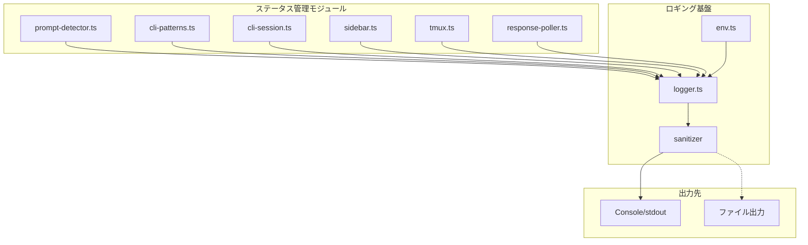

# Issue #41: ステータス管理のログ強化 - 設計方針書

## 1. 概要

ステータス管理機能のデバッグを容易にするため、構造化ログとログレベル制御を導入する。

### 目的
- デバッグ効率の向上
- 問題発生時の原因特定を迅速化
- 本番環境でのパフォーマンス影響を最小化

### スコープ
| 対象 | 説明 |
|------|------|
| ロガーユーティリティ | `src/lib/logger.ts` の新規作成 |
| 環境変数制御 | ログレベル、出力形式の設定 |
| 主要モジュール | ステータス管理関連の6モジュール |

---

## 2. アーキテクチャ設計

### システム構成図



### レイヤー構成

```
src/lib/
├── logger.ts              # ロガーユーティリティ（新規）
├── env.ts                 # 環境変数管理（ログ設定追加）
├── prompt-detector.ts     # プロンプト検出（ログ追加）
├── cli-patterns.ts        # パターン検出（ログ追加）
├── cli-session.ts         # セッション管理（ログ追加）
├── tmux.ts               # tmuxコマンド実行（ログ追加）
├── response-poller.ts    # レスポンスポーリング（ログ構造化）
└── ...

src/types/
├── sidebar.ts            # サイドバー型定義（ログ追加）
└── ...

src/app/api/worktrees/
└── route.ts              # ワークツリーAPI（ログ追加）
```

---

## 3. ロガーユーティリティ設計

### 3.1 インターフェース定義

```typescript
// src/lib/logger.ts

/**
 * ログレベル定義
 * debug < info < warn < error
 */
export type LogLevel = 'debug' | 'info' | 'warn' | 'error';

/**
 * 構造化ログエントリ
 */
export interface LogEntry {
  level: LogLevel;
  module: string;
  action: string;
  data?: Record<string, unknown>;
  timestamp: string;
  worktreeId?: string;
  cliToolId?: string;
  requestId?: string;  // [SF-2] リクエスト単位でのトレース用
}

/**
 * ロガーコンテキスト
 */
export interface LoggerContext {
  worktreeId?: string;
  cliToolId?: string;
  requestId?: string;
}

/**
 * ロガーインスタンス型
 */
export interface Logger {
  debug: (action: string, data?: Record<string, unknown>) => void;
  info: (action: string, data?: Record<string, unknown>) => void;
  warn: (action: string, data?: Record<string, unknown>) => void;
  error: (action: string, data?: Record<string, unknown>) => void;
  /** コンテキスト付きロガーを生成 */
  withContext: (context: LoggerContext) => Logger;
}

/**
 * モジュール別ロガーファクトリ
 */
export function createLogger(module: string): Logger;

/**
 * リクエストID生成
 */
export function generateRequestId(): string;
```

### 3.2 実装方針

```typescript
// src/lib/logger.ts

import { getLogConfig } from './env';

// ============================================================
// [MF-1] 機密情報フィルタリング
// ============================================================

/**
 * センシティブデータのパターン定義
 */
const SENSITIVE_PATTERNS: Array<{ pattern: RegExp; replacement: string }> = [
  // Bearer トークン
  { pattern: /Bearer\s+[A-Za-z0-9\-._~+/]+=*/gi, replacement: 'Bearer [REDACTED]' },
  // パスワード関連
  { pattern: /(password|passwd|pwd)[=:]\s*\S+/gi, replacement: '$1=[REDACTED]' },
  // トークン・シークレット関連
  { pattern: /(token|secret|api_key|apikey|auth)[=:]\s*\S+/gi, replacement: '$1=[REDACTED]' },
  // MCBD_AUTH_TOKEN
  { pattern: /MCBD_AUTH_TOKEN=\S+/gi, replacement: 'MCBD_AUTH_TOKEN=[REDACTED]' },
  // Authorization ヘッダー
  { pattern: /Authorization:\s*\S+/gi, replacement: 'Authorization: [REDACTED]' },
  // SSH キー
  { pattern: /-----BEGIN\s+\w+\s+PRIVATE\s+KEY-----[\s\S]*?-----END\s+\w+\s+PRIVATE\s+KEY-----/g, replacement: '[SSH_KEY_REDACTED]' },
];

/**
 * 値をサニタイズ（機密情報をマスク）
 */
function sanitize(value: unknown): unknown {
  if (typeof value === 'string') {
    let sanitized = value;
    for (const { pattern, replacement } of SENSITIVE_PATTERNS) {
      sanitized = sanitized.replace(pattern, replacement);
    }
    return sanitized;
  }
  if (typeof value === 'object' && value !== null) {
    if (Array.isArray(value)) {
      return value.map(sanitize);
    }
    const result: Record<string, unknown> = {};
    for (const [k, v] of Object.entries(value)) {
      // キー名自体がセンシティブな場合もマスク
      if (/password|secret|token|key|auth/i.test(k)) {
        result[k] = '[REDACTED]';
      } else {
        result[k] = sanitize(v);
      }
    }
    return result;
  }
  return value;
}

// ============================================================
// [MF-2] Server/Client ログ分離
// ============================================================

/**
 * サーバーサイドかどうかを判定
 */
function isServer(): boolean {
  return typeof window === 'undefined';
}

/**
 * クライアントサイドでログ出力すべきか判定
 * 開発環境のみ出力
 */
function shouldLogOnClient(): boolean {
  return process.env.NODE_ENV === 'development';
}

// ============================================================
// ログレベル制御
// ============================================================

const LOG_LEVELS: Record<LogLevel, number> = {
  debug: 0,
  info: 1,
  warn: 2,
  error: 3,
};

/**
 * 現在のログレベルを取得
 * [SF-1] env.ts から取得
 */
function getCurrentLogLevel(): LogLevel {
  const config = getLogConfig();
  return config.level;
}

/**
 * ログ出力形式を取得
 * [SF-1] env.ts から取得
 */
function getLogFormat(): 'json' | 'text' {
  const config = getLogConfig();
  return config.format;
}

// ============================================================
// ログ出力
// ============================================================

/**
 * ログエントリをフォーマット
 */
function formatLogEntry(entry: LogEntry): string {
  if (getLogFormat() === 'json') {
    return JSON.stringify(entry);
  }

  // テキスト形式
  const { timestamp, level, module, action, data, worktreeId, cliToolId, requestId } = entry;
  const contextParts = [worktreeId, cliToolId].filter(Boolean);
  const contextStr = contextParts.length > 0 ? ` [${contextParts.join(':')}]` : '';
  const requestIdStr = requestId ? ` (${requestId.slice(0, 8)})` : '';
  const dataStr = data ? ` ${JSON.stringify(data)}` : '';

  return `[${timestamp}] [${level.toUpperCase()}] [${module}]${contextStr}${requestIdStr} ${action}${dataStr}`;
}

/**
 * ログ出力の実行
 */
function log(
  level: LogLevel,
  module: string,
  action: string,
  data?: Record<string, unknown>,
  context?: LoggerContext
): void {
  const currentLevel = getCurrentLogLevel();
  if (LOG_LEVELS[level] < LOG_LEVELS[currentLevel]) {
    return; // ログレベル未満は出力しない
  }

  // [MF-2] クライアントサイドでは開発環境のみ出力
  if (!isServer() && !shouldLogOnClient()) {
    return;
  }

  // [MF-1] データをサニタイズ
  const sanitizedData = data ? (sanitize(data) as Record<string, unknown>) : undefined;

  const entry: LogEntry = {
    level,
    module,
    action,
    timestamp: new Date().toISOString(),
    ...context,
    ...(sanitizedData && { data: sanitizedData }),
  };

  const formatted = formatLogEntry(entry);

  // サーバーサイドは構造化ログ、クライアントサイドは console グループ
  if (isServer()) {
    switch (level) {
      case 'error':
        console.error(formatted);
        break;
      case 'warn':
        console.warn(formatted);
        break;
      default:
        console.log(formatted);
    }
  } else {
    // クライアントサイド（開発環境のみ）
    const consoleMethod = level === 'error' ? 'error' : level === 'warn' ? 'warn' : 'log';
    console[consoleMethod](`[${module}] ${action}`, sanitizedData || '');
  }
}

// ============================================================
// [SF-2] リクエストID生成
// ============================================================

/**
 * リクエストID生成
 * UUID v4 形式
 */
export function generateRequestId(): string {
  // crypto.randomUUID() は Node.js 19+ と最新ブラウザで利用可能
  // フォールバック実装も提供
  if (typeof crypto !== 'undefined' && crypto.randomUUID) {
    return crypto.randomUUID();
  }
  // フォールバック: シンプルなランダムID
  return 'xxxxxxxx-xxxx-4xxx-yxxx-xxxxxxxxxxxx'.replace(/[xy]/g, (c) => {
    const r = (Math.random() * 16) | 0;
    const v = c === 'x' ? r : (r & 0x3) | 0x8;
    return v.toString(16);
  });
}

// ============================================================
// ロガーファクトリ
// ============================================================

/**
 * モジュール別ロガーを生成
 */
export function createLogger(module: string): Logger {
  const createLoggerWithContext = (context?: LoggerContext): Logger => ({
    debug: (action, data) => log('debug', module, action, data, context),
    info: (action, data) => log('info', module, action, data, context),
    warn: (action, data) => log('warn', module, action, data, context),
    error: (action, data) => log('error', module, action, data, context),
    withContext: (newContext) => createLoggerWithContext({ ...context, ...newContext }),
  });

  return createLoggerWithContext();
}
```

---

## 4. 環境変数設計

### 4.1 設定項目

| 変数名 | 型 | デフォルト | 説明 |
|--------|------|----------|------|
| `MCBD_LOG_LEVEL` | `debug \| info \| warn \| error` | 開発: `debug`, 本番: `info` | 出力するログレベルの閾値 |
| `MCBD_LOG_FORMAT` | `json \| text` | `text` | ログ出力形式 |

### 4.2 env.ts への統合 [SF-1]

```typescript
// src/lib/env.ts に追加

import type { LogLevel } from './logger';

export interface Env {
  // ... 既存のプロパティ

  /** ログ設定 */
  MCBD_LOG_LEVEL: LogLevel;
  MCBD_LOG_FORMAT: 'json' | 'text';
}

/**
 * ログレベルのバリデーション
 */
function isValidLogLevel(level: string | undefined): level is LogLevel {
  return level !== undefined && ['debug', 'info', 'warn', 'error'].includes(level);
}

/**
 * ログ設定を取得
 */
export function getLogConfig(): { level: LogLevel; format: 'json' | 'text' } {
  const levelEnv = process.env.MCBD_LOG_LEVEL?.toLowerCase();
  const formatEnv = process.env.MCBD_LOG_FORMAT?.toLowerCase();

  // デフォルト: 開発環境は debug、本番は info
  const defaultLevel: LogLevel = process.env.NODE_ENV === 'production' ? 'info' : 'debug';

  return {
    level: isValidLogLevel(levelEnv) ? levelEnv : defaultLevel,
    format: formatEnv === 'json' ? 'json' : 'text',
  };
}

// getEnv() に追加
export function getEnv(): Env {
  // ... 既存のバリデーションロジック

  const logConfig = getLogConfig();

  return {
    // ... 既存のプロパティ
    MCBD_LOG_LEVEL: logConfig.level,
    MCBD_LOG_FORMAT: logConfig.format,
  };
}
```

### 4.3 .env.example 更新

```bash
# ===================================
# ログ設定
# ===================================

# ログレベル: debug | info | warn | error
# 開発環境デフォルト: debug
# 本番環境デフォルト: info
MCBD_LOG_LEVEL=debug

# ログ出力形式: json | text
# json: 構造化ログ（本番向け、ログ分析ツール連携）
# text: 人間が読みやすい形式（開発向け）
MCBD_LOG_FORMAT=text
```

---

## 5. セキュリティ設計 [MF-1]

### 5.1 機密情報フィルタリング

ログ出力前にすべてのデータをサニタイズし、機密情報が漏洩しないようにする。

#### フィルタリング対象

| パターン | 説明 | 置換後 |
|---------|------|--------|
| `Bearer xxx` | Bearer トークン | `Bearer [REDACTED]` |
| `password=xxx` | パスワード | `password=[REDACTED]` |
| `token=xxx` | 各種トークン | `token=[REDACTED]` |
| `MCBD_AUTH_TOKEN=xxx` | 認証トークン | `MCBD_AUTH_TOKEN=[REDACTED]` |
| `Authorization: xxx` | Authorization ヘッダー | `Authorization: [REDACTED]` |
| SSH秘密鍵 | PEM形式の秘密鍵 | `[SSH_KEY_REDACTED]` |

#### キー名によるフィルタリング

オブジェクトのキー名が以下のパターンにマッチする場合、値を自動的にマスク:
- `password`, `passwd`, `pwd`
- `secret`
- `token`
- `key`, `apikey`, `api_key`
- `auth`

### 5.2 出力例

```typescript
// 入力
log.debug('authCheck', {
  userId: 'user-123',
  token: 'eyJhbGciOiJIUzI1NiIsInR5cCI6IkpXVCJ9...',
  password: 'secret123',
});

// 出力（サニタイズ後）
// {"level":"debug","module":"auth","action":"authCheck","data":{"userId":"user-123","token":"[REDACTED]","password":"[REDACTED]"}}
```

---

## 6. Server/Client ログ分離 [MF-2]

### 6.1 設計方針

Next.js 環境では Server Components と Client Components でログの扱いを分離する。

| 環境 | 出力条件 | 形式 |
|------|---------|------|
| Server (SSR/API Routes) | 常に出力 | 構造化ログ（JSON/テキスト） |
| Client (開発環境) | 開発時のみ | シンプルな console.log |
| Client (本番環境) | 出力しない | - |

### 6.2 実装

```typescript
function isServer(): boolean {
  return typeof window === 'undefined';
}

function shouldLogOnClient(): boolean {
  return process.env.NODE_ENV === 'development';
}

function log(level: LogLevel, ...): void {
  // クライアントサイドでは開発環境のみ出力
  if (!isServer() && !shouldLogOnClient()) {
    return;
  }

  // サーバーサイドは構造化ログ
  if (isServer()) {
    console.log(formatLogEntry(entry));
  } else {
    // クライアントサイド（開発環境）はシンプルな形式
    console.log(`[${module}] ${action}`, data);
  }
}
```

---

## 7. リクエストトレーシング [SF-2]

### 7.1 設計方針

関連するログをグループ化するためのリクエストIDを導入。APIリクエスト単位でログを追跡可能にする。

### 7.2 使用例

```typescript
// API Route での使用例
export async function GET(request: NextRequest) {
  const requestId = generateRequestId();
  const log = logger.withContext({ requestId });

  log.info('GET:start');

  for (const worktree of worktrees) {
    const wtLog = log.withContext({ worktreeId: worktree.id });
    wtLog.debug('statusCheck:start');
    // ...
  }

  log.info('GET:complete', { worktreeCount: worktrees.length });
}
```

### 7.3 出力例

```
[2025-01-12T10:30:00.000Z] [INFO] [api-worktrees] (a1b2c3d4) GET:start
[2025-01-12T10:30:00.010Z] [DEBUG] [api-worktrees] [feature-123] (a1b2c3d4) statusCheck:start
[2025-01-12T10:30:00.050Z] [DEBUG] [api-worktrees] [feature-456] (a1b2c3d4) statusCheck:start
[2025-01-12T10:30:00.100Z] [INFO] [api-worktrees] (a1b2c3d4) GET:complete {"worktreeCount":2}
```

---

## 8. ログ追加対象と出力内容

### 8.1 優先度: 高

#### prompt-detector.ts

```typescript
const logger = createLogger('prompt-detector');

export function detectPrompt(output: string): PromptDetectionResult {
  const log = logger.withContext({});

  log.debug('detectPrompt:start', { outputLength: output.length });

  // Multiple choice検出
  const multipleChoiceResult = detectMultipleChoicePrompt(output);
  if (multipleChoiceResult.isPrompt) {
    log.info('detectPrompt:multipleChoice', {
      isPrompt: true,
      question: multipleChoiceResult.promptData?.question,
      optionsCount: multipleChoiceResult.promptData?.options?.length,
    });
    return multipleChoiceResult;
  }

  // Yes/No パターン検出
  // ... 各パターンでログ出力

  log.debug('detectPrompt:complete', { isPrompt: result.isPrompt, type: result.promptData?.type });
  return result;
}
```

#### cli-patterns.ts

```typescript
const logger = createLogger('cli-patterns');

export function detectThinking(cliToolId: CLIToolType, content: string): boolean {
  const log = logger.withContext({ cliToolId });

  log.debug('detectThinking:check', { contentLength: content.length });

  const result = /* 検出ロジック */;

  log.debug('detectThinking:result', { isThinking: result });
  return result;
}
```

#### cli-session.ts

```typescript
const logger = createLogger('cli-session');

export async function captureSessionOutput(
  worktreeId: string,
  cliToolId: CLIToolType,
  lines: number = 1000
): Promise<string> {
  const log = logger.withContext({ worktreeId, cliToolId });

  log.debug('captureSessionOutput:start', { requestedLines: lines });

  try {
    const output = await capturePane(sessionName, { startLine: -lines });
    const actualLines = output.split('\n').length;

    // [MF-1] lastFewLines は自動的にサニタイズされる
    log.debug('captureSessionOutput:success', {
      actualLines,
      lastFewLines: output.split('\n').slice(-3).join(' | '),
    });

    return output;
  } catch (error) {
    log.error('captureSessionOutput:failed', { error: String(error) });
    throw error;
  }
}
```

### 8.2 優先度: 中

#### sidebar.ts (types/sidebar.ts)

```typescript
const logger = createLogger('sidebar');

function determineBranchStatus(worktree: Worktree): BranchStatus {
  const log = logger.withContext({ worktreeId: worktree.id });

  log.debug('determineBranchStatus:start', {
    hasClaudeStatus: !!worktree.sessionStatusByCli?.claude,
  });

  const claudeStatus = worktree.sessionStatusByCli?.claude;
  if (claudeStatus) {
    log.debug('determineBranchStatus:claudeStatus', {
      isWaitingForResponse: claudeStatus.isWaitingForResponse,
      isProcessing: claudeStatus.isProcessing,
      isRunning: claudeStatus.isRunning,
    });

    // 判定ロジック...
  }

  log.debug('determineBranchStatus:result', { status });
  return status;
}
```

#### worktrees/route.ts

```typescript
import { createLogger, generateRequestId } from '@/lib/logger';

const logger = createLogger('api-worktrees');

export async function GET(request: NextRequest) {
  // [SF-2] リクエストIDを生成
  const requestId = generateRequestId();
  const log = logger.withContext({ requestId });

  log.debug('GET:start');

  for (const cliToolId of allCliTools) {
    const cliLog = log.withContext({ worktreeId: worktree.id, cliToolId });

    cliLog.debug('statusCheck:start');

    if (isRunning) {
      const output = await captureSessionOutput(worktree.id, cliToolId, 100);
      const promptDetection = detectPrompt(cleanOutput);

      cliLog.debug('statusCheck:analysis', {
        isPrompt: promptDetection.isPrompt,
        isThinking: detectThinking(cliToolId, lastLines),
        hasInputPrompt: /^[>❯]\s*$/m.test(lastLines),
      });
    }

    cliLog.debug('statusCheck:result', { isRunning, isWaitingForResponse, isProcessing });
  }

  log.info('GET:complete', { worktreeCount: worktreesWithStatus.length });
}
```

#### tmux.ts

```typescript
const logger = createLogger('tmux');

export async function hasSession(sessionName: string): Promise<boolean> {
  const log = logger;

  log.debug('hasSession:check', { sessionName });

  try {
    await execAsync(`tmux has-session -t "${sessionName}"`, { timeout: DEFAULT_TIMEOUT });
    log.debug('hasSession:exists', { sessionName });
    return true;
  } catch {
    log.debug('hasSession:notFound', { sessionName });
    return false;
  }
}

export async function capturePane(
  sessionName: string,
  options?: CapturePaneOptions
): Promise<string> {
  const log = logger;
  const startTime = Date.now();

  log.debug('capturePane:start', { sessionName, options });

  try {
    const { stdout } = await execAsync(command, { timeout: DEFAULT_TIMEOUT, maxBuffer });

    log.debug('capturePane:success', {
      sessionName,
      outputLength: stdout.length,
      durationMs: Date.now() - startTime,
    });

    return stdout;
  } catch (error) {
    log.error('capturePane:failed', {
      sessionName,
      error: String(error),
      durationMs: Date.now() - startTime,
    });
    throw error;
  }
}
```

### 8.3 優先度: 低

#### response-poller.ts (既存ログの構造化)

```typescript
const logger = createLogger('response-poller');

// 既存の console.log/error を構造化ログに置換
// Before:
console.log(`Marked ${answeredCount} pending prompt(s) as answered for ${worktreeId}`);

// After:
logger.withContext({ worktreeId, cliToolId }).info('markPromptsAnswered', { count: answeredCount });
```

---

## 9. ログ出力例

### 9.1 JSON形式（本番向け）

```json
{"level":"debug","module":"prompt-detector","action":"detectPrompt:start","timestamp":"2025-01-12T10:30:00.000Z","data":{"outputLength":1500}}
{"level":"info","module":"prompt-detector","action":"detectPrompt:multipleChoice","timestamp":"2025-01-12T10:30:00.010Z","data":{"isPrompt":true,"question":"Do you want to proceed?","optionsCount":3}}
{"level":"debug","module":"cli-session","action":"captureSessionOutput:success","timestamp":"2025-01-12T10:30:00.050Z","worktreeId":"feature-123","cliToolId":"claude","requestId":"a1b2c3d4-e5f6-7890-abcd-ef1234567890","data":{"actualLines":150,"lastFewLines":"... | ───────── | "}}
```

### 9.2 テキスト形式（開発向け）

```
[2025-01-12T10:30:00.000Z] [DEBUG] [prompt-detector] detectPrompt:start {"outputLength":1500}
[2025-01-12T10:30:00.010Z] [INFO] [prompt-detector] detectPrompt:multipleChoice {"isPrompt":true,"question":"Do you want to proceed?","optionsCount":3}
[2025-01-12T10:30:00.050Z] [DEBUG] [cli-session] [feature-123:claude] (a1b2c3d4) captureSessionOutput:success {"actualLines":150,"lastFewLines":"... | ───────── | "}
```

---

## 10. 設計パターン

### 10.1 Factory パターン

```typescript
// createLogger() がモジュール名を受け取り、そのモジュール専用のロガーインスタンスを生成
const logger = createLogger('prompt-detector');
```

### 10.2 Builder パターン (withContext)

```typescript
// withContext() でコンテキスト情報を追加した新しいロガーを生成
const log = logger.withContext({ worktreeId, cliToolId, requestId });
log.debug('action', { data });
```

### 10.3 Strategy パターン (出力形式)

```typescript
// 環境変数に基づいて JSON または テキスト形式を選択
function formatLogEntry(entry: LogEntry): string {
  if (getLogFormat() === 'json') {
    return formatAsJson(entry);
  }
  return formatAsText(entry);
}
```

### 10.4 Decorator パターン (サニタイズ)

```typescript
// ログ出力前にデータをサニタイズ（装飾）
const sanitizedData = sanitize(data);
const entry = { ...baseEntry, data: sanitizedData };
```

---

## 11. パフォーマンス設計

### 11.1 ログレベルによる早期リターン

```typescript
function log(level: LogLevel, ...): void {
  const currentLevel = getCurrentLogLevel();
  // 閾値未満のログは即座にリターン（文字列生成コストを回避）
  if (LOG_LEVELS[level] < LOG_LEVELS[currentLevel]) {
    return;
  }
  // ...
}
```

### 11.2 本番環境のデフォルト

| 環境 | デフォルトレベル | 説明 |
|------|----------------|------|
| 開発 | `debug` | 全ログ出力 |
| 本番 | `info` | debug ログは出力しない |

### 11.3 クライアントサイドの抑制 [MF-2]

```typescript
// 本番環境のクライアントサイドではログを出力しない
if (!isServer() && process.env.NODE_ENV === 'production') {
  return;
}
```

### 11.4 データサイズの制限

```typescript
// 大きなデータは要約して出力
log.debug('captureSessionOutput:success', {
  actualLines,
  // 全出力ではなく最後の数行のみ
  lastFewLines: output.split('\n').slice(-3).join(' | '),
});
```

---

## 12. 既存コードの移行ガイド

### 12.1 console.log → logger.info

```typescript
// Before
console.log(`Starting poller for ${worktreeId}`);

// After
logger.withContext({ worktreeId }).info('startPolling');
```

### 12.2 console.error → logger.error

```typescript
// Before
console.error(`Error checking for response (${worktreeId}):`, errorMessage);

// After
logger.withContext({ worktreeId }).error('checkForResponse:failed', { error: errorMessage });
```

### 12.3 console.warn → logger.warn

```typescript
// Before
console.warn(`Unknown message type:`, message);

// After
logger.warn('handleMessage:unknownType', { message });
```

---

## 13. テスト戦略

### 13.1 単体テスト

```typescript
// src/lib/__tests__/logger.test.ts

import { describe, it, expect, vi, beforeEach, afterEach } from 'vitest';
import { createLogger, generateRequestId } from '../logger';

describe('createLogger', () => {
  beforeEach(() => {
    vi.spyOn(console, 'log').mockImplementation(() => {});
    vi.spyOn(console, 'warn').mockImplementation(() => {});
    vi.spyOn(console, 'error').mockImplementation(() => {});
  });

  afterEach(() => {
    vi.restoreAllMocks();
    delete process.env.MCBD_LOG_LEVEL;
    delete process.env.MCBD_LOG_FORMAT;
  });

  it('should create logger with module name', () => {
    const logger = createLogger('test-module');
    expect(logger.debug).toBeDefined();
    expect(logger.info).toBeDefined();
    expect(logger.warn).toBeDefined();
    expect(logger.error).toBeDefined();
  });

  it('should respect log level', () => {
    process.env.MCBD_LOG_LEVEL = 'warn';
    const consoleSpy = vi.spyOn(console, 'log');

    const logger = createLogger('test');
    logger.debug('test');

    expect(consoleSpy).not.toHaveBeenCalled();
  });

  it('should output JSON format when configured', () => {
    process.env.MCBD_LOG_FORMAT = 'json';
    const consoleSpy = vi.spyOn(console, 'log');

    const logger = createLogger('test');
    logger.info('action', { key: 'value' });

    const output = consoleSpy.mock.calls[0][0];
    expect(() => JSON.parse(output)).not.toThrow();
  });

  it('should include context in output', () => {
    const logger = createLogger('test');
    const logWithContext = logger.withContext({
      worktreeId: 'wt-1',
      cliToolId: 'claude',
      requestId: 'req-123',
    });

    const consoleSpy = vi.spyOn(console, 'log');
    logWithContext.info('action');

    const output = consoleSpy.mock.calls[0][0];
    expect(output).toContain('wt-1');
    expect(output).toContain('claude');
    expect(output).toContain('req-123');
  });
});

// [MF-1] 機密情報フィルタリングのテスト
describe('sanitization', () => {
  it('should redact Bearer tokens', () => {
    const logger = createLogger('test');
    const consoleSpy = vi.spyOn(console, 'log');

    logger.info('auth', {
      header: 'Bearer eyJhbGciOiJIUzI1NiIsInR5cCI6IkpXVCJ9.xxxxx'
    });

    const output = consoleSpy.mock.calls[0][0];
    expect(output).toContain('[REDACTED]');
    expect(output).not.toContain('eyJhbGciOiJIUzI1NiIsInR5cCI6IkpXVCJ9');
  });

  it('should redact password fields by key name', () => {
    const logger = createLogger('test');
    const consoleSpy = vi.spyOn(console, 'log');

    logger.info('login', {
      username: 'user1',
      password: 'secret123',
    });

    const output = consoleSpy.mock.calls[0][0];
    expect(output).toContain('user1');
    expect(output).toContain('[REDACTED]');
    expect(output).not.toContain('secret123');
  });

  it('should redact MCBD_AUTH_TOKEN', () => {
    const logger = createLogger('test');
    const consoleSpy = vi.spyOn(console, 'log');

    logger.info('env', {
      output: 'MCBD_AUTH_TOKEN=super-secret-token-123',
    });

    const output = consoleSpy.mock.calls[0][0];
    expect(output).toContain('MCBD_AUTH_TOKEN=[REDACTED]');
    expect(output).not.toContain('super-secret-token-123');
  });

  it('should redact nested sensitive data', () => {
    const logger = createLogger('test');
    const consoleSpy = vi.spyOn(console, 'log');

    logger.info('config', {
      database: {
        host: 'localhost',
        password: 'db-password',
      },
      api: {
        token: 'api-token-123',
      },
    });

    const output = consoleSpy.mock.calls[0][0];
    expect(output).toContain('localhost');
    expect(output).not.toContain('db-password');
    expect(output).not.toContain('api-token-123');
  });
});

// [SF-2] リクエストID生成のテスト
describe('generateRequestId', () => {
  it('should generate UUID-like string', () => {
    const id = generateRequestId();
    expect(id).toMatch(/^[a-f0-9]{8}-[a-f0-9]{4}-4[a-f0-9]{3}-[89ab][a-f0-9]{3}-[a-f0-9]{12}$/i);
  });

  it('should generate unique IDs', () => {
    const ids = new Set<string>();
    for (let i = 0; i < 100; i++) {
      ids.add(generateRequestId());
    }
    expect(ids.size).toBe(100);
  });
});
```

---

## 14. 設計上の決定事項とトレードオフ

### 14.1 採用した設計

| 決定事項 | 理由 | トレードオフ |
|---------|------|-------------|
| console ベース出力 | シンプル、外部依存なし | ファイル出力は手動実装が必要 |
| Factory + Builder パターン | 柔軟なコンテキスト管理 | 若干の複雑性増加 |
| 環境変数による制御 | 実行時変更可能 | 設定漏れリスク |
| JSON/テキスト切替 | 開発・運用で最適化 | 両形式のメンテナンス |
| 機密情報フィルタリング [MF-1] | セキュリティ確保 | パフォーマンスオーバーヘッド（軽微） |
| Server/Client 分離 [MF-2] | Next.js 最適化 | 実装複雑性増加 |
| env.ts 統合 [SF-1] | 型安全性、一貫性 | 既存コードへの影響 |
| リクエストID [SF-2] | トレーサビリティ | メモリ使用量増加（軽微） |

### 14.2 代替案との比較

| 代替案 | メリット | デメリット | 採用理由 |
|--------|---------|-----------|---------|
| winston/pino | 高機能、ファイル出力 | 外部依存追加 | 不採用: シンプルさ優先 |
| サーバーレス専用ロガー | クラウド最適化 | ベンダーロックイン | 不採用: ローカル重視 |
| グローバルロガー | 実装シンプル | モジュール識別困難 | 不採用: デバッグ性 |

### 14.3 将来の拡張

| 拡張項目 | 優先度 | 実装時期 |
|---------|-------|---------|
| ファイル出力 | 低 | 必要時 |
| ログローテーション | 低 | 必要時 |
| 構造化クエリ | 低 | 必要時 |
| リモート送信 | 低 | 必要時 |

---

## 15. 実装チェックリスト

### Phase 1: ロガー基盤（必須）

- [ ] `src/lib/logger.ts` 作成
  - [ ] 基本的なロガー機能
  - [ ] [MF-1] 機密情報フィルタリング（sanitize 関数）
  - [ ] [MF-2] Server/Client ログ分離
  - [ ] [SF-2] リクエストID生成（generateRequestId）
- [ ] [SF-1] `src/lib/env.ts` 更新（getLogConfig 追加）
- [ ] 環境変数定義（`.env.example` 更新）
- [ ] 単体テスト作成
  - [ ] 基本機能テスト
  - [ ] [MF-1] サニタイズテスト
  - [ ] [SF-2] リクエストIDテスト

### Phase 2: 優先度高モジュール

- [ ] `prompt-detector.ts` ログ追加
- [ ] `cli-patterns.ts` ログ追加
- [ ] `cli-session.ts` ログ追加

### Phase 3: 優先度中モジュール

- [ ] `sidebar.ts` ログ追加
- [ ] `worktrees/route.ts` ログ追加（[SF-2] requestId 使用）
- [ ] `tmux.ts` ログ追加

### Phase 4: 既存ログ構造化

- [ ] `response-poller.ts` 構造化
- [ ] その他 `console.*` 置換

### Phase 5: ドキュメント

- [ ] README 更新
- [ ] CLAUDE.md 更新（必要に応じて）

---

## 16. 制約条件の確認

### CLAUDE.md 原則への準拠

| 原則 | 準拠状況 |
|------|---------|
| SOLID | Logger は単一責任、拡張可能 |
| KISS | 外部依存なし、console ベース |
| YAGNI | ファイル出力等は未実装 |
| DRY | createLogger で共通化 |

---

## 17. 関連ドキュメント

- [Issue #41](https://github.com/Kewton/MyCodeBranchDesk/issues/41) - 元Issue
- [Issue #31](https://github.com/Kewton/MyCodeBranchDesk/issues/31) - サイドバーUX改善
- [ステータスインジケーター](../../docs/features/sidebar-status-indicator.md) - 関連機能
- [アーキテクチャレビュー](../review/2026-01-12-issue41-architecture-review.md) - 本設計のレビュー結果
