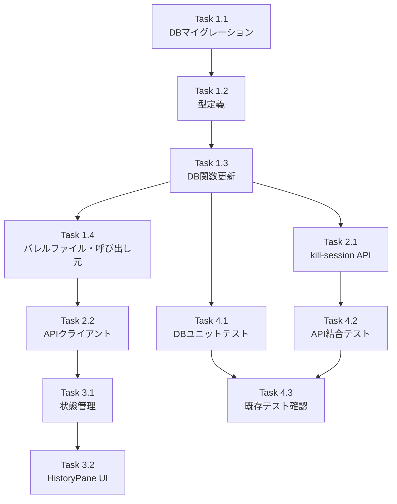

# Issue #168 作業計画書

## Issue: セッションをクリアしても履歴はクリアして欲しく無い
**Issue番号**: #168
**サイズ**: M
**優先度**: Medium
**依存Issue**: なし
**ブランチ**: `feature/168-session-history-retention`

---

## 詳細タスク分解

### Phase 1: データモデル・DB層（基盤）

#### Task 1.1: DBマイグレーション追加
- **成果物**: `src/lib/db/db-migrations.ts` (マイグレーション v22 追加)
- **依存**: なし
- **内容**:
  - `chat_messages` テーブルに `archived INTEGER DEFAULT 0` カラムを追加
  - 既存行の安全策: `UPDATE chat_messages SET archived = 0 WHERE archived IS NULL`
  - 複合インデックス `idx_messages_archived(worktree_id, archived, timestamp DESC)` を追加
  - `CURRENT_SCHEMA_VERSION` を 22 にインクリメント
  - `init-db.ts` の CREATE TABLE にも `archived` カラムを追加

#### Task 1.2: 型定義の更新
- **成果物**: `src/lib/db/chat-db.ts`, `src/types/models.ts`
- **依存**: Task 1.1
- **内容**:
  - `ChatMessageRow` 型に `archived: number` を追加
  - `ChatMessage` 型に `archived: boolean` を追加（required: DR1-006）
  - `mapChatMessage` に `archived: row.archived === 1` マッピングを追加
  - `GetMessagesOptions` インターフェースを新規定義・export
  - `createMessage` の引数型を `Omit<ChatMessage, 'id' | 'archived'>` に変更（IA3-004）

#### Task 1.3: ACTIVE_FILTER定数とDB関数の更新
- **成果物**: `src/lib/db/chat-db.ts`, `src/lib/db/worktree-db.ts`
- **依存**: Task 1.2
- **内容**:
  - `ACTIVE_FILTER = 'AND archived = 0'` モジュールレベル定数を定義（DR1-002）
  - `getMessages` をオプションオブジェクトパターンに変更（DR1-001）、`includeArchived` パラメータ追加
  - `getLastAssistantMessageAt` に ACTIVE_FILTER 追加
  - `getLastMessage` に ACTIVE_FILTER 追加
  - `getLastUserMessage` に ACTIVE_FILTER 追加
  - `markPendingPromptsAsAnswered` に ACTIVE_FILTER 追加
  - `deleteMessagesByCliTool` の内部実装を UPDATE archived=1 に変更（関数名維持: DR1-003）
  - `deleteAllMessages` の内部実装を UPDATE archived=1 に変更、戻り値を number に変更（CR2-006）
  - `getMessageById` の SELECT に archived カラムを追加（CR2-010）
  - `clearLastUserMessage` 関数を新規追加（CR2-005）
  - `getLastMessagesByCliBatch` (worktree-db.ts) に `AND archived = 0` 追加
  - `getWorktrees` / `getWorktreeById` のサブクエリに `AND archived = 0` 追加

#### Task 1.4: バレルファイル・呼び出し元の更新
- **成果物**: `src/lib/db/db.ts`, `src/app/api/worktrees/[id]/messages/route.ts`, `src/app/api/worktrees/[id]/send/route.ts`, `src/lib/session/worktree-status-helper.ts`
- **依存**: Task 1.3
- **内容**:
  - `db.ts` バレルファイルに `clearLastUserMessage`, `GetMessagesOptions` のエクスポート追加
  - `messages/route.ts` の `getMessages` 呼び出しをオプションオブジェクト形式に更新、`includeArchived` パラメータ対応
  - `send/route.ts` の `getMessages` 呼び出しをオプションオブジェクト形式に更新
  - `worktree-status-helper.ts` の `getMessages` 呼び出しをオプションオブジェクト形式に更新

### Phase 2: API層

#### Task 2.1: kill-session API の論理削除対応
- **成果物**: `src/app/api/worktrees/[id]/kill-session/route.ts`
- **依存**: Task 1.3
- **内容**:
  - `deleteMessagesByCliTool` / `deleteAllMessages` は内部実装がUPDATEに変わるだけなので呼び出し側の変更は不要
  - `clearLastUserMessage` の呼び出しを追加（アーカイブ後にlast_user_messageをNULLクリア）
  - WebSocketペイロードは `messagesCleared: true` を維持（DR1-003）

#### Task 2.2: ブラウザ側APIクライアントの更新
- **成果物**: `src/lib/api-client.ts`
- **依存**: Task 1.4
- **内容**:
  - `getMessages` 関数に `includeArchived?: boolean` パラメータを追加（IA3-002）

### Phase 3: UI層

#### Task 3.1: WorktreeDetailRefactored の状態管理
- **成果物**: `src/components/worktree/WorktreeDetailRefactored.tsx`
- **依存**: Task 2.2
- **内容**:
  - `showArchived` state を追加（localStorage で永続化、SidebarContext パターン準拠）
  - `getMessages` API 呼び出しに `includeArchived` パラメータを渡す
  - `showArchived` / `onShowArchivedChange` を HistoryPane に props として渡す（DR1-005）

#### Task 3.2: HistoryPane のトグルUI
- **成果物**: `src/components/worktree/HistoryPane.tsx`
- **依存**: Task 3.1
- **内容**:
  - HistoryPaneProps に `showArchived: boolean` / `onShowArchivedChange: (show: boolean) => void` を追加
  - sticky ヘッダーにトグルチェックボックスを追加
  - アーカイブ済みメッセージに `opacity-60` を適用して視覚的に区別（DR1-007）

### Phase 4: テスト

#### Task 4.1: DB関数のユニットテスト
- **成果物**: `tests/unit/` 配下
- **依存**: Task 1.3
- **内容**:
  - `tests/unit/db.test.ts` - getMessages のオプションオブジェクト対応、archived フィルタ検証
  - `tests/unit/db-delete-messages-by-cli-tool.test.ts` - 論理削除（archived=1）検証
  - `tests/unit/lib/db-migrations.test.ts` - v22 マイグレーションテスト（archived カラム、インデックス確認）
  - `ACTIVE_FILTER` 定数値の検証テスト（SEC4-007）

#### Task 4.2: API結合テスト
- **成果物**: `tests/integration/` 配下
- **依存**: Task 2.1
- **内容**:
  - `tests/integration/api-messages.test.ts` - `includeArchived` クエリパラメータ対応テスト、非正規値('TRUE','1','yes')の検証（SEC4-001）
  - `tests/integration/api-hooks.test.ts` - archived フィルタの影響確認
  - `tests/integration/api-send-cli-tool.test.ts` - archived 対応の確認

#### Task 4.3: 既存テストの動作確認
- **成果物**: なし（確認のみ）
- **依存**: Task 4.1, 4.2
- **内容**:
  - `tests/unit/db-repository-delete.test.ts` - ON DELETE CASCADE 正常動作確認
  - `tests/integration/api-repository-delete.test.ts` - ON DELETE CASCADE 正常動作確認
  - `tests/unit/lib/session-cleanup.test.ts` - セッション管理への非影響確認

---

## タスク依存関係

---

## 品質チェック項目

| チェック項目 | コマンド | 基準 |
|-------------|----------|------|
| TypeScript | `npx tsc --noEmit` | 型エラー0件 |
| ESLint | `npm run lint` | エラー0件 |
| Unit Test | `npm run test:unit` | 全テストパス |
| Build | `npm run build` | 成功 |

---

## 成果物チェックリスト

### コード変更
- [ ] `src/lib/db/db-migrations.ts` - マイグレーション v22
- [ ] `src/lib/db/init-db.ts` - archived カラム追加
- [ ] `src/lib/db/chat-db.ts` - ACTIVE_FILTER, GetMessagesOptions, 全DB関数更新, clearLastUserMessage
- [ ] `src/lib/db/worktree-db.ts` - サブクエリ・バッチクエリの archived フィルタ
- [ ] `src/lib/db/db.ts` - バレルファイルエクスポート追加
- [ ] `src/types/models.ts` - ChatMessage.archived 追加
- [ ] `src/app/api/worktrees/[id]/kill-session/route.ts` - clearLastUserMessage 呼び出し
- [ ] `src/app/api/worktrees/[id]/messages/route.ts` - includeArchived パラメータ
- [ ] `src/app/api/worktrees/[id]/send/route.ts` - getMessages オプションオブジェクト化
- [ ] `src/lib/session/worktree-status-helper.ts` - getMessages オプションオブジェクト化
- [ ] `src/lib/api-client.ts` - includeArchived パラメータ追加
- [ ] `src/components/worktree/WorktreeDetailRefactored.tsx` - showArchived 状態管理
- [ ] `src/components/worktree/HistoryPane.tsx` - トグルUI・archived メッセージの視覚区別

### テスト
- [ ] `tests/unit/db.test.ts` - archived フィルタテスト
- [ ] `tests/unit/db-delete-messages-by-cli-tool.test.ts` - 論理削除テスト
- [ ] `tests/unit/lib/db-migrations.test.ts` - v22 マイグレーションテスト
- [ ] `tests/integration/api-messages.test.ts` - includeArchived テスト
- [ ] `tests/integration/api-hooks.test.ts` - archived 影響確認
- [ ] `tests/integration/api-send-cli-tool.test.ts` - archived 対応確認

---

## Definition of Done

- [ ] すべてのタスクが完了
- [ ] `npx tsc --noEmit` パス
- [ ] `npm run lint` エラー0件
- [ ] `npm run test:unit` 全パス
- [ ] `npm run build` 成功
- [ ] セッションクリア後も過去メッセージ履歴が閲覧可能
- [ ] 新セッション開始時は過去メッセージが非表示（デフォルト）
- [ ] トグルで過去履歴の表示/非表示切替可能
- [ ] サイドバー（未読バッジ・最終メッセージ）がアーカイブに影響されない

---

## 次のアクション

1. **TDD実装開始**: `/pm-auto-dev 168` で自動開発
2. **進捗報告**: `/progress-report` で定期報告
3. **PR作成**: `/create-pr` で自動作成

---

*Generated by work-plan command - 2026-03-20*
