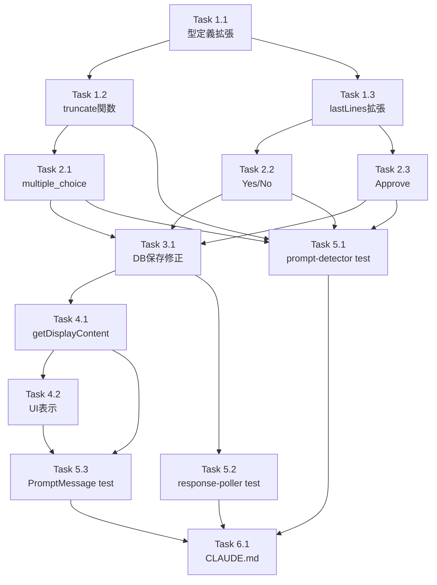

# Issue #235 作業計画書

## Issue概要

**Issue番号**: #235
**タイトル**: fix: プロンプト検出時にClaudeの指示メッセージが切り捨てられ表示されない
**ラベル**: bug
**サイズ**: M（中規模）
**優先度**: Medium
**依存Issue**: なし

**問題概要**:
Claudeがインタラクティブプロンプト（チェックボックス・番号付き選択肢）を返した際、選択肢の前に表示される指示テキスト/コンテキスト文が空白になり表示されない。`prompt-detector.ts` の `cleanContent` 生成ロジックが質問テキストのみ（最大5行）を抽出し、完全なClaude応答を切り捨てることが原因。

**修正方針**:
`PromptDetectionResult` に `rawContent` フィールドを新設し、完全なプロンプト出力を保持する。既存の `cleanContent` は変更せず後方互換性を維持する。

---

## 詳細タスク分解

### Phase 1: 型定義とヘルパー関数実装

#### Task 1.1: PromptDetectionResult 型拡張
- **成果物**: `src/lib/prompt-detector.ts`（型定義部分）
- **作業内容**:
  - `PromptDetectionResult` interface に `rawContent?: string` フィールドを追加
  - JSDoc コメントに「stripAnsi適用済みの完全出力」と明記 [C-001]
- **依存**: なし
- **所要時間**: 15分
- **テスト**: 型チェック（`npx tsc --noEmit`）

#### Task 1.2: truncateRawContent ヘルパー関数追加
- **成果物**: `src/lib/prompt-detector.ts`（関数実装）
- **作業内容**:
  - `RAW_CONTENT_MAX_LINES = 200` 定数追加
  - `RAW_CONTENT_MAX_CHARS = 5000` 定数追加
  - `truncateRawContent()` 関数実装（末尾200行/5000文字制限）
  - ReDoS対策アノテーション追加 [SF-S4-002]
- **依存**: Task 1.1
- **所要時間**: 30分
- **テスト**: Unit Test（Task 2.1で実装）

#### Task 1.3: lastLines 変数のスコープ拡張
- **成果物**: `src/lib/prompt-detector.ts` L97
- **作業内容**:
  - `const lastLines = lines.slice(-10)` を `lines.slice(-20)` に変更
  - Yes/No・Approve パターンが共有する変数の定義箇所を変更 [SF-003] [MF-S2-001]
- **依存**: なし
- **所要時間**: 5分
- **テスト**: 既存テストパス + 新規回帰テスト（Task 2.1）

---

### Phase 2: プロンプト検出ロジック修正

#### Task 2.1: multiple_choice パターンに rawContent 追加
- **成果物**: `src/lib/prompt-detector.ts` `detectMultipleChoicePrompt()` 関数
- **作業内容**:
  - return 文に `rawContent: truncateRawContent(output.trim())` を追加
- **依存**: Task 1.1, Task 1.2
- **所要時間**: 10分
- **テスト**: Unit Test（Task 3.1）

#### Task 2.2: Yes/No パターンに rawContent 追加
- **成果物**: `src/lib/prompt-detector.ts` `detectPrompt()` 関数内 Yes/No ループ
- **作業内容**:
  - return 文に `rawContent: lastLines.trim()` を追加
- **依存**: Task 1.1, Task 1.3
- **所要時間**: 10分
- **テスト**: Unit Test（Task 3.1）

#### Task 2.3: Approve パターンに rawContent 追加
- **成果物**: `src/lib/prompt-detector.ts` `detectPrompt()` 関数内 Approve 検出
- **作業内容**:
  - return 文に `rawContent: lastLines.trim()` を追加
- **依存**: Task 1.1, Task 1.3
- **所要時間**: 10分
- **テスト**: Unit Test（Task 3.1）

---

### Phase 3: DB保存ロジック修正

#### Task 3.1: response-poller.ts の content 値変更
- **成果物**: `src/lib/response-poller.ts` L618
- **作業内容**:
  - `content: promptDetection.cleanContent` を `content: promptDetection.rawContent || promptDetection.cleanContent` に変更
  - 変更理由コメント追加: `// Issue #235: rawContent優先でDB保存` [SF-S2-005]
- **依存**: Task 2.1, Task 2.2, Task 2.3
- **所要時間**: 15分
- **テスト**: Unit Test（Task 4.2）

---

### Phase 4: UI コンポーネント修正

#### Task 4.1: getDisplayContent ヘルパー関数追加
- **成果物**: `src/components/worktree/PromptMessage.tsx`
- **作業内容**:
  - `getDisplayContent(content, question)` 関数を実装
  - 4パターンのフォールバックロジック実装（空/同一/含む/それ以外）
  - 文字列比較の厳密性に関するコメント追加 [SF-S4-003]
- **依存**: なし
- **所要時間**: 20分
- **テスト**: Component Test（Task 5.2）

#### Task 4.2: message.content 表示追加
- **成果物**: `src/components/worktree/PromptMessage.tsx` JSX部分
- **作業内容**:
  - `const displayContent = getDisplayContent(message.content, prompt.question)` を追加
  - 既存の Question セクション（L49-54付近）の前に指示テキスト表示要素を挿入 [SF-S2-004]
  - `whitespace-pre-wrap` クラスで改行を保持
- **依存**: Task 4.1, Task 3.1
- **所要時間**: 20分
- **テスト**: Component Test（Task 5.2）

---

### Phase 5: テスト実装

#### Task 5.1: prompt-detector.test.ts にユニットテスト追加（8項目）
- **成果物**: `tests/unit/prompt-detector.test.ts`
- **作業内容**:
  1. multiple_choice パターンで rawContent が truncate された output.trim() であること
  2. Yes/No パターンで rawContent が lastLines.trim()（20行）であること
  3. Approve パターンで rawContent が設定されていること
  4. プロンプト非検出時に rawContent が undefined であること
  5. `noPromptResult()` ヘルパーから返される結果に rawContent が含まれないこと
  6. truncateRawContent: 200行超の入力で末尾200行が保持されること [MF-001]
  7. truncateRawContent: 5000文字超の入力で末尾5000文字が保持されること [MF-001]
  8. lastLines 拡張の回帰テスト: 末尾11-20行目のパターンが検出されること [SF-S3-002]
- **依存**: Task 2.1, Task 2.2, Task 2.3
- **所要時間**: 90分
- **テスト**: `npm run test:unit -- prompt-detector.test.ts`

#### Task 5.2: response-poller.test.ts にユニットテスト追加（2項目）
- **成果物**: `tests/unit/lib/response-poller.test.ts`
- **作業内容**:
  1. rawContent 設定時に content = rawContent で DB 保存されること
  2. rawContent undefined 時に content = cleanContent にフォールバックすること
- **依存**: Task 3.1
- **所要時間**: 45分
- **テスト**: `npm run test:unit -- response-poller.test.ts`
- **注記**: `checkForResponse()` は DB, tmux, WebSocket に依存するため、モック付きユニットテストまたは統合テストを検討

#### Task 5.3: PromptMessage.test.tsx にコンポーネントテスト追加（4項目）
- **成果物**: `tests/unit/components/PromptMessage.test.tsx`（新規作成）[C-S2-003]
- **作業内容**:
  1. message.content が表示されることのレンダリングテスト
  2. message.content が空の場合のフォールバックテスト
  3. content に question が含まれるケースのテスト [SF-002]
  4. 長文テキストの表示崩れがないことの確認
- **依存**: Task 4.1, Task 4.2
- **所要時間**: 60分
- **テスト**: `npm run test:unit -- PromptMessage.test.tsx`
- **ツール**: React Testing Library推奨

---

### Phase 6: ドキュメント更新

#### Task 6.1: CLAUDE.md のモジュール説明更新
- **成果物**: `CLAUDE.md`
- **作業内容**:
  - `prompt-detector.ts` モジュール説明に rawContent フィールドの追加を反映
  - `response-poller.ts` モジュール説明に rawContent 優先 DB 保存の旨を反映
- **依存**: 全実装完了
- **所要時間**: 15分
- **テスト**: ドキュメントレビュー

---

## タスク依存関係図



---

## 品質チェック項目

| チェック項目 | コマンド | 基準 | タイミング |
|-------------|----------|------|-----------|
| TypeScript型チェック | `npx tsc --noEmit` | 型エラー0件 | 各Task完了後 |
| ESLint | `npm run lint` | エラー0件 | Phase完了後 |
| Unit Test | `npm run test:unit` | 全テストパス | Phase 5完了後 |
| Build | `npm run build` | 成功 | 全実装完了後 |
| Test Coverage | `npm run test:unit -- --coverage` | 80%以上 | Phase 5完了後 |

---

## 成果物チェックリスト

### コード

#### 型定義
- [ ] `src/lib/prompt-detector.ts`: `PromptDetectionResult` 型に `rawContent?: string` 追加

#### ヘルパー関数
- [ ] `src/lib/prompt-detector.ts`: `truncateRawContent()` 関数実装

#### プロンプト検出ロジック
- [ ] `src/lib/prompt-detector.ts`: L97 の lastLines を末尾20行に変更
- [ ] `src/lib/prompt-detector.ts`: multiple_choice パターンに rawContent 追加
- [ ] `src/lib/prompt-detector.ts`: Yes/No パターンに rawContent 追加
- [ ] `src/lib/prompt-detector.ts`: Approve パターンに rawContent 追加

#### DB保存ロジック
- [ ] `src/lib/response-poller.ts`: L618 の content 値を `rawContent || cleanContent` に変更
- [ ] `src/lib/response-poller.ts`: 変更理由コメント追加

#### UIコンポーネント
- [ ] `src/components/worktree/PromptMessage.tsx`: `getDisplayContent()` 関数追加
- [ ] `src/components/worktree/PromptMessage.tsx`: message.content 表示追加

### テスト

- [ ] `tests/unit/prompt-detector.test.ts`: rawContent 検証テスト8項目追加
- [ ] `tests/unit/lib/response-poller.test.ts`: DB保存フォールバックテスト2項目追加
- [ ] `tests/unit/components/PromptMessage.test.tsx`: コンポーネントテスト4項目追加（新規ファイル）

### ドキュメント

- [ ] `CLAUDE.md`: モジュール説明更新

---

## Definition of Done

Issue #235 完了条件:

### 機能要件
- [ ] プロンプト検出時にClaudeの指示メッセージがDBに保存されること
- [ ] PromptMessage UIで指示テキストが表示されること
- [ ] 既存のプロンプト検出・応答機能（Auto-Yes含む）に影響がないこと

### 品質要件
- [ ] 単体テストカバレッジ80%以上
- [ ] CIチェック全パス
  - [ ] TypeScript型チェック: `npx tsc --noEmit`
  - [ ] ESLint: `npm run lint`
  - [ ] Unit Test: `npm run test:unit`
  - [ ] Build: `npm run build`

### 後方互換性
- [ ] rawContent 未設定時に cleanContent へフォールバックしてDB保存されること
- [ ] 既存DBメッセージ（content=cleanContent）が正常に表示されること
- [ ] 新規メッセージ（content=rawContent）が指示テキスト付きで表示されること

### テスト網羅性
- [ ] prompt-detector.test.ts: 8項目すべてパス
- [ ] response-poller.test.ts: 2項目すべてパス
- [ ] PromptMessage.test.tsx: 4項目すべてパス

### ドキュメント
- [ ] CLAUDE.md 更新完了

---

## リスク評価と対策

| リスク | 影響度 | 発生確率 | 対策 |
|-------|-------|---------|------|
| truncateRawContent の ReDoS 脆弱性 | Low | Very Low | `split('\n')` は正規表現を使用しないため安全。アノテーション追加済み [SF-S4-002] |
| stripAnsi の SEC-002 制限による制御文字残留 | Low | Low | React テキストノードでエスケープされXSSには発展しない。設計書で分析済み [MF-S4-001] |
| lastLines 拡張による既存プロンプト検出への影響 | Medium | Low | 回帰テスト追加で検証。YES_NO_PATTERNS の行頭アンカー `^` により誤検出は防止される [SF-S3-002] |
| getDisplayContent の文字列比較の厳密性 | Low | Low | trim() による正規化で対応。空白・大文字小文字の差異は意図的に無視 [SF-S4-003] |
| 既存データと新規データの表示差異 | Low | High（必然） | 意図的な動作として設計。YAGNI原則に基づきDBマイグレーションは不採用 [SF-S3-004] |

---

## 所要時間見積もり

| Phase | タスク数 | 所要時間 |
|-------|---------|---------|
| Phase 1: 型定義とヘルパー関数 | 3 | 50分 |
| Phase 2: プロンプト検出ロジック | 3 | 30分 |
| Phase 3: DB保存ロジック | 1 | 15分 |
| Phase 4: UIコンポーネント | 2 | 40分 |
| Phase 5: テスト実装 | 3 | 195分（3時間15分） |
| Phase 6: ドキュメント | 1 | 15分 |
| **合計** | **13タスク** | **約5.5時間** |

---

## 次のアクション

### 1. ブランチ作成
```bash
git checkout -b feature/235-prompt-rawcontent
```

### 2. タスク実行
作業計画に従って Phase 1 から順次実装

### 3. 進捗確認
各 Phase 完了時に以下を実行:
```bash
npx tsc --noEmit
npm run lint
npm run test:unit
```

### 4. コミット作成
各 Phase 完了時に:
```bash
git add .
git commit -m "feat(#235): [Phase名] - [変更内容]"
```

### 5. PR作成
全タスク完了後:
```bash
/create-pr
```

または手動で:
```bash
git push origin feature/235-prompt-rawcontent
gh pr create --title "fix: プロンプト検出時にClaudeの指示メッセージが切り捨てられ表示されない" --body "Fixes #235"
```

---

## 参考資料

- **Issue**: https://github.com/Kewton/CommandMate/issues/235
- **設計方針書**: `dev-reports/design/issue-235-prompt-rawcontent-design-policy.md`
- **Issueレビューレポート**: `dev-reports/issue/235/issue-review/summary-report.md`
- **設計レビューレポート**: `dev-reports/issue/235/multi-stage-design-review/summary-report.md`（後続作成予定）

---

*Generated by work-plan command for Issue #235*
*Date: 2026-02-11*
