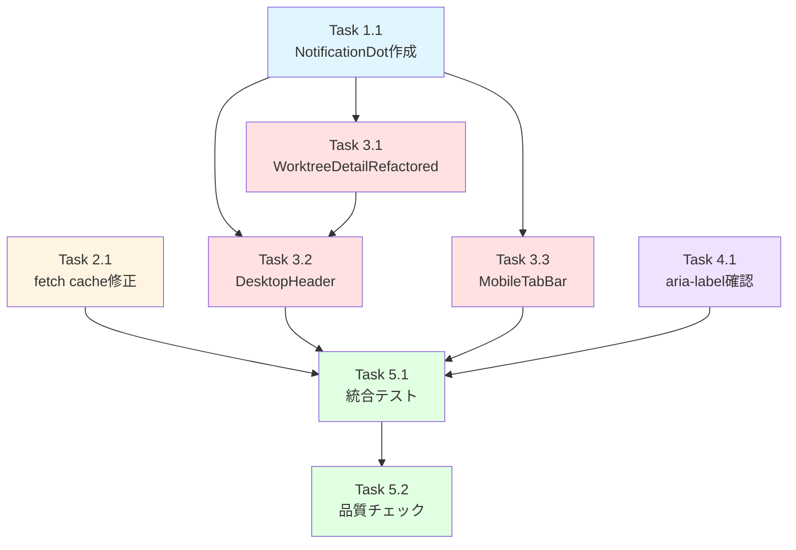

# 作業計画書: Issue #278

## Issue概要

**Issue番号**: #278
**タイトル**: fix(#257): fetch Data Cacheによりバージョンチェックが機能しない＋Info通知表示
**サイズ**: M（Medium）
**優先度**: Medium
**ラベル**: bug
**関連Issue**: #257（バージョンアップ通知機能）、#270（force-dynamic修正）

### 問題の概要

1. **バグ**: Next.jsのfetch Data CacheによりGitHub Releases APIのレスポンスが約1年間キャッシュされ、新バージョンが検出できない
2. **機能追加**: Infoボタン/タブにアップデート通知インジケーター（ドットバッジ）を表示し、ユーザーがモーダルを開かなくてもアップデートに気づける

### 設計レビュー結果

マルチステージ設計レビュー完了（全4ステージ承認）:
- Stage 1（設計原則）: 4/5 - Must Fix 1件対応済
- Stage 2（整合性）: 5/5
- Stage 3（影響分析）: 5/5
- Stage 4（セキュリティ）: 5/5

---

## 詳細タスク分解

### Phase 1: 共通コンポーネント実装（MF-001対応）

#### Task 1.1: NotificationDot共通コンポーネント作成

**目的**: ドットバッジの重複を防ぐDRY原則準拠の共通コンポーネント

**成果物**:
- `src/components/common/NotificationDot.tsx`
- `tests/unit/components/common/notification-dot.test.tsx`

**実装内容**:
```typescript
interface NotificationDotProps {
  /** テスト用ID */
  'data-testid'?: string;
  /** アクセシビリティラベル（セキュリティ注記: 必ずハードコード値を使用） */
  'aria-label'?: string;
  /** 追加CSSクラス（position調整用） */
  className?: string;
}
```

**実装チェックリスト**:
- [ ] インターフェース定義（Props: data-testid, aria-label, className）
- [ ] 基本スタイル: `w-2 h-2 rounded-full bg-blue-500`
- [ ] className propのJSDocにセキュリティ注記追加（SEC-SF-001）: 「ユーザー入力を使用しないこと」
- [ ] テストファイル作成（props渡し、className結合、aria-label検証）

**依存**: なし

**所要時間**: 30分

---

### Phase 2: バグ修正実装

#### Task 2.1: fetch Data Cache無効化

**目的**: GitHub API fetch呼び出しにcache: "no-store"を追加

**成果物**:
- `src/lib/version-checker.ts` (修正)
- `tests/unit/lib/version-checker.test.ts` (テスト追加)

**実装内容**:
```typescript
// L184-190 修正
const response = await fetch(GITHUB_API_URL, {
  headers: {
    'Accept': 'application/vnd.github+json',
    'User-Agent': `CommandMate/${getCurrentVersion()}`,
  },
  cache: 'no-store', // 追加
  signal: AbortSignal.timeout(FETCH_TIMEOUT_MS),
});
```

**実装チェックリスト**:
- [ ] fetch呼び出しに `cache: 'no-store'` を追加（L189）
- [ ] checkForUpdate()のJSDocに globalThis キャッシュの説明を追記（SF-002）
  - 「同一プロセス内での複数呼び出しは globalThis キャッシュ（1時間TTL）によりネットワーク負荷なし」
  - キャッシュの保持先（globalThis.__versionCheckCache）と無効化条件を記載
- [ ] テスト追加: `cache: 'no-store'` が fetch オプションに含まれることを検証（SEC-SF-002）
  - `expect.objectContaining({ cache: 'no-store' })` を使用

**依存**: なし

**所要時間**: 30分

---

### Phase 3: UI機能追加実装

#### Task 3.1: WorktreeDetailRefactored への useUpdateCheck 追加

**目的**: アップデート状態を取得し、DesktopHeader/MobileTabBarに伝搬

**成果物**:
- `src/components/worktree/WorktreeDetailRefactored.tsx` (修正)
- `tests/unit/components/WorktreeDetailRefactored.test.tsx` (テスト追加)

**実装内容**:
```typescript
// useUpdateCheck フック呼び出し追加（L900付近）
import { useUpdateCheck } from '@/hooks/useUpdateCheck';

// WorktreeDetailRefactored 内で呼び出し
const { data: updateCheckData } = useUpdateCheck();
const hasUpdate = updateCheckData?.hasUpdate ?? false;
```

**実装チェックリスト**:
- [ ] useUpdateCheck フック import
- [ ] hasUpdate 状態の取得（`data?.hasUpdate ?? false`）
- [ ] DesktopHeader への hasUpdate prop 伝搬（L1620付近）
- [ ] MobileTabBar への hasUpdate prop 伝搬（L1991付近）
- [ ] テスト追加（IMP-SF-001）:
  - useUpdateCheck を mock
  - hasUpdate: true の場合に info-update-indicator が表示されることを検証
  - hasUpdate: false の場合にインジケーターが表示されないことを検証

**依存**: Task 1.1（NotificationDot）

**所要時間**: 45分

---

#### Task 3.2: DesktopHeader への通知インジケーター追加

**目的**: Desktop版のInfoボタンにアップデートバッジを表示

**成果物**: `src/components/worktree/WorktreeDetailRefactored.tsx` (DesktopHeader部分修正)

**実装内容**:
```typescript
// DesktopHeaderProps に hasUpdate 追加（L411）
interface DesktopHeaderProps {
  // 既存props...
  hasUpdate?: boolean; // 追加
}

// Infoボタン修正（L550-571）
<button
  type="button"
  onClick={onInfoClick}
  className="flex items-center gap-1.5 px-3 py-1.5 text-gray-600 hover:text-gray-900 hover:bg-gray-100 rounded-lg transition-colors relative" // relative追加
  aria-label="View worktree information"
>
  {/* SVGアイコン */}
  <span className="text-sm font-medium">Info</span>
  {hasUpdate && (
    <NotificationDot
      data-testid="info-update-indicator"
      className="absolute top-0 right-0"
      aria-label="Update available"
    />
  )}
</button>
```

**実装チェックリスト**:
- [ ] DesktopHeaderProps に hasUpdate?: boolean を追加
- [ ] Infoボタンに `relative` class を追加（CONS-SF-001）
- [ ] NotificationDot を import
- [ ] hasUpdate && <NotificationDot /> の条件付きレンダリング
- [ ] data-testid="info-update-indicator" 設定

**依存**: Task 1.1（NotificationDot）、Task 3.1（useUpdateCheck追加）

**所要時間**: 30分

---

#### Task 3.3: MobileTabBar への通知インジケーター追加

**目的**: Mobile版のInfoタブにアップデートバッジを表示

**成果物**:
- `src/components/mobile/MobileTabBar.tsx` (修正)
- `tests/unit/components/mobile/mobile-tab-bar.test.tsx` (テスト追加)

**実装内容**:
```typescript
// MobileTabBarProps に hasUpdate 追加
export interface MobileTabBarProps {
  // 既存props...
  hasUpdate?: boolean; // 追加
}

// Infoタブのバッジ表示（L158-172）
{TABS.map((tab) => (
  <button key={tab.id} ...>
    {tab.icon}
    <span>{tab.label}</span>
    {tab.id === 'terminal' && renderBadges}
    {tab.id === 'info' && hasUpdate && (
      <NotificationDot
        data-testid="info-update-badge"
        className="absolute top-1 right-1"
        aria-label="Update available"
      />
    )}
  </button>
))}
```

**実装チェックリスト**:
- [ ] MobileTabBarProps に hasUpdate?: boolean を追加
- [ ] NotificationDot を import
- [ ] info タブに hasUpdate && <NotificationDot /> 追加
- [ ] data-testid="info-update-badge" 設定
- [ ] テスト追加:
  - hasUpdate: true の場合に info-update-badge が表示されることを検証
  - hasUpdate: false の場合にバッジが表示されないことを検証
  - hasUpdate 未指定（undefined）の場合にバッジが表示されないことを検証

**依存**: Task 1.1（NotificationDot）

**所要時間**: 30分

---

### Phase 4: aria-label言語方針の確認（SF-003対応）

#### Task 4.1: 既存aria-labelの言語方針確認

**目的**: 新規aria-labelが既存コードベースと一貫していることを確認

**実装チェックリスト**:
- [ ] BranchListItem.tsx の aria-label を確認（英語固定であることを確認）
- [ ] UpdateNotificationBanner.tsx の aria-label を確認
- [ ] その他 src/components/ 配下のaria-labelを確認
- [ ] 全体方針が英語固定であることを確認
- [ ] 一貫性に問題がある場合は設計方針を修正

**依存**: なし

**所要時間**: 15分

---

### Phase 5: 統合テストと品質チェック

#### Task 5.1: 統合テスト実行

**目的**: 全ての機能が統合された状態で正常動作することを確認

**テストシナリオ**:
1. **Desktop環境でのアップデート通知**:
   - useUpdateCheck mock で hasUpdate: true を返す
   - Desktop版 Infoボタンに青いドットが表示される
   - ドットをクリックしてInfoモーダルが開く
   - モーダル内にUpdateNotificationBannerが表示される

2. **Mobile環境でのアップデート通知**:
   - useUpdateCheck mock で hasUpdate: true を返す
   - Infoタブに青いドットが表示される
   - Infoタブをタップしてコンテンツが切り替わる
   - VersionSection内にUpdateNotificationBannerが表示される

3. **アップデートなしの場合**:
   - useUpdateCheck mock で hasUpdate: false を返す
   - Desktop InfoボタンにドットなしConfirming
   - Mobile Infoタブにドットなし

**実装チェックリスト**:
- [ ] Desktop環境テスト（hasUpdate: true/false）
- [ ] Mobile環境テスト（hasUpdate: true/false）
- [ ] NotificationDot単体テスト全パス
- [ ] version-checker.test.ts 全パス（cache検証含む）
- [ ] MobileTabBar.test.tsx 全パス（hasUpdate検証含む）
- [ ] WorktreeDetailRefactored.test.tsx 全パス（useUpdateCheck mock含む）

**依存**: すべての実装タスク完了

**所要時間**: 30分

---

#### Task 5.2: 品質チェック実行

**目的**: CI/CDパイプラインと同等の品質基準をクリア

**チェック項目**:
| チェック項目 | コマンド | 基準 |
|-------------|----------|------|
| TypeScript型チェック | `npx tsc --noEmit` | 型エラー0件 |
| ESLint | `npm run lint` | エラー0件 |
| 単体テスト | `npm run test:unit` | 全テストパス |
| ビルド | `npm run build` | 成功 |

**実装チェックリスト**:
- [ ] TypeScript型チェック pass
- [ ] ESLint pass
- [ ] 単体テスト pass（カバレッジ80%以上推奨）
- [ ] ビルド成功

**依存**: Task 5.1（統合テスト）

**所要時間**: 15分

---

## タスク依存関係図



---

## 実装順序の推奨

### 最適パス（並列実行可能な箇所を考慮）

1. **並列グループ1** (独立したタスク):
   - Task 1.1: NotificationDot作成
   - Task 2.1: fetch cache修正
   - Task 4.1: aria-label確認

2. **順次実行**:
   - Task 3.1: WorktreeDetailRefactored への useUpdateCheck 追加
   - Task 3.2: DesktopHeader 修正
   - Task 3.3: MobileTabBar 修正

3. **統合フェーズ**:
   - Task 5.1: 統合テスト
   - Task 5.2: 品質チェック

**総所要時間（見積）**: 約3.5時間

---

## 成果物チェックリスト

### コード

#### 新規作成
- [ ] `src/components/common/NotificationDot.tsx`

#### 修正
- [ ] `src/lib/version-checker.ts`
  - [ ] fetch に `cache: 'no-store'` 追加
  - [ ] checkForUpdate() JSDoc に globalThis キャッシュ説明追記
- [ ] `src/components/worktree/WorktreeDetailRefactored.tsx`
  - [ ] useUpdateCheck フック呼び出し
  - [ ] DesktopHeaderProps に hasUpdate 追加
  - [ ] DesktopHeader Infoボタンに `relative` class追加
  - [ ] DesktopHeader に NotificationDot追加
  - [ ] MobileTabBar への hasUpdate prop 伝搬
- [ ] `src/components/mobile/MobileTabBar.tsx`
  - [ ] MobileTabBarProps に hasUpdate 追加
  - [ ] info タブに NotificationDot追加

### テスト

#### 新規作成
- [ ] `tests/unit/components/common/notification-dot.test.tsx`

#### 修正/追加
- [ ] `tests/unit/lib/version-checker.test.ts`
  - [ ] `cache: 'no-store'` 検証テスト追加
- [ ] `tests/unit/components/mobile/mobile-tab-bar.test.tsx`
  - [ ] hasUpdate インジケーターテスト追加
- [ ] `tests/unit/components/WorktreeDetailRefactored.test.tsx`
  - [ ] useUpdateCheck mock 追加
  - [ ] DesktopHeader バッジテスト追加

### ドキュメント

- [ ] README更新（必要な場合）
- [ ] dev-reports/issue/278/ 配下のドキュメント整備

---

## Definition of Done

Issue #278 完了条件：

### 機能要件
- [ ] fetch に `cache: "no-store"` が指定されている
- [ ] アップデート対象バージョンが存在する場合、Desktop Infoボタンに通知インジケーターが表示される
- [ ] アップデート対象バージョンが存在する場合、Mobile Infoタブに通知インジケーターが表示される
- [ ] アップデートがない場合には通知インジケーターが表示されない

### コード品質
- [ ] TypeScript型エラー0件（`npx tsc --noEmit`）
- [ ] ESLintエラー0件（`npm run lint`）
- [ ] 単体テスト全パス（`npm run test:unit`）
- [ ] 単体テストカバレッジ80%以上（推奨）
- [ ] ビルド成功（`npm run build`）

### レビュー指摘対応
- [ ] MF-001: NotificationDot共通コンポーネント作成完了
- [ ] SF-002: checkForUpdate() JSDocにglobalThisキャッシュ説明追記
- [ ] SF-003: aria-labelの言語方針が既存コードベースと一貫
- [ ] CONS-SF-001: DesktopHeader Infoボタンに`relative` class追加
- [ ] IMP-SF-001: WorktreeDetailRefactored.test.tsxにDesktopHeaderバッジテスト追加
- [ ] SEC-SF-001: NotificationDot className propのJSDocにセキュリティ注記追加
- [ ] SEC-SF-002: version-checker.test.tsに`cache: 'no-store'`検証テスト追加

### ドキュメント
- [ ] 設計方針書完成（`dev-reports/design/issue-278-*-design-policy.md`）
- [ ] マルチステージレビュー完了（`dev-reports/issue/278/multi-stage-design-review/summary-report.md`）
- [ ] 作業計画書完成（本ファイル）
- [ ] README更新（必要な場合）

---

## 次のアクション

作業計画承認後：

1. **実装開始**:
   - 現在のブランチ: `feature/278-worktree`
   - Task 1.1, 2.1, 4.1 を並列で実装開始
   - 順次 Task 3.1 → 3.2 → 3.3 を実装

2. **進捗報告**:
   - `/progress-report 278` で定期報告

3. **TDD実装**:
   - `/pm-auto-dev 278` でTDD自動開発フロー実行

4. **PR作成**:
   - `/create-pr` で自動PR作成

---

## リスク管理

### 技術的リスク

| リスク | 影響度 | 対策 |
|--------|-------|------|
| useUpdateCheck の二重呼び出しによるパフォーマンス懸念 | Low | globalThis キャッシュで吸収。JSDocドキュメント化で誤認防止 |
| WorktreeDetailRefactored.test.tsx の既存テスト互換性 | Medium | useUpdateCheck mock 追加時に既存テストを確認 |
| DesktopHeader の relative class 追加忘れ | Medium | チェックリストで明示化、レビュー時に重点確認 |

### セキュリティリスク

| リスク | 影響度 | 対策 |
|--------|-------|------|
| NotificationDot className へのユーザー入力混入 | Low | JSDocで警告、社内コードレビューで確認 |
| cache: 'no-store' の回帰 | Low | テストで検証、CI/CDで自動チェック |

---

## 参考資料

- **Issue #278**: https://github.com/Kewton/CommandMate/issues/278
- **設計方針書**: `dev-reports/design/issue-278-fetch-cache-fix-and-update-indicator-design-policy.md`
- **マルチステージレビュー**: `dev-reports/issue/278/multi-stage-design-review/summary-report.md`
- **関連Issue**:
  - Issue #257: バージョンアップ通知機能
  - Issue #270: force-dynamic修正
