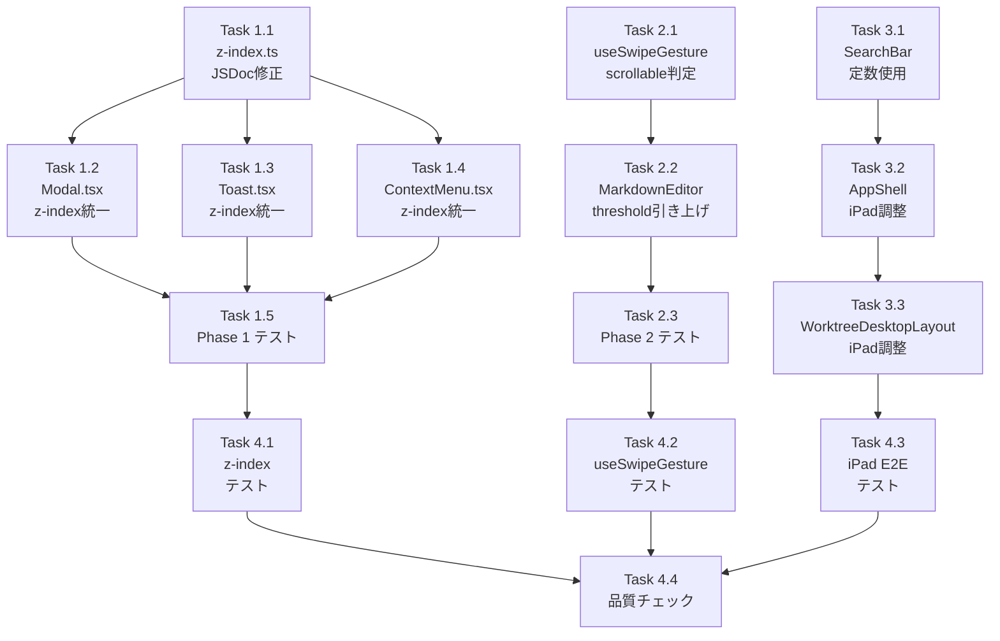

# 作業計画書: Issue #299 iPad/スマホ レイアウト崩れ・全画面表示不具合修正

## Issue概要

**Issue番号**: #299
**タイトル**: レイアウトが崩れる
**ラベル**: bug
**サイズ**: L（4症状、複数コンポーネント、設計レビュー4段階完了）
**優先度**: High（全画面白画面は致命的なUI破損）
**依存Issue**: #104（iOS全画面表示対応、Portal機構の導入元）

### 症状と対応方針

| # | 症状 | 原因 | 対策 |
|---|------|------|------|
| 1 | iPad: トップ画面レイアウト崩れ | デスクトップレイアウトがiPad最適化不足 | CSS調整（Phase 3） |
| 2 | iPad: Markdown表示崩れ | 同上 | CSS調整（Phase 3） |
| 3 | iPad: 全画面時に真っ白 | Modal z-[9999] > MAXIMIZED_EDITOR z-55 | z-index統一（Phase 1） |
| 4 | スマホ: スクロールで全画面解除 | スクロールとスワイプ判定の混同 | scrollable判定追加（Phase 2） |

---

## 詳細タスク分解

### Phase 1: z-index体系統一（症状3解決） 優先度: 最高

#### Task 1.1: `src/config/z-index.ts` JSDocコメント修正
- **成果物**: `src/config/z-index.ts`（修正）
- **依存**: なし
- **変更内容**:
  - L17のJSDocコメント「Modal dialogs (9999)」→「Modal dialogs (50)」
  - Layer番号を繰り上げ（MAXIMIZED_EDITOR=Layer5, Toast=Layer6, ContextMenu=Layer7）
  - MAXIMIZED_EDITORのコメント確認（変更不要 - 確認済み）
- **リスク**: 低（コメント修正のみ）

#### Task 1.2: `src/components/ui/Modal.tsx` z-index統一
- **成果物**: `src/components/ui/Modal.tsx`（修正）
- **依存**: Task 1.1
- **変更内容**:
  - `"fixed inset-0 z-[9999] overflow-y-auto"` → `"fixed inset-0 overflow-y-auto"` + `style={{ zIndex: Z_INDEX.MODAL }}`
  - `Z_INDEX` のimport追加
- **リスク**: 高（8箇所のModal利用コンポーネントへの波及）
- **検証**: createPortal DOM順序でz-50コンポーネントより上に表示されることを確認

#### Task 1.3: `src/components/common/Toast.tsx` z-index統一
- **成果物**: `src/components/common/Toast.tsx`（修正）
- **依存**: Task 1.1
- **変更内容**:
  - L205の`z-50` → `style={{ zIndex: Z_INDEX.TOAST }}` (Z_INDEX.TOAST=60)
  - `Z_INDEX` のimport追加
- **リスク**: 低（Toastは独立したUI要素）

#### Task 1.4: `src/components/worktree/ContextMenu.tsx` z-index統一
- **成果物**: `src/components/worktree/ContextMenu.tsx`（修正）
- **依存**: Task 1.1
- **変更内容**:
  - L228の`z-50` → `style={{ zIndex: Z_INDEX.CONTEXT_MENU }}` (Z_INDEX.CONTEXT_MENU=70)
  - `Z_INDEX` のimport追加
- **リスク**: 低（相互排他的UIのため競合なし）

#### Task 1.5: Phase 1 テスト
- **成果物**: `tests/unit/config/z-index.test.ts`（新規）
- **依存**: Task 1.1〜1.4
- **変更内容**:
  - Z_INDEX定数の順序テスト（`MODAL < MAXIMIZED_EDITOR < TOAST < CONTEXT_MENU`）
  - Modal利用コンポーネントの表示確認（既存テストの回帰確認）

---

### Phase 2: スワイプ/スクロール分離（症状4解決） 優先度: 高

#### Task 2.1: `src/hooks/useSwipeGesture.ts` scrollable判定追加
- **成果物**: `src/hooks/useSwipeGesture.ts`（修正）
- **依存**: なし
- **変更内容**:
  - `isInsideScrollableElement(element: HTMLElement): boolean` ヘルパー関数追加（モジュール内部・export不要）
  - `handleTouchStart`に`event.target instanceof HTMLElement`型ガード追加
  - scrollable要素内ではtouchStartRef.currentをnullに設定してスワイプ検出を抑制
- **リスク**: 低（MarkdownEditorのみが依存）
- **実装例**:
  ```typescript
  function isInsideScrollableElement(element: HTMLElement): boolean {
    let current: HTMLElement | null = element;
    while (current) {
      const { overflowY } = getComputedStyle(current);
      if (
        (overflowY === 'auto' || overflowY === 'scroll') &&
        current.scrollHeight > current.clientHeight
      ) {
        return true;
      }
      current = current.parentElement;
    }
    return false;
  }
  ```

#### Task 2.2: `src/components/worktree/MarkdownEditor.tsx` threshold引き上げ
- **成果物**: `src/components/worktree/MarkdownEditor.tsx`（修正）
- **依存**: Task 2.1
- **変更内容**:
  - `useSwipeGesture`の`threshold: 100` → `threshold: 150`
- **リスク**: 低（補助的変更）

#### Task 2.3: Phase 2 テスト
- **成果物**: `tests/unit/hooks/useSwipeGesture.test.ts`（既存更新）
- **依存**: Task 2.1, 2.2
- **変更内容**:
  - scrollable要素内でのスワイプ抑制テスト追加
  - jsdomでの`getComputedStyle`/`scrollHeight`モック実装
  - `enabled: false`時の動作テスト確認

---

### Phase 3: iPadレスポンシブ対応（症状1・2解決） 優先度: 中

#### Task 3.1: `src/components/worktree/SearchBar.tsx` MOBILE_BREAKPOINT定数使用
- **成果物**: `src/components/worktree/SearchBar.tsx`（修正）
- **依存**: なし
- **変更内容**:
  - L158の`window.innerWidth < 768` → `window.innerWidth < MOBILE_BREAKPOINT`
  - `MOBILE_BREAKPOINT` のimport追加（from `@/hooks/useIsMobile`）
- **リスク**: 低（値は同一768px、autofocus制御のみ）

#### Task 3.2: iPad横置き時レイアウト調査・調整
- **成果物**: `src/components/layout/AppShell.tsx`（必要に応じて修正）
- **依存**: なし
- **変更内容**（調査後判断）:
  - iPad横置き(1024px)でサイドバー(w-72=288px)がコンテンツを圧迫しないか確認
  - `md:pl-72`のpadding-leftがiPad横置きで適切か確認
  - 必要に応じてiPad向けサイドバー幅調整またはレイアウト修正
- **リスク**: 中（未知の範囲）

#### Task 3.3: WorktreeDesktopLayout iPad向け調整
- **成果物**: `src/components/worktree/WorktreeDesktopLayout.tsx`（必要に応じて修正）
- **依存**: Task 3.2
- **変更内容**（調査後判断）:
  - iPad portrait(768px)でコンテンツ幅480px、最小ペイン幅96pxの実用性確認
  - 必要に応じてiPad向け最小幅調整
- **リスク**: 中（未知の範囲）

---

### Phase 4: テスト強化

#### Task 4.1: z-index順序ユニットテスト
- **成果物**: `tests/unit/config/z-index.test.ts`（新規）
- **依存**: Phase 1完了
- **内容**:
  - `MODAL < MAXIMIZED_EDITOR`の順序テスト
  - 各定数値の正確性テスト

#### Task 4.2: useSwipeGestureテスト更新
- **成果物**: `tests/unit/hooks/useSwipeGesture.test.ts`（更新）
- **依存**: Phase 2完了
- **内容**:
  - scrollable要素内でのスワイプ抑制テスト
  - threshold=150での動作テスト

#### Task 4.3: iPad viewport E2Eテスト
- **成果物**: `tests/e2e/ipad-layout.spec.ts`（新規）または既存e2eテストの更新
- **依存**: Phase 1〜3完了
- **内容**:
  - iPad viewport(768px/1024px)でのレイアウト確認
  - Playwright device emulation使用
  - 全画面表示が白画面にならないことの確認

#### Task 4.4: 品質チェック実行
- **依存**: Task 4.1〜4.3
- **コマンド**:
  ```bash
  npm run lint
  npx tsc --noEmit
  npm run test:unit
  npm run build
  ```

---

## タスク依存関係



---

## 品質チェック項目

| チェック項目 | コマンド | 基準 |
|-------------|----------|------|
| ESLint | `npm run lint` | エラー0件 |
| TypeScript | `npx tsc --noEmit` | 型エラー0件 |
| Unit Test | `npm run test:unit` | 全テストパス |
| Build | `npm run build` | 成功 |

---

## 成果物チェックリスト

### Phase 1: z-index体系統一
- [ ] `src/config/z-index.ts` JSDocコメント修正
- [ ] `src/components/ui/Modal.tsx` z-[9999] → Z_INDEX.MODAL
- [ ] `src/components/common/Toast.tsx` z-50 → Z_INDEX.TOAST
- [ ] `src/components/worktree/ContextMenu.tsx` z-50 → Z_INDEX.CONTEXT_MENU
- [ ] `tests/unit/config/z-index.test.ts` 新規作成

### Phase 2: スワイプ/スクロール分離
- [ ] `src/hooks/useSwipeGesture.ts` isInsideScrollableElement追加
- [ ] `src/components/worktree/MarkdownEditor.tsx` threshold 150
- [ ] `tests/unit/hooks/useSwipeGesture.test.ts` テスト追加

### Phase 3: iPadレスポンシブ対応
- [ ] `src/components/worktree/SearchBar.tsx` MOBILE_BREAKPOINT定数使用
- [ ] `src/components/layout/AppShell.tsx` iPad確認・調整
- [ ] `src/components/worktree/WorktreeDesktopLayout.tsx` iPad確認・調整

### Phase 4: テスト
- [ ] `tests/unit/config/z-index.test.ts` 順序テスト
- [ ] `tests/unit/hooks/useSwipeGesture.test.ts` 更新
- [ ] `tests/e2e/ipad-layout.spec.ts` または既存E2Eテスト更新
- [ ] `npm run lint` 通過
- [ ] `npx tsc --noEmit` 通過
- [ ] `npm run test:unit` 全パス
- [ ] `npm run build` 成功

---

## Definition of Done

- [ ] 症状3（白画面）が修正されている（z-index統一完了）
- [ ] 症状4（スクロールで全画面解除）が修正されている（scrollable判定追加完了）
- [ ] 症状1・2（iPadレイアウト崩れ）の調査・修正完了
- [ ] 既存のデスクトップレイアウトにリグレッションがない
- [ ] 既存のモバイルレイアウトにリグレッションがない
- [ ] 全ユニットテストがパス
- [ ] TypeScript型エラー0件
- [ ] ESLintエラー0件
- [ ] ビルド成功

---

## 手動テスト項目

- [ ] iPad Chrome横置きでWorktree一覧のレイアウトが正常
- [ ] iPad Chrome縦置きでWorktree一覧のレイアウトが正常
- [ ] iPad ChromeでMarkdownエディタ全画面表示が白画面にならない
- [ ] スマホChrome全画面中コンテンツスクロールで全画面が解除されない
- [ ] iPad全画面エディタ+仮想キーボード表示時に正常動作

---

## リスク管理

| リスク | 可能性 | 影響 | 対策 |
|--------|--------|------|------|
| Modal z-index変更でのUI破損 | 中 | 高 | Task 1.5で全Modal利用箇所の回帰テスト |
| AppShell/WorktreeDesktopLayout調整でデスクトップ崩れ | 低 | 高 | Task 3調査後にスコープ判断 |
| iPad実機での動作未確認 | 高 | 中 | E2Eテストで可能な限り網羅 |

---

## 次のアクション

1. **作業開始**: Phase 1から順次実装
2. **進捗報告**: `/progress-report` で定期報告
3. **PR作成**: `/create-pr` で自動作成

---

*Generated by /work-plan command for Issue #299*
*Date: 2026-02-18*
*Based on design policy: dev-reports/design/issue-299-ipad-layout-fix-design-policy.md*
