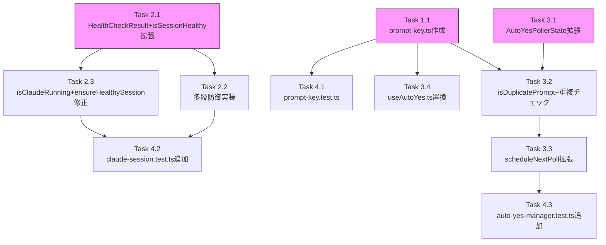

# Issue #306 作業計画

## Issue: fix: Auto-Yes Pollerの重複応答によりtmuxセッションが定期的に削除される

**Issue番号**: #306
**サイズ**: M
**優先度**: High（セッション安定性に直接影響）
**依存Issue**: なし
**ラベル**: bug

---

## 設計方針書

`dev-reports/design/issue-306-session-stability-design-policy.md`

---

## 詳細タスク分解

### Phase 1: 共通ユーティリティ作成

#### Task 1.1: promptKey共通ユーティリティ作成（新規）
- **成果物**: `src/lib/prompt-key.ts`
- **依存**: なし
- **内容**:
  - `generatePromptKey(promptData: { type: string; question: string }): string` を実装
  - JSDocに「インメモリ比較専用。ログ出力・永続化不可」の制限を明記（SEC: S4-F001）
- **テスト**: `tests/unit/lib/prompt-key.test.ts` を新規作成

---

### Phase 2: ヘルスチェック改善（対策1・4）

#### Task 2.1: HealthCheckResult interface定義 + isSessionHealthy()戻り値拡張（対策4）
- **成果物**: `src/lib/claude-session.ts`
- **依存**: なし（Phase 1と並行可）
- **内容**:
  ```typescript
  /** @internal Exported for testing purposes only. */
  export interface HealthCheckResult {
    healthy: boolean;
    reason?: string;
  }
  ```
  - `isSessionHealthy()` を `@internal` exportに変更、戻り値を `Promise<HealthCheckResult>` に拡張
  - **全returnパスをHealthCheckResult形式に変更**:
    - `return false` → `return { healthy: false, reason: 'empty output' }`
    - エラーパターン一致 → `return { healthy: false, reason: 'error pattern: ...' }`
    - SHELL_PROMPT_ENDINGS一致 → `return { healthy: false, reason: 'shell prompt ending detected: ...' }`
    - catchブロック → `return { healthy: false, reason: 'capture error' }`（S3-F001対応）
    - 正常 → `return { healthy: true }`

#### Task 2.2: SHELL_PROMPT_ENDINGS多段防御実装（対策1）
- **成果物**: `src/lib/claude-session.ts`（Task 2.1と同ファイル）
- **依存**: Task 2.1（HealthCheckResult形式を使用）
- **内容**:
  - 空行フィルタリング後の最終行抽出
  - **第1段階（早期リターン）**: `lastLine.length >= MAX_SHELL_PROMPT_LENGTH(40)` → `{ healthy: true }` （F006対応: 行長チェックを先に配置）
  - **第2段階**: `SHELL_PROMPT_ENDINGS.some()` + `%` の `N%` パターン個別除外

#### Task 2.3: isClaudeRunning() + ensureHealthySession()の修正（対策4続き）
- **成果物**: `src/lib/claude-session.ts`
- **依存**: Task 2.1
- **内容**:
  - `isClaudeRunning()`: `const result = await isSessionHealthy(sessionName)` → `return result.healthy` （S2-F001: await追加）
  - `ensureHealthySession()`: `result.healthy` チェック + `console.warn` でreason出力

---

### Phase 3: 重複応答防止 + クールダウン（対策2・5）

#### Task 3.1: AutoYesPollerStateへのlastAnsweredPromptKey追加（対策2）
- **成果物**: `src/lib/auto-yes-manager.ts`
- **依存**: Task 1.1（generatePromptKey使用）
- **内容**:
  ```typescript
  export interface AutoYesPollerState {
    // ...既存フィールド...
    lastAnsweredPromptKey: string | null;  // 追加
  }
  ```
  - `startAutoYesPolling()` の初期化コードに `lastAnsweredPromptKey: null` を追加

#### Task 3.2: isDuplicatePrompt()ヘルパー + 重複チェックロジック実装（対策2）
- **成果物**: `src/lib/auto-yes-manager.ts`
- **依存**: Task 3.1
- **内容**:
  ```typescript
  function isDuplicatePrompt(pollerState: AutoYesPollerState, promptKey: string): boolean {
    return pollerState.lastAnsweredPromptKey === promptKey;
  }
  ```
  - `pollAutoYes()` にプロンプト非検出時の `lastAnsweredPromptKey = null` リセットを追加
  - プロンプト検出後に `isDuplicatePrompt()` で重複チェック → 重複時はスキップ
  - 応答送信後に `lastAnsweredPromptKey = promptKey` を記録

#### Task 3.3: scheduleNextPoll()クールダウン対応（対策5）
- **成果物**: `src/lib/auto-yes-manager.ts`
- **依存**: Task 3.2
- **内容**:
  ```typescript
  export const COOLDOWN_INTERVAL_MS = 5000;
  ```
  - `scheduleNextPoll()` に `overrideInterval?: number` パラメータを追加
  - `Math.max(overrideInterval ?? pollerState.currentInterval, POLLING_INTERVAL_MS)` で下限値ガード（S4-F003）
  - 応答送信成功後: `scheduleNextPoll(worktreeId, cliToolId, COOLDOWN_INTERVAL_MS); return;`（early return）

#### Task 3.4: useAutoYes.tsのgeneratePromptKey置換（対策2: DRY）
- **成果物**: `src/hooks/useAutoYes.ts`
- **依存**: Task 1.1
- **内容**:
  - `const promptKey = \`${promptData.type}:${promptData.question}\`` を `generatePromptKey(promptData)` に置換
  - `import { generatePromptKey } from '@/lib/prompt-key'` を追加

---

### Phase 4: テスト追加

#### Task 4.1: prompt-key.test.ts作成
- **成果物**: `tests/unit/lib/prompt-key.test.ts`（新規）
- **依存**: Task 1.1
- **内容**:
  - `generatePromptKey()` の基本動作テスト
  - 異なるpromptDataで異なるキーが生成されることの検証

#### Task 4.2: claude-session.test.tsへのテスト追加
- **成果物**: `tests/unit/lib/claude-session.test.ts`（既存に追加）
- **依存**: Task 2.1, 2.2, 2.3
- **追加テスト**:
  ```
  isSessionHealthy - false positive prevention:
  - 'Context left until auto-compact: 7%' を健全と判定（%の偽陽性防止）
  - 'Context left until auto-compact: 100%' を健全と判定
  - 短いzshプロンプト（user@host%）を不健全と判定
  - 40文字以上の$終端行を健全と判定（行長チェック）
  - 40文字以上の#終端行を健全と判定
  - 末尾空行のフィルタリング
  - 39文字/$終端行を不健全（境界値 - F004）
  - 40文字/$終端行を健全（境界値丁度 - F004）
  - 行長チェックがSHELL_PROMPT_ENDINGS判定の前に実行されることの検証（F006）

  isSessionHealthy - reason reporting:
  - error pattern検出時のreason: "error pattern: ..."
  - shell prompt ending検出時のreason: "shell prompt ending detected: ..."
  - empty output時のreason: "empty output"
  - capturePane例外時のreason: "capture error"（S3-F001）
  - 健全セッションのreason: undefined
  ```

#### Task 4.3: auto-yes-manager.test.tsへのテスト追加
- **成果物**: `tests/unit/lib/auto-yes-manager.test.ts`（既存に追加）
- **依存**: Task 3.1, 3.2, 3.3
- **追加テスト**:
  ```
  pollAutoYes - duplicate prevention:
  - 同一promptKeyで2回目は送信しない
  - プロンプト非検出時にlastAnsweredPromptKeyをnullリセット
  - リセット後の新しいプロンプトには応答する
  - 非検出フェーズなしの連続同一promptKeyでスキップ（F009エッジケース）

  pollAutoYes - cooldown:
  - 応答成功後はCOOLDOWN_INTERVAL_MS(5000)で次回ポーリング
  - プロンプト非検出時はPOLLING_INTERVAL_MSで次回ポーリング
  - overrideInterval=0は下限値POLLING_INTERVAL_MSにクランプ（S4-F003）

  startAutoYesPolling - initialization:
  - lastAnsweredPromptKey: nullで初期化される
  ```
- **既存テスト影響**: `vi.advanceTimersByTimeAsync(POLLING_INTERVAL_MS + 100)` は初回ポーリングテストのため修正不要

---

## タスク依存関係



**並行可能**:
- Task 1.1（prompt-key.ts）と Task 2.1-2.3（claude-session.ts）は独立して並行実施可
- Task 1.1完了後、Task 3.x と Task 4.1 を並行実施可

**実装推奨順序**（TDD準拠）:
1. Task 1.1 → Task 4.1（prompt-key: Red→Green）
2. Task 2.1 → Task 2.2 → Task 2.3 → Task 4.2（claude-session: Red→Green）
3. Task 3.1 → Task 3.2 → Task 3.3 → Task 4.3（auto-yes-manager: Red→Green）
4. Task 3.4（useAutoYes: 置換）

---

## 品質チェック項目

| チェック項目 | コマンド | 基準 |
|-------------|----------|------|
| TypeScript | `npx tsc --noEmit` | 型エラー0件 |
| ESLint | `npm run lint` | エラー0件 |
| Unit Test | `npm run test:unit` | 全テストパス |
| Build | `npm run build` | 成功 |

---

## 成果物チェックリスト

### コード（新規）
- [ ] `src/lib/prompt-key.ts`（generatePromptKey共通ユーティリティ）

### コード（変更）
- [ ] `src/lib/claude-session.ts`（HealthCheckResult、多段防御、isClaudeRunning修正）
- [ ] `src/lib/auto-yes-manager.ts`（lastAnsweredPromptKey、isDuplicatePrompt、クールダウン）
- [ ] `src/hooks/useAutoYes.ts`（generatePromptKey置換）

### テスト（新規）
- [ ] `tests/unit/lib/prompt-key.test.ts`

### テスト（追加）
- [ ] `tests/unit/lib/claude-session.test.ts`（偽陽性防止テスト、reason検証テスト）
- [ ] `tests/unit/lib/auto-yes-manager.test.ts`（重複防止テスト、クールダウンテスト）

---

## Definition of Done

- [ ] Task 1.1〜3.4 全タスク実装完了
- [ ] Task 4.1〜4.3 全テスト追加・パス確認
- [ ] `npx tsc --noEmit` でエラー0件
- [ ] `npm run lint` でエラー0件
- [ ] `npm run test:unit` で全テストパス
- [ ] `npm run build` 成功
- [ ] 受入条件確認:
  - [ ] `Context left until auto-compact: N%` がシェルプロンプトと誤判定されない
  - [ ] サーバー側Auto-Yes Pollerが同一プロンプトに1回のみ応答
  - [ ] 応答送信後にクールダウン期間（5秒）が適用される
  - [ ] ヘルスチェックによるセッションkill時にreason付きログが出力される
  - [ ] 既存Auto-Yesテストが全てパス

---

## 次のアクション

1. **TDD実装開始**: `/pm-auto-dev 306`
2. **進捗確認**: `/progress-report`
3. **完了後PR作成**: `/create-pr`
