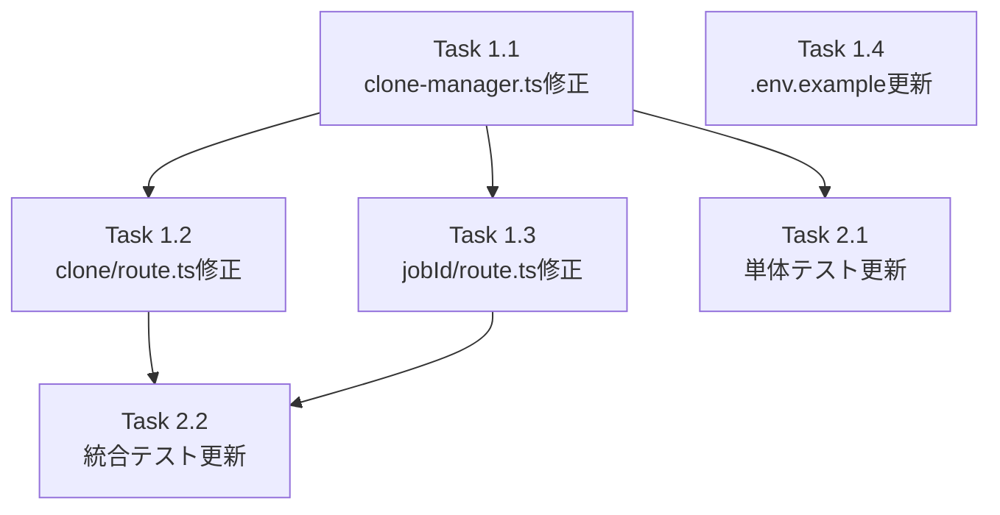

# 作業計画書: Issue #308

## Issue: git clone時のディレクトリがおかしい
**Issue番号**: #308
**ラベル**: bug
**サイズ**: S
**優先度**: High
**依存Issue**: なし

---

## 概要

`CloneManager`が`basePath`未設定時に`/tmp/repos`にハードコードされているため、`.env`の`CM_ROOT_DIR`が無視されてしまう。clone APIルートが`new CloneManager(db)`と呼んで`basePath`を渡していないのが根本原因。`getEnv().CM_ROOT_DIR`をAPIルートから注入し、デフォルト値を`process.cwd()`に変更することで修正する。

---

## 詳細タスク分解

### Phase 1: コア実装（必須修正）

#### Task 1.1: `src/lib/clone-manager.ts` の修正
- **成果物**: `src/lib/clone-manager.ts`
- **変更内容**:
  1. クラス定義の直前（L183の前）にモジュールスコープ変数を追加:
     ```typescript
     let warnedWorktreeBasePath = false;
     ```
  2. コンストラクタのbasePath決定ロジックをリファクタ:
     ```typescript
     basePath: config.basePath || this.resolveDefaultBasePath(),
     ```
  3. `resolveDefaultBasePath()` privateメソッドを追加:
     ```typescript
     private resolveDefaultBasePath(): string {
       const worktreeBasePath = process.env.WORKTREE_BASE_PATH;
       if (worktreeBasePath) {
         if (!warnedWorktreeBasePath) {
           console.warn(
             '[DEPRECATED] WORKTREE_BASE_PATH is deprecated. Set CM_ROOT_DIR in your .env file instead.'
           );
           warnedWorktreeBasePath = true;
         }
         return path.resolve(worktreeBasePath); // [D1-007] 絶対パス正規化
       }
       return process.cwd();
     }
     ```
  4. テスト用エクスポート関数を追加（クラス定義の外、ファイル末尾）:
     ```typescript
     /** @internal テスト専用。本番コードから呼び出さないこと。 */
     export function resetWorktreeBasePathWarning(): void {
       warnedWorktreeBasePath = false;
     }
     ```
  5. **[D4-001]** L307-308のエラーメッセージからbasePath値を除去:
     ```typescript
     // Before
     error: {
       ...ERROR_DEFINITIONS.INVALID_TARGET_PATH,
       message: `Target path must be within ${this.config.basePath}`,
     }
     // After
     error: ERROR_DEFINITIONS.INVALID_TARGET_PATH
     ```
  6. **[D4-003]** L319のエラーメッセージからtargetPathの完全パスを除去:
     ```typescript
     // Before
     error: {
       ...ERROR_DEFINITIONS.DIRECTORY_EXISTS,
       message: `Target directory already exists: ${targetPath}`,
     }
     // After
     error: ERROR_DEFINITIONS.DIRECTORY_EXISTS
     ```
- **依存**: なし

#### Task 1.2: `src/app/api/repositories/clone/route.ts` の修正
- **成果物**: `src/app/api/repositories/clone/route.ts`
- **変更内容**:
  1. importに`getEnv`を追加:
     ```typescript
     import { getEnv } from '@/lib/env';
     ```
  2. CloneManager初期化前に`CM_ROOT_DIR`を取得:
     ```typescript
     // [D2-001] getEnv().CM_ROOT_DIRはenv.ts L234でpath.resolve()適用済み。追加のpath.resolve()は不要。
     const { CM_ROOT_DIR } = getEnv();
     ```
  3. **[D4-002]** `targetDir`の型検証を`startCloneJob()`呼び出しの前に追加:
     ```typescript
     if (targetDir !== undefined && typeof targetDir !== 'string') {
       return NextResponse.json(
         {
           success: false,
           error: {
             category: 'validation',
             code: 'INVALID_TARGET_PATH',
             message: 'targetDir must be a string',
             recoverable: true,
             suggestedAction: 'Provide a valid string path for targetDir',
           },
         },
         { status: 400 }
       );
     }
     ```
  4. CloneManager初期化にbasePath渡し:
     ```typescript
     const cloneManager = new CloneManager(db, { basePath: CM_ROOT_DIR });
     ```
- **依存**: Task 1.1

#### Task 1.3: `src/app/api/repositories/clone/[jobId]/route.ts` の修正（必須）
- **成果物**: `src/app/api/repositories/clone/[jobId]/route.ts`
- **変更内容**:
  1. importに`getEnv`を追加:
     ```typescript
     import { getEnv } from '@/lib/env';
     ```
  2. CloneManager初期化前に`CM_ROOT_DIR`を取得しbasePath渡し:
     ```typescript
     const { CM_ROOT_DIR } = getEnv();
     const cloneManager = new CloneManager(db, { basePath: CM_ROOT_DIR });
     ```
  > **注意**: `getCloneJobStatus()`は`this.config.basePath`を一切参照しない。この変更は`WORKTREE_BASE_PATH`設定時に不要な非推奨警告が出力される副作用防止とコード一貫性のため。
- **依存**: Task 1.1

#### Task 1.4: `.env.example` の更新
- **成果物**: `.env.example`
- **変更内容**:
  ```diff
  -# Root directory for worktree scanning
  -# This is the base directory that contains your git worktrees
  +# Root directory for worktree scanning and git clone
  +# This is the base directory that contains your git worktrees
  +# Cloned repositories will also be saved under this directory
   CM_ROOT_DIR=/path/to/your/worktrees
  ```
- **依存**: なし

---

### Phase 2: テスト更新

#### Task 2.1: `tests/unit/lib/clone-manager.test.ts` の更新
- **成果物**: `tests/unit/lib/clone-manager.test.ts`
- **変更内容**:
  1. importに`resetWorktreeBasePathWarning`を追加:
     ```typescript
     import { CloneManager, CloneManagerError, CloneResult, resetWorktreeBasePathWarning } from '@/lib/clone-manager';
     ```
  2. `beforeEach`に環境変数クリアとリセット処理を追加:
     ```typescript
     beforeEach(() => {
       db = new Database(':memory:');
       runMigrations(db);
       cloneManager = new CloneManager(db);  // 既存: basePath未指定 → process.cwd()がデフォルト
       vi.clearAllMocks();
       delete process.env.WORKTREE_BASE_PATH;   // [D2-005] 環境変数リーク防止
       resetWorktreeBasePathWarning();           // 非推奨警告状態リセット
     });
     ```
  3. **[D2-011]** 既存テスト（L208-225付近）を修正 — 方針Aを採用:
     - `should use custom target path if provided (within basePath)` テストで、basePath未指定の`new CloneManager(db)`を使っている箇所を`new CloneManager(db, { basePath: '/tmp/repos' })`に変更
     - これによりprocess.cwd()変更の影響を受けない
  4. 新規テストケースを追加（`describe('basePath resolution')` ブロック）:

     ```typescript
     describe('basePath resolution', () => {
       it('should use config.basePath when provided', () => {
         const manager = new CloneManager(db, { basePath: '/explicit/base' });
         // basePath確認（private fieldのため間接的に検証 or getTargetPath経由）
       });

       it('should use WORKTREE_BASE_PATH when config.basePath not set', () => {
         process.env.WORKTREE_BASE_PATH = '/tmp/worktree-base';
         const manager = new CloneManager(db);
         // basePath = '/tmp/worktree-base' になることを検証
       });

       it('should normalize WORKTREE_BASE_PATH with path.resolve()', () => {
         process.env.WORKTREE_BASE_PATH = 'relative/path';
         const manager = new CloneManager(db);
         // basePath が絶対パスになることを検証（D1-007）
       });

       it('should fallback to process.cwd() when neither is set', () => {
         const cwdSpy = vi.spyOn(process, 'cwd').mockReturnValue('/test/base');
         const manager = new CloneManager(db);
         // basePath = '/test/base' になることを検証
         cwdSpy.mockRestore();
       });

       it('should output deprecation warning only once for WORKTREE_BASE_PATH', () => {
         process.env.WORKTREE_BASE_PATH = '/tmp/worktree-base';
         const warnSpy = vi.spyOn(console, 'warn');
         new CloneManager(db); // 1回目
         new CloneManager(db); // 2回目
         expect(warnSpy).toHaveBeenCalledTimes(1);
         expect(warnSpy).toHaveBeenCalledWith(
           '[DEPRECATED] WORKTREE_BASE_PATH is deprecated. Set CM_ROOT_DIR in your .env file instead.'
         );
       });

       it('should prefer config.basePath over WORKTREE_BASE_PATH', () => {
         process.env.WORKTREE_BASE_PATH = '/tmp/worktree-base';
         const manager = new CloneManager(db, { basePath: '/explicit/base' });
         // config.basePath '/explicit/base' が優先されることを検証
         const warnSpy = vi.spyOn(console, 'warn');
         expect(warnSpy).not.toHaveBeenCalled();
       });
     });
     ```

  5. パストラバーサル防止がbasePath変更後も動作することを検証するテストを追加:
     ```typescript
     it('should reject path traversal attempt with custom basePath', async () => {
       const manager = new CloneManager(db, { basePath: '/safe/base' });
       const result = await manager.startCloneJob(
         'https://github.com/test/repo.git',
         '/safe/base/../../../etc/passwd'
       );
       expect(result.success).toBe(false);
       expect(result.error?.code).toBe('INVALID_TARGET_PATH');
       // エラーメッセージに /safe/base が含まれていないことを確認 [D4-001]
       expect(result.error?.message).not.toContain('/safe/base');
     });
     ```

- **依存**: Task 1.1

#### Task 2.2: `tests/integration/api-clone.test.ts` の更新
- **成果物**: `tests/integration/api-clone.test.ts`
- **変更内容**:
  1. テストファイル冒頭（`describe`ブロックの前）に`getEnv`モックを追加:
     ```typescript
     // [D3-001] getEnvモック: clone/route.ts（POST）と[jobId]/route.ts（GET）の両方に影響
     vi.mock('@/lib/env', () => ({
       getEnv: () => ({
         CM_ROOT_DIR: '/test/clone-root',
         CM_PORT: 3000,
         CM_BIND: '127.0.0.1',
         CM_DB_PATH: '/test/db'
       })
     }))
     ```
  2. POSTテストにCM_ROOT_DIR検証を追加:
     - CloneManager初期化時に`CM_ROOT_DIR`が`basePath`として渡されることを検証
     - CloneManagerをvi.mockして`{ basePath: '/test/clone-root' }`でコンストラクタが呼ばれたことを確認
  3. GETテストに`getEnv()`呼び出しが問題ないことの確認を追加
  4. `targetDir`型検証テストを追加（オブジェクト送信時400エラー）:
     ```typescript
     it('should return 400 when targetDir is not a string', async () => {
       const request = new NextRequest('http://localhost/api/repositories/clone', {
         method: 'POST',
         body: JSON.stringify({
           cloneUrl: 'https://github.com/test/repo.git',
           targetDir: { path: '/malicious' },  // オブジェクト
         }),
       });
       const response = await postClone(request);
       expect(response.status).toBe(400);
       const data = await response.json();
       expect(data.success).toBe(false);
       expect(data.error.code).toBe('INVALID_TARGET_PATH');
     });
     ```
- **依存**: Task 1.2, 1.3

---

## タスク依存関係



---

## 品質チェック項目

| チェック項目 | コマンド | 基準 |
|-------------|----------|------|
| TypeScript | `npx tsc --noEmit` | 型エラー0件 |
| ESLint | `npm run lint` | エラー0件 |
| Unit Test | `npm run test:unit` | 全テストパス |
| Integration Test | `npm run test:integration` | 全テストパス |

---

## 成果物チェックリスト

### コード変更
- [ ] `src/lib/clone-manager.ts` - resolveDefaultBasePath()追加、エラーメッセージ修正
- [ ] `src/app/api/repositories/clone/route.ts` - getEnv()追加、targetDir型検証追加
- [ ] `src/app/api/repositories/clone/[jobId]/route.ts` - getEnv()追加

### ドキュメント
- [ ] `.env.example` - CM_ROOT_DIRのclone先としての役割を追記

### テスト
- [ ] `tests/unit/lib/clone-manager.test.ts` - basePath resolution, 非推奨警告, パストラバーサル
- [ ] `tests/integration/api-clone.test.ts` - getEnvモック, CM_ROOT_DIR反映, targetDir型検証

---

## Definition of Done

- [ ] CM_ROOT_DIRが設定された状態でcloneするとCM_ROOT_DIR配下にリポジトリが作成される
- [ ] CM_ROOT_DIR未設定時は`process.cwd()`をフォールバックとして使用する
- [ ] WORKTREE_BASE_PATHのみ設定時: そのパスが使用され、`console.warn`で非推奨警告が出力される
- [ ] 非推奨警告は複数回インスタンス化しても初回のみ出力される
- [ ] CM_ROOT_DIRとWORKTREE_BASE_PATH両方設定時: CM_ROOT_DIRが優先
- [ ] エラーメッセージにbasePath（CM_ROOT_DIR）やtargetPathの完全パスが含まれない
- [ ] targetDirにオブジェクト/配列を送信した場合に400エラーが返る
- [ ] `npx tsc --noEmit` エラー0件
- [ ] `npm run lint` エラー0件
- [ ] `npm run test:unit` 全テストパス
- [ ] `npm run test:integration` 全テストパス

---

## セキュリティチェックリスト（Stage 4レビュー対応）

- [ ] **[D4-001]** clone-manager.ts L307-308: `message: \`Target path must be within ${this.config.basePath}\`` を削除し、`ERROR_DEFINITIONS.INVALID_TARGET_PATH`のデフォルトメッセージを使用
- [ ] **[D4-002]** clone/route.ts: `targetDir`の型検証（`typeof targetDir !== 'string'`）を追加
- [ ] **[D4-003]** clone-manager.ts L319: `message: \`Target directory already exists: ${targetPath}\`` を削除し、`ERROR_DEFINITIONS.DIRECTORY_EXISTS`のデフォルトメッセージを使用

---

## 実装時の注意事項

1. **path.resolve()の二重適用禁止**: `getEnv().CM_ROOT_DIR`は`env.ts` L234で`path.resolve()`適用済み。追加適用しないこと（[D2-001]）
2. **warnedWorktreeBasePathの宣言位置**: `CloneManager`クラス定義の直前（L183の前）、importブロックの後（[D2-002]）
3. **getCloneJobStatus()は`this.config.basePath`を参照しない**: `[jobId]/route.ts`の変更はコード一貫性のためであり、動作変更ではない（[D2-003]）
4. **server.ts L83はスコープ外**: `MCBD_ROOT_DIR`の問題はIssue #76の範囲。今回は変更しないこと（[D2-004]）

---

*Generated by work-plan command for Issue #308*
*2026-02-19*
