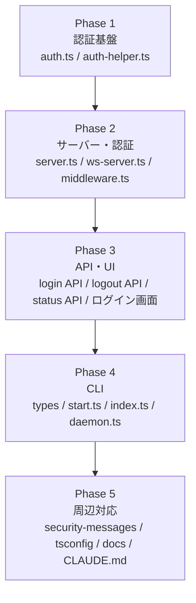
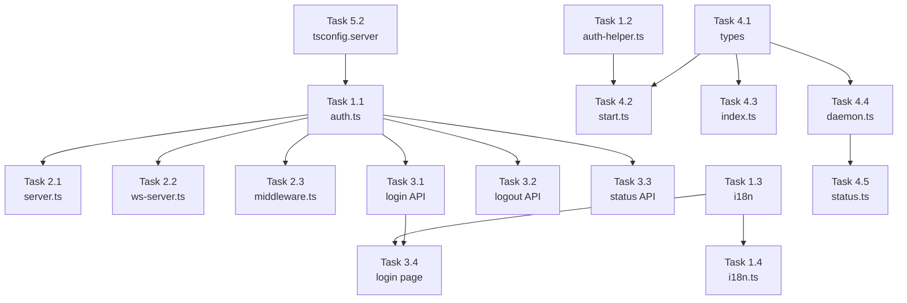

# Issue #331 作業計画書

## Issue: トークン認証によるログイン機能の追加

**Issue番号**: #331
**サイズ**: L（多数のファイルにわたる機能追加）
**優先度**: High（セキュリティ機能）
**依存Issue**: なし（Issue #179での削除実装が前提知識）
**設計方針書**: `dev-reports/design/issue-331-token-auth-design-policy.md`

---

## 実装フェーズ概要

設計方針書 Section 12「実装順序ガイダンス」に基づく5フェーズ構成。



---

## Phase 1: 認証基盤

### Task 1.1: src/lib/auth.ts（新規作成）
**成果物**: `src/lib/auth.ts`
**依存**: なし
**重要制約**: Node.js標準モジュールのみ依存（Next.js固有モジュール禁止）

実装内容:
- `AUTH_COOKIE_NAME = 'cm_auth_token'` 定数（R006）
- `AUTH_EXCLUDED_PATHS` 配列（R006）
- `ALLOWED_AUTH_DURATIONS` ホワイトリスト（R005）
- `RATE_LIMIT_CONFIG`（5回、15分、1時間クリーンアップ）
- `isAuthEnabled(): boolean` — `!!process.env.CM_AUTH_TOKEN_HASH`（R012）
- `generateToken(): string` — `crypto.randomBytes(32).toString('hex')`
- `hashToken(token: string): string` — SHA-256
- `parseCookieToken(cookieHeader: string | undefined): string | null`
- `verifyToken(token: string): boolean` — **`crypto.timingSafeEqual()` 必須（S001）**
- `isTokenExpired(): boolean` — expireAt チェック
- `parseDuration(duration: string): number` — ホワイトリスト方式（R005）
- `authenticateRequest(cookieHeader: string | undefined): AuthResult`（R007）
- `createRateLimiter(): RateLimiter`（destroy()メソッド付き、遅延初期化 I004）
- `destroyRateLimiter(): void`（C010）
- `initAuthState(tokenHash: string, expireAt: number): void`
- `AuthState` / `RateLimitEntry` / `RateLimiter` / `AuthResult` 型定義

**セキュリティ必須**:
- `verifyToken()` で `crypto.timingSafeEqual(Buffer.from(a), Buffer.from(b))` を使用
- 認証失敗時は詳細エラーを返さない（generic error）

### Task 1.2: src/cli/utils/auth-helper.ts（新規作成）
**成果物**: `src/cli/utils/auth-helper.ts`
**依存**: Task 1.1（同一アルゴリズムを重複実装）

実装内容:
- `generateToken(): string` — `crypto.randomBytes(32).toString('hex')`
- `hashToken(token: string): string` — SHA-256（auth.tsと同一実装）
- 注記: tsconfig.cli.jsonの制約（`src/cli/**/*` のみinclude）によりauth.tsは参照不可（C001）

### Task 1.3: i18n翻訳ファイル（新規作成）
**成果物**: `locales/en/auth.json`, `locales/ja/auth.json`
**依存**: なし

```json
// locales/en/auth.json
{
  "login": {
    "title": "Authentication Required",
    "tokenLabel": "Enter your access token",
    "tokenPlaceholder": "Paste your token here",
    "submit": "Login",
    "error": "Invalid token",
    "rateLimited": "Too many attempts. Please try again in {minutes} minutes.",
    "expired": "Token has expired"
  },
  "logout": { "button": "Logout" }
}
```

### Task 1.4: src/i18n.ts（変更）
**成果物**: `src/i18n.ts`
**依存**: Task 1.3

変更内容:
- `auth` namespace を import に追加
- messages オブジェクトに `auth: auth.default` を追加（C005: 名前空間キー方式）

---

## Phase 2: サーバー・認証

### Task 2.1: server.ts（変更）
**成果物**: `server.ts`
**依存**: Task 1.1

変更内容:
- `createServer` を `createHttpServer`/`createHttpsServer` に変更
- HTTPS条件分岐（`CM_HTTPS_CERT && CM_HTTPS_KEY`）
- 証明書読み込み（try-catch付き、エラー時 `process.exit(2)`）（R009, C002）
- `rateLimiter` の遅延初期化（`isAuthEnabled()` 確認後にcreate）（I004）
- `gracefulShutdown()` に `destroyRateLimiter()` 追加（C010）
- ログ出力の `http://` → 動的プロトコル表示

### Task 2.2: src/lib/ws-server.ts（変更）
**成果物**: `src/lib/ws-server.ts`
**依存**: Task 1.1

変更内容:
- `setupWebSocket(server: HTTPServer | HTTPSServer): void` 型拡張（C006）
- `upgrade` ハンドラーに認証チェック追加:
  ```typescript
  if (isAuthEnabled()) {
    const result = authenticateRequest(request.headers.cookie);
    if (!result.authenticated) {
      socket.write('HTTP/1.1 401 Unauthorized\r\n\r\n');
      socket.destroy();
      return;
    }
  }
  ```

### Task 2.3: src/middleware.ts（新規作成）
**成果物**: `src/middleware.ts`
**依存**: Task 1.1

実装内容:
- `config.matcher` で静的アセット除外
- `isAuthEnabled()` による認証ON/OFF制御（R012）
- `AUTH_EXCLUDED_PATHS` による除外パスチェック（R006, S002: 完全一致`===`）
- `authenticateRequest()` による統合認証（R007）
- 未認証時: `/login` へリダイレクト
- APIルート未認証時: 401レスポンス

---

## Phase 3: API・UI

### Task 3.1: src/app/api/auth/login/route.ts（新規作成）
**成果物**: `src/app/api/auth/login/route.ts`
**依存**: Task 1.1

実装内容:
- `POST /api/auth/login`
- レート制限チェック（認証チェック前）
- トークン検証
- HttpOnly Cookie設定（HTTPS時: Secure属性付与）
- 429レスポンス + `Retry-After` ヘッダー

### Task 3.2: src/app/api/auth/logout/route.ts（新規作成）
**成果物**: `src/app/api/auth/logout/route.ts`
**依存**: Task 1.1

実装内容:
- `POST /api/auth/logout`
- Cookie削除（Max-Age=0）

### Task 3.3: src/app/api/auth/status/route.ts（新規作成）
**成果物**: `src/app/api/auth/status/route.ts`
**依存**: Task 1.1

実装内容:
- `GET /api/auth/status`
- `{ authEnabled: isAuthEnabled() }` を返却

### Task 3.4: src/app/login/page.tsx（新規作成）
**成果物**: `src/app/login/page.tsx`
**依存**: Task 1.3, Task 3.1

実装内容:
- トークン入力テキストボックス
- ログインボタン
- エラー表示（残り試行回数、ロックアウトメッセージ）
- i18n対応（`useTranslations('login')`）
- ログイン済み時は `/` にリダイレクト（middleware.tsが担当）

---

## Phase 4: CLI

### Task 4.1: src/cli/types/index.ts（変更）
**成果物**: `src/cli/types/index.ts`
**依存**: なし

変更内容（StartOptionsに追加）:
```typescript
auth?: boolean;
authExpire?: string;   // "24h", "48h" etc.
https?: boolean;
cert?: string;
key?: string;
allowHttp?: boolean;
```

### Task 4.2: src/cli/commands/start.ts（変更）
**成果物**: `src/cli/commands/start.ts`
**依存**: Task 1.2, Task 4.1

変更内容:
- `--auth` オプション処理: `auth-helper.ts` でトークン生成・ハッシュ化
- ターミナルへのトークン表示
- 証明書ファイル検証（S003: 5段階バリデーション）
- 旧 `CM_AUTH_TOKEN` 設定検出・非推奨警告（C009）
- 環境変数設定: `CM_AUTH_TOKEN_HASH`, `CM_AUTH_EXPIRE`, `CM_HTTPS_CERT`, `CM_HTTPS_KEY`, `CM_AUTH_ALLOW_HTTP`
- CLIオプション組み合わせルール適用（--auth + --cert --key → HTTPS）
- HTTP警告メッセージ（`--auth` かつ証明書なし）

### Task 4.3: src/cli/index.ts（変更）
**成果物**: `src/cli/index.ts`
**依存**: Task 4.1

変更内容（commander定義追加）:
```typescript
.option('--auth', 'Enable token authentication')
.option('--auth-expire <duration>', 'Token expiration (default: 24h)')
.option('--https', 'Enable HTTPS server')
.option('--cert <path>', 'Path to HTTPS certificate file')
.option('--key <path>', 'Path to HTTPS private key file')
.option('--allow-http', 'Suppress HTTP warning when using --auth without HTTPS')
```

### Task 4.4: src/cli/utils/daemon.ts（変更）
**成果物**: `src/cli/utils/daemon.ts`
**依存**: Task 4.1

変更内容:
- `start()` メソッドのenv設定に認証・HTTPS関連変数を追加（C008）
- `getStatus()` のURL生成: `CM_HTTPS_CERT` 有無でプロトコル判定（I006）

### Task 4.5: src/cli/commands/status.ts（変更）
**成果物**: `src/cli/commands/status.ts`
**依存**: Task 4.4

変更内容:
- URL表示のHTTPS対応（`CM_HTTPS_CERT` 有無で `https://` 判定）

---

## Phase 5: 周辺対応

### Task 5.1: src/cli/config/security-messages.ts（変更）
**成果物**: `src/cli/config/security-messages.ts`
**依存**: なし

変更内容:
- `REVERSE_PROXY_WARNING` と `--auth` 同時適用時の優先ルール（I010）
- `AUTH_HTTP_WARNING`（証明書なし認証時の警告）追加
- `AUTH_ENABLED_MESSAGE`（認証有効起動時の成功メッセージ）追加

### Task 5.2: tsconfig.server.json（変更）
**成果物**: `tsconfig.server.json`
**依存**: Task 1.1

変更内容:
- `src/lib/auth.ts` を include 配列に追加

### Task 5.3: .env.example（変更）
**成果物**: `.env.example`
**依存**: なし

変更内容:
```env
# HTTPS Certificate (optional, for --auth --cert mode)
# CM_HTTPS_CERT=./localhost+1.pem
# CM_HTTPS_KEY=./localhost+1-key.pem
```

### Task 5.4: tests/integration/i18n-namespace-loading.test.ts（変更）
**成果物**: `tests/integration/i18n-namespace-loading.test.ts`
**依存**: Task 1.3, Task 1.4

変更内容:
- `EXPECTED_NAMESPACES` 配列に `'auth'` を追加（I001）

### Task 5.5: docs/security-guide.md（変更）
**成果物**: `docs/security-guide.md`
**依存**: Task 4.2

変更内容:
- トークン認証＋HTTPSのクイックスタート
- macOS/Linux別mkcert手順
- CA証明書配布手順（Linux）
- OpenSSL代替手順
- 証明書ファイル管理の注意（.gitignore, パーミッション600）

### Task 5.6: CLAUDE.md（変更）
**成果物**: `CLAUDE.md`
**依存**: Task 1.1, Task 2.3

変更内容:
- 主要機能モジュール一覧に以下を追加:
  - `src/lib/auth.ts`
  - `src/cli/utils/auth-helper.ts`
  - `src/middleware.ts`

---

## テストタスク

### Task T1: src/lib/auth.tsの単体テスト（新規作成）
**成果物**: `tests/unit/auth.test.ts`
**依存**: Task 1.1

テスト項目:
- `isAuthEnabled()`: 環境変数有無での判定
- `generateToken()`: 64文字16進数
- `hashToken()`: SHA-256出力の一貫性
- `parseCookieToken()`: 正常/不正/空Cookieのパース
- `verifyToken()`: 正常・異常・期限切れ（**timingSafeEqual使用確認**）
- `parseDuration()`: ホワイトリスト内/外
- `authenticateRequest()`: 統合テスト
- `createRateLimiter()`: 5回失敗後の429、15分後の復帰、destroy()

### Task T2: src/cli/utils/auth-helper.tsの単体テスト（新規作成）
**成果物**: `tests/unit/auth-helper.test.ts`
**依存**: Task 1.2

テスト項目:
- `generateToken()` / `hashToken()` がauth.tsと同一結果を返すこと（アルゴリズム同期テスト、S012）

### Task T3: src/middleware.tsの単体テスト（新規作成）
**成果物**: `tests/unit/middleware.test.ts`
**依存**: Task 2.3

テスト項目:
- 認証無効時のパススルー
- 除外パスのバイパス（完全一致確認、S002）
- 認証済みCookieでの通過
- 未認証でのリダイレクト

### Task T4: src/app/api/auth/login/route.tsの単体テスト（新規作成）
**成果物**: `tests/unit/api/auth/login.test.ts`
**依存**: Task 3.1

テスト項目:
- 正常ログイン→Cookie設定
- 不正トークン→401
- レート制限超過→429 + Retry-After

### Task T5: WebSocket既存テストの検証
**成果物**: `tests/integration/websocket.test.ts`（変更不要を確認）
**依存**: Task 2.2

確認項目:
- `CM_AUTH_TOKEN_HASH` 未設定状態でのテスト実行確認
- 必要に応じて `delete process.env.CM_AUTH_TOKEN_HASH` をbeforeEachに追加（I002）

---

## タスク依存関係



---

## 品質チェック項目

| チェック項目 | コマンド | 基準 |
|-------------|----------|------|
| TypeScript | `npx tsc --noEmit` | エラー0件 |
| ESLint | `npm run lint` | エラー0件 |
| Unit Test | `npm run test:unit` | 全テストパス |
| Integration Test | `npm run test:integration` | 全テストパス（i18nテスト含む） |
| Build (Next.js) | `npm run build` | 成功 |
| Build (Server) | `npm run build:server` | 成功 |
| Build (CLI) | `npm run build:cli` | 成功 |

---

## 成果物チェックリスト

### Phase 1（認証基盤）
- [ ] `src/lib/auth.ts`（新規）
- [ ] `src/cli/utils/auth-helper.ts`（新規）
- [ ] `locales/en/auth.json`（新規）
- [ ] `locales/ja/auth.json`（新規）
- [ ] `src/i18n.ts`（変更）

### Phase 2（サーバー・認証）
- [ ] `server.ts`（変更）
- [ ] `src/lib/ws-server.ts`（変更）
- [ ] `src/middleware.ts`（新規）

### Phase 3（API・UI）
- [ ] `src/app/api/auth/login/route.ts`（新規）
- [ ] `src/app/api/auth/logout/route.ts`（新規）
- [ ] `src/app/api/auth/status/route.ts`（新規）
- [ ] `src/app/login/page.tsx`（新規）

### Phase 4（CLI）
- [ ] `src/cli/types/index.ts`（変更）
- [ ] `src/cli/commands/start.ts`（変更）
- [ ] `src/cli/index.ts`（変更）
- [ ] `src/cli/utils/daemon.ts`（変更）
- [ ] `src/cli/commands/status.ts`（変更）

### Phase 5（周辺）
- [ ] `src/cli/config/security-messages.ts`（変更）
- [ ] `tsconfig.server.json`（変更）
- [ ] `.env.example`（変更）
- [ ] `tests/integration/i18n-namespace-loading.test.ts`（変更）
- [ ] `docs/security-guide.md`（変更）
- [ ] `CLAUDE.md`（変更）

### テスト
- [ ] `tests/unit/auth.test.ts`（新規）
- [ ] `tests/unit/auth-helper.test.ts`（新規）
- [ ] `tests/unit/middleware.test.ts`（新規）
- [ ] `tests/unit/api/auth/login.test.ts`（新規）
- [ ] `tests/integration/i18n-namespace-loading.test.ts`（変更）

---

## Definition of Done

- [ ] 全25タスクの実装完了
- [ ] TypeScript型エラー 0件
- [ ] ESLintエラー 0件
- [ ] 単体テスト・統合テスト 全パス
- [ ] 全ビルド（Next.js / server / CLI）成功
- [ ] セキュリティ必須事項: `crypto.timingSafeEqual()` 使用確認（S001）
- [ ] セキュリティ必須事項: 除外パス完全一致マッチング確認（S002）
- [ ] 後方互換性確認: `commandmate start`（認証なし）が従来通り動作
- [ ] ドキュメント更新完了

---

## 次のアクション

1. **TDD実装開始**: `/pm-auto-dev 331`
2. **PR作成**: 実装完了後に `/create-pr`

---

*Generated by work-plan command for Issue #331*
*Date: 2026-02-21*
*Based on: dev-reports/design/issue-331-token-auth-design-policy.md*
