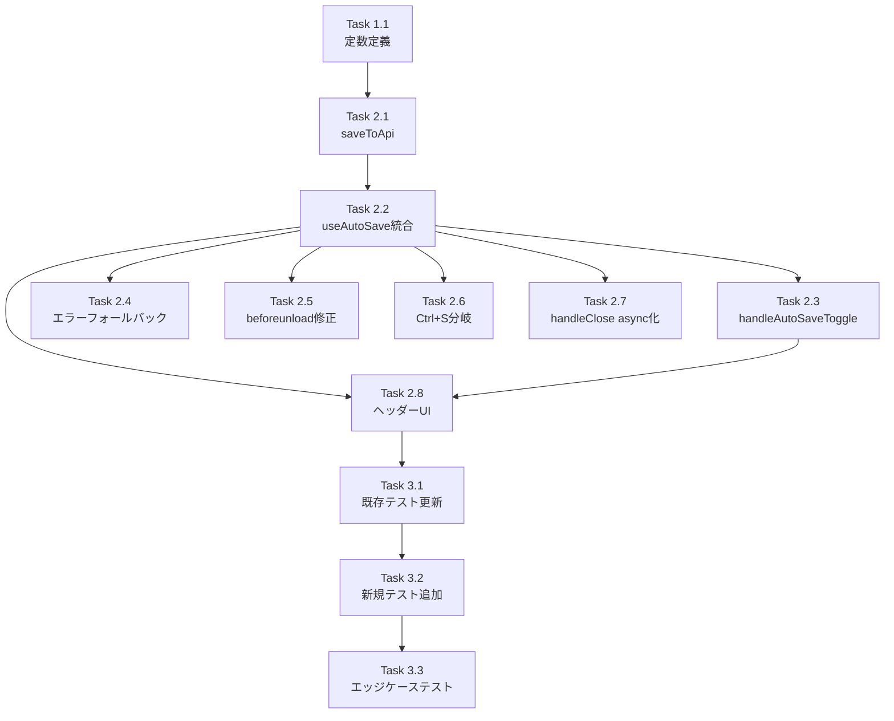

# 作業計画書

## Issue: メモ機能にauto saveモードの追加
**Issue番号**: #389
**サイズ**: M
**優先度**: Medium
**依存Issue**: なし

---

## 概要

MarkdownEditorにauto-save ON/OFFトグルを追加する。既存の`useAutoSave`フックと`useLocalStorageState`フックを再利用し、最小限のコード変更（3ファイル）で実装する。

---

## 詳細タスク分解

### Phase 1: 定数・型定義追加

- [ ] **Task 1.1**: `src/types/markdown-editor.ts` に定数追加
  - 成果物: `LOCAL_STORAGE_KEY_AUTO_SAVE`、`AUTO_SAVE_DEBOUNCE_MS` の2定数
  - 依存: なし
  - 実装内容:
    ```typescript
    export const LOCAL_STORAGE_KEY_AUTO_SAVE = 'commandmate:md-editor-auto-save';
    export const AUTO_SAVE_DEBOUNCE_MS = 3000;
    ```

### Phase 2: MarkdownEditor.tsx 実装

- [ ] **Task 2.1**: saveToApi 関数の切り出し
  - 成果物: `saveToApi` useCallback（isDirtyチェックなし純粋API呼び出し）
  - 依存: Task 1.1
  - 実装内容:
    - `async (valueToSave: string) => void` シグネチャ
    - saveFnのパラメータ（valueToSave）をAPIに送信（クロージャのcontent stateではない）
    - 保存成功後に `setOriginalContent(valueToSave)` を呼ぶ（dirty状態解除）
    - 401/redirected 検出でセッション切れエラー表示
    - 依存配列: `[worktreeId, filePath, setOriginalContent]`

- [ ] **Task 2.2**: useAutoSave 統合
  - 成果物: useAutoSave フックの呼び出しコード
  - 依存: Task 2.1
  - 実装内容:
    - `useLocalStorageState` で `isAutoSaveEnabled` を永続化（defaultValue: false）
    - `useAutoSave` に `saveFn: saveToApi, debounceMs: AUTO_SAVE_DEBOUNCE_MS, disabled: !isAutoSaveEnabled` を設定
    - `isSaving: isAutoSaving, error: autoSaveError, saveNow` を destructure

- [ ] **Task 2.3**: handleAutoSaveToggle 実装
  - 成果物: auto-save ON切り替え時のエッジケース対応ハンドラー
  - 依存: Task 2.2
  - 実装内容:
    - `setAutoSaveEnabled(enabled)` を呼ぶ
    - `enabled && isDirty` の場合は `saveNow()` を即座呼び出し（initialValueRefエッジケース対応）

- [ ] **Task 2.4**: エラーフォールバック useEffect 追加
  - 成果物: `autoSaveError` 監視 useEffect
  - 依存: Task 2.2
  - 実装内容:
    - `autoSaveError && isAutoSaveEnabled` の場合に `setAutoSaveEnabled(false)` + Toast表示

- [ ] **Task 2.5**: beforeunload ハンドラー修正
  - 成果物: auto-save ON時の条件拡張 useEffect
  - 依存: Task 2.2
  - 実装内容:
    - auto-save ON: `isDirty || isAutoSaving` で警告
    - auto-save OFF: `isDirty` のみ（従来通り）
    - 依存配列: `[isDirty, isAutoSaving, isAutoSaveEnabled]`

- [ ] **Task 2.6**: handleKeyDown の Ctrl+S 分岐修正
  - 成果物: auto-save ON時の Ctrl+S 処理
  - 依存: Task 2.2
  - 実装内容:
    - auto-save ON: `await saveNow(); onSave?.(filePath);`
    - auto-save OFF: 従来の `saveContent()`

- [ ] **Task 2.7**: handleClose の async 化と auto-save 対応
  - 成果物: async handleClose（saveNow待機 + エラー確認ダイアログ）
  - 依存: Task 2.2
  - 実装内容:
    - auto-save ON + `(isDirty || isAutoSaving)` の場合: `await saveNow()`
    - saveNow後に `autoSaveError` を確認、エラーがあれば confirm ダイアログ
    - エラーフォールバックuseEffectが先発火してsaveNow()がスキップされるケースも考慮

- [ ] **Task 2.8**: ヘッダー UI 変更
  - 成果物: auto-save-toggle + auto-save-indicator UI
  - 依存: Task 2.2、Task 2.3
  - 実装内容:
    - auto-saveトグルスイッチ（`data-testid="auto-save-toggle"`）
    - 保存状態インジケーター（`data-testid="auto-save-indicator"`）: Saving... / Saved / Error
    - auto-save ON時は Save ボタンを非表示にする
    - auto-save ON時は Toast通知を抑制し、インラインインジケーターのみで状態表示

### Phase 3: テスト実装

- [ ] **Task 3.1**: 既存テストの前提条件明示（auto-save OFF前提コメント追加）
  - 成果物: `tests/unit/components/MarkdownEditor.test.tsx` 更新
  - 依存: Task 2.8
  - 対象テスト:
    - "Save Operations" (6件) - auto-save OFF がデフォルトのため動作維持、コメント追加
    - "Unsaved Changes Warning" (3件) - 前提条件コメント追加
    - "onClose callback" (3件) - async handleClose 対応で waitFor ラッピング確認

- [ ] **Task 3.2**: auto-save ON時の新規テスト追加
  - 成果物: `tests/unit/components/MarkdownEditor.test.tsx` 新規テスト
  - 依存: Task 3.1
  - 追加テストケース:
    - **beforeunload**: auto-save ON + isDirty=false + isAutoSaving=false → 登録なし
    - **beforeunload**: auto-save ON + isDirty=true → 登録あり
    - **beforeunload**: auto-save ON + isAutoSaving=true → 登録あり
    - **Save button**: auto-save ON → save-button が DOM に存在しない
    - **Indicator**: auto-save ON → auto-save-indicator が表示される
    - **Ctrl+S (auto-save ON)**: saveNow() が呼ばれること
    - **Ctrl+S (auto-save ON)**: onSave コールバックが呼ばれること
    - **handleClose**: auto-save ON + isDirty=true → saveNow() 後に onClose()
    - **handleClose**: auto-save ON + saveNow() 失敗 → confirm ダイアログ表示

- [ ] **Task 3.3**: initialValueRefエッジケーステスト
  - 成果物: Section 8.3 で定義したエッジケースのテスト実装
  - 依存: Task 3.2
  - テストシナリオ:
    - auto-save OFF のまま編集 → auto-save ON に切り替え → saveNow() 即座呼び出し確認
    - ファイルロード後 auto-save OFF で編集 → auto-save ON に切り替え

---

## タスク依存関係



---

## 変更ファイル一覧

| ファイル | 変更種別 | 主な変更内容 |
|---------|---------|------------|
| `src/types/markdown-editor.ts` | 追加 | LOCAL_STORAGE_KEY_AUTO_SAVE, AUTO_SAVE_DEBOUNCE_MS 定数 |
| `src/components/worktree/MarkdownEditor.tsx` | 修正 | saveToApi分離, useAutoSave統合, handleClose async化, beforeunload修正, UI追加 |
| `tests/unit/components/MarkdownEditor.test.tsx` | 修正・追加 | 既存テスト前提条件明示, auto-save ON時の新規テスト追加 |

---

## 実装上の注意点

### critical: saveToApiのパラメータ

```typescript
// NG: クロージャのcontent stateを使用
const saveToApi = useCallback(async () => {
  body: JSON.stringify({ content: content }), // ← stale closure リスク
});

// OK: saveFnのパラメータを使用
const saveToApi = useCallback(async (valueToSave: string) => {
  body: JSON.stringify({ content: valueToSave }), // ← useAutoSaveが渡す実際の値
});
```

### critical: saveContentとsaveToApiの二重dirty解除

`saveContent` は `saveToApi` を呼び出し、`saveToApi` 内で `setOriginalContent(valueToSave)` を呼ぶ。
そのため `saveContent` 内の `setOriginalContent(content)` を削除する（二重呼び出し防止）。

### critical: onSaveCompleteは使用しない

`useAutoSave` の `onSaveComplete` は `() => void` 型（引数なし）のため使用しない。dirty状態解除は `saveToApi` 内部で行う。

### 注意: disabledパラメータのdynamic切り替え

MemoCardはdisabledを使用しない（常にauto-save有効）。MarkdownEditorのdynamic切り替え（`!isAutoSaveEnabled`）はMemoCardとの差分であり、Section 8.3のエッジケーステストで網羅的に検証すること。

---

## 品質チェック項目

| チェック項目 | コマンド | 基準 |
|-------------|----------|------|
| ESLint | `npm run lint` | エラー0件 |
| TypeScript | `npx tsc --noEmit` | 型エラー0件 |
| Unit Test | `npm run test:unit` | 全テストパス |
| Build | `npm run build` | 成功 |

---

## Definition of Done

- [ ] すべてのタスクが完了
- [ ] `npm run lint` エラー0件
- [ ] `npx tsc --noEmit` 型エラー0件
- [ ] `npm run test:unit` 全テストパス
- [ ] `npm run build` 成功
- [ ] auto-save ON/OFF toggle が正常動作
- [ ] localStorage への設定永続化が確認できる
- [ ] auto-save 失敗時のフォールバック（手動保存モードへ）が動作する
- [ ] beforeunload 条件が正しく動作する（auto-save ON + isDirty=false + isAutoSaving=false 時は警告なし）
- [ ] Ctrl+S（auto-save ON）で saveNow() + onSave() が呼ばれる

---

## 次のアクション

作業計画承認後：
1. **TDD実装**: `/pm-auto-dev 389` で自動開発フロー実行
2. **進捗報告**: `/progress-report` で報告
3. **PR作成**: `/create-pr` で自動作成

---

*Generated by work-plan skill for Issue #389*
*Based on design policy: dev-reports/design/issue-389-auto-save-design-policy.md*
