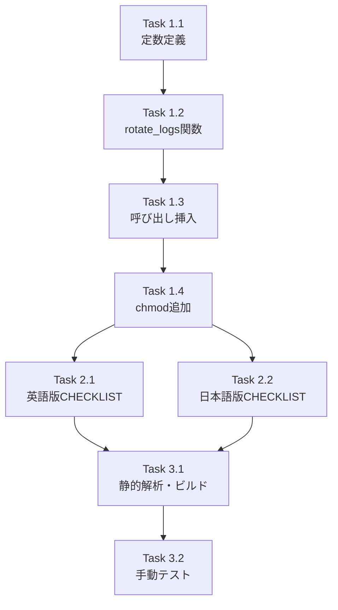

# Issue #403: 作業計画書

## Issue: feat: サーバーログのローテーション機能を追加

**Issue番号**: #403
**サイズ**: S（シェルスクリプト1ファイル + ドキュメント2ファイル）
**優先度**: Medium
**依存Issue**: なし
**設計方針書**: `dev-reports/design/issue-403-server-log-rotation-design-policy.md`

---

## 詳細タスク分解

### Phase 1: メイン実装（`scripts/build-and-start.sh`）

#### Task 1.1: 定数定義の追加
- **成果物**: `scripts/build-and-start.sh`（修正）
- **内容**: スクリプト先頭部（`LOG_FILE`定義直後あたり）に以下を追加
  ```bash
  MAX_LOG_SIZE_MB=10           # ローテーション閾値（MB）
  MAX_LOG_GENERATIONS=3        # 保持世代数
  ```
- **依存**: なし
- **参照**: 設計方針書 セクション4-1

#### Task 1.2: `rotate_logs()`関数の実装
- **成果物**: `scripts/build-and-start.sh`（修正）
- **内容**: 以下の処理を含む関数を追加
  1. ファイル不在チェック（早期リターン）
  2. `$LOG_FILE`のシンボリックリンクチェック `[S4-006]`
  3. `wc -c`によるファイルサイズ取得（POSIX準拠）
  4. 閾値未満チェック（早期リターン）
  5. 最古世代（`.${MAX_LOG_GENERATIONS}`）のシンボリックリンクチェックと削除
  6. 世代シフトループ（各ファイルのシンボリックリンクチェック付き`mv`）
  7. currentを`.1`にリネーム
  8. 完了ログ出力
- **依存**: Task 1.1
- **参照**: 設計方針書 セクション4-2（エラー処理方針、`[S4-006]`シンボリックリンクチェック含む）

#### Task 1.3: `rotate_logs()`呼び出しの挿入
- **成果物**: `scripts/build-and-start.sh`（修正）
- **内容**: `mkdir -p "$DATA_DIR"` + `chmod 755`の直後、`db:init`の前に挿入
  ```bash
  # Rotate log file if needed (before server starts)
  rotate_logs || echo "WARNING: Log rotation failed, continuing with server startup" >&2
  ```
- **依存**: Task 1.2
- **参照**: 設計方針書 セクション4-3

#### Task 1.4: `nohup`実行後のパーミッション設定
- **成果物**: `scripts/build-and-start.sh`（修正）
- **内容**: `nohup npm start >> "$LOG_FILE" 2>&1 &`の直後に追加
  ```bash
  chmod 640 "$LOG_FILE" 2>/dev/null || true  # [S4-005]
  ```
- **依存**: Task 1.3
- **参照**: 設計方針書 セクション5 `[S4-005]`

### Phase 2: ドキュメント更新

#### Task 2.1: 英語版PRODUCTION_CHECKLIST更新
- **成果物**: `docs/en/internal/PRODUCTION_CHECKLIST.md`（修正）
- **内容**: L164付近のLog rotation項目を更新
  ```markdown
  - [x] Log rotation is configured (built-in: `scripts/build-and-start.sh` rotates `logs/server.log` at startup when size exceeds 10MB, keeping 3 generations)
  ```
- **依存**: Task 1.4
- **参照**: 設計方針書 セクション9

#### Task 2.2: 日本語版PRODUCTION_CHECKLIST更新
- **成果物**: `docs/internal/PRODUCTION_CHECKLIST.md`（修正）
- **内容**: L164付近のLog rotation項目を更新
  ```markdown
  - [x] ログのローテーション設定がされている（ビルトイン: `scripts/build-and-start.sh`が起動時に`logs/server.log`のサイズが10MBを超えた場合にローテーション実行、3世代保持）
  ```
- **依存**: Task 1.4
- **参照**: 設計方針書 セクション9

### Phase 3: 検証

#### Task 3.1: 静的解析・ビルド確認
- **内容**:
  ```bash
  npx tsc --noEmit
  npm run lint
  npm run test:unit
  npm run build
  ```
- **依存**: Task 2.1, Task 2.2

#### Task 3.2: 手動テスト実施（Issue記載テスト手順）
- **内容**:
  1. **基本動作テスト**: `dd if=/dev/zero bs=1M count=15 of=logs/server.log` → `./scripts/build-and-start.sh --daemon` → `.1`作成確認
  2. **世代管理テスト**: `.1`〜`.3`手動作成 → 15MB `server.log` → 起動 → `.3`削除・世代シフト確認
  3. **エッジケース**: ファイルなし / 閾値未満（5MB） / `logs/`ディレクトリなし
  4. **シンボリックリンクテスト**: `ln -s /etc/hosts logs/server.log` → 起動 → 警告のみで正常起動確認 `[S4-006]`
  5. **フォアグラウンドモード**: フォアグラウンドで起動し、ローテーション動作確認（実害なし）
- **依存**: Task 3.1

---

## タスク依存関係



---

## 変更ファイル一覧

| ファイル | 変更種類 | タスク |
|---------|---------|--------|
| `scripts/build-and-start.sh` | 修正 | 1.1〜1.4 |
| `docs/en/internal/PRODUCTION_CHECKLIST.md` | 修正 | 2.1 |
| `docs/internal/PRODUCTION_CHECKLIST.md` | 修正 | 2.2 |

---

## 品質チェック項目

| チェック項目 | コマンド | 基準 |
|-------------|----------|------|
| TypeScript | `npx tsc --noEmit` | 型エラー0件 |
| ESLint | `npm run lint` | エラー0件 |
| Unit Test | `npm run test:unit` | 全テストパス |
| Build | `npm run build` | 成功 |
| 手動テスト | Issue記載テスト手順 | 全5パターンパス |

---

## Definition of Done

- [ ] `scripts/build-and-start.sh`に`rotate_logs()`関数が実装されている
- [ ] `MAX_LOG_SIZE_MB=10`, `MAX_LOG_GENERATIONS=3`定数が定義されている
- [ ] 呼び出しが`mkdir -p`直後・`db:init`前に配置されている
- [ ] `|| echo WARNING`パターンで失敗時もサーバー起動が継続する
- [ ] シンボリックリンクチェック（`[S4-006]`）が実装されている
- [ ] `nohup`後の`chmod 640`（`[S4-005]`）が実装されている
- [ ] 英語版・日本語版PRODUCTION_CHECKLISTが更新されている
- [ ] `npx tsc --noEmit` エラー0件
- [ ] `npm run lint` エラー0件
- [ ] `npm run test:unit` 全テストパス
- [ ] `npm run build` 成功
- [ ] Issue記載の手動テスト手順がすべてパス

---

## 次のアクション

1. **実装開始**: `feature/403-worktree`ブランチで作業
2. **実装**: Task 1.1 → 1.2 → 1.3 → 1.4 の順に実施
3. **ドキュメント**: Task 2.1, 2.2 を実施
4. **検証**: Task 3.1, 3.2 を実施
5. **PR作成**: `/create-pr`で自動作成

---

*Generated by work-plan command for Issue #403*
*Date: 2026-03-03*
