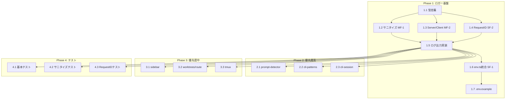

# Issue #41 作業計画書

## Issue: ステータス管理のログ強化: 構造化ログ + ログレベル制御

| 項目 | 値 |
|------|-----|
| **Issue番号** | #41 |
| **サイズ** | M（中規模） |
| **優先度** | Medium |
| **依存Issue** | なし |
| **関連Issue** | #31（サイドバーUX改善）、#33（Codex/Gemini UI削除） |

---

## 1. 実装範囲

### 1.1 スコープ

| カテゴリ | 対象 |
|---------|------|
| 新規作成 | `src/lib/logger.ts` |
| 更新 | `src/lib/env.ts`（ログ設定追加） |
| 更新 | `.env.example`（環境変数追加） |
| ログ追加 | 6モジュール（優先度高3 + 優先度中3） |
| テスト | `tests/unit/logger.test.ts` |

### 1.2 対象外（スコープ外）

- ファイル出力機能
- ログローテーション
- リモート送信機能
- 既存の全 `console.*` の置換（優先度低は対象外）

---

## 2. 詳細タスク分解

### Phase 1: ロガー基盤（必須）

| Task ID | タスク | 成果物 | 依存 |
|---------|--------|--------|------|
| **1.1** | ロガー型定義 | `src/lib/logger.ts`（型のみ） | なし |
| **1.2** | 機密情報フィルタリング実装 [MF-1] | `src/lib/logger.ts`（sanitize関数） | 1.1 |
| **1.3** | Server/Client ログ分離実装 [MF-2] | `src/lib/logger.ts`（isServer等） | 1.1 |
| **1.4** | リクエストID生成実装 [SF-2] | `src/lib/logger.ts`（generateRequestId） | 1.1 |
| **1.5** | ログ出力・フォーマット実装 | `src/lib/logger.ts`（完成） | 1.2, 1.3, 1.4 |
| **1.6** | env.ts 統合 [SF-1] | `src/lib/env.ts`（getLogConfig追加） | 1.5 |
| **1.7** | 環境変数ドキュメント | `.env.example` | 1.6 |

### Phase 2: 優先度高モジュールへのログ追加

| Task ID | タスク | 成果物 | 依存 |
|---------|--------|--------|------|
| **2.1** | prompt-detector.ts ログ追加 | `src/lib/prompt-detector.ts` | 1.5 |
| **2.2** | cli-patterns.ts ログ追加 | `src/lib/cli-patterns.ts` | 1.5 |
| **2.3** | cli-session.ts ログ追加 | `src/lib/cli-session.ts` | 1.5 |

### Phase 3: 優先度中モジュールへのログ追加

| Task ID | タスク | 成果物 | 依存 |
|---------|--------|--------|------|
| **3.1** | sidebar.ts ログ追加 | `src/types/sidebar.ts` | 1.5 |
| **3.2** | worktrees/route.ts ログ追加 | `src/app/api/worktrees/route.ts` | 1.5 |
| **3.3** | tmux.ts ログ追加 | `src/lib/tmux.ts` | 1.5 |

### Phase 4: テスト

| Task ID | タスク | 成果物 | 依存 |
|---------|--------|--------|------|
| **4.1** | 基本機能テスト | `tests/unit/logger.test.ts` | 1.5 |
| **4.2** | サニタイズテスト [MF-1] | `tests/unit/logger.test.ts` | 1.5 |
| **4.3** | リクエストIDテスト [SF-2] | `tests/unit/logger.test.ts` | 1.5 |

### Phase 5: 既存ログ構造化（オプション）

| Task ID | タスク | 成果物 | 依存 |
|---------|--------|--------|------|
| **5.1** | response-poller.ts 構造化 | `src/lib/response-poller.ts` | 1.5 |
| **5.2** | その他 console.* 置換 | 各ファイル | 1.5 |

---

## 3. タスク依存関係



---

## 4. 実装詳細

### 4.1 Task 1.1-1.5: logger.ts 実装

**ファイル**: `src/lib/logger.ts`

**主要機能**:
```typescript
// 型定義
export type LogLevel = 'debug' | 'info' | 'warn' | 'error';
export interface LogEntry { /* ... */ }
export interface LoggerContext { /* ... */ }
export interface Logger { /* ... */ }

// [MF-1] 機密情報フィルタリング
function sanitize(value: unknown): unknown;

// [MF-2] Server/Client 分離
function isServer(): boolean;
function shouldLogOnClient(): boolean;

// [SF-2] リクエストID生成
export function generateRequestId(): string;

// メイン関数
export function createLogger(module: string): Logger;
```

**実装ポイント**:
- `sanitize()`: Bearer トークン、パスワード、MCBD_AUTH_TOKEN 等をマスク
- `isServer()`: `typeof window === 'undefined'` で判定
- `generateRequestId()`: `crypto.randomUUID()` + フォールバック

### 4.2 Task 1.6: env.ts 統合

**ファイル**: `src/lib/env.ts`

**追加内容**:
```typescript
// ログ設定取得関数を追加
export function getLogConfig(): { level: LogLevel; format: 'json' | 'text' };

// Env インターフェースに追加
export interface Env {
  // ... 既存
  MCBD_LOG_LEVEL: LogLevel;
  MCBD_LOG_FORMAT: 'json' | 'text';
}
```

### 4.3 Task 2.1-2.3, 3.1-3.3: ログ追加

**追加パターン**:
```typescript
import { createLogger } from '@/lib/logger';

const logger = createLogger('module-name');

// 関数内で使用
export function someFunction(worktreeId: string) {
  const log = logger.withContext({ worktreeId });

  log.debug('actionName:start', { param1, param2 });

  try {
    // 処理
    log.debug('actionName:success', { result });
  } catch (error) {
    log.error('actionName:failed', { error: String(error) });
    throw error;
  }
}
```

### 4.4 Task 4.1-4.3: テスト実装

**ファイル**: `tests/unit/logger.test.ts`

**テストケース**:
1. `createLogger()` がロガーインスタンスを返す
2. ログレベルによるフィルタリング
3. JSON/テキスト形式の切替
4. `withContext()` でコンテキスト追加
5. [MF-1] Bearer トークンのマスキング
6. [MF-1] パスワードフィールドのマスキング
7. [MF-1] MCBD_AUTH_TOKEN のマスキング
8. [MF-1] ネストしたオブジェクトのマスキング
9. [SF-2] UUID形式のリクエストID生成
10. [SF-2] リクエストIDの一意性

---

## 5. 品質チェック項目

| チェック項目 | コマンド | 基準 |
|-------------|----------|------|
| ESLint | `npm run lint` | エラー0件 |
| TypeScript | `npx tsc --noEmit` | 型エラー0件 |
| Unit Test | `npm run test:unit` | 全テストパス |
| Build | `npm run build` | 成功 |

### 追加チェック

| チェック項目 | 確認方法 | 基準 |
|-------------|----------|------|
| ログレベル制御 | `MCBD_LOG_LEVEL=warn` で起動 | debug/info ログが出力されない |
| JSON形式出力 | `MCBD_LOG_FORMAT=json` で起動 | JSON形式で出力される |
| 機密情報マスク | テスト実行 | トークン等が `[REDACTED]` になる |
| Server/Client分離 | ブラウザコンソール確認 | 本番ビルドでクライアントログなし |

---

## 6. 成果物チェックリスト

### コード

- [ ] `src/lib/logger.ts` - ロガーユーティリティ
- [ ] `src/lib/env.ts` - getLogConfig() 追加
- [ ] `src/lib/prompt-detector.ts` - ログ追加
- [ ] `src/lib/cli-patterns.ts` - ログ追加
- [ ] `src/lib/cli-session.ts` - ログ追加
- [ ] `src/types/sidebar.ts` - ログ追加
- [ ] `src/app/api/worktrees/route.ts` - ログ追加
- [ ] `src/lib/tmux.ts` - ログ追加

### テスト

- [ ] `tests/unit/logger.test.ts` - 単体テスト

### ドキュメント

- [ ] `.env.example` - MCBD_LOG_LEVEL, MCBD_LOG_FORMAT 追加

---

## 7. Definition of Done

Issue完了条件：

### 必須

- [ ] `src/lib/logger.ts` が作成されている
- [ ] 環境変数 `MCBD_LOG_LEVEL` でログレベル制御可能
- [ ] 環境変数 `MCBD_LOG_FORMAT` で出力形式選択可能
- [ ] [MF-1] 機密情報フィルタリングが実装されている
- [ ] [MF-2] Server/Client ログ分離が実装されている
- [ ] [SF-1] env.ts にログ設定が統合されている
- [ ] [SF-2] リクエストID生成が実装されている
- [ ] 主要モジュール（優先度：高）にログが追加されている
- [ ] 単体テストが追加されている
- [ ] `.env.example` に設定方法が記載されている
- [ ] CIチェック全パス（lint, type-check, test, build）

### 推奨

- [ ] 優先度：中のモジュールにログが追加されている
- [ ] 既存の `console.log/error` が新ロガーに置換されている

---

## 8. 作業順序（推奨）

```
Day 1: Phase 1（ロガー基盤）
├── Task 1.1: 型定義
├── Task 1.2: サニタイズ実装
├── Task 1.3: Server/Client分離
├── Task 1.4: リクエストID
├── Task 1.5: ログ出力実装
├── Task 1.6: env.ts統合
└── Task 1.7: .env.example更新

Day 2: Phase 2 + Phase 4（優先度高 + テスト）
├── Task 2.1: prompt-detector.ts
├── Task 2.2: cli-patterns.ts
├── Task 2.3: cli-session.ts
├── Task 4.1: 基本テスト
├── Task 4.2: サニタイズテスト
└── Task 4.3: RequestIDテスト

Day 3: Phase 3 + 最終確認
├── Task 3.1: sidebar.ts
├── Task 3.2: worktrees/route.ts
├── Task 3.3: tmux.ts
└── 品質チェック・PR作成
```

---

## 9. リスクと対策

| リスク | 影響 | 対策 |
|--------|------|------|
| 循環依存（logger ↔ env） | ビルドエラー | getLogConfig を env.ts に配置、logger は直接参照 |
| 機密情報漏洩パターン漏れ | セキュリティリスク | テストケースで複数パターンを検証 |
| パフォーマンス低下 | UX劣化 | ログレベルによる早期リターン、本番は info デフォルト |
| 既存テスト破壊 | CI失敗 | 各Phase後にテスト実行 |

---

## 10. 次のアクション

作業計画承認後：

1. **ブランチ作成**
   ```bash
   git checkout -b feature/41-structured-logging
   ```

2. **タスク実行**
   - Phase 1 から順に実装
   - 各Phase完了後にコミット

3. **進捗報告**
   ```bash
   /progress-report
   ```

4. **PR作成**
   ```bash
   /create-pr
   ```

---

## 11. 関連ドキュメント

- [設計方針書](../design/issue41-structured-logging-design-policy.md)
- [アーキテクチャレビュー](../review/2026-01-12-issue41-architecture-review.md)
- [Issue #41](https://github.com/Kewton/MyCodeBranchDesk/issues/41)
