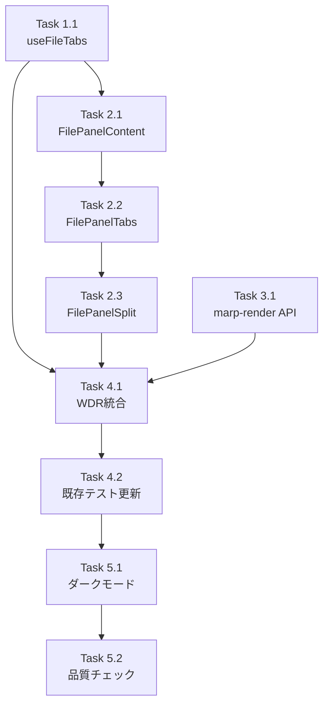

# 作業計画書: Issue #438

## Issue: feat(ui): PC版ファイル表示をポップアップからタブ付きサイドパネルに変更
**Issue番号**: #438
**サイズ**: L
**優先度**: Medium
**依存Issue**: なし

---

## 実装タスク分解

### Phase 1: フック・型定義

#### Task 1.1: 型定義・useFileTabsフック実装 【TDD】
- **成果物**:
  - `src/hooks/useFileTabs.ts` （`FileTab`, `FileTabsState`, `FileTabsAction`型定義 + `useFileTabs`フック）
  - `tests/unit/hooks/useFileTabs.test.ts`
- **テスト観点**:
  - OPEN_FILE: 新規タブ追加 / 重複時アクティブ化 / 5タブ上限時`limit_reached`返却
  - CLOSE_TAB: タブ削除・activeIndex更新
  - RENAME_FILE / DELETE_FILE: パス更新・タブ自動削除
  - SET_CONTENT / SET_LOADING / SET_ERROR: 状態更新
- **依存**: なし
- **完了条件**: `npm run test:unit -- useFileTabs` パス

---

### Phase 2: コンポーネント実装

#### Task 2.1: FilePanelContent実装 【TDD】
- **成果物**:
  - `src/components/worktree/FilePanelContent.tsx`
  - `tests/unit/components/FilePanelContent.test.tsx`
- **実装内容**:
  - propsインターフェース: `{ tab, worktreeId, onLoadContent, onLoadError, onSetLoading, onEditMarkdown? }`
  - useEffectでファイルコンテンツをフェッチ（`/api/worktrees/${worktreeId}/files/${tab.path}`）
  - コンテンツ分岐: ロード中 / エラー / MARP / .md / 画像 / 動画 / テキスト(highlight.js)
  - `highlight.js`の`highlightAuto()`でシンタックスハイライト
  - `React.memo()`ラップ
- **テスト観点**:
  - コンテンツ未ロード時にフェッチ開始
  - 各コンテンツタイプの分岐
  - エラー表示
- **依存**: Task 1.1
- **完了条件**: `npm run test:unit -- FilePanelContent` パス

#### Task 2.2: FilePanelTabs実装 【TDD】
- **成果物**:
  - `src/components/worktree/FilePanelTabs.tsx`
  - `tests/unit/components/FilePanelTabs.test.tsx`
- **実装内容**:
  - propsインターフェース: `{ tabs, activeIndex, worktreeId, onClose, onActivate, onLoadContent, onLoadError, onSetLoading, onEditMarkdown? }`
  - タブバー（上部固定）: アクティブタブ `border-b-2 border-cyan-500` ハイライト
  - 閉じるボタン（`lucide-react: X`）
  - アクティブタブに対応する`FilePanelContent`を表示
  - `React.memo()`ラップ
- **テスト観点**:
  - タブクリックでアクティブ化
  - 閉じるボタンでonCloseコールバック
  - アクティブタブに応じたFilePanelContent表示
- **依存**: Task 2.1
- **完了条件**: `npm run test:unit -- FilePanelTabs` パス

#### Task 2.3: FilePanelSplit実装 【TDD】
- **成果物**:
  - `src/components/worktree/FilePanelSplit.tsx`
  - `tests/unit/components/FilePanelSplit.test.tsx`
- **実装内容**:
  - propsインターフェース: `{ terminal, fileTabs, onCloseTab, onActivateTab, onLoadContent, onLoadError, onSetLoading, onEditMarkdown?, worktreeId }`
  - タブなし時: Terminalのみ（フル幅）
  - タブあり時: PaneResizerで水平分割（初期50:50、最小200px、最大80%）
  - `React.memo()`ラップ
- **テスト観点**:
  - tabs.length=0時: Terminalのみ表示
  - tabs.length>0時: PaneResizer+FilePanelTabs表示
  - リサイズハンドラー
- **依存**: Task 2.2
- **完了条件**: `npm run test:unit -- FilePanelSplit` パス

---

### Phase 3: MARP API Route実装

#### Task 3.1: MARPレンダリングAPI Route実装 【TDD】
- **成果物**:
  - `src/app/api/worktrees/[id]/marp-render/route.ts`
  - `tests/unit/api/marp-render.test.ts`
- **実装内容**:
  - `POST /api/worktrees/[id]/marp-render`
  - リクエスト: `{ markdownContent: string }`
  - バリデーション: `MAX_MARP_CONTENT_LENGTH = 1MB`、型チェック
  - `@marp-team/marp-core`でHTMLスライド配列を生成
  - レスポンス: `{ slides: string[] }`
  - 固定文字列エラーレスポンス
- **テスト観点**:
  - 正常なMARPMarkdownのレンダリング
  - サイズ超過時の400エラー
  - 不正リクエストボディの400エラー
- **前提**: `npm install @marp-team/marp-core`
- **依存**: なし
- **完了条件**: `npm run test:unit -- marp-render` パス

---

### Phase 4: WorktreeDetailRefactored統合

#### Task 4.1: WorktreeDetailRefactored統合
- **成果物**: `src/components/worktree/WorktreeDetailRefactored.tsx`（修正）
- **実装内容**:
  1. `fileViewerPath`ステート削除 → `useFileTabs()`フックに置き換え
  2. `handleFileSelect` → `fileTabs.openFile(path)` に置き換え（limit_reached時はToast表示）
  3. `handleFileViewerClose` → 削除（`fileTabs.closeTab`に統合）
  4. `handleDelete`に`fileTabs.onFileDeleted(path)`呼び出しを追加
  5. `handleRename`に`fileTabs.onFileRenamed(oldPath, newPath)`呼び出しを追加
  6. `handleLoadContent`, `handleLoadError`, `handleSetLoading`をuseCallbackでメモ化
  7. `rightPaneMemo`を`FilePanelSplit`ラップに変更
  8. デスクトップ版でFileViewer Modalを削除（モバイル版は残す）
- **テスト観点**: 既存テストの更新
- **依存**: Task 1.1, Task 2.3
- **完了条件**: `npm run test:unit -- WorktreeDetailRefactored` パス

#### Task 4.2: 既存テスト更新
- **成果物**（修正）:
  - `tests/unit/components/WorktreeDetailRefactored.test.tsx`
  - `tests/unit/components/app-version-display.test.tsx`
  - `tests/integration/issue-266-acceptance.test.tsx`
- **実装内容**:
  - FilePanelSplit/useFileTabsをモック化
  - FileViewerモックは残す（モバイル版用）
- **依存**: Task 4.1
- **完了条件**: `npm run test:unit` と `npm run test:integration` の全テストパス

---

### Phase 5: ダークモード・最終確認

#### Task 5.1: ダークモード対応確認
- **成果物**: 各コンポーネントのダークモードクラス確認
- **実装内容**: Tailwind `dark:` クラスがFilePanelSplit/FilePanelTabs/FilePanelContentに適切に適用されていることを確認
- **依存**: Task 2.1, 2.2, 2.3

#### Task 5.2: 品質チェック・ビルド確認
- **実行コマンド**:
  ```bash
  npm run lint
  npx tsc --noEmit
  npm run test:unit
  npm run test:integration
  npm run build
  ```
- **依存**: Task 4.2

---

## タスク依存関係



---

## 品質チェック項目

| チェック項目 | コマンド | 基準 |
|-------------|----------|------|
| ESLint | `npm run lint` | エラー0件 |
| TypeScript | `npx tsc --noEmit` | 型エラー0件 |
| Unit Test | `npm run test:unit` | 全テストパス |
| Integration Test | `npm run test:integration` | 全テストパス |
| Build | `npm run build` | 成功 |

---

## 成果物チェックリスト

### 新規ファイル
- [ ] `src/hooks/useFileTabs.ts`
- [ ] `src/components/worktree/FilePanelContent.tsx`
- [ ] `src/components/worktree/FilePanelTabs.tsx`
- [ ] `src/components/worktree/FilePanelSplit.tsx`
- [ ] `src/app/api/worktrees/[id]/marp-render/route.ts`
- [ ] `tests/unit/hooks/useFileTabs.test.ts`
- [ ] `tests/unit/components/FilePanelSplit.test.tsx`
- [ ] `tests/unit/components/FilePanelTabs.test.tsx`
- [ ] `tests/unit/components/FilePanelContent.test.tsx`
- [ ] `tests/unit/api/marp-render.test.ts`

### 修正ファイル
- [ ] `src/components/worktree/WorktreeDetailRefactored.tsx`
- [ ] `package.json`（`@marp-team/marp-core`追加）
- [ ] `tests/unit/components/WorktreeDetailRefactored.test.tsx`
- [ ] `tests/unit/components/app-version-display.test.tsx`
- [ ] `tests/integration/issue-266-acceptance.test.tsx`

---

## Definition of Done

- [ ] 全タスク完了（Task 1.1 〜 Task 5.2）
- [ ] ESLint: エラー0件
- [ ] TypeScript型チェック: エラー0件
- [ ] ユニットテスト: 全パス
- [ ] 統合テスト: 全パス
- [ ] ビルド: 成功
- [ ] 受入基準（Issue記載の19項目）全て満足

---

## 次のアクション

1. `npm install @marp-team/marp-core` でパッケージ追加
2. Task 1.1（useFileTabs）からTDD開始
3. `/pm-auto-dev 438` で自動実装

---

*Generated by work-plan command for Issue #438*
