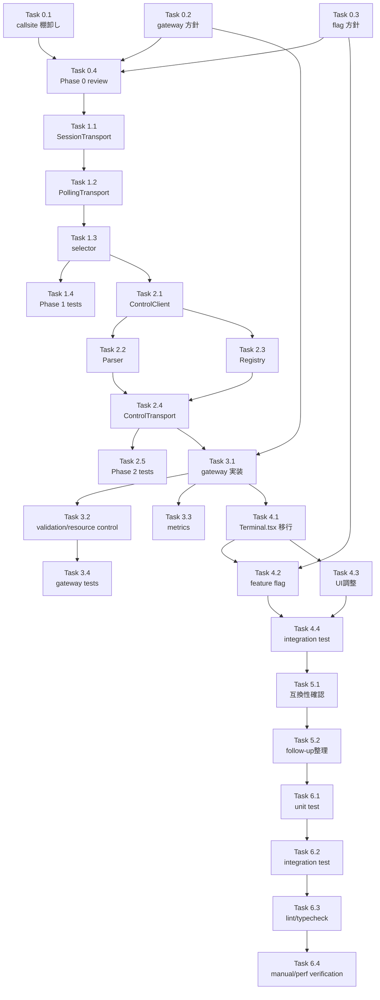

# 作業計画書: Issue #460

## Issue 概要

**タイトル**: feat: introduce tmux control mode transport for live terminal interaction
**Issue番号**: #460
**サイズ**: L
**優先度**: High
**依存Issue**: なし
**前提資料**:

- `dev-reports/issue/460/design-policy.md`
- `dev-reports/issue/460/design-review.md`
- `dev-reports/issue/460/issue-review/updated-issue-body.md`

### 目標

tmux を永続セッション backend として維持しつつ、terminal page の live interaction を `capture-pane` + polling 依存から段階的に切り離し、server-side の `tmux control mode` transport を導入する。

### 実装方針要約

1. `SessionTransport` abstraction を導入する
2. `PollingTmuxTransport` で既存挙動を保持する
3. `ControlModeTmuxTransport` を server-side gateway 経由で terminal page に適用する
4. worktree detail は即時全面移行せず、snapshot path を維持する
5. feature flag, snapshot fallback, idle cleanup, metrics を先に整える

---

## 詳細タスク分解

### Phase 0: 事前整理・設計確定

- [ ] **Task 0.1**: `tmux.ts` 直接利用箇所の棚卸し
  - 成果物: `dev-reports/issue/460/tmux-callsite-inventory.md`
  - 内容:
    - `tmux.ts` import 箇所を列挙
    - `SessionTransport` 経由へ置換対象と保留対象を分類
    - `response-poller.ts`, `current-output`, `terminal/route.ts`, CLI tool 固有処理の依存を整理
  - 依存: なし

- [ ] **Task 0.2**: terminal gateway 実装位置の確定
  - 成果物: `dev-reports/issue/460/gateway-decision.md`
  - 内容:
    - `ws-server.ts` 拡張案と専用 gateway 案を比較
    - 認証、権限制御、接続管理、既存利用箇所への影響を整理
    - 採用案を明記
  - 依存: なし

- [ ] **Task 0.3**: feature flag 方針の確定
  - 成果物: `dev-reports/issue/460/feature-flag-plan.md`
  - 内容:
    - flag 名
    - デフォルト値
    - terminal page 限定有効化の条件
    - rollback 条件
  - 依存: なし

- [ ] **Task 0.4**: Phase 0 レビュー
  - 内容:
    - 棚卸し・gateway 方針・flag 方針の整合確認
    - worktree detail を直ちに streaming 化しないことを再確認
  - 依存: Task 0.1, 0.2, 0.3

### Phase 1: transport abstraction 導入

- [ ] **Task 1.1**: `SessionTransport` 型定義追加
  - 成果物: `src/lib/session-transport.ts`
  - 内容:
    - `SessionTransport`
    - `TransportCapabilities`
    - `TransportHandlers`
    - `TransportSubscription`
    - `CaptureOptions`
  - 依存: Task 0.4

- [ ] **Task 1.2**: `PollingTmuxTransport` 実装
  - 成果物: `src/lib/transports/polling-tmux-transport.ts`
  - 内容:
    - 既存 `tmux.ts` / `tmux-capture-cache.ts` をラップ
    - capability は `streamingOutput=false`, `explicitResize=false`, `snapshotFallback=true`
    - 後方互換 transport として機能させる
  - 依存: Task 1.1

- [ ] **Task 1.3**: transport selector / facade 追加
  - 成果物: `src/lib/cli-session.ts` または新規 selector モジュール
  - 内容:
    - transport 取得窓口の追加
    - 既存 capture / session existence 呼び出しを polling transport 経由へ集約
  - 依存: Task 1.2

- [ ] **Task 1.4**: Phase 1 テスト追加
  - 成果物: `tests/unit/lib/...`
  - 内容:
    - transport interface の basic contract
    - polling transport capability
    - fallback path の後方互換性
  - 依存: Task 1.2, 1.3

### Phase 2: control-mode infrastructure 実装

- [ ] **Task 2.1**: `TmuxControlClient` 実装
  - 成果物: `src/lib/tmux-control-client.ts`
  - 内容:
    - tmux control mode subprocess 起動
    - stdout/stderr/event emitter 管理
    - close / kill / cleanup
  - 依存: Task 1.3

- [ ] **Task 2.2**: `TmuxControlParser` 実装
  - 成果物: `src/lib/tmux-control-parser.ts`
  - 内容:
    - control mode 出力の event 化
    - output / exit / error 相当イベントの抽出
    - parser 異常時の safe failure
  - 依存: Task 2.1

- [ ] **Task 2.3**: `TmuxControlRegistry` 実装
  - 成果物: `src/lib/tmux-control-registry.ts`
  - 内容:
    - sessionName 単位の client 共有
    - subscriber 管理
    - idle timeout
    - shutdown cleanup
  - 依存: Task 2.1, 2.2

- [ ] **Task 2.4**: `ControlModeTmuxTransport` 実装
  - 成果物: `src/lib/transports/control-mode-tmux-transport.ts`
  - 内容:
    - `SessionTransport` 実装
    - capability は `streamingOutput=true`, `explicitResize=true`, `snapshotFallback=true`
    - parser 異常時の snapshot fallback 方針を実装
  - 依存: Task 2.3

- [ ] **Task 2.5**: Phase 2 テスト追加
  - 成果物: `tests/unit/lib/...`
  - 内容:
    - parser fixture test
    - registry subscribe/unsubscribe
    - idle cleanup
    - transport capability / fallback
  - 依存: Task 2.2, 2.3, 2.4

### Phase 3: terminal gateway 実装

- [ ] **Task 3.1**: terminal stream gateway 実装
  - 成果物: 新規 API / WebSocket gateway
  - 内容:
    - authenticated subscribe
    - worktree boundary check
    - input / resize / unsubscribe handling
    - browser へ stream event 配信
  - 依存: Task 0.2, 2.4

- [ ] **Task 3.2**: input validation / resource control 実装
  - 成果物: gateway 実装内
  - 内容:
    - payload length 上限
    - resize 値 validation
    - subscriber 上限
    - idle timeout enforcement
  - 依存: Task 3.1

- [ ] **Task 3.3**: metrics / observability 実装
  - 成果物: gateway / registry / transport 周辺
  - 内容:
    - `capture-pane` 呼び出し回数
    - active control sessions
    - subscriber count
    - cleanup 回数
    - 最初の出力までの時間
  - 依存: Task 3.1

- [ ] **Task 3.4**: gateway テスト追加
  - 成果物: `tests/unit` または `tests/integration`
  - 内容:
    - unauthorized subscribe 拒否
    - invalid worktree 拒否
    - disconnect cleanup
    - parser 異常時 fallback
  - 依存: Task 3.1, 3.2

### Phase 4: terminal page 移行

- [ ] **Task 4.1**: `src/components/Terminal.tsx` の接続方式変更
  - 成果物: `src/components/Terminal.tsx`
  - 内容:
    - 既存の `ws://localhost:3000/terminal/...` 直結前提を廃止
    - app の authenticated terminal gateway へ接続
    - input / resize / reconnect を新契約に合わせる
  - 依存: Task 3.1

- [ ] **Task 4.2**: terminal page の feature flag 対応
  - 成果物: `src/app/worktrees/[id]/terminal/page.tsx` 周辺
  - 内容:
    - control mode 有効時のみ新経路使用
    - 無効時は既存 polling / fallback 経路へ戻せるようにする
  - 依存: Task 0.3, 4.1

- [ ] **Task 4.3**: terminal page UI 調整
  - 成果物: `src/components/Terminal.tsx`, 関連 UI
  - 内容:
    - connection status
    - fallback status 表示
    - reconnect 時の UX 調整
  - 依存: Task 4.1

- [ ] **Task 4.4**: terminal page integration test
  - 成果物: `tests/integration` または `tests/unit/components`
  - 内容:
    - input/output
    - resize
    - reconnect
    - fallback
  - 依存: Task 4.1, 4.2, 4.3

### Phase 5: 後方互換性確認と限定統合準備

- [ ] **Task 5.1**: `current-output` / `response-poller` 影響確認
  - 成果物: `dev-reports/issue/460/compatibility-check.md`
  - 内容:
    - 現行 snapshot path が壊れていないことを確認
    - worktree detail が未移行でも成立することを確認
  - 依存: Task 4.4

- [ ] **Task 5.2**: worktree detail 統合用フォローアップ整理
  - 成果物: `dev-reports/issue/460/follow-up-notes.md`
  - 内容:
    - active session view への限定統合条件
    - 残る polling 依存箇所
    - 将来削除候補の特殊ケース処理
  - 依存: Task 5.1

### Phase 6: 品質確認

- [ ] **Task 6.1**: targeted unit test 実行
  - コマンド候補:
    - `npm run test:unit -- tests/unit/lib/...`
    - `npm run test:unit -- tests/unit/components/...`
  - 依存: Phase 1-5 完了

- [ ] **Task 6.2**: integration test 実行
  - コマンド候補:
    - `npm run test:integration`
  - 依存: Task 6.1

- [ ] **Task 6.3**: lint / typecheck 実行
  - コマンド候補:
    - `npm run lint`
    - `npx tsc --noEmit`
  - 依存: Task 6.2

- [ ] **Task 6.4**: performance / manual verification
  - 内容:
    - live latency
    - active viewing 時の `capture-pane` 呼び出し回数
    - Codex / OpenCode TUI 操作確認
  - 依存: Task 6.3

---

## タスク依存関係

---

## 品質チェック項目

| チェック項目 | コマンド | 基準 |
|-------------|----------|------|
| TypeScript | `npx tsc --noEmit` | 型エラー 0件 |
| ESLint | `npm run lint` | エラー 0件 |
| Unit Test | `npm run test:unit` | 関連テスト全パス |
| Integration Test | `npm run test:integration` | 関連ケース全パス |
| Manual Verification | 手動 | terminal page の live input/output/resize/reconnect/fallback が成立 |

---

## 成果物チェックリスト

### ドキュメント

- [ ] `dev-reports/issue/460/tmux-callsite-inventory.md`
- [ ] `dev-reports/issue/460/gateway-decision.md`
- [ ] `dev-reports/issue/460/feature-flag-plan.md`
- [ ] `dev-reports/issue/460/compatibility-check.md`
- [ ] `dev-reports/issue/460/follow-up-notes.md`

### コード

- [ ] `src/lib/session-transport.ts`
- [ ] `src/lib/transports/polling-tmux-transport.ts`
- [ ] `src/lib/transports/control-mode-tmux-transport.ts`
- [ ] `src/lib/tmux-control-client.ts`
- [ ] `src/lib/tmux-control-parser.ts`
- [ ] `src/lib/tmux-control-registry.ts`
- [ ] terminal stream gateway 実装
- [ ] `src/components/Terminal.tsx`

### テスト

- [ ] transport unit tests
- [ ] parser / registry unit tests
- [ ] gateway tests
- [ ] terminal page integration tests

---

## 実装上の注意事項

1. **スコープ膨張防止**: terminal page を先行対象とし、worktree detail の全面移行は行わない
2. **認証境界維持**: browser から tmux control mode へ直接接続させない
3. **後方互換性**: `PollingTmuxTransport` を先に成立させ、既存 snapshot path を壊さない
4. **リーク対策**: subscriber 0 件時の idle cleanup、server shutdown cleanup を最優先で実装する
5. **性能評価**: 「速く感じる」ではなく `capture-pane` 回数、live latency、active session 数で評価する
6. **ログ方針**: raw output を無制限にログへ流さない
7. **fallback**: parser 異常時は fail-open ではなく snapshot fallback を使う

---

## Definition of Done

- [ ] Phase 0 の方針確定ドキュメントが作成済み
- [ ] `SessionTransport` と `PollingTmuxTransport` が導入されている
- [ ] `ControlModeTmuxTransport` と registry / parser / client が実装されている
- [ ] terminal page が feature flag 配下で control mode を使える
- [ ] terminal page で input/output/resize/reconnect/fallback が確認できる
- [ ] auth / worktree boundary / resource control が実装されている
- [ ] snapshot path の後方互換性が確認されている
- [ ] lint / typecheck / 関連テストがパスしている
- [ ] performance / manual verification の記録が残っている

---

## 次のアクション

1. Phase 0 ドキュメント作成
2. Phase 1-2 の TDD 実装開始
3. terminal gateway 実装
4. terminal page 切り替え
5. 品質確認と follow-up 整理

