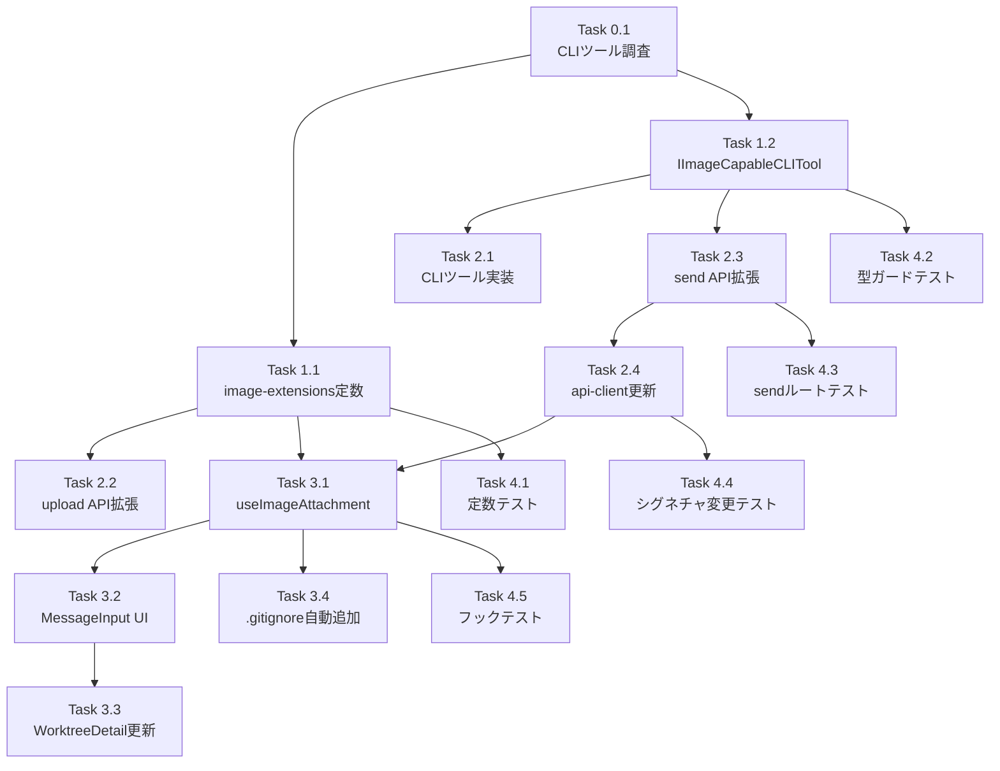

# 作業計画: Issue #474 メッセージ入力時画像ファイル添付機能

**Issue番号**: #474
**タイトル**: メッセージ入力時画像ファイルの添付をしたい
**サイズ**: L（多ファイル変更、セキュリティ考慮必要）
**優先度**: Medium
**依存Issue**: なし

---

## 設計方針書

`dev-reports/design/issue-474-image-attachment-design-policy.md`

---

## 詳細タスク分解

### Phase 0: 事前調査（ブロッキング）

- [ ] **Task 0.1**: 各CLIツールの画像送信方式調査
  - Claude CLI: `--image` フラグまたはマークダウン `` 記法の確認
  - Codex CLI: 画像サポート有無の確認
  - Gemini CLI: 画像サポート有無の確認
  - OpenCode CLI: 画像サポート有無の確認
  - Vibe Local: 画像サポート有無の確認（ローカルモデルのため非対応の可能性大）
  - 調査結果を設計方針書の「CLIツール別画像サポート方針」テーブルに反映
  - **成果物**: 設計方針書の更新
  - **依存**: なし

---

### Phase 1: 基盤整備（型定義・設定）

- [ ] **Task 1.1**: `image-extensions.ts` に添付用定数追加
  - `ATTACHABLE_IMAGE_EXTENSIONS`（SVG除外: png/jpg/jpeg/gif/webp）
  - `ATTACHABLE_IMAGE_ACCEPT`（ファイル選択ダイアログ用 accept 属性値）
  - **成果物**: `src/config/image-extensions.ts`（追記のみ）
  - **依存**: Task 0.1

- [ ] **Task 1.2**: `ICLITool` インターフェースに影響を与えずに `IImageCapableCLITool` を追加
  - `IImageCapableCLITool extends ICLITool` インターフェース定義
  - `isImageCapableCLITool()` 型ガード関数
  - `src/lib/cli-tools/index.ts` へのエクスポート追加
  - **成果物**: `src/lib/cli-tools/types.ts`（追記）、`src/lib/cli-tools/index.ts`（追記）
  - **依存**: Task 0.1

---

### Phase 2: バックエンド実装

- [ ] **Task 2.1**: 画像対応CLIツールの実装
  - Task 0.1の調査結果に基づき、画像対応ツールに `IImageCapableCLITool` を実装
  - 対象（調査後確定）: claude.ts / codex.ts / gemini.ts / opencode.ts（必要なものを実装）
  - vibe-local.ts: 非対応のため変更なし
  - **成果物**: `src/lib/cli-tools/claude.ts` 等（画像対応ツールのみ）
  - **依存**: Task 1.2

- [ ] **Task 2.2**: upload API の `.commandmate/attachments/` パス許可
  - `src/app/api/worktrees/[id]/upload/[...path]/route.ts` の制限確認・調整
  - `.commandmate/attachments/` ディレクトリの自動作成ロジック追加（`mkdirSync` recursive）
  - **成果物**: `src/app/api/worktrees/[id]/upload/[...path]/route.ts`（変更少）
  - **依存**: Task 1.1

- [ ] **Task 2.3**: send API に `imagePath` パラメータを追加
  - `SendMessageRequest` 型に `imagePath?: string` 追加
  - URLスキーム拒否バリデーション（SSRF対策: file://, http://, data: 等）
  - `.commandmate/attachments/` プレフィックスのホワイトリスト検証
  - `isPathSafe()` によるパストラバーサル防御
  - `isImageCapableCLITool()` 型ガードによる送信方式振り分け
  - フォールバック時のCLIインジェクション対策（制御文字チェック + プレフィックス検証）
  - **成果物**: `src/app/api/worktrees/[id]/send/route.ts`
  - **依存**: Task 1.2

- [ ] **Task 2.4**: `api-client.ts` の `sendMessage` と `uploadImageFile` を更新
  - `sendMessage` の第3引数を位置引数 `cliToolId?` からオブジェクト形式 `options?: { cliToolId?, imagePath? }` に変更
  - `uploadImageFile` メソッド追加（`FormData` を直接 `fetch()` で送信、`fetchApi` ラッパー不使用）
  - **成果物**: `src/lib/api-client.ts`
  - **依存**: Task 2.3

---

### Phase 3: フロントエンド実装

- [ ] **Task 3.1**: `useImageAttachment` カスタムフック実装
  - 状態管理: `attachedImage`（file + path）、`isUploading`、`error`
  - ファイル選択→バリデーション→即時アップロードのフロー
  - `ATTACHABLE_IMAGE_ACCEPT` を accept 属性として使用
  - 送信後リセット（`resetAfterSend`）
  - **成果物**: `src/hooks/useImageAttachment.ts`（新規）
  - **依存**: Task 1.1, Task 2.4

- [ ] **Task 3.2**: `MessageInput.tsx` に画像添付ボタンを追加
  - `useImageAttachment` フックを使用（SRP準拠）
  - 添付ボタン（hiddenファイルインプット呼び出し）
  - ファイル名表示と削除ボタン
  - アップロードエラー表示
  - 送信時に `sendMessage(id, content, { cliToolId, imagePath })` を呼び出すよう変更
  - **成果物**: `src/components/worktree/MessageInput.tsx`
  - **依存**: Task 3.1

- [ ] **Task 3.3**: `WorktreeDetailRefactored.tsx` の MessageInput 呼び出し箇所を更新
  - MessageInput のprops変更への対応（あれば）
  - `worktreeApi.uploadImageFile` を `useImageAttachment` に渡す処理
  - **成果物**: `src/components/worktree/WorktreeDetailRefactored.tsx`
  - **依存**: Task 3.2

- [ ] **Task 3.4**: `.gitignore` 自動追加（ベストエフォート）
  - 画像を初めてアップロードする際に `.commandmate/attachments/` を worktree の `.gitignore` に追記
  - 失敗してもアップロードは継続（警告トーストを表示）
  - **成果物**: `src/lib/api-client.ts` または `useImageAttachment.ts` に組み込み
  - **依存**: Task 3.1

---

### Phase 4: テスト実装

- [ ] **Task 4.1**: `image-extensions.ts` の追加定数のユニットテスト
  - `ATTACHABLE_IMAGE_EXTENSIONS` に SVG が含まれないこと
  - `ATTACHABLE_IMAGE_ACCEPT` の形式確認
  - **成果物**: `tests/unit/config/image-extensions-attachment.test.ts`（新規）または既存ファイルへ追記
  - **依存**: Task 1.1

- [ ] **Task 4.2**: `IImageCapableCLITool` 型ガードのユニットテスト
  - `isImageCapableCLITool()` が正しく判定できること
  - 画像対応ツール / 非対応ツールの両方をテスト
  - **成果物**: `tests/unit/cli-tools/types.test.ts`（追記）
  - **依存**: Task 1.2

- [ ] **Task 4.3**: send/route.ts の画像パスバリデーションテスト
  - 正常系: `.commandmate/attachments/xxx.png` を指定
  - URLスキーム拒否: `file://`, `http://` 等を指定
  - パストラバーサル: `../../../etc/passwd` を指定
  - プレフィックス違反: `.commandmate/other/xxx.png` を指定
  - **成果物**: `tests/integration/api-send-cli-tool.test.ts`（追記）
  - **依存**: Task 2.3

- [ ] **Task 4.4**: `api-client.ts` の `sendMessage` シグネチャ変更に伴うテスト更新
  - `MessageInput.test.tsx` の9箇所のアサーションをオブジェクト形式に更新
  - `issue-288-acceptance.test.tsx` の3箇所のアサーションをオブジェクト形式に更新
  - **成果物**: `tests/unit/components/MessageInput.test.tsx`、`tests/integration/issue-288-acceptance.test.tsx`
  - **依存**: Task 2.4

- [ ] **Task 4.5**: `useImageAttachment` フックのユニットテスト
  - ファイル選択→アップロード→状態更新のフロー
  - エラー時の状態管理
  - `resetAfterSend` の動作確認
  - **成果物**: `tests/unit/hooks/useImageAttachment.test.ts`（新規）
  - **依存**: Task 3.1

---

## タスク依存関係

---

## 品質チェック項目

| チェック項目 | コマンド | 基準 |
|-------------|----------|------|
| ESLint | `npm run lint` | エラー0件 |
| TypeScript | `npx tsc --noEmit` | 型エラー0件 |
| Unit Test | `npm run test:unit` | 全テストパス |
| Build | `npm run build` | 成功 |

---

## 成果物チェックリスト

### 新規ファイル
- [ ] `src/hooks/useImageAttachment.ts`
- [ ] `tests/unit/hooks/useImageAttachment.test.ts`

### 変更ファイル
- [ ] `src/config/image-extensions.ts`（定数追加）
- [ ] `src/lib/cli-tools/types.ts`（IImageCapableCLITool追加）
- [ ] `src/lib/cli-tools/index.ts`（エクスポート追加）
- [ ] `src/lib/cli-tools/claude.ts`（調査結果次第）
- [ ] `src/lib/cli-tools/codex.ts`（調査結果次第）
- [ ] `src/lib/cli-tools/gemini.ts`（調査結果次第）
- [ ] `src/lib/cli-tools/opencode.ts`（調査結果次第）
- [ ] `src/app/api/worktrees/[id]/upload/[...path]/route.ts`
- [ ] `src/app/api/worktrees/[id]/send/route.ts`
- [ ] `src/lib/api-client.ts`
- [ ] `src/components/worktree/MessageInput.tsx`
- [ ] `src/components/worktree/WorktreeDetailRefactored.tsx`
- [ ] `tests/unit/cli-tools/types.test.ts`（追記）
- [ ] `tests/integration/api-send-cli-tool.test.ts`（追記）
- [ ] `tests/unit/components/MessageInput.test.tsx`（シグネチャ修正）
- [ ] `tests/integration/issue-288-acceptance.test.tsx`（シグネチャ修正）

---

## Definition of Done

- [ ] Task 0.1の調査結果が設計方針書に反映されている
- [ ] 全テストパス（`npm run test:unit`）
- [ ] TypeScriptエラー0件（`npx tsc --noEmit`）
- [ ] ESLintエラー0件（`npm run lint`）
- [ ] ビルド成功（`npm run build`）
- [ ] 画像対応CLIツールで画像を添付してメッセージ送信できること
- [ ] 画像非対応ツールでフォールバック（パス埋め込み）送信できること
- [ ] 既存のテキストのみ送信が壊れないこと

---

## 次のアクション

1. **Task 0.1** を最初に実行（CLIツール画像送信方式の調査）
2. Phase 1 → Phase 2 → Phase 3 → Phase 4 の順で実装
3. `/pm-auto-dev 474` で TDD自動開発を実行

---

*Generated by /work-plan command for Issue #474*
*Design policy: dev-reports/design/issue-474-image-attachment-design-policy.md*
