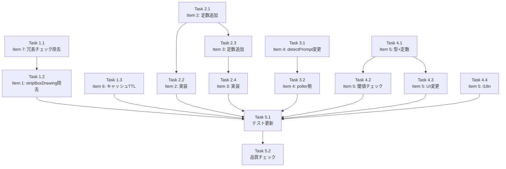

# 作業計画書: Issue #499

## Issue: perf: Auto-Yes ポーリング性能改善（7項目）
**Issue番号**: #499
**サイズ**: L
**優先度**: Medium
**依存Issue**: なし

## 詳細タスク分解

### Phase 1: 低リスク改善（Item 7 → Item 1 → Item 6）

#### Task 1.1: Item 7 - validatePollingContext冗長チェック除去
- **成果物**: `src/lib/auto-yes-poller.ts`
- **変更内容**:
  - L217: `if (!autoYesState?.enabled || isAutoYesExpired(autoYesState))` → `if (!autoYesState?.enabled)`
  - コメント追記: getAutoYesState()内でisAutoYesExpired→disableAutoYes済みのためenabledチェックのみで十分
- **テスト**: コードレビューで確認（既存テストパスで検証）
- **依存**: なし

#### Task 1.2: Item 1 - stripBoxDrawing二重呼び出し除去
- **成果物**: `src/lib/auto-yes-poller.ts`
- **変更内容**:
  - L318: `detectPrompt(stripBoxDrawing(cleanOutput), ...)` → `detectPrompt(cleanOutput, ...)`
- **テスト**: `vi.spy`でstripBoxDrawing呼び出し回数=1を検証
- **テストファイル**: `tests/unit/lib/auto-yes-manager.test.ts`
- **依存**: Task 1.1

#### Task 1.3: Item 6 - キャッシュTTL変更
- **成果物**: `src/lib/tmux/tmux-capture-cache.ts`
- **変更内容**:
  - L39: `CACHE_TTL_MS = 2000` → `CACHE_TTL_MS = 3000`
- **テスト**: 定数値テスト更新
- **テストファイル**: `tests/unit/lib/tmux-capture-cache.test.ts` (L52: 2000→3000), `tests/unit/lib/tmux-capture-invalidation.test.ts` (L89: 2000→3000)
- **依存**: なし（Task 1.1, 1.2と並行可能）

### Phase 2: ポーリング効率化（Item 2 → Item 3）

#### Task 2.1: Item 2 - Thinking検出時ポーリング間隔延長（定数追加）
- **成果物**: `src/config/auto-yes-config.ts`
- **変更内容**:
  - `THINKING_POLLING_INTERVAL_MS = 5000` 定数追加
- **テスト**: 定数値テスト
- **依存**: なし

#### Task 2.2: Item 2 - Thinking検出時ポーリング間隔延長（実装）
- **成果物**: `src/lib/auto-yes-poller.ts`
- **変更内容**:
  - L407: `scheduleNextPoll(worktreeId, cliToolId)` → `scheduleNextPoll(worktreeId, cliToolId, THINKING_POLLING_INTERVAL_MS)`
- **テスト**: Thinking検出→scheduleNextPollの間隔=5sを検証
- **テストファイル**: `tests/unit/lib/auto-yes-manager.test.ts`
- **依存**: Task 2.1

#### Task 2.3: Item 3 - stopPattern未設定時キャプチャ行数削減（定数追加）
- **成果物**: `src/config/auto-yes-config.ts`
- **変更内容**:
  - `REDUCED_CAPTURE_LINES = 300` 定数追加
  - `FULL_CAPTURE_LINES = 5000` 定数追加
- **テスト**: 定数値テスト
- **依存**: Task 2.1（同ファイル）

#### Task 2.4: Item 3 - stopPattern未設定時キャプチャ行数削減（実装）
- **成果物**: `src/lib/auto-yes-poller.ts`
- **変更内容**:
  - `captureAndCleanOutput()`にcaptureLines引数追加
  - stopPattern有無で行数を分岐
- **テスト**: stopPattern有無でcaptureSessionOutputの引数行数が異なることを検証
- **テストファイル**: `tests/unit/lib/auto-yes-manager.test.ts`
- **依存**: Task 2.3

### Phase 3: インターフェース変更（Item 4）

#### Task 3.1: Item 4 - detectPromptにprecomputedLines追加
- **成果物**: `src/lib/detection/prompt-detector.ts`
- **変更内容**:
  - `DetectPromptOptions`に`precomputedLines?: string[]`追加
  - `detectPrompt()`内で`options?.precomputedLines ?? output.split('\n')`を使用
- **テスト**: precomputedLinesが渡された場合にsplit不実行を検証
- **テストファイル**: `tests/unit/prompt-detector.test.ts`
- **依存**: なし

#### Task 3.2: Item 4 - auto-yes-poller側のsplit再利用
- **成果物**: `src/lib/auto-yes-poller.ts`
- **変更内容**:
  - `pollAutoYes()`内で1回だけ`cleanOutput.split('\n')`
  - Thinking検出: `lines.slice(-THINKING_CHECK_LINE_COUNT).join('\n')`を使用
  - `detectAndRespondToPrompt()`にlines引数追加、`detectPrompt()`にprecomputedLinesとして渡す
- **テスト**: 既存テストパス + Item 4単体テスト
- **テストファイル**: `tests/unit/lib/auto-yes-manager.test.ts`
- **依存**: Task 3.1

### Phase 4: エラー上限停止 + UI（Item 5）

#### Task 4.1: Item 5 - AutoYesStopReason型拡張 + 定数追加
- **成果物**: `src/config/auto-yes-config.ts`
- **変更内容**:
  - `AutoYesStopReason`に`'consecutive_errors'`追加
  - `AUTO_STOP_ERROR_THRESHOLD = 20` 追加
- **テスト**: 型テスト、定数値テスト
- **テストファイル**: `tests/unit/config/auto-yes-config.test.ts`
- **依存**: なし

#### Task 4.2: Item 5 - incrementErrorCount内閾値チェック追加
- **成果物**: `src/lib/auto-yes-poller.ts`
- **変更内容**:
  - `incrementErrorCount()`内末尾に閾値チェック追加
  - `pollerState.consecutiveErrors >= AUTO_STOP_ERROR_THRESHOLD`で`disableAutoYes(worktreeId, 'consecutive_errors')` + `stopAutoYesPolling(worktreeId)`
- **テスト**: 連続エラー20回→disableAutoYes('consecutive_errors')呼び出しを検証
- **テストファイル**: `tests/unit/lib/auto-yes-manager.test.ts`, `tests/unit/auto-yes-manager-cleanup.test.ts`
- **依存**: Task 4.1

#### Task 4.3: Item 5 - UI stopReason通知（state変更 + Toast分岐）
- **成果物**: `src/components/worktree/WorktreeDetailRefactored.tsx`
- **変更内容**:
  - L202: `stopReasonPending: boolean` → `pendingStopReason: AutoYesStopReason | null`
  - L391: `consecutive_errors`条件分岐追加、`setPendingStopReason(data.autoYes.stopReason)`
  - L784-786: stopReason値別のToast分岐（info/warning）
- **テスト**: stopReason別Toast表示レベル検証、stop_pattern_matchedリグレッションテスト
- **依存**: Task 4.1

#### Task 4.4: Item 5 - i18n翻訳キー追加
- **成果物**: `locales/ja/autoYes.json`, `locales/en/autoYes.json`
- **変更内容**:
  - `"consecutiveErrorsStopped"` キー追加
- **テスト**: ビルド時に検証
- **依存**: なし（Task 4.3と並行可能）

### Phase 5: テスト・品質検証

#### Task 5.1: 既存テストの更新
- **成果物**: 影響テストファイル全体
- **変更内容**:
  - stripBoxDrawing呼び出し回数の期待値更新（必要に応じて）
  - CACHE_TTL_MSアサーション更新
  - auto-yes-config型テスト更新
- **依存**: Phase 1-4全完了

#### Task 5.2: 品質チェック実行
- **コマンド**:
  - `npx tsc --noEmit`
  - `npm run lint`
  - `npm run test:unit`
- **依存**: Task 5.1

## タスク依存関係

## 並列実行可能グループ

| グループ | タスク | 理由 |
|---------|-------|------|
| A | Task 1.1→1.2, Task 1.3 | 異なるファイル |
| B | Task 2.1→2.2→2.3→2.4 | 同一config→同一poller |
| C | Task 3.1→3.2 | prompt-detector→poller |
| D | Task 4.1→4.2, Task 4.1→4.3, Task 4.4 | config→poller/UI並行 |

**推奨TDD実装順序**: A → B → C → D → テスト更新 → 品質チェック

## 品質チェック項目

| チェック項目 | コマンド | 基準 |
|-------------|----------|------|
| TypeScript | `npx tsc --noEmit` | 型エラー0件 |
| ESLint | `npm run lint` | エラー0件 |
| Unit Test | `npm run test:unit` | 全テストパス |
| Build | `npm run build` | 成功 |

## 成果物チェックリスト

### コード変更
- [ ] `src/config/auto-yes-config.ts` - 定数3つ + 型拡張
- [ ] `src/lib/auto-yes-poller.ts` - Item 1,2,3,4,5,7の6項目
- [ ] `src/lib/detection/prompt-detector.ts` - precomputedLines対応
- [ ] `src/lib/tmux/tmux-capture-cache.ts` - TTL変更
- [ ] `src/components/worktree/WorktreeDetailRefactored.tsx` - stopReason UI
- [ ] `locales/ja/autoYes.json` - i18n追加
- [ ] `locales/en/autoYes.json` - i18n追加

### テスト
- [ ] stripBoxDrawing呼び出し回数テスト
- [ ] Thinking間隔テスト
- [ ] キャプチャ行数テスト
- [ ] precomputedLinesテスト
- [ ] 連続エラー停止テスト
- [ ] UI stopReasonテスト + リグレッションテスト
- [ ] 既存テスト更新

## Definition of Done

- [ ] 全7項目の改善が実装済み
- [ ] 新規テスト追加 + 既存テスト更新
- [ ] `npx tsc --noEmit` パス
- [ ] `npm run lint` パス
- [ ] `npm run test:unit` 全パス
- [ ] `npm run build` 成功

## 次のアクション

1. `/pm-auto-dev 499` でTDD自動開発を実行
2. 完了後 `/create-pr` でPR作成

---

*Generated by /work-plan command for Issue #499*
