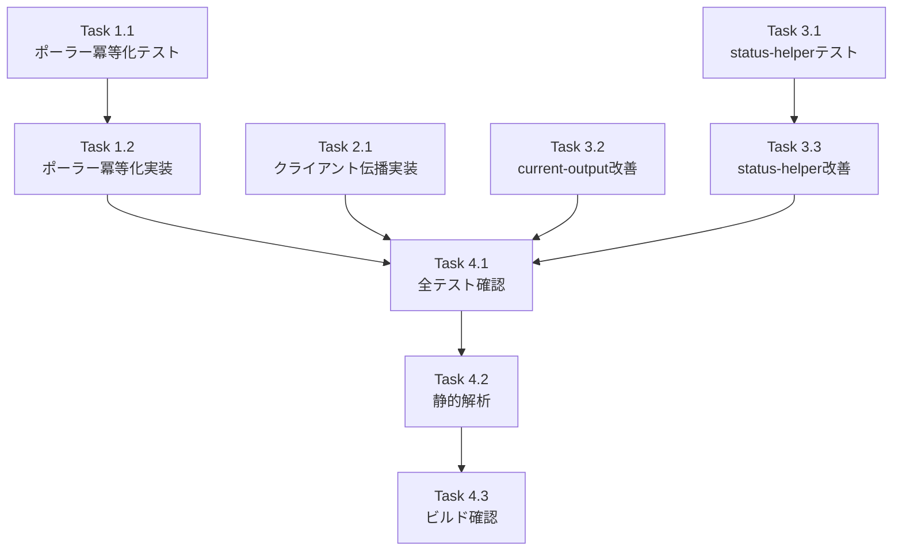

# 作業計画書: Issue #501

## Issue: fix: Auto-Yesサーバー/クライアント二重応答とポーラー再作成によるステータス不安定
**Issue番号**: #501
**サイズ**: M
**優先度**: High
**依存Issue**: なし（Issue #138の未完成部分の完成）

---

## 詳細タスク分解

### Phase 1: 対策2 - ポーラー冪等化（最優先・他対策の前提条件）

- [ ] **Task 1.1**: `startAutoYesPolling()` 冪等化テスト作成（Red）
  - 成果物: `tests/unit/lib/auto-yes-manager.test.ts`（既存ファイルにテスト追加）
  - テスト内容:
    - 同一 `worktreeId` + 同一 `cliToolId` で再呼び出し → ポーラー再作成されない（`already_running`）
    - 同一 `worktreeId` + 異なる `cliToolId` で再呼び出し → ポーラー停止→再作成
    - `already_running` 時の戻り値が `{ started: true, reason: 'already_running' }`
    - ポーラー状態（`lastAnsweredPromptKey`, `lastServerResponseTimestamp` 等）が再利用時に保持される
  - 依存: なし

- [ ] **Task 1.2**: `startAutoYesPolling()` 冪等化実装（Green）
  - 成果物: `src/lib/auto-yes-poller.ts`
  - 変更内容:
    - L491-494: 既存ポーラーの `cliToolId` 比較ロジック追加
    - 同一 `cliToolId` なら `stopAutoYesPolling()` をスキップし `{ started: true, reason: 'already_running' }` を返す
    - 異なる `cliToolId` の場合のみ既存の stop → create フローを実行
  - 依存: Task 1.1

### Phase 2: 対策1 - lastServerResponseTimestamp クライアント伝播

- [ ] **Task 2.1**: `WorktreeDetailRefactored.tsx` 型・状態追加
  - 成果物: `src/components/worktree/WorktreeDetailRefactored.tsx`
  - 変更内容（4箇所）:
    1. `CurrentOutputResponse` interfaceに `lastServerResponseTimestamp?: number | null` 追加
    2. `useState<number | null>(null)` で `lastServerResponseTimestamp` state追加
    3. `fetchCurrentOutput()` 内で `data.lastServerResponseTimestamp` を `setLastServerResponseTimestamp()` で保存
    4. `useAutoYes()` 呼び出し（L961-967）に `lastServerResponseTimestamp` 引数追加
  - 依存: なし（対策2とは独立して実装可能だが、効果は対策2と組み合わせて最大化）

### Phase 3: 対策3 - ステータス検出改善

- [ ] **Task 3.1**: `worktree-status-helper.ts` テスト作成（Red）
  - 成果物: `tests/unit/lib/worktree-status-helper.test.ts`（新規作成）
  - テスト内容:
    - `getLastServerResponseTimestamp()` が値を返す場合、`detectSessionStatus()` に `Date` 型で渡されること
    - `getLastServerResponseTimestamp()` が `null` を返す場合、`undefined` が渡されること
    - Auto-Yes未使用のworktreeでは既存動作に影響しないこと
  - 依存: なし

- [ ] **Task 3.2**: `current-output/route.ts` ステータス検出改善
  - 成果物: `src/app/api/worktrees/[id]/current-output/route.ts`
  - 変更内容:
    - L86: `detectSessionStatus(output, cliToolId)` → `detectSessionStatus(output, cliToolId, lastServerResponseTimestamp ? new Date(lastServerResponseTimestamp) : undefined)`
    - L111で既に取得済みの `lastServerResponseTimestamp` を活用（変数宣言順序の調整が必要な場合あり）
  - 依存: なし

- [ ] **Task 3.3**: `worktree-status-helper.ts` ステータス検出改善
  - 成果物: `src/lib/session/worktree-status-helper.ts`
  - 変更内容:
    - `getLastServerResponseTimestamp` を `auto-yes-manager` からimport
    - `detectSessionStatus()` 呼び出し（L91）に `lastOutputTimestamp` 引数追加
    - `number | null` → `Date | undefined` の型変換
  - 依存: Task 3.1

### Phase 4: 検証・品質保証

- [ ] **Task 4.1**: 既存テスト全パス確認
  - コマンド: `npm run test:unit`
  - 既存のAuto-Yes関連テストが全てパスすること
  - 依存: Task 1.2, 2.1, 3.2, 3.3

- [ ] **Task 4.2**: 静的解析
  - コマンド: `npx tsc --noEmit && npm run lint`
  - 型エラー・lint エラー 0件
  - 依存: Task 4.1

- [ ] **Task 4.3**: ビルド確認
  - コマンド: `npm run build`
  - ビルド成功
  - 依存: Task 4.2

---

## タスク依存関係

**並列実行可能なタスク**:
- Task 1.1 / Task 2.1 / Task 3.1 / Task 3.2 は並列実行可能
- Task 1.2 は Task 1.1 完了後
- Task 3.3 は Task 3.1 完了後

---

## 品質チェック項目

| チェック項目 | コマンド | 基準 |
|-------------|----------|------|
| TypeScript | `npx tsc --noEmit` | 型エラー0件 |
| ESLint | `npm run lint` | エラー0件 |
| Unit Test | `npm run test:unit` | 全テストパス |
| Build | `npm run build` | 成功 |

---

## 成果物チェックリスト

### コード変更
- [ ] `src/lib/auto-yes-poller.ts` - startAutoYesPolling() 冪等化
- [ ] `src/components/worktree/WorktreeDetailRefactored.tsx` - 型・state・fetch・useAutoYes引数
- [ ] `src/app/api/worktrees/[id]/current-output/route.ts` - detectSessionStatus() lastOutputTimestamp
- [ ] `src/lib/session/worktree-status-helper.ts` - import追加・detectSessionStatus() lastOutputTimestamp

### テスト
- [ ] `tests/unit/lib/auto-yes-manager.test.ts` - ポーラー冪等化テスト追加
- [ ] `tests/unit/lib/worktree-status-helper.test.ts` - 新規作成

### 変更不要ファイル（確認のみ）
- `src/hooks/useAutoYes.ts` - 引数が正しく渡されるようになる（変更不要）
- `src/lib/detection/status-detector.ts` - 既存ロジック活用（変更不要）
- `src/app/api/worktrees/[id]/auto-yes/route.ts` - started:trueの挙動変更なし（変更不要の可能性高）

---

## Definition of Done

- [ ] すべてのタスク（Task 1.1〜4.3）が完了
- [ ] 既存テスト + 新規テスト全パス
- [ ] `npx tsc --noEmit` パス
- [ ] `npm run lint` パス
- [ ] `npm run build` 成功
- [ ] Issue #501 の受入条件を全て満たす

---

## 次のアクション

1. **TDD実装開始**: `/pm-auto-dev 501` で自動開発
2. **進捗報告**: `/progress-report` で定期報告
3. **PR作成**: `/create-pr` で自動作成
