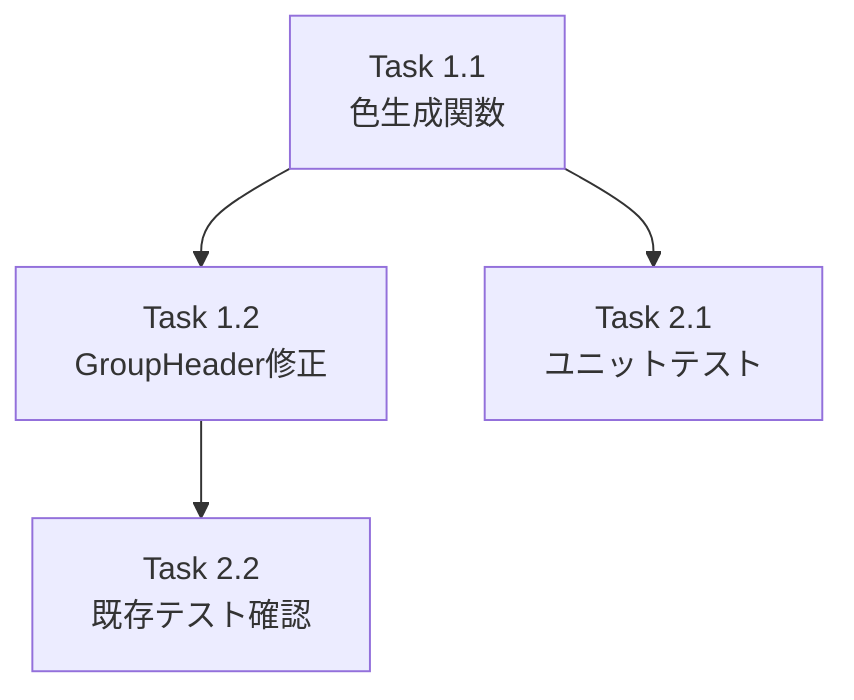

# 作業計画: Issue #504

## Issue: サイドバーのリポジトリグループヘッダーに色付きドットを追加
**Issue番号**: #504
**サイズ**: S
**優先度**: Medium
**依存Issue**: なし

---

## 詳細タスク分解

### Phase 1: 実装タスク

#### Task 1.1: 色生成ユーティリティ関数の追加
- **成果物**: `src/lib/sidebar-utils.ts`（既存ファイルに追加）
- **依存**: なし
- **内容**:
  - `simpleHash(str: string): number` — モジュール内プライベート関数（非エクスポート）
  - `generateRepositoryColor(repositoryName: string): string` — エクスポート関数
  - 彩度・明度は名前付き定数（`REPO_DOT_SATURATION`, `REPO_DOT_LIGHTNESS`）で定義
  - HSL形式の文字列を返す（例: `"hsl(210, 65%, 60%)"`)
- **変更量**: +20行程度

#### Task 1.2: GroupHeaderに色付きドットを追加
- **成果物**: `src/components/layout/Sidebar.tsx`（既存ファイルを修正）
- **依存**: Task 1.1
- **内容**:
  - `generateRepositoryColor`をsidebar-utilsからimport
  - GroupHeaderコンポーネント内にColorDot要素を追加
  - 配置: ChevronIconの後、GroupIconの前
  - サイズ: `w-2.5 h-2.5 rounded-full flex-shrink-0`
  - 色適用: `style={{ backgroundColor: generateRepositoryColor(repositoryName) }}`
- **変更量**: +5行程度

### Phase 2: テストタスク

#### Task 2.1: generateRepositoryColor関数のユニットテスト
- **成果物**: `tests/unit/lib/sidebar-utils.test.ts`（既存ファイルに追加）
- **依存**: Task 1.1
- **内容**:
  - 冪等性テスト: 同一名で同一色
  - 多様性テスト: 異なる名前で異なるhue値（事前に衝突しない入力値を使用）
  - エッジケース: 空文字列、特殊文字、日本語、長い名前
  - フォーマットテスト: HSL形式 `/^hsl\(\d+, \d+%, \d+%\)$/`
- **変更量**: +40行程度

#### Task 2.2: 既存テストの確認
- **成果物**: `tests/unit/components/layout/Sidebar.test.tsx`（確認のみ、変更不要の見込み）
- **依存**: Task 1.2
- **内容**:
  - 既存のGroupHeader関連テスト（data-testid="group-header"）が引き続きパスすることを確認
  - テストが失敗した場合のみ修正

---

## タスク依存関係

## TDD実装順序

1. **RED**: Task 2.1のテストを先に記述（generateRepositoryColorのテスト）
2. **GREEN**: Task 1.1の実装（テストをパスさせる）
3. **REFACTOR**: 必要に応じてリファクタリング
4. **UI実装**: Task 1.2（GroupHeaderへのドット追加）
5. **確認**: Task 2.2（既存テストの動作確認）

---

## 品質チェック項目

| チェック項目 | コマンド | 基準 |
|-------------|----------|------|
| ESLint | `npm run lint` | エラー0件 |
| TypeScript | `npx tsc --noEmit` | 型エラー0件 |
| Unit Test | `npm run test:unit` | 全テストパス |
| Build | `npm run build` | 成功 |

---

## 成果物チェックリスト

### コード
- [ ] `src/lib/sidebar-utils.ts` — generateRepositoryColor関数
- [ ] `src/components/layout/Sidebar.tsx` — GroupHeaderに色ドット追加

### テスト
- [ ] `tests/unit/lib/sidebar-utils.test.ts` — ユニットテスト追加
- [ ] `tests/unit/components/layout/Sidebar.test.tsx` — 既存テストパス確認

---

## Definition of Done

- [ ] すべてのタスクが完了
- [ ] `npm run test:unit` 全パス
- [ ] `npm run lint` エラー0件
- [ ] `npx tsc --noEmit` エラー0件
- [ ] 同一リポジトリ名で常に同じ色が表示される
- [ ] 異なるリポジトリ名で視覚的に区別可能な色が表示される
- [ ] CLIステータスドットとデザインが混同しない

---

## 次のアクション

1. `/pm-auto-dev 504` でTDD自動開発を実行
2. `/create-pr` でPR作成

---

*Generated by work-plan command for Issue #504*
