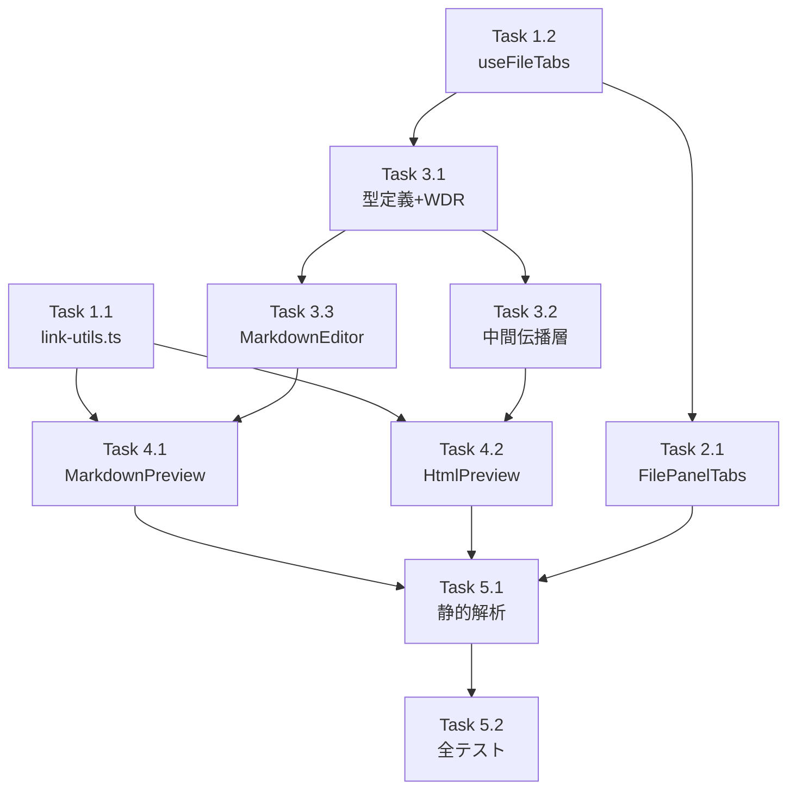

# 作業計画: Issue #505 ファイル内リンクナビゲーション

## Issue概要

**Issue番号**: #505
**タイトル**: ファイル内リンクへの対応
**サイズ**: L（10+ファイル変更、新規モジュール追加、テスト追加）
**優先度**: Medium
**依存Issue**: なし

## 詳細タスク分解

### Phase 1: 共通基盤（依存なし）

#### Task 1.1: link-utils.ts 共通ユーティリティ新規作成
- **成果物**: `src/lib/link-utils.ts`
- **依存**: なし
- **内容**:
  - `LinkType` 型定義（`'anchor' | 'external' | 'relative'`）
  - `classifyLink(href: string): LinkType` 関数
  - `resolveRelativePath(currentFilePath: string, href: string): string | null` 関数
  - `sanitizeHref(href: string): string | null` 関数（最大2048文字、制御文字排除）[DR4-003]
  - パスバリデーションはUX目的の簡易チェックのみ、サーバーサイド主防御を明記 [DR1-005]
  - rehype-sanitize 用アローリストスキーマ定数 [DR4-001]
- **テスト**: `tests/unit/lib/link-utils.test.ts`（新規）
  - classifyLink: anchor/external/relative 判定
  - resolveRelativePath: `./`, `../`, ネスト、空パス、ルート参照
  - sanitizeHref: 長さ制限、制御文字排除
  - アローリストスキーマ: http/https/mailto/tel/相対パス許可、javascript:/data:/vbscript: 拒否

#### Task 1.2: useFileTabs reducer 拡張
- **成果物**: `src/hooks/useFileTabs.ts`（既存修正）
- **依存**: なし
- **内容**:
  - `MAX_FILE_TABS` を 5 → 30 に変更
  - `MOVE_TO_FRONT` アクション追加（FileTabsAction union型に追加）
  - `MOVE_TO_FRONT` reducer ケース実装
  - `moveToFront(path: string): void` メソッドを `UseFileTabsReturn` に追加 [DR1-003]
- **テスト**: `tests/unit/hooks/useFileTabs.test.ts`（既存追加）
  - MOVE_TO_FRONT: タブがインデックス0に移動
  - MOVE_TO_FRONT: 既に先頭のタブは順序不変
  - MOVE_TO_FRONT: activeIndex が 0 に更新
  - MAX_FILE_TABS=30 でタブ開閉が正常動作
  - RESTORE: 30タブまでリストア可能

### Phase 2: タブUI改善

#### Task 2.1: FilePanelTabs ドロップダウンUI
- **成果物**: `src/components/worktree/FilePanelTabs.tsx`（既存修正）
- **依存**: Task 1.2
- **内容**:
  - 先頭5タブをタブバーに表示、6番目以降はドロップダウン
  - `[▼ +N]` ドロップダウンボタン追加
  - タブバークリック → `ACTIVATE_TAB`（順序維持）
  - ドロップダウン選択 → `MOVE_TO_FRONT`（先頭移動）[DR1-009]
  - `onOpenFile?: (path: string) => void` props 追加（パススルー）[DR2-009]
  - ドロップダウン肥大化時は TabDropdownMenu 切り出し検討 [DR1-008]
- **テスト**: `tests/unit/components/FilePanelTabs.test.tsx`（既存追加）
  - タブ5個以下: ドロップダウン非表示
  - タブ6個以上: ドロップダウン表示、+N表記
  - ドロップダウン選択でタブ先頭移動
  - mock に onOpenFile 追加 [DR3-006]

### Phase 3: onOpenFile コールバック伝播チェーン

#### Task 3.1: 型定義 + コントローラー層
- **成果物**:
  - `src/types/markdown-editor.ts`（EditorProps に onOpenFile 追加）
  - `src/components/worktree/WorktreeDetailRefactored.tsx`（onOpenFile 起点、showTabLimitToast）
- **依存**: Task 1.2
- **内容**:
  - `EditorProps` に `onOpenFile?: (path: string) => void` 追加
  - `showTabLimitToast()` ヘルパー関数作成（MAX_FILE_TABS 参照の動的メッセージ）[DR1-010, DR2-003]
  - `handleFilePathClick` と `handleFileSelect` の Toast を `showTabLimitToast()` に統一 [F7-003]
  - onOpenFile コールバック定義（fileTabs.openFile → result判定 → Toast通知）

#### Task 3.2: 中間伝播層
- **成果物**:
  - `src/components/worktree/WorktreeDetailSubComponents.tsx`（onOpenFile 追加）[DR3-001]
  - `src/components/worktree/FilePanelSplit.tsx`（onOpenFile optional props 追加）
  - `src/components/worktree/FilePanelContent.tsx`（onOpenFile 追加 + サブコンポーネント伝播）
- **依存**: Task 3.1
- **内容**:
  - 各コンポーネントの Props interface に `onOpenFile?: (path: string) => void` 追加 [DR1-004]
  - FilePanelContent → MarkdownWithSearch, MarpEditorWithSlides, HtmlPreview へ伝播
  - MarkdownWithSearch インライン型に onOpenFile 追加 [DR2-005]
  - MarpEditorWithSlides に onOpenFile 追加、MarkdownEditor へフォワード [DR3-003]

#### Task 3.3: MarkdownEditor 伝播
- **成果物**: `src/components/worktree/MarkdownEditor.tsx`（既存修正）
- **依存**: Task 3.1（EditorProps）
- **内容**:
  - `onOpenFile` props 受け取り
  - 既存の `filePath` を `currentFilePath` として MarkdownPreview に伝播 [DR3-009]
  - デスクトップ・モバイル両方の MarkdownPreview 呼び出し箇所で伝播 [DR2-002]

### Phase 4: リンクハンドリング実装

#### Task 4.1: MarkdownPreview リンク対応
- **成果物**: `src/components/worktree/MarkdownPreview.tsx`（既存修正）
- **依存**: Task 1.1, Task 3.3
- **内容**:
  - Props 拡張: `{ content, onOpenFile?, currentFilePath? }`
  - rehype-sanitize カスタムスキーマ（アローリスト方式）[DR4-001]
  - `a` タグカスタムコンポーネント（markdownComponents に追加）
  - `classifyLink` + `resolveRelativePath` による種別判定・パス解決
  - 相対パス → onOpenFile、外部URL → window.open、アンカー → スクロール
  - `sanitizeHref` による入力サニタイズ [DR4-003]
- **テスト**: `tests/unit/components/MarkdownPreview.test.tsx`（新規）
  - 相対パスリンクで onOpenFile 呼び出し
  - 外部URLリンクで window.open 呼び出し
  - アンカーリンクでスクロール（onOpenFile 未呼び出し）
  - rehype-sanitize でhref保持確認
  - javascript:/data: スキーム拒否

#### Task 4.2: HtmlPreview リンク対応
- **成果物**: `src/components/worktree/HtmlPreview.tsx`（既存修正）
- **依存**: Task 1.1, Task 3.2
- **内容**:
  - `onOpenFile?: (path: string) => void` props 追加
  - Interactive モード: htmlContent にリンク検知スクリプト注入 → HtmlIframePreview に渡す [F7-001]
  - postMessage リスナー（useEffect + cleanup）[F3-011]
  - origin 検証（`'null'`）+ schema 検証（`commandmate:link-click`）[DR1-007]
  - `sanitizeHref` + `classifyLink` + `resolveRelativePath` で href 処理
  - Safe モード: スクリプト注入なし、リンク対応なし [DR2-004]
  - split ビュー: リスナーはコンポーネント単位で1つ [F5-005]
  - dangerouslySetInnerHTML への到達経路がないことを確認 [DR4-002]
- **テスト**: `tests/unit/components/HtmlPreview.test.tsx`（新規）
  - Interactive モードで postMessage 受信 → onOpenFile 呼び出し
  - origin が 'null' 以外 → 無視
  - type が 'commandmate:link-click' 以外 → 無視
  - コンポーネントアンマウント → リスナー解除
  - Safe モード → リスナー未登録

### Phase 5: 品質チェック

#### Task 5.1: 静的解析・ビルド確認
- **内容**:
  - `npx tsc --noEmit` パス
  - `npm run lint` パス
  - `npm run build` パス

#### Task 5.2: 全テスト実行
- **内容**:
  - `npm run test:unit` パス
  - 新規テスト + 既存テスト全パス確認

## タスク依存関係

## 実装順序（推奨）

| 順序 | タスク | 理由 |
|------|-------|------|
| 1 | Task 1.1 + Task 1.2 | 基盤（並列実行可能） |
| 2 | Task 2.1 | タブUI（Task 1.2 完了後） |
| 3 | Task 3.1 | 型定義とコントローラー |
| 4 | Task 3.2 + Task 3.3 | 中間伝播（並列実行可能） |
| 5 | Task 4.1 + Task 4.2 | リンクハンドリング（並列実行可能） |
| 6 | Task 5.1 + Task 5.2 | 品質チェック |

## 品質チェック項目

| チェック項目 | コマンド | 基準 |
|-------------|----------|------|
| TypeScript | `npx tsc --noEmit` | 型エラー0件 |
| ESLint | `npm run lint` | エラー0件 |
| Unit Test | `npm run test:unit` | 全テストパス |
| Build | `npm run build` | 成功 |

## 成果物チェックリスト

### 新規ファイル
- [ ] `src/lib/link-utils.ts`
- [ ] `tests/unit/lib/link-utils.test.ts`
- [ ] `tests/unit/components/MarkdownPreview.test.tsx`
- [ ] `tests/unit/components/HtmlPreview.test.tsx`

### 変更ファイル
- [ ] `src/hooks/useFileTabs.ts`（MAX_FILE_TABS, MOVE_TO_FRONT）
- [ ] `src/types/markdown-editor.ts`（EditorProps.onOpenFile）
- [ ] `src/components/worktree/WorktreeDetailRefactored.tsx`（onOpenFile起点, Toast動的化）
- [ ] `src/components/worktree/WorktreeDetailSubComponents.tsx`（onOpenFile 伝播）
- [ ] `src/components/worktree/FilePanelSplit.tsx`（onOpenFile 伝播）
- [ ] `src/components/worktree/FilePanelTabs.tsx`（ドロップダウンUI, onOpenFile 伝播）
- [ ] `src/components/worktree/FilePanelContent.tsx`（onOpenFile 伝播）
- [ ] `src/components/worktree/MarkdownEditor.tsx`（onOpenFile + filePath 伝播）
- [ ] `src/components/worktree/MarkdownPreview.tsx`（リンクハンドリング, rehype-sanitize）
- [ ] `src/components/worktree/HtmlPreview.tsx`（postMessage, script injection）

### テスト変更
- [ ] `tests/unit/hooks/useFileTabs.test.ts`（MOVE_TO_FRONT テスト追加）
- [ ] `tests/unit/components/FilePanelTabs.test.tsx`（ドロップダウンテスト追加）

## Definition of Done

- [ ] すべてのタスクが完了
- [ ] `npx tsc --noEmit` パス
- [ ] `npm run lint` パス
- [ ] `npm run test:unit` 全パス
- [ ] `npm run build` 成功
- [ ] 設計方針書のMust Fix/Should Fix全項目が実装に反映

## 設計方針書参照

- 設計方針書: `dev-reports/design/issue-505-file-link-navigation-design-policy.md`
- Issueレビュー: `dev-reports/issue/505/issue-review/summary-report.md`
- 設計レビュー: `dev-reports/issue/505/multi-stage-design-review/summary-report.md`

---

*Generated by work-plan command for Issue #505*
