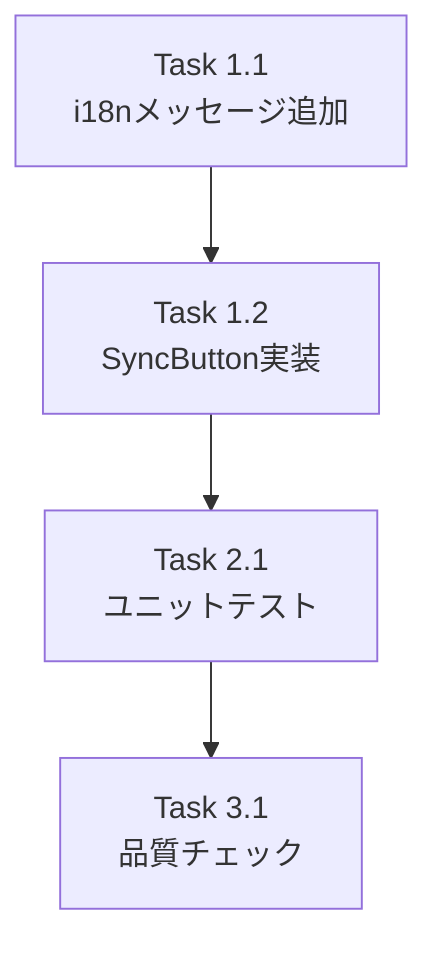

# Issue #506 作業計画書

## Issue: サイドバーにブランチを同期する更新ボタンが欲しい
**Issue番号**: #506
**サイズ**: S
**優先度**: Medium
**依存Issue**: なし

## 詳細タスク分解

### Phase 1: 実装タスク

#### Task 1.1: i18nメッセージキー追加
- **成果物**: `locales/en/common.json`, `locales/ja/common.json`
- **依存**: なし
- **内容**:
  - `syncSuccess`, `syncError`, `syncAuthError`, `syncButtonLabel` キーを追加
  - en: "Synced {count} worktrees", "Sync failed", "Authentication error", "Sync branches"
  - ja: "{count}件のworktreeを同期しました", "同期に失敗しました", "認証エラー", "ブランチを同期"

#### Task 1.2: SyncButton インラインコンポーネント実装
- **成果物**: `src/components/layout/Sidebar.tsx`（編集）
- **依存**: Task 1.1
- **内容**:
  - SyncIcon SVGコンポーネント追加（回転矢印アイコン、インラインSVG）
  - SyncButton memo化コンポーネント追加（Sidebar.tsx内インライン）
    - props: `refreshWorktrees: () => Promise<void>`
    - useState: `isSyncing`
    - useRef: `isSyncingRef`（useCallback依存配列安定化）
    - useToast: Toast通知
    - useTranslations('common'): i18n
    - handleSync: `repositoryApi.sync()` → `refreshWorktrees()` → showToast
    - エラーハンドリング: ApiError 401判定、汎用エラーメッセージ
    - ToastContainer: まずPortalなしで配置、stacking context問題発生時にcreatePortal導入
  - Sidebarヘッダーの既存ボタン群（ViewModeToggle, SortSelector横）にSyncButton配置
  - import追加: `repositoryApi`, `ApiError`, `useToast`, `ToastContainer`, `useTranslations`

### Phase 2: テストタスク

#### Task 2.1: ユニットテスト追加
- **成果物**: `tests/unit/components/layout/Sidebar.test.tsx`（編集）
- **依存**: Task 1.2
- **内容**:
  - api-clientモックに`repositoryApi: { sync: vi.fn() }`追加
  - テストケース:
    1. サイドバーヘッダーに同期ボタンが表示される
    2. クリックで`repositoryApi.sync()`が呼ばれる
    3. sync成功後に`refreshWorktrees()`が呼ばれる
    4. sync中はボタンがdisabledになる
    5. sync失敗時にエラーToastが表示される
    6. sync成功時に成功Toastが表示される
    7. 401エラー時に認証エラーToastが表示される

### Phase 3: 検証タスク

#### Task 3.1: 品質チェック
- **依存**: Task 2.1
- **内容**:
  - `npx tsc --noEmit` パス確認
  - `npm run lint` パス確認
  - `npm run test:unit` パス確認

## タスク依存関係

## 品質チェック項目

| チェック項目 | コマンド | 基準 |
|-------------|----------|------|
| TypeScript | `npx tsc --noEmit` | 型エラー0件 |
| ESLint | `npm run lint` | エラー0件 |
| Unit Test | `npm run test:unit` | 全テストパス |

## 成果物チェックリスト

### コード
- [ ] i18nメッセージキー（en/ja）
- [ ] SyncIcon SVGコンポーネント
- [ ] SyncButton コンポーネント（memo化、useRef、useToast、エラーハンドリング）
- [ ] Sidebarヘッダーへのボタン配置

### テスト
- [ ] SyncButton ユニットテスト（7ケース）

## 設計レビュー実装チェックリスト

以下は設計レビュー（Stage 1-4）で指摘された実装時の注意事項:

- [ ] ToastContainerのpropは `onClose={removeToast}` を使用（F-001）
- [ ] isSyncingガードはuseRefで管理、useCallback依存配列に含めない（F-002）
- [ ] createPortalは段階的に判断: まずPortalなし → 問題発生時にPortal導入（F-007）
- [ ] Portal採用時はmountedフラグでSSR互換性確保（IMPACT-004）
- [ ] i18nは `useTranslations('common')` を使用（CONS-001）
- [ ] 既存テストモックに `repositoryApi: { sync: vi.fn() }` 追加（IMPACT-002）
- [ ] sync APIエラー時はi18n固定メッセージのみ表示（SEC-001）
- [ ] SyncResponseの`worktreeCount`のみ使用、`repositories`配列に依存しない（SEC-004）
- [ ] モバイルdrawer表示でのレイアウト確認（IMPACT-008）

## Definition of Done

- [ ] すべてのタスクが完了
- [ ] CIチェック全パス（lint, type-check, test）
- [ ] 設計レビュー実装チェックリスト全項目確認済み

## 次のアクション

1. **TDD実装**: `/pm-auto-dev 506` で自動開発実行
2. **PR作成**: `/create-pr` でPR自動作成

---

*Generated by work-plan command - 2026-03-16*
