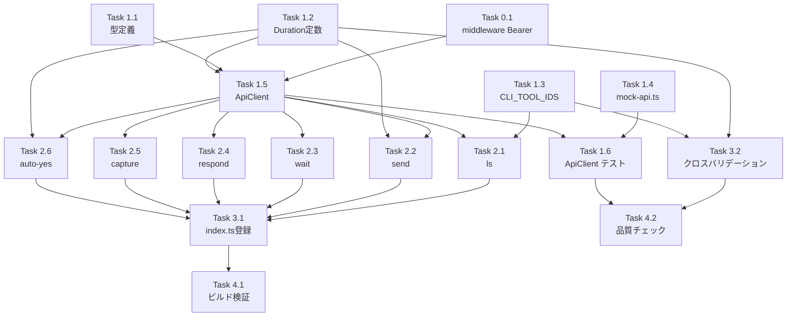

# 作業計画書: Issue #518

## Issue: CLI基盤コマンドの実装（ls / send / wait / respond / capture / auto-yes）
**Issue番号**: #518
**サイズ**: L
**優先度**: High
**依存Issue**: なし
**ブランチ**: `feature/518-worktree`

---

## タスク分解

### Phase 0: 前提実装（middleware Bearer対応）

- [ ] **Task 0.1**: middleware.ts Bearer トークン認証サポート
  - 成果物: `src/middleware.ts`, `src/lib/security/auth.ts`
  - 依存: なし
  - 詳細:
    - Cookie-first 検証順序の実装（Section 2-3準拠）
    - 認証失敗レスポンスの分岐（CLI: 401 JSON / ブラウザ: リダイレクト）
    - Bearer トークン認証失敗時のログ記録（IP付き console.warn）[SEC4-07]
  - テスト: 6つのリグレッションシナリオ [IA3-01]

### Phase 1: 基盤モジュール（型定義・設定・ユーティリティ）

- [ ] **Task 1.1**: CLI型定義の追加
  - 成果物: `src/cli/types/index.ts`（変更）, `src/cli/types/api-responses.ts`（新規）
  - 依存: なし
  - 詳細:
    - WaitExitCode（SUCCESS=0, PROMPT_DETECTED=10, TIMEOUT=124）[DR2-01]
    - 6コマンドの Options 型（LsOptions, SendOptions, WaitOptions, RespondOptions, CaptureOptions, AutoYesOptions）
    - APIレスポンス型（WorktreeListResponse, CurrentOutputResponse, WaitPromptOutput, PromptResponseResult）
    - 全型に Mirrors コメント付与 [DR1-06]

- [ ] **Task 1.2**: Duration定数の定義
  - 成果物: `src/cli/config/duration-constants.ts`（新規）
  - 依存: なし
  - 詳細:
    - DURATION_MAP, ALLOWED_DURATIONS, parseDurationToMs()
    - safe-regex2依存を回避するCLI独自定義

- [ ] **Task 1.3**: CLI_TOOL_IDS のCLI側対応
  - 成果物: `src/cli/config/cli-tool-ids.ts`（新規） or `tsconfig.cli.json`（変更）
  - 依存: なし
  - 詳細: [DR2-07] 方式A（tsconfig include拡張）or 方式B（複製+クロスバリデーション）を選択

- [ ] **Task 1.4**: fetchモックヘルパーの作成
  - 成果物: `tests/helpers/mock-api.ts`（新規）
  - 依存: なし
  - 詳細: mockFetchResponse, mockFetchError, restoreFetch [IA3-05]

- [ ] **Task 1.5**: ApiClient の実装
  - 成果物: `src/cli/utils/api-client.ts`（新規）
  - 依存: Task 1.1, Task 1.2
  - 詳細:
    - resolveAuthToken() 分離 [DR1-01]
    - handleApiError() 分離 [DR1-01]
    - get<T>/post<T> ジェネリックメソッド [DR1-05]
    - ベースURL構築（CM_PORT）
    - --token 使用時のstderr警告 [SEC4-01]
    - 非localhost HTTP接続時の警告 [SEC4-02]
    - エラーマッピング: ECONNREFUSED, 400, 401/403, 404, 429, 500, timeout [IA3-09]

- [ ] **Task 1.6**: ApiClient テスト
  - 成果物: `tests/unit/cli/utils/api-client.test.ts`（新規）
  - 依存: Task 1.4, Task 1.5
  - 詳細:
    - resolveAuthToken 個別テスト
    - handleApiError 個別テスト（全ステータスコード）
    - get/post の正常系・異常系
    - --token 警告テスト、HTTP平文警告テスト

### Phase 2: コマンド実装

- [ ] **Task 2.1**: ls コマンド
  - 成果物: `src/cli/commands/ls.ts`, `tests/unit/cli/commands/ls.test.ts`
  - 依存: Task 1.5
  - 詳細:
    - GET /api/worktrees 呼び出し
    - ステータス導出（isSessionRunning/isWaitingForResponse/isProcessing → idle/ready/running/waiting）
    - --json / --quiet / テーブル出力
    - --branch 前方一致フィルタリング
    - --quiet: 1行1ID改行区切り
    - worktree ID バリデーション（isValidWorktreeId）[SEC4-04]

- [ ] **Task 2.2**: send コマンド
  - 成果物: `src/cli/commands/send.ts`, `tests/unit/cli/commands/send.test.ts`
  - 依存: Task 1.2, Task 1.5
  - 詳細:
    - POST /api/worktrees/:id/send（content, cliToolId）
    - --auto-yes: POST /api/worktrees/:id/auto-yes → POST send
    - --duration: parseDurationToMs() 変換 [DR2-02]
    - --agent: cliToolId 同期（auto-yes + send）
    - --stop-pattern: MAX_STOP_PATTERN_LENGTH=500 バリデーション [SEC4-06]

- [ ] **Task 2.3**: wait コマンド
  - 成果物: `src/cli/commands/wait.ts`, `tests/unit/cli/commands/wait.test.ts`
  - 依存: Task 1.5
  - 詳細:
    - GET /api/worktrees/:id/current-output ポーリング（5秒間隔）[IA3-02]
    - 完了判定: isRunning===false && isPromptWaiting===false → exit 0
    - プロンプト検出: isPromptWaiting===true → exit 10（JSON出力）
    - --on-prompt agent/human
    - --timeout, --stall-timeout
    - 複数ID: Promise.allSettled [DR1-07]
    - stderr 進捗表示、stdout は最終結果のみ
    - WaitExitCode 使い分け [DR1-03]

- [ ] **Task 2.4**: respond コマンド
  - 成果物: `src/cli/commands/respond.ts`, `tests/unit/cli/commands/respond.test.ts`
  - 依存: Task 1.5
  - 詳細:
    - POST /api/worktrees/:id/prompt-response（answer, cliTool）
    - --agent: cliTool マッピング
    - success: false 時の reason 検査 [DR2-06]

- [ ] **Task 2.5**: capture コマンド
  - 成果物: `src/cli/commands/capture.ts`, `tests/unit/cli/commands/capture.test.ts`
  - 依存: Task 1.5
  - 詳細:
    - GET /api/worktrees/:id/current-output
    - --agent: ?cliTool= クエリパラメータ
    - --json: 定義済みフィールド（fullOutput除外）
    - デフォルト: テキスト出力

- [ ] **Task 2.6**: auto-yes コマンド
  - 成果物: `src/cli/commands/auto-yes.ts`, `tests/unit/cli/commands/auto-yes.test.ts`
  - 依存: Task 1.2, Task 1.5
  - 詳細:
    - POST /api/worktrees/:id/auto-yes
    - --enable / --disable
    - --duration: parseDurationToMs() 変換
    - --stop-pattern: 長さバリデーション
    - --agent: cliToolId マッピング

### Phase 3: 統合・登録

- [ ] **Task 3.1**: コマンド登録（index.ts）
  - 成果物: `src/cli/index.ts`（変更）
  - 依存: Task 2.1〜2.6
  - 詳細:
    - 6コマンドの addCommand() 登録
    - インフラコマンド群とオーケストレーションコマンド群のコメント分離 [IA3-07]

- [ ] **Task 3.2**: クロスバリデーションテスト
  - 成果物: `tests/unit/cli/config/cross-validation.test.ts`（新規）, `tests/unit/cli/config/duration-constants.test.ts`（新規）
  - 依存: Task 1.2, Task 1.3
  - 詳細:
    - Duration定数の等価性検証 [IA3-04]
    - APIレスポンス型のフィールド名整合性検証 [IA3-03]

### Phase 4: 品質チェック・ビルド検証

- [ ] **Task 4.1**: ビルド検証
  - 依存: Task 3.1
  - 詳細:
    - `npm run build:cli` 成功確認
    - 外部型定義ファイルが dist/ に正しく出力されることを確認
    - `node bin/commandmate.js ls --help` で動作確認

- [ ] **Task 4.2**: 品質チェック
  - 依存: Task 3.2
  - 詳細:
    - `npx tsc --noEmit` → 型エラー0件
    - `npm run lint` → エラー0件
    - `npm run test:unit` → 全テストパス

---

## タスク依存関係

## 推奨実装順序

1. **Task 0.1** → middleware Bearer対応（前提実装、ブロッカー）
2. **Task 1.1, 1.2, 1.3, 1.4** → 並列実行可能（型定義・設定・テストヘルパー）
3. **Task 1.5** → ApiClient（Phase 2の全コマンドが依存）
4. **Task 1.6** → ApiClient テスト
5. **Task 2.1〜2.6** → 6コマンド実装（相互依存なし、並列可能だが順次推奨）
   - 推奨順: ls → capture → send → auto-yes → respond → wait（複雑度昇順）
6. **Task 3.1, 3.2** → 統合・クロスバリデーション
7. **Task 4.1, 4.2** → ビルド・品質チェック

---

## 品質チェック項目

| チェック項目 | コマンド | 基準 |
|-------------|----------|------|
| ESLint | `npm run lint` | エラー0件 |
| TypeScript | `npx tsc --noEmit` | 型エラー0件 |
| Unit Test | `npm run test:unit` | 全テストパス |
| CLI Build | `npm run build:cli` | 成功 |

---

## Definition of Done

- [ ] Task 0.1: middleware Bearer対応完了・リグレッションテストパス
- [ ] Task 1.1〜1.6: 基盤モジュール完了・ApiClientテストパス
- [ ] Task 2.1〜2.6: 6コマンド実装完了・各コマンドテストパス
- [ ] Task 3.1: index.ts に6コマンド登録完了
- [ ] Task 3.2: クロスバリデーションテストパス
- [ ] Task 4.1: `npm run build:cli` 成功、`node bin/commandmate.js ls --help` 動作確認
- [ ] Task 4.2: tsc, lint, test:unit 全パス
- [ ] Issueの受け入れ条件（全22項目）を満たすこと

---

*Generated by work-plan command for Issue #518*
*Date: 2026-03-18*
