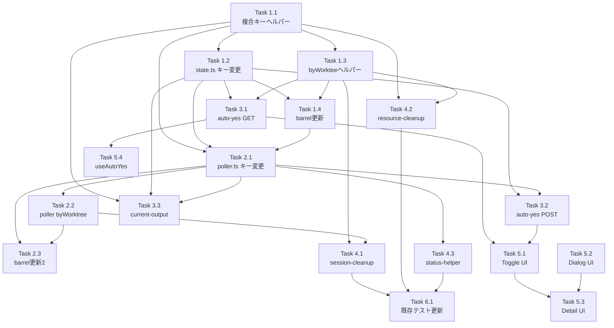

# 作業計画書: Issue #525 Auto-Yesエージェント毎独立制御

## Issue: auto yesの改善
**Issue番号**: #525
**サイズ**: L
**優先度**: High
**依存Issue**: なし

---

## 詳細タスク分解

### Phase 1: 基盤 - auto-yes-state.ts（先行タスク）

- [ ] **Task 1.1**: 複合キーヘルパー関数の実装
  - `COMPOSITE_KEY_SEPARATOR` 定数定義 [SF-002]
  - `buildCompositeKey(worktreeId, cliToolId)` 実装（コロン不含アサーション [SEC4-SF-004]）
  - `extractWorktreeId(compositeKey)` 実装
  - `extractCliToolId(compositeKey)` 実装
  - 成果物: `src/lib/auto-yes-state.ts` 内に追加
  - テスト: `tests/unit/lib/auto-yes-composite-key.test.ts`
  - 依存: なし

- [ ] **Task 1.2**: Mapキー複合キー化 & 関数シグネチャ変更
  - `autoYesStates` Map のキーを `worktreeId` → compositeKey に変更
  - `setAutoYesEnabled(worktreeId, cliToolId, enabled, duration?, stopPattern?)` シグネチャ変更
  - `getAutoYesState(worktreeId, cliToolId)` シグネチャ変更
  - `disableAutoYes(worktreeId, cliToolId, reason?)` シグネチャ変更
  - `deleteAutoYesState(compositeKey)` + compositeKeyバリデーション [MF-001]
  - `checkStopCondition(compositeKey, cleanOutput, onStopMatched?)` + バリデーション [MF-001]
  - `onStopMatched` コールバック型を `(compositeKey: string) => void` に変更 [CS-MF-002]
  - 成果物: `src/lib/auto-yes-state.ts`
  - テスト: `tests/unit/lib/auto-yes-state-composite.test.ts`
  - 依存: Task 1.1

- [ ] **Task 1.3**: byWorktreeヘルパー関数
  - `getCompositeKeysByWorktree(worktreeId)` 実装
  - `deleteAutoYesStateByWorktree(worktreeId)` 実装
  - `getAutoYesStateWorktreeIds()` → 複合キー配列（関数名変更検討 [C-001]）
  - 成果物: `src/lib/auto-yes-state.ts`
  - テスト: Task 1.2 のテストに含む
  - 依存: Task 1.1

- [ ] **Task 1.4**: auto-yes-manager.ts barrel更新
  - 新規export追加（buildCompositeKey, extractWorktreeId, extractCliToolId, getCompositeKeysByWorktree, deleteAutoYesStateByWorktree）
  - 成果物: `src/lib/polling/auto-yes-manager.ts`
  - 依存: Task 1.1, 1.2, 1.3

### Phase 2: ポーラー - auto-yes-poller.ts

- [ ] **Task 2.1**: Mapキー複合キー化 & 関数修正
  - `pollerStates` Map のキーを compositeKey に変更
  - 内部関数の分類方針適用 [IA-MF-002]:
    - compositeKey直接受取: `getPollerState`, `resetErrorCount`, `validatePollingContext`, `scheduleNextPoll`
    - (worktreeId, cliToolId)受取 → 内部buildCompositeKey: `captureAndCleanOutput`, `detectAndRespondToPrompt`, `pollAutoYes`, `startAutoYesPolling`
  - `stopAutoYesPolling(compositeKey)` 引数変更
  - `isPollerActive(compositeKey)` 引数変更
  - `getLastServerResponseTimestamp(compositeKey)` 引数変更
  - `incrementErrorCount` 内の `disableAutoYes`/`stopAutoYesPolling` をcompositeKey対応 [IA-MF-001]
  - 成果物: `src/lib/auto-yes-poller.ts`
  - テスト: `tests/unit/lib/auto-yes-poller-composite.test.ts`
  - 依存: Task 1.1, 1.2, 1.4

- [ ] **Task 2.2**: byWorktreeヘルパー関数（ポーラー側）
  - `stopAutoYesPollingByWorktree(worktreeId)` 実装 [SF-001]
  - `isAnyPollerActiveForWorktree(worktreeId)` 実装
  - `getAutoYesPollerWorktreeIds()` → 複合キー配列化
  - 成果物: `src/lib/auto-yes-poller.ts`
  - テスト: Task 2.1 のテストに含む
  - 依存: Task 2.1

- [ ] **Task 2.3**: auto-yes-manager.ts barrel更新（ポーラー分）
  - 新規export追加（stopAutoYesPollingByWorktree, isAnyPollerActiveForWorktree）
  - 成果物: `src/lib/polling/auto-yes-manager.ts`
  - 依存: Task 2.1, 2.2

### Phase 3: API層

- [ ] **Task 3.1**: auto-yes/route.ts GET修正
  - `_request` → `request` に変更してクエリパラメータ取得
  - `cliToolId` クエリパラメータ対応
  - `isValidWorktreeId()` バリデーション追加（GET側） [SEC4-SF-003]
  - cliToolId指定時: 単一エージェント状態返却
  - cliToolId省略時: 全エージェントマップ返却
  - 成果物: `src/app/api/worktrees/[id]/auto-yes/route.ts`
  - テスト: `tests/unit/api/auto-yes-route.test.ts`
  - 依存: Task 1.2, 1.3

- [ ] **Task 3.2**: auto-yes/route.ts POST修正
  - `setAutoYesEnabled` にcliToolId渡し [CS-MF-001]
  - 不正cliToolIdで400エラー（フォールバック廃止） [SEC4-SF-002]
  - disable時: cliToolId指定→個別停止 / 未指定→全エージェント停止
  - 成果物: `src/app/api/worktrees/[id]/auto-yes/route.ts`
  - テスト: Task 3.1 のテストに含む
  - 依存: Task 1.2, 2.1

- [ ] **Task 3.3**: current-output/route.ts修正
  - `cliTool` パラメータのバリデーション追加 [CS-SF-002]
  - `getAutoYesState(params.id, cliTool)` 2引数呼び出し [IA-SF-001]
  - `isPollerActive(compositeKey)` compositeKey呼び出し
  - `getLastServerResponseTimestamp(compositeKey)` compositeKey呼び出し
  - 成果物: `src/app/api/worktrees/[id]/current-output/route.ts`
  - テスト: `tests/unit/api/current-output-route.test.ts`
  - 依存: Task 1.1, 1.2, 2.1

### Phase 4: クリーンアップ & サポート

- [ ] **Task 4.1**: session-cleanup.ts修正
  - byWorktreeヘルパー使用（アプローチA採用）
  - `stopAutoYesPollingByWorktree(worktreeId)` 呼び出し
  - `deleteAutoYesStateByWorktree(worktreeId)` 呼び出し
  - 成果物: `src/lib/session-cleanup.ts`
  - テスト: `tests/unit/session-cleanup-issue404.test.ts` 更新
  - 依存: Task 1.3, 2.2

- [ ] **Task 4.2**: resource-cleanup.ts修正
  - `getAutoYesStateWorktreeIds()` → compositeKey配列対応
  - `extractWorktreeId()` で分解してDB照合
  - `isValidWorktreeId()` バリデーション追加 [SEC4-MF-001]
  - 成果物: `src/lib/resource-cleanup.ts`
  - テスト: `tests/unit/resource-cleanup.test.ts` 更新
  - 依存: Task 1.1, 1.3

- [ ] **Task 4.3**: worktree-status-helper.ts修正
  - cliToolId毎ループ内でcompositeKey使用
  - `getLastServerResponseTimestamp(compositeKey)` 呼び出し
  - 成果物: `src/lib/session/worktree-status-helper.ts`
  - テスト: `tests/unit/lib/worktree-status-helper.test.ts` 更新
  - 依存: Task 2.1

### Phase 5: フロントエンド

- [ ] **Task 5.1**: AutoYesToggle.tsx修正
  - エージェント名をトグルラベルに表示
  - アクティブタブのエージェントに紐づくトグル
  - 成果物: `src/components/worktree/AutoYesToggle.tsx`
  - 依存: Task 3.1, 3.2

- [ ] **Task 5.2**: AutoYesConfirmDialog.tsx修正
  - 確認ダイアログに対象エージェント名を表示
  - 成果物: `src/components/worktree/AutoYesConfirmDialog.tsx`
  - 依存: なし

- [ ] **Task 5.3**: WorktreeDetailRefactored.tsx修正
  - auto-yes状態をエージェント毎に管理
  - activeCliToolIdに基づくトグル状態の切り替え
  - 成果物: `src/components/worktree/WorktreeDetailRefactored.tsx`
  - 依存: Task 5.1, 5.2

- [ ] **Task 5.4**: useAutoYes.ts修正（最小変更）
  - auto-yes GET APIへのcliToolIdクエリパラメータ付与
  - 成果物: `src/hooks/useAutoYes.ts`
  - 依存: Task 3.1

### Phase 6: 既存テスト更新

- [ ] **Task 6.1**: 既存テストファイルの複合キー対応更新
  - `tests/unit/auto-yes-manager-cleanup.test.ts`
  - `tests/integration/auto-yes-persistence.test.ts`
  - `tests/unit/lib/auto-yes-manager.test.ts`（存在する場合）
  - 成果物: 上記テストファイル
  - 依存: Phase 1-4 完了

---

## タスク依存関係

---

## 品質チェック項目

| チェック項目 | コマンド | 基準 |
|-------------|----------|------|
| ESLint | `npm run lint` | エラー0件 |
| TypeScript | `npx tsc --noEmit` | 型エラー0件 |
| Unit Test | `npm run test:unit` | 全テストパス |
| Build | `npm run build` | 成功 |

---

## 成果物チェックリスト

### コード変更
- [ ] `src/lib/auto-yes-state.ts` - 複合キー化、シグネチャ変更、ヘルパー関数
- [ ] `src/lib/auto-yes-poller.ts` - 複合キー化、byWorktreeヘルパー
- [ ] `src/lib/polling/auto-yes-manager.ts` - barrel更新
- [ ] `src/app/api/worktrees/[id]/auto-yes/route.ts` - GET/POST修正
- [ ] `src/app/api/worktrees/[id]/current-output/route.ts` - compositeKey対応
- [ ] `src/lib/session-cleanup.ts` - byWorktreeヘルパー使用
- [ ] `src/lib/resource-cleanup.ts` - extractWorktreeId使用
- [ ] `src/lib/session/worktree-status-helper.ts` - compositeKey対応
- [ ] `src/components/worktree/AutoYesToggle.tsx` - エージェント名表示
- [ ] `src/components/worktree/AutoYesConfirmDialog.tsx` - エージェント名表示
- [ ] `src/components/worktree/WorktreeDetailRefactored.tsx` - エージェント毎状態管理
- [ ] `src/hooks/useAutoYes.ts` - cliToolIdクエリパラメータ

### テスト（新規）
- [ ] `tests/unit/lib/auto-yes-composite-key.test.ts`
- [ ] `tests/unit/lib/auto-yes-state-composite.test.ts`
- [ ] `tests/unit/lib/auto-yes-poller-composite.test.ts`
- [ ] `tests/unit/api/auto-yes-route.test.ts`
- [ ] `tests/unit/api/current-output-route.test.ts`

### テスト（更新）
- [ ] `tests/unit/session-cleanup-issue404.test.ts`
- [ ] `tests/unit/resource-cleanup.test.ts`
- [ ] `tests/unit/lib/worktree-status-helper.test.ts`
- [ ] `tests/unit/auto-yes-manager-cleanup.test.ts`
- [ ] `tests/integration/auto-yes-persistence.test.ts`

---

## Definition of Done

- [ ] すべてのタスク（Phase 1-6）が完了
- [ ] CIチェック全パス（lint, type-check, test, build）
- [ ] 設計方針書の実装チェックリスト（Section 14）全項目完了
- [ ] UIから各エージェント毎にauto-yesを独立してON/OFFできる
- [ ] 既存のauto-yes動作（単一エージェント利用時）に影響がない

---

## 次のアクション

1. **TDD実装開始**: `/pm-auto-dev` で自動開発
2. **進捗報告**: `/progress-report` で定期報告
3. **PR作成**: `/create-pr` で自動作成

---

*Generated by work-plan command for Issue #525*
*Date: 2026-03-20*
