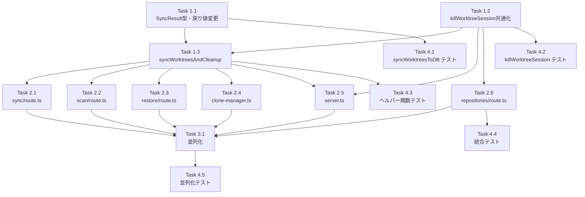

# Issue #526 作業計画書

## Issue: syncWorktreesToDB()でworktree削除時にtmuxセッションがクリーンアップされない
**Issue番号**: #526
**サイズ**: M
**優先度**: High
**依存Issue**: なし
**設計方針書**: `dev-reports/design/issue-526-sync-tmux-cleanup-design-policy.md`

---

## 詳細タスク分解

### Phase 1: コア関数変更

#### Task 1.1: SyncResult型定義とsyncWorktreesToDB()戻り値変更
- **成果物**: `src/lib/git/worktrees.ts`
- **依存**: なし
- **内容**:
  - `SyncResult` インターフェース追加（`deletedIds: string[]`, `upsertedCount: number`）
  - `syncWorktreesToDB()` の戻り値を `void` → `SyncResult` に変更
  - 削除対象IDを `allDeletedIds` に収集して返却
  - 将来の `types/` 移動についてTODOコメント追加（SF-001）

#### Task 1.2: killWorktreeSession()共通化
- **成果物**: `src/lib/session-cleanup.ts`
- **依存**: なし
- **内容**:
  - `CLIToolManager`, `killSession` のimport追加
  - `killWorktreeSession()` を共通関数として追加・エクスポート
  - try-catchパターン（getTool()がthrowする実装に合わせ: MF-C01）
  - `isRunning()` に await を正しく使用（SF-004）

#### Task 1.3: syncWorktreesAndCleanup()ヘルパー関数追加
- **成果物**: `src/lib/session-cleanup.ts`
- **依存**: Task 1.1, Task 1.2
- **内容**:
  - `syncWorktreesAndCleanup()` を追加（MF-001: DRY違反解消）
  - `syncWorktreesToDB()` → deletedIds判定 → `cleanupMultipleWorktrees()` を1関数に集約
  - cleanupWarningsのサニタイズ実装（SEC-MF-001: 詳細エラーはログのみ、クライアント向けは汎用メッセージ）

### Phase 2: 呼び出し元更新

#### Task 2.1: sync/route.ts 更新
- **成果物**: `src/app/api/repositories/sync/route.ts`
- **依存**: Task 1.3
- **内容**:
  - `syncWorktreesToDB()` → `syncWorktreesAndCleanup()` に置換
  - `session-cleanup` からのimport追加
  - レスポンスに `cleanupWarnings`（サニタイズ済み）を追加

#### Task 2.2: scan/route.ts 更新
- **成果物**: `src/app/api/repositories/scan/route.ts`
- **依存**: Task 1.3
- **内容**: Task 2.1と同様のパターン

#### Task 2.3: restore/route.ts 更新
- **成果物**: `src/app/api/repositories/restore/route.ts`
- **依存**: Task 1.3
- **内容**: Task 2.1と同様のパターン

#### Task 2.4: clone-manager.ts 更新
- **成果物**: `src/lib/git/clone-manager.ts`
- **依存**: Task 1.3
- **内容**:
  - `onCloneSuccess()` 内で `syncWorktreesAndCleanup()` 使用
  - エラーハンドリング: try-catchで吸収・ログ出力（IA-MF-002）

#### Task 2.5: server.ts 更新
- **成果物**: `server.ts`
- **依存**: Task 1.2, Task 1.3
- **内容**:
  - excludedPaths削除処理: cleanup → delete の順序でクリーンアップ追加（SF-002: 順序コメント明記）
  - initializeWorktrees内sync処理: `syncWorktreesAndCleanup()` 使用
  - `session-cleanup` からのimport追加

#### Task 2.6: repositories/route.ts ローカル関数置換
- **成果物**: `src/app/api/repositories/route.ts`
- **依存**: Task 1.2
- **内容**:
  - ローカルの `killWorktreeSession()` を削除
  - `session-cleanup` からの共通関数importに置換

### Phase 3: パフォーマンス改善

#### Task 3.1: cleanupMultipleWorktrees()並列化
- **成果物**: `src/lib/session-cleanup.ts`
- **依存**: Task 2.1-2.6完了後
- **内容**:
  - forループ → `Promise.allSettled()` に変更
  - 既存DELETE handlerへの影響確認（SF-003）
  - 同時実行数の安全性確認（SEC-SF-002）

### Phase 4: テスト

#### Task 4.1: syncWorktreesToDB()戻り値テスト
- **成果物**: `tests/unit/worktrees-sync.test.ts`（既存テスト拡張）
- **依存**: Task 1.1
- **内容**:
  - 削除対象があるとき `deletedIds` が返ることを検証
  - 削除対象がないとき空配列が返ることを検証
  - `upsertedCount` の正確性検証

#### Task 4.2: killWorktreeSession()共通化テスト
- **成果物**: `tests/unit/session-cleanup.test.ts`（既存テスト拡張）
- **依存**: Task 1.2
- **内容**:
  - 実行中セッションをkillできること
  - 非実行セッション（getTool() throw）でfalseを返すこと
  - isRunning() falseでfalseを返すこと

#### Task 4.3: syncWorktreesAndCleanup()テスト
- **成果物**: `tests/unit/session-cleanup.test.ts`（既存テスト拡張）
- **依存**: Task 1.3
- **内容**:
  - 削除ありの場合cleanupが呼ばれること
  - 削除なしの場合cleanupが呼ばれないこと
  - cleanup失敗時もsyncResultは正常に返ること
  - cleanupWarningsのサニタイズ検証（SEC-MF-001）

#### Task 4.4: 各APIルート統合テスト
- **成果物**: `tests/integration/` 配下
- **依存**: Task 2.1-2.6
- **内容**:
  - sync API: 削除時にクリーンアップが呼ばれること
  - sync API: クリーンアップ失敗時もsync自体は成功すること
  - 既存DELETE handler: 動作に影響がないこと

#### Task 4.5: 並列化テスト
- **成果物**: `tests/unit/session-cleanup.test.ts`
- **依存**: Task 3.1
- **内容**:
  - Promise.allSettled()での並列実行テスト
  - 部分失敗時の結果集約テスト

---

## タスク依存関係

---

## 実装順序（TDDサイクル）

| 順序 | タスク | Red | Green | Refactor |
|------|--------|-----|-------|----------|
| 1 | Task 4.1 → Task 1.1 | SyncResult戻り値テスト | syncWorktreesToDB()変更 | - |
| 2 | Task 4.2 → Task 1.2 | killWorktreeSessionテスト | 共通化実装 | - |
| 3 | Task 4.3 → Task 1.3 | ヘルパー関数テスト | syncWorktreesAndCleanup()実装 | - |
| 4 | Task 2.1-2.6 | - | 各呼び出し元更新 | - |
| 5 | Task 4.4 | 統合テスト | - | - |
| 6 | Task 4.5 → Task 3.1 | 並列化テスト | 並列化実装 | - |

---

## 品質チェック項目

| チェック項目 | コマンド | 基準 |
|-------------|----------|------|
| ESLint | `npm run lint` | エラー0件 |
| TypeScript | `npx tsc --noEmit` | 型エラー0件 |
| Unit Test | `npm run test:unit` | 全テストパス |
| Build | `npm run build` | 成功 |

---

## 成果物チェックリスト

### コード変更
- [ ] `src/lib/git/worktrees.ts` — SyncResult型、syncWorktreesToDB()戻り値変更
- [ ] `src/lib/session-cleanup.ts` — killWorktreeSession()、syncWorktreesAndCleanup()、並列化
- [ ] `src/app/api/repositories/sync/route.ts` — ヘルパー関数使用
- [ ] `src/app/api/repositories/scan/route.ts` — ヘルパー関数使用
- [ ] `src/app/api/repositories/restore/route.ts` — ヘルパー関数使用
- [ ] `src/lib/git/clone-manager.ts` — ヘルパー関数使用
- [ ] `server.ts` — excludedPaths + sync処理クリーンアップ
- [ ] `src/app/api/repositories/route.ts` — ローカル関数を共通関数に置換

### テスト
- [ ] syncWorktreesToDB() 戻り値テスト
- [ ] killWorktreeSession() テスト
- [ ] syncWorktreesAndCleanup() テスト
- [ ] 各APIルート統合テスト
- [ ] 並列化テスト

---

## Definition of Done

- [ ] すべてのタスクが完了
- [ ] CIチェック全パス（lint, type-check, test, build）
- [ ] Issue #526 の受け入れ基準9項目をすべて満たす
- [ ] cleanupWarningsのサニタイズ実装（SEC-MF-001）
- [ ] 既存DELETE handlerの動作に影響なし

---

## 次のアクション

1. `/pm-auto-dev` でTDD自動開発を実行
2. `/create-pr` でPR作成

---

*Generated by work-plan command for Issue #526*
*Date: 2026-03-20*
