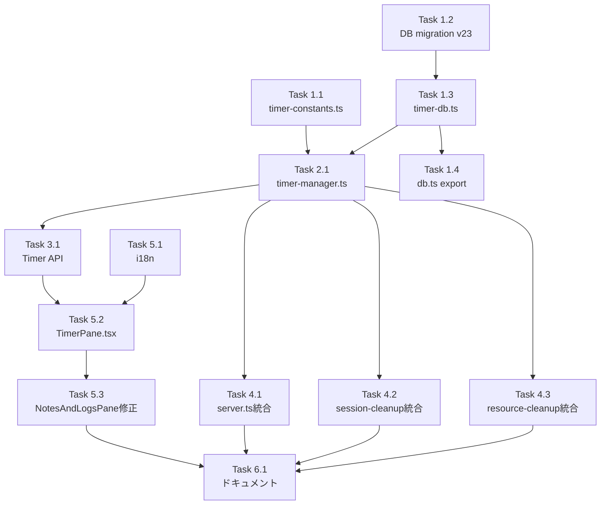

# Issue #534 作業計画書

## Issue: 指定時間後メッセージ送信
**Issue番号**: #534
**サイズ**: M
**優先度**: Medium
**関連Issue**: #292（命令行列 → #534で対応不要に）
**ブランチ**: `feature/534-timer-message`

---

## 詳細タスク分解

### Phase 1: データ層（依存なし）

#### Task 1.1: 定数定義
- **成果物**: `src/config/timer-constants.ts`（新規）
- **内容**:
  - MIN_DELAY_MS / MAX_DELAY_MS / DELAY_STEP_MS 定数
  - TIMER_DELAYS配列（動的生成） [DP-001]
  - MAX_TIMERS_PER_WORKTREE = 5
  - TIMER_STATUS定数オブジェクト、TimerStatus型
  - isValidTimerDelay() 範囲チェック関数
  - TIMER_LIST_POLL_INTERVAL_MS ポーリング間隔
- **テスト**: `tests/unit/config/timer-constants.test.ts`
- **依存**: なし

#### Task 1.2: DBマイグレーション
- **成果物**: `src/lib/db/db-migrations.ts`（修正）
- **内容**:
  - CURRENT_SCHEMA_VERSION = 23
  - timer_messages テーブル作成（up関数）
  - インデックス: idx_timer_messages_worktree_status, idx_timer_messages_status_scheduled
  - down関数: DROP TABLE timer_messages [IMP-SF-004]
  - FOREIGN KEY (worktree_id) REFERENCES worktrees(id) ON DELETE CASCADE
- **テスト**: マイグレーション実行確認（TDD内で検証）
- **依存**: なし

#### Task 1.3: Timer DB操作モジュール
- **成果物**: `src/lib/db/timer-db.ts`（新規）[DP-002]
- **内容**:
  - TimerMessage型、CreateTimerParams型
  - createTimer(): タイマー作成（crypto.randomUUID()）
  - getTimersByWorktree(): worktree単位取得
  - getTimerById(): ID指定取得
  - getPendingTimers(): 復元用全pending取得
  - updateTimerStatus(): ステータス更新
  - cancelTimer(): キャンセル（status→cancelled）
  - cancelTimersByWorktree(): worktree単位一括キャンセル
  - getPendingTimerCountByWorktree(): 上限チェック用
- **テスト**: `tests/unit/lib/db/timer-db.test.ts`
- **依存**: Task 1.2

#### Task 1.4: DBバレルエクスポート
- **成果物**: `src/lib/db/db.ts`（修正）
- **内容**: timer-db.tsのエクスポート追加
- **依存**: Task 1.3

### Phase 2: ビジネスロジック層

#### Task 2.1: タイマーマネージャー
- **成果物**: `src/lib/timer-manager.ts`（新規）[DP-003]
- **内容**:
  - globalThisシングルトンパターン（TimerManagerState）
  - initTimerManager(): DB復元→setTimeout登録、過去時刻は即座送信 [IMP-C-003]
  - stopAllTimers(): Map.clear()同期先行→全clearTimeout [IMP-MF-001]
  - scheduleTimer(): setTimeout登録+Map保持
  - cancelScheduledTimer(): clearTimeout+Map削除+DB更新
  - stopTimersForWorktree(): worktree単位キャンセル
  - getActiveTimerCount(): resource-cleanup用
  - getTimerWorktreeIds(): 孤立検出用 [CON-SF-003]
  - executeTimer(): CLIToolManager.getInstance().getTool()でセッション名解決 [CON-MF-001]、try-catch-finallyパターン [SEC-MF-001]
- **テスト**: `tests/unit/lib/timer-manager.test.ts`
- **依存**: Task 1.1, Task 1.3

### Phase 3: API層

#### Task 3.1: Timer CRUD API
- **成果物**: `src/app/api/worktrees/[id]/timers/route.ts`（新規）
- **内容**:
  - POST: タイマー登録（バリデーション: message非空/MAX_COMMAND_LENGTH、cliToolId/isCliToolType、delayMs/isValidTimerDelay、worktree存在確認、pending上限チェック）
  - GET: worktreeのタイマー一覧取得
  - DELETE: タイマーキャンセル（timerId=xxxクエリパラメータ、isValidUuidV4() [SEC-SF-001]、pending以外は409 [CON-SF-004]）
  - worktreeIdのtypeof/非空チェック [SEC-SF-002]
  - catch句で固定文字列レスポンス [SEC-MF-001]
- **テスト**: TDD内でAPI統合テスト
- **依存**: Task 2.1

### Phase 4: 既存モジュール統合

#### Task 4.1: サーバーライフサイクル統合
- **成果物**: `server.ts`（修正）
- **内容**:
  - 起動時: initScheduleManager()の直後にinitTimerManager()追加
  - 停止時: stopAllSchedules()の直後にstopAllTimers()追加
- **依存**: Task 2.1

#### Task 4.2: セッションクリーンアップ統合
- **成果物**: `src/lib/session-cleanup.ts`（修正）
- **内容**:
  - cleanupWorktreeSessions()にstopTimersForWorktree()追加
  - WorktreeCleanupResult.pollersStopped配列に'timer-manager'追加
- **テスト**: 既存テスト更新
  - `tests/unit/session-cleanup.test.ts`: timer-managerモック追加 [IMP-SF-001]
  - `tests/unit/session-cleanup-issue404.test.ts`: callOrder配列・pollersStopped更新 [IMP-SF-001]
- **依存**: Task 2.1

#### Task 4.3: リソースクリーンアップ統合
- **成果物**: `src/lib/resource-cleanup.ts`（修正）
- **内容**:
  - cleanupOrphanedMapEntries()にtimer-manager孤立エントリ検出追加
  - CleanupMapResult型にdeletedTimerWorktreeIdsフィールド追加
- **テスト**: `tests/unit/resource-cleanup.test.ts`更新 [IMP-SF-002]
- **依存**: Task 2.1

### Phase 5: プレゼンテーション層

#### Task 5.1: i18n翻訳キー追加
- **成果物**: `locales/en/schedule.json`, `locales/ja/schedule.json`（修正）
- **内容**:
  - timerTab、timer.title、timer.agent、timer.message等
  - 日本語翻訳 [IMP-C-001]
- **依存**: なし

#### Task 5.2: TimerPaneコンポーネント
- **成果物**: `src/components/worktree/TimerPane.tsx`（新規）
- **内容**:
  - タイマー登録フォーム（エージェント選択+メッセージ入力+時間選択）
  - 登録済タイマー一覧（カウントダウン表示、setInterval 1秒）
  - キャンセルボタン
  - ステータス表示（sent/failed）
  - ポーリング: TIMER_LIST_POLL_INTERVAL_MS間隔 [CON-C-003]
  - visibilitychange対応（非表示時ポーリング停止）[IMP-C-002]
  - formatTimeRemaining()再利用
- **依存**: Task 3.1, Task 5.1

#### Task 5.3: NotesAndLogsPane タブ追加
- **成果物**: `src/components/worktree/NotesAndLogsPane.tsx`（修正）
- **内容**:
  - SubTab型に'timer'追加
  - SUB_TABS配列にTimerタブエントリ追加（labelKey: 'timerTab'）
  - activeSubTab === 'timer'でTimerPane表示
  - 4タブ化でのモバイルUI幅確認 [IMP-SF-003]
- **依存**: Task 5.2

### Phase 6: ドキュメント

#### Task 6.1: ドキュメント更新
- **成果物**: `CLAUDE.md`, `docs/module-reference.md`（修正）
- **内容**:
  - 主要モジュール一覧にtimer-manager.ts, timer-db.ts, timer-constants.ts, TimerPane.tsx追加
  - module-reference.mdに新規モジュールリファレンス追記
- **依存**: 全Phase完了後

---

## タスク依存関係

---

## TDD実装順序

TDDのRed-Green-Refactorサイクルに従い、以下の順序で実装:

1. **Task 1.1**: timer-constants.ts（テスト→実装→リファクタ）
2. **Task 1.2**: DB migration v23（テスト→実装）
3. **Task 1.3**: timer-db.ts（テスト→実装→リファクタ）
4. **Task 1.4**: db.ts export（追加のみ）
5. **Task 2.1**: timer-manager.ts（テスト→実装→リファクタ）
6. **Task 3.1**: Timer API route（テスト→実装→リファクタ）
7. **Task 4.1-4.3**: 既存モジュール統合（テスト修正→実装）
8. **Task 5.1**: i18n（翻訳キー追加）
9. **Task 5.2**: TimerPane.tsx（実装）
10. **Task 5.3**: NotesAndLogsPane.tsx修正
11. **Task 6.1**: ドキュメント更新

---

## 品質チェック項目

| チェック項目 | コマンド | 基準 |
|-------------|----------|------|
| TypeScript | `npx tsc --noEmit` | 型エラー0件 |
| ESLint | `npm run lint` | エラー0件 |
| Unit Test | `npm run test:unit` | 全テストパス |
| Build | `npm run build` | 成功 |

---

## 成果物チェックリスト

### 新規ファイル
- [ ] `src/config/timer-constants.ts`
- [ ] `src/lib/db/timer-db.ts`
- [ ] `src/lib/timer-manager.ts`
- [ ] `src/app/api/worktrees/[id]/timers/route.ts`
- [ ] `src/components/worktree/TimerPane.tsx`
- [ ] `tests/unit/config/timer-constants.test.ts`
- [ ] `tests/unit/lib/db/timer-db.test.ts`
- [ ] `tests/unit/lib/timer-manager.test.ts`

### 修正ファイル
- [ ] `src/lib/db/db-migrations.ts` (v23)
- [ ] `src/lib/db/db.ts` (export)
- [ ] `server.ts` (lifecycle)
- [ ] `src/lib/session-cleanup.ts` (cleanup)
- [ ] `src/lib/resource-cleanup.ts` (orphan detection)
- [ ] `src/components/worktree/NotesAndLogsPane.tsx` (Timer tab)
- [ ] `locales/en/schedule.json` (i18n)
- [ ] `locales/ja/schedule.json` (i18n)
- [ ] `tests/unit/session-cleanup.test.ts` (mock追加)
- [ ] `tests/unit/session-cleanup-issue404.test.ts` (mock追加)
- [ ] `tests/unit/resource-cleanup.test.ts` (型更新)
- [ ] `CLAUDE.md` (モジュール一覧)
- [ ] `docs/module-reference.md` (リファレンス)

---

## Definition of Done

- [ ] すべてのタスク（Task 1.1〜6.1）完了
- [ ] `npx tsc --noEmit` パス
- [ ] `npm run lint` エラー0件
- [ ] `npm run test:unit` 全テストパス（新規+既存）
- [ ] `npm run build` 成功
- [ ] 設計方針書のレビュー指摘事項チェックリスト全消化
- [ ] ドキュメント更新完了

---

*Generated by work-plan command for Issue #534*
