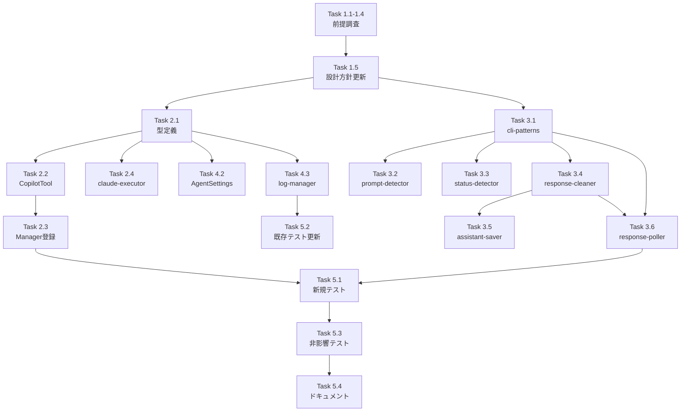

# 作業計画書: Issue #545 Copilot-CLI対応

## Issue: Copilot-cliに対応したい
**Issue番号**: #545
**サイズ**: L
**優先度**: Medium
**ブランチ**: `feature/545-copilot-cli`

## 詳細タスク分解

### Phase 1: 前提調査（実装前必須）

- [ ] **Task 1.1**: gh copilotコマンド形式の確認
  - `gh copilot --help` 実行、サブコマンド一覧確認
  - `BaseCLITool.command` の設定値（`'gh'`）と `buildCliArgs()` 引数構成を確定
  - 成果物: Issueコメントに調査結果記録

- [ ] **Task 1.2**: インタラクションモデルの確認
  - REPL（対話的セッション）か ワンショット（suggest/explain）か確認
  - tmuxセッション管理アプローチの適用方法を決定
  - `interrupt()` のEscapeキー送信が機能するか確認 [DR2-006]
  - 成果物: Issueコメントに調査結果記録

- [ ] **Task 1.3**: 画像入力サポートの確認
  - `gh copilot` が画像入力をサポートするか確認
  - `IImageCapableCLITool` 実装要否を決定 [DR1-005]
  - 成果物: Issueコメントに調査結果記録

- [ ] **Task 1.4**: TUIレイアウト分析
  - ターミナル出力パターン収集
  - プロンプト/思考インジケータ/セパレータのパターン特定
  - status-detector.ts でツール固有検出ブロックの要否判断 [IA3-005]
  - キャプチャ行数（デフォルト or 200行）の方針決定
  - `buildDetectPromptOptions()` の `requireDefaultIndicator` 値の決定 [DR2-008]
  - 成果物: パターン定義案

- [ ] **Task 1.5**: 設計方針書の更新
  - 不採用モデル（REPL or ワンショット）のセクションを「不採用」マーク [DR1-006]
  - Phase 1調査結果に基づき条件付きファイルの変更要否を確定
  - 成果物: 設計方針書更新

### Phase 2: コア実装

- [ ] **Task 2.1**: 型定義の拡張
  - `src/lib/cli-tools/types.ts`: `CLI_TOOL_IDS` に `'copilot'` 追加
  - `src/lib/cli-tools/types.ts`: `CLI_TOOL_DISPLAY_NAMES` に `copilot: 'Copilot'` 追加
  - `src/cli/config/cli-tool-ids.ts`: CLI側 `CLI_TOOL_IDS` に `'copilot'` 追加
  - 依存: なし
  - テスト: `types-cli-tool-ids.test.ts`, `display-name.test.ts`, `cross-validation.test.ts`

- [ ] **Task 2.2**: CopilotToolクラスの新規作成
  - `src/lib/cli-tools/copilot.ts` 新規作成
  - `BaseCLITool` 拡張、`command = 'gh'`
  - `isInstalled()` オーバーライド: `execFile` 使用、gh + copilot拡張の2段階確認 [DR1-004 must_fix] [SEC4-001 must_fix]
  - `isRunning()`, `startSession()`, `sendMessage()`, `killSession()` 実装
  - `sendMessage()` は既存パターン踏襲（sendKeys → wait → Enter → detectAndResendIfPastedText → invalidateCache）[DR1-010] [DR2-005]
  - `getErrorMessage()` ローカル定義 [DR1-003]
  - 依存: Task 2.1, Phase 1完了
  - テスト: `copilot.test.ts` 新規作成

- [ ] **Task 2.3**: CLIToolManagerへの登録
  - `src/lib/cli-tools/manager.ts`: `import { CopilotTool } from './copilot'` + `this.tools.set('copilot', new CopilotTool())` [DR2-007]
  - 依存: Task 2.2
  - テスト: `manager.test.ts` 更新

- [ ] **Task 2.4**: claude-executor.tsの更新
  - `getCommandForTool()` 新規関数追加 [DR1-001] [DR2-001 must_fix]
  - `ALLOWED_CLI_TOOLS` を `new Set(CLI_TOOL_IDS)` から導出 [DR2-002 must_fix]
  - `buildCliArgs()` に copilot ケース追加
  - `executeClaudeCommand()` の `execFile(cliToolId, ...)` を `execFile(getCommandForTool(cliToolId), ...)` に変更
  - エラーメッセージのサニタイズ対応 [SEC4-005]
  - GH_TOKEN/GITHUB_TOKEN管理方針のコメント追記 [SEC4-010]
  - 依存: Task 2.1
  - テスト: `claude-executor.test.ts` 更新（`getCommandForTool` テスト [SEC4-008]）

### Phase 3: 検出・クリーニング

- [ ] **Task 3.1**: cli-patterns.tsへのcopilotパターン追加
  - `COPILOT_PROMPT_PATTERN`, `COPILOT_THINKING_PATTERN`, `COPILOT_SEPARATOR_PATTERN` 定義
  - `COPILOT_SKIP_PATTERNS: readonly RegExp[]` 定義 [DR2-009]
  - `getCliToolPatterns()` copilotケース追加
  - `detectThinking()` copilotケース追加
  - `buildDetectPromptOptions()` copilotケース追加 [DR2-008]
  - 依存: Phase 1（パターン確定後）
  - テスト: `copilot-patterns.test.ts` 新規作成

- [ ] **Task 3.2**: prompt-detector.tsへのcopilotケース追加
  - copilot固有のプロンプト検出ロジック（yes/no等）
  - 依存: Task 3.1

- [ ] **Task 3.3**: status-detector.tsへのcopilotケース追加
  - ステータス検出優先順位に従い実装 [IA3-005]
  - TUI分析結果に基づきツール固有検出ブロックの追加要否判断
  - 依存: Task 3.1, Phase 1

- [ ] **Task 3.4**: response-cleaner.tsへのcleanCopilotResponse追加
  - ANSI除去、バナー/装飾除去、プロンプト行除去、レスポンス本体抽出
  - 依存: Phase 1（出力パターン確定後）
  - テスト: `response-cleaner-copilot.test.ts` 新規作成

- [ ] **Task 3.5**: assistant-response-saver.ts更新
  - `cleanCliResponse()` switch文に `case 'copilot': return cleanCopilotResponse(output)` 追加 [IA3-007]
  - `savePendingAssistantResponse()` TUI固有スキップ判定のcopilot対応確認
  - 依存: Task 3.4

- [ ] **Task 3.6**: response-poller.tsの全ディスパッチポイント対応
  - 20+箇所のcliToolId分岐を個別に確認・対応 [IA3-003 must_fix]
  - 特に完了検出ロジック（line 372-375）のcopilot対応は必須
  - 各ポイントで変更要否を個別判断（一律追加しない）[DR1-007]
  - 依存: Task 3.1, Task 3.4

- [ ] **Task 3.7**: ワンショットモデル用escapeShellArg()（条件付き）
  - ワンショットモデル採用時のみ実装 [SEC4-002 must_fix]
  - シングルクォートラッピング方式、7つの必須テストケース
  - REPL採用時は不要 → 設計書に不採用明記 [DR2-004]
  - 依存: Phase 1（モデル確定後）

### Phase 4: スケジュール実行・UI・i18n・ログ

- [ ] **Task 4.1**: cmate-parser.ts / cmate-validator.ts更新
  - スケジュール実行パーミッション検証のcopilotケース追加
  - copilotのpermissionモデル調査結果に基づき分岐ロジック決定 [IA3-004]
  - 依存: Phase 1

- [ ] **Task 4.2**: AgentSettingsPane.tsx更新
  - copilot選択肢の追加（チェックボックス）
  - 依存: Task 2.1
  - テスト: `AgentSettingsPane.test.tsx` 更新

- [ ] **Task 4.3**: log-manager.ts更新
  - ツール名マッピング(line 94, 104, 140)を `CLI_TOOL_DISPLAY_NAMES` import に置換 [IA3-001 must_fix]
  - `listLogs()` (line 190) のハードコードを `CLI_TOOL_IDS` import に置換 [IA3-002 must_fix]
  - 依存: Task 2.1

- [ ] **Task 4.4**: env-sanitizer.ts確認
  - `SENSITIVE_ENV_KEYS` に `GH_DEBUG` 追加 [SEC4-003]
  - GH_TOKEN意図的非サニタイズのコメント追記 [SEC4-010]
  - 依存: なし

### Phase 5: テスト・ドキュメント

- [ ] **Task 5.1**: 新規ユニットテスト作成
  - `tests/unit/cli-tools/copilot.test.ts`: CopilotToolクラスのテスト
    - isInstalled(): 3パターン（gh+copilot有→true, gh有copilot無→false, gh無→false）[DR1-004]
    - isRunning(), startSession(), sendMessage(), killSession()
  - `tests/unit/detection/copilot-patterns.test.ts`: パターンマッチングテスト
  - `tests/unit/response-cleaner-copilot.test.ts`: クリーニングテスト
  - `tests/unit/session/claude-executor-copilot.test.ts`: getCommandForTool() + buildCliArgs() [SEC4-008]
  - 依存: Phase 2-4完了

- [ ] **Task 5.2**: 既存テスト更新
  - `tests/unit/cli-tools/types-cli-tool-ids.test.ts`: copilot含むツールID一覧
  - `tests/unit/cli-tools/display-name.test.ts`: copilot表示名
  - `tests/unit/cli-tools/manager.test.ts`: 6ツール返却確認
  - `tests/unit/cli/config/cross-validation.test.ts`: CLI/サーバー間同期
  - `tests/unit/components/worktree/AgentSettingsPane.test.tsx`: copilot選択肢
  - `tests/unit/detection/cli-patterns.test.ts`: copilotパターンテスト
  - `tests/unit/detection/status-detector.test.ts`: copilotステータス検出
  - `tests/unit/response-cleaner.test.ts`: copilotクリーニング
  - 依存: Phase 2-4完了

- [ ] **Task 5.3**: 既存ツール非影響テスト
  - 既存5ツール（claude/codex/gemini/vibe-local/opencode）の動作が変わっていないことを確認
  - スケジュール実行API受入テスト（copilot以外のツールの動作確認）[IA3-012]
  - 依存: Phase 2-4完了

- [ ] **Task 5.4**: ドキュメント更新
  - `CLAUDE.md`: モジュール参照テーブルにcopilot関連エントリ追加
  - `docs/module-reference.md`: copilotモジュールのエントリ追加
  - 依存: Phase 2-4完了

- [ ] **Task 5.5**: D1-003移行Issue作成
  - レジストリパターン移行の追跡Issue作成 [DR1-002]
  - PRクローズ条件として必須
  - 依存: なし

## タスク依存関係

## 品質チェック項目

| チェック項目 | コマンド | 基準 |
|-------------|----------|------|
| ESLint | `npm run lint` | エラー0件 |
| TypeScript | `npx tsc --noEmit` | 型エラー0件 |
| Unit Test | `npm run test:unit` | 全テストパス |
| Build | `npm run build` | 成功 |

## 成果物チェックリスト

### コード
- [ ] `src/lib/cli-tools/copilot.ts` （新規）
- [ ] `src/lib/cli-tools/types.ts` （更新）
- [ ] `src/cli/config/cli-tool-ids.ts` （更新）
- [ ] `src/lib/cli-tools/manager.ts` （更新）
- [ ] `src/lib/session/claude-executor.ts` （更新）
- [ ] `src/lib/detection/cli-patterns.ts` （更新）
- [ ] `src/lib/detection/prompt-detector.ts` （更新）
- [ ] `src/lib/detection/status-detector.ts` （更新）
- [ ] `src/lib/response-cleaner.ts` （更新）
- [ ] `src/lib/assistant-response-saver.ts` （更新）
- [ ] `src/lib/polling/response-poller.ts` （更新）
- [ ] `src/lib/log-manager.ts` （更新）
- [ ] `src/lib/cmate-parser.ts` （更新）
- [ ] `src/lib/cmate-validator.ts` （更新）
- [ ] `src/components/worktree/AgentSettingsPane.tsx` （更新）

### テスト
- [ ] `tests/unit/cli-tools/copilot.test.ts` （新規）
- [ ] `tests/unit/detection/copilot-patterns.test.ts` （新規）
- [ ] 既存テスト10ファイル更新

### ドキュメント
- [ ] `CLAUDE.md` 更新
- [ ] `docs/module-reference.md` 更新

### PRクローズ条件
- [ ] D1-003レジストリパターン移行Issue作成済み [DR1-002]
- [ ] 全テストパス
- [ ] 静的解析エラー0件

## Definition of Done

- [ ] すべてのタスクが完了
- [ ] CIチェック全パス（lint, type-check, test, build）
- [ ] copilotがAIエージェント一覧に表示される
- [ ] copilotセッションの起動・停止ができる
- [ ] メッセージ送信・応答受信ができる
- [ ] ステータス検出が正しく動作する
- [ ] Auto-Yes機能が動作する
- [ ] 既存エージェントに影響がない
- [ ] D1-003移行Issueが作成済み

## 次のアクション

1. **Phase 1 前提調査の実施**: gh copilot の実態調査
2. **TDD実装**: `/pm-auto-dev` で自動開発
3. **PR作成**: `/create-pr` で自動作成

---

*Generated by work-plan command for Issue #545*
*Date: 2026-03-26*
