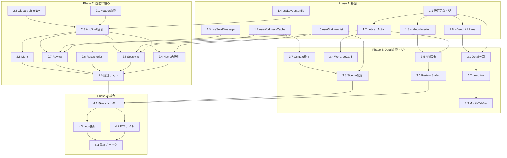

# Issue #600 作業計画書

## Issue: ホーム中心のUX刷新とWorktree Detail中心導線の再設計
**Issue番号**: #600
**サイズ**: L（大規模UXリファクタリング）
**優先度**: High
**依存Issue**: なし
**設計方針書**: `dev-reports/design/issue-600-ux-refresh-design-policy.md`

---

## Phase 1: 基盤・共通ロジック・設定定数

### Task 1.1: 設定定数・型定義
- **成果物**:
  - `src/config/review-config.ts` - STALLED_THRESHOLD_MS, REVIEW_POLL_INTERVAL_MS
  - `src/types/ui-state.ts` - DeepLinkPane型追加
- **依存**: なし
- **テスト**: 型チェックのみ

### Task 1.2: getNextAction() ヘルパー
- **成果物**:
  - `src/lib/session/next-action-helper.ts` - getNextAction(), getReviewStatus()
- **依存**: Task 1.1
- **テスト**: `tests/unit/next-action-helper.test.ts`（全SessionStatus×PromptType×isStalled組み合わせ）

### Task 1.3: stalled-detector モジュール
- **成果物**:
  - `src/lib/detection/stalled-detector.ts` - isWorktreeStalled()
- **依存**: Task 1.1（review-config.ts）
- **テスト**: `tests/unit/stalled-detector.test.ts`（閾値境界テスト）

### Task 1.4: useLayoutConfig() フック
- **成果物**:
  - `src/hooks/useLayoutConfig.ts` - LAYOUT_MAP, useLayoutConfig()
- **依存**: なし
- **テスト**: `tests/unit/useLayoutConfig.test.ts`（各パス→フラグマッピング、デフォルト値検証）

### Task 1.5: useSendMessage() フック
- **成果物**:
  - `src/hooks/useSendMessage.ts` - send, isSending, error, onSuccess/onError
- **依存**: なし
- **テスト**: `tests/unit/useSendMessage.test.ts`（送信成功/失敗、コールバック呼び出し）

### Task 1.6: useWorktreeList() 共通フック
- **成果物**:
  - `src/hooks/useWorktreeList.ts` - ソート・フィルタ・グループ化ロジック
- **依存**: なし
- **テスト**: `tests/unit/useWorktreeList.test.ts`（ソート・フィルタ・グループ化）

### Task 1.7: useWorktreesCache() 共有キャッシュ（薄いラッパー）
- **成果物**:
  - `src/hooks/useWorktreesCache.ts` - worktrees一覧の唯一の取得元
- **依存**: なし
- **テスト**: `tests/unit/useWorktreesCache.test.ts`

### Task 1.8: isDeepLinkPane() 型ガード
- **成果物**:
  - `src/lib/deep-link-validator.ts` - isDeepLinkPane(), VALID_PANES
- **依存**: Task 1.1
- **テスト**: `tests/unit/deep-link-validator.test.ts`（有効値・無効値・フォールバック）

---

## Phase 2: 画面枠組み・ナビゲーション

### Task 2.1: Header.tsx PC 5画面ナビゲーション改修
- **成果物**: `src/components/layout/Header.tsx` 改修
- **依存**: なし
- **テスト**: 既存テスト修正

### Task 2.2: GlobalMobileNav.tsx 新設
- **成果物**: `src/components/mobile/GlobalMobileNav.tsx`
- **依存**: なし
- **テスト**: `tests/unit/GlobalMobileNav.test.ts`

### Task 2.3: AppShell.tsx useLayoutConfig統合
- **成果物**: `src/components/layout/AppShell.tsx` 改修
- **依存**: Task 1.4, Task 2.1, Task 2.2
- **テスト**: 既存テスト修正 + デフォルト値テスト

### Task 2.4: Home画面（`/`）再設計
- **成果物**:
  - `src/app/page.tsx` 全面書き換え
  - `src/components/home/HomeSessionSummary.tsx` 新設
- **依存**: Task 1.7, Task 2.3
- **テスト**: スモークテスト、ショートカットカード表示テスト

### Task 2.5: Sessions画面（`/sessions`）新設
- **成果物**: `src/app/sessions/page.tsx`
- **依存**: Task 1.6, Task 1.7, Task 2.3
- **テスト**: スモークテスト、フィルタ・ソートテスト

### Task 2.6: Repositories画面（`/repositories`）新設
- **成果物**: `src/app/repositories/page.tsx`
- **依存**: Task 2.3
- **テスト**: スモークテスト

### Task 2.7: Review画面（`/review`）新設（Done/Approvalフィルタ先行）
- **成果物**:
  - `src/app/review/page.tsx`
  - `src/components/review/ReviewCard.tsx`
  - `src/components/review/SimpleMessageInput.tsx`
- **依存**: Task 1.2, Task 1.5, Task 2.3
- **テスト**: Done/Approvalフィルタテスト、SimpleMessageInput送信テスト

### Task 2.8: More画面（`/more`）新設
- **成果物**: `src/app/more/page.tsx`
- **依存**: Task 2.3
- **テスト**: スモークテスト、ExternalAppsManager表示テスト

### Task 2.9: 認証テスト追加
- **成果物**: `tests/integration/auth-middleware.test.ts` に新規URL4件のテストケース追加
- **依存**: Task 2.4〜2.8
- **テスト**: 認証なしアクセス拒否、AUTH_EXCLUDED_PATHS除外検証

---

## Phase 3: deep link・Detail画面改修・API拡張

### Task 3.1: WorktreeDetailRefactored 事前分割
- **成果物**:
  - `src/components/worktree/WorktreeDetailHeader.tsx` 抽出
  - `src/hooks/useWorktreeTabState.ts` 抽出（DeepLinkPaneバリデーション含む）
- **依存**: Task 1.1, Task 1.8
- **テスト**: 既存テスト修正

### Task 3.2: deep link useSearchParams移行
- **成果物**:
  - `src/components/worktree/WorktreeDetailRefactored.tsx` 改修
  - `src/types/ui-state.ts` 更新
  - `src/types/ui-actions.ts` 更新
  - `src/hooks/useWorktreeUIState.ts` 更新
  - `src/components/worktree/LeftPaneTabSwitcher.tsx` 更新
- **依存**: Task 3.1
- **テスト**: `tests/unit/deep-link.test.ts`（pane切替、マッピング、フォールバック）

### Task 3.3: MobileTabBar searchParams統合
- **成果物**: `src/components/mobile/MobileTabBar.tsx` 改修
- **依存**: Task 3.2
- **テスト**: 既存テスト修正

### Task 3.4: WorktreeCard 次アクション表示追加
- **成果物**: `src/components/worktree/WorktreeCard.tsx` 改修
- **依存**: Task 1.2
- **テスト**: 次アクション表示テスト

### Task 3.5: worktrees API拡張（?include=review）
- **成果物**: `src/app/api/worktrees/route.ts` 改修
- **依存**: Task 1.2, Task 1.3
- **テスト**: `tests/integration/worktrees-api-review.test.ts`

### Task 3.6: Review画面 Stalled判定統合
- **成果物**: `src/app/review/page.tsx` 改修
- **依存**: Task 3.5
- **テスト**: Stalledフィルタテスト

### Task 3.7: WorktreeSelectionContext → useWorktreesCache移行
- **成果物**:
  - `src/contexts/WorktreeSelectionContext.tsx` 改修（一覧取得責務を削除）
  - `src/contexts/AppProviders.tsx` 改修
- **依存**: Task 1.7
- **テスト**: 既存テスト修正

### Task 3.8: Sidebar useWorktreeList統合
- **成果物**: `src/components/layout/Sidebar.tsx` 改修
- **依存**: Task 1.6, Task 3.7
- **テスト**: 既存テスト修正

---

## Phase 4: 統合・テスト・ドキュメント

### Task 4.1: 既存テスト修正（退行テスト）
- **成果物**: 影響を受ける38ファイル以上のテスト修正
- **依存**: Phase 1-3完了
- **テスト**: 全テストパス

### Task 4.2: E2Eテスト更新
- **成果物**: ナビゲーション変更に伴うE2Eテスト更新
- **依存**: Phase 1-3完了
- **テスト**: E2Eテストパス

### Task 4.3: docs/architecture.md 更新
- **成果物**: URL設計・画面遷移図・ナビゲーション構造セクション追加
- **依存**: Phase 1-3完了

### Task 4.4: 最終品質チェック
- **成果物**: 全チェックパス
- **依存**: Task 4.1〜4.3

---

## タスク依存関係

---

## 品質チェック項目

| チェック項目 | コマンド | 基準 |
|-------------|----------|------|
| ESLint | `npm run lint` | エラー0件 |
| TypeScript | `npx tsc --noEmit` | 型エラー0件 |
| Unit Test | `npm run test:unit` | 全テストパス |
| Build | `npm run build` | 成功 |

---

## 成果物チェックリスト

### 新規ファイル（約15個）
- [ ] `src/config/review-config.ts`
- [ ] `src/lib/session/next-action-helper.ts`
- [ ] `src/lib/detection/stalled-detector.ts`
- [ ] `src/lib/deep-link-validator.ts`
- [ ] `src/hooks/useLayoutConfig.ts`
- [ ] `src/hooks/useSendMessage.ts`
- [ ] `src/hooks/useWorktreeList.ts`
- [ ] `src/hooks/useWorktreesCache.ts`
- [ ] `src/hooks/useWorktreeTabState.ts`
- [ ] `src/app/sessions/page.tsx`
- [ ] `src/app/repositories/page.tsx`
- [ ] `src/app/review/page.tsx`
- [ ] `src/app/more/page.tsx`
- [ ] `src/components/mobile/GlobalMobileNav.tsx`
- [ ] `src/components/home/HomeSessionSummary.tsx`
- [ ] `src/components/review/ReviewCard.tsx`
- [ ] `src/components/review/SimpleMessageInput.tsx`
- [ ] `src/components/worktree/WorktreeDetailHeader.tsx`

### 主要変更ファイル（約15個）
- [ ] `src/app/page.tsx` - 全面書き換え
- [ ] `src/components/layout/Header.tsx` - PC 5画面ナビ追加
- [ ] `src/components/layout/AppShell.tsx` - useLayoutConfig統合
- [ ] `src/components/worktree/WorktreeDetailRefactored.tsx` - 分割・deep link
- [ ] `src/components/worktree/WorktreeCard.tsx` - 次アクション表示
- [ ] `src/components/mobile/MobileTabBar.tsx` - searchParams統合
- [ ] `src/types/ui-state.ts` - DeepLinkPane型追加
- [ ] `src/types/ui-actions.ts` - アクション型更新
- [ ] `src/hooks/useWorktreeUIState.ts` - reducer更新
- [ ] `src/components/worktree/LeftPaneTabSwitcher.tsx` - 拡張tab対応
- [ ] `src/app/api/worktrees/route.ts` - ?include=review対応
- [ ] `src/contexts/WorktreeSelectionContext.tsx` - 責務限定
- [ ] `src/contexts/AppProviders.tsx` - キャッシュProvider追加
- [ ] `src/components/layout/Sidebar.tsx` - useWorktreeList統合
- [ ] `docs/architecture.md` - URL設計追記

### テスト（新規 + 修正）
- [ ] 新規ユニットテスト: 8ファイル以上
- [ ] 新規統合テスト: 2ファイル以上
- [ ] 既存テスト修正: 38ファイル以上
- [ ] E2Eテスト更新

---

## Definition of Done

- [ ] すべてのタスクが完了
- [ ] `npx tsc --noEmit` パス
- [ ] `npm run lint` エラー0件
- [ ] `npm run test:unit` 全テストパス
- [ ] `npm run build` 成功
- [ ] 新規URL4件の認証テストパス
- [ ] 既存機能（send/prompt/terminal/files/logs/notes/auto-yes）の退行なし
- [ ] deep link（?pane=xxx）でタブ復元動作
- [ ] Review画面のDone/Approval/Stalledフィルタ動作
- [ ] PC/モバイル整合ナビゲーション動作
- [ ] docs/architecture.md 更新完了
- [ ] APIオプショナルフィールドのCLI後方互換性維持

---

## 次のアクション

1. **TDD実装開始**: `/pm-auto-dev 600` で自動開発フロー開始
2. **Phase 1 から順次実装**: 基盤→画面枠組み→Detail改修→統合テスト
3. **進捗報告**: `/progress-report` で定期報告
4. **PR作成**: `/create-pr` で自動作成
