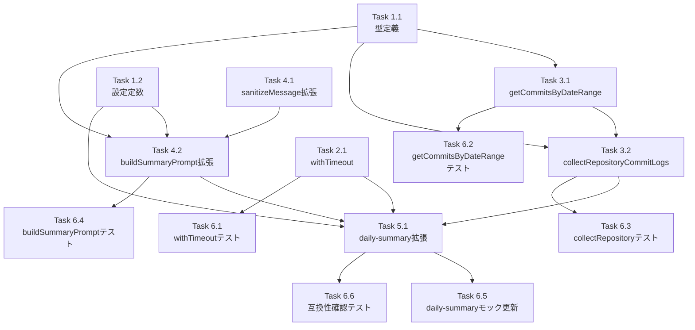

# Issue #627 作業計画書

## Issue: feat: レポート生成時に全リポジトリの当日コミットログをプロンプトに含める

**Issue番号**: #627  
**サイズ**: M  
**優先度**: Medium  
**依存Issue**: なし  
**設計方針書**: `dev-reports/design/issue-627-commit-log-in-report-design-policy.md`

---

## 詳細タスク分解

### Phase 1: 型定義・設定定数追加

- [ ] **Task 1.1**: 型定義の追加（`src/types/git.ts`）
  - `CommitLogEntry` = `Pick<CommitInfo, 'shortHash' | 'message' | 'author'>` を追加
  - `RepositoryCommitLogs` = `Map<string, { name: string; commits: CommitLogEntry[] }>` を追加
  - 成果物: `src/types/git.ts`（追記）
  - 依存: なし

- [ ] **Task 1.2**: 設定定数追加（`src/config/review-config.ts`）
  - `MAX_COMMIT_LOG_LENGTH = 3000` を追加
  - `GIT_LOG_TOTAL_TIMEOUT_MS = 15000` を追加
  - 成果物: `src/config/review-config.ts`（追記）
  - 依存: なし

### Phase 2: ユーティリティ追加

- [ ] **Task 2.1**: `withTimeout` ユーティリティ追加（`src/lib/utils.ts`）
  - シグネチャ: `withTimeout<T>(promise: Promise<T>, timeoutMs: number, fallback?: T): Promise<T>`
  - フォールバック値指定時: タイムアウト時にフォールバック値を resolve
  - フォールバック値省略時: `TimeoutError` で reject
  - 成果物: `src/lib/utils.ts`（追記）
  - 依存: Task 1.1

### Phase 3: git-utils.ts 拡張

- [ ] **Task 3.1**: `getCommitsByDateRange` 関数実装（`src/lib/git/git-utils.ts`）
  - `GIT_COMMIT_LOG_TIMEOUT_MS = 5000` をファイルスコープ定数として追加
  - `fs.existsSync` でパス存在確認（不存在時は空配列返却）
  - `execFileAsync` 直接呼び出し（カスタムタイムアウト対応）
  - git log フォーマット: `%h\x1f%s\x1f%an`（Unit Separator区切り）
  - パース処理: 行ごとに `\x1f` 分割、フィールド数3検証
  - エラー時は空配列返却（ログ出力あり）
  - 成果物: `src/lib/git/git-utils.ts`（追記）
  - 依存: Task 1.1

- [ ] **Task 3.2**: `collectRepositoryCommitLogs` 関数実装（`src/lib/git/git-utils.ts`）
  - シグネチャ: `collectRepositoryCommitLogs(repositories: Array<{path:string; name:string}>, since: string, until: string): Promise<RepositoryCommitLogs>`
  - `Promise.allSettled` で並列実行
  - 空コミットのリポジトリはスキップ
  - 成果物: `src/lib/git/git-utils.ts`（追記）
  - 依存: Task 3.1

### Phase 4: summary-prompt-builder.ts 拡張

- [ ] **Task 4.1**: `sanitizeMessage` 拡張（`src/lib/summary-prompt-builder.ts`）
  - `ESCAPED_TAGS = ['user_data', 'commit_log']` 定数配列を追加（非export）
  - `sanitizeMessage` のタグエスケープをループ処理に変更（OCP準拠）
  - 成果物: `src/lib/summary-prompt-builder.ts`（変更）
  - 依存: なし

- [ ] **Task 4.2**: `buildSummaryPrompt` 第4引数追加（`src/lib/summary-prompt-builder.ts`）
  - 第4引数: `commitLogs?: RepositoryCommitLogs`
  - `<commit_log>` セクション構築ロジック追加
  - `MAX_COMMIT_LOG_LENGTH` によるトランケーション処理
  - 最終プロンプト全体が `MAX_MESSAGE_LENGTH` 以内に収まるよう総量制御
  - 成果物: `src/lib/summary-prompt-builder.ts`（変更）
  - 依存: Task 1.1, Task 1.2, Task 4.1

### Phase 5: daily-summary-generator.ts 拡張

- [ ] **Task 5.1**: コミットログ収集・プロンプト構築更新（`src/lib/daily-summary-generator.ts`）
  - `getRepositories(db)` でリポジトリ一覧取得
  - `dayStart.toISOString()` / `dayEnd.toISOString()` で ISO 8601形式に変換
  - `withTimeout(collectRepositoryCommitLogs(...), GIT_LOG_TOTAL_TIMEOUT_MS, new Map())` で収集
  - `buildSummaryPrompt` の第4引数に `commitLogs` を渡す
  - 成果物: `src/lib/daily-summary-generator.ts`（変更）
  - 依存: Task 2.1, Task 3.2, Task 4.2

### Phase 6: テスト実装

- [ ] **Task 6.1**: `withTimeout` テスト追加（`tests/unit/lib/utils.test.ts`）
  - 正常時・タイムアウト時（フォールバックあり/なし）のテスト
  - 依存: Task 2.1

- [ ] **Task 6.2**: `getCommitsByDateRange` テスト追加（`tests/unit/lib/git/git-utils.test.ts`）
  - ※ `tests/unit/lib/git/` ディレクトリ新規作成が必要
  - 通常取得・パス不存在スキップ・タイムアウト・空コミット・パースエラーのテスト
  - `execFileAsync` のモック使用
  - 依存: Task 3.1

- [ ] **Task 6.3**: `collectRepositoryCommitLogs` テスト追加（`tests/unit/lib/git/git-utils.test.ts`）
  - 空コミットスキップ・部分失敗での継続のテスト
  - 依存: Task 3.2

- [ ] **Task 6.4**: `buildSummaryPrompt` テスト追加（`tests/unit/lib/summary-prompt-builder.test.ts`）
  - `<commit_log>` セクション構築・トランケーション・タグエスケープ・後方互換のテスト
  - 依存: Task 4.2

- [ ] **Task 6.5**: `daily-summary-generator.test.ts` のモック更新
  - `getRepositories` モック追加
  - `collectRepositoryCommitLogs` モック追加（`@/lib/git/git-utils` のモック）
  - `@/config/review-config` モックに `GIT_LOG_TOTAL_TIMEOUT_MS` を追加
  - 依存: Task 5.1

- [ ] **Task 6.6**: 互換性確認テスト
  - `tests/integration/api-worktrees.test.ts`: `getRepositories()` の `/api/worktrees` 後方互換性確認
  - `tests/unit/components/review/ReportTab.test.tsx`: `/api/daily-summary` の generate フロー互換性確認
  - 依存: Task 5.1

---

## タスク依存関係

---

## 実装順序（推奨）

1. Task 1.1 → Task 1.2（型・定数の基盤）
2. Task 2.1（withTimeout）
3. Task 4.1（sanitizeMessage拡張）
4. Task 3.1 → Task 3.2（git-utils拡張）
5. Task 4.2（buildSummaryPrompt拡張）
6. Task 5.1（daily-summary-generator拡張）
7. Task 6.1〜6.6（テスト実装）

---

## 品質チェック項目

| チェック項目 | コマンド | 基準 |
|-------------|----------|------|
| ESLint | `npm run lint` | エラー0件 |
| TypeScript | `npx tsc --noEmit` | 型エラー0件 |
| Unit Test | `npm run test:unit` | 全テストパス |
| Build | `npm run build` | 成功 |

---

## 変更ファイルサマリー

| ファイル | 変更種別 |
|---------|---------|
| `src/types/git.ts` | 型定義追加 |
| `src/config/review-config.ts` | 定数追加 |
| `src/lib/utils.ts` | withTimeout追加 |
| `src/lib/git/git-utils.ts` | 2関数・1定数追加 |
| `src/lib/summary-prompt-builder.ts` | sanitizeMessage拡張・buildSummaryPrompt拡張 |
| `src/lib/daily-summary-generator.ts` | コミットログ収集・プロンプト構築更新 |
| `tests/unit/lib/utils.test.ts` | withTimeoutテスト追加 |
| `tests/unit/lib/git/git-utils.test.ts` | 新規作成 |
| `tests/unit/lib/summary-prompt-builder.test.ts` | テスト追加 |
| `tests/unit/lib/daily-summary-generator.test.ts` | モック更新 |
| `tests/integration/api-worktrees.test.ts` | 互換性確認 |
| `tests/unit/components/review/ReportTab.test.tsx` | 互換性確認 |

---

## Definition of Done

- [ ] 全タスク完了
- [ ] `npm run lint` エラー0件
- [ ] `npx tsc --noEmit` 型エラー0件
- [ ] `npm run test:unit` 全テストパス
- [ ] `npm run build` 成功
- [ ] 受入条件が全て満たされていること（Issue #627参照）
