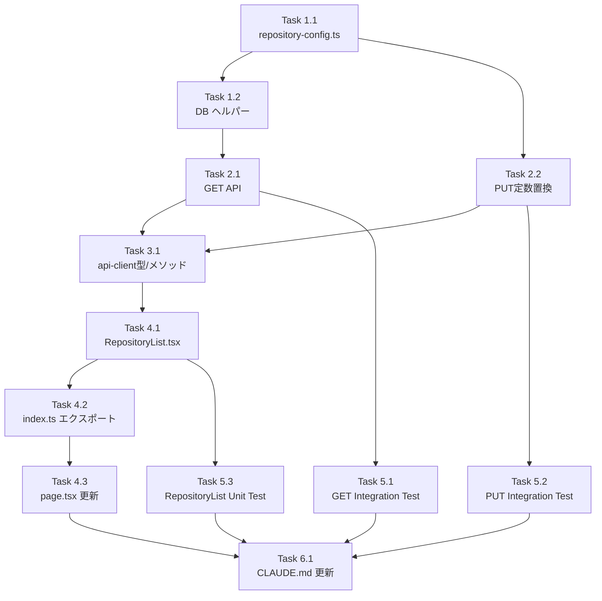

# 作業計画: Issue #644

## Issue: feat(repositories): リポジトリ一覧表示と別名編集UI

**Issue番号**: #644  
**サイズ**: M  
**優先度**: Medium  
**依存Issue**: #642（DB/API側 `display_name` 実装 - 完了済み）  
**ブランチ**: `feature/644-worktree`（現在のブランチ）

---

## Issue概要

`/repositories` 画面にリポジトリ一覧表示と別名（`display_name`）のインライン編集UIを追加する。

### 主な変更点

| レイヤー | 変更内容 |
|---------|---------|
| Config | `src/config/repository-config.ts` 新規作成（`MAX_DISPLAY_NAME_LENGTH` 共有定数） |
| DB | `getAllRepositoriesWithWorktreeCount()` ヘルパー追加（`src/lib/db/db-repository.ts`） |
| API | `GET /api/repositories` 新規追加（`src/app/api/repositories/route.ts` に追記） |
| API | `PUT /api/repositories/[id]` 定数置換（ローカル定数 → 共有定数 import） |
| Client | `repositoryApi.list()` / `repositoryApi.updateDisplayName()` 追加 |
| UI | `src/components/repository/RepositoryList.tsx` 新規作成 |
| UI | `src/app/repositories/page.tsx` 更新（`RepositoryList` を上部に追加） |
| Tests | Integration × 2 + Unit × 1 追加 |

---

## 詳細タスク分解

### Phase 1: 共有定数・DBレイヤー（依存なし）

#### Task 1.1: 共有定数ファイル作成
- **成果物**: `src/config/repository-config.ts`
- **内容**: `export const MAX_DISPLAY_NAME_LENGTH = 100;`
- **依存**: なし

#### Task 1.2: DB ヘルパー追加
- **成果物**: `src/lib/db/db-repository.ts`（関数追加）
- **内容**: `getAllRepositoriesWithWorktreeCount(db)` を新規追加
  ```sql
  SELECT r.*, 
    (SELECT COUNT(*) FROM worktrees w WHERE w.repository_path = r.path) AS worktree_count
  FROM repositories r 
  ORDER BY r.name ASC
  ```
- **注意**: 既存 `getAllRepositories(db)` のシグネチャは**変更しない**（S3-005）
- **依存**: Task 1.1

---

### Phase 2: APIレイヤー

#### Task 2.1: GET /api/repositories 追加
- **成果物**: `src/app/api/repositories/route.ts`（GETハンドラ追記）
- **内容**:
  - `getAllRepositoriesWithWorktreeCount(db)` を呼び出す
  - レスポンス: `{ success: true, repositories: RepositoryListItem[] }`
  - 認証ミドルウェアは既存のまま流用（追加変更不要）
- **依存**: Task 1.2

#### Task 2.2: PUT /api/repositories/[id] 定数置換
- **成果物**: `src/app/api/repositories/[id]/route.ts`（ローカル定数削除・import追加）
- **内容**:
  - `const MAX_DISPLAY_NAME_LENGTH = 100;` を削除
  - `import { MAX_DISPLAY_NAME_LENGTH } from '@/config/repository-config';` を追加
  - エラーメッセージ文言は変更しない（S3-003）
- **依存**: Task 1.1

---

### Phase 3: api-client 型・メソッド追加

#### Task 3.1: 型定義・メソッド追加
- **成果物**: `src/lib/api-client.ts`
- **内容**:
  ```ts
  export type RepositoryListItem = {
    id: string;
    name: string;
    displayName: string | null;
    path: string;
    enabled: boolean;
    worktreeCount: number;
  };
  
  export type UpdateRepositoryDisplayNameResponse = {
    success: boolean;
    repository: Omit<RepositoryListItem, 'worktreeCount'>;
  };
  
  // repositoryApi に追加:
  async list(): Promise<{ success: boolean; repositories: RepositoryListItem[] }>
  async updateDisplayName(id: string, displayName: string | null): Promise<UpdateRepositoryDisplayNameResponse>
  ```
- **依存**: Task 2.1, Task 2.2

---

### Phase 4: UIコンポーネント

#### Task 4.1: RepositoryList コンポーネント作成
- **成果物**: `src/components/repository/RepositoryList.tsx`
- **内容**:
  - Props: `{ refreshKey: number; onChanged: () => void }`
  - マウント時に `repositoryApi.list()` を呼び出し、state に保持
  - `refreshKey` 変更時に再フェッチ
  - 各行にインライン別名編集機能（編集ボタン → input → 保存/キャンセル）
  - Enter で保存、Esc でキャンセル（キーボード操作）
  - `enabled=false` の行に "Disabled" バッジを表示
  - `MAX_DISPLAY_NAME_LENGTH` を `src/config/repository-config.ts` から import してバリデーション
  - 保存は `repositoryApi.updateDisplayName()` を呼ぶ
  - 保存成功後は該当行のみ局所更新（worktreeCount は既存値を保持）
  - 失敗時はエラーメッセージ表示・入力値を保持
  - ダークモード対応（Tailwind CSS）
  - `React.memo` / `useCallback` で過剰な再レンダリングを防止
- **依存**: Task 3.1

#### Task 4.2: RepositoryList を index.ts にエクスポート追加
- **成果物**: `src/components/repository/index.ts`
- **内容**: `export { RepositoryList } from './RepositoryList';` を追加
- **依存**: Task 4.1

#### Task 4.3: Repositories ページ更新
- **成果物**: `src/app/repositories/page.tsx`
- **内容**:
  - `RepositoryList` を `RepositoryManager` の**上部**に配置（一覧ファースト）
  - `refreshKey` state と `handleChanged` コールバックを導入
  ```tsx
  const [refreshKey, setRefreshKey] = useState(0);
  const handleChanged = useCallback(() => setRefreshKey((k) => k + 1), []);
  // <RepositoryList refreshKey={refreshKey} onChanged={handleChanged} />
  // <RepositoryManager onRepositoryAdded={handleChanged} />
  ```
- **依存**: Task 4.2

---

### Phase 5: テスト

#### Task 5.1: GET /api/repositories Integration テスト
- **成果物**: `tests/integration/api-repositories-list.test.ts`（新規）
- **テスト内容**:
  - 成功パス（200 + `{ success: true, repositories: [...] }`）
  - `enabled=0` を含む全件返却の確認
  - `worktreeCount` 集計の正しさ（worktree 0件・複数件）
  - `repository_path` ベースの集計が動作すること（S3-001 回帰防止）
  - 返却フィールドが仕様通り（`id, name, displayName, path, enabled, worktreeCount`）
  - 既存 `tests/integration/api-repository-delete.test.ts` を雛形にする
- **依存**: Task 2.1

#### Task 5.2: PUT /api/repositories/[id] Integration テスト
- **成果物**: `tests/integration/api-repositories-put.test.ts`（新規）
- **テスト内容**:
  - バリデーション（100文字超で 400）
  - trim 後の空文字 → null 扱い
  - 404（存在しない id）
  - 成功パス（200 + `{ success: true, repository: {...} }`）
  - エラーメッセージ文言の回帰確認（S3-003）
- **依存**: Task 2.2

#### Task 5.3: RepositoryList Unit テスト
- **成果物**: `tests/unit/components/repository/RepositoryList.test.tsx`（新規）
- **テスト内容**:
  - 一覧レンダリング（名前・別名・パス・worktree数・enabledバッジ）
  - インライン編集モード切替（編集ボタン → input → 保存/キャンセル）
  - 保存成功時のUI更新（該当行の局所更新）
  - バリデーション：100文字超でクライアント側エラー
  - Enter 保存、Esc キャンセルのキーボード操作
  - `enabled=false` のリポジトリに "Disabled" バッジが描画
  - 既存 `tests/unit/components/repository/RepositoryManager.test.tsx` を参考
- **依存**: Task 4.1

---

### Phase 6: ドキュメント更新

#### Task 6.1: CLAUDE.md 更新
- **成果物**: `CLAUDE.md`
- **内容**: 主要モジュール一覧に以下を追記
  - `src/config/repository-config.ts`
  - `src/components/repository/RepositoryList.tsx`
  - `src/app/api/repositories/route.ts`（GET追加の注記）
- **依存**: Phase 4, Phase 5 完了後

---

## タスク依存関係



---

## 実装順序（推奨）

1. Task 1.1（共有定数）
2. Task 1.2（DB ヘルパー）
3. Task 2.1（GET API）+ Task 2.2（PUT 定数置換） ← 並行可
4. Task 3.1（api-client）
5. Task 4.1（RepositoryList）→ Task 4.2（index.ts）→ Task 4.3（page.tsx）
6. Task 5.1 + Task 5.2 + Task 5.3（テスト3本）← 並行可
7. Task 6.1（CLAUDE.md）

---

## 品質チェック項目

| チェック項目 | コマンド | 基準 |
|-------------|----------|------|
| ESLint | `npm run lint` | エラー0件 |
| TypeScript | `npx tsc --noEmit` | 型エラー0件 |
| Unit Test | `npm run test:unit` | 全テストパス |
| Integration Test | `npm run test:integration` | 全テストパス |
| Build | `npm run build` | 成功 |

---

## Definition of Done

- [ ] Task 1.1〜6.1 すべて完了
- [ ] `npm run lint` エラー0件
- [ ] `npx tsc --noEmit` 型エラー0件
- [ ] `npm run test:unit` 全パス
- [ ] `npm run test:integration` 全パス
- [ ] 新規テスト3ファイルが追加されている
- [ ] 既存 `getAllRepositories(db)` のシグネチャが変更されていない
- [ ] 既存 `src/app/api/repositories/sync/route.ts` と `src/lib/daily-summary-generator.ts` が変更されていない
